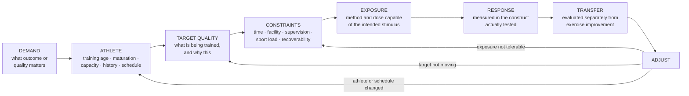

# G3 101 — Foundations of Athletic Performance

**Version:** 2.0
**Evidence Review Gate:** PASS WITH DECLARED EVIDENCE LIMITS
**Status:** APPROVED FOR NOVAKORE PRODUCTION upon successful production QA
**Authority:** G3 Performance

## Production-Ready Course Specification (Authoritative Build Document)

**Course code:** G3-101
**Course title:** Foundations of Athletic Performance
**Division:** G3 Performance, the human performance division of G3 Sports & Fitness
**Document class:** Authoritative production specification — NovaKore build source
**Date:** August 2026
**Owner / approver:** JR Romero, CSCS — Director of Training, G3 Performance
**Production precedent:** G3 102, G3 103, G3 104, and G3 105 Course Specifications and NovaKore Build files, v1.0 FINAL
**Supersedes:** All prior G3 101 production artifacts, outlines, drafts, and research notes

---

## 0. DOCUMENT CONTROL

### 0.1 Replacement notice

**This is a replacement production pass.** G3 101 v2.0 supersedes the prior G3 101 production in its entirety. Where the prior production conflicts with this specification, the G3 101 v2.0 Production Handoff, or the G3 101 FINAL Evidence Pack, **this document governs and the prior artifacts are withdrawn**.

Coaches holding a G3 101 completion record under the prior production are recorded as complete. Their record is not invalidated by this replacement. Whether a bridging module is required is a Director of Training decision recorded under §23.2, and is not created by this specification.

### 0.2 Status of this document

| Stage | Artifact | Status | Notes |
|---|---|---|---|
| Evidence acquisition | G3 101 Foundations of Athletic Performance Evidence Pack FINAL | **COMPLETE** | Research document only. Creates no doctrine, standard, competency, architecture, assessment, or specification. |
| Evidence review gate | Same | **PASS WITH DECLARED EVIDENCE LIMITS** | Sixteen conditions carried forward — §0.3. |
| G3 doctrine review | ChatGPT → Claude Production Handoff v2.0 | **COMPLETE** | Supplies doctrine, Applied Standards, Coach Judgment boundaries, architecture, and gating. |
| Production | This specification + `G3-101-NovaKore-Build-v2.0-FINAL.json` | **COMPLETE** | Claude owns specification writing, JSON production, consistency QA, and packaging. |
| Production QA | This specification + build file | **PASSED** — see §21.6 | Status on completion: **APPROVED FOR NOVAKORE PRODUCTION**. |

### 0.3 Declared evidence limits carried forward

Sixteen conditions from the handoff §22 are carried into production. Each is enforced at a named location rather than acknowledged in a preface and forgotten.

| # | Condition | Where it is enforced |
|---|---|---|
| 1 | Adult and male dominance in several training literatures | Population-transfer disclosure in every module evidence block (AS-101-16, §18.3) |
| 2 | Youth evidence supports supervised training but not automatic adult dosing | §18.1; D101-15 teaching boundary; M9 |
| 3 | Female athletes remain underrepresented in several performance domains | §18.2; disclosure at the point of the claim |
| 4 | Exact adaptation and recovery timing cannot be determined from simple field models | D101-02, D101-11; §17.4 Class E treatment of supercompensation |
| 5 | Exact individualized dose thresholds are unresolved | D101-12; CJ-05, CJ-06; **Unknown** certainty |
| 6 | Exact periodization-model superiority is unresolved | D101-09; CJ-07; §17.4; Case 11 |
| 7 | Concurrent-training interference is conditional | D101-13; CJ-08; M8; Case 4 |
| 8 | Direct exercise-to-sport transfer requires stronger evidence than mechanical resemblance | D101-05, D101-06; M4; Case 2 |
| 9 | Readiness measures are contextual | D101-17; AS-101-07; CJ-11, CJ-12; Case 6 |
| 10 | ACWR is not a standalone injury predictor | §19.5; CA-25; CJ-13; Case 7 |
| 11 | Movement screens are not standalone injury predictors | §19; CA-23; CJ-14; Case 8 |
| 12 | Asymmetry has no universal predictive threshold | §19; CA-24; CJ-15 |
| 13 | Testing changes require interpretation against error | AS-101-10; D101-18; Case 9 |
| 14 | "Nonresponse" requires caution | CA-28; M5; Case 10 |
| 15 | Historical frameworks remain distinct from empirical doctrine | §17.4 — all ten rendered **Class E** |
| 16 | Practitioner taxonomies such as GPP/SPP require organizational adoption for standardized use | §3.3 — adopted as **G3 Applied Standard language**, classified **E / Organizational Choice** |

**Internal production rule.** These limits do not block internal G3 or NovaKore production. Every taught claim is anchored to a verified source record, and the Evidence Pack's Citation-Integrity Audit resolves every citation identifier to a unique library entry (§20.3). External CEU recognition, accreditation submission, and public release remain gated (§20.5).

---

### 0.4 Foundations Authority Rule

*Added by the G3 Performance Foundations — 101–105 Curriculum Review Gate v1.0 (Correction 2). Governance text only — no doctrine, evidence class, module architecture, course outcome, practical sign-off, terminal defense, or decision model was changed.*

**The G3 Performance Foundations series is G3 101 → G3 102 → G3 103 → G3 104 → G3 105.** Within it, authority is fixed as follows and does not vary by course, document, or context.

| Course | Authoritative on |
|---|---|
| **G3 101** | The **G3 reasoning system**: evidence classes, certainty language, Evidence / G3 Applied Standard / Coach Judgment separation, population-transfer disclosure, testing and monitoring interpretation, claim-correction symmetry, scope of practice, and evidence restraint. |
| **G3 102** | The **G3 programming decision model**: DEMAND → PROFILE → GAP → PRIORITY → PRESCRIPTION → RESPONSE → ADJUST, including programming priority and change governance. |
| **G3 103** | **Speed, deceleration, COD, and agility** — where its standard is narrower than the upstream rule. |
| **G3 104** | **Strength development** — where its standard is narrower than the upstream rule. |
| **G3 105** | **Power development** — where its standard is narrower than the upstream rule. |

**Two rules bind every course in the series:**

1. **No downstream course may loosen an upstream evidence, scope, measurement, or programming-integrity standard.**
2. **Where domain courses overlap, the more specific domain governs only inside that domain; otherwise the upstream standard controls.**

**This course's position.** **G3 101 is the entry course and the origin of the reasoning system.** It is authoritative on the first row above for every course in the series. It is **not** authoritative on programming priority or change governance — those are G3 102's — and it is not authoritative on any domain standard.

**Series attribution.** The three-layer discipline — Evidence / G3 Applied Standard / Coach Judgment — is attributed at series level to **G3 101**. Population-transfer governance is attributed at series level to **AS-101-16**, and may be restated locally: G3 103 restates it as **AS-103-12**, and G3 104 and G3 105 carry that restatement.

---

## 1. COURSE IDENTITY & PURPOSE

### 1.1 What this course is

G3 101 establishes **the reasoning system a G3 Performance Coach uses before selecting a method.**

It is not an exercise catalog. It is not a set of training laws. It is the course that makes every later G3 course legible, because it installs the distinctions — evidence from standard from judgment, exposure from adaptation, measurement from decision — that G3 102 through G3 105 assume the coach already holds.

The graduate leaves able to run one loop:

**DEFINE THE DEMAND → UNDERSTAND THE ATHLETE → IDENTIFY THE TARGET → SELECT THE EXPOSURE → APPLY SUFFICIENT DOSE → MANAGE RECOVERY → MEASURE THE RESPONSE → EVALUATE TRANSFER → ADJUST → DEFEND THE DECISION**

### 1.2 The ten governing distinctions

```
PRINCIPLE ≠ PRESCRIPTION
EXPOSURE ≠ ADAPTATION
FATIGUE ≠ EFFECTIVENESS
SORENESS ≠ ADAPTATION
SPECIFICITY ≠ VISUAL RESEMBLANCE
EXERCISE IMPROVEMENT ≠ SPORT TRANSFER
MONITORING ≠ DIAGNOSIS
MEASUREMENT ≠ DECISION
TECHNOLOGY ≠ SCIENTIFIC VALIDITY
HISTORICAL MODEL ≠ BIOLOGICAL LAW
```

Every module returns to at least one. A coach who collapses any of them cannot pass T-01.

### 1.3 The governing sequence

```
DEMAND → ATHLETE → TARGET QUALITY → CONSTRAINTS →
EXPOSURE → RESPONSE → TRANSFER → ADJUST
```

Eight stages, expanded operationally into the nine-step foundational loop of §5.2.

### 1.4 The nine obligations

Every foundational training decision a G3 coach makes must satisfy all nine. They are the structure of PS-4, the structure of T-01, and the coach-facing card in Appendix A.

1. **Define the performance demand.** What outcome or physical quality actually matters here?
2. **Understand the athlete.** Training age, chronological age, maturation, current capacity, history, schedule, availability, constraints.
3. **Identify the target.** What quality is being trained, and why this one?
4. **Select an appropriate exposure.** A method capable of producing the intended stimulus.
5. **Apply sufficient dose.** Enough to create adaptation, without assuming more is better.
6. **Preserve recoverability.** The training must fit the athlete's total sport, school, life, and recovery context.
7. **Measure the response.** Reliable, relevant information — not fatigue or soreness as proxies.
8. **Evaluate transfer.** Did the target outcome change, or did only the exercise change?
9. **Adjust.** Progress, maintain, regress, redistribute, or change — with a stated reason.

### 1.5 Course identity

| Field | Value |
|---|---|
| **Course** | G3 101 — Foundations of Athletic Performance |
| **Series** | G3 Performance Foundations — the entry course |
| **Audience** | New G3 Performance coaches; G3 Sports & Fitness staff entering the performance division; coaches transferring in with outside certification |
| **Prerequisite** | Active G3 Sports & Fitness employment or contract; no prior G3 course required. **G3 101 is the prerequisite for G3 102 and therefore for the entire Foundations series.** |
| **Nominal duration** | 12 modules · 17.5 hours of directed study (1,050 minutes; see §6.1) · plus practical evidence collected on the floor over a minimum 4-week window. |
| **Assessment** | Seven levels (§11), twelve applied assessments, twelve required cases, four practical sign-offs, one terminal defense. |
| **Standing** | G3 internal CEU course. Recognition by outside certifying bodies is not claimed and is gated on §20.5. |

### 1.6 What the graduate can do

Twenty-five outcomes, carried from the handoff §11 and mapped to the competencies of §13.

1. Define athletic performance and physical preparation. *(C101-01)*
2. Distinguish physical capacity from sport skill and sport performance. *(C101-01)*
3. Explain acute response versus chronic adaptation. *(C101-02)*
4. Explain overload as a multi-variable concept. *(C101-03)*
5. Select appropriate progression variables. *(C101-03)*
6. Explain multidimensional specificity. *(C101-04)*
7. Distinguish exercise improvement from transfer. *(C101-05)*
8. Use GPP / SPP / sport-specific / sport-practice language cautiously, as adopted G3 language rather than science. *(C101-01, C101-04)*
9. Identify meaningful athlete variables for individualization. *(C101-06)*
10. Use purposeful rather than novelty-driven variation. *(C101-07)*
11. Distinguish fatigue, soreness, recovery, and adaptation. *(C101-08)*
12. Explain why recovery cannot be reduced to a fixed timetable. *(C101-08)*
13. Reason about dose-response without false precision. *(C101-09)*
14. Explain concurrent-training interference conditionally. *(C101-10)*
15. Distinguish training age, chronological age, and biological maturation. *(C101-11)*
16. Coach youth development without unsupported age prohibitions. *(C101-12)*
17. Apply task-relevant technique standards without insisting on one universal movement solution. *(C101-13)*
18. Distinguish external and internal training load. *(C101-14)*
19. Evaluate ACWR, wellness, and readiness data conservatively. *(C101-14, C101-15)*
20. Explain validity, reliability, sensitivity, typical error, familiarization, and standardization. *(C101-15)*
21. Distinguish measurement from interpretation and prescription. *(C101-15)*
22. Integrate scientific evidence with coaching expertise and athlete/environment context. *(C101-16)*
23. Identify scope-of-practice boundaries. *(C101-17)*
24. Audit common performance-training claims. *(C101-18)*
25. Defend a foundational coaching decision using evidence, G3 Applied Standards, and Coach Judgment. *(C101-20)*

---

## 2. EVIDENCE CLASSIFICATION SYSTEM

### 2.1 The six classes

G3 101 originates the classification system used across the Foundations series. Every claim taught in this course carries a class, and every class carries a boundary.

| Class | Name | What it licenses | What it does not license |
|---|---|---|---|
| **A** | Established Evidence | Teaching as settled; building doctrine on it | Precision the evidence does not contain |
| **B** | Supported Practice | Teaching as the defensible default | Presenting it as established, or as the only option |
| **C** | Emerging / Conditional Evidence | Teaching as promising, with its conditions stated | Any assessment key, any prescription, any threshold |
| **D** | Applied Coaching Inference | Teaching as reasoning that follows from principle | Presenting it as a research finding |
| **E** | Historical / Practitioner Framework | Teaching as organizing language coaches will encounter | Presenting it as validated programming |
| **F** | Unsupported / Overstated Claim | Teaching as the error to be identified | Assertion as true — in content or in an item key |

### 2.2 The certainty labels

Class describes *what kind* of support a claim has. Certainty describes *how confident* the field is. Both are carried.

**Known · Probable · Possible · Unknown · Organizational Choice**

**Organizational Choice** is the label that matters most in a foundations course. It marks a statement that is true *because G3 decided it*, not because the evidence determined it. The GPP/SPP taxonomy (§3.3), the five-condition testing checklist (§15.3), and every G3 Applied Standard sit here. A coach who cannot tell an Organizational Choice from a finding will misrepresent G3 to an athlete, a parent, or another professional — which is why T-01 probes it directly.

### 2.3 Boundary classes are carried, not flattened

The Evidence Pack repeatedly assigns a **boundary** — **A/B**, **B/C**, **C/D**, **E/C**, **B / Probable, not absolute**. A boundary means the evidence sits between two classes and the honest reading is both. G3 101 carries boundaries in the form the pack assigned them. Flattening a boundary to a clean class misrepresents the evidence in one direction or the other, and is a production defect.

### 2.4 The four collapses this system exists to prevent

1. **Acute read as chronic.** A single-session response is not adaptation (D101-02).
2. **Association read as transfer.** A correlation between a quality and a sport outcome is not evidence that training the quality changes the outcome (D101-06).
3. **Model output read as measurement.** A supercompensation curve, a fitness-fatigue estimate, an ACWR value, and a readiness score are all model outputs (D101-17, D101-19).
4. **Heuristic read as law.** A historical framework is a way of organizing thought, not a biological mechanism (D101-01, §17.4).

### 2.5 Relationship to the later Foundations courses

G3 104 introduced a **U — Unresolved** class. In G3 101 that content is carried as the **Unknown** certainty label on an otherwise-classified claim, which is the Evidence Pack's own convention. The two are equivalent in force: *G3 does not know, and no G3 material may proceed as though it does.*

---

### 2.6 Series-level evidence taxonomy

*Added by the G3 Performance Foundations — 101–105 Curriculum Review Gate v1.0 (Correction 3). Recognition only — **no claim in this course has been reclassified.***

The G3 Performance Foundations series uses one taxonomy. **Every course recognizes all seven classes. No course is required to use all of them, and no claim is ever reclassified in order to populate a class.**

| Class | Name |
|---|---|
| **A** | Established Evidence |
| **B** | Supported Practice |
| **C** | Emerging / Conditional Evidence |
| **D** | Applied Coaching Inference |
| **E** | Historical / Practitioner Framework |
| **F** | Unsupported / Overstated Claim |
| **U** | Unresolved / Unknown |

**U is the machine-readable series class** for a question about which no defensible evidence-class assignment can be made. **"Unknown" remains the human-facing certainty label** for the same condition. The two are equivalent in force, and both mean: *G3 does not know, and no G3 material may proceed as though it does.*

**Classes used in this course:** **A, B, C, D, E, F**, and **U**. U is carried in this course as the **Unknown** certainty label (§2.2, §2.5), which is its human-facing form. The class table at §2.1 lists the six classes G3 101 assigns to claims; nothing in that table has changed.

---

## 3. CONTROLLED TERMINOLOGY

Fifteen terms. Each is a production term: NovaKore content, assessment items, and coach-facing material use these definitions and no others.

### 3.1 The fifteen terms

| Term | G3 definition | The error it prevents |
|---|---|---|
| **Athletic performance** | Multifactorial sport performance involving technical, tactical, perceptual-cognitive, physical, psychological, and contextual contributors. Physical capacity supports performance but is not equivalent to competitive success. | Treating a physical test result as a performance verdict |
| **Physical preparation** | Planned development of physical capacities intended to support athlete health, availability, and performance. An applied umbrella term, not a tightly standardized scientific construct. | Arguing about a definition as though it were empirical |
| **Adaptation** | Chronic change resulting from repeated exposure. Acute response does not equal chronic adaptation. | Reading one session as evidence of change |
| **Overload** | Training demand sufficient relative to current capacity and intended adaptation. May be manipulated through load, volume, frequency, density, range of motion, velocity/intent, complexity, technical demand, or exposure distribution. | Reducing overload to added weight |
| **Progression** | Purposeful evolution of training demand when justified by target, athlete response, and context. Not synonymous with adding weight. | Progressing the wrong variable |
| **Specificity** | Adaptation reflects the characteristics of the task performed — force, velocity, contraction mode, ROM, timing, coordination, energetic demand, and skill requirements. | Confusing resemblance with specificity |
| **Transfer** | Observed carryover from training to a **defined** target outcome. Improvement in the trained exercise is not automatically transfer. | Reporting exercise improvement as sport improvement |
| **Individualization** | Adjustment of training based on meaningful athlete-specific variables and response — not customization for its own sake. | Complexity mistaken for care |
| **Variation** | Purposeful change in training variables. Novelty is not itself a training objective. | Rotation that prevents evaluation |
| **Fatigue** | Temporary reduction in performance or capacity arising from training or other stressors. Fatigue is not evidence of session quality. | Fatigue used as a scoreboard |
| **Recovery** | Restoration processes that influence subsequent capacity and adaptation. Cannot be reduced to one score or a fixed clock. | The 48-hour rule |
| **Readiness** | A contextual estimate of current ability to perform or tolerate a planned demand. **Not a directly measurable single biological state.** | A dashboard number treated as a state |
| **Training load** | External work performed and/or the internal response to that work. Neither alone represents total adaptation or injury risk. | One load metric standing in for the whole |
| **Training age** | History of structured exposure and competency, distinct from chronological age. | Age used as a readiness criterion |
| **Evidence-based coaching** | Integration of best available evidence, coaching expertise, athlete characteristics and preferences, and environmental constraints. | "The research says," used to end a conversation |

*Source anchors:* [EP101-01, EP101-03, EP101-04, EP101-05, EP101-10, EP101-11, EP101-15, EP101-18, EP101-19, EP101-40].

### 3.2 Prohibited usages

| Do not say | Say instead | Why |
|---|---|---|
| "Sport-specific" as a property of an exercise | "Specific to *this* demand: [force / velocity / mode / range / coordination / energetics]" | Specificity is multidimensional, not a label an exercise carries (D101-05) |
| "He's a nonresponder" | "This outcome did not change under this dose over this period, measured this way" | Apparent nonresponse is outcome-, dose-, adherence-, and measurement-dependent (CA-28) |
| "She's not recovered" | "Her report, recent exposure, schedule, and performance trend together suggest…" | Readiness is not a measurable single state (D101-17) |
| "The screen says he's at risk" | "The screen described how he performed that task" | Screens do not independently predict injury (§19) |
| "The workout was good — they're wrecked" | "The session produced the intended exposure, and here's how I'll know" | Fatigue is a cost, not the product (D101-10) |
| "Progressive overload" meaning added weight | "Progressive **demand**: which variable, and why that one" | Overload is multi-variable (D101-03) |

### 3.3 GPP / SPP — an adopted taxonomy, not a finding

The Evidence Pack classifies general preparation, special preparation, sport-specific preparation, and sport practice as **E / Organizational Choice**: useful for communicating intended transfer distance, but not empirically fixed categories, and not a complete causal model of transfer. [EP101-03, EP101-05]

**G3 adopts the taxonomy as shared internal language.** This is a decision, recorded here, made because a common vocabulary for transfer distance is worth having and because coaches will encounter the terms regardless.

Three constraints follow, and all three are examinable:

1. The labels describe **intended transfer distance**, not proven transfer.
2. No G3 material may publish a **GPP-to-SPP ratio**, a phase percentage, or a required sequence between them (CJ-10).
3. Whenever the taxonomy is used in coach-facing or athlete-facing material, it is marked as **G3 language**, not as science.

---

## 4. G3 101 DOCTRINE

Twenty-one doctrines form the conceptual backbone of the Foundations series. Each is stated in production form with its evidence class, anchor records, and teaching boundary. IDs: **D101-01** through **D101-21**.

**Every teaching boundary matters as much as the statement.** In a foundations course the predictable failure is not that a coach rejects the doctrine — it is that they over-apply it. The boundary is what stops the correction from becoming a new absolute.

---

### D101-01 — Principles Are Decision Frameworks

**Statement.** Training principles guide reasoning. They are not universal algorithms and not rigid biological laws.

**Evidence class:** **A/B — Known-Probable.** The Evidence Pack's central organizing conclusion is that adaptation, overload, specificity, individualization, variation, fatigue/recovery, transfer, and concurrent-training effects are best treated as **conditional decision frameworks** rather than universal laws or precise algorithms. Training response depends on the imposed stimulus, athlete history and maturation, sport demands, exposure consistency, recovery context, measurement quality, and the outcome assessed. [EP101-04, EP101-05, EP101-07, EP101-08]

**Teaching boundary.** "Conditional" does not mean "optional" or "anything goes." A principle that is conditional still constrains: it tells the coach what to look at and what would count as evidence. A coach who uses conditionality as a licence to do whatever they prefer has misunderstood the doctrine more badly than one who treats it as a law.

---

### D101-02 — Adaptation Requires Repeated Relevant Exposure

**Statement.** A single session produces responses. Chronic adaptation requires repeated, relevant, appropriately dosed exposure over time. Coaches evaluate trends rather than inferring adaptation from one workout.

**Evidence class:** **A — Known** for the stimulus-response-adaptation concept; **F** for the claim that exact adaptation timelines and the optimal next exposure are individually predictable with the precision simplified supercompensation curves imply. The repeated-bout effect means a familiar bout produces less damage and soreness after prior exposure — so **reduced soreness does not establish that a program has stopped working**. [EP101-04, EP101-05]

**Teaching boundary.** Trend-reading is not an excuse for never evaluating. A coach who says "it's a trend, give it time" for six months without a defined outcome or review point has not applied the doctrine — they have avoided measurement.

---

### D101-03 — Overload Is Multi-Variable

**Statement.** Progressive overload means progressively appropriate training demand relative to current capacity and intended adaptation. It is not synonymous with adding external weight.

**Evidence class:** **A — Known.** Resistance-training variables influence strength and hypertrophy responses, and load, volume, frequency, density, range of motion, contraction emphasis, velocity and intent, exercise complexity, technical demand, and exposure distribution can all change task demand. **F** for "progressive overload means add weight every session," which is too narrow and can be unsafe or counterproductive when technical, fatigue, or schedule constraints are limiting. [EP101-05, EP101-21, EP101-22]

**Teaching boundary.** Rejecting load-only progression is not rejecting load. Load remains one of the most reliable and most easily coached progression variables. The doctrine forbids the reduction, not the tool.

---

### D101-04 — Progression Must Serve the Target

**Statement.** Load, volume, frequency, density, range, velocity or intent, complexity, specificity, or exposure distribution may progress. The variable selected must match the athlete and the intended adaptation.

**Evidence class:** **B — Probable** that training demand should evolve when justified by target, response, and context; **D — Applied coaching inference** for the selection of which variable progresses first; **F** for any universal progression sequence — no evidence supports one. [EP101-05, EP101-07, EP101-21]

**Teaching boundary.** "It depends" is not the answer. The coach must name the variable, name the target it serves, and name what would make them choose differently. A progression decision without a stated target is not individualization; it is improvisation.

---

### D101-05 — Specificity Is Multidimensional

**Statement.** Specificity is determined by relevant task demands — force, velocity, contraction mode, range, coordination, energetic demand, timing, and skill characteristics — not by how closely an exercise visually resembles the sport.

**Evidence class:** **A — Known.** Adaptations are shaped by the characteristics of the task performed, and training a target quality tends to improve that quality more directly than unrelated work. **F** for "an exercise looks like the sport, therefore it transfers better" — visual resemblance alone cannot establish positive transfer, and may reduce loadability, alter coordination, or displace sport practice without proving benefit. [EP101-03, EP101-04]

**Teaching boundary.** Rejecting resemblance is not rejecting relevance. A method can be highly specific in the dimensions that matter and look nothing like the sport; another can look identical and be specific in none of them. The question is always *specific in which dimension, to which demand*.

---

### D101-06 — Transfer Must Be Evaluated

**Statement.** Improvement in an exercise, a test, or a physical quality does not automatically prove improvement in sport performance. Transfer is assessed at a **defined** target.

**Evidence class:** **A** for the specificity principle underlying transfer; **C to D — Conditional** for predicting transfer from a single exercise. Positive, negative, and neutral transfer are all real outcomes. Stronger transfer claims require a clearly described intervention, valid target testing, a relevant comparison, sufficient exposure, and a meaningful outcome beyond the trained task — and sport-performance claims need especially careful interpretation because technical and tactical context, opponent, team system, and competition noise are large confounders. [EP101-03, EP101-04, EP101-30]

**Teaching boundary.** Demanding transfer evidence is not demanding a controlled trial before every squat. It is demanding that the coach **state the target and the evaluation** in advance, and report honestly when transfer has not been established rather than assuming it.

---

### D101-07 — Physical Preparation Supports Sport; It Does Not Replace Sport

**Statement.** Performance training develops physical capacities. Sport practice develops sport-specific skill, perception, decision-making, and tactical execution. The two are not substitutes.

**Evidence class:** **A — Known** that physical training can improve component qualities such as strength, hypertrophy, sprint, jump, and power outcomes within studied populations; **B — Probable** that improvements in component qualities may contribute to sport performance, with the practical effect sport-, athlete-, and task-dependent. Direct sport-performance transfer must be demonstrated rather than inferred from mechanics. [EP101-03, EP101-04, EP101-13, EP101-25, EP101-26]

**Teaching boundary.** This is not a demotion of the weight room. A method can be valuable even when it does not resemble a sport action, provided it develops a limiting or target quality that contributes in the athlete's context. The doctrine sets the claim boundary, not the value.

---

### D101-08 — Individualization Begins With Meaningful Differences

**Statement.** Training age, maturation, current capacity, sport demand, schedule, history, availability, and response matter. Individualization does not require unnecessary complexity.

**Evidence class:** **A — Known** that athletes differ in baseline status, maturation, training age, strength level, schedule, injury history, sport demands, and recovery context, and that these alter both tolerance and response; **B — Supported practice** that individualization should begin with known, decision-relevant variables rather than bespoke programming of every variable for every athlete; **D** for athlete preference and adherence influencing selection where multiple methods are similarly appropriate. [EP101-01, EP101-04, EP101-11, EP101-14]

**Teaching boundary.** Individualization is not the same as customization. Twelve different programs for twelve athletes who share a demand, a schedule, and a training age is not individualization — it is a coaching load the environment cannot sustain, and it makes evaluation impossible.

---

### D101-09 — Variation Must Have a Reason

**Statement.** Variation is useful when it solves a programming problem, changes an intended stimulus, manages fatigue, or addresses changing demands. Novelty for its own sake is not a training principle.

**Evidence class:** **B — Probable** that planned variation can be useful, particularly for strength-oriented programming and logistical management: volume-equated synthesis found periodized training had an advantage for maximal strength over non-periodized training, while hypertrophy superiority was not clearly established and linear versus undulating approaches showed no consistent difference. **D** for keeping a structure stable long enough to coach, load, and evaluate it. **F** for "muscle confusion," constant rotation, and novelty as goals. [EP101-05, EP101-07]

**Teaching boundary.** Two findings are held together and neither is dropped: *planned variation beats no plan for strength*, and *no named model beats another*. A coach who cites the first to justify a branded system has used half the evidence.

---

### D101-10 — Fatigue Is a Cost, Not the Product

**Statement.** Fatigue and soreness may accompany training but do not establish effectiveness. Training quality is judged against intended adaptation and performance outcomes.

**Evidence class:** **A — Known** that fatigue is a reduction in capacity that can occur alongside productive training; **F** for soreness or fatigue as proof of session quality — soreness can occur with novel or eccentric work but does not quantify adaptation. Absence of fatigue is likewise not proof of failure. [EP101-04, EP101-05, EP101-10, EP101-15, EP101-19]

**Teaching boundary.** The correction does not make fatigue meaningless. Fatigue is real information about exposure and tolerance, and managing it is a coaching obligation (obligation 6). What it is not is a measure of whether the session worked.

---

### D101-11 — Recovery Is Contextual

**Statement.** Recovery depends on the athlete, the exposure, sport demands, sleep, nutrition, psychological stress, and time. No universal 48- or 72-hour rule and no supercompensation timetable governs all athletes.

**Evidence class:** **A — Known** that sleep, nutritional adequacy, psychological stress, sport demands, and training load influence recovery and performance context; **B — Supported practice** for using multiple signals to make proportionate adjustments; **F** for the claim that soreness, fatigue, a fixed 48/72-hour rule, or a readiness score can precisely determine when a specific athlete is fully recovered. [EP101-04, EP101-10, EP101-15, EP101-19]

**Teaching boundary.** Rejecting the fixed clock does not mean scheduling is arbitrary. A G3 coach still plans spacing deliberately — they simply plan it from demand, schedule, and observed response rather than from a number they were told.

---

### D101-12 — Dose Is Outcome- and Context-Specific

**Statement.** More training is not automatically better. Effective dose balances adaptation opportunity against fatigue, adherence, schedule, and recoverability.

**Evidence class:** **A — Known** that in healthy adults volume is associated with strength and hypertrophy outcomes with likely diminishing returns as dose rises, the exact curve differing by outcome and design; **B — Probable** that lower doses can improve performance, especially in novices or when a quality is maintained rather than maximized; **D** for "minimum effective dose" and "maximum recoverable volume" as **communication heuristics**; **F** for presenting either as a precisely discoverable individual constant. **Unknown** for exact individualized thresholds. [EP101-04, EP101-05, EP101-21, EP101-22, EP101-29]

**Teaching boundary.** Rejecting "more is better" is not adopting "less is better." Dose is a judgment about opportunity and cost, made against a target — and a coach who systematically under-doses because dosing feels risky has made the opposite error with the same root.

---

### D101-13 — Concurrent Training Is Manageable

**Statement.** Strength, power, and endurance can coexist. Interference is conditional and must be managed rather than treated as universal incompatibility.

**Evidence class:** **A/B — Known-Probable** that strength and endurance can be developed concurrently and that blanket exclusion of conditioning is unsupported; **B — Probable** that interference becomes practically meaningful when high endurance volume coexists with strength or power priorities, when sessions are closely coupled, when running and impact demand is high, or when fatigue management is poor. A systematic review reported small interference for lower-body strength in males but not females, varying by training status; other meta-analytic evidence suggests explosive strength/power and fiber hypertrophy may be more vulnerable than maximal strength, with running potentially more problematic than cycling for some outcomes. **F** for "cardio kills gains." **Exact thresholds are not universal.** [EP101-08, EP101-09, EP101-31]

**Teaching boundary.** "Manageable" is not "ignorable." The doctrine rejects the prohibition, not the phenomenon. A coach who stacks a heavy running block against a power priority and cites this doctrine has inverted it.

---

### D101-14 — Training Age and Maturation Outrank Arbitrary Age Rules

**Statement.** Chronological age alone does not determine readiness for resistance, speed, plyometric, or power training.

**Evidence class:** **B — Supported practice.** Training age is exposure and competency history, not chronological age; biological maturation and prior training can be more decision-relevant than age alone, especially in youth. Novice/intermediate/advanced labels are useful shorthand, but no universal evidence-based cut points classify every athlete. [EP101-11, EP101-12, EP101-13]

**Teaching boundary.** Rejecting age gates does not make age irrelevant. Chronological age carries real information about maturation, schooling, supervision context, and psychological readiness — it simply is not a *sufficient* criterion on its own.

---

### D101-15 — Youth Can Train

**Statement.** Properly supervised and developmentally appropriate youth resistance, speed, plyometric, and power training are legitimate components of athletic development.

**Evidence class:** **A — Known** that position statements and systematic reviews support youth resistance training when qualified instruction, supervision, sensible progression, and appropriate technique are present; **B — Probable** that youth can train strength, power, sprinting, and plyometric qualities when task demands are scaled to competency and context, with adolescent meta-analyses reporting improvements in jump, sprint, COD, and explosive-strength outcomes. **F** for: lifting stunts growth; a specific age must be reached first; youth should only use bodyweight; youth cannot train power; puberty must occur before meaningful physical preparation. [EP101-11, EP101-12, EP101-13, EP101-25, EP101-26]

**Teaching boundary — stated in the doctrine because it is that easily lost.** These findings do **not** justify unsupervised lifting, arbitrary heavy loading, adult-style volume, or progression beyond technical and psychological readiness. The research is more robust for **supervised interventions** than for unsupervised real-world implementation. Samples are frequently adolescent and male-dominant rather than prepubertal or female.

---

### D101-16 — Technique Is Task- and Athlete-Constrained

**Statement.** Coaches require safe and effective technical standards, but one universal movement solution does not fit every athlete or task.

**Evidence class:** **B — Supported practice** that coaches should establish task-relevant setup, intent, execution constraints, and progression criteria, using demonstration, concise cues, and feedback appropriate to athlete and task; augmented feedback can improve motor learning and acute resistance-training performance, with effectiveness depending on form, timing, frequency, and context — **constant immediate correction is not automatically optimal**. **F** for a universal movement-screen score, one asymmetry threshold, or one technique template predicting injury or dictating a single correct solution for every athlete. [EP101-01, EP101-20, EP101-23, EP101-24]

**Teaching boundary.** Movement variability is not a licence for uncoached movement. Anthropometry, history, task goal, equipment, and coordination produce legitimate variation *within* task-relevant constraints the coach still defines and still enforces.

---

### D101-17 — Monitoring Informs; It Does Not Diagnose

**Statement.** Load, wellness, readiness, heart rate, GPS, RPE, movement screens, asymmetry, and ACWR can contribute information. None independently determines injury, recovery, adaptation, or prescription.

**Evidence class:** **B — Supported practice** that monitoring supports a multifactorial decision process; **C — Conditional** that athlete-reported measures relate to subsequent performance or load, with variable relationships that do not support deterministic prescription from a single score; **F** for a readiness score automatically determining today's training, for ACWR as a precise injury predictor with a fixed safe zone, and for movement-screen composites as standalone injury prediction. [EP101-15, EP101-16, EP101-18, EP101-19, EP101-32, EP101-33, EP101-35, EP101-36, EP101-37]

**Teaching boundary.** "Does not diagnose" is not "do not collect." A coach who abandons monitoring because it cannot diagnose has replaced false precision with no information. The standard is triangulation (AS-101-07), not abstinence.

---

### D101-18 — Testing Must Earn Interpretation

**Statement.** A measurement must be sufficiently valid, reliable, standardized, and relevant before it should influence a coaching decision.

**Evidence class:** **A — Known** that a test can be valid for one construct and not another, that a reliable test is required to detect small meaningful change, and that standardized protocols and familiarization reduce avoidable noise; **B — Supported practice** for preferring repeated within-athlete baselines and context-consistent testing over uncritical normative comparison; **C — Conditional** for smallest worthwhile change, which is conceptually useful but whose calculation and practical threshold depend on context, test reliability, and decision use — **it is not a universal cut point**. [EP101-38, EP101-39]

**Teaching boundary.** The bar is proportional to the decision. A coach does not need laboratory reliability to decide whether to add five pounds; they do need it before telling an athlete a quality has changed. **Match the rigor to the consequence.**

---

### D101-19 — Technology Does Not Create Validity

**Statement.** Technology can improve data acquisition. It cannot rescue an invalid question, an unreliable measure, a poor protocol, or an unsupported interpretation.

**Evidence class:** **F** for "technology makes programming more scientific" — technology can improve measurement, but validity, reliability, context, and interpretation still govern use. Session RPE, GPS and wearables, heart rate, and wellness questionnaires can be useful monitoring inputs when measurement is standardized and interpreted alongside context; they are not direct measures of tissue state, adaptation, or injury causation. [EP101-18, EP101-38]

**Teaching boundary.** This is not technology scepticism. A device that answers a question the coach had already formed is worth having. The doctrine simply denies that the device supplies the question, the protocol, or the meaning.

---

### D101-20 — Evidence Sets Boundaries; Coaching Judgment Operates Within Them

**Statement.** Research evidence, coaching expertise, athlete context, and operational constraints must be integrated, without allowing either research slogans or personal experience to override stronger evidence.

**Evidence class:** **B — Supported practice.** Evidence-based practice integrates best available research with coach expertise, athlete values and preferences, and environmental constraints. It is neither "research says, therefore everyone must" nor "experience overrides research." Survey evidence indicates practitioners, coaches, and athletes value research-informed practice while also valuing sport knowledge, experience, and communication — **perception evidence, not evidence that any individual practice is effective**. [EP101-01, EP101-02, EP101-40]

**Teaching boundary.** The integration is not a 50/50 split, and it is not permission to overrule strong evidence with a strong feeling. Judgment operates **within** the boundary the evidence sets — and the coach must be able to say where that boundary is (§21.3).

---

### D101-21 — Scope of Practice Is Part of Coaching Competence

**Statement.** Performance coaches train and monitor performance. They do not independently diagnose medical conditions, provide medical clearance, or substitute for qualified healthcare professionals.

**Evidence class:** **A/B — Known-Probable.** Performance coaches should manage training exposure, technique, progressions, observation, and communication, and should not diagnose, independently clear return to sport, prescribe rehabilitation beyond scope, or substitute for athletic trainers, physicians, physical therapists, psychologists, or dietitians when indicated. Functional overreaching, nonfunctional overreaching, and overtraining syndrome are **not interchangeable**; OTS requires broader assessment and exclusion of other conditions and is unsuitable for casual coach diagnosis. [EP101-10, EP101-11, EP101-12]

**Teaching boundary.** Scope is a competence, not a disclaimer. Recognizing the boundary early, communicating clearly, and referring well is skilled coaching — not an admission of limitation. Referring reflexively to avoid a conversation is its own failure.

---

### 4.22 Doctrine summary

| ID | Doctrine | Evidence class | Primary module(s) | Standing |
|---|---|---|---|---|
| D101-01 | Principles are decision frameworks | A/B | M1 | G3 Doctrine |
| D101-02 | Adaptation requires repeated relevant exposure | A / F on precision | M2 | G3 Doctrine |
| D101-03 | Overload is multi-variable | A / F on load-only | M3 | G3 Doctrine |
| D101-04 | Progression must serve the target | B / D / F on universal sequence | M3 | G3 Doctrine |
| D101-05 | Specificity is multidimensional | A / F on resemblance | M4 | G3 Doctrine |
| D101-06 | Transfer must be evaluated | A principle / C–D prediction | M4 | G3 Doctrine |
| D101-07 | Physical preparation supports sport | A / B | M1 | G3 Doctrine |
| D101-08 | Individualization begins with meaningful differences | A / B / D | M5 | G3 Doctrine |
| D101-09 | Variation must have a reason | B / D / F on novelty | M6 | G3 Doctrine |
| D101-10 | Fatigue is a cost, not the product | A / F on soreness | M7 | G3 Doctrine |
| D101-11 | Recovery is contextual | A / B / F on fixed rules | M7 | G3 Doctrine |
| D101-12 | Dose is outcome- and context-specific | A / B / D / Unknown | M3 | G3 Doctrine |
| D101-13 | Concurrent training is manageable | A/B / B | M8 | G3 Doctrine |
| D101-14 | Training age and maturation outrank age rules | B | M9 | G3 Doctrine |
| D101-15 | Youth can train | A / B / F on prohibitions | M9 | G3 Doctrine |
| D101-16 | Technique is task- and athlete-constrained | B / F on templates | M10 | G3 Doctrine |
| D101-17 | Monitoring informs; it does not diagnose | B / C / F on standalone use | M11 | G3 Doctrine |
| D101-18 | Testing must earn interpretation | A / B / C | M11 | G3 Doctrine |
| D101-19 | Technology does not create validity | F on the claim | M11 | G3 Doctrine |
| D101-20 | Evidence sets boundaries; judgment operates within | B | M12 | G3 Doctrine |
| D101-21 | Scope of practice is part of coaching competence | A/B | M12 | G3 Doctrine |

---

## 5. THE G3 101 FOUNDATIONAL MODEL

### 5.1 The sequence



### 5.2 The nine-step loop

The sequence above is what the coach reasons through. The nine-step loop is what the coach **does**, and it is the operational form used in every module, every case, and every sign-off.

| Step | Question | What it produces | Common failure |
|---|---|---|---|
| **1. Define the performance demand** | What outcome or quality actually matters? | A named demand | "Get them in shape" |
| **2. Understand the athlete** | Who is this, in what context? | Training age, maturation, capacity, history, schedule, availability | A program built for a category, not a person |
| **3. Identify the target** | What quality, and why this one? | A named target quality with a rationale | A method chosen before a target exists |
| **4. Select an appropriate exposure** | What method produces the intended stimulus? | A method with its intended stimulus stated | Selection by preference, habit, or equipment |
| **5. Apply sufficient dose** | Enough to adapt, without assuming more is better | A dose with its reasoning | A number imported from somewhere else |
| **6. Preserve recoverability** | Does this fit the athlete's whole life? | Sport, school, sleep, and schedule accounted for | The program that only works in the gym |
| **7. Measure the response** | What changed, in what construct, against what baseline? | A labeled result with its protocol | Soreness and fatigue used as proxies |
| **8. Evaluate transfer** | Did the target outcome change, or only the exercise? | A transfer statement, or an honest "not yet established" | Exercise improvement reported as transfer |
| **9. Adjust** | Progress, maintain, regress, redistribute, or change — why? | A logged decision with a stated reason | Change on novelty; no record of reasoning |

### 5.3 Relationship to the rest of the Foundations series

**G3 101 supplies the reasoning system. The later courses supply the domain.**

| G3 101 step | What the later courses specialize |
|---|---|
| **Demand · Athlete · Target** | G3 102 turns these into DEMAND → PROFILE → GAP → PRIORITY, the programming decision model |
| **Exposure · Dose** | G3 102 (prescription), G3 103 (speed, agility, COD), G3 104 (strength), G3 105 (power) |
| **Recoverability** | G3 102 change governance; G3 105 weekly integration |
| **Response** | G3 104 and G3 105 testing governance, built on D101-18 and D101-19 |
| **Transfer** | G3 103 and G3 105 transfer governance, built on D101-05 and D101-06 |
| **Adjust** | G3 102 Doctrine 12 change governance |

**The conflict rule, stated precisely because two courses now both claim a decision model.** The authoritative series-level form is **§0.4**; this is its expansion for the G3 101 reader:

- On the **programming decision model** — how a program is built, prioritized, and changed — **G3 102 is authoritative**, and every later course defers to it.
- On the **reasoning system** — evidence classification, the three-layer labeling of evidence / Applied Standard / Coach Judgment, population-transfer disclosure, testing and monitoring interpretation, and scope of practice — **G3 101 is authoritative**, and G3 102 through G3 105 inherit it.
- Where a later course states a domain-specific standard that is narrower than a G3 101 standard, **the later course governs its own domain** and G3 101 remains the floor.

There is no case in which a course may *loosen* a G3 101 evidence or scope standard for its own domain.

### 5.4 Model integrity rules

1. **The target is named before the method.** No exposure is recorded in NovaKore without the target quality it serves (AS-101-01, §21.4).
2. **No stage produces a score.** No tool, dashboard, or NovaKore feature may generate a readiness prescription, ACWR injury alert, asymmetry alert, movement-screen injury classification, youth age gate, recovery clock, periodization prescription, or "nonresponder" classification (§21.4).
3. **Transfer is a separate step for a reason.** A coach who reports exercise improvement as transfer has skipped step 8.
4. **Adjustment carries a reason.** An adjustment without a logged reason is not a decision; it is a preference.

---

## 6. MODULE ARCHITECTURE

### 6.1 Overview

| # | Module | Focus | Core doctrine | Est. time | Sign-off |
|---|---|---|---|---|---|
| M1 | What Athletic Performance Training Is | Definitions and role | D101-01, D101-07 | 75 min | — |
| M2 | Adaptation: What Training Actually Changes | Acute vs chronic | D101-02 | 90 min | — |
| M3 | Overload, Progression & Dose | Demand and dose | D101-03, D101-04, D101-12 | 105 min | — |
| M4 | Specificity & Transfer | Specificity and transfer | D101-05, D101-06 | 105 min | **PS-1** |
| M5 | Individualization & Athlete Context | Meaningful differences | D101-08 | 75 min | — |
| M6 | Variation, Periodization & Historical Models | Organization and history | D101-09 | 90 min | — |
| M7 | Fatigue, Recovery & Readiness | Cost, recovery, readiness | D101-10, D101-11 | 90 min | **PS-2** |
| M8 | Concurrent Training & Integrated Demands | Conditional interference | D101-13 | 75 min | — |
| M9 | Youth Athletic Development | Training age and youth | D101-14, D101-15 | 90 min | — |
| M10 | Movement Quality, Technique & Coaching Feedback | Technique and feedback | D101-16 | 75 min | **PS-3** |
| M11 | Training Load, Testing & Monitoring | Measurement discipline | D101-17, D101-18, D101-19 | 90 min | — |
| M12 | Evidence-Based Coaching, Scope & the G3 Decision System | Integration and scope | D101-20, D101-21 | 90 min | **PS-4**, **T-01** |

Total directed study: 1,050 minutes — 17.5 hours — plus practical evidence collected over a minimum four-week window. Consistent with the Foundations series and deliberately the shortest of the five, because G3 101 is the entry course (G3 101: 17.5 h · G3 102: 18.5 h · G3 103: 19.5 h · G3 104: 20.75 h · G3 105: 21.25 h).

### 6.2 Standard module structure (NovaKore content pattern)

Seventeen production elements per module, in this order: **(1)** module ID · **(2)** title and framing statement · **(3)** purpose · **(4)** learning objectives · **(5)** doctrine IDs · **(6)** applied-standard IDs · **(7)** competency IDs · **(8)** evidence classifications · **(9)** lesson structure · **(10)** coaching applications · **(11)** common errors / claim audit · **(12)** case/scenario · **(13)** knowledge assessment · **(14)** applied assessment · **(15)** practical sign-off linkage · **(16)** source mapping · **(17)** prerequisite/gating logic.

Identical to G3 102–105, so a coach moving through the series meets the same page shape every time.

### 6.3 Gating

```
M1 → M2 → M3 → M4 → [PS-1 GATE] → M5 → M6 → M7 → [PS-2 GATE] →
M8 → M9 → M10 → [PS-3 GATE] → M11 → M12 → [PS-4] → [T-01] → COMPLETE
```

- **PS-1 covers M1–M4** and gates M5. A coach must be observed making a foundational training decision before individualization and organization are taught.
- **PS-2 covers M5–M7** and gates M8. Readiness and adjustment reasoning must be observed before concurrent demands are taught.
- **PS-3 covers M8–M10** and gates M11. Coaching and progression must be observed before measurement is taught — deliberately, so that testing is learned by a coach who can already coach.
- **PS-4 covers M11–M12**, follows M12, and requires the four-week practical window complete.
- **T-01 requires all four sign-offs** and all module assessments at standard. T-01 is required for course competency completion, and G3 101 completion is the prerequisite for G3 102.

---

## 7. G3 APPLIED STANDARDS

Operational rules G3 applies in its own environments. **A G3 Applied Standard is organizational policy, adopted because a defensible answer is required and the evidence does not determine one.** It is not a research finding, and no G3 material may present one as such. IDs: **AS-101-01** through **AS-101-16**.

---

### AS-101-01 — Define the Target Before the Method
Name the desired performance quality or outcome before selecting exercises or technology.
*Evidence basis:* A (D101-05, D101-06). *Enforcement:* every `exposure` object requires `target_quality` and `demand` (§21.4).

### AS-101-02 — Separate Acute Response From Chronic Adaptation
Do not use soreness, fatigue, pump, sweat, or a single performance response as proof of adaptation.
*Evidence basis:* A (D101-02, D101-10). *Boundary:* acute information is still information — it is evidence about exposure and tolerance, not about adaptation.

### AS-101-03 — Progress the Variable That Solves the Problem
Do not default to load progression when another variable better serves the target.
*Evidence basis:* D — applied inference from multi-variable overload (D101-03, D101-04). *Boundary:* **no universal progression sequence is published** (CJ-19).

### AS-101-04 — Require a Transfer Rationale
For every major method, state what it is expected to improve and how that improvement will be evaluated.
*Evidence basis:* A/C — the specificity principle is A; transfer prediction from a single exercise is C–D (D101-06). *Enforcement:* every `exposure` object requires `transfer_rationale` and `evaluation_method` (§21.4).

### AS-101-05 — Preserve Program Stability Long Enough to Coach and Evaluate
Do not rotate exercises solely to create novelty. Change when demand, response, constraints, or practical utility justify it.
*Evidence basis:* D (D101-09). *Boundary:* **no minimum block length is published.** Stability long enough to coach, load, and evaluate is a judgment (CJ-19).

### AS-101-06 — Individualize From Known Variables First
Prioritize training age, maturation, current capacity, technical competency, schedule, sport exposure, injury and training history, and response.
*Evidence basis:* B (D101-08). *Boundary:* individualization is not customization; a shared program for athletes who share a demand is a legitimate result.

### AS-101-07 — Use Multiple Inputs for Readiness Decisions
Combine athlete report, recent exposure, schedule, performance trend, and coach observation when adjustment is necessary.
*Evidence basis:* B (D101-17). *Enforcement:* `readiness_decision` requires **at least three** distinct input types (§21.4). *Standing:* the three-input minimum is a **G3 Applied Standard**, not a research finding.

### AS-101-08 — No Single Metric Governs Training
No ACWR value, movement-screen score, asymmetry percentage, wellness score, or readiness value independently dictates programming.
*Evidence basis:* F for the standalone claims (D101-17). *Standing:* **binding prohibition** — enforced in the data layer (§21.4).

### AS-101-09 — Standardize Before Comparing
Testing requires consistent protocol, equipment, instructions, warm-up, familiarization, and calculation.
*Evidence basis:* A (D101-18). *Enforcement:* `test_result` requires `protocol` and `baseline_ref` (§21.4).

### AS-101-10 — Interpret Change Against Measurement Error
Do not treat small test changes as real without considering reliability, typical error, baseline variability, and decision consequences.
*Evidence basis:* A/C — the principle is A; smallest worthwhile change as a calculation is C (D101-18). *Boundary:* **no universal cut point is published** — the threshold depends on the test and the decision.

### AS-101-11 — Youth Progress by Competence and Exposure
Use supervision, technique, training age, maturity, psychological readiness, and task demand rather than unsupported age prohibitions.
*Evidence basis:* A/B (D101-14, D101-15). *Boundary:* competence-based progression is not a licence for adult dosing (§18.1). *Enforcement:* supervision ratio documented for every youth group.

### AS-101-12 — Manage Concurrent Demands
Account for endurance, strength, speed, power, sport practice, competition, and recovery rather than treating conditioning as categorically harmful.
*Evidence basis:* A/B (D101-13). *Boundary:* **no separation interval, sequence, or modality rule is published** (CJ-08).

### AS-101-13 — Technique Standards Must Be Purposeful
Coach task-relevant positions, intent, execution, and safety constraints while allowing legitimate athlete-specific movement solutions.
*Evidence basis:* B (D101-16). *Boundary:* **no universal movement template is published** (CJ-20), and no template may be inferred from an example.

### AS-101-14 — Use Technology Only for an Actionable Question
Do not collect a metric unless its meaning, reliability, and the possible coaching response are understood **before** collection.
*Evidence basis:* B/F (D101-19). *Enforcement:* `monitoring_metric` requires `question_answered` and `possible_responses[]` (§21.4).

### AS-101-15 — Refer Beyond Scope
Escalate medical, injury, nutritional, psychological, or return-to-play concerns to qualified professionals when appropriate.
*Evidence basis:* A/B (D101-21). *Standing:* **binding.** *Boundary:* referral is not avoidance — the coach still communicates, documents, and adapts training within scope.

### AS-101-16 — Disclose Population Transfer
Any claim extended beyond the population in which it was established carries an explicit disclosure at the point of the claim.
*Evidence basis:* A — the Evidence Pack's population-transfer limitations are explicit and extensive (§18.3). *Enforcement:* every module evidence block carries a population-transfer line; a module object without one fails production validation (§21.5).

> **Production note on AS-101-16.** The Production Handoff §7 specifies fifteen Applied Standards. This sixteenth is a **production addition**, created because handoff evidence-integrity conditions 1 and 3 (adult/male dominance; female underrepresentation) require an enforcement point and none of the fifteen provides one. It is the standard that G3 103 later restates as **AS-103-12** and that G3 104 and G3 105 inherit; recording it at its true origin removes an inheritance that pointed backwards in the series. It creates no new doctrine and changes no evidence class. **Ratified by Director of Training as part of the G3 Performance Foundations Curriculum Review Gate.** Recorded under §23.2 as a minor-release item; **binding from this release**, and carried at series level as the population-transfer standard that G3 103 restates as AS-103-12 (§0.4).

### 7.17 Applied Standards are not evidence

Every one of these sixteen is a **decision**. Where the underlying evidence is strong, the standard is easy to defend; where it is not, the standard exists precisely because a defensible answer was required and the evidence did not supply one. A coach who says "the research requires three readiness inputs" has misrepresented AS-101-07. The correct sentence is: **"This is what G3 does. It's a policy, not a finding."**

---

## 8. COACH JUDGMENT REGISTER

Twenty-two areas that must not become universal hard rules. Examples may be used only when explicitly labeled as examples, Applied Standards, or Coach Judgment.

| ID | Area | Evidence position | What G3 supplies | What remains the coach's call |
|---|---|---|---|---|
| **CJ-01** | Exact weekly volume | Volume relates to strength and hypertrophy outcomes with diminishing returns; exact curve differs by outcome and design | D101-12, AS-101-03 | The weekly volume for this athlete and phase |
| **CJ-02** | Exact frequency | Frequency can facilitate distribution; independent effect often entangled with volume and training status | D101-12 | The frequency |
| **CJ-03** | Exact intensity | Outcome-, athlete-, and task-dependent | D101-03, D101-04 | The intensity |
| **CJ-04** | Fixed recovery windows | **F** for the 48/72-hour rule | D101-11, AS-101-07 | The spacing |
| **CJ-05** | Universal minimum effective dose | **D** as a communication heuristic; **Unknown** as an individual constant | D101-12 | Whether the concept helps here, and what it means locally |
| **CJ-06** | Universal maximum recoverable volume | **D** as a cautionary heuristic; **Unknown** as a discoverable constant | D101-12 | The ceiling for this athlete |
| **CJ-07** | Universal periodization model | **F** — linear versus undulating superiority not consistently established | D101-09, §17.4 | Whether and how to organize |
| **CJ-08** | Exact concurrent separation interval | No universal separation, sequence, or modality rule | D101-13, AS-101-12 | The placement |
| **CJ-09** | Exact exercise order | Contextual | AS-101-03 | The order in this session |
| **CJ-10** | Fixed GPP/SPP ratios | **E / Organizational Choice** for the taxonomy; **F** for a published ratio | §3.3 | Emphasis distribution |
| **CJ-11** | Universal readiness threshold | **F** for a score determining today's session | D101-17, AS-101-07 | The readiness call |
| **CJ-12** | Universal wellness threshold | **C** for athlete-reported measures; **F** for a cut-point rule | AS-101-07 | How much weight to give the report |
| **CJ-13** | Universal ACWR safe zone | **C** for association; **F** for a safe zone | §19.5, D101-17 | Whether to track load ratios at all |
| **CJ-14** | Universal movement-screen cutoff | **F** for injury prediction from a composite | §19, D101-16 | What the observed movement means here |
| **CJ-15** | Universal asymmetry threshold | **F** for a universal predictive threshold | §19, AS-101-08 | How to interpret a measured difference |
| **CJ-16** | Universal youth age threshold | **F** — supported youth training does not require a fixed age | D101-14, D101-15, AS-101-11 | Readiness for this athlete and task |
| **CJ-17** | Puberty requirement | **F** — puberty is not a prerequisite for meaningful physical preparation | D101-15, §18.1 | Maturation-aware progression |
| **CJ-18** | Universal "heavy" threshold for youth | **F** for an arbitrary blanket prohibition; loading requires supervision, competency, progression, and context | AS-101-11 | The loading decision |
| **CJ-19** | Universal exercise progression sequence | **F** — no evidence supports one universal sequence | AS-101-03, AS-101-05 | The sequence |
| **CJ-20** | Universal movement technique template | **F** — one solution does not fit every athlete or task | D101-16, AS-101-13 | The task-relevant constraints and the acceptable variation |
| **CJ-21** | Universal specialization age | **F / Overstated** — sport-specific and developmental context matter; broad claims exceed the evidence | §18.1 | The advice given to this family |
| **CJ-22** | Exact sex-specific programming rules | **A/B** that relative adaptation is broadly similar under equivalent training; **F** for one female-specific programming rule | §18.2 | Individual modification on individual grounds |

**Teaching requirement.** Each area is named as Coach Judgment at the point it is taught, and T-01 probes the distinction directly. **A Coach Judgment area may never be resolved by a NovaKore default, a template value, or an example that a coach could mistake for a standard.**

---

## 9. DETAILED MODULE SPECIFICATIONS

Each module carries the seventeen production elements of §6.2. Elements 1 and 2 appear in the module header; elements 3 through 17 are the numbered subsections.

---

## MODULE 1 — What Athletic Performance Training Is

**Module ID:** M1 · **Focus:** definitions and role · **Duration:** 75 min · **Gating:** entry module

**Framing statement:** Most coaching arguments are definitional arguments that nobody has noticed are definitional. This module removes four of them before they can cost an athlete anything.

### 1 · Purpose
To establish what athletic performance is, what physical preparation can and cannot do, and what the performance coach is actually responsible for — so that every later decision has a defined subject.

### 2 · Learning objectives
- **M1.1** Define athletic performance as multifactorial, and name its contributors.
- **M1.2** Distinguish physical capacity, sport skill, and competitive performance.
- **M1.3** Define physical preparation as an applied umbrella term rather than a fixed scientific construct.
- **M1.4** State what the GPP / SPP / sport-specific / sport-practice taxonomy is and is not.
- **M1.5** Explain why a method can be valuable without resembling the sport.
- **M1.6** State the boundary of the performance coach's role.

### 3 · Doctrine IDs
D101-01 (primary) · D101-07 (primary) · D101-21

### 4 · Applied-standard IDs
AS-101-01 (primary) · AS-101-15 (introduced)

### 5 · Competency IDs
C101-01 (primary) · C101-17 (introduced)

### 6 · Evidence classification

| Statement | Class / certainty | Basis |
|---|---|---|
| Sport performance is determined by technical, tactical, perceptual-cognitive, physical, psychological, and contextual factors | **A / Known** | EP101-01, EP101-03 |
| Physical capacity can support sport performance but is not equivalent to sport skill or competitive success | **A / Known** | EP101-03 |
| Physical training can improve component qualities — strength, hypertrophy, sprint, jump, power — within studied populations | **A / Known** | EP101-04, EP101-13, EP101-25, EP101-26 |
| Improvements in component qualities may contribute to sport performance; the practical effect is sport-, athlete-, and task-dependent | **B / Probable** | EP101-03 |
| Physical preparation and strength and conditioning are practical umbrella terms, not tightly standardized scientific constructs | **B / Probable** | EP101-03, EP101-05 |
| GPP / SPP / sport-specific / sport-practice labels are useful coaching language, not a complete causal model of transfer | **E / Organizational Choice** | EP101-03, EP101-05 |
| Training principles are conditional decision frameworks rather than universal laws | **A/B / Known-Probable** | EP101-04, EP101-05, EP101-07, EP101-08 |
| A method can be valuable without visual sport resemblance if it develops a limiting or target quality | **B / Probable** | EP101-03 |

**Population transfer (AS-101-16):** the definitional material is conceptual rather than population-limited. The component-quality evidence is drawn substantially from adults and from male-dominant samples, and the youth outcome evidence is adolescent-weighted — disclosed again wherever it is used to justify a method (M4, M9).
**Coach Judgment:** whether the GPP/SPP taxonomy is used in a given conversation, and how emphasis is distributed across it (CJ-10).

### 7 · Lesson structure
**L1.1 — Four arguments that are really definitions.** "Is that sport-specific?" · "Is conditioning training?" · "Does the weight room make athletes better?" · "Is he a good athlete?" Each is unanswerable until the terms are fixed.
**L1.2 — Athletic performance, defined.** The six contributor families, and why physical capacity is one of them rather than the whole.
**L1.3 — What physical preparation is for.** Health, availability, and performance support — with availability named explicitly, because it is the contribution coaches most often fail to claim.
**L1.4 — Capacity, skill, and performance.** Three different things that improve at different rates, respond to different work, and are measured differently.
**L1.5 — GPP, SPP, and honest labeling.** The taxonomy as adopted G3 language (§3.3), its three constraints, and the sentence that marks it as language rather than science.
**L1.6 — Why resemblance is not the test.** Introduced here, developed fully in M4: a method earns its place by developing a limiting or target quality, not by looking like the game.
**L1.7 — The role and its edges.** What a performance coach does, and the first statement of scope (D101-21) that M12 completes.

### 8 · Coaching applications
Applied immediately to how G3 sessions and blocks are labeled. "Speed day" is a schedule entry, not a target. The module ends with coaches rewriting their own current session labels into demand-and-target language.

### 9 · Common errors / claim audit
Treating a physical test result as a performance verdict · using "sport-specific" as a property an exercise owns (**CA-07**) · defending a definition as though it were a finding · claiming sport outcomes for weight-room work (**CA-07** family, developed in M4) · describing the coach's role in terms that overlap medical scope (**D101-21**).

### 10 · Case / scenario
**Scenario M1-A — Four labels, one athlete.** A high-school athlete's week is presented as it is actually labeled — "speed," "lift," "conditioning," "skills." Coaches rewrite each block as demand, target quality, and intended contribution, then identify which of the four they cannot rewrite without more information.

### 11 · Knowledge assessment
- **K1.1** (Select-all) Which factors contribute to sport performance?
- **K1.2** (MC) Physical preparation is best described as…
- **K1.3** (True/False + justification) "A more sport-specific exercise is one that looks more like the sport."
- **K1.4** (Matching) Match capacity, skill, and performance to what each is measured by.
- **K1.5** (Short answer) State the sentence G3 uses when GPP/SPP language is used with an athlete or parent.

### 12 · Applied assessment
**A1 — Session label audit.** A real week of the coach's own programming, annotated so every block names its demand, target quality, and intended contribution. **Standard:** every block rewritten or flagged as under-specified; no block justified by resemblance; no capacity claim stated as a performance claim.

### 13 · Practical sign-off linkage
Feeds **PS-1**. Definitional accuracy carries into every sign-off and is scored in **T-01**.

### 14 · Source mapping
EP101-01 · EP101-03 · EP101-04 · EP101-05 · EP101-07 · EP101-08 · EP101-13 · EP101-25 · EP101-26

### 15 · Prerequisite / gating logic
**Prerequisite:** active G3 Sports & Fitness employment or contract. No prior G3 course. **Unlocks:** M2. **Gate:** none.

---

## MODULE 2 — Adaptation: What Training Actually Changes

**Module ID:** M2 · **Focus:** acute versus chronic · **Duration:** 90 min · **Gating:** requires M1

**Framing statement:** A coach who cannot tell a response from an adaptation will spend a career reacting to noise — changing programs that were working and keeping ones that were not.

### 1 · Purpose
To install the acute-versus-chronic distinction, the trend-reading habit that follows from it, and the specific reason that soreness cannot be used as a readout.

### 2 · Learning objectives
- **M2.1** Distinguish acute response from chronic adaptation.
- **M2.2** Explain why repeated, relevant, tolerable exposure is required for adaptation.
- **M2.3** Explain the repeated-bout effect and its consequence for program judgment.
- **M2.4** Explain why exact adaptation timing is not individually predictable from field models.
- **M2.5** Identify what a single session can and cannot establish.
- **M2.6** Describe how a trend is evaluated: what is measured, over what period, against what.
- **M2.7** State why "nonresponder" is a claim requiring caution.

### 3 · Doctrine IDs
D101-02 (primary) · D101-10 · D101-01

### 4 · Applied-standard IDs
AS-101-02 (primary) · AS-101-05

### 5 · Competency IDs
C101-02 (primary) · C101-18 (introduced)

### 6 · Evidence classification

| Statement | Class / certainty | Basis |
|---|---|---|
| Training produces acute responses; repeated appropriately dosed exposure can produce chronic adaptation | **A / Known** | EP101-04, EP101-05 |
| Exact adaptation timelines and the optimal next exposure are not individually predictable with the precision simplified supercompensation curves imply | **F / Known against the precision claim** | EP101-04, EP101-05 |
| The repeated-bout effect means a familiar bout produces less damage and soreness after prior exposure | **A / Known** | EP101-04, EP101-05 |
| Reduced soreness does not establish that a program has become ineffective or that exercises must be changed | **A / Known against the claim** | EP101-04, EP101-05 |
| Training status, prior exposure, adherence, outcome choice, measurement error, and recovery context all modify observed response | **A / Known** | EP101-04, EP101-27, EP101-28 |
| Apparent nonresponse may be outcome-specific, dose-dependent, measurement-dependent, or temporary; broad global nonresponse is unlikely on current conceptual analysis | **B / Probable** | EP101-27, EP101-28 |
| Soreness quantifies adaptation or session quality | **F / Known against claim** | EP101-04, EP101-05 |

**Population transfer (AS-101-16):** the adaptation and repeated-bout literature is adult-weighted and not youth-specific; the responder/nonresponder analysis is conceptual and not resistance-training-exclusive. Both are disclosed where the material is applied to youth (M9).
**Coach Judgment:** how long a trend must run before it is read (CJ-05, CJ-19); which outcome is the one worth tracking for this athlete.

### 7 · Lesson structure
**L2.1 — Two timescales.** What happens in a session, what happens across a block, and why coaches routinely read the first as evidence of the second.
**L2.2 — What adaptation requires.** Repeated · relevant · tolerable · sustained. Remove any one and the exposure stops producing change.
**L2.3 — The repeated-bout effect.** Why the third week feels easier, and why that is the program working rather than the program failing.
**L2.4 — The supercompensation problem.** A useful picture with a false promise: it explains a relationship, it does not schedule an athlete. Full historical treatment in M6.
**L2.5 — Reading a trend.** What is measured, how often, over what period, against what baseline — and what would count as no change.
**L2.6 — Variability and its sources.** Training status, adherence, outcome selection, measurement error, recovery context. Each is checked before biology is blamed.
**L2.7 — "Nonresponder," carefully.** What the label would require, why it is almost never available after one block, and what to say instead (§3.2).

### 8 · Coaching applications
Applied to how G3 evaluates a block. The module produces a standing G3 habit: **before changing a program, state which of the five variability sources has been ruled out.**

### 9 · Common errors / claim audit
Soreness treated as a readout (**CA-02**) · fatigue treated as productivity (**CA-19**) · changing a program because it stopped being sore (**CA-02**, **CA-15**) · "muscle confusion" (**CA-16**) · supercompensation used as a schedule (**CA-18**) · labeling an athlete a nonresponder after one block (**CA-28**).

### 10 · Case / scenario
**Scenario M2-A — Week four feels easy.** An athlete reports that a program that used to leave them sore no longer does, and asks whether it has stopped working. Coaches must produce the explanation, the evidence they would actually look at, and the decision — including the case where the honest answer is that the block is nearly done.

### 11 · Knowledge assessment
- **K2.1** (MC) Which of the following is evidence of chronic adaptation?
- **K2.2** (True/False + justification) "Less soreness means the program has stopped working."
- **K2.3** (Ordering) Order the five variability sources a coach checks before concluding nonresponse.
- **K2.4** (Short answer) State what a single session can establish.
- **K2.5** (Identify the error) A block report concludes an athlete adapted, from one post-test.

### 12 · Applied assessment
**A2 — Trend evaluation plan.** For one real athlete or group, a written plan naming the outcome, the measurement, the interval, the baseline, and what would count as no change. **Standard:** outcome and measurement named; interval justified; baseline defined; a "no change" condition stated in advance; no soreness or fatigue proxy used.

### 13 · Practical sign-off linkage
Feeds **PS-1**.

### 14 · Source mapping
EP101-04 · EP101-05 · EP101-27 · EP101-28

### 15 · Prerequisite / gating logic
**Prerequisite:** M1 at standard. **Unlocks:** M3. **Gate:** none.

---

## MODULE 3 — Overload, Progression & Dose

**Module ID:** M3 · **Focus:** demand and dose · **Duration:** 105 min · **Gating:** requires M2

**Framing statement:** "Progressive overload" is the most-cited and least-understood phrase in the profession. This module replaces it with a question the coach can actually answer: **which variable, and why that one?**

### 1 · Purpose
To establish overload as multi-variable demand, progression as a targeted choice, and dose as a judgment about opportunity against cost — without publishing a single number G3 cannot support.

### 2 · Learning objectives
- **M3.1** Define overload as demand relative to current capacity and intended adaptation.
- **M3.2** Name the variables through which demand can be changed.
- **M3.3** Select a progression variable for a stated target and justify the selection.
- **M3.4** Explain why no universal progression sequence exists.
- **M3.5** Explain dose-response, diminishing returns, and their limits.
- **M3.6** Use "minimum effective dose" and "maximum recoverable volume" correctly, as heuristics.
- **M3.7** Explain why not every session must create overload.

### 3 · Doctrine IDs
D101-03 (primary) · D101-04 (primary) · D101-12 (primary) · D101-01

### 4 · Applied-standard IDs
AS-101-03 (primary) · AS-101-01 · AS-101-05

### 5 · Competency IDs
C101-03 (primary) · C101-09 (primary)

### 6 · Evidence classification

| Statement | Class / certainty | Basis |
|---|---|---|
| Resistance-training variables influence strength and hypertrophy responses | **A / Known** | EP101-21, EP101-22 |
| Volume has a dose-response relationship with hypertrophy within the bounds of the evidence base | **A / Known** | EP101-21, EP101-22, EP101-29 |
| Demand can be changed through load, volume, frequency, density, ROM, contraction emphasis, velocity/intent, complexity, technical demand, and exposure distribution | **A / Known** | EP101-05, EP101-21, EP101-22 |
| Frequency can facilitate distribution and may support strength gains; its independent effect is often entangled with volume, training status, and task practice | **B / Probable** | EP101-21, EP101-29 |
| A coach may progress load, volume, complexity, velocity, density, range, or specificity when the change matches target and readiness | **D / Applied inference** | EP101-05, EP101-07 |
| No evidence supports one universal progression sequence | **F / Known against the claim** | EP101-05, EP101-07 |
| Lower doses can improve performance, especially in novices or when maintaining a quality | **B / Probable** | EP101-04, EP101-21 |
| Diminishing returns are likely as dose rises; the exact curve differs by outcome and design | **A/B / Known-Probable** | EP101-21, EP101-29 |
| "Minimum effective dose" and "maximum recoverable volume" as communication heuristics | **D / Applied inference** | EP101-04, EP101-05 |
| Exact individualized dose thresholds discoverable without repeated valid measurement | **F / Unknown** | EP101-04, EP101-05 |
| "Progressive overload means add weight every session" | **F / Known against claim** | EP101-05, EP101-21 |
| Every session must create overload | **F / Probable against claim** — maintenance, technical practice, recovery, and strategic low-load exposures can be appropriate | EP101-05 |

**Population transfer (AS-101-16):** the dose-response and resistance-training-variable evidence is drawn from **healthy adults**, frequently male or mixed samples. Exact set, frequency, or progression claims may not be transferred to youth without adaptation (§18.1, §18.3). The most recent dose-response meta-regression is flagged for downstream risk-of-bias review before any precise educational claim rests on it (§20.1).
**Coach Judgment:** weekly volume (CJ-01) · frequency (CJ-02) · intensity (CJ-03) · minimum effective dose (CJ-05) · maximum recoverable volume (CJ-06) · exercise order (CJ-09) · progression sequence (CJ-19).

### 7 · Lesson structure
**L3.1 — What overload actually means.** Demand relative to capacity and target — the definition that makes the rest of the module possible.
**L3.2 — Ten ways to change demand.** Load, volume, frequency, density, ROM, contraction emphasis, velocity and intent, complexity, technical demand, exposure distribution — each with what it is good for and what it costs.
**L3.3 — Choosing the variable.** The target selects the variable. Worked examples in which load is the right answer, and worked examples in which it is the expensive answer.
**L3.4 — Why there is no sequence.** What a universal progression ladder would require, and why the evidence does not supply one.
**L3.5 — Dose and diminishing returns.** What the volume evidence supports, in whom, for which outcomes — and where the curve stops being knowable.
**L3.6 — MED and MRV, honestly.** Useful for talking about a real trade-off; not individual constants a coach can discover. The G3 sentence for each.
**L3.7 — Sessions that are not supposed to overload.** Maintenance, technical practice, deliberate low-load exposure, and the coaching confidence to run them.

### 8 · Coaching applications
Applied to G3 progression records. From this module on, every progression entered in NovaKore names the variable and the target it serves — the constraint is enforced in the data layer (§21.4).

### 9 · Common errors / claim audit
Progressive overload read as added weight (**CA-06**) · more is better (**CA-03**) · heavier is always better (**CA-04**) · every session must overload (**CA-05**) · training to failure treated as required (**CA-20**) · publishing a weekly set target · treating MED or MRV as a measurable constant · progressing the variable the coach is most comfortable coaching.

### 10 · Case / scenario
**Case 1 — "Progressive overload means more weight."** See §10.1.

### 11 · Knowledge assessment
- **K3.1** (Select-all) Which variables can change training demand?
- **K3.2** (Scenario MC) A technically limited athlete has stalled. Which progression variable best serves the stated target?
- **K3.3** (True/False + justification) "Every session should be harder than the last."
- **K3.4** (Short answer) State what "minimum effective dose" means in G3 and what it does not mean.
- **K3.5** (Identify the error) A program note prescribes a weekly set number as a G3 standard.

### 12 · Applied assessment
**A3 — Progression decision set.** Three real athletes with different limiting constraints; for each, the target named, the progression variable selected, the rationale stated, and the variable that was rejected and why. **Standard:** three different variables selected across the three athletes unless the coach justifies otherwise; no published number asserted as a G3 figure; targets named before variables.

### 13 · Practical sign-off linkage
Feeds **PS-1** — the progression variable and its justification are required PS-1 evidence.

### 14 · Source mapping
EP101-04 · EP101-05 · EP101-07 · EP101-21 · EP101-22 · EP101-29

### 15 · Prerequisite / gating logic
**Prerequisite:** M2 at standard. **Unlocks:** M4. **Gate:** none.

---

## MODULE 4 — Specificity & Transfer

**Module ID:** M4 · **Focus:** specificity and transfer · **Duration:** 105 min · **Gating:** requires M3 · completion opens PS-1

**Framing statement:** Specificity is the most abused principle in the profession, because it is the one that can be faked visually. This module makes the coach name the dimension.

### 1 · Purpose
To replace resemblance-based reasoning with dimensional specificity, and to establish transfer as something evaluated at a defined target rather than assumed.

### 2 · Learning objectives
- **M4.1** Define specificity by task demands rather than appearance.
- **M4.2** Name the dimensions along which a task can be specific.
- **M4.3** Explain why visual resemblance cannot establish transfer.
- **M4.4** Define transfer against a stated target outcome.
- **M4.5** Distinguish positive, negative, and neutral transfer.
- **M4.6** State what stronger transfer evidence requires.
- **M4.7** Explain why unstable-surface work is not automatically more sport-specific.

### 3 · Doctrine IDs
D101-05 (primary) · D101-06 (primary) · D101-07 · D101-01

### 4 · Applied-standard IDs
AS-101-04 (primary) · AS-101-01

### 5 · Competency IDs
C101-04 (primary) · C101-05 (primary) · C101-18

### 6 · Evidence classification

| Statement | Class / certainty | Basis |
|---|---|---|
| Adaptations are shaped by the force, velocity, contraction mode, range, coordination, energetic demand, timing, and skill characteristics of the task performed | **A / Known** | EP101-03 |
| Training that practices a target quality tends to improve that quality more directly than unrelated work | **A / Known** | EP101-03, EP101-04 |
| Mechanical, velocity, contraction-mode, ROM, and coordination correspondences help reason about likely transfer; relative importance depends on target task and limiting factors | **B / Probable** | EP101-03 |
| Dynamic correspondence is a useful structured framework for analyzing transfer characteristics | **E / Historical framework** — not an experimentally complete law predicting transfer from resemblance | EP101-03 |
| Strength gains can transfer to jump or sprint outcomes in some contexts; magnitude depends on training status, baseline strength, program content, testing, and sport practice | **B / Probable** | EP101-03, EP101-04 |
| Predicting transfer from a single exercise | **C to D / Conditional** | EP101-03 |
| Stronger transfer claims require a described intervention, valid target testing, a relevant comparison, sufficient exposure, and an outcome beyond the trained task | **A / Known** (methodological) | EP101-03, EP101-30 |
| Sport-performance transfer claims are confounded by technical/tactical context, opponent, team system, and competition noise | **A / Known** | EP101-03, EP101-30 |
| "An exercise looks like the sport, therefore it transfers better" | **F / Known against universal claim** | EP101-03 |
| "Unstable-surface training is more sport-specific" | **F / Probable against universal claim** — similarity does not establish transfer, and instability may reduce force expression | EP101-03 |

**Population transfer (AS-101-16):** the specificity and transfer analysis rests substantially on narrative and applied review rather than direct experimental proof for every transfer claim, and the elite-athlete sport-performance review spans different sports and interventions. Both limitations are stated at the point of the claim.
**Coach Judgment:** which exercises best serve a target quality in a particular environment; how much transfer evidence is required before a method earns a place in a limited week.

### 7 · Lesson structure
**L4.1 — The resemblance trap.** Three exercises that look like a sport and are specific in none of the dimensions that matter; two that look nothing like it and are.
**L4.2 — The dimensions.** Force · velocity · contraction mode · range · coordination · energetic demand · timing · skill. Naming the dimension is the whole skill.
**L4.3 — Dynamic correspondence as a checklist.** What it contributes, why coaches use it, and the Class E sentence that keeps it honest (§17.4).
**L4.4 — Transfer, defined at a target.** Exercise performance · physical test · sport-relevant movement · sport performance. Four different endpoints, four different claims.
**L4.5 — Positive, negative, neutral.** Negative transfer taught explicitly, because coaches rarely consider that a method can cost something.
**L4.6 — What a transfer claim requires.** The five conditions, and the honest position when they are absent: *not yet established*.
**L4.7 — Unstable surfaces, worked through.** A full application of the module: what is claimed, what dimension is actually altered, what is given up.

### 8 · Coaching applications
Applied to G3 exercise selection. Every method in a G3 program carries a one-line transfer rationale — what it is expected to improve, and how that will be evaluated (AS-101-04). Methods that cannot carry one are not forbidden; they are labeled as general development.

### 9 · Common errors / claim audit
Sport-looking exercises assumed to transfer (**CA-07**) · unstable-surface work called sport-specific (**CA-08**) · exercise improvement reported as sport improvement (**§1.2**) · "specific" used with no dimension named · a correlation between a quality and a sport outcome read as a training prescription · negative transfer never considered.

### 10 · Case / scenario
**Case 2 — The sport-looking exercise.** See §10.2.

### 11 · Knowledge assessment
- **K4.1** (MC) Specificity is best determined by…
- **K4.2** (Select-all) Which are dimensions of specificity?
- **K4.3** (Scenario) An athlete's trained lift improved 20% and their sprint did not. What can be concluded?
- **K4.4** (Short answer) State the five conditions for a stronger transfer claim.
- **K4.5** (Identify the error) A program justifies an exercise entirely by resemblance.

### 12 · Applied assessment
**A4 — Transfer rationale set.** For four methods in the coach's own program, a written rationale naming the target, the specific dimension, the expected change, and the evaluation. **Standard:** each dimension named explicitly; at least one method honestly labeled "general development, transfer not established"; no resemblance-based justification.

### 13 · Practical sign-off linkage
**PS-1 — Foundational Training Decision.** See §14.2. **PS-1 gates M5.**

### 14 · Source mapping
EP101-03 · EP101-04 · EP101-30

### 15 · Prerequisite / gating logic
**Prerequisite:** M3 at standard. **Unlocks:** PS-1, which gates M5. **Gate:** PS-1 must be recorded before M5 opens.

---

## MODULE 5 — Individualization & Athlete Context

**Module ID:** M5 · **Focus:** meaningful differences · **Duration:** 75 min · **Gating:** requires **PS-1 recorded**

**Framing statement:** Individualization is not the number of different programs on the whiteboard. It is whether the differences that exist are the ones that matter.

### 1 · Purpose
To establish which athlete variables are decision-relevant, why individualization is not customization, and why "nonresponder" is a claim a foundational coach should almost never make.

### 2 · Learning objectives
- **M5.1** Name the athlete variables that alter tolerance and response.
- **M5.2** Distinguish individualization from customization.
- **M5.3** Explain why a shared program can be a legitimate individualization result.
- **M5.4** Explain how measurement reliability, dose, adherence, and outcome choice affect apparent response.
- **M5.5** Explain the role of athlete preference and adherence in selection.
- **M5.6** State why sex is treated as one potential modifier rather than a deficit assumption.
- **M5.7** State what a "nonresponder" claim would require.

### 3 · Doctrine IDs
D101-08 (primary) · D101-02 · D101-01

### 4 · Applied-standard IDs
AS-101-06 (primary) · AS-101-02

### 5 · Competency IDs
C101-06 (primary) · C101-11 (introduced)

### 6 · Evidence classification

| Statement | Class / certainty | Basis |
|---|---|---|
| Athletes differ in baseline status, maturation, training age, strength level, schedule, injury history, sport demands, and recovery context, altering tolerance and response | **A / Known** | EP101-04, EP101-11, EP101-14 |
| Individualization should begin with known, decision-relevant variables rather than bespoke programming of every variable | **B / Supported practice** | EP101-01, EP101-04 |
| Athlete preference and adherence may legitimately influence selection where multiple methods are similarly appropriate | **D / Applied inference** — direct causal evidence less complete than for dose variables | EP101-01 — governance record; carried at the class the Evidence Pack assigns, as an inference rather than a finding |
| Estimates of "true responders" are sensitive to measurement reliability, repeated exposure, outcome selection, adherence, and statistical design | **A / Known** | EP101-27, EP101-28 |
| Relative hypertrophy and lower-body strength adaptations are broadly similar under equivalent resistance training across sexes; fatigue characteristics and specific outcomes may differ | **A/B / Known-Probable** | EP101-14, EP101-17 |
| One female-specific programming rule applies to all women athletes | **F / Unsupported** | EP101-14, EP101-17 |
| A single poor response to one metric after one block proves a biological "nonresponder" | **F / Overstated** | EP101-27, EP101-28 |

**Population transfer (AS-101-16):** sex-differences evidence varies by training history and does not represent female athletes across all sports; female athletes remain underrepresented in several performance domains (§18.2). Individual-response analysis is conceptual and not resistance-training-exclusive.
**Coach Judgment:** how much individualization the environment can sustain and still deliver well; sex-based individual modification on individual grounds (CJ-22).

### 7 · Lesson structure
**L5.1 — The variables that matter.** Training age, maturation, current capacity, technical competency, schedule, sport exposure, injury and training history, availability, response trend.
**L5.2 — Individualization versus customization.** The environment as a real constraint: what a coach can deliver well is part of what is appropriate.
**L5.3 — When the same program is the right answer.** Shared demand, shared training age, shared schedule — and what still gets adjusted at the athlete level.
**L5.4 — Why responses look different than they are.** Reliability, dose, adherence, outcome choice, time. Four of the five are the coach's before they are the athlete's.
**L5.5 — Preference and adherence.** A legitimate tiebreaker between similarly appropriate methods, and not a substitute for a target.
**L5.6 — Sex as a modifier, not a category.** What the evidence supports, what remains uneven, and why no female-specific G3 system exists (§18.2).
**L5.7 — The nonresponder conversation.** What the label would require, what to say instead, and what to check first.

### 8 · Coaching applications
Applied to G3 group programming. The module's product is a working practice: **one program per shared demand, with a named list of what is adjusted individually and why.**

### 9 · Common errors / claim audit
Customization mistaken for care · complexity the environment cannot deliver · nonresponder labeling after one block (**CA-28**) · a sex-based programming rule (**CJ-22**) · individualizing on variables that do not change any decision · ignoring adherence as a determinant of exposure.

### 10 · Case / scenario
**Case 10 — "Nonresponder."** See §10.10.

### 11 · Knowledge assessment
- **K5.1** (Select-all) Which variables are decision-relevant for individualization?
- **K5.2** (True/False + justification) "Two athletes on the same program are not being individualized."
- **K5.3** (Ordering) Order what a coach checks before concluding an athlete did not respond.
- **K5.4** (MC) Athlete preference is best used to…
- **K5.5** (Short answer) State G3's position on female-athlete programming in one sentence.

### 12 · Applied assessment
**A5 — Individualization map.** For one real G3 group, the shared program stated, the individually adjusted elements listed with reasons, and the variables deliberately *not* individualized with reasons. **Standard:** shared elements justified; adjustments tied to decision-relevant variables; deliverability in the actual environment addressed; no sex-based rule.

### 13 · Practical sign-off linkage
Feeds **PS-2**.

### 14 · Source mapping
EP101-01 · EP101-04 · EP101-11 · EP101-14 · EP101-17 · EP101-27 · EP101-28

### 15 · Prerequisite / gating logic
**Prerequisite:** **PS-1 recorded** (hard gate) and M4 at standard. **Unlocks:** M6.

---

## MODULE 6 — Variation, Periodization & Historical Models

**Module ID:** M6 · **Focus:** organization and history · **Duration:** 90 min · **Gating:** requires M5

**Framing statement:** Coaches will meet every one of these models in their careers. The purpose of this module is that they meet them already knowing what class of thing they are.

### 1 · Purpose
To establish purposeful variation, to state honestly what the periodization evidence does and does not show, and to classify ten influential frameworks as **Class E** without dismissing them.

### 2 · Learning objectives
- **M6.1** Define variation as purposeful change and state the four problems it can solve.
- **M6.2** State what the volume-equated periodization evidence found — and did not.
- **M6.3** Explain why no named periodization model is established as universally superior.
- **M6.4** Explain why stability long enough to coach and evaluate is a programming asset.
- **M6.5** Identify and correctly classify ten historical and practitioner frameworks.
- **M6.6** For any framework, state its contribution, its useful function, and its common overextension.
- **M6.7** Explain why "muscle confusion" is not a mechanism.

### 3 · Doctrine IDs
D101-09 (primary) · D101-01 · D101-02

### 4 · Applied-standard IDs
AS-101-05 (primary) · AS-101-03

### 5 · Competency IDs
C101-07 (primary) · C101-19 (primary) · C101-18

### 6 · Evidence classification

| Statement | Class / certainty | Basis |
|---|---|---|
| Planned variation can modify volume, intensity, exercise selection, frequency, emphasis, or complexity, and may help manage fatigue, maintain relevance, distribute exposure, address seasonal priorities, or improve adherence | **B / Probable** | EP101-05, EP101-07 |
| In volume-equated synthesis, periodized training had an advantage for maximal strength over non-periodized training | **B / Probable** | EP101-07 |
| Hypertrophy superiority for periodized training was not clearly established | **B / Probable against the claim** | EP101-07 |
| Linear and undulating approaches did not show a consistent difference in strength or hypertrophy | **B / Probable against the claim** | EP101-07 |
| Keep a structure stable long enough to coach, load, and evaluate it | **D / Applied inference** | EP101-05, EP101-07 |
| "Every athlete needs periodization" | **B / Probable, not absolute** — planned variation can help; formality and model depend on context | EP101-07 |
| "One periodization model is universally superior" | **F / Unsupported** | EP101-07 |
| "Muscle confusion," constant rotation, and novelty for its own sake | **F / Unsupported** | EP101-05 |
| GAS, supercompensation, fitness-fatigue, Matveyev, block, Dynamic Correspondence, Bondarchuk, Bompa traditions, LTAD, high/low | **E / Historical-practitioner** (fitness-fatigue **D/E**; block **E/C**) | EP101-03, EP101-04, EP101-05, EP101-11, EP101-12, EP101-13, EP101-01 |

**Population transfer (AS-101-16):** the periodization evidence is concentrated in **adults with varying training histories**; direct translation to youth or to a team season is limited. Historical frameworks are represented through modern verified reviews rather than original-language primary texts (§20.3).
**Coach Judgment:** whether to organize formally at all (CJ-07); how much variation before stability and evaluation are lost; how long a structure runs (CJ-19).

### 7 · Lesson structure
**L6.1 — What variation is for.** Four problems it solves — fatigue management, task relevance, exposure distribution, changing priorities — and one it does not: boredom.
**L6.2 — The periodization evidence, stated exactly.** Advantage for maximal strength in volume-equated synthesis; hypertrophy unclear; linear versus undulating not consistently different. All three sentences, always together.
**L6.3 — Why no model wins.** Definitions, volume equating, duration, and testing all vary between studies; "periodization" is not one intervention.
**L6.4 — The cost of rotation.** A program changed before it can be coached, loaded, and evaluated has produced no information about anything.
**L6.5 — Ten frameworks, correctly classified.** The full §17.4 table worked through, with the coach practicing the Class E sentence on each.
**L6.6 — Where each one gets overextended.** GAS as a prescription; supercompensation as a schedule; blocks as universally superior; LTAD stages as fixed ages; high/low as a law.
**L6.7 — "Muscle confusion."** Why it is not a construct, and why the correction must not become "never change anything."

### 8 · Coaching applications
Applied to how G3 talks about its own programming. G3 may organize training deliberately and say so; G3 may not present an organization as evidence of superiority, or a named system as validated.

### 9 · Common errors / claim audit
More variation prevents plateaus (**CA-15**) · muscle confusion (**CA-16**) · every athlete requires formal periodization (**CA-21**) · one model universally superior (**CA-22**) · supercompensation used as a timetable (**CA-18**) · a Class E framework presented as validated programming · inverting the correction into "planning doesn't matter."

### 10 · Case / scenario
**Case 11 — The periodization debate.** See §10.11.

### 11 · Knowledge assessment
- **K6.1** (MC) The volume-equated periodization synthesis found…
- **K6.2** (Matching) Match six frameworks to their common overextension.
- **K6.3** (True/False + justification) "Undulating periodization is superior to linear."
- **K6.4** (Short answer) State the G3 Class E sentence.
- **K6.5** (Identify the error) A G3 draft describes a named model as evidence-based programming.

### 12 · Applied assessment
**A6 — Framework audit.** Four frameworks the coach has personally used or been taught, each with its contribution, its useful function, its evidence status, and the specific way the coach has seen it overextended. **Standard:** all four correctly classified; no framework presented as validated; at least one overextension identified in the coach's own prior practice.

### 13 · Practical sign-off linkage
Feeds **PS-2**.

### 14 · Source mapping
EP101-01 · EP101-03 · EP101-04 · EP101-05 · EP101-07 · EP101-11 · EP101-12 · EP101-13

### 15 · Prerequisite / gating logic
**Prerequisite:** M5 at standard. **Unlocks:** M7. **Gate:** none.

---

## MODULE 7 — Fatigue, Recovery & Readiness

**Module ID:** M7 · **Focus:** cost, recovery, readiness · **Duration:** 90 min · **Gating:** requires M6 · completion opens PS-2

**Framing statement:** Every coach has made a decision from a number on a screen or a feeling in an athlete's legs. This module is about making that decision on purpose.

### 1 · Purpose
To separate fatigue, soreness, recovery, and adaptation; to remove the fixed recovery clock without replacing it with a different one; and to establish readiness as a triangulated estimate rather than a measurable state.

### 2 · Learning objectives
- **M7.1** Distinguish fatigue, soreness, recovery, and adaptation.
- **M7.2** Explain why fatigue does not establish session quality, and why its absence does not establish failure.
- **M7.3** Name the factors that influence recovery context.
- **M7.4** Explain why no fixed recovery window applies to all athletes.
- **M7.5** Define readiness as a contextual estimate and state what it is not.
- **M7.6** Triangulate a readiness decision from at least three input types.
- **M7.7** Distinguish functional overreaching, nonfunctional overreaching, and overtraining syndrome, and state the coach's role in each.

### 3 · Doctrine IDs
D101-10 (primary) · D101-11 (primary) · D101-17 · D101-21

### 4 · Applied-standard IDs
AS-101-07 (primary) · AS-101-02 · AS-101-15

### 5 · Competency IDs
C101-08 (primary) · C101-15 (introduced) · C101-17

### 6 · Evidence classification

| Statement | Class / certainty | Basis |
|---|---|---|
| Fatigue is a reduction in capacity or performance that may be acute or accumulated and can occur alongside productive training | **A / Known** | EP101-10, EP101-15, EP101-19 |
| Sleep, nutritional adequacy, psychological stress, sport demands, and training load influence recovery and performance context | **A / Known** | EP101-10, EP101-15, EP101-19 |
| Using multiple signals — athlete report, performance trend, recent load, schedule, coach observation — supports proportionate adjustment | **B / Supported practice** | EP101-15, EP101-18, EP101-19 |
| Athlete-reported measures may relate to subsequent performance or load, but relationships are variable | **C / Conditional** | EP101-16, EP101-19 |
| Fitness-fatigue and supercompensation are useful heuristics for explaining that training creates both adaptation and performance suppression | **D/E / Heuristic** — not direct measurement systems | EP101-04, EP101-05 |
| Soreness, fatigue, a fixed 48/72-hour rule, or a readiness score can precisely determine recovery status or today's prescription | **F / Unsupported** | EP101-04, EP101-15, EP101-19 |
| Fatigue proves the session was productive | **F / Known against universal claim** | EP101-10, EP101-15 |
| Functional overreaching, nonfunctional overreaching, and overtraining syndrome are interchangeable | **F / Known against claim** — OTS requires broader assessment and exclusion of other conditions | EP101-10 |

**Population transfer (AS-101-16):** readiness and self-report evidence comes substantially from **elite and professional or team-sport settings**, not developmental athletes; thresholds and expectations may not be imported into a scholastic environment (§18.3). Much of the monitoring literature is adult.
**Coach Judgment:** fixed recovery windows (CJ-04) · readiness thresholds (CJ-11) · wellness thresholds (CJ-12) · which readiness signals are credible enough to change a session, and by how much.

### 7 · Lesson structure
**L7.1 — Four words that are not synonyms.** Fatigue · soreness · recovery · adaptation, each defined against the others.
**L7.2 — What fatigue is evidence of.** Exposure and tolerance — real information, wrongly used as a scoreboard.
**L7.3 — The recovery context.** Sleep, nutrition, psychological stress, sport demand, training load, time. Most of it is outside the session.
**L7.4 — Killing the clock without replacing it.** Why 48/72 fails, and what deliberate spacing looks like without a number.
**L7.5 — Readiness, honestly defined.** A contextual estimate, not a state; what a "readiness score" actually is; why a single score cannot carry a decision.
**L7.6 — Triangulation in practice.** Athlete report + recent exposure + schedule + performance trend + observation, and the AS-101-07 three-input minimum as a **G3 standard, not a finding**.
**L7.7 — Overreaching, OTS, and the referral line.** Three different things; the coach monitors, communicates, and refers rather than diagnosing (D101-21).

### 8 · Coaching applications
Applied to the daily adjustment conversation. The module's product is the G3 adjustment sentence: *what was seen, from which inputs, what was chosen — maintain, progress, regress, redistribute, or refer — and what would change it.*

### 9 · Common errors / claim audit
No pain, no gain (**CA-01**) · soreness means it worked (**CA-02**) · fatigue proves productivity (**CA-19**) · fixed 48/72-hour recovery (**CA-17**) · supercompensation as a schedule (**CA-18**) · a readiness score deciding the session (**CA-26**) · coach diagnosis of overtraining syndrome (**D101-21**) · replacing the fixed clock with a different fixed clock.

### 10 · Case / scenario
**Case 3 — The athlete is sore.** See §10.3. **Case 6 — The readiness score is red.** See §10.6.

### 11 · Knowledge assessment
- **K7.1** (Matching) Match fatigue, soreness, recovery, and adaptation to what each tells a coach.
- **K7.2** (True/False + justification) "If they're not sore, it wasn't hard enough."
- **K7.3** (Scenario) An athlete reports poor sleep and a heavy academic week; recent exposure is moderate; performance trend is stable. What is the decision, and on what basis?
- **K7.4** (Select-all) Which inputs count toward the AS-101-07 minimum?
- **K7.5** (Short answer) State the difference between nonfunctional overreaching and overtraining syndrome, and the coach's role.

### 12 · Applied assessment
**A7 — Readiness and adjustment log.** Five real adjustment decisions over the practical window, each recording the inputs used, the interpretation, the decision, and what would have changed it. **Standard:** at least three input types per decision; no single-metric decision; at least one decision to *not* adjust, with reasoning; referral considered where indicated.

### 13 · Practical sign-off linkage
**PS-2 — Readiness & Adjustment Decision.** See §14.3. **PS-2 gates M8.**

### 14 · Source mapping
EP101-04 · EP101-05 · EP101-10 · EP101-15 · EP101-16 · EP101-18 · EP101-19

### 15 · Prerequisite / gating logic
**Prerequisite:** M6 at standard. **Unlocks:** PS-2, which gates M8. **Gate:** PS-2 must be recorded before M8 opens.

---

## MODULE 8 — Concurrent Training & Integrated Demands

**Module ID:** M8 · **Focus:** conditional interference · **Duration:** 75 min · **Gating:** requires **PS-2 recorded**

**Framing statement:** "Cardio kills gains" is wrong. "Conditioning never costs anything" is also wrong. This module is about living in the space between them.

### 1 · Purpose
To establish concurrent development as feasible and interference as conditional — with the conditions named, and no separation rule invented.

### 2 · Learning objectives
- **M8.1** Explain that strength and endurance can be developed concurrently.
- **M8.2** Name the conditions under which interference becomes practically meaningful.
- **M8.3** State which outcomes appear more vulnerable and which less.
- **M8.4** Explain why no universal separation interval, sequence, or modality rule exists.
- **M8.5** Account for total sport load, not only prescribed conditioning.
- **M8.6** Explain why "cardio kills gains" fails as a claim.
- **M8.7** State the population limits of the concurrent-training evidence.

### 3 · Doctrine IDs
D101-13 (primary) · D101-12 · D101-01

### 4 · Applied-standard IDs
AS-101-12 (primary) · AS-101-06

### 5 · Competency IDs
C101-10 (primary) · C101-09

### 6 · Evidence classification

| Statement | Class / certainty | Basis |
|---|---|---|
| Concurrent training can improve endurance and resistance-training outcomes simultaneously | **A/B / Known-Probable** | EP101-08, EP101-09 |
| Blanket exclusion of conditioning is unsupported | **A/B / Known-Probable** | EP101-08, EP101-09 |
| A systematic review reported small interference for lower-body strength adaptations in males but not females, with variation by training status and other moderators | **B / Probable** | EP101-09 |
| Explosive strength/power and muscle-fiber hypertrophy may be more vulnerable than maximal strength or whole-muscle hypertrophy | **B / Probable** | EP101-31 |
| Running may be more problematic than cycling for some outcomes | **B / Probable** | EP101-31 |
| Interference becomes more meaningful with high endurance volume alongside strength/power priorities, closely coupled sessions, high running and impact demand, or poor fatigue management | **B / Probable** | EP101-08, EP101-09, EP101-31 |
| A single separation interval, sequence, or modality rule applies universally | **F / Unsupported** | EP101-08, EP101-09 |
| "Cardio kills strength and muscle gains" | **F / Known against universal claim** | EP101-08, EP101-09, EP101-31 |

**Population transfer (AS-101-16):** concurrent-training research is **largely adult** and may not represent the practice density, competition schedules, maturation, or sport demands of scholastic athletes. Sex and training-status effects are not consistently represented across sport settings (§18.2, §18.3). One landmark synthesis in this area uses older methods and studies.
**Coach Judgment:** exact separation interval (CJ-08) · session order (CJ-09) · how conditioning is placed around strength and power work in a specific microcycle.

### 7 · Lesson structure
**L8.1 — What concurrent training is, and what the argument is actually about.** Not whether both can improve — they can — but at what cost, to which outcome.
**L8.2 — The moderators.** Outcome · modality · dose · training status · sequencing · proximity · recovery resources. Seven, and none of them is a number.
**L8.3 — Which outcomes are vulnerable.** Explosive strength, power, and fiber hypertrophy versus maximal strength and whole-muscle hypertrophy — stated with its evidence class.
**L8.4 — Sport load is conditioning.** The practice, the game, the tournament weekend. Counted before any prescribed conditioning is added.
**L8.5 — Why no separation rule exists.** What such a rule would require, and what varies between the studies that would have to supply it.
**L8.6 — "Cardio kills gains," dismantled.** The grain of truth, the overreach, and the inversion to avoid.
**L8.7 — Placing conditioning in a real week.** Worked examples, labeled as examples, with the trade-off in each stated explicitly.

### 8 · Coaching applications
Applied to G3 weekly planning: total high-demand exposure counted across sport and training before conditioning is prescribed. Nothing is published as a rule; the counting is the standard.

### 9 · Common errors / claim audit
Cardio kills gains (**CA-10**) · conditioning treated as categorically harmful · a separation interval quoted as a rule (**CJ-08**) · sport practice omitted from the load count · inverting the correction into "conditioning is always free" · applying adult concurrent findings to a scholastic athlete without disclosure.

### 10 · Case / scenario
**Case 4 — "Cardio kills gains."** See §10.4.

### 11 · Knowledge assessment
- **K8.1** (Select-all) Which moderate concurrent-training interference?
- **K8.2** (MC) Which outcome appears most vulnerable to interference?
- **K8.3** (True/False + justification) "Strength and endurance sessions must be separated by at least six hours."
- **K8.4** (Scenario) A team practices five days weekly with high running volume and wants a power emphasis. What changes, and why?
- **K8.5** (Short answer) State the population limit of the concurrent-training evidence.

### 12 · Applied assessment
**A8 — Integrated week.** One real athlete or team week with all high-demand exposure counted — sport included — the priority named, the conditioning placement justified, and the trade-off stated. **Standard:** sport load counted; priority named; no separation rule asserted; trade-off explicit; population-transfer disclosure present where adult evidence is used.

### 13 · Practical sign-off linkage
Feeds **PS-3**.

### 14 · Source mapping
EP101-08 · EP101-09 · EP101-14 · EP101-31

### 15 · Prerequisite / gating logic
**Prerequisite:** **PS-2 recorded** (hard gate) and M7 at standard. **Unlocks:** M9.

---

## MODULE 9 — Youth Athletic Development

**Module ID:** M9 · **Focus:** training age and youth · **Duration:** 90 min · **Gating:** requires M8

**Framing statement:** The two errors are symmetrical and equally common: the coach who will not load a competent 13-year-old, and the coach who gives that 13-year-old a college program.

### 1 · Purpose
To establish supervised youth training as supported, to remove age and puberty gates without licensing adult dosing, and to make training age the operative variable.

### 2 · Learning objectives
- **M9.1** Distinguish training age, chronological age, and biological maturation.
- **M9.2** State what the youth resistance-training evidence supports.
- **M9.3** State what it does **not** license.
- **M9.4** Explain why age and puberty gates are unsupported.
- **M9.5** Progress a youth athlete by competence, exposure, supervision, and task demand.
- **M9.6** Explain the supervision condition and why it is not optional.
- **M9.7** State G3's position on early specialization.

### 3 · Doctrine IDs
D101-14 (primary) · D101-15 (primary) · D101-08 · D101-21

### 4 · Applied-standard IDs
AS-101-11 (primary) · AS-101-06 · AS-101-16

### 5 · Competency IDs
C101-11 (primary) · C101-12 (primary) · C101-18

### 6 · Evidence classification

| Statement | Class / certainty | Basis |
|---|---|---|
| Supervised, developmentally appropriate resistance training is supported for youth and does not require a fixed chronological age or puberty threshold | **A / Known** | EP101-11, EP101-12, EP101-13 |
| Position statements and systematic reviews support youth resistance training when qualified instruction, supervision, sensible progression, and appropriate technique are present | **A / Known** | EP101-11, EP101-12, EP101-13 |
| Youth can train strength, power, sprinting, and plyometric qualities when task demands are scaled to competency and context | **B / Probable** | EP101-25, EP101-26 |
| Adolescent meta-analyses report improvements in jump, sprint, COD, and explosive-strength outcomes with plyometric training | **B / Probable** | EP101-25, EP101-26 |
| Training age is exposure and competency history, not chronological age; maturation and prior training can be more decision-relevant than age | **B / Supported practice** | EP101-11, EP101-12, EP101-13 |
| Novice/intermediate/advanced labels are useful shorthand; no universal evidence-based cut points classify every athlete | **B / Probable** | EP101-01, EP101-11 |
| Early stages should emphasize supervised technical learning, broad exposure, and manageable progression | **B / Supported practice** | EP101-11, EP101-12, EP101-13 |
| Lifting stunts growth · a specific age must be reached first · bodyweight only · youth cannot train power · puberty must precede meaningful preparation | **F / Known against claims** | EP101-11, EP101-12, EP101-13, EP101-25 |
| Broad claims that all athletes must specialize early, or that multisport participation is always superior | **F / Overstated** — exceeds the evidence in this pack | EP101-11, EP101-12 |

**Population transfer (AS-101-16) — enforced in both directions here.** Youth plyometric evidence commonly includes **adolescents and more males than females**; evidence for younger children and for female-specific dosage is less complete. Youth resistance-training safety evidence supports **supervised practice**, not careless transfer of adult volume, complexity, or intensity norms — and adult dose-response evidence (M3) may not be imported into a youth program without adaptation.
**Coach Judgment:** youth age threshold (CJ-16) · puberty (CJ-17) · what counts as "heavy" for a youth athlete (CJ-18) · specialization advice (CJ-21) · how task demands are scaled to competence, maturity, exposure, and supervision.

### 7 · Lesson structure
**L9.1 — Three ages.** Chronological, biological, training — and which one actually predicts what an athlete can be asked to do.
**L9.2 — What the evidence supports.** Position statements and reviews, stated with their conditions attached every time: qualified instruction, supervision, sensible progression, appropriate technique.
**L9.3 — What it does not license.** Unsupervised lifting, arbitrary heavy loading, adult volume, progression beyond technical and psychological readiness. Taught immediately after L9.2, never separated from it.
**L9.4 — The gates, removed.** Age, puberty, bodyweight-only, and the growth-plate claim — each corrected, none replaced with a new number.
**L9.5 — The underloading failure.** The coach who never progresses a competent, well-supervised youth athlete has made an error of the same class as the coach who overloads one.
**L9.6 — Supervision as the condition.** Why the ratio, competence, and attention are part of the claim rather than context around it — and how it is documented (AS-101-11).
**L9.7 — Specialization, and the parent conversation.** What the evidence supports, what it does not, and how to say so to a family that has been told otherwise.

### 8 · Coaching applications
Applied directly to G3 Youth. Every youth group carries a documented supervision ratio, and every youth progression names competence and exposure rather than age.

### 9 · Common errors / claim audit
Youth lifting stunts growth (**CA-11**) · youth should not lift heavy (**CA-12**) · youth should not train power (**CA-13**) · athletes must specialize early (**CA-14**) · an age or puberty gate applied (**CJ-16**, **CJ-17**) · adult prescriptions transferred to a middle-school athlete · indefinite underloading justified as caution · supervision omitted from the safety claim.

### 10 · Case / scenario
**Case 5 — The middle-school athlete.** See §10.5.

### 11 · Knowledge assessment
- **K9.1** (MC) Which variable is most decision-relevant for youth training readiness?
- **K9.2** (True/False + justification) "Youth should not lift heavy."
- **K9.3** (Select-all) Which conditions accompany the youth resistance-training evidence?
- **K9.4** (Scenario) A 12-year-old with two years of supervised training and a 14-year-old with none. What differs, and why?
- **K9.5** (Short answer) State what youth evidence does **not** license.

### 12 · Applied assessment
**A9 — Youth progression plan.** One real youth athlete or group: entry criteria by competence and exposure, the progression ladder, supervision documented, stop and modify criteria, and the parent-facing explanation. **Standard:** no age or puberty gate; no adult dose imported; supervision documented; progression present — a plan that never progresses fails; parent explanation makes no injury-prevention guarantee.

### 13 · Practical sign-off linkage
Feeds **PS-3**.

### 14 · Source mapping
EP101-01 · EP101-11 · EP101-12 · EP101-13 · EP101-25 · EP101-26

### 15 · Prerequisite / gating logic
**Prerequisite:** M8 at standard. **Unlocks:** M10. **Gate:** none.

---

## MODULE 10 — Movement Quality, Technique & Coaching Feedback

**Module ID:** M10 · **Focus:** technique and feedback · **Duration:** 75 min · **Gating:** requires M9 · completion opens PS-3

**Framing statement:** There is a version of "everyone moves differently" that is coaching, and a version that is an excuse. This module draws the line where the task is.

### 1 · Purpose
To establish task-relevant technical standards that permit legitimate individual variation, to teach feedback as a purposeful tool, and to remove screening and asymmetry from the injury-prediction business without discarding what they describe.

### 2 · Learning objectives
- **M10.1** Explain why technique matters for effectiveness, progression, and risk management.
- **M10.2** Define task-relevant technical constraints for a foundational task.
- **M10.3** Explain what produces legitimate movement variation.
- **M10.4** Distinguish legitimate variation from an uncoached movement problem.
- **M10.5** Use feedback purposefully — form, timing, frequency — rather than constantly.
- **M10.6** State what a movement screen describes and what it does not predict.
- **M10.7** State why asymmetry is not automatically pathology.

### 3 · Doctrine IDs
D101-16 (primary) · D101-17 · D101-21

### 4 · Applied-standard IDs
AS-101-13 (primary) · AS-101-08 · AS-101-15

### 5 · Competency IDs
C101-13 (primary) · C101-17 · C101-18

### 6 · Evidence classification

| Statement | Class / certainty | Basis |
|---|---|---|
| Technique matters for task effectiveness, progression, and risk management | **B / Supported practice** | EP101-01, EP101-23, EP101-24 |
| Research does not establish one universally "perfect" movement solution for all athletes | **B / Probable** | EP101-01, EP101-23, EP101-24 |
| Anthropometry, injury history, task goal, equipment, and individual coordination can produce legitimate movement variation | **B / Probable** | EP101-01, EP101-23, EP101-24 |
| Coaches should establish task-relevant setup, intent, execution constraints, and progression criteria, with demonstration, concise cues, and appropriate feedback | **B / Supported practice** | EP101-20, EP101-23, EP101-24 |
| Augmented feedback can improve motor learning and acute resistance-training performance | **B / Probable** | EP101-20, EP101-23, EP101-24 |
| Feedback effectiveness depends on form, timing, frequency, and athlete/task context; constant immediate correction is not automatically optimal | **B / Probable** | EP101-20, EP101-23, EP101-24 |
| Acute performance improvements from feedback equal long-term sport transfer | **F / Known against claim** | EP101-20 |
| Movement-screen composite scores predict subsequent injury | **F / Known against standalone claim** — screening evidence is inconsistent or insufficient for injury prediction | EP101-32, EP101-33, EP101-34 |
| Asymmetry automatically predicts injury | **F / Overstated** — requires task and context interpretation; no universal predictive threshold established | EP101-32, EP101-33 |
| A universal movement-screen score, one asymmetry threshold, or one technique template can predict injury or dictate one correct solution | **F / Unsupported** | EP101-32, EP101-33, EP101-34 |
| Every athlete needs identical movement standards | **F / Known against universal claim** | EP101-01, EP101-23 |

**Population transfer (AS-101-16):** movement-screen and injury-prediction studies use **inconsistent injury definitions and varied samples**, including one single-setting collegiate cohort; screening results should not be generalized to an individual athlete's causal injury risk. Feedback and motor-learning evidence spans diverse populations and tasks (§18.3).
**Coach Judgment:** movement-screen cutoffs (CJ-14) · asymmetry thresholds (CJ-15) · technique templates (CJ-20) · what an observed movement means for this athlete and this task.

### 7 · Lesson structure
**L10.1 — Why technique matters.** Effectiveness, progression, and risk management — three distinct reasons, often conflated into a vague appeal to safety.
**L10.2 — Constraints, not templates.** Defining setup, intent, execution constraints, and progression criteria for a foundational task, and letting the rest vary.
**L10.3 — What produces legitimate variation.** Anthropometry, history, task goal, equipment, coordination — and how a coach tells this from a coaching gap.
**L10.4 — Feedback that teaches.** Form, timing, frequency; why constant correction is not automatically better; why the acute effect is not the learning.
**L10.5 — What a screen describes.** A performance of a task, under a protocol, on a day. Useful description; not prediction.
**L10.6 — Asymmetry without alarm.** Task- and context-dependent; measurement reliability first; no universal threshold — and no substitute threshold invented.
**L10.7 — The conversation after a screen.** What can honestly be said to an athlete, a parent, and a sport coach — and where the referral line sits (D101-21).

### 8 · Coaching applications
Applied to how G3 coaches a foundational task on the floor. The module's product is a written constraint set the coach can actually cue from, and a list of the variations they will accept without correcting.

### 9 · Common errors / claim audit
Every athlete needs identical standards (**CA-09**) · movement screens predict injury (**CA-23**) · asymmetry predicts injury (**CA-24**) · a technique template applied universally (**CJ-20**) · "everyone moves differently" used to avoid coaching · constant correction mistaken for good coaching · an acute feedback effect reported as learning · a screen result communicated as a risk verdict.

### 10 · Case / scenario
**Case 8 — The movement-screen failure.** See §10.8.

### 11 · Knowledge assessment
- **K10.1** (MC) A movement screen result is best described as…
- **K10.2** (True/False + justification) "Asymmetry above a threshold requires corrective work."
- **K10.3** (Select-all) Which produce legitimate movement variation?
- **K10.4** (Scenario) Two athletes perform a task differently; one is a legitimate variation, one is not. Distinguish them and justify.
- **K10.5** (Short answer) State what a coach may honestly tell a parent after a screen.

### 12 · Applied assessment
**A10 — Constraint set and feedback plan.** For one foundational task: the task-relevant constraints, the acceptable variations, the cues, the feedback plan including frequency and timing, and the stop/modify criteria. **Standard:** constraints tied to the task rather than to an aesthetic; acceptable variation stated explicitly; feedback plan not constant; no injury-prediction language.

### 13 · Practical sign-off linkage
**PS-3 — Coaching & Progression Demonstration.** See §14.4. **PS-3 gates M11.**

### 14 · Source mapping
EP101-01 · EP101-20 · EP101-23 · EP101-24 · EP101-32 · EP101-33 · EP101-34

### 15 · Prerequisite / gating logic
**Prerequisite:** M9 at standard. **Unlocks:** PS-3, which gates M11. **Gate:** PS-3 must be recorded before M11 opens.

---

## MODULE 11 — Training Load, Testing & Monitoring

**Module ID:** M11 · **Focus:** measurement discipline · **Duration:** 90 min · **Gating:** requires **PS-3 recorded**

**Framing statement:** This module is taught after the coach can already coach, deliberately. A measurement in the hands of someone who cannot coach the athlete is a number looking for a decision.

### 1 · Purpose
To establish what load, testing, and monitoring data can and cannot support — validity, reliability, error, standardization — and to remove ACWR, wellness, and readiness scores from the prediction business.

### 2 · Learning objectives
- **M11.1** Distinguish external and internal training load and state what each answers.
- **M11.2** Explain why no single load metric captures total training effect.
- **M11.3** Define validity, reliability, sensitivity, typical error, familiarization, and standardization.
- **M11.4** Explain why a test can be valid for one construct and not another.
- **M11.5** Interpret a test change against measurement error and decision consequence.
- **M11.6** State what the ACWR evidence supports and what it does not.
- **M11.7** Explain why technology does not create validity.

### 3 · Doctrine IDs
D101-17 (primary) · D101-18 (primary) · D101-19 (primary) · D101-01

### 4 · Applied-standard IDs
AS-101-09 (primary) · AS-101-10 (primary) · AS-101-08 · AS-101-14

### 5 · Competency IDs
C101-14 (primary) · C101-15 (primary) · C101-18

### 6 · Evidence classification

| Statement | Class / certainty | Basis |
|---|---|---|
| External load describes completed work; internal load describes athlete response; neither alone captures the entire training effect or injury risk | **A / Known** | EP101-18, EP101-19 |
| Session RPE, volume load, GPS/wearables, heart rate, and wellness questionnaires can be useful monitoring inputs when standardized and interpreted with context | **B / Supported practice** | EP101-18, EP101-19 |
| Monitoring measures are not direct measures of tissue state, adaptation, or injury causation | **A / Known** | EP101-18, EP101-19 |
| A test can be valid for one construct and not another; a reliable test is required to detect small meaningful change; standardization and familiarization reduce avoidable noise | **A / Known** | EP101-38 |
| Prefer repeated within-athlete baselines and context-consistent testing over uncritical normative comparison | **B / Supported practice** | EP101-38, EP101-39 |
| Smallest worthwhile change is conceptually useful, but its calculation and practical threshold depend on context, reliability, and decision use — **not a universal cut point** | **C / Conditional** | EP101-38, EP101-39 |
| ACWR shows associations with injury outcomes in some populations | **C / Conditional** | EP101-35, EP101-36, EP101-37 |
| High heterogeneity, calculation choices, statistical concerns, and contextual differences prevent ACWR use as a universal injury-prediction law or standalone decision rule | **A / Known against the claim** | EP101-35, EP101-36, EP101-37 |
| ACWR precisely predicts injury, or a fixed "safe zone" automatically prevents it | **F / Overstated** | EP101-35, EP101-36, EP101-37 |
| Athlete-reported measures relate to subsequent performance or load, variably | **C / Conditional** | EP101-16, EP101-19 |
| A readiness score automatically determines today's training | **F / Unsupported** | EP101-15, EP101-19 |
| Technology makes programming more scientific | **F / Overstated** | EP101-18, EP101-38 |

**Population transfer (AS-101-16):** load-monitoring and readiness evidence is drawn substantially from **elite, professional, and team-sport settings** with data consistency a scholastic environment usually cannot match; ACWR samples are dominated by team-sport, soccer, adult, and professional cohorts, with youth settings less certain. Thresholds may not be imported (§18.3). The most recent ACWR meta-analysis is flagged for downstream risk-of-bias review (§20.1).
**Coach Judgment:** readiness thresholds (CJ-11) · wellness thresholds (CJ-12) · ACWR safe zones (CJ-13) · whether a given metric is worth collecting at all in this environment.

### 7 · Lesson structure
**L11.1 — Two questions, two loads.** What was done, and what it cost this athlete. Different questions, different metrics, neither sufficient.
**L11.2 — The measurement vocabulary.** Validity, reliability, sensitivity, typical error, familiarization, standardization — defined operationally, with a worked example for each.
**L11.3 — Valid for what?** The construct question, applied to four tests coaches actually run.
**L11.4 — Change versus noise.** Interpreting a small improvement against typical error, baseline variability, and the cost of being wrong — the M11 core skill.
**L11.5 — ACWR, stated exactly.** Associations in some datasets; heterogeneity, calculation choices, and statistical concerns; one contextual input, never a rule (§19.5).
**L11.6 — Readiness and wellness data.** What a self-report score is, what it associates with, and why triangulation (AS-101-07) is the only defensible use.
**L11.7 — Technology and the actionable question.** AS-101-14 in practice: the question, the reliability, and the possible responses — all defined **before** collection.

### 8 · Coaching applications
Applied to G3's own monitoring practice. The module's product is a short, defensible metric set: what G3 collects, why, how it is standardized, and what decision each could change. Anything that survives none of those questions is not collected.

### 9 · Common errors / claim audit
ACWR predicts injury (**CA-25**) · a readiness score decides the session (**CA-26**) · technology makes programming scientific (**CA-27**) · a 2% change treated as real · normative comparison replacing an athlete's own baseline · collecting a metric with no decision attached · a construct-mismatched test used as evidence · a monitoring output described as a diagnosis (**D101-17**).

### 10 · Case / scenario
**Case 7 — The ACWR "danger zone."** See §10.7. **Case 9 — The test improves 2%.** See §10.9.

### 11 · Knowledge assessment
- **K11.1** (Matching) Match validity, reliability, sensitivity, and typical error to what each governs.
- **K11.2** (Scenario) A test improves 2% with a typical error of 3%. What can be concluded?
- **K11.3** (True/False + justification) "An ACWR above the safe zone means the athlete should not train."
- **K11.4** (Select-all) Which conditions must be met before a metric is collected under AS-101-14?
- **K11.5** (Identify the error) A monitoring report states that a wearable output shows an athlete is not recovered.

### 12 · Applied assessment
**A11 — Monitoring and testing protocol.** The coach's own proposed metric set: for each, the question it answers, its reliability limits, its standardization, the decisions it could change, and what would cause G3 to stop collecting it. **Standard:** every metric carries a question and a possible response; at least one metric eliminated with reasoning; no threshold asserted; change interpreted against error.

### 13 · Practical sign-off linkage
Feeds **PS-4** — the monitoring and testing interpretation is required PS-4 evidence.

### 14 · Source mapping
EP101-15 · EP101-16 · EP101-18 · EP101-19 · EP101-35 · EP101-36 · EP101-37 · EP101-38 · EP101-39

### 15 · Prerequisite / gating logic
**Prerequisite:** **PS-3 recorded** (hard gate) and M10 at standard. **Unlocks:** M12.

---

## MODULE 12 — Evidence-Based Coaching, Scope & the G3 Decision System

**Module ID:** M12 · **Focus:** integration and scope · **Duration:** 90 min · **Gating:** requires M11

**Framing statement:** Everything in the first eleven modules exists so that this one can be short. The coach already knows the distinctions; this module makes them run the loop out loud, and stop when they should.

### 1 · Purpose
To integrate the nine-step loop, install the three-layer reasoning model as a spoken habit, and establish scope of practice as a coaching competence rather than a disclaimer.

### 2 · Learning objectives
- **M12.1** Define evidence-based coaching as integration rather than deference in either direction.
- **M12.2** Identify which of the three layers any statement belongs to.
- **M12.3** Explain why perception evidence is not effectiveness evidence.
- **M12.4** Run the nine-step loop on a real athlete, out loud.
- **M12.5** State the boundaries of performance-coaching scope.
- **M12.6** Recognize and act on a referral trigger.
- **M12.7** Communicate uncertainty to an athlete, parent, or sport coach without losing authority.

### 3 · Doctrine IDs
D101-20 (primary) · D101-21 (primary) · D101-01 · all others integrated

### 4 · Applied-standard IDs
AS-101-15 (primary) · AS-101-01 · AS-101-04 · AS-101-07 · AS-101-14 · AS-101-16

### 5 · Competency IDs
C101-16 (primary) · C101-17 (primary) · C101-20 (primary) · C101-18

### 6 · Evidence classification

| Statement | Class / certainty | Basis |
|---|---|---|
| Evidence-based practice integrates best available research with coach expertise, athlete values and preferences, and environmental constraints | **B / Supported practice** | EP101-01, EP101-40 |
| It is neither "research says, therefore everyone must" nor "experience overrides research" | **B / Supported practice** | EP101-01, EP101-40 |
| Practitioners, coaches, and athletes value research-informed practice while also valuing sport knowledge, experience, and communication | **B / Probable** — **perception evidence, not evidence that any individual practice is effective** | EP101-40 |
| Use evidence to set plausible boundaries and compare options; use professional judgment to adapt within those boundaries | **B / Supported practice** | EP101-01, EP101-02 — governance records; this is a statement about G3 practice, carried at the class the Evidence Pack assigns |
| Performance coaches should manage exposure, technique, progressions, observation, and communication, and should not diagnose, clear return to sport, or prescribe rehabilitation beyond scope | **A/B / Known-Probable** | EP101-10, EP101-11, EP101-12 |
| Functional overreaching, nonfunctional overreaching, and overtraining syndrome are not interchangeable; OTS requires broader assessment and exclusion of other conditions | **A / Known** | EP101-10 |
| The G3 three-layer model — Evidence / G3 Applied Standard / Coach Judgment | **Organizational Choice** | §21.3 |

**Population transfer (AS-101-16):** the evidence-based-practice survey evidence comes from an **Australian professional-sport context** and reports perceptions rather than outcomes; it is not generalized to G3's scholastic environment as evidence of what works.
**Coach Judgment:** how much evidence is enough to act in a given situation; how uncertainty is communicated to this athlete and this family.

### 7 · Lesson structure
**L12.1 — Evidence-based coaching, correctly defined.** Four inputs, integrated. The two failure modes named — the slogan and the anecdote — and why both feel like rigor.
**L12.2 — The three layers.** Evidence · G3 Applied Standard · Coach Judgment (§21.3). Coaches sort thirty real statements into the three, and the exercise is timed.
**L12.3 — Perception is not effectiveness.** Why the survey finding is interesting and why it proves nothing about any method.
**L12.4 — Running the loop out loud.** The nine steps applied to a real athlete the coach brings, narrated for a peer.
**L12.5 — Scope, defined by what the coach does.** Exposure, technique, progression, observation, communication — and the four categories that sit outside.
**L12.6 — Referral triggers and the handoff.** What is said, what is documented, what training continues, and why referral is not abandonment.
**L12.7 — Saying "I don't know" with authority.** The sentence forms for uncertainty (Appendix D), rehearsed against an athlete, a parent, and a sport coach.

### 8 · Coaching applications
Applied to every subsequent G3 conversation. The three-layer habit is the single most portable output of this course, and it is the thing G3 102 through G3 105 assume from the first page.

### 9 · Common errors / claim audit
"The research says" used to end a conversation (**§3.1**) · experience used to override stronger evidence (**D101-20**) · perception evidence cited as effectiveness (**EP101-40** limitation) · an Applied Standard presented as a finding (**§7.17**) · coach diagnosis of a medical condition (**D101-21**) · referral used to avoid a hard conversation · uncertainty communicated as incompetence.

### 10 · Case / scenario
**Case 12 — Scope of practice.** See §10.12.

### 11 · Knowledge assessment
- **K12.1** (Sorting) Sort ten statements into Evidence, G3 Applied Standard, and Coach Judgment.
- **K12.2** (MC) Evidence-based coaching is best described as…
- **K12.3** (True/False + justification) "Survey evidence that practitioners value research shows research-informed methods work better."
- **K12.4** (Scenario) An athlete describes a symptom during a session. What happens next, in order?
- **K12.5** (Short answer) State the G3 sentence for a claim that is genuinely unknown.

### 12 · Applied assessment
**A12 — Integrated foundational decision.** One real developmental athlete taken through all nine steps in writing: demand, athlete context, target, exposure, dose, recoverability, measurement, transfer evaluation, and adjustment logic — with every statement labeled by layer, and scope and referral considerations identified. **Standard:** all nine steps present; every statement labeled; at least one uncertainty stated honestly; scope addressed; no threshold, template, or prediction asserted.

### 13 · Practical sign-off linkage
**PS-4 — Integrated Athlete Decision Case** (§14.5), then **T-01 — Foundations of Athletic Performance Defense** (§14.6).

### 14 · Source mapping
EP101-01 · EP101-02 · EP101-10 · EP101-11 · EP101-12 · EP101-15 · EP101-40

### 15 · Prerequisite / gating logic
**Prerequisite:** M11 at standard. **Unlocks:** PS-4, then T-01. **Gate:** PS-4 requires the four-week practical window complete; T-01 requires PS-1 through PS-4 recorded and all module assessments at standard.

---

## 10. REQUIRED CASES

### 10.0 How G3 101 cases work

Every case forces a coaching decision. None can be passed by recall. Delivered in four screens: **Situation** · **Decision** (committed before feedback) · **Defense** (written reasoning including what was set aside and what would change the decision) · **Discussion** (model reasoning, defensible range, failing answers).

**Universal case rubric** (5 dimensions, 0–3 each; 11/15 to pass, no dimension below 2):

| Dimension | What is scored |
|---|---|
| **Demand and target definition** | Is the demand and target quality named — or is a method chosen before a target exists? |
| **Athlete reasoning** | Are the decision-relevant athlete variables identified and used? |
| **Evidence handling** | Is the evidence class right, the boundary respected, and the population transfer disclosed? |
| **Measurement discipline** | Is measurement interpreted against construct, protocol, baseline, and error — with no model output read as a state? |
| **Layer honesty** | Are evidence, G3 Applied Standard, and Coach Judgment distinguished? Is uncertainty stated rather than hidden? |

---

### 10.1 CASE 1 — "Progressive Overload Means More Weight"

**Competencies:** C101-03, C101-09, C101-18 · **Doctrine:** D101-03, D101-04, D101-12 · **Modules:** M3

**Situation.** Marcus, 16, has been in the G3 program for seven months. His main lift has not moved in five weeks. His technique degrades noticeably in the last two reps of every working set, he plays a fall sport with four practices a week, and he reports sleeping about six hours on school nights. His previous coach's rule was to add five pounds every session, and Marcus asks why that has stopped happening.

**The decision.** What progresses, what does not, and what do you tell Marcus?

**G3 model reasoning.** *Demand and target:* the target is not "a bigger lift" — it is the quality the lift was serving, which must be named before anything progresses (AS-101-01). *Athlete:* training age seven months, technical competence marginal at the top of the set, sport load high, sleep restricted. Three of the four are constraints on load progression specifically. *Overload:* load is one of ten ways to change demand (D101-03). Here it is the one variable the athlete's technical competence, fatigue, and schedule are least able to absorb. *Progression:* candidates include density, range, velocity or intent, complexity, exposure distribution, and volume redistribution — the coach names one, ties it to the target, and states what was rejected (AS-101-03, D101-04). *Dose:* the honest read is that total demand may already exceed recoverability, so the answer may be redistribution rather than progression at all (D101-12).

**The rule refused.** "Add five pounds every session" is **Class F** — too narrow, and unsafe or counterproductive when technical, fatigue, or schedule constraints are limiting. **It is not replaced with a different universal rule** (CJ-01, CJ-19).

**What Marcus is told.** That the program is progressing, and here is the variable that is progressing and why. A stall is information, not failure. The coach names the target, the variable, and what would let load resume.

**Defensible variation.** A coach who progresses volume with a technical constraint attached passes. A coach who holds everything for two weeks to address sleep and sport load, and says so, also passes. A coach who progresses load with a reduced rep target and a stated technical criterion passes if the reasoning is explicit.

**Failure modes.** Adding load anyway · publishing a replacement rule · declaring the athlete a nonresponder (**CA-28**) · progressing the variable the coach prefers to coach rather than the one that serves the target · never progressing anything and calling it caution · omitting sport load and sleep from the analysis.

---

### 10.2 CASE 2 — The Sport-Looking Exercise

**Competencies:** C101-04, C101-05, C101-18 · **Doctrine:** D101-05, D101-06, D101-07 · **Modules:** M4

**Situation.** A visiting coach runs your baseball group through single-leg medicine-ball rotational throws on a BOSU, explaining that it is the most sport-specific exercise available because it looks like a swing and challenges stability the way the field does. Your athletes like it. The head coach asks your opinion.

**The decision.** What do you say, and what do you do with the exercise?

**G3 model reasoning.** *Specificity, dimensionally:* name the dimensions — force, velocity, contraction mode, range, coordination, energetic demand, timing, skill. The exercise resembles a swing in **appearance and gross pattern**; it differs in force expression, base of support, coordination, and loadability. It may be specific in *some* dimension. The coach must say which (D101-05). *Resemblance:* **Class F** — visual resemblance alone cannot establish transfer and may reduce loadability, alter coordination, or displace sport practice without proving benefit. *Unstable surfaces:* **F / Probable against the universal claim** — similarity does not establish transfer, and instability may reduce force expression. *Transfer:* the target must be named, and the claim evaluated against it — bat speed, rotational power output, a physical test, or nothing measurable at all (D101-06, AS-101-04). *Negative transfer:* explicitly considered — a competing motor pattern, or displaced sport practice, are real costs.

**Both absolutes refused.** "It looks like the sport, so it transfers" is **F**. "Unstable-surface work is useless" is also unsupported as a blanket claim. The exercise may be defensible as general development, as coordination exposure, or as variety the athletes will adhere to — **provided it is labeled as that** rather than as sport-specific transfer.

**What the head coach is told.** Not that the visiting coach is wrong, but that the claim is bigger than the evidence: here is what the exercise plausibly does, here is what it does not establish, and here is what it costs in the week.

**Defensible variation.** A coach who keeps it, labeled as general or coordination work with a stated cost, passes. A coach who removes it because the week cannot afford it and says why, passes. A coach who keeps it *and* claims swing transfer fails.

**Failure modes.** Accepting the resemblance claim (**CA-07**) · accepting the instability claim (**CA-08**) · inverting into "instability is worthless" · declaring specificity without naming a dimension · ignoring the opportunity cost · avoiding the conversation because the head coach asked.

---

### 10.3 CASE 3 — The Athlete Is Sore

**Competencies:** C101-02, C101-08, C101-18 · **Doctrine:** D101-02, D101-10, D101-11 · **Modules:** M2, M7

**Situation.** Two athletes, same session, three days ago. Athlete A is still sore and says it was the best workout they have had in months. Athlete B is not sore at all and asks whether they should be doing more. Both are on the same program, in week three of a block.

**The decision.** What does the soreness tell you about each athlete, and what changes?

**G3 model reasoning.** *What soreness is:* a response associated with novel or eccentric work. It does not quantify adaptation or session quality (**Class F** for both readings). *Athlete A:* soreness at 72 hours is information about exposure and tolerance — worth noting, worth managing, and not evidence the session was productive (D101-10). *Athlete B:* the repeated-bout effect predicts exactly this in week three. Reduced soreness does not establish that the program has become ineffective (D101-02). *What would actually establish either:* the trend on a defined outcome, over a defined period, against a baseline (A2). *Readiness:* if a decision is needed today, it is triangulated — report, recent exposure, schedule, performance trend, observation (AS-101-07).

**Nothing changes on soreness alone.** Not the program, not the dose, not either athlete's status. What may change is today's session for Athlete A, on a triangulated basis, and the conversation with Athlete B.

**What each athlete is told.** A: soreness is not the scoreboard, and here is what is. B: this is the program working as expected, and here is the outcome we are actually watching.

**Defensible variation.** A coach who reduces Athlete A's session today after triangulating passes. A coach who runs both as planned and explains why passes. A coach who adds work for Athlete B because they are not sore fails.

**Failure modes.** Soreness read as effectiveness (**CA-02**) · absence of soreness read as failure · fatigue read as productivity (**CA-19**) · changing the block on either athlete's report (**CA-15**) · adding volume to chase soreness (**CA-03**) · no defined outcome ever named.

---

### 10.4 CASE 4 — "Cardio Kills Gains"

**Competencies:** C101-10, C101-09, C101-18 · **Doctrine:** D101-13, D101-12 · **Modules:** M8

**Situation.** A high-school football staff has removed all conditioning from the off-season because a strength coach told them cardio kills gains. The athletes report poorly to camp. The head coach now wants "as much conditioning as possible" added back, three days a week, running, immediately before lifting.

**The decision.** What goes in the week, and what do you tell the staff?

**G3 model reasoning.** *Both positions refused.* "Cardio kills gains" is **Class F**. "Conditioning is free" is equally unsupported — interference is conditional, not absent (D101-13). *The moderators, named:* outcome, modality, dose, training status, sequencing, proximity, recovery resources. *What the evidence supports:* concurrent development is feasible; interference is more practically meaningful when endurance volume is high alongside strength or power priorities, when sessions are closely coupled, when running and impact demand is high, and when fatigue management is poor. The proposal maximizes three of those four at once. *Vulnerable outcomes:* explosive strength, power, and fiber hypertrophy appear more vulnerable than maximal strength — relevant, because a football off-season usually prioritizes exactly those. *Sport load:* counted first. Camp preparation, skill work, and 7-on-7 are conditioning whether or not they are labeled as such (AS-101-12).

**What is not created.** No separation interval, no sequence rule, no modality prohibition (CJ-08, CJ-09). The coach makes a placement decision and states the trade-off.

**Population limit stated.** The concurrent-training evidence is largely **adult**, and may not represent the practice density, competition schedule, or maturation of high-school athletes (Condition 1, §18.3).

**Defensible variation.** A coach who separates the modalities within the day and says what it costs passes. A coach who uses lower-impact modality for part of the volume and explains why passes. A coach who keeps running before lifting for a specific stated reason, having named the cost to the power priority, passes.

**Failure modes.** Endorsing either absolute (**CA-10**) · quoting a separation interval as a rule · omitting sport load · treating all conditioning as one thing · applying adult findings without disclosure · refusing to give the staff an answer.

---

### 10.5 CASE 5 — The Middle-School Athlete

**Competencies:** C101-11, C101-12, C101-18 · **Doctrine:** D101-14, D101-15, D101-08 · **Modules:** M9

**Situation.** Ellie, 12, joins a G3 Youth group of sixteen with one coach. No structured training history, coordinated, attentive, no injury history. Her father has been told by another coach that she should not lift until she is fifteen, should not lift heavy until after puberty, and should stick to bodyweight until then. He asks what G3 will do differently and why.

**The decision.** What does Ellie's program consist of, how does it progress, and what do you tell her father?

**G3 model reasoning.** *Demand and target:* general athletic development; the targets are movement competence, broad exposure, and progressive capacity. *Athlete:* training age zero, coordination adequate, instructional responsiveness high, supervision ratio 16:1 — which is itself a constraint on complexity. *Evidence:* supervised, developmentally appropriate resistance training is supported and does **not** require a fixed chronological age or puberty threshold (**A / Known**). Youth can train strength, power, sprinting, and plyometric qualities when demands are scaled (**B**). *Three gates refused:* the age gate (**F**), the puberty gate (**F**), and bodyweight-only (**F**) — **and none is replaced with a different number** (CJ-16, CJ-17, CJ-18). *The limit stated in the same breath:* this does not license unsupervised lifting, arbitrary heavy loading, adult volume, or progression beyond technical and psychological readiness (D101-15 boundary). Ellie is not a small adult. *Supervision:* documented, because the safety claim depends on it (AS-101-11).

**The underloading failure named.** A program that never gets harder for a competent, well-supervised Ellie is not the cautious choice; it is the ineffective one, and it is the error G3 sees more often than overloading.

**What her father is told.** Training has already started — she is moving, loading, and progressing under supervision. There is no age at which it begins and no threshold that unlocks it. Progression follows competence, exposure, and supervision. **No injury-prevention promise is made** (§19).

**Defensible variation.** A coach who introduces external load once competence is demonstrated, with a stated criterion, passes. A coach who stays with bodyweight and implement work for the first block and says exactly what would change it also passes.

**Failure modes.** Accepting any gate (**CA-11**, **CA-12**, **CA-13**) · substituting a different threshold · importing adult volume · complexity beyond the supervision ratio · promising injury prevention · never progressing · dismissing the other coach rather than explaining the evidence.

---

### 10.6 CASE 6 — The Readiness Score Is Red

**Competencies:** C101-08, C101-14, C101-15 · **Doctrine:** D101-17, D101-11 · **Modules:** M7, M11

**Situation.** Your facility has begun using a wellness app. This morning it shows red for Priya, a collegiate athlete, with a recovery score of 31. She says she feels fine, slept normally, and has a conference match in four days. Her recent training load has been moderate. Her last two performance markers were stable. The app recommends a rest day.

**The decision.** What happens with Priya's session?

**G3 model reasoning.** *What the score is:* a model output derived from inputs under assumptions, not a measurement of a biological state (§2.4, D101-17). *What it can support:* one input among several, in a triangulated decision (AS-101-07). *What it cannot support:* a prescription. **F** for a readiness score automatically determining today's training. *Triangulation, run explicitly:* athlete report (fine, normal sleep) · recent exposure (moderate) · schedule (match in four days) · performance trend (stable) · coach observation (made in the room, not from the phone). Four of five inputs disagree with the score. *The reliability question:* what is this score's typical variation for this athlete, over what baseline? If the answer is unknown, the score cannot carry a decision (AS-101-09, AS-101-10). *The app's recommendation:* an automated prescription, which G3 does not permit any system to issue (§21.4).

**What is not created.** No threshold at which a score does dictate a session, and no rule that the score is ignored. It is one input, weighted by a coach.

**What Priya is told.** What the score is, what it is not, what the coach is looking at, and what would change the plan.

**Defensible variation.** A coach who proceeds as planned while watching warm-up quality closely passes. A coach who reduces intensity modestly with the match in mind — a schedule decision, not a score decision — passes if the reasoning is stated. A coach who cancels the session on the score alone fails.

**Failure modes.** Automatic cancellation (**CA-26**) · dismissing the app entirely rather than weighting it · treating the score as a measurement (**§2.4**) · no reliability question asked · the decision made from the phone rather than the room · a new threshold invented.

---

### 10.7 CASE 7 — The ACWR "Danger Zone"

**Competencies:** C101-14, C101-15, C101-18 · **Doctrine:** D101-17, D101-19 · **Modules:** M11

**Situation.** A sport coach shares a dashboard showing three of your athletes in an ACWR "danger zone" and asks you to hold them out of the next two sessions. The load data comes from session RPE collected inconsistently over five weeks, with two weeks of missing entries during exams.

**The decision.** What do you do, and what do you tell the sport coach?

**G3 model reasoning.** *What the evidence supports:* ACWR shows associations with injury outcomes in some populations (**C / Conditional**). *What it does not:* high heterogeneity, calculation choices — acute and chronic windows, rolling versus exponentially weighted — statistical concerns, and contextual differences prevent use as a universal injury-prediction law or standalone decision rule (**A / Known against the claim**). A fixed safe zone is **F**. *The data quality question, asked first:* inconsistent collection and two missing weeks make the chronic term unreliable regardless of what the model says. A ratio computed from unreliable inputs is not a conservative estimate — it is an unknown one (AS-101-09). *Population:* ACWR samples are dominated by team-sport, soccer, adult, and professional cohorts; scholastic and collegiate settings with inconsistent data are less certain (§18.3). *What load information is for:* one contextual input in a multifactorial decision (§19.5).

**What is not created.** No safe zone, no replacement threshold, and no dismissal of load monitoring (CJ-13).

**What the sport coach is told.** Plainly, and without making them wrong for asking: the number is a flag to look, not a finding. Here is what the coach will actually look at, and here is what would cause a change.

**Defensible variation.** A coach who reviews all three athletes individually and adjusts one on other grounds passes. A coach who changes nothing and explains the data-quality problem passes. A coach who holds all three out on the ratio fails.

**Failure modes.** Treating the zone as a rule (**CA-25**) · abandoning load monitoring in reaction (**D101-17** boundary) · not questioning the data quality · deferring to the sport coach's authority instead of the evidence · inventing a different cutoff · communicating in a way that makes the sport coach an adversary.

---

### 10.8 CASE 8 — The Movement-Screen Failure

**Competencies:** C101-13, C101-17, C101-18 · **Doctrine:** D101-16, D101-21 · **Modules:** M10

**Situation.** A new athlete scores poorly on a movement screen your facility has used for years. The parent has read that a low score means high injury risk and asks whether their child should be training at all. The athlete has no pain, no injury history, and moves well in the tasks you have actually coached.

**The decision.** What does the screen tell you, and what do you tell the parent?

**G3 model reasoning.** *What a screen is:* a description of how an athlete performed specific tasks under a protocol on a day. That is real information about task performance (D101-16). *What it is not:* composite screen scores do not predict subsequent injury — the evidence is inconsistent or insufficient for that use (**F / Known against the standalone claim**). *Asymmetry:* task- and context-dependent, with no universal predictive threshold (**F / Overstated**). *Reliability first:* before any score is interpreted, the protocol, the rater, and the athlete's familiarity are considered (AS-101-09). *What the observation is actually useful for:* it may indicate a task the athlete has never been coached, a mobility constraint worth addressing, or nothing at all — and the observed tasks the coach already runs are better evidence than the screen. *Scope:* no pain, no history, no symptom. There is nothing here to refer, and inventing a referral to seem careful is its own error (D101-21).

**What is not created.** No cutoff governing participation, no corrective block triggered by a score, and no abandonment of movement observation (CJ-14, CJ-15).

**What the parent is told.** What the screen measured, what it does not predict, what the coach observed in real tasks, and what will actually be coached. **No risk verdict is issued in either direction** — the honest position is that the screen does not answer the question they asked.

**Defensible variation.** A coach who addresses one specific observed limitation within normal programming passes. A coach who records the screen and changes nothing, explaining why, passes. A coach who runs a corrective block that displaces the athlete's actual training fails.

**Failure modes.** Treating the score as a risk verdict (**CA-23**) · treating asymmetry as pathology (**CA-24**) · reassuring the parent with the opposite absolute ("screens mean nothing") · a corrective block that displaces training · an unnecessary referral · a threshold invented to replace the one refused.

---

### 10.9 CASE 9 — The Test Improves 2%

**Competencies:** C101-15, C101-14, C101-02 · **Doctrine:** D101-18, D101-02 · **Modules:** M11

**Situation.** After a six-week block, a team's mean vertical jump has improved 2%. The typical error for your protocol is approximately 3%. Testing was done at a different time of day than baseline, two athletes were absent, and the head coach wants to know whether the block worked.

**The decision.** What can you conclude, and what do you report?

**G3 model reasoning.** *The change versus the error:* a 2% change against a 3% typical error is not distinguishable from measurement noise. This is not a small effect — it is an **uninterpretable** one (AS-101-10, D101-18). *Protocol:* the time-of-day change breaks the comparison, not the athletes. A protocol change invalidates the comparison (AS-101-09). *Missing athletes:* a mean computed on a different sample is a different mean. *Construct:* what the block targeted and what the test measures may not be the same question — and if they are not, the test could not have answered it regardless (D101-18). *What could support a conclusion:* individual within-athlete comparisons under a consistent protocol, additional relevant outcomes, and the trend rather than the single post-test (D101-02). *Decision cost:* what would actually change if the block "worked" or "did not"? If nothing would change, the test was not worth the disruption — a finding worth reporting on its own (AS-101-14).

**What is not created.** No smallest-worthwhile-change cut point is published; the threshold depends on the test, the athlete, and the decision (**C / Conditional**).

**What the head coach is told.** Not "we don't know" as a shrug, but precisely: the test as run cannot answer that question, here is why, here is what would, and here is what the coach has observed in the meantime.

**Defensible variation.** A coach who re-tests under a standardized protocol before concluding passes. A coach who reports the result as uninterpretable and cites other evidence of the block's effect passes. A coach who reports a 2% improvement as a result fails.

**Failure modes.** Reporting the change as real · declaring the block a failure on the same data · importing a universal SWC threshold · ignoring the protocol change · ignoring the sample change · never asking what decision the test was meant to inform.

---

### 10.10 CASE 10 — "Nonresponder"

**Competencies:** C101-06, C101-02, C101-09 · **Doctrine:** D101-08, D101-02, D101-12 · **Modules:** M5, M2

**Situation.** After one twelve-week block, one athlete in a group of fourteen shows no improvement in the tested outcome while the rest improved. Their coach concludes they are a nonresponder and wants to move them to a completely different training approach.

**The decision.** What do you check, and what do you do?

**G3 model reasoning.** *What the label would require:* estimates of "true responders" are sensitive to measurement reliability, repeated exposure, outcome selection, adherence, and statistical design. A single poor response to one metric after one block is **F / Overstated** as evidence of biological nonresponse (CA-28). *The five checks, in order:* **measurement** — reliability and typical error for this test; **outcome** — did the block target what was tested; **dose** — what did this athlete actually receive; **adherence** — what did they actually attend and complete; **time** — is twelve weeks sufficient for this outcome in this athlete. Four of the five are the coach's before they are the athlete's. *Broad global nonresponse:* unlikely on current conceptual analysis; apparent nonresponse is more plausibly outcome-, dose-, measurement-, or adherence-dependent (D101-08). *What may still be true:* this athlete may genuinely need a different exposure — and that conclusion is available *after* the checks, not instead of them.

**What is not created.** No responder classification, and no rule about how many blocks constitute evidence (§21.4 prohibits a "nonresponder" classification in the platform entirely).

**What the athlete is told.** Never the label. What is said is: this outcome has not moved under this dose over this period, measured this way — and here is what we are checking.

**Defensible variation.** A coach who repeats the block with improved adherence tracking passes. A coach who changes the exposure after completing the checks and stating the rationale passes. A coach who adds a second relevant outcome before concluding anything passes.

**Failure modes.** Applying the label (**CA-28**) · changing everything without the checks · blaming the athlete · using group mean improvement as the standard for an individual · never revisiting the question · telling the athlete they are a nonresponder.

---

### 10.11 CASE 11 — The Periodization Debate

**Competencies:** C101-07, C101-19, C101-18 · **Doctrine:** D101-09, D101-01 · **Modules:** M6

**Situation.** Two coaches on your staff disagree. One insists all G3 programming should be block periodized, citing sequencing and concentrated loading. The other says periodization is marketing and the only thing that matters is progressive overload. Both want you to settle it, and both have cited research.

**The decision.** What is G3's position, and how do you settle it?

**G3 model reasoning.** *What the evidence actually shows, all three sentences together:* in volume-equated synthesis, periodized training had an advantage for maximal strength over non-periodized training; hypertrophy superiority was not clearly established; linear and undulating approaches showed no consistent difference. *Coach one is half right:* planned variation is supported for strength — but block periodization specifically is not established as superior, and treating blocks as universally superior without direct context evidence is the named overextension (**E/C**, §17.4). *Coach two is half right:* named models are not validated — but "periodization is marketing" discards the finding that planned variation beat no plan for strength. *Why no model wins:* definitions, volume equating, duration, and testing all vary; "periodization" is not one intervention. *Population:* the evidence is concentrated in adults with varying training histories; direct youth or team-season translation is limited (§18.3). *The G3 position:* organize deliberately, state that the organization is an **Organizational Choice**, and never present a named model as validated (CJ-07).

**How it is settled.** Not by picking a winner. By making both coaches state which layer their claim belongs to — and neither claim survives at the Evidence layer as stated.

**Defensible variation.** A staff that adopts a consistent organizing structure for operational reasons, labeled as such, passes. A staff that programs without formal periodization and can explain their variation logic passes. Either becomes a failure the moment it is defended as evidence-based superiority.

**Failure modes.** Declaring a model superior (**CA-22**) · declaring periodization unnecessary for everyone (**CA-21** inverted) · citing only the half of the evidence that supports a position · presenting a Class E framework as validated · settling by seniority rather than by layer.

---

### 10.12 CASE 12 — Scope of Practice

**Competencies:** C101-17, C101-16, C101-20 · **Doctrine:** D101-21, D101-20 · **Modules:** M12

**Situation.** Mid-session, a 17-year-old athlete mentions that her knee has been "catching" for about three weeks, that it swells after games, and that she has not told her parents or her coach because she does not want to lose her spot. She asks you not to say anything and to just modify her program.

**The decision.** What do you do, in what order?

**G3 model reasoning.** *Scope, immediately:* mechanical symptoms with swelling over three weeks are outside performance-coaching scope. The coach does not assess, diagnose, or decide whether she can play (D101-21, AS-101-15). *The order:* stop the exposure that provokes it today · document what was reported and observed · tell her clearly what happens next and why · escalate to the appropriate people · continue training what is safe and appropriate within scope. *The confidentiality request:* handled honestly and without negotiation. She is a minor reporting a persistent symptom; the coach cannot agree to withhold it, and says so directly rather than agreeing and then reporting. *What is not done:* a program modification offered *instead* of referral, which converts a scope boundary into a private arrangement — the specific failure this case exists to teach. *What is not abandoned:* she keeps training. Referral is not removal, and the coach continues coaching everything that is appropriate.

**What she is told.** That the coach believes her, that this is outside what a performance coach should be judging, who needs to know and why, and that the coach's job is to keep her training well — which is why this has to be looked at.

**Defensible variation.** A coach who speaks with her first and then escalates the same day passes. A coach who involves the athletic trainer immediately and informs the parents through the appropriate channel passes. A coach who documents, escalates, and modifies the session so she is not sitting out entirely passes.

**Failure modes.** Agreeing to keep it quiet · modifying the program instead of escalating · offering an opinion about what the injury is · clearing her to play · removing her from training entirely as an over-correction · escalating without ever talking to her.

---

## 11. ASSESSMENT SYSTEM

### 11.1 The seven assessment levels

| Level | What it tests | Format | Weight |
|---|---|---|---|
| **Knowledge** | Definitions, principles, terminology, historical frameworks, evidence categories | Multiple choice, select-all, true/false with justification, matching, ordering | 16% |
| **Interpretation** | What a finding, monitoring metric, test result, or training response actually establishes | Metric-interpretation items, evidence-classification items, study reading | 18% |
| **Decision** | Choosing progression, regression, exercise, dose, monitoring response, or referral from context | Scenario items requiring a committed decision before feedback | 16% |
| **Application** | Constructing training decisions from demand and athlete constraints | Applied assessments A1–A12 | 18% |
| **Coaching** | Task instruction, technical observation, feedback, and progression | Practical sign-offs PS-1 to PS-4 | 12% |
| **Evaluation** | Interpreting testing, readiness, training-load, and screening information without false precision | Testing-interpretation items and A11 | 10% |
| **Defense** | Why the decision fits the athlete and evidence, why alternatives were not prioritized, where uncertainty remains | Written defenses and T-01 | 10% |

**Design rule.** Applied and coaching competencies are never certified by multiple choice alone. Knowledge is capped at 16% — higher than in G3 102–105 because G3 101 carries the definitional load for the whole series, and still capped, because a coach who can define adaptation but cannot read a trend has not learned this course. **No learner may pass with a failing score in Application, Coaching, Evaluation, or Defense regardless of total.**

### 11.2 Required assessment types

All nine are present: multiple choice · scenario items · common-claim audits · evidence-classification items · metric-interpretation items · program-error identification · coaching-decision cases · practical sign-offs PS-1 through PS-4 · terminal defense T-01.

### 11.3 Assessment blueprint

| Module | Knowledge | Interpretation | Decision | Claim audit / error ID | Metric & testing interpretation | Applied | Case/scenario slot |
|---|---|---|---|---|---|---|---|
| M1 | 5 | 2 | 1 | 3 | — | A1 | M1-A |
| M2 | 5 | 3 | 2 | 4 | 1 | A2 | M2-A |
| M3 | 5 | 3 | 3 | 5 | 1 | A3 | Case 1 |
| M4 | 5 | 3 | 2 | 4 | 1 | A4 | Case 2 |
| M5 | 5 | 2 | 2 | 3 | 1 | A5 | Case 10 |
| M6 | 5 | 3 | 2 | 4 | — | A6 | Case 11 |
| M7 | 5 | 3 | 3 | 4 | 2 | A7 | Cases 3, 6 |
| M8 | 5 | 2 | 3 | 3 | 1 | A8 | Case 4 |
| M9 | 5 | 2 | 2 | 4 | — | A9 | Case 5 |
| M10 | 5 | 2 | 2 | 4 | 2 | A10 | Case 8 |
| M11 | 5 | 4 | 2 | 4 | 5 | A11 | Cases 7, 9 |
| M12 | 5 | 3 | 3 | 3 | 2 | A12 | Case 12 |
| **Total** | **60** | **32** | **27** | **45** | **16** | **12** | **14 slots** |

The final column counts **case/scenario slots per module — fourteen in total**: one slot in each of M1–M6 and M8–M10 and M12, and two in each of M7 and M11. They are drawn from the twelve required cases (§10) plus the module-specific scenarios M1-A and M2-A. **All twelve required cases are used.**

### 11.4 Item-writing standards for content developers

1. **No item may be answerable from a single memorized sentence** outside the Knowledge band, which is capped at 16%.
2. **Every scenario item commits the learner before feedback.**
3. **Distractors are real coaching errors**, drawn from the §16 Claim Audit register and the module error lists.
4. **No assessment key may require a conditional, emerging, historical, or practitioner claim to be treated as established science** — no key may depend on a Class C, D, or E claim, or on an **Unknown** certainty rating.
5. **No item key may require a Class F claim to be treated as true.** Class F material appears only as the error to be identified.
6. **No item key may require a number G3 has not established** — no weekly volume, frequency, intensity, rest interval, recovery window, dose threshold, separation interval, ACWR value, readiness or wellness cut-point, screen cutoff, asymmetry threshold, smallest-worthwhile-change figure, or youth age as a keyed answer.
7. **No item key may treat an acute result as chronic evidence, a model output as a measurement, or an association as a transfer claim** (§2.4).
8. **No item key may rest on perception evidence as though it established effectiveness** (M12, EP101-40).
9. **Where more than one answer is defensible, the item is a decision item scored on reasoning**, not multiple choice with a hidden preference.
10. **Every item carries metadata:** module, competency, doctrine, applied standard, evidence class, certainty, level, and key source.

### 11.5 Pass standards

| Component | Standard |
|---|---|
| Knowledge items | 80% per module, unlimited attempts with item rotation |
| Interpretation, Decision, and Evaluation items | 80% per module; a second failure routes the learner to a mentor conversation |
| Applied assessments A1–A12 | Each rated **At Standard** or better; one revision permitted per assessment |
| Cases 1–12 | 11/15 on the universal rubric, no dimension below 2 |
| Practical sign-offs PS-1 to PS-4 | All four recorded by an approved assessor |
| Terminal defense T-01 | Pass required; no compensation from other components |

---

## 12. SCORING RUBRICS

### 12.1 Applied competency rubric (A1–A12)

Four dimensions, 0–3: completeness · reasoning quality · deliverability in the coach's actual environment · layer honesty.

| Score | Descriptor |
|---|---|
| **3 — Exceeds** | Complete, defensible, explicitly layer-honest. Separates evidence, standard, and judgment — and acute from chronic — without prompting. Would be delivered as written. |
| **2 — At standard** | Complete and defensible. Minor gaps that do not affect the decision. **Pass level.** |
| **1 — Developing** | Incomplete, or defensible in outcome but not in reasoning. Requires revision. |
| **0 — Not at standard** | Contains a Class F claim asserted as true, an invented number or threshold, a model output read as a state, or a training decision with no target attached. |

**Automatic 0 conditions:**

- Any Class F claim from §16 presented as true.
- A weekly volume, frequency, intensity, rest interval, recovery window, dose threshold, separation interval, ACWR value, readiness or wellness cut-point, screen cutoff, asymmetry threshold, smallest-worthwhile-change figure, or youth age asserted as an established G3 figure.
- An age, puberty, or bodyweight-only gate applied to a youth athlete.
- A model output — readiness score, ACWR value, screen composite, supercompensation timing — presented as a measurement, a state, or a diagnosis.
- Soreness or fatigue used as evidence of adaptation or session quality.
- Exercise improvement reported as sport transfer, or resemblance offered as a transfer rationale.
- A "nonresponder" label applied from one block or one metric.
- Any injury-prediction or injury-prevention claim from a screen, an asymmetry value, or a load ratio.
- A scope violation: diagnosis, medical clearance, or rehabilitation prescription.
- A training decision recorded with no named target quality.

### 12.2 Coaching rubric (PS-1 to PS-4)

| Dimension | 3 | 2 | 1 | 0 |
|---|---|---|---|---|
| **Target and demand definition** | Names the demand, target quality, and intended contribution unprompted | Names them when asked | Vague or inconsistent | Selects a method before a target exists |
| **Instruction and constraints** | Coaches task-relevant constraints precisely; permits legitimate variation deliberately | Adequate instruction | Generic cueing | Applies a universal template, or leaves the task uncoached |
| **Observation** | Sees and acts on execution or output change within the set | Acts between sets | Observes without acting | Misses a quality collapse |
| **Progression / regression** | Changes the right variable for the right reason | Reasonable adjustment | Adjusts arbitrarily | Progresses past quality, or never progresses |
| **Layer honesty** | States boundaries unprompted; separates evidence, standard, and judgment; no overclaim | States them when asked | Blurs categories | Asserts a Class F claim, a threshold, or an injury prediction |

Pass: 11/15, no dimension below 2, and **never 0 on Layer honesty**.

### 12.3 Defense rubric (written and T-01)

| Dimension | 3 | 2 | 1 | 0 |
|---|---|---|---|---|
| **Loop fluency** | Moves through the nine obligations naturally | Covers them when asked | Skips or conflates | Cannot state the demand or the target |
| **Athlete reasoning** | Uses decision-relevant variables, and says which were set aside | Identifies them when asked | Generic athlete description | Programs for a category, not a person |
| **Evidence handling** | Class, boundary, and population transfer handled correctly unprompted | Correct when asked | Loose classification | Presents Class C/D/E/F or Unknown as established |
| **Measurement discipline** | Construct, protocol, baseline, and error handled correctly unprompted | Correct when asked | Loose labeling | Reads a model output as a measurement |
| **Layer honesty and scope** | Labels evidence, standard, and judgment accurately; states uncertainty; recognizes the scope boundary | Labels correctly when asked | Blurs the categories | Misrepresents a standard as a finding, or crosses scope |

Pass: 11/15, no dimension below 2, and **never 0 on Layer honesty and scope**.

---

## 13. COMPETENCY FRAMEWORK

### 13.1 The competency ladder

**KNOW → UNDERSTAND → APPLY → COACH → EVALUATE → DEFEND.** A competency is certified at the highest level its assessment evidence supports; applied and coaching competencies are never certified below the COACH level by written work alone.

### 13.2 The twenty competencies

| ID | Competency | Ladder level | Observable standard |
|---|---|---|---|
| **C101-01** | Athletic performance & physical preparation | KNOW → APPLY | Defines both; separates capacity, skill, and performance in every claim; marks GPP/SPP language as G3 language. |
| **C101-02** | Adaptation | UNDERSTAND → EVALUATE | Separates acute from chronic; reads a trend against a defined outcome; explains the repeated-bout effect without inferring failure. |
| **C101-03** | Overload & progression | APPLY → COACH | Names the demand variable and the target it serves; never reduces overload to load; imports no sequence. |
| **C101-04** | Specificity | UNDERSTAND → DEFEND | States the dimension of specificity for any method; refuses resemblance as a justification. |
| **C101-05** | Transfer | UNDERSTAND → DEFEND | Defines the target; distinguishes exercise improvement from transfer; states honestly when transfer is not established. |
| **C101-06** | Individualization | APPLY → COACH | Individualizes from decision-relevant variables; defends a shared program where a shared program is right. |
| **C101-07** | Variation | APPLY → DEFEND | States the problem the variation solves; preserves stability long enough to evaluate; refuses novelty as a rationale. |
| **C101-08** | Fatigue & recovery | UNDERSTAND → EVALUATE | Separates fatigue, soreness, recovery, and adaptation; refuses fixed recovery rules without inventing new ones. |
| **C101-09** | Dose-response | UNDERSTAND → APPLY | Reasons about dose and diminishing returns without asserting a threshold; uses MED and MRV as heuristics only. |
| **C101-10** | Concurrent training | UNDERSTAND → DEFEND | States interference conditionally with its moderators; counts sport load; imports no separation rule. |
| **C101-11** | Training age & maturation | KNOW → APPLY | Distinguishes the three ages; uses training age and maturation as the operative variables. |
| **C101-12** | Youth athletic development | APPLY → COACH | Progresses youth by competence, exposure, and supervision; refuses age and puberty gates; refuses adult dosing. |
| **C101-13** | Movement quality & technique | APPLY → COACH | Defines task-relevant constraints; permits legitimate variation deliberately; feeds back purposefully. |
| **C101-14** | Training-load interpretation | UNDERSTAND → EVALUATE | Distinguishes external and internal load; treats a load ratio as one contextual input; refuses safe zones. |
| **C101-15** | Testing & monitoring | APPLY → EVALUATE | Standardizes before comparing; interprets change against error; states what a measure does not establish. |
| **C101-16** | Evidence-based coaching | UNDERSTAND → DEFEND | Integrates evidence, expertise, athlete context, and constraints; overrides neither with the other. |
| **C101-17** | Scope & risk management | EVALUATE → DEFEND | Recognizes a scope boundary, escalates appropriately, and continues coaching within scope. |
| **C101-18** | Claim auditing | EVALUATE → DEFEND | Corrects an overstated claim to the narrower supported statement — without inverting it. |
| **C101-19** | Historical-framework interpretation | UNDERSTAND → EVALUATE | Classifies a framework as Class E; states its contribution, use, and common overextension. |
| **C101-20** | Foundational decision defense | DEFEND | Defends a full foundational decision under questioning across the nine obligations. |

### 13.3 Competency map

**Competency → Module → Assessment → Practical Evidence → Sign-Off**

| Competency | Module(s) | Knowledge / Interpretation | Applied | Case | Practical evidence required | Sign-off |
|---|---|---|---|---|---|---|
| **C101-01** | M1 | K1.1–K1.5 | A1 | — | Session labels rewritten as demand and target, in the coach's own program | **PS-1** |
| **C101-02** | M2, M5, M7, M11 | K2.1–K2.5 | A2 | 3, 9, 10 | Trend evaluation plan with a defined outcome, interval, and baseline | PS-1 |
| **C101-03** | M3 | K3.1–K3.5 | A3 | 1 | Progression variable selected and justified against a target — stated aloud | **PS-1** |
| **C101-04** | M4, M1 | K4.1, K4.2 | A4 | 2 | Written specificity analysis naming the dimension | PS-1 |
| **C101-05** | M4 | K4.3–K4.5 | A4 | 2 | Transfer rationale with target and evaluation method | **PS-1**, PS-4 |
| **C101-06** | M5 | K5.1–K5.5 | A5 | 10 | Individualization map with adjustments and non-adjustments justified | PS-2 |
| **C101-07** | M6 | K6.1, K6.3 | A6 | 11 | Written variation rationale tied to a programming problem | PS-2 |
| **C101-08** | M7, M2 | K7.1–K7.5 | A7 | 3, 6 | Five triangulated adjustment decisions over the practical window | **PS-2** |
| **C101-09** | M3, M5, M8 | K3.2, K8.4 | A3, A8 | 1, 4, 10 | Dose reasoning with diminishing returns addressed and no threshold asserted | PS-2, PS-4 |
| **C101-10** | M8 | K8.1–K8.5 | A8 | 4 | Integrated week with sport load counted and the trade-off stated | **PS-3** |
| **C101-11** | M9, M5 | K9.1, K9.4 | A9 | 5 | Written distinction of the three ages applied to a real athlete | PS-3 |
| **C101-12** | M9 | K9.2, K9.3, K9.5 | A9 | 5 | Youth session designed, delivered, observed; supervision documented | **PS-3** |
| **C101-13** | M10 | K10.1–K10.5 | A10 | 8 | Foundational task coached and progressed; observed | **PS-3** |
| **C101-14** | M7, M11 | K11.1, K11.3 | A11 | 6, 7, 9 | Written load interpretation refusing a safe zone | PS-4 |
| **C101-15** | M7, M11 | K11.2, K11.4, K11.5 | A11 | 6, 7, 9 | Monitoring protocol with a question and a possible response per metric | **PS-4** |
| **C101-16** | M12 | K12.1–K12.3 | A12 | 12 | Integrated decision with every statement labeled by layer | **PS-4**, T-01 |
| **C101-17** | M1, M7, M10, M12 | K12.4 | A12 | 8, 12 | Scope boundary identified and acted on in a real situation | **PS-4**, T-01 |
| **C101-18** | M2, M3, M4, M6, M7, M8, M9, M10, M11, M12 | K6.5, K11.5 | A6, A12 | 1, 2, 3, 4, 5, 7, 8, 11 | Completed claim audit of a real program, report, or communication | PS-3, T-01 |
| **C101-19** | M6 | K6.2, K6.4 | A6 | 11 | Four frameworks audited with contribution, status, and overextension | PS-2, T-01 |
| **C101-20** | M12 | K12.5 | A12 | 12 | Full foundational decision defended under questioning | **T-01** |

**Reading the Module column.** It lists **every module in which the competency is taught or assessed**, including modules that host a case testing it — not only the module that introduces it. This is why **C101-18 (claim auditing)** spans ten modules: it is threaded through the course by design rather than taught in one place, and every module's §11 claim-audit list is an assessment of it.

**Reading the Case column.** It lists **every case that tags the competency in its own header**, and each case's header and this table are required to agree in both directions (§21.5, machine-checked at §21.6).

Every competency maps to at least one assessment and to practical evidence. No competency at APPLY level or above is certified by written assessment alone.

---

## 14. PRACTICAL SIGN-OFFS

### 14.1 Sign-off principles

1. **Sign-offs are observations of real coaching**, not simulations, except where athlete safety requires otherwise.
2. **Assessors are approved by the Director of Training** and hold G3 101 and current G3 coaching status.
3. **Instruments record what was observed** — each behavior marked observed / not observed / not applicable.
4. **A not-observed element is re-observed**, not argued.
5. **Sign-offs expire** after 24 months without active G3 coaching.
6. **Evidence artifacts accompany every sign-off** and are stored against the coach's record in NovaKore.

### 14.2 PS-1 — Foundational Training Decision

*Covers M1–M4. Completed at M4. **Gates M5.***

**Artifacts required:** session label audit (A1) · trend evaluation plan (A2) · progression decision set (A3) · transfer rationale set (A4).

**Observed behaviors — the learner:**

- Defines the target outcome before discussing methods.
- Identifies the athlete constraints that bear on the decision.
- Selects an exposure and states the stimulus it is intended to produce.
- Chooses a progression variable and states the target it serves and what was rejected.
- States a transfer rationale and how the improvement will be evaluated.
- Identifies what is uncertain in the decision.
- Distinguishes evidence from G3 Applied Standard from Coach Judgment when asked about any element.
- Uses no threshold, ratio, template, or published number as justification.

**Assessor question set (minimum three asked):** What is the target here, and how do you know? · Which variable are you progressing, and why that one? · What is this method expected to improve, and how would you know if it did? · What part of what you just told me is your judgment?

### 14.3 PS-2 — Readiness & Adjustment Decision

*Covers M5–M7. Completed at M7. **Gates M8.***

**Artifacts required:** individualization map (A5) · framework audit (A6) · readiness and adjustment log (A7).

**Observed behaviors — the learner:**

- Reviews multiple readiness and context inputs before deciding.
- Identifies what each input can and cannot establish.
- Selects maintain / progress / regress / redistribute / refer, and names it as a choice among five.
- Rejects deterministic single-score logic **without discarding the information**.
- Defends the adjustment in terms an athlete and a sport coach could follow.
- Identifies which elements of the decision are Coach Judgment.

**Assessor question set (minimum three asked):** What inputs did you use, and what does each one actually tell you? · What would the opposite decision have required? · What are you going to watch to know whether this was right? · Which part of this is G3 policy rather than evidence?

### 14.4 PS-3 — Coaching & Progression Demonstration

*Covers M8–M10. Completed at M10. **Gates M11.***

**Artifacts required:** integrated week (A8) · youth progression plan (A9) · constraint set and feedback plan (A10).

**Observed behaviors — the learner:**

- Teaches a foundational training task to a real athlete or group.
- Defines the task-relevant technical standards being coached.
- Allows legitimate individual movement variation deliberately, and can say why it is legitimate.
- Provides concise, purposeful feedback rather than constant correction.
- Progresses or regresses appropriately within the session.
- Identifies stop and modify criteria in advance, in observable terms.
- Accounts for the athlete's total weekly demand, sport included.
- Identifies which elements are Coach Judgment.

**Assessor question set (minimum three asked):** What are the constraints you are actually coaching, and what are you letting go? · What told you to progress that athlete? · What else is in this athlete's week? · What would make you stop this exposure today?

### 14.5 PS-4 — Integrated Athlete Decision Case

*Covers M11–M12. Completed at M12. Requires the four-week practical window complete.*

**Artifacts required:** monitoring and testing protocol (A11) · integrated foundational decision (A12) · the decision as actually delivered over the window, plus the PS-1 to PS-3 artifacts carried forward.

**Observed behaviors — the learner:**

- Defines the sport or performance demand.
- Characterizes the athlete and training-age context.
- Interprets training and monitoring data inside construct, protocol, baseline, and error — and states what it does not establish.
- Identifies the target quality.
- Selects the exposure and dose, with reasoning.
- Manages recovery and concurrent demands against the athlete's whole week.
- Defines the measurement in advance — what, how, when, against what.
- Establishes the adjustment logic before it is needed.
- Identifies scope and referral issues.
- Identifies which elements are Coach Judgment.

**Assessor question set:** What is the demand, and what is the target? · What did your data actually establish? · What is in this athlete's week that you did not prescribe? · What is your adjustment trigger? · What would take this outside your scope?

### 14.6 T-01 — Foundations of Athletic Performance Defense

*Terminal. Requires PS-1 to PS-4 recorded and all module assessments at standard. Required for course competency completion — and therefore for entry to G3 102.*

**Format.** 20–30 minutes with an approved assessor, using the coach's own athlete or group and their own artifacts. The assessor works the nine obligations (§1.4) in order and probes at least four.

**The learner must defend:** performance demand · athlete context · adaptation logic · overload and progression · specificity and transfer · variation · fatigue and recovery · concurrent demands · testing and monitoring · youth and development context where relevant · evidence classification · Coach Judgment · uncertainty · scope.

**Mandatory probes:**

1. "What is the demand, what is the target quality, and how would you know the target moved?"
2. "Which variable are you progressing, why that one, and what did you set aside?"
3. "What is this method expected to transfer to, and what would show you it did not?"
4. "Which part of what you just told me is evidence, which is G3 policy, and which is your judgment?"
5. "What in this plan do you not know? Say it plainly."
6. "What would make you change this — and what would make you refer?"
7. "Tell me what you would say to this athlete's parent about injury risk."

A coach who cannot answer probe 4 or probe 5, who makes an injury-prevention guarantee on probe 7, who cites a threshold, template, or published number as justification anywhere, or who crosses a scope boundary in any answer, **does not pass regardless of plan quality**.

**Scored on** the §12.3 defense rubric.

### 14.7 Sign-off record fields (NovaKore)

`coach_id` · `sign_off_id` · `assessor_id` · `date` · `environment` (youth / scholastic / collegiate / small group / individual) · `athlete_or_group_ref` · `behaviors_observed[]` · `artifacts[]` · `questions_asked[]` · `outcome` (recorded / re-observation required) · `expiry_date` · `notes`

---

## 15. TESTING & MONITORING GOVERNANCE

### 15.1 The governing rule

> **WHAT WAS MEASURED ≠ WHAT THE COACH WANTS TO INFER.**

This is the rule G3 105 later restates as *what the test measures ≠ what the coach wished it measured*. It originates here, because a foundations coach meets it long before they meet a force plate — in a stopwatch, a wellness app, a screen score, and a load ratio.

Every result stated in G3 carries, in the same breath, **what was measured, under what protocol, against what baseline** (AS-101-09, AS-101-10).

### 15.2 The measurement vocabulary

Taught in M11 L11.2 and used as the standing reference for every measurement decision in the course.

| Term | What it means operationally | The failure it prevents |
|---|---|---|
| **Construct validity** | The measure captures the thing it is claimed to capture | A test valid for one construct used to claim another |
| **Reliability** | The measure returns consistent values when nothing has changed | A change read from a measure too noisy to show one |
| **Sensitivity** | The measure can detect a change of the size that matters | Concluding "no change" from a blunt instrument |
| **Typical error** | How much the number moves when nothing has changed | A 2% change reported as real against a 3% error |
| **Familiarization** | Prior exposure so the first result is not a learning curve | A baseline that is really a practice effect |
| **Protocol standardization** | Consistent equipment, instructions, warm-up, time, and calculation | A protocol change misread as an athlete change |
| **Athlete baseline** | Repeated within-athlete measurement under stable conditions | Normative comparison replacing the athlete's own history |
| **Normative comparison** | Reference data from a defined population | A percentile treated as a target |
| **Smallest worthwhile change** | A context-dependent estimate of a change worth acting on | A universal cut point (**C / Conditional** — no G3 figure is published) |
| **Signal versus noise** | Whether the observed movement plausibly exceeds measurement variation | Coaching decisions made from noise |

*Source anchors:* [EP101-38, EP101-39]. *Doctrine:* D101-18, D101-19.

### 15.3 Protocol discipline

Before a number is allowed into a decision, five conditions apply (AS-101-09):

1. **Familiarization.** An unfamiliarized athlete's first result is a learning curve, not a baseline.
2. **Repeated baseline.** One measurement is not a baseline.
3. **Typical error.** The coach must know, at least approximately, how much the number moves when nothing has changed. Change smaller than that is noise (AS-101-10).
4. **Protocol consistency.** Same equipment, instructions, warm-up, time of day, and calculation. A protocol change invalidates the comparison, not the athlete.
5. **Stated construct.** The measure is named alongside the claim, always.

**G3 Applied Standard, not evidence.** The five-condition list is an organizational choice about what makes a number usable in G3. The underlying validity, reliability, and standardization findings are **A**; the checklist is **AS-101-09**.

### 15.4 The proportionality rule

**Match the rigor to the consequence.** A coach does not need laboratory reliability to decide whether to add load next week. They do need it before telling an athlete, a parent, or a sport coach that a quality has changed.

This is a **G3 Applied Standard** (D101-18 boundary), and it exists because the alternative failure modes are symmetrical: a coach paralyzed by measurement standards they cannot meet, and a coach making consequential claims from a stopwatch.

### 15.5 Prohibited automatic determinations

**No test result, wellness score, readiness score, movement-screen score, asymmetry value, ACWR value, heart-rate measure, GPS metric, or wearable output may independently determine readiness, injury risk, adaptation, or prescription.** This is absolute in G3 101 and is enforced in the NovaKore data model (§21.4).

| Prohibited | Why | Reference |
|---|---|---|
| A readiness decision generated from any score or combination of scores | Readiness is a contextual estimate, not a measurable state; deterministic prescription from a score is unsupported | D101-17, AS-101-07, CA-26 |
| An ACWR injury alert or safe-zone rule | Associations exist in some datasets; heterogeneity and methodological concerns prevent standalone prediction | §19.5, CA-25, CJ-13 |
| An asymmetry alert triggered by a threshold | No universal predictive threshold is established | §19, CA-24, CJ-15 |
| A movement-screen injury classification | Composite screen scores do not predict subsequent injury | §19, CA-23, CJ-14 |
| A youth age gate | Supported youth training does not require a fixed age or puberty threshold | D101-15, CJ-16, CJ-17 |
| A recovery clock | No fixed recovery window governs all athletes | D101-11, CA-17, CJ-04 |
| A periodization prescription | No named model is established as universally superior | D101-09, CA-22, CJ-07 |
| A "nonresponder" classification | Apparent nonresponse is outcome-, dose-, adherence-, and measurement-dependent | CA-28, D101-08 |
| A dose threshold computed for an individual | Exact individualized thresholds are **Unknown** | D101-12, CJ-05, CJ-06 |

**What is permitted.** Displaying a result with its protocol, its baseline, and its typical error. Flagging *that* a value has moved beyond typical error — as a prompt for a coach to look, never as a decision. Recording a coach's own interpretation, attributed to that coach.

### 15.6 Communicating a result

The G3 sentence form, rehearsed in M11 and examined in T-01:

> "On [measure], under [protocol], compared to [baseline], the result [moved / did not move] beyond what I'd expect from measurement variation. That tells me [what it measures]. It does not tell me [what it does not measure]. What I'm going to do about it is [decision], and that part is my judgment."

---

## 16. CLAIM AUDIT REGISTER

Twenty-eight claims G3 101 explicitly audits and corrects.

**The symmetry rule, which G3 103 later restates and which originates here:** *every correction is a correction, not an inversion.* Rejecting "more is better" does not make less better. Rejecting a fixed recovery rule does not make spacing arbitrary. Rejecting screens as injury predictors does not make observing movement worthless. **Correct overstatement without creating the opposite absolute** — this is examinable, and a learner who inverts an audited claim has failed C101-18 from the other side.

Several entries sit on a **boundary** carried forward from the Evidence Pack in that form (§2.3). A boundary entry means: *the blanket claim is unsupported, and a conditional practice underneath it is defensible.*

| ID | Audited claim | Class / certainty | What G3 teaches instead |
|---|---|---|---|
| **CA-01** | No pain, no gain | **F / Known against universal claim** | Pain is not a required marker of productive adaptation and may signal injury or inappropriate loading. Discomfort and pain are not the same thing, and the coach must be able to distinguish them. D101-10, §19. [EP101-10] |
| **CA-02** | Soreness means the workout worked | **F / Known against claim** | Soreness can occur with novel or eccentric work but does not quantify adaptation or session quality. Adaptation is read from a trend on a defined outcome. D101-02, D101-10, AS-101-02. [EP101-04, EP101-05] |
| **CA-03** | More is better | **F / Known against universal claim** | Dose-response includes diminishing returns, fatigue cost, and context dependence. **Less is not therefore better** — dose is a judgment against a target. D101-12. [EP101-21, EP101-29] |
| **CA-04** | Heavier is always better | **F / Known against universal claim** | Outcome, technique, velocity, volume, and athlete readiness all matter. Load remains a primary tool; it is not the only one and not always the right one. D101-03, D101-04. [EP101-21, EP101-22] |
| **CA-05** | Every workout must create overload | **F / Probable against claim** | Maintenance, technical practice, recovery, and strategic low-load exposures can be appropriate. A session with a purpose other than overload is not a wasted session. D101-03. [EP101-05] |
| **CA-06** | Progressive overload means adding weight | **F / Known against claim** | Multiple variables can progress: load, volume, frequency, density, ROM, contraction emphasis, velocity and intent, complexity, technical demand, exposure distribution. **The variable must serve the target.** D101-03, D101-04, AS-101-03. [EP101-05, EP101-21] |
| **CA-07** | Sport-specific exercises should resemble the sport | **F / Known against universal claim** | Specificity is multidimensional. Resemblance is not proof of transfer and may reduce loadability, alter coordination, or displace sport practice. Name the dimension. D101-05, D101-06. [EP101-03] |
| **CA-08** | Unstable-surface training is automatically more sport-specific | **F / Probable against universal claim** | Visual and contextual similarity does not establish transfer, and instability may reduce force expression. **The method is not thereby useless** — it is simply not sport-specific by virtue of instability. D101-05. [EP101-03] |
| **CA-09** | Every athlete needs identical movement standards | **F / Known against universal claim** | Task-relevant standards matter, and individual solutions legitimately vary with anthropometry, history, goal, equipment, and coordination. Constraints, not templates. D101-16, AS-101-13. [EP101-01, EP101-23] |
| **CA-10** | Cardio kills strength and muscle gains | **F / Known against universal claim** | Concurrent training can develop both. Interference is conditional on outcome, modality, dose, training status, sequencing, proximity, and recovery — **and it is not zero**. D101-13, AS-101-12. [EP101-08, EP101-09, EP101-31] |
| **CA-11** | Youth lifting stunts growth | **F / Known against claim** | Supervised youth resistance training is supported and no fixed-age ban is justified. D101-15, AS-101-11. [EP101-11, EP101-12] |
| **CA-12** | Youth should not lift heavy | **F / Overstated** | Load decisions require supervision, competency, progression, and context. An arbitrary blanket prohibition is unsupported — **and so is arbitrary heavy loading**. Both fail. D101-15, CJ-18. [EP101-11, EP101-12] |
| **CA-13** | Youth should not perform power training | **F / Known against claim** | Appropriately supervised plyometric and power training can improve youth outcomes. Scaled to competency and context. D101-15. [EP101-25, EP101-26] |
| **CA-14** | Athletes must specialize early to become elite | **F / Overstated** | Sport-specific and developmental context matter; the blanket claim exceeds the evidence. **The opposite blanket claim — that multisport participation is always superior — also exceeds it.** CJ-21. [EP101-11, EP101-12] |
| **CA-15** | More variation prevents plateaus | **F / Overstated** | Purposeful variation can help; novelty alone is not a mechanism. Variation must solve a problem. D101-09, AS-101-05. [EP101-05, EP101-07] |
| **CA-16** | Muscle confusion improves adaptation | **F / Unsupported** | No credible scientific construct supports the claim. The correction is not "never change anything" — it is "change for a reason." D101-09. [EP101-05] |
| **CA-17** | Recovery follows a fixed 48/72-hour rule | **F / Known against universal claim** | Recovery varies by task, athlete, exposure, and context. **No replacement window is published.** D101-11, CJ-04. [EP101-04, EP101-15] |
| **CA-18** | Supercompensation tells you exactly when to train again | **F / Overstated** | A useful heuristic for explaining that training creates both adaptation and fatigue — not an individual biological timetable. **Class E** (§17.4). D101-11. [EP101-04, EP101-05] |
| **CA-19** | Fatigue means the session was productive | **F / Known against universal claim** | Fatigue can be expected, excessive, or unrelated to the desired adaptation. It is a cost, not the product — **and its absence is not failure**. D101-10. [EP101-10, EP101-15] |
| **CA-20** | Training to failure is required | **F / Overstated** | No foundational evidence supports failure as a universal requirement; dose and task context matter. Failure may be used deliberately where its cost is justified. D101-12. [EP101-21, EP101-22] |
| **CA-21** | Every athlete requires formal periodization | **B / Probable, not absolute** | Planned variation can help — the formality and the model depend on context. **This entry is a boundary, not a plain F:** the claim is over-stated, not false. D101-09, CJ-07. [EP101-07] |
| **CA-22** | One periodization model is universally superior | **F / Unsupported** | Linear versus undulating superiority is not consistently established. Organize deliberately; call the organization an Organizational Choice. D101-09, §17.4. [EP101-07] |
| **CA-23** | Movement screens predict injury | **F / Known against standalone claim** | Screening evidence is inconsistent or insufficient for injury prediction. A screen describes task performance under a protocol. **Describing is still useful.** D101-16, §19.2. [EP101-32, EP101-33, EP101-34] |
| **CA-24** | Asymmetry automatically predicts injury | **F / Overstated** | Asymmetry requires task and context interpretation; no universal predictive threshold is established. **No replacement threshold is published.** §19.3, AS-101-08. [EP101-32, EP101-33] |
| **CA-25** | ACWR predicts injury | **F / Overstated** | Associations exist in some datasets, but calculation heterogeneity and statistical concerns prevent standalone prediction. One contextual input. §19.5, CJ-13. [EP101-35, EP101-36, EP101-37] |
| **CA-26** | A readiness score automatically determines today's training | **F / Unsupported** | Multidimensional trends and context are required. A score is one input among at least three (AS-101-07). D101-17. [EP101-15, EP101-19] |
| **CA-27** | Technology makes programming more scientific | **F / Overstated** | Technology can improve measurement, but validity, reliability, context, and interpretation still govern use. A device does not supply the question. D101-19, AS-101-14. [EP101-18, EP101-38] |
| **CA-28** | A poor response to one metric after one block proves a biological "nonresponder" | **F / Overstated** | Apparent nonresponse may be outcome-specific, dose-dependent, adherence-dependent, measurement-dependent, or temporary; broad global nonresponse is unlikely on current conceptual analysis. Run the five checks (§10.10). D101-08. [EP101-27, EP101-28] |

> **Production note on CA-28.** The Production Handoff §9 lists twenty-seven claims. This twenty-eighth is a **production addition**, created because handoff evidence-integrity condition 14 ("nonresponse requires caution") and required Case 10 both need a register entry to reference, and none of the twenty-seven covers it. The claim and its correction are taken directly from the Evidence Pack §9. It creates no new doctrine. **Ratified by Director of Training as part of the G3 Performance Foundations Curriculum Review Gate.** Recorded under §23.2 as a minor-release item; **binding from this release**.

### 16.1 Enforcement

- Any content object asserting a Class F claim as true **fails production review**.
- Any assessment key depending on one is **void**.
- A coach who asserts one in a practical sign-off or in T-01 scores **0 on Layer honesty**, which is non-compensable (§12).
- A coach who **inverts** an audited claim — "less is better," "conditioning is free," "screens are worthless," "never change a program" — has failed the same competency (C101-18) from the other side, and is scored accordingly.

### 16.2 The correction sentence

Learners are taught one form and are examined on it:

> "That claim is **[unsupported / overstated / conditional]**. What the evidence supports is **[the narrower statement]**. What I do instead is **[the decision]**, and that part is **[G3 Applied Standard / my judgment]**."

---

## 17. VARIATION, DOSE & FRAMEWORK GOVERNANCE

### 17.1 The dose and demand variables

G3 101 manages ten interacting variables. **None is published as an independent universal figure.**

| Variable | What G3 supplies | Evidence position |
|---|---|---|
| **Load** | The demand concept and its relationship to capacity and target | **A**; **F** for load-only progression (CA-06); exact intensity is CJ-03 |
| **Volume** | Dose-response with diminishing returns, in the populations studied | **A**; exact weekly volume is CJ-01 |
| **Frequency** | Distribution of volume, technical exposure, and fatigue | **B**; independent effect entangled with volume; exact frequency is CJ-02 |
| **Density** | Work relative to rest as a demand lever | **D** |
| **Range of motion** | A demand and specificity variable | **A/B** |
| **Contraction emphasis** | A demand and specificity variable | **A/B** |
| **Velocity / intent** | A demand and specificity variable | **A/B** |
| **Complexity / technical demand** | A demand lever that also carries coaching cost | **D** |
| **Exposure distribution** | How exposure is spread across a week and a block | **D** |
| **Stability of the structure** | Long enough to coach, load, and evaluate | **D**; no minimum block length is published (AS-101-05) |

**The interaction rule.** These variables are not independent. Adding frequency changes the volume that is tolerable; adding complexity changes the load that is coachable; adding stability changes what can be evaluated. **Any G3 material that prescribes one figure in isolation misrepresents the system it belongs to.**

### 17.2 The governing dose criterion

> **Dose against a named target, and change the variable that serves it.**

This is **AS-101-01 and AS-101-03 together** — G3 Applied Standards, not research findings. What the evidence supports is that dose-response relationships exist, are outcome- and context-specific, and show diminishing returns. What G3 *does about it* — requiring a named target before any progression is recorded — is an organizational decision, and is taught as one.

### 17.3 MED and MRV — heuristics with a job

"Minimum effective dose" and "maximum recoverable volume" are permitted G3 language, used in exactly one way: **as names for a real trade-off**, not as individual constants a coach can discover.

**Permitted:** "The minimum that produces a meaningful result *in this context*." · "A ceiling beyond which the cost outruns the benefit *for this athlete, as far as we can tell*."
**Prohibited:** any figure, any calculation, any claim that either has been identified for an individual (CJ-05, CJ-06). Exact individualized thresholds are **Unknown**.

### 17.4 Historical and practitioner frameworks — Class E

Coaches will encounter every one of these. G3 teaches them **because** coaches will encounter them, and classifies them correctly so the encounter is survivable. **Class E means: historically important, conceptually useful, and not a validated prescription.** No historical model becomes G3 doctrine merely because it is influential, and none may be the sole justification for a prescription.

| Framework | Historical contribution | Why coaches still use it | Evidence status | Common overextension |
|---|---|---|---|---|
| **General Adaptation Syndrome / Selye-derived language** | Influenced stress-and-adaptation thinking | Explains broad stress-response reasoning | **E** | Treating GAS stages as a precise training prescription [EP101-05] |
| **Supercompensation** | Influenced recovery-timing diagrams | Highlights the interaction of training and recovery | **E** | Fixed individual timing curves; scheduling an athlete from the picture (CA-18) [EP101-04, EP101-05] |
| **Fitness-fatigue model** | Framed performance as fitness plus fatigue | A useful monitoring heuristic | **D/E** | Treating model variables as directly measured in the field [EP101-04, EP101-05] |
| **Matveyev periodization** | Formalized planned training variation | Encourages long-term planning | **E** | Assuming one classic annual plan fits all sports [EP101-05, EP101-07] |
| **Block periodization** | Emphasized concentrated loading and sequencing | Useful for discussing emphasis and sequencing | **E/C** | Treating blocks as universally superior without direct context evidence [EP101-05, EP101-07] |
| **Verkhoshansky / Dynamic Correspondence** | Shaped transfer and special-strength discussion | A useful correspondence checklist | **E** | Equating the resemblance framework with validated transfer proof [EP101-03] |
| **Bondarchuk classifications** | Organized exercises by transfer distance | A useful coaching taxonomy | **E** | Treating the categories as empirically fixed or universally predictive [EP101-03] |
| **Bompa / Tudor periodization traditions** | Popularized periodized programming | Made planning language accessible | **E** | Presenting periodization labels as proof of outcome superiority [EP101-05, EP101-07] |
| **LTAD models** | Organized developmental planning | Promotes long-term, maturation-aware thinking | **E** | Fixed stage and age claims beyond the evidence [EP101-11, EP101-12, EP101-13] |
| **High/low organization** | A practitioner scheduling framework | Helps organize high-neural-demand work and recovery | **E** | Treating it as a law with one correct weekly structure [EP101-01] |

**Source note.** These frameworks are represented in the Evidence Pack through **modern verified reviews rather than original-language primary texts**; the original works by Selye, Matveyev, Verkhoshansky, Bondarchuk, and Bompa were not individually verified in the acquisition pass (§20.3). G3 materials therefore attribute the *framework*, not a specific original publication, and invent no bibliographic detail.

**The Class E sentence**, required whenever one of these is named in G3 material or in a defense:

> "This is a framework I'm using to organize the work. It is influential and it is coherent. It is not the reason the program will work."

### 17.5 Template governance

A template is not inherently poor programming — it is a starting structure that has to survive contact with the athlete. It becomes a failure when the coach cannot say **what in it was chosen for this athlete** and **what would change it**.

Every G3 101 template, worksheet, and example carries a visible label: **EXAMPLE — not a prescription.** Examples may be used in NovaKore only when explicitly labeled as examples, Applied Standards, or Coach Judgment (§8).

### 17.6 Change governance

A program is changed for: adaptation achieved · stagnation confirmed against a defined outcome · technical mastery reached or lost · pain or symptom change · athlete response · schedule or competition change · phase objective change · progression need · changed demand · demonstrated poor fit.

It is **not** changed for: elapsed time alone · boredom · novelty · a new method being discussed · reduced soreness (CA-02) · a single test result (AS-101-10) · a threshold crossed on a dashboard (§15.5).

*This is the change governance G3 102 later carries as its Doctrine 12. It originates here.*

---

## 18. POPULATION GOVERNANCE

### 18.1 Youth athletes

**The position.** Supervised, developmentally appropriate resistance training is supported for youth and does not require waiting for a fixed chronological age or a puberty threshold. Youth can train strength, power, sprinting, and plyometric qualities when task demands are scaled to competency and context. **Class A** for the position statements and reviews supporting supervised youth resistance training; **Class B** for the strength, power, sprint, and plyometric extension. [EP101-11, EP101-12, EP101-13, EP101-25, EP101-26]

**Eight statements G3 establishes explicitly**, per handoff §18:

1. Supervised youth resistance training is supported.
2. Youth can train strength, speed, power, and plyometric qualities.
3. Chronological age alone is not a sufficient readiness criterion.
4. Puberty is not a universal prerequisite.
5. Bodyweight-only training is not a scientific requirement.
6. Adult loading and volume prescriptions should not be copied automatically.
7. Supervision, competency, maturation, training age, psychological readiness, and task demand matter.
8. **Youth evidence is stronger for supervised interventions than for unsupervised implementation.**

**What is rejected — and why each rejection is not an inversion:**

| Rejected | Class | Not to be replaced with |
|---|---|---|
| Arbitrary age cutoffs (CA-11, CJ-16) | **F** | "Any youth athlete can do anything" |
| Puberty as a prerequisite (CJ-17) | **F** | Indifference to maturation |
| Bodyweight-only requirements (CJ-18) | **F** | Arbitrary heavy loading |
| The growth-plate claim (CA-11) | **F** | Indifference to supervision and progression |
| Blanket early-specialization advice in either direction (CA-14, CJ-21) | **F / Overstated** | The opposite blanket claim |

**What governs instead — six factors, applied together (AS-101-11):** supervision · competence · training age · maturation · psychological readiness · task demand. None is a number, and none is sufficient alone.

**The underloading failure.** Refusing to progress a competent, well-supervised youth athlete is a coaching error of the same class as overloading one. A youth program that never gets harder is not a cautious program; it is an ineffective one. **This is examinable** (A9 standard).

**The transfer restraint, both directions.** *Youth evidence does not validate adult prescriptions, and adult evidence does not validate youth prescriptions.* The adult dose-response and periodization evidence of M3 and M6 may not be imported into a youth program without adaptation; the youth safety evidence of M9 is not a licence for an adult dose. Both directions are enforced in module evidence blocks (AS-101-16).

### 18.2 Female athletes

**The position.** Foundational principles do not differ by sex. **Class A/B — Known-Probable** that relative hypertrophy and lower-body strength adaptations are broadly similar under equivalent resistance training, while fatigue characteristics and specific outcomes may differ. **F / Unsupported** that one female-specific programming rule applies to all women athletes. **Sex is one potential modifier among many — not a deficit assumption.** [EP101-14, EP101-17]

**What still matters, individually:** sport demands, maturation stage, training and injury history, recovery context, and schedule — the same individual factors G3 101 requires for every athlete, applied without a sex-based template layered on top.

**Two disclosures that must appear at the point of the claim:**

1. **Underrepresentation.** Female athletes remain underrepresented in several performance domains and sport-specific studies. Concurrent-training, monitoring, dose-response, and youth plyometric literatures are frequently male-dominant. Where a module claim rests on that evidence, the population-transfer disclosure (AS-101-16) is stated in the evidence block.
2. **Scope of the sex-differences evidence.** The meta-analytic comparison does not cover all sports or reproductive contexts, and study samples vary by training history.

**The restraint standard, stated for assessment:** a coach who says "women need a different training system" and a coach who says "sex is irrelevant to how I coach this athlete" have **both** failed C101-18. The accurate position is that the *principles* do not differ, the *individual* always does, and the *evidence base* is uneven — and the third of those is disclosed rather than concealed (CJ-22).

### 18.3 Population transfer — the general rule

**AS-101-16.** Any claim extended beyond the population in which it was established carries an explicit disclosure at the point of the claim. This is enforced in every module evidence block in this course, and it is the standard G3 103 later restates as AS-103-12.

The Evidence Pack's declared population-transfer limitations, carried in full:

| Limitation | Where it binds |
|---|---|
| Resistance-training dose and periodization evidence is dominated by healthy adults, often male or mixed samples; exact set, frequency, or progression claims require caution in youth | M3, M6, §18.1 |
| Concurrent-training research is largely adult and may not represent practice density, competition schedules, maturation, or sport demands of scholastic athletes | M8, Case 4 |
| Youth resistance-training safety evidence supports supervised practice, not careless transfer of adult volume, complexity, or intensity norms | M9, §18.1 |
| Youth plyometric evidence commonly includes adolescents and more males than females; younger children and female-specific dosage are less complete | M9, §18.2 |
| Readiness and load-monitoring evidence is often drawn from elite, professional, or team-sport settings; developmental thresholds should not be imported uncritically | M7, M11, Cases 6 and 7 |
| Female resistance-training evidence supports comparable relative adaptation in key outcomes, but female athletes remain underrepresented in several domains | M5, §18.2 |
| Movement-screen and injury-prediction studies use inconsistent injury definitions and samples; results should not be generalized to individual causal injury risk | M10, §19.2, Case 8 |

**The three transfers most frequently made without disclosure:**

- **Adult → youth.** The largest and most consequential. Enforced in M3, M6, M8, and M9.
- **Elite or professional → developmental.** Especially in monitoring and readiness. Enforced in M7 and M11.
- **Male-dominant sample → female athlete.** Enforced wherever the underlying literature is male-weighted.

---

## 19. MOVEMENT, INJURY-RISK & TRAINING-LOAD GOVERNANCE

### 19.1 The conservative-language standard

G3 101 requires conservative injury language throughout. This is a **G3 Applied Standard**, adopted because the alternative — coaches making claims the evidence cannot support to athletes, parents, and sport coaches — damages both the athlete and the profession.

**Three categories that must never be collapsed** (examinable, C101-18):

| Category | What it licenses | Example in foundational work |
|---|---|---|
| **Plausible mechanism** | A hypothesis, and cautious practice | A movement pattern that plausibly relates to joint loading |
| **Observational risk correlate** | Monitoring, and a reason to look closer | A screen finding or load pattern associated with injury in a cohort |
| **Demonstrated intervention effect** | A claim about what training does | A program shown in trials to reduce a specific injury rate |

A coach who states a plausible mechanism in the language of a demonstrated intervention has made an unsupported guarantee — regardless of how well-intentioned it was.

### 19.2 Movement screening

**What a screen is:** a description of how an athlete performed specific tasks under a protocol on a day. That is real, useful information about task performance.

**What it is not:** composite screen scores do not independently predict subsequent injury with sufficient certainty for deterministic use. Screening evidence is inconsistent or insufficient for injury prediction. **Class F** for the prediction claim. [EP101-32, EP101-33, EP101-34]

**Governance:**

- **No universal screen cutoff governs participation or training** (CJ-14).
- A screen result may not be communicated as a risk verdict, in either direction.
- Reliability, rater, protocol, and athlete familiarity are considered before any score is interpreted (AS-101-09).
- The tasks a coach already observes in real training are generally better evidence than a screen.
- **Abandoning movement observation is the opposite error** and is scored as a failure of the same competency.

### 19.3 Asymmetry

Asymmetry requires task and context interpretation. **No universal predictive threshold is established** — **Class F / Overstated** for the automatic-prediction claim, and **no replacement threshold is published by G3** (CJ-15, AS-101-08). [EP101-32, EP101-33]

Permitted: measuring a task-specific difference, under a reliable protocol, repeatedly, and interpreting it alongside everything else known about the athlete. Prohibited: an alert, a cutoff, a corrective block triggered by a number, or a risk statement to an athlete or parent.

### 19.4 What determines risk, and where the coach stops

**Risk is multifactorial.** Technique, progression, supervision, dose, fatigue state, environment, equipment, exposure history, and athlete-specific contraindications all contribute. **No exercise is safe or dangerous independent of these.**

**The coach's role:** observe, modify training, communicate, document, and refer. **The coach does not diagnose injury, provide medical clearance, or prescribe rehabilitation beyond scope** (D101-21, AS-101-15).

**Escalation.** Where pain, symptom change, swelling, mechanical symptoms, or a suspected injury is present: **stop the provoking exposure, document what was reported and observed, communicate clearly, escalate to appropriate personnel, and continue training what remains appropriate.** Modifying training around an undiagnosed symptom *instead of* escalating is a scope violation, and is the specific failure Case 12 exists to teach.

**Overtraining syndrome.** Functional overreaching, nonfunctional overreaching, and overtraining syndrome are not interchangeable. OTS requires broader assessment and exclusion of other conditions and is unsuitable for casual coach diagnosis. Coaches monitor, communicate, and refer. [EP101-10]

### 19.5 Training load and ACWR

**External and internal load answer different questions.** External load describes completed work — distance, accelerations, sets, repetitions, tonnage. Internal load describes athlete response — session RPE, heart rate, wellness, perceived exertion. **Neither alone captures the entire training effect or injury risk.** **Class A.** [EP101-18, EP101-19]

Session RPE, volume load, GPS and wearables, heart rate, and wellness questionnaires **can be useful monitoring inputs** when measurement is standardized and interpreted alongside context. They are **not direct measures of tissue state, adaptation, or injury causation.** **Class B for the practice; A for the boundary.**

**ACWR, stated exactly.** Systematic reviews find associations between certain ACWR calculations and injury outcomes in some populations — **Class C / Conditional**. High heterogeneity, calculation choices (acute and chronic window definitions, rolling versus exponentially weighted), statistical concerns, and contextual differences prevent use as a universal injury-prediction law or a standalone decision rule — **Class A / Known against that claim**. ACWR samples are dominated by team-sport, soccer, adult, and professional cohorts. [EP101-35, EP101-36, EP101-37]

**Governance:**

- **No "safe zone" is implemented as a G3 rule** (CJ-13).
- ACWR, where used at all, is **one contextual input** in a multifactorial decision.
- Data quality is questioned before the ratio is interpreted — an ACWR computed from inconsistent or incomplete inputs is not a conservative estimate but an unknown one (Case 7).
- **No single load metric captures total training effect**, and no G3 material may present one as though it did (AS-101-08).
- Abandoning load monitoring because it cannot predict injury is the opposite error.

### 19.6 The parent and sport-coach conversation

Rehearsed in M10 L10.7 and M12 L12.7, and examined in T-01 probe 7. The defensible form:

> "What we're doing is progressive, supervised, and matched to what he can currently do well. Training like this is well tolerated when it's coached and progressed properly. I'm not going to tell you it prevents injuries — nobody can honestly promise that. What I can tell you is what we're building, how we progress it, and what makes me back off."

**An injury-prevention guarantee in T-01 is an automatic fail**, regardless of plan quality (§14.6).

---

## 20. EVIDENCE CLASSIFICATION & REFERENCE MAPPING

### 20.1 The reference register

Thirty-nine source records, carried into production with their G3 reference ID, their Evidence Pack citation ID, and their declared limitation. **No bibliographic detail has been added, completed, corrected, or inferred beyond what the Evidence Pack verified.** Where a record is identified in the pack by a partial or placeholder author field, it is reproduced in that form.

**On the numbering.** G3 IDs mirror the pack's own citation numbers, so any claim in this specification can be traced to the pack without a lookup table. **`cite:6` does not exist in the Evidence Pack** — it is a numbering gap in the source document, not a missing record — and there is therefore no EP101-06. Records that the pack cross-lists under *Landmark / Historical* or *Current / Emerging* are listed once here, with the cross-listing noted; cross-listing is a re-use of the same citation ID, not a second source.

#### Essential records

| G3 ID | Pack ID | Source | Study type / population | Identifier | Domains supported | Key limitation | Also listed |
|---|---|---|---|---|---|---|---|
| **EP101-01** | cite:1 | G3 Performance. *G3 Performance CEU Research Acquisition — Master Prompt.* n.d. Project file. | Governance document | Project file | Evidence hierarchy and evidence-pack boundaries | Not scientific evidence | — |
| **EP101-02** | cite:2 | G3 Performance. *G3 Doctrine & Competency Framework.* n.d. Project file. | Governance document | Project file | Classification language; research-versus-doctrine boundary | Not scientific evidence | — |
| **EP101-03** | cite:3 | Stone MH, et al. 2022. *Training Specificity for Athletes: Emphasis on Strength-Power Training.* | Narrative review / applied transfer analysis | PMC: PMC9680266 | Specificity, transfer, Dynamic Correspondence | Narrative; not direct proof for every transfer claim | landmark/historical |
| **EP101-04** | cite:4 | Hughes DC, Ellefsen S, Baar K. 2018. *Adaptations to Endurance and Strength Training.* Cold Spring Harb Perspect Med. | High-quality review | PMC: PMC5983157 | Adaptation, fatigue, variability | Broad review; not youth-specific | landmark/historical |
| **EP101-05** | cite:5 | Lorenz D, Reiman M, Lehecka B, Naylor A. 2015. *Current Concepts in Periodization of Strength and Conditioning for the Sports Physical Therapist.* Int J Sports Phys Ther. | Narrative review | PMC: PMC4637911 | Overload, variation, periodization history | Narrative / rehabilitation framing | landmark/historical |
| **EP101-07** | cite:7 | Moesgaard L, et al. 2022. *Effects of Periodization on Strength and Muscle Hypertrophy in Volume-Equated Resistance Training Programs: A Systematic Review and Meta-analysis.* Sports Med. | Systematic review/meta-analysis; mainly adults | PMID: 35044672 | Variation, periodization | Definitions and samples heterogeneous | — |
| **EP101-08** | cite:8 | Wilson JM, et al. 2012. *Concurrent training: a meta-analysis examining interference of aerobic and resistance exercises.* J Strength Cond Res. | Meta-analysis | PMID: 22002517 | Concurrent training | Older synthesis; varied methods | landmark/historical |
| **EP101-09** | cite:9 | Huiberts RO, et al. 2023. *Concurrent Strength and Endurance Training: A Systematic Review and Meta-Analysis Examining the Role of Sex and Training Status.* Sports Med Open. | Systematic review/meta-analysis; 59 studies, 1,346 participants | PMID: 37847373; PMC: PMC10933151 | Concurrent training; sex/training status | Outcome/modality heterogeneity | — |
| **EP101-10** | cite:10 | Meeusen R, et al. 2013. *Prevention, diagnosis, and treatment of the overtraining syndrome: Joint consensus statement.* Med Sci Sports Exerc. | Consensus statement | PMID: 23247672 | Overreaching, OTS, scope | Older; diagnosis remains complex | landmark/historical |
| **EP101-11** | cite:11 | Faigenbaum AD, et al. 2009. *Youth resistance training: updated position statement paper from the National Strength and Conditioning Association.* J Strength Cond Res. | Position statement | PMID: 19620931 | Youth resistance safety | Older position statement | — |
| **EP101-12** | cite:12 | Lloyd RS, et al. 2014. *Position statement on youth resistance training: the 2014 International Consensus.* Br J Sports Med. | Consensus statement | PMID: 24055781 | Youth development and safety | Broad consensus, not dose-specific | — |
| **EP101-13** | cite:13 | Granacher U, et al. 2016. *Effects of Resistance Training in Youth Athletes on Muscular Fitness and Athletic Performance.* Front Physiol. | Systematic/conceptual review | PMC: PMC4861005 | Youth RT outcomes | Intervention and population heterogeneity | — |
| **EP101-14** | cite:14 | Roberts BM, Nuckols G, Krieger JW. 2020. *Sex differences in resistance training: A systematic review and meta-analysis.* J Strength Cond Res. | Systematic review/meta-analysis | PMID: 32218059 | Female athlete considerations | Does not cover all sports or reproductive contexts | — |
| **EP101-15** | cite:15 | Rebelo A, et al. 2026. *Monitoring Training Effects in Athletes: A Multidimensional Framework for Readiness, Fatigue, and Recovery.* | Review framework | PMC: PMC13388359 | Readiness, fatigue, recovery | Newer review; narrative-framework risk-of-bias limits | current/emerging |

#### Supporting records

| G3 ID | Pack ID | Source | Study type / population | Identifier | Domains supported | Key limitation | Also listed |
|---|---|---|---|---|---|---|---|
| **EP101-16** | cite:16 | Sansone P, et al. 2023. *Relationship Between Athlete-Reported Outcome Measures and Match Performance in Team Sport Athletes.* J Strength Cond Res. | Systematic review | PMID: 37883405 | Readiness and athlete-reported measures | Match-performance linkage is indirect and variable | — |
| **EP101-17** | cite:17 | Hunter SK. 2016. *The Relevance of Sex Differences in Performance Fatigability.* Med Sci Sports Exerc. | Review | PMC: PMC5349856 | Sex and fatigue nuance | Mechanistic/physiology focus; not direct programming trials | — |
| **EP101-18** | cite:18 | Halson SL. 2014. *Monitoring Training Load to Understand Fatigue in Athletes.* Sports Med. | Review | PMC: PMC4213373 | Load monitoring | Monitoring measures do not diagnose cause | — |
| **EP101-19** | cite:19 | Duignan C, et al. 2020. *Single-Item Self-Report Measures of Team-Sport Athlete Well-Being and Their Relationship With Training Load.* Sports. | Review | PMC: PMC7534939 | Wellness/readiness monitoring | Mostly association and team-sport context | — |
| **EP101-20** | cite:20 | Weakley J, et al. 2023. *The Effect of Feedback on Resistance Training Performance and Adaptations: A Systematic Review and Meta-analysis.* Sports Med. | Systematic review/meta-analysis | PMC: PMC10432365 | Coaching feedback | Acute outputs do not equal long-term sport transfer | — |
| **EP101-21** | cite:21 | Currier BS, et al. 2023. *Resistance Training Prescription for Muscle Strength and Hypertrophy in Healthy Adults: A Systematic Review and Bayesian Network Meta-analysis.* Br J Sports Med. | Systematic review/network meta-analysis | PMC: PMC10579494 | RT variables | Healthy adult focus | — |
| **EP101-22** | cite:22 | Bernárdez-Vázquez R, et al. 2022. *Resistance Training Variables for Optimization of Muscle Hypertrophy: An Umbrella Review.* Front Physiol. | Umbrella review | PMC: PMC9302196 | Dose-response/hypertrophy | Hypertrophy-specific; variable study quality | — |
| **EP101-23** | cite:23 | Moinuddin A, et al. 2021. *The Role of Augmented Feedback on Motor Learning.* | Review | PMC: PMC8681883 | Feedback and motor learning | Diverse populations/tasks | — |
| **EP101-24** | cite:24 | Otte FW, et al. 2020. *When and How to Provide Feedback and Instructions to Athletes?* Front Psychol. | Narrative review | PMC: PMC7371850 | Feedback timing/frequency | Conceptual/narrative | — |
| **EP101-25** | cite:25 | Chen L, et al. 2023. *Meta-Analysis of the Effects of Plyometric Training on Lower Limb Explosive Strength in Adolescent Athletes.* | Meta-analysis | PMC: PMC9915200 | Youth power/plyometrics | Primarily adolescent; intervention heterogeneity | — |
| **EP101-26** | cite:26 | Zhang F, et al. 2026. *The effects of plyometric training on physical fitness in youth team-sport athletes: a systematic review and meta-analysis.* | Systematic review/meta-analysis; 31 studies, 1,033 athletes | PMC: PMC12867812 | Youth PT, jump/sprint/COD | New source; many male adolescent samples | current/emerging |
| **EP101-27** | cite:27 | Hecksteden A, et al. 2018. *Do Non-Responders to Exercise Exist—and If So, What Should We Do About Them?* | Conceptual review | PMC: PMC6349783 | Individual response interpretation | Conceptual; not resistance-only | — |
| **EP101-28** | cite:28 | [Authors as indexed]. 2023. *Responsiveness of Functional Performance and Muscle Strength After Resistance Training: A Systematic Review.* | Systematic review | PMC: PMC11067735 | Apparent responder/nonresponder prevalence | High heterogeneity in responder definitions | — |
| **EP101-29** | cite:29 | [Authors as indexed]. 2026. *The Resistance Training Dose Response: Meta-Regressions Exploring the Effects of Weekly Volume and Frequency on Muscle Hypertrophy and Strength Gains.* | Meta-regression | PMID: 41343037 | Dose-response | Very recent; full risk-of-bias review required | current/emerging |
| **EP101-30** | cite:30 | Makaruk H, et al. 2024. *The Effects of Resistance Training on Sport-Specific Performance in Elite Athletes: A Systematic Review.* | Systematic review | PMC: PMC11057612 | Sport-specific performance claims | “Elite” and sport outcomes vary | — |
| **EP101-31** | cite:31 | Schumann M, et al. 2022. *The Effects of Concurrent Aerobic and Strength Training on Muscle Fiber Hypertrophy: A Systematic Review and Meta-analysis.* | Systematic review/meta-analysis | PMC: PMC9474354 | Concurrent-training mechanism/outcome nuance | Muscle-fiber outcome; not direct sport-performance evidence | — |
| **EP101-32** | cite:32 | Whittaker JL, et al. 2017. *Predicting Sport and Occupational Lower Extremity Injury Risk Through Movement Quality Screening: A Systematic Review.* Br J Sports Med. | Systematic review | PMC: PMC5568888 | Movement screens/injury | Inconsistent evidence and outcomes | — |
| **EP101-33** | cite:33 | Moran RW, et al. 2017. *Do Functional Movement Screen (FMS) Composite Scores Predict Subsequent Injury? A Systematic Review With Meta-analysis.* Br J Sports Med. | Systematic review/meta-analysis | PMID: 28360142 | FMS injury claims | Composite score has limited predictive value | — |
| **EP101-34** | cite:34 | Dorrel B, et al. 2018. *The Functional Movement Screen as a Predictor of Injury in National Collegiate Athletic Association Division II Athletes.* | Cohort study | PMC: PMC5800724 | FMS practical limitation | One NCAA setting | — |
| **EP101-35** | cite:35 | Griffin A, et al. 2020. *The Association Between the Acute:Chronic Workload Ratio and Injury Risk in Team Sports: A Systematic Review.* | Systematic review | PMID: 31691167 | ACWR | Association, method heterogeneity | — |
| **EP101-36** | cite:36 | Maupin D, et al. 2020. *Chronic Workload Ratios and Injury Risk in Sports: A Systematic Review.* | Systematic review | PMID: 32158285 | ACWR methods | Calculation and population inconsistency | — |
| **EP101-37** | cite:37 | Qin W, et al. 2025. *Acute to Chronic Workload Ratio (ACWR) for Predicting Sports Injury Risk: A Systematic Review and Meta-analysis.* BMC Sports Sci Med Rehabil. | Systematic review/meta-analysis | PMID: 41029871; PMC: PMC12487117 | ACWR update | Newer source; high heterogeneity/publication-bias concern | current/emerging |
| **EP101-38** | cite:38 | Currell K, Jeukendrup AE. 2008. *Validity, Reliability and Sensitivity of Measures of Sporting Performance.* Sports Med. | Methodological review | PMID: 18348590 | Testing fundamentals | Examples often endurance-oriented | — |
| **EP101-39** | cite:39 | Buchheit M. 2014. *Monitoring Training Status With HR Measures: Do All Roads Lead to Rome?* | Applied monitoring study/review context | PMC: PMC4126281 | SWC, error, monitoring | Sport- and metric-specific | — |
| **EP101-40** | cite:40 | Fullagar HHK, et al. 2021. *Practitioner, Coach, and Athlete Perceptions of Evidence-Based Practice in Professional Sport.* | Survey study | PMID: 34000715 | EBP implementation | Perceptions; Australian professional-sport context | — |
#### Cross-listed records

| Category | Records | Meaning |
|---|---|---|
| **Landmark / historical** | EP101-03, EP101-04, EP101-05, EP101-08, EP101-10 | Also used for historical contextualization. **Historical frameworks are represented through these modern verified reviews rather than original-language primary texts** (§17.4). |
| **Current / emerging** | EP101-15, EP101-26, EP101-29, EP101-37 | Newer records whose bibliographic details are verified but which **require downstream risk-of-bias review** before any precise educational claim rests on them. |

**Downstream review flag.** Four records — **EP101-15** (readiness framework), **EP101-26** (youth plyometric meta-analysis), **EP101-29** (dose-response meta-regression), **EP101-37** (ACWR meta-analysis) — are verified by record but flagged by the Evidence Pack for full methods, inclusion-criteria, effect-estimate, heterogeneity, and bias review before extraction of exact prescriptions. **No G3 doctrine in this course rests on any of these four alone.** Each supports a **B** or **C** classification in company with an established record — which is the reason no doctrine was created from them, and the reason no number was.

**Two records are not scientific evidence.** EP101-01 and EP101-02 are G3 governance project files. They are cited for **classification language, evidence-pack boundaries, and statements about G3's own practice** — never as support for a training claim.

Two rules bind their use, and both are machine-checked (§21.6):

1. **No Class A row may rest on a governance file alone.** A governance document cannot establish a finding.
2. **Any evidence row sourced only to a governance file is marked as such at the point of use**, so a reader can see immediately that the support is organizational rather than scientific. Two rows in this specification meet that description — the M5 preference-and-adherence inference (**D**) and the M12 evidence-boundaries statement (**B**) — and both are carried at the class the Evidence Pack itself assigns, marked, and are statements about practice rather than about training effect.

### 20.2 Module source map

| Module | Records used |
|---|---|
| **M1** | EP101-01 · EP101-03 · EP101-04 · EP101-05 · EP101-07 · EP101-08 · EP101-13 · EP101-25 · EP101-26 |
| **M2** | EP101-04 · EP101-05 · EP101-27 · EP101-28 |
| **M3** | EP101-04 · EP101-05 · EP101-07 · EP101-21 · EP101-22 · EP101-29 |
| **M4** | EP101-03 · EP101-04 · EP101-30 |
| **M5** | EP101-01 · EP101-04 · EP101-11 · EP101-14 · EP101-17 · EP101-27 · EP101-28 |
| **M6** | EP101-01 · EP101-03 · EP101-04 · EP101-05 · EP101-07 · EP101-11 · EP101-12 · EP101-13 |
| **M7** | EP101-04 · EP101-05 · EP101-10 · EP101-15 · EP101-16 · EP101-18 · EP101-19 |
| **M8** | EP101-08 · EP101-09 · EP101-14 · EP101-31 |
| **M9** | EP101-01 · EP101-11 · EP101-12 · EP101-13 · EP101-25 · EP101-26 |
| **M10** | EP101-01 · EP101-20 · EP101-23 · EP101-24 · EP101-32 · EP101-33 · EP101-34 |
| **M11** | EP101-15 · EP101-16 · EP101-18 · EP101-19 · EP101-35 · EP101-36 · EP101-37 · EP101-38 · EP101-39 |
| **M12** | EP101-01 · EP101-02 · EP101-10 · EP101-11 · EP101-12 · EP101-15 · EP101-40 |

**All thirty-nine records are used.** No record appears in the register that is not used in a module, a doctrine, or a governance section.

### 20.3 Citation-integrity finding

The Evidence Pack's Citation-Integrity Audit returns: **every citation identifier maps to one unique source entry in the Verified Source Library**; repeated appearance across library categories is cross-listing of the same ID, not a second source; and **no invented source was used**.

Production verification of that statement, run independently against the pack:

| Measure | Count |
|---|---|
| Distinct `cite:` identifiers used across the Evidence Pack narrative | **39** |
| Unique source records in the Verified Source Library | **39** |
| Identifiers resolving to a specific library row | **39** |
| Identifiers **not** resolving | **0** |
| Library table rows (including cross-listings) | 48 |

**The citation integrity of this Evidence Pack is clean.** That is a meaningful difference from G3 105, whose pack left fourteen identifiers unitemized, and it means G3 101 carries **no marked-claim list at all** — the register G3 105 needed for claims whose only support was an unitemized pack statement — there is no claim in this course whose only support is a pack statement without a source record.

**Three limitations remain, and are carried rather than resolved:**

1. **Historical originals are not directly verified.** Works by Selye, Matveyev, Verkhoshansky, Bondarchuk, and Bompa were not individually verified in the acquisition pass; modern verified reviews are used for historical contextualization only. **G3 materials therefore attribute the framework, not a specific original publication, and invent no bibliographic detail** (§17.4).
2. **Two placeholder author fields.** EP101-28 and EP101-29 are recorded in the pack with an "[Authors as indexed]" author field. They are reproduced exactly as recorded; **no author names have been supplied**. Both carry stable identifiers.
3. **Four newer records need risk-of-bias review** before exact prescriptions are drawn from them (§20.1). No prescription is drawn from any of them in this course, because G3 101 publishes no numbers.

**Production rules applied:**

1. **No bibliographic detail was invented, completed, or inferred** for any record.
2. **No claim in G3 101 rests solely on a downstream-review record.**
3. **No claim rests solely on a governance project file** (EP101-01, EP101-02).
4. **Indirect-evidence findings are labeled.** The pack identifies exercise-to-sport transfer prediction, some readiness-to-performance links, dynamic correspondence, high/low organization, and many practical progression rules as depending partly on indirect evidence, applied reasoning, or narrative synthesis. Each is carried at **C**, **D**, or **E** in this specification accordingly — never at A or B.

### 20.4 Evidence gaps carried into the course

The Evidence Pack's declared gaps are taught as gaps, in the modules where a coach would otherwise assume an answer exists. **A coach who says "we don't know that yet" about any of the following is correct, not underprepared.**

| Gap | Taught in | Consequence for practice |
|---|---|---|
| High-quality youth-specific studies on concurrent strength, power, and endurance development within real team-sport calendars | M8, M9 | Youth concurrent decisions are Coach Judgment, disclosed as such |
| Female-athlete-specific evidence on training dose, recovery, and concurrent-training interactions across sports | M5, M8 | Disclosure at the point of the claim; no female-specific system (§18.2) |
| Direct trials testing whether GPP/SPP taxonomy improves decisions or outcomes | M1, M4 | The taxonomy is **Organizational Choice**, never presented as science (§3.3) |
| Better field evidence on readiness measures that meaningfully change same-day decisions | M7, M11 | Triangulation, never a threshold (AS-101-07, CJ-11) |
| Repeated within-person designs separating true response heterogeneity from measurement error and adherence | M2, M5 | No "nonresponder" classification (CA-28) |
| Direct sport-performance transfer studies with credible controls and meaningful competitive outcomes | M4 | Transfer stated as evaluated or not established, never assumed (AS-101-04) |
| Valid injury-risk models integrating load, exposure, tissue history, biomechanics, and context without false precision | M10, M11 | No screen cutoff, asymmetry threshold, or ACWR safe zone (§19) |
| Youth movement-quality and motor-learning evidence linking coaching strategies to longitudinal development | M9, M10 | Feedback and progression choices are Coach Judgment |
| Transparent evidence on practical effects of named periodization models in female, youth, collegiate, and team-sport populations | M6 | No model is presented as superior (CA-22, CJ-07) |
| Practical effectiveness research on coach implementation, group constraints, and fidelity in school and team settings | M5, M12 | Deliverability is a scored dimension of every applied assessment (§12.1) |

### 20.5 External-use gate

**Internal G3 and NovaKore production proceeds.** Every citation identifier resolves to a verified record, no claim rests on a downstream-review record alone, no claim rests on a governance file alone, and every declared limit (§0.3) is disclosed at its enforcement point.

**The following uses are gated** and require the actions below to be completed and recorded first:

| Use | Gate |
|---|---|
| Submission to an external certifying or accrediting body | Gates 1–4 |
| Public release or sale outside G3 | Gates 1–4 |
| Any claim of external CEU recognition | Gates 1–4 |
| Co-branded or partner delivery | Gates 1, 3, 4 |

1. **Complete the two placeholder author records** — EP101-28 and EP101-29 — to full bibliographic form, or remove the corresponding claims from the supporting rationale.
2. **Verify or explicitly cite-as-secondary the historical originals** referenced in §17.4, or retain the current framework-level attribution with the limitation stated in the published material.
3. **Complete downstream risk-of-bias review** of the four records at §20.1 and record the outcome against each.
4. **Re-run the production QA harness** (§21.6) after 1–3 and record the result.

**Authority.** The Director of Training releases this gate. Until it is released, G3 101 is an internal G3 CEU course and is described as one — in NovaKore, in marketing, and to coaches.

---

## 21. NOVAKORE IMPLEMENTATION STRUCTURE

### 21.1 Object model

G3 101 is implemented as eleven object types. The JSON build file (`G3-101-NovaKore-Build-v2.0-FINAL.json`) is the machine-readable authority; this specification is the human-readable authority. **Where they disagree, this specification governs and the build file is corrected.**

| Object | ID pattern | Count | Parent |
|---|---|---|---|
| Course | `G3-101` | 1 | Foundations series |
| Doctrine | `D101-nn` | 21 | Course |
| Applied Standard | `AS-101-nn` | 16 | Course |
| Coach Judgment boundary | `CJ-nn` | 22 | Course |
| Claim audit entry | `CA-nn` | 28 | Course |
| Module | `M1`–`M12` | 12 | Course |
| Lesson | `Ln.n` | per module | Module |
| Case | `CASE-101-nn` | 12 | Course |
| Competency | `C101-nn` | 20 | Course |
| Assessment | `Kn.n` / `An` | per module | Module |
| Practical sign-off | `PS-1`–`PS-4`, `T-01` | 5 | Course |
| Source record | `EP101-nn` | 39 | Course |

### 21.2 Module content model

Each module object carries the seventeen elements defined in §6.2, in that order. Every element is required; a module object missing any element fails production validation and does not publish.

Rendering components — **originated here and reused unchanged by G3 102–105**: **Doctrine callout** · **Applied Standard block** · **Evidence Classification badge** · **Coach Judgment boundary** · **Common Claim Audit** · **Case Decision screen** · **Practical Sign-Off record** · **Terminal Defense record**.

### 21.3 The three-layer discipline

The reasoning model the whole Foundations series depends on. G3 101 originates it; every later course assumes the coach already holds it.

| Layer | Question it answers | Meaning | Visual treatment |
|---|---|---|---|
| **Layer 1 — Evidence** | What does the research support, in which populations, with what certainty? | What G3 holds to be true, with its class and certainty | Doctrine callout, class badge, source IDs |
| **Layer 2 — G3 Applied Standard** | What operational standard does G3 adopt to convert evidence into consistent coaching behavior? | What G3 *does*, because a defensible answer is required and the evidence does not determine one | Applied Standard block, visually distinct from doctrine |
| **Layer 3 — Coach Judgment** | What must the coach decide because athlete context, logistics, response, or evidence uncertainty prevents a universal answer? | What the qualified coach decides | Coach Judgment boundary, visually distinct from both |

**The coach must be able to identify which layer a statement belongs to.** That is the single examinable skill this model exists to produce (T-01 probe 4, K12.1, §12.3).

**No NovaKore component may render an Applied Standard in the doctrine style, or a Coach Judgment boundary in either.** A learner must be able to tell, from the page alone, which of the three they are reading.

### 21.4 Data constraints

Enforced at the schema level, not by editorial convention.

**Required fields**

| Object | Constraint |
|---|---|
| `exposure` | `demand` and `target_quality` are **required**. A training exposure cannot be saved without them (AS-101-01). |
| `exposure` | `transfer_rationale` and `evaluation_method` are **required** for any method presented as serving a performance target (AS-101-04). |
| `progression` | `variable_progressed` and `target_served` are **required** (AS-101-03). |
| `readiness_decision` | `inputs[]` must contain **at least three** distinct input types, and `decision` must be one of maintain / progress / regress / redistribute / refer (AS-101-07). |
| `test_result` | `measure`, `protocol`, `baseline_ref`, and `interpretation_by` (a coach ID) are **required** (AS-101-09, AS-101-10). |
| `monitoring_metric` | `question_answered` and `possible_responses[]` are **required** before collection is enabled (AS-101-14). |
| `youth_progression` | `supervision_ratio` and `competence_criteria` are **required**; no `minimum_age` field exists (AS-101-11). |
| `claim` | `class` (A–F), `certainty` (Known / Probable / Possible / Unknown / Organizational Choice), and `layer` (evidence / applied_standard / coach_judgment) are **required**. |
| Any module object | `population_transfer_disclosure` is **required** and non-empty (AS-101-16). |

**Prohibited outputs** — no NovaKore feature, report, dashboard, template, or automation may generate:

1. A readiness prescription or automated session determination.
2. An ACWR injury alert or safe-zone classification.
3. An asymmetry alert triggered by a threshold.
4. A movement-screen injury classification or risk score.
5. A youth age gate or puberty gate.
6. A recovery clock or fixed recovery-window recommendation.
7. A periodization prescription or named-model recommendation.
8. A "nonresponder" classification.
9. A dose threshold, weekly volume target, frequency prescription, or separation interval computed for an individual.
10. A universal movement template or technique score.
11. An injury-risk score or injury-prevention claim.
12. A percentile, grade, or ranking of an athlete presented as a capability verdict.

**What the platform may do instead:** store, display with protocol and baseline, flag movement beyond typical error *as a prompt for a coach to look*, and record a coach's own interpretation attributed to that coach. **Every interpretive statement in NovaKore carries a human author.**

**Field-level guards**

| Guard | Behavior |
|---|---|
| Free-text search for a Class F claim string in authored content | Flags for editorial review before publish |
| `class` set to A or B on a claim mapped to a **C**, **D**, or **E** row in this specification | Blocks publish |
| `certainty` set to Known or Probable on a claim this specification marks **Unknown** | Blocks publish |
| `sources[]` containing only downstream-review records (§20.1), or only governance files (EP101-01, EP101-02), on a doctrine object | Blocks publish |
| Any numeric threshold entered in a `readiness`, `asymmetry`, `screen`, `acwr`, `recovery_window`, or `dose_threshold` field | Blocks publish with the §15.5 message |
| A module object with an empty `population_transfer_disclosure` | Blocks publish |

### 21.5 Production checklist

A module publishes only when every line is true.

- [ ] All seventeen content elements present, in order (§6.2).
- [ ] Every doctrine, Applied Standard, competency, case, assessment, sign-off, and source ID referenced resolves to a defined object.
- [ ] Every evidence row carries a class and a certainty, and no class exceeds the class assigned in §16, §17.4, §19, or the pack record it derives from.
- [ ] Every Coach Judgment area touched by the module is labeled at the point of use.
- [ ] The population-transfer disclosure is present and non-empty (AS-101-16).
- [ ] Every claim-audit reference resolves to a §16 entry, and no audited claim is asserted as true or inverted.
- [ ] No prohibited output (§21.4) is produced, implied, or made possible by a template.
- [ ] Every assessment item key satisfies the ten §11.4 standards.
- [ ] Practical sign-off linkage present and consistent with §14 and the §6.3 gating map.
- [ ] Source mapping present and consistent with §20.2.
- [ ] Three-layer discipline rendered correctly (§21.3).
- [ ] Estimated time matches §6.1.


### 21.6 Production QA record

Two independent verifications were run against this specification and the build file together: a machine-verifiable harness (`audit.py`) implementing the handoff §26 list plus the internal consistency requirements of §§2–23; and an **independent audit by a separate reviewer** with access to the Evidence Pack and the handoff, instructed to find defects rather than confirm the work.

**Final harness state: 235 checks, all passed.** The count is derived, not asserted:

| Group | What it verifies | Checks |
|---|---|---|
| **A. Architecture & structure** | Twelve modules, contiguous IDs, all seventeen content elements present, duration arithmetic in three places, series-position duration ordering, four sign-offs plus T-01, gating map, case count, per-module lesson, objective, and assessment minimums | **20** |
| **B. Identifier resolution** | Every doctrine, applied-standard, coach-judgment, claim-audit, competency, module, case, and source ID resolves — checked from the JSON objects **and** from every occurrence in this document; reference IDs verified to mirror the pack's own citation numbers | **23** |
| **C. Competency → assessment → evidence** | Every competency maps to a module, an applied assessment, practical evidence, and a sign-off; every competency is taught; applied assessments are A1–A12; all twenty-five outcomes carry a competency | **9** |
| **D. MD / JSON mechanical agreement** | Object counts, durations, blueprint totals, assessment weights summing to 100%, probe, obligation, distinction, term, and framework counts, source-map agreement | **30** |
| **E. Evidence integrity** | Citation-finding arithmetic, the `cite:6` numbering gap, downstream-review isolation, governance-file isolation, per-row class and source presence, population-transfer disclosure in every module, Class E handling, the two production additions | **21** |
| **F. Prohibited absolutes** | The handoff §26 prohibition list, scanned across the document's taught prose — no rigid law, load-only overload, resemblance-based specificity, transfer assumption, soreness-as-proof, recovery window, dose threshold, volume or frequency prescription, periodization superiority, concurrent incompatibility, youth age or puberty gate, movement template, screen prediction, ACWR safe zone, asymmetry threshold, readiness algorithm, monitoring diagnosis, technology validity, nonresponder label, historical-model-as-law, injury guarantee, sex-specific rule, specialization prescription, or scope crossing; plus symmetry-rule enforcement | **28** |
| **G. Governance & platform prohibitions** | The twelve prohibited NovaKore outputs, required fields, field guards, three-layer discipline, change control, anti-drift record, replacement notice, and the two-way conflict rule | **25** |
| **H. Population, movement & load governance** | Eight youth statements, six governing factors, underloading failure, two-way transfer restraint, female restraint standard, seven declared population-transfer limitations, three safety categories, nine risk determinants, screening and asymmetry governance, escalation path, ACWR positions | **21** |
| **I. Assessment & rubric integrity** | Knowledge cap, weighting floor for applied bands, automatic-zero conditions, rubric dimensions, non-compensable layer honesty, sign-off completeness, T-01 requirements | **16** |
| **J. Regression (from the G3 105 audit)** | Sign-off band coverage against the handoff §24 gating, artifact provenance, derived case-slot arithmetic, doctrine-summary agreement with the module primary tags, **fourteen evidence-tier ceilings taken directly from the Evidence Pack's own classifications**, claim-audit doctrine attribution, case-slot coverage | **30** |
| **K. Regression (from this course's independent audit)** | Every section pointer resolves to a real header; the competency map agrees with the case headers in both directions; every case is hosted by a module its header names; **seven series-coherence claims verified against the actual G3 102–105 FINAL artifacts** | **12** |
| **Total** | | **235** |

**On the prose scan (Group F).** The harness excludes quoted spans and claim-audit citations before matching. G3 quotes false claims verbatim in order to audit them — §16 is built out of them — so a prohibited pattern *inside quotation marks*, or on a line that cites the CA entry auditing it, is the document doing its job. Four early failures in that group were traced to this behavior; they were harness defects, and the exclusion rules were written explicitly rather than by suppressing individual lines.

**On the evidence-tier ceilings (Group J).** Fourteen classifications are tested against the Evidence Pack's own stated classes rather than against an internal expectation. This group exists because tier drift — a **C** quietly becoming a **B** — was the defect an independent audit found twice in G3 105, and it is recorded at §23.5 as anti-drift item 2.

**Defects found and corrected.**

*By the harness (three):* two module evidence rows sourced only to G3 governance project files were unmarked, so a reader could not see that the support was organizational rather than scientific — both now marked at the point of use, and §20.1 now states the two binding rules explicitly; the §20.1 governance-file rule as originally written did not distinguish a Class A finding from a Class D inference, and was rewritten to the enforceable form; and eight evidence-ceiling checks initially failed on the harness's own match strings rather than on the document.

*By the independent audit (two, one of them consequential):*

| # | Defect | Correction |
|---|---|---|
| 1 | **Broken pointer under the load-bearing status claim.** §0.2, §20.1, and §20.5 all cited **§21.6** for the production QA record, and the section did not exist — so "Production QA: PASSED," which gates the course's approval status, pointed at nothing. | This section written. Group K now checks that **every** section pointer in the document resolves to a real header. |
| 2 | **Competency map incomplete in six rows.** C101-02, C101-09, C101-14, C101-15, C101-17, and C101-18 omitted modules that host a case testing them, and three omitted a case that tags them in its own header — so C101-18 cited Cases 1 and 4 while omitting M3 and M8, the modules those cases sit in. | All six rows completed; the Module and Case columns now have stated meanings (§13.3). Group K now checks the map against the case headers **in both directions**. |

The auditor also flagged seven claims this specification makes about G3 102–105 as unverifiable from the audit's own file set. **All seven were then verified directly against the sibling FINAL artifacts** and are now standing checks (K06–K12), so a future change to any of those courses that breaks a G3 101 claim will fail this harness rather than sit undetected.

**Honest limits of the harness.** It cannot verify that a doctrine attribution is *semantically* correct, that a case's reasoning is sound, or that an evidence class is right where the Evidence Pack states no explicit classification. Those remain review judgments. The harness is a floor, not a ceiling, and the independent audit is a required part of production QA rather than an optional one.

**Re-run condition.** The harness is re-run in full after any change at minor-release level or above (§23.2), and after the external-use gate actions (§20.5). *(The ratification condition recorded in the v2.0 draft is discharged — see §23.2.)*

---

## 22. DELIVERY & INSTRUCTOR GUIDANCE

### 22.1 Delivery model

| Element | Specification |
|---|---|
| **Directed study** | 1,050 minutes (17.5 hours) across twelve modules (§6.1) |
| **Practical window** | Minimum four weeks of real coaching, running alongside M7–M12 |
| **Cohort or self-paced** | Both supported; the practical window and sign-offs are identical in each |
| **Assessor requirement** | Practical sign-offs and T-01 require an approved G3 assessor |
| **Prerequisites** | Active G3 Sports & Fitness employment or contract. No prior G3 course. |
| **Downstream** | G3 101 completion, including T-01, is the prerequisite for G3 102 and therefore for the whole Foundations series |
| **Recertification** | Per G3 Foundations policy; sign-off records carry an expiry date (§14.7) |

### 22.2 The four sign-offs are delivery, not paperwork

Stated plainly because the failure mode is predictable: **PS-1 through PS-4 are the course.** The modules exist to make the sign-offs passable. An instructor who treats them as an administrative step at the end has inverted the design, and the resulting coach will hold a certificate without the competency it names — and will then enter G3 102, where the competency is assumed.

Three consequences for delivery:

- **The practical window opens early.** Coaches begin collecting artifacts during M5–M7, not after M12.
- **Sign-offs are observed, not submitted.** A written artifact supports an observation; it does not replace one.
- **Re-observation is normal.** "Re-observation required" is a routine outcome, not a failure event, and instructors are trained to record it without ceremony.

### 22.3 What instructors must be able to do

An instructor delivering G3 101 must themselves be able to:

1. State any evidence class in the course and defend why it is not one class higher.
2. Identify the layer of any statement — evidence, Applied Standard, Coach Judgment — on any page, without notes.
3. Answer "what would change your mind about that?" for any decision they demonstrate.
4. Correct an overstated claim without inverting it, in front of a learner who is invested in it.
5. Refuse to supply a number a learner is asking for, and explain why the refusal is the teaching (§22.4).
6. Recognize a scope boundary in a live conversation and model the escalation.

### 22.4 The number request

The most common learner moment in this course, and the one instructors most often get wrong:

> *"Just tell me how many sets."*

**The wrong answers.** Supplying a number as if the evidence produced it. Or refusing with "it depends," which teaches nothing and reads as evasion.

**The G3 answer.** Name what governs it, give a worked example labeled as an example, and hand back the decision:

> "There's no validated number, and any figure I give you would be mine, not the evidence's. What governs it is the target, what the athlete is currently absorbing, what else is in their week, and whether the quality holds. With the group I showed you I used three sets, because they're eight weeks in and I wanted every rep coached — that's my judgment, and here's what would make me change it."

Instructors are assessed on this exchange during instructor certification.

### 22.5 Predictable teaching difficulties

| Difficulty | Where it appears | How it is taught through |
|---|---|---|
| "Conditional" sounds like "anything goes" | M1, throughout | D101-01's boundary is taught with the doctrine, never after it |
| Learners want the progression sequence | M3 | The variable-selection exercise is run before any progression is discussed |
| Correcting a claim becomes inverting it | throughout | §16.1 scores the inversion as the same failure; instructors watch for it in every case discussion |
| Youth material reads as permission for adult programs | M9 | L9.2 and L9.3 are taught together and never separated |
| Measurement material reads as anti-technology | M11 | §15.4 proportionality is taught first; the low-rigor decision is legitimized explicitly |
| The three layers feel like semantics until they don't | M12 | The timed sorting exercise; then T-01 probe 4, which fails a coach who cannot do it |
| Scope feels like liability language | M12, §19.4 | Rehearsed as the athlete conversation (Case 12), where the honest version is also the more caring one |

### 22.6 Instructor prohibitions

An instructor may not: supply a volume, frequency, intensity, rest interval, recovery window, dose threshold, separation interval, ACWR value, readiness cut-point, screen cutoff, asymmetry threshold, or youth age as a G3 figure · present a Class E framework as validated programming · present an Applied Standard as a research finding · promise injury prevention · offer a diagnosis or medical opinion · pass a sign-off on artifacts alone · certify an applied or coaching competency from written work.

---

## 23. GOVERNANCE

### 23.1 Authority and scope

G3 101 is authored and owned by **G3 Performance**, the human performance division of G3 Sports & Fitness, under the **Director of Training**. It is an internal G3 CEU course. External recognition is not claimed and is gated by §20.5.

**Position in the Foundations series.** G3 101 is the entry course and the origin of the reasoning system. It supplies: the evidence classification system and certainty labels (§2), the three-layer discipline (§21.3), the population-transfer standard (AS-101-16, restated by G3 103 as AS-103-12), the change-governance list (§17.6, carried by G3 102 as its Doctrine 12), the measurement-interpretation rule (§15.1, restated by G3 105), and the claim-correction symmetry rule (§16, restated by G3 103).

**Conflict rule.** Stated authoritatively at **§0.4 (Foundations Authority Rule)** and restated at §5.3: G3 102 is authoritative on the **programming decision model**; G3 101 is authoritative on the **reasoning system**; a domain course governs its own domain where its standard is narrower. **No downstream course may loosen an upstream evidence, scope, measurement, or programming-integrity standard.**

### 23.2 Change control

| Change | Requires | Version effect |
|---|---|---|
| Typographic or formatting correction | Production editor | No version change; logged |
| Clarification that does not alter meaning | Director of Training | Point release (v2.0.x) |
| New or amended Applied Standard, Coach Judgment boundary, or claim-audit entry | Director of Training | Minor release (v2.1) |
| New or amended doctrine, evidence class change, module architecture change, assessment or sign-off change | Director of Training **and** a documented evidence basis | Major release (v3.0) |
| Any change originating from new research | A completed evidence review returning a gate status | Major release (v3.0) |

**Two production additions were ratified at the Foundations Curriculum Review Gate**: **AS-101-16** (§7) and **CA-28** (§16). Both served declared handoff evidence-integrity conditions and were carried in the v2.0 draft as pending. Record: *Ratified by Director of Training as part of the G3 Performance Foundations Curriculum Review Gate.* Both are minor-release items under this table and are **binding from this release**. No further ratification is outstanding for G3 101.

**No change may be made to a doctrine, class, or Applied Standard by production, editorial, or platform work.** A production process that finds a doctrinal contradiction returns a BLOCKER; it does not resolve it.

### 23.3 Review triggers

G3 101 is reviewed when any of the following occurs, and on a standing 24-month cycle regardless:

- A gap in §20.4 is materially closed by new evidence — particularly readiness measures that change decisions, injury-risk models, within-person response designs, or direct sport-transfer trials.
- The downstream risk-of-bias review of the four records at §20.1 changes a classification.
- A claim-audit entry becomes supported, or a supported claim becomes contested.
- A change to G3 102, 103, 104, or 105 requires something G3 101 supplies to be restated.
- The external-use gate (§20.5) is released.

### 23.4 Evidence-class change protocol

An evidence class in this course may be **raised** only when a new review-level record supports it and the change is recorded against a specific source ID. It may be **lowered** at any time on the Director of Training's authority, without new research, because lowering a class is always the conservative direction.

**The asymmetry is deliberate.** In G3, moving a claim toward certainty requires evidence; moving it toward uncertainty requires only judgment.

### 23.5 Anti-drift statement

Six failure modes are recorded here because they are the ways this course will decay if it decays:

1. **Number reintroduction.** A figure appears in a template, then in an instructor's language, then in a coach's program. Every number in G3 101 was withheld deliberately; any that appears must arrive through §23.2.
2. **Evidence-tier creep.** A **C** claim taught repeatedly begins to be written as **B**. The class in this specification is the ceiling; module content may never exceed it.
3. **Inversion.** Corrections harden into new absolutes. §16.1 exists for this.
4. **Layer collapse.** Applied Standards start being spoken as findings, and the three-layer discipline quietly stops being taught. §21.3 and §7.17 exist for this.
5. **Sign-off erosion.** Observation is replaced by submission. §22.2 exists for this.
6. **Foundations bypass.** G3 101 comes to be treated as an orientation to be got through rather than the course the other four assume. §22.1's prerequisite rule exists for this.

### 23.6 Document status

This document, together with `G3-101-NovaKore-Build-v2.0-FINAL.json`, constitutes the complete production authority for G3 101 — Foundations of Athletic Performance, and **replaces all prior G3 101 production artifacts** (§0.1). Status on completion of production QA: **APPROVED FOR NOVAKORE PRODUCTION**, internal use, external release gated by §20.5.

---

### 23.7 Foundations harmonization record

**G3 Performance Foundations — 101–105 Curriculum Review Gate v1.0** returned **CONDITIONAL PASS — CURRICULUM SOUND; SERIES-LEVEL PRODUCTION CORRECTIONS REQUIRED**, with research reopen **NO**, doctrine reopen **NO**, and course redesign **NO**.

The Foundations Harmonization Pass applied to this document was **mechanical**. What changed:

- a **Foundations Authority Rule** subsection (§0.4), stating the series hierarchy in the form fixed at series level;
- a **series-level evidence taxonomy** subsection (§2.6), recognizing A–F **+ U** without reclassifying anything — U is the machine-readable form of the **Unknown** certainty this course already used;
- **ratification of AS-101-16 and CA-28**, which this document previously carried as pending (§7, §16, §23.2);
- cross-references at §5.3 and §23.1 pointing to §0.4 as the authoritative statement of the conflict rule.

**What did not change:** doctrine · evidence classes · module architecture · course outcomes · practical sign-offs · terminal defense · assessment architecture · rubrics · the G3 programming decision model · reference mapping · any numerical position. **No claim was reclassified, and no numerical prescription was added.**

This document is part of the approved Foundations package defined by `G3-Performance-Foundations-Manifest-v1.0-FINAL.json` and described in `G3-Performance-Foundations-Curriculum-v1.0-FINAL.md`. **The manifest is ingested into NovaKore first.**

---

## APPENDIX A — THE NINE OBLIGATIONS (COACH-FACING CARD)

Every G3 foundational training decision must satisfy all nine. This card is issued to every learner and is the structure of the T-01 defense (§14.6).

1. **Define the performance demand.** What outcome or quality actually matters here?
2. **Understand the athlete.** Training age, chronological age, maturation, capacity, history, schedule, availability, constraints.
3. **Identify the target.** What quality is being trained, and why this one?
4. **Select an appropriate exposure.** A method capable of producing the intended stimulus — and say what that stimulus is.
5. **Apply sufficient dose.** Enough to adapt, without assuming more is better.
6. **Preserve recoverability.** It has to fit the athlete's whole life, not just the session.
7. **Measure the response.** Reliable, relevant information — never fatigue or soreness as a proxy.
8. **Evaluate transfer.** Did the target outcome change, or did only the exercise?
9. **Adjust.** Progress, maintain, regress, redistribute, or change — with a stated reason.

**And one that sits above all nine:** label every statement — evidence, G3 Applied Standard, or your judgment.

---

## APPENDIX B — THE TEN GOVERNING DISTINCTIONS

The distinctions of §1.2, in the form a G3 101 graduate must hold under questioning. Collapsing any one of them is the mechanism behind most of §16.

| Distinction | Collapsed version | Why it matters |
|---|---|---|
| **PRINCIPLE ≠ PRESCRIPTION** | "The principle says to do X" | Principles are conditional decision frameworks (D101-01) |
| **EXPOSURE ≠ ADAPTATION** | "They did the program, so they adapted" | Adaptation requires repeated relevant exposure and is read from a trend (D101-02) |
| **FATIGUE ≠ EFFECTIVENESS** | "They were wrecked, so it worked" | Fatigue is a cost, not the product (D101-10, CA-19) |
| **SORENESS ≠ ADAPTATION** | "No soreness, no progress" | Soreness does not quantify adaptation; the repeated-bout effect predicts its decline (CA-02) |
| **SPECIFICITY ≠ VISUAL RESEMBLANCE** | "It looks like the sport" | Specificity is multidimensional; name the dimension (D101-05, CA-07) |
| **EXERCISE IMPROVEMENT ≠ SPORT TRANSFER** | "His squat went up, so he's better" | Transfer is evaluated at a defined target (D101-06) |
| **MONITORING ≠ DIAGNOSIS** | "The app says she's not recovered" | Monitoring informs; it does not diagnose (D101-17, CA-26) |
| **MEASUREMENT ≠ DECISION** | "The number says to deload" | A measurement is an input a coach weighs, not an instruction (§15.5) |
| **TECHNOLOGY ≠ SCIENTIFIC VALIDITY** | "We have the data, so it's rigorous" | Technology improves acquisition, not validity (D101-19, CA-27) |
| **HISTORICAL MODEL ≠ BIOLOGICAL LAW** | "GAS says to do it this way" | Influential frameworks are Class E (§17.4, CA-18) |

**The one that sits above all ten:** *evidence ≠ G3 Applied Standard ≠ Coach Judgment* (§21.3, Appendix D).

---

## APPENDIX C — THE NINE-STEP LOOP QUICK REFERENCE

| Step | The question | What must exist before you move on |
|---|---|---|
| **1. Demand** | What outcome or quality matters? | A named demand, not a schedule label |
| **2. Athlete** | Who is this, in what context? | Training age, maturation, capacity, history, schedule |
| **3. Target** | What quality, and why this one? | A named target with a reason |
| **4. Exposure** | What produces that stimulus? | A method and the stimulus it is meant to produce |
| **5. Dose** | How much, and at what cost? | A dose with reasoning — not a number from elsewhere |
| **6. Recoverability** | Does this fit their whole week? | Sport, school, sleep, and schedule accounted for |
| **7. Response** | What changed, measured how? | A labeled result with its protocol and baseline |
| **8. Transfer** | Did the target move, or only the exercise? | A transfer statement, or an honest "not established" |
| **9. Adjust** | Change, hold, or progress — why? | A logged decision with a stated reason |

---

## APPENDIX D — EVIDENCE / STANDARD / JUDGMENT CARD

Issued to every learner. The card a coach should be able to apply to any sentence they say out loud.

| If the sentence is… | It is… | Say it like this |
|---|---|---|
| Supported by review-level or consistent primary evidence | **Evidence — Class A/B** | "The evidence supports…" |
| Emerging, conditional, or method-dependent | **Class C** | "There's early evidence that… It isn't settled." |
| An applied inference from principle | **Class D** | "This follows from the principle, though it hasn't been tested directly." |
| A historical or practitioner framework | **Class E** | "This is a framework I use to organize the work. It's not why it works." |
| Unsupported or overstated | **Class F** | "That's a claim you'll hear, and it isn't supported. What is supported is…" |
| Genuinely unresolved by current evidence | **Certainty: Unknown** | "We don't know that yet." |
| A G3 rule adopted because a defensible answer was required | **G3 Applied Standard** | "This is what G3 does. It's a policy, not a finding." |
| Your call, made on this athlete, in this context | **Coach Judgment** | "That's my judgment, and here's what would change it." |
| Outside what a performance coach should be deciding | **Scope** | "That's outside what I should be judging. Here's who needs to look at it." |

**The one sentence that fails in every case:** *"The research says."* — without naming the class, the record, or the boundary.

---

**END OF SPECIFICATION**

*G3 101 — Foundations of Athletic Performance · Course Specification v2.0 FINAL · G3 Performance · The Standard is the Product.*
