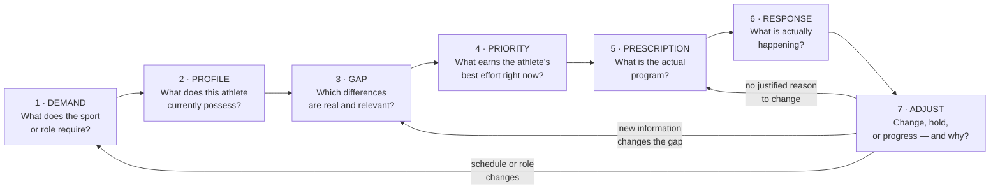

# G3 102 — Needs Analysis & Performance Program Design

**Version:** 1.0
**Production Specification Review Gate:** PASS
**Status:** APPROVED FOR NOVAKORE PRODUCTION
**Authority:** G3 Performance

## Production-Ready Course Specification (Authoritative Build Document)

**Course code:** G3-102
**Course title:** Needs Analysis & Performance Program Design
**Division:** G3 Performance, the human performance division of G3 Sports & Fitness
**Document class:** Authoritative production specification — NovaKore build source
**Version:** 1.0 (final; production corrections applied — non-substantive, no version increment per §18.7)
**Date:** August 2026
**Owner / approver:** JR Romero, CSCS — Director of Training, G3 Performance
**Supersedes:** All prior G3 102 outlines, drafts, research notes, and the pre-gate v1.0 review copy

---

## 0. DOCUMENT CONTROL

### 0.1 Source of authority

This specification is built from three inputs and no others:

| Input | Role | Authority |
|---|---|---|
| *G3 102 Needs Analysis & Performance Program Design Evidence Pack* | Primary research basis | Evidence only. Does not create doctrine. |
| *G3 Performance — Doctrine & Competency Framework* (internal) | Classification language and doctrine/evidence separation | Structural authority |
| *G3 Performance Brand Standards v1.0* | Voice, terminology, and presentation standard | Presentation authority |

The Evidence Pack cleared the Evidence Review Gate with **STATUS: PASS WITH CONDITIONS**. The research phase is closed. No new broad research cycle was performed in producing this specification. Where the Evidence Pack flagged a claim as conditional, unverified, or inferential, that flag is carried forward into this document rather than resolved by assertion.

### 0.1a Review gate record

| Gate | Applies to | Status | Effect |
|---|---|---|---|
| Evidence Review Gate | *G3 102 Evidence Pack* | **PASS WITH CONDITIONS** | Research phase closed. Conditions carried forward and discharged in §0.4. |
| Production Specification Review Gate | This specification | **PASS WITH MINOR PRODUCTION CORRECTIONS** | Doctrine, competencies, course architecture, assessments, practical model, the G3 Programming Decision Model, evidence classifications, and NovaKore implementation architecture are **approved**. Named production corrections applied; see §20.5. |

**Final production status after those corrections: APPROVED FOR NOVAKORE PRODUCTION.**

Approved at this gate and closed to change without Director of Training approval: the course design, the doctrine set, the G3 Programming Decision Model, the evidence classifications, and the NovaKore implementation architecture. Corrections applied under this gate were limited to document control, delivery-description accuracy, and citation-integrity production notes. No doctrine was added, no research was performed, no module content was materially rewritten, and no automated priority scoring exists anywhere in this specification or its build file.

### 0.2 What this document is

This is the build specification for G3 102 inside NovaKore. It defines course purpose, outcomes, doctrine, terminology, module architecture, lesson specifications, coaching standards, competencies, assessments, practical sign-offs, case studies, evidence classifications, reference mapping, and implementation structure at a level of detail sufficient for a content developer to build the course without further interpretation of the research.

### 0.3 What this document is not

- It is not a summary of the Evidence Pack.
- It is not a CSCS study guide, and it does not attempt to mirror any certifying body's exam blueprint.
- It is not a claim that G3 methodology is scientifically proven. Where G3 sets an operational rule beyond the evidence, that rule is labeled **G3 Applied Standard** and is defensible as organizational policy, not as scientific fact.

### 0.4 Conditions carried forward from the Evidence Review Gate

The gate passed the research **with conditions**. Those conditions are discharged in this specification as follows:

| Gate condition | How this specification discharges it |
|---|---|
| Limiting-factor identification is indirect evidence | Module 4 teaches limiting factor as a **probabilistic coaching judgment**, never as a test output. The term "confirmed limiting factor" is prohibited in G3 course language. |
| Exact maintenance doses are underdetermined | Module 9 teaches maintenance as a **defended reduction with a verification test**, not as a numeric dose table. No universal maintenance numbers appear in this course. |
| Sex-specific programming claims exceed the source set | The course states the defensible position (foundational principles generally apply across sexes) and marks population-specific modification as a Coach Judgment area pending targeted evidence. See §14.9. |
| Autoregulation evidence in youth is extrapolated | Module 11 restricts formal autoregulation systems by population and labels youth application as extrapolated adult evidence. |
| Several citation tags in the Evidence Pack are not itemized in its source library | Flagged in §17.3. Claims resting only on unmapped tags are carried at reduced confidence and are excluded from assessment answer keys. |
| Very recent network meta-analyses require cautious interpretation | Classified as Emerging Evidence. Excluded from doctrine and from graded assessment keys. |

### 0.5 Evidence integrity rule for this course

> **No lesson in G3 102 may state as established what the Evidence Pack classifies as conditional, inferential, or historical.**

Content developers may not upgrade an evidence class to simplify a lesson. If a lesson feels ambiguous because the evidence is ambiguous, the ambiguity is the lesson.

---

### 0.6 Foundations Authority Rule

*Added by the G3 Performance Foundations — 101–105 Curriculum Review Gate v1.0 (Correction 2). Governance text only — no doctrine, evidence class, module architecture, course outcome, practical sign-off, terminal defense, or decision model was changed.*

**The G3 Performance Foundations series is G3 101 → G3 102 → G3 103 → G3 104 → G3 105.** Within it, authority is fixed as follows and does not vary by course, document, or context.

| Course | Authoritative on |
|---|---|
| **G3 101** | The **G3 reasoning system**: evidence classes, certainty language, Evidence / G3 Applied Standard / Coach Judgment separation, population-transfer disclosure, testing and monitoring interpretation, claim-correction symmetry, scope of practice, and evidence restraint. |
| **G3 102** | The **G3 programming decision model**: DEMAND → PROFILE → GAP → PRIORITY → PRESCRIPTION → RESPONSE → ADJUST, including programming priority and change governance. |
| **G3 103** | **Speed, deceleration, COD, and agility** — where its standard is narrower than the upstream rule. |
| **G3 104** | **Strength development** — where its standard is narrower than the upstream rule. |
| **G3 105** | **Power development** — where its standard is narrower than the upstream rule. |

**Two rules bind every course in the series:**

1. **No downstream course may loosen an upstream evidence, scope, measurement, or programming-integrity standard.**
2. **Where domain courses overlap, the more specific domain governs only inside that domain; otherwise the upstream standard controls.**

**This course's position.** **G3 102 is authoritative on the programming decision model** and on everything that follows from it, including programming priority and change governance. It operates inside the G3 101 reasoning system and may not loosen it.

**Series attribution.** The three-layer discipline — Evidence / G3 Applied Standard / Coach Judgment — is attributed at series level to **G3 101**. Population-transfer governance is attributed at series level to **AS-101-16**, and may be restated locally: G3 103 restates it as **AS-103-12**, and G3 104 and G3 105 carry that restatement.

---

## 1. COURSE IDENTITY & PURPOSE

### 1.1 Course purpose

G3 102 teaches a G3 Performance coach to make **defensible programming decisions**.

The central skill of this course is not writing workouts. Workouts are the output. The skill is the reasoning that produces the output — the ability to move from what a sport requires, to what an athlete currently possesses, to which differences actually matter, to what should be trained now, to what evidence would justify changing course.

A coach who can write a good-looking program but cannot explain why that program exists for that athlete has not passed this course.

### 1.2 Position in the G3 education system

| | |
|---|---|
| **Prerequisite** | G3 101 (foundational coaching standards and the G3 training system). Active G3 Performance coaching status. |
| **Audience** | G3 Performance coaches, G3 Youth Strength & Conditioning staff, G3 Volleyball Development staff, and scholastic/collegiate contract coaches operating under G3 programming standards. |
| **Follow-on** | G3 103 and above build on this course's decision model. G3 102 is the prerequisite for any coach holding independent programming authority for a G3 team, group, or GPI-tested athlete. |
| **Delivery** | NovaKore self-paced modules with four observed practical sign-offs — PS-1, PS-2, PS-3, PS-4 (§13) — plus the final oral defense, T-01. PS-1 and PS-2 are hard gates on module progression; PS-3 and PS-4 are completion requirements. |
| **Nominal duration** | 12 modules · approximately 18.5 hours of directed study · plus practical evidence collected on the floor over a minimum 4-week window. |
| **Standing** | G3 internal CEU course. Recognition by outside certifying bodies is not claimed. |

### 1.3 The nine questions

A coach completing G3 102 can answer these nine questions about any athlete on their roster, out loud, without notes:

1. What does this athlete's sport or role actually require?
2. What does this athlete currently possess?
3. Which of those differences matter?
4. Which differences do **not** matter enough to prioritize right now?
5. What is being trained now?
6. What is being maintained?
7. What is deliberately deprioritized, and at what accepted cost?
8. How do those decisions show up in the actual written program?
9. What evidence would make me change this program?

These nine questions are the spine of the course. Every module, case, and assessment traces back to one or more of them. They appear in the final defense verbatim.

### 1.4 Course outcomes

On completion, a G3 Performance coach can:

**CO-1** Conduct a sport and role demand analysis that distinguishes average demands from peak or worst-case passages, and state which demands actually shape the program.
**CO-2** Construct an athlete profile from decision-useful information — training age, availability, injury context, schedule, movement competency, and validated performance measures — without collecting data that cannot change a decision.
**CO-3** Interpret a test result within its measurement limitations, including reliability, typical error, and practical significance, and state when a change is too small to act on.
**CO-4** Distinguish a measured deficit from a probable performance limiting factor, and articulate the reasoning that separates them.
**CO-5** Establish and defend training priorities as a relevance-and-opportunity-cost decision rather than a weakness-first reflex.
**CO-6** Select exercises based on intended adaptation, competency, loading potential, and fatigue cost rather than visual resemblance to sport.
**CO-7** Order a session so that the highest-priority quality receives the athlete's highest-quality effort.
**CO-8** Organize concurrent development of multiple qualities across a training week using sequencing, spacing, modality, and volume, with explicit emphasis tiers.
**CO-9** Distinguish development from maintenance from exposure within a phase, and defend the reduction applied to maintained qualities.
**CO-10** Individualize inside a group or team structure without writing a unique program for every athlete.
**CO-11** Apply autoregulation appropriately by population and context, without presenting it as automatically superior to well-designed standardized prescription.
**CO-12** Interpret readiness through baseline, reliability, context, converging signals, and coaching judgment rather than a single metric.
**CO-13** Monitor program response using process, training, performance, and outcome information, and distinguish a program that is working from one that is merely producing fatigue.
**CO-14** Justify — in writing and out loud — why a program was changed, or why it was deliberately left alone.

### 1.5 Voice and presentation standard

Course content is written in the G3 Performance voice: **direct, systems-first, credentialed, unhyped**. Preferred vocabulary: system, structure, protocol, block, progression, assessment, baseline, screen, measurable, documented, standard, execution, development. Prohibited in course content: motivational filler, "beast mode" register, guaranteed outcomes, and any implication that professional judgment is scientific certainty.

---

## 2. EVIDENCE CLASSIFICATION SYSTEM

Every substantive claim in G3 102 carries one of five evidence classes plus, where applicable, a G3 standing label. This system is inherited from the G3 Doctrine & Competency Framework and used consistently across all G3 CEU courses.

### 2.1 Evidence classes

| Class | Name | Definition | How it may be taught |
|---|---|---|---|
| **A** | Established Evidence | Supported by direct, reasonably consistent research in relevant populations. | May be taught as established. Still bounded by population and context. |
| **B** | Supported Practice | Supported by good evidence that is indirect, adjacent, or requires interpretation to reach the coaching decision. | Taught as well-supported practice. Must state the interpretive step. |
| **C** | Emerging / Conditional Evidence | Evidence exists but is recent, mixed, population-specific, or method-sensitive. | Taught as conditional. Never used as the sole basis for a required behavior. |
| **D** | Applied Coaching Inference | Reasoned extension from evidence to a decision the evidence does not directly test. | Taught explicitly as inference. Must be labeled aloud when taught. |
| **E** | Historical / Practitioner Framework | Influential models and traditions. Useful for organizing thought. | Taught as framework and history. Never as proof. |

### 2.2 G3 standing labels

Separate from evidence class, each operational rule carries a standing label:

| Label | Meaning | Binding? |
|---|---|---|
| **G3 Doctrine** | A conceptual position G3 holds and teaches. | Yes — coaches teach and reason from it. |
| **G3 Applied Standard** | An operational rule G3 sets for its own environments where evidence does not determine a single answer. | Yes — coaches follow it in G3 environments. Explicitly organizational, not scientific. |
| **Coach Judgment** | A decision G3 deliberately leaves to the qualified coach. | No fixed answer. Reasoning must still be documented. |

### 2.3 The three-column discipline

Every module in this course separates, visibly:

```
EVIDENCE          →   what the research supports, and how strongly
G3 APPLIED        →   what G3 does in its own environments
STANDARD              and why, given the evidence
COACH JUDGMENT    →   what remains the coach's call, with the
                      reasoning that must be documented
```

Content developers must render this as three distinct visual blocks in NovaKore, not as running prose. A learner must never have to guess which column a statement belongs to.

---

### 2.4 Series-level evidence taxonomy

*Added by the G3 Performance Foundations — 101–105 Curriculum Review Gate v1.0 (Correction 3). Recognition only — **no claim in this course has been reclassified.***

The G3 Performance Foundations series uses one taxonomy. **Every course recognizes all seven classes. No course is required to use all of them, and no claim is ever reclassified in order to populate a class.**

| Class | Name |
|---|---|
| **A** | Established Evidence |
| **B** | Supported Practice |
| **C** | Emerging / Conditional Evidence |
| **D** | Applied Coaching Inference |
| **E** | Historical / Practitioner Framework |
| **F** | Unsupported / Overstated Claim |
| **U** | Unresolved / Unknown |

**U is the machine-readable series class** for a question about which no defensible evidence-class assignment can be made. **"Unknown" remains the human-facing certainty label** for the same condition. The two are equivalent in force, and both mean: *G3 does not know, and no G3 material may proceed as though it does.*

**Classes used in this course:** **A, B, C, D, E**. F and U are recognized but not used. G3 102 records overstated claims in its **Prohibited Claims Register (§15)** and unresolved questions in its **Conditional & Professional-Judgment Register (§16)** rather than assigning either a class. Neither register has been reclassified, and no claim has been moved.

---

## 3. CONTROLLED TERMINOLOGY

These definitions are binding across G3 102 and all downstream G3 courses, GPI reporting, and NovaKore data fields. Where a term is commonly used loosely in the field, the G3 definition takes precedence in G3 environments.

| Term | G3 definition | Not to be confused with |
|---|---|---|
| **Needs analysis** | The structured process of determining what a sport or role requires, what an athlete possesses, and which differences should change the program. | A testing battery. A form. |
| **Sport demand profile** | A description of the movement, force, velocity, power, energetic, repeated-effort, positional, density, peak-passage, injury-exposure, and season-structure requirements of a sport or role. | A highlight reel. Average match data alone. |
| **Peak / worst-case passage** | The most demanding period of competition an athlete must be prepared to tolerate, not the average of the competition. | Total match volume. |
| **Athlete profile** | The decision-useful summary of an athlete: training age, availability and injury context, schedule, movement competency, validated performance measures, and relevant history. | A complete data dump. |
| **Decision-useful information** | Information that can meaningfully change exercise selection, priority, load, volume, progression, regression, recovery, readiness modification, return-to-performance, or program evaluation. | Anything measurable. |
| **Measured deficit** | A test result meaningfully below a reference, standard, or the athlete's own baseline. | A limiting factor. |
| **Probable performance limiting factor** | A quality that, in the coach's reasoned judgment, is materially restricting performance in this athlete's sport or role right now, and that can be changed at acceptable cost. Always a judgment, never a test output. | A confirmed cause. G3 does not use the term "confirmed limiting factor." |
| **Priority** | The training quality receiving the athlete's highest-quality effort, best session position, and greatest progressive attention in the current phase. | The thing the athlete is worst at. |
| **Emphasis tier** | The classification of each quality in a program as Primary Development, Secondary Development, Maintenance, or Exposure. | Presence or absence in the program. |
| **Maintenance** | A deliberate, reduced dose intended to hold a quality near its current level while resources go elsewhere, with a stated verification test. | Neglect. Doing a little of everything. |
| **Exposure** | Low-dose contact with a quality to preserve competency, tissue tolerance, or familiarity, without an expectation of improvement. | Development at low volume. |
| **Opportunity cost** | What the athlete gives up by prioritizing this quality — in time, recovery, session position, and attention. | Time on the clock. |
| **Interference** | The conditional reduction in adaptation to one quality caused by concurrent training of another. Conditional, manageable, not universal. | An automatic penalty for concurrent training. |
| **Autoregulation** | Adjusting prescription using performance or perceptual feedback such as RPE, RIR, velocity, or structured readiness indicators. | Training by feel. Skipping the plan. |
| **Readiness** | An interpreted estimate of an athlete's current capacity to train well, formed from baseline behavior, reliability, context, converging signals, and coaching observation. | A wellness score. An HRV number. |
| **Typical error** | The normal measurement noise in a test — the amount a result can move without anything real changing. | An athlete getting worse. |
| **Practical significance** | Whether an observed change is large enough to matter for this athlete's performance and to justify a decision. | Statistical significance. |
| **Justified change** | A program modification made for a stated reason tied to adaptation, response, schedule, phase objective, mastery, pain, or fit. | Variation for novelty. |
| **GPI** | G3 Performance Index — the G3 testing and profiling output used to inform, not dictate, programming decisions. | A ranking that sets priorities automatically. |
| **Scalable individualization** | Standardizing session structure, movement categories, objectives, language, and progression framework, while individualizing load, complexity, variation, range, rate, regression, substitution, and readiness adjustment. | One program for everyone. A unique program for everyone. |

**Terminology enforcement:** NovaKore glossary entries are linked from first use in every module. Assessment items use these terms exactly. A learner who uses "limiting factor" where the evidence supports only "measured deficit" is marked down in defense assessments — this is a scored distinction, not a stylistic one.

---

## 4. G3 102 DOCTRINE

Twelve doctrines form the conceptual backbone of this course. Each is stated in production form, given its evidence class, and given its teaching boundary — the point past which the doctrine stops being supported and becomes organizational policy or coach judgment.

Doctrine is what G3 holds. It is taught, examined, and defended. It is not presented to learners as scientific proof except where the evidence class says so.

---

### Doctrine 1 — Needs analysis must change decisions

**Statement.** Assessment exists to improve coaching decisions. More data is not automatically better. A test, metric, questionnaire, or observation earns its place in a G3 assessment when it can meaningfully influence exercise selection, training priority, load, volume, progression, regression, recovery, readiness modification, return-to-performance decisions, or program evaluation.

G3 favors decision-useful information over maximal data collection.

**The operational test.** Before any item enters a G3 assessment, the coach answers: *What decision would I make differently depending on this result?* If there is no answer, the item does not enter the battery.

**Evidence class:** B — Supported Practice. Direct trials of complete needs-analysis frameworks are scarce. Support is strong but indirect, drawn from testing and monitoring literature showing that information has value only when it can be interpreted reliably and used to change a decision. [EP §1.1, §2, cite:4, cite:20, cite:48]

**Teaching boundary.** Do not teach that any specific battery size is correct. Do not teach that data collection is bad. Teach that unused data has a cost — in athlete time, coach attention, and false confidence — and that the cost must be earned.

---

### Doctrine 2 — Sport demand is more than the average

**Statement.** Sport-demand analysis must consider movement demands, force demands, velocity demands, power demands, energetic demands, repeated-effort demands, positional demands, competition density, practice density, peak or worst-case passages, injury exposure, and season structure.

Average match demands alone can conceal the highest-performance requirements. Peak demands matter when preparing athletes for the most demanding periods of competition.

**Evidence class:** B — Supported Practice, with high confidence in team-sport contexts. Match-analysis literature shows peak or worst-case passages can be substantially more demanding than average values, and rolling-average methods appear to capture peak locomotor demands better than fixed epochs. [EP §1.2, cite:18, cite:22]

**Teaching boundary.** The peak-demand evidence is largely **locomotor** and largely from professional team sport. Translation to full program design is indirect, and translation to scholastic settings without tracking technology is an inference. G3 teaches peak-demand *thinking* in environments that have no GPS at all — the concept survives the absence of the instrument, but the coach must not claim measurement precision they do not have.

---

### Doctrine 3 — A deficit is not automatically a limiting factor

**Statement.** A low score does not automatically become a programming priority. G3 distinguishes a **measured deficit** from a **probable performance limiting factor**.

A deficit becomes more important when there is reasonable evidence that it:

- matters to the athlete's sport or role;
- is meaningfully below the required level;
- can be changed;
- is relevant to current performance;
- can be addressed at an acceptable training cost; and
- deserves emphasis relative to competing priorities.

Testing identifies information. Coaching determines significance.

**Evidence class:** B — Supported Practice for the distinction itself; the *diagnosis* of a specific limiting factor is D — Applied Coaching Inference. Field tests identify associations and deficits rather than direct causes of sport-performance limitation. Proving that one measured quality is the key causal limiter of sport performance is rarely possible from normal field data. [EP §1.5, §4, cite:4, cite:20, cite:27]

**Teaching boundary.** No G3 material may state that a test *identifies* a limiting factor. Tests produce measured deficits. Coaches produce probable limiting factors, with reasoning attached, and hold them loosely.

---

### Doctrine 4 — Priority is a relevance × opportunity-cost decision

**Statement.** G3 does not adopt "always train the athlete's greatest weakness."

Programming priority considers sport relevance, magnitude of deficit, athlete level, training age, current phase, injury and availability status, adaptation potential, time available, practice and competition demands, fatigue cost, interference with other qualities, maintenance requirements, and expected performance return.

A strength may sometimes deserve further development. A weakness may sometimes deserve maintenance or no direct intervention.

**Evidence class:** B — Supported Practice for rejecting the universal weakness-first rule; C/D for any specific prioritization formula. The literature is stronger on the need to prioritize and weaker on exact priority formulas. Whether to extend a strength or repair a weakness remains partly inferential. [EP §1.6, §4, cite:19, cite:20, cite:35, cite:48]

**Teaching boundary.** G3 provides a structured prioritization worksheet (§5, Stage 4). The worksheet organizes judgment. It does not compute an answer, and it must never be presented as producing one. **Do not create fake mathematical precision where the evidence does not support it** — no weighted priority score, no composite index that outputs a training target.

---

### Doctrine 5 — Exercise selection serves adaptation

**Statement.** Do not confuse visual resemblance to sport with transfer.

Exercise selection considers desired adaptation, movement competency, loading potential, velocity, intent, range of motion, technical complexity, fatigue cost, risk/reward, available equipment, athlete history, training age, progression potential, and place within the total program.

The question is not *Does this exercise look athletic?* The question is *What adaptation does this exercise produce, and why does that adaptation matter here?*

**Evidence class:** A — Established Evidence that resistance training improves sport-relevant performance in athletes, including elite athletes; B — Supported Practice for the selection framework itself. There is no strong evidence that visually sport-specific exercises automatically transfer better; transfer depends on loading, velocity, intent, skill, dose, and the rest of the program. [EP §1.7, §4, cite:34, cite:43]

**Teaching boundary.** Rejecting resemblance-as-transfer is not rejecting specificity. Specificity of *adaptation* remains a real principle. The error being corrected is the visual shortcut, not the concept.

---

### Doctrine 6 — Priority determines order

**Statement.** Exercises and qualities placed earlier in a session generally receive greater performance capacity. Session order therefore reflects training priority rather than habit.

G3 programming deliberately determines what deserves the athlete's highest-quality effort.

**Evidence class:** A — Established Evidence. Exercise order affects acute performance and often long-term adaptation in the prioritized lift, with the clearest effects in untrained to moderately trained populations. [EP §1.8, §2, cite:19, cite:43]

**Teaching boundary.** Effects are clearest in less-trained populations and are less directly established across all elite and team-sport contexts. The doctrine holds; the magnitude claim does not. Do not teach a numeric penalty for ordering something second.

---

### Doctrine 7 — Multiple qualities can be developed concurrently

**Statement.** G3 rejects the false choice that athletes must develop only one physical quality at a time. Strength, speed, power, conditioning, movement skill, and other qualities can coexist within a program.

However: **concurrent does not mean equal emphasis.** Programs distinguish primary development qualities, secondary development qualities, maintenance qualities, and exposure qualities.

Interference is conditional and is managed through sequencing, spacing, modality, volume, intensity, recovery, athlete training status, and sport schedule.

**Evidence class:** A — Established Evidence that concurrent training can improve strength and endurance together in team-sport athletes; B — Supported Practice that interference is conditional rather than universal; C for exact practical thresholds. Interference appears more pronounced in older and more experienced athletes than in youth samples, indicating that training status modifies the tradeoff. [EP §1.10, §2, §4, cite:5, cite:35, cite:63, cite:68, cite:71]

**Teaching boundary.** No numeric interference thresholds, no mandatory minimum hours between modalities presented as evidence. G3 sets operational spacing conventions as **Applied Standards** (§14.5) and says so.

---

### Doctrine 8 — Individualization does not require unique programs for everyone

**Statement.** G3 uses scalable programming architecture. Standardize where athletes are similar. Individualize where differences matter.

Team and group programming standardizes session structure, movement categories, primary objectives, coaching language, and progression framework. Individualization occurs through exercise variation, load, volume, complexity, range of motion, progression rate, regression, substitutions, and readiness adjustments.

**Evidence class:** D — Applied Coaching Inference, supported by professional practice surveys and indirect training literature. Individualization matters, but the claim that every athlete requires a fully unique program is overstated, and templates are not inherently poor programming — quality depends on how the template handles priorities, progressions, and modifications. Direct comparative trials of scalable individualization models are limited. [EP §1.16, §4, §5, cite:19, cite:20, cite:35, cite:51]

**Teaching boundary.** This is inference and must be taught as such. It is nonetheless a binding **G3 Applied Standard** for team environments, because G3 must produce a defensible answer for a 40-athlete roster whether or not the literature supplies one.

---

### Doctrine 9 — Youth training is readiness-based, not age-myth-based

**Statement.** Supervised, progressive resistance training is appropriate for youth athletes. Readiness considers ability to follow instruction, psychological readiness, movement competency, maturity, training history, supervision, and progression.

G3 does not teach outdated blanket claims that resistance training is inherently unsafe for youth, or that a single chronological age determines readiness.

**Evidence class:** A — Established Evidence. Supervised, progressive youth resistance training is safe and effective and improves strength, power, speed, and general athletic performance. Position and consensus documents emphasize maturity, attention, and ability to follow instruction over rigid age cutoffs. [EP §3, cite:3, cite:38, cite:44, cite:53, cite:55, cite:57, cite:59, cite:67]

**Teaching boundary.** The strength of this evidence attaches to **supervised and progressive** training. Some of the guidance derives from position stands and applied synthesis rather than trials alone. Supervision quality is part of the claim, not a footnote to it — G3 states the supervision condition every time the safety claim is made.

---

### Doctrine 10 — Autoregulation is a tool, not a religion

**Statement.** G3 may use RPE, RIR, velocity, performance feedback, structured readiness indicators, and coach observation. Autoregulation can improve individualization. It is not presented as universally superior to well-designed standardized programming.

**Evidence class:** B — Supported Practice. Autoregulation is a credible individualization method based on performance or perceptual feedback. Autoregulated and standardized load prescription often produce similar strength outcomes when both are well designed. Evidence is stronger in resistance-trained adults than in youth or large team settings. Recent network meta-analyses comparing autoregulation modalities are C — Emerging and are not used to rank methods in this course. [EP §1.12, §4, cite:20, cite:54, cite:56, cite:58, cite:60, cite:61]

**Teaching boundary.** Never teach "autoregulation beats a fixed program." Teach that a poorly designed autoregulated program loses to a well-designed standardized one, and that the comparison worth making is design quality against design quality.

---

### Doctrine 11 — No single readiness metric runs the program

**Statement.** No single wellness score, jump score, HRV value, questionnaire, subjective rating, or wearable metric automatically dictates training decisions.

Readiness is interpreted through:

> **Baseline + Reliability + Context + Multiple Signals + Coaching Judgment**

**Evidence class:** B — Supported Practice, high confidence. No single metric is established as a definitive daily decision trigger; normal biological and measurement variability is a central constraint; useful practice relies on baseline behavior, reliability, context, and converging signals. Reliability, typical error, and practical significance are A — Established Evidence as interpretive requirements. [EP §1.4, §1.13, §2, §4, cite:4, cite:14, cite:20, cite:36, cite:62]

**Teaching boundary.** Highly confident readiness dashboards, composite athlete scores, and automated recommendations deserve skepticism unless their validity and decision value are independently demonstrated. Vendor claims are not evidence. This applies to G3's own GPI outputs as strictly as to any purchased platform.

---

### Doctrine 12 — Programs change for reasons

**Statement.** G3 rejects arbitrary variation. A program does not need to change because four weeks passed, the athlete is bored, a new exercise became popular, or novelty appears more advanced.

Change is justified by adaptation, stagnation, technical mastery, pain, athlete response, schedule, phase objectives, progression needs, changing sport demands, or poor program fit.

Variation serves adaptation.

**Evidence class:** D — Applied Coaching Inference, drawn from monitoring, adaptation, and program-design literature. The evidence does not support mandatory rotation intervals or fixed phase-length rules across contexts, and frequent change can obstruct the evaluation of adaptation. Direct comparative trials of variation strategies in trained team-sport athletes are limited. [EP §1.15, §4, §5, §7, cite:4, cite:19, cite:20, cite:27]

**Teaching boundary.** The absence of evidence for mandatory change is not evidence that programs should rarely change. G3's position is that change requires a stated reason — not that change is suspect. A coach who never changes anything fails this doctrine as surely as one who changes everything monthly.

---

### 4.13 Doctrine summary table (NovaKore tag source)

| ID | Doctrine | Evidence class | Primary modules | Standing |
|---|---|---|---|---|
| D1 | Needs analysis must change decisions | B | M1, M3 | G3 Doctrine |
| D2 | Sport demand is more than the average | B | M2 | G3 Doctrine |
| D3 | A deficit is not automatically a limiting factor | B / D | M4 | G3 Doctrine |
| D4 | Priority is a relevance × opportunity-cost decision | B / C | M5 | G3 Doctrine |
| D5 | Exercise selection serves adaptation | A / B | M6 | G3 Doctrine |
| D6 | Priority determines order | A | M7 | G3 Doctrine |
| D7 | Multiple qualities can be developed concurrently | A / B / C | M8 | G3 Doctrine |
| D8 | Individualization does not require unique programs | D | M10 | G3 Doctrine + Applied Standard |
| D9 | Youth training is readiness-based | A | M10, M3 | G3 Doctrine |
| D10 | Autoregulation is a tool, not a religion | B / C | M11 | G3 Doctrine |
| D11 | No single readiness metric runs the program | A / B | M11, M12 | G3 Doctrine |
| D12 | Programs change for reasons | D | M9, M12 | G3 Doctrine |

---

## 5. THE G3 PROGRAMMING DECISION MODEL

The decision model is the primary conceptual and visual framework of G3 102. It is the shape of the reasoning a G3 coach performs, in order, every time a program is written, evaluated, or defended.

```
DEMAND → PROFILE → GAP → PRIORITY → PRESCRIPTION → RESPONSE → ADJUST
```



### 5.1 Design constraints on the model

The model is a **reasoning sequence, not an algorithm**. It has no scoring, no weighting, and no output formula. This is deliberate: the Evidence Pack is explicit that direct trials validating complete needs-analysis-to-program-design frameworks are lacking, and that limiting-factor identification and priority formulas remain inferential. [EP §1.17, §4, §7, cite:48, cite:50]

Accordingly:

- The model organizes judgment. It does not replace it.
- No stage produces a number that dictates the next stage.
- Any NovaKore implementation that adds automated scoring to this model violates this specification and Doctrine 11.
- The model is **classified D — Applied Coaching Inference** as an integrated whole, even though individual stages rest on stronger evidence. This classification is stated to learners in Module 1.

### 5.2 Stage definitions

---

#### Stage 1 — DEMAND

**Question:** What does this sport, position, or role actually require?

| | |
|---|---|
| **Inputs** | Sport and position; level of competition; competition and practice schedule; season structure; observed or documented match/practice demands; injury exposure patterns; peak or worst-case passages; facility and time constraints. |
| **Method** | Build the demand profile across the twelve demand categories in Doctrine 2. Record what is *known*, what is *estimated*, and what is *assumed*. In environments without tracking technology, demand analysis is built from competition observation, position knowledge, schedule structure, and coach interview — and is labeled as estimated. |
| **Output artifact** | **G3 Sport Demand Profile** (one page per sport/position group; reviewed annually or when level/role changes). |
| **Exit criterion** | The coach can name the three to five demands that will actually shape the program, and can distinguish which of those come from average demands and which from peak passages. |
| **Common failure** | Listing every demand as important; using average competition data as the whole picture; copying a demand profile from another level of play without adjustment. |
| **Evidence note** | Peak-demand reasoning is B — Supported Practice, strongest in team-sport locomotor data. Its extension to full program design is an interpretive step and is taught as such. [cite:18, cite:22] |

---

#### Stage 2 — PROFILE

**Question:** What does this athlete currently possess?

| | |
|---|---|
| **Inputs** | Training age; injury and availability status; current practice/competition load; movement competency screen; validated performance measures (GPI where applicable); relevant history; growth/maturation context for youth; psychological readiness and instructional responsiveness. |
| **Method** | Collect only decision-useful information (Doctrine 1). Every item in the battery must survive the question *what would I do differently based on this result?* Record measurement conditions so that later comparisons are legitimate. |
| **Output artifact** | **G3 Athlete Profile** (living record in NovaKore/GPI; re-tested on the phase schedule, not ad hoc). |
| **Exit criterion** | The profile is complete enough to program from, and contains no item the coach cannot connect to a decision. |
| **Common failure** | Testing to fill a form; adding a test because it is available; treating a single test occasion as a stable trait; failing to record conditions, so later change cannot be interpreted. |
| **Evidence note** | Interpretation requires reliability, typical error, and practical significance. Arbitrary cut points such as fixed percentage change thresholds are not well justified across settings. A — Established Evidence for the interpretive requirement. [cite:4, cite:14, cite:36] |

---

#### Stage 3 — GAP

**Question:** Which differences between demand and profile are real, and which are relevant?

| | |
|---|---|
| **Inputs** | Demand profile; athlete profile; measurement error and baseline behavior; sport/role relevance. |
| **Method** | Two filters, applied in order. **Filter 1 — Is the difference real?** Is it larger than typical error, consistent across occasions, and observed under comparable conditions? **Filter 2 — Is the difference relevant?** Does this quality matter to this athlete's sport and role, at this level, in the current phase? Only differences that pass both filters proceed as candidate limiting factors, and they proceed as *probable*, never confirmed. |
| **Output artifact** | **Gap Statement** — a short written list separating (a) real and relevant differences, (b) real but low-relevance differences, (c) differences within measurement noise. |
| **Exit criterion** | The coach can state which measured deficits are being carried forward as probable limiting factors and, explicitly, which are being set aside and why. |
| **Common failure** | Treating the lowest score as the biggest problem; acting on a change smaller than typical error; confusing a deficit relative to a normative table with a deficit relative to this athlete's requirements. |
| **Evidence note** | The deficit/limiting-factor distinction is B; the diagnosis of a specific limiting factor is D — Applied Coaching Inference. [cite:4, cite:20, cite:27] |

---

#### Stage 4 — PRIORITY

**Question:** What earns this athlete's highest-quality effort right now, and what is deliberately not receiving it?

| | |
|---|---|
| **Inputs** | Gap statement; sport relevance; athlete level and training age; current phase; injury/availability; adaptation potential; time available; practice and competition density; fatigue cost; interference considerations; maintenance requirements; expected performance return. |
| **Method** | Assign every relevant quality to an **emphasis tier**: Primary Development, Secondary Development, Maintenance, or Exposure. Write the opportunity-cost sentence: *"By prioritizing X, this athlete receives less Y, and I accept that because Z."* A strength may be elevated; a weakness may be tiered down. Both require reasoning. |
| **Output artifact** | **Priority & Emphasis Sheet** — qualities, tiers, and the opportunity-cost statement. Retained as the program's defense document. |
| **Exit criterion** | Every quality in the program has a tier, and no tier assignment is unexplained. |
| **Common failure** | Weakness-first reflex; everything tiered as primary; maintenance used as a label for neglect; no stated cost. |
| **Evidence note** | Rejecting universal weakness-first is B; the specific tiering decision is C/D. No weighted formula is provided, by design. [cite:19, cite:20, cite:35, cite:48] |

---

#### Stage 5 — PRESCRIPTION

**Question:** What is the actual program, and does it reflect the priorities?

| | |
|---|---|
| **Inputs** | Priority & emphasis sheet; movement competency; equipment and staffing; group vs. individual context; schedule; session count and duration. |
| **Method** | Select exercises for intended adaptation (Doctrine 5). Order sessions by priority (Doctrine 6). Build the week with sequencing, spacing, modality, and volume that fits the emphasis tiers (Doctrine 7). Build the phase with progression, maintenance, and justified variation (Doctrine 12). Apply scalable individualization in group settings (Doctrine 8). |
| **Output artifact** | **Program document** — session, week, and phase, with the emphasis tier visible against each block. |
| **Exit criterion** | An outside G3 coach can read the program and correctly infer the priority order without being told it. **This is the operational definition of a defensible program.** |
| **Common failure** | Priority stated on paper but contradicted by session order; program complexity exceeding the competency of the group; exercise count used as a proxy for program quality. |
| **Evidence note** | Order effects A; prescription-variable interaction A/B; concurrent organization A/B/C. [cite:19, cite:34, cite:43, cite:52, cite:5, cite:35] |

---

#### Stage 6 — RESPONSE

**Question:** What is actually happening — in the program, in the athlete, and in performance?

| | |
|---|---|
| **Inputs** | Four information layers: **process** (was the program delivered as written — attendance, completion, coaching quality), **training** (load, volume, intensity, execution quality, session RPE), **performance** (retest results interpreted against typical error and practical significance), **outcome** (competitive results, availability, injury). |
| **Method** | Read the layers in order. Process problems are diagnosed before physiology is blamed. Performance change is interpreted against baseline behavior and measurement error, not against expectation. Outcome data is treated as the noisiest layer. |
| **Output artifact** | **Response Review** — completed at defined checkpoints, not continuously. |
| **Exit criterion** | The coach can say whether the program is working, not working, or cannot yet be evaluated — and the third answer is legitimate. |
| **Common failure** | Judging a program by competitive results; treating fatigue as proof of effectiveness; retesting so often that noise looks like a trend; declaring failure before the program was actually delivered. |
| **Evidence note** | Distinguishing process/training/performance/outcome information is B — Supported Practice; competitive outcomes alone are too noisy to evaluate training quality. [cite:4, cite:20, cite:70] |

---

#### Stage 7 — ADJUST

**Question:** Does this program change, hold, or progress — and what is the stated reason?

| | |
|---|---|
| **Inputs** | Response review; phase objectives; schedule; athlete report and observation; pain or availability changes; technical mastery; changing sport demands. |
| **Method** | Choose one of four actions and record the reason: **progress** (continue the plan and advance the loading/complexity), **hold** (retain the program; adaptation is still accruing or evaluation is incomplete), **modify** (change a defined element for a stated reason), or **re-enter the model** (the gap or the demand itself has changed — return to Stage 3 or Stage 1). |
| **Output artifact** | **Adjustment Log** — one line per decision: date, action, trigger, reasoning, expected effect, review date. Holding is logged as a decision. |
| **Exit criterion** | Every change has a reason that is not the calendar, and every non-change is a decision rather than an omission. |
| **Common failure** | Change for novelty; change because four weeks passed; change on one low readiness score; no record of why anything happened, making the next review impossible. |
| **Evidence note** | D — Applied Coaching Inference. Evidence does not support mandatory rotation intervals or fixed phase lengths, and frequent change obstructs evaluation of adaptation. [cite:4, cite:19, cite:20] |

---

### 5.3 Where the model is used

| Application | Use of the model |
|---|---|
| **Education** | The spine of G3 102 and the sequence used in all later G3 CEU courses. |
| **Practical coaching** | The reasoning path for writing any G3 program, individual or team. |
| **Athlete evaluations** | Structures the evaluation conversation with athletes, parents, and sport coaches: here is what your sport requires, here is where you are, here is what we are prioritizing and why. |
| **GPI interpretation** | GPI output enters at Stage 2 and is filtered at Stage 3. **GPI never enters at Stage 4.** A GPI score does not set a priority; a coach does. |
| **Team programming** | Stages 1–4 are run at the group level; Stage 5 applies scalable individualization; Stages 6–7 run at both group and individual level. |
| **Future NovaKore workflows** | Each stage maps to a data object and artifact (§18.3), so that a coach's reasoning is captured as structured records rather than free text. |

### 5.4 Model integrity rules

1. **No stage is skipped.** A program written without a documented Stage 4 is not a G3 program.
2. **Stages 1–4 are reversible; Stage 5 is not free.** Changing a prescription without revisiting the priority that produced it creates programs that drift from their own rationale.
3. **The model produces defensible decisions, not correct ones.** Two qualified G3 coaches may reach different priorities from the same profile. Both may pass. Neither passes without reasoning.
4. **No automated scoring.** Any tool, dashboard, or NovaKore feature that converts model inputs into a recommended training target requires Director of Training approval and must carry an explicit statement of its evidence basis.

---

## 6. MODULE ARCHITECTURE

### 6.1 Overview

| # | Module | Model stage | Core doctrine | Est. time | Sign-off |
|---|---|---|---|---|---|
| M1 | What Needs Analysis Is For | Frames all | D1 | 60 min | — |
| M2 | Analyzing Sport Demands | Stage 1 | D2 | 90 min | — |
| M3 | Building the Athlete Profile | Stage 2 | D1, D9 | 105 min | PS-1 (part) |
| M4 | From Test Result to Limiting Factor | Stage 3 | D3 | 105 min | PS-1 |
| M5 | Establishing Training Priorities | Stage 4 | D4 | 90 min | — |
| M6 | Exercise Selection | Stage 5 | D5 | 90 min | — |
| M7 | Building the Training Session | Stage 5 | D6 | 75 min | PS-2 (part) |
| M8 | Building the Training Week | Stage 5 | D7 | 105 min | PS-2 |
| M9 | Building the Training Phase | Stage 5 | D12 | 90 min | — |
| M10 | Individualization at Scale | Stage 5 | D8, D9 | 105 min | PS-3 |
| M11 | Autoregulation & Readiness | Stages 5–6 | D10, D11 | 90 min | — |
| M12 | Monitoring & Program Adjustment | Stages 6–7 | D11, D12 | 105 min | PS-4 |

Total directed study: 1,110 minutes — approximately 18.5 hours — plus practical evidence collected over a minimum four-week window.

### 6.2 Standard module structure (NovaKore content pattern)

Every module is built from the same twelve production elements, in this order. NovaKore renders each as a distinct content object (§18).

1. Module title and framing statement
2. Learning objectives
3. Core lesson content (lessons 1..n)
4. G3 doctrine / standard being taught
5. Evidence classification block (three-column discipline)
6. Coaching application
7. Common coaching errors
8. Scenario / case application
9. Knowledge assessment
10. Applied competency assessment
11. Practical sign-off (where applicable)
12. Supporting references

### 6.3 Progression and gating rules

- Modules unlock sequentially. M1–M4 must be completed in order; they build the reasoning the rest of the course assumes.
- **PS-1 gates M5.** A coach may not begin prioritization work until profile and gap reasoning has been observed.
- **PS-2 gates M9.** Session and week construction must be observed before phase design.
- M11 and M12 may not be attempted before PS-2 is recorded.
- Final defense (§13.5) requires all four sign-offs plus all module assessments at standard.

---

## 7. DETAILED MODULE SPECIFICATIONS

---

## MODULE 1 — What Needs Analysis Is For

**Framing statement:** Needs analysis is not a form you fill out before training starts. It is the reason your program looks the way it does. If your assessment cannot change your program, it is not an assessment — it is paperwork.

### 1 · Learning objectives

On completion of M1, the coach can:

- **M1.1** State the purpose of needs analysis in decision terms rather than data terms.
- **M1.2** Apply the decision test — *what would I do differently based on this result?* — to any proposed assessment item.
- **M1.3** Name the ten decision categories a needs analysis can legitimately influence.
- **M1.4** Describe the costs of collecting information that cannot change a decision.
- **M1.5** Reproduce the G3 decision model from memory and state what each stage answers.
- **M1.6** State the evidence standing of the model itself, including its limitations.

### 2 · Core lesson content

**Lesson 1.1 — The purpose problem.** Most needs analysis in the field is descriptive: it produces a picture of the athlete. G3 requires it to be *decisional*: it produces a change in what the coach does. The difference is not academic. A descriptive assessment ends in a report; a decisional assessment ends in a program that would have been different without it.

**Lesson 1.2 — The ten decision categories.** Assessment information earns its place when it can meaningfully influence: exercise selection · training priority · load · volume · progression · regression · recovery · readiness modification · return-to-performance decisions · program evaluation. These ten categories are the complete list used across G3 102. If a proposed item cannot be connected to at least one, it does not enter the battery.

**Lesson 1.3 — The cost of unused data.** More data is not free. It costs athlete time and goodwill, coach attention, and — most damagingly — it creates false confidence. A number that was never going to change anything still feels like knowledge. Lean assessment is not a shortcut; it is a way of protecting the quality of the decisions that remain.

**Lesson 1.4 — Why the evidence supports this indirectly.** Coaches should know the shape of the support. There are very few direct trials of complete needs-analysis frameworks. What exists is strong monitoring and testing literature showing that information has value only when it can be interpreted reliably and used to change a decision. G3 reasons *from* that to the needs-analysis position. That reasoning step is legitimate, and it is a step.

**Lesson 1.5 — The G3 decision model, introduced.** Walk DEMAND → PROFILE → GAP → PRIORITY → PRESCRIPTION → RESPONSE → ADJUST end to end using one worked athlete. Introduce each stage's question and artifact. State plainly: this model is G3's organizing structure, classified as applied coaching inference, not a validated instrument.

**Lesson 1.6 — What "defensible" means at G3.** A defensible decision is one the coach can explain in terms of demand, profile, gap, and cost, and one for which the coach can name the evidence that would change it. Defensible does not mean provably correct. Two coaches can defend different answers. Neither can defend no answer.

### 3 · Doctrine / standard taught

- **Doctrine 1** — Needs analysis must change decisions. *(G3 Doctrine)*
- **G3 Applied Standard AS-01** — Every G3 assessment item must be traceable to at least one of the ten decision categories, documented at the time the battery is built.
- **G3 Applied Standard AS-02** — The G3 decision model is the required reasoning sequence for all G3 program documentation.

### 4 · Evidence classification

| Statement | Class | Basis |
|---|---|---|
| Information has value when it can be interpreted reliably and used to change a decision | B — Supported Practice | Monitoring/testing literature; indirect to needs analysis [cite:4, cite:20, cite:48] |
| Complete needs-analysis frameworks lack direct validation | B — Supported Practice (a statement about the evidence base) | [EP §1.17, §7, cite:48, cite:50] |
| The G3 decision model as an integrated whole | D — Applied Coaching Inference | G3 construction from adjacent evidence |
| The ten decision categories as a complete list | D — Applied Coaching Inference / G3 Applied Standard | G3 operational definition |

**Coach Judgment:** how lean a given battery should be for a given athlete or group. G3 sets no minimum or maximum item count.

### 5 · Coaching application

Before the next assessment a coach runs, they write the decision test beside every item on the sheet. Any item without an answer is struck or justified in writing. In G3 Youth Strength & Conditioning, this typically reduces the battery substantially — and the reduction is the point, not a compromise.

### 6 · Common coaching errors

- Testing because the test exists, the software has a field for it, or last year's coach did it.
- Confusing thoroughness with rigor. A long battery signals effort; it does not signal quality.
- Collecting data with no plan for interpreting change, so the retest is uninterpretable.
- Presenting a needs analysis to a parent or sport coach as a diagnosis rather than as the basis for a plan.
- Treating the model as a form to complete after the program is already written.

### 7 · Scenario application

**Scenario M1-A.** A G3 coach inherits a scholastic team whose previous assessment battery contained fourteen items and took two full sessions to administer. The sport coach wants it repeated. The learner must: identify which items could plausibly change a program decision, name which decision category each serves, propose a reduced battery, and write the two-sentence explanation they would give the sport coach. *There is no single correct battery; the reasoning is scored.*

### 8 · Knowledge assessment

- **K1.1** (MC) Which of the following best describes the purpose of a needs analysis in the G3 system? *(Key: to change coaching decisions.)*
- **K1.2** (Select all) Which decision categories may a needs-analysis item legitimately influence? *(Key: all ten listed.)*
- **K1.3** (MC) A test that produces a reliable number no one will act on is best described as… *(Key: a cost without a benefit.)*
- **K1.4** (Short answer) State the evidence class of the G3 decision model and explain in one sentence why it carries that class.
- **K1.5** (Ordering) Place the seven stages of the G3 decision model in sequence.

### 9 · Applied competency assessment

**A1 — Battery audit.** The coach submits an assessment battery they currently use (or the one supplied for scholastic volleyball), annotated item by item with the decision category served and the decision that would change. Items that cannot be justified must be struck. **Standard:** every retained item carries a decision category; at least one item is struck or explicitly defended; the written rationale distinguishes decision-useful from merely measurable.

### 10 · Practical sign-off

None for M1. Evidence carries forward into **PS-1**.

### 11 · Supporting references

EP-01 Halson 2014 [cite:4] · EP-02 Helms et al. 2020 [cite:20] · EP-26 G3 Research Master Prompt [cite:48] · EP-27 G3 Doctrine & Competency Framework [cite:50] · EP-31/32/33 practitioner needs-analysis summaries, context only [cite:64, cite:45, cite:65]

---

## MODULE 2 — Analyzing Sport Demands

**Framing statement:** The average tells you what the sport usually asks. The peak tells you what the sport asks when it matters. Program for both, and know which one you are looking at.

### 1 · Learning objectives

- **M2.1** Build a sport demand profile across the twelve demand categories.
- **M2.2** Distinguish average demands from peak or worst-case passages and explain why the distinction changes programming.
- **M2.3** Explain, in plain terms, why rolling-average methods tend to capture peak locomotor demands better than fixed time epochs.
- **M2.4** Analyze positional and role differences within a single sport.
- **M2.5** Account for competition density, practice density, and season structure in the demand profile.
- **M2.6** Produce a defensible demand profile in an environment with no tracking technology, correctly labeling what is measured, estimated, and assumed.

### 2 · Core lesson content

**Lesson 2.1 — The twelve demand categories.** Movement · force · velocity · power · energetic · repeated-effort · positional · competition density · practice density · peak passages · injury exposure · season structure. Each is defined, with a volleyball and a field-sport example. The coach is taught to fill all twelve but to *rank* them — a profile in which everything matters equally has not been analyzed.

**Lesson 2.2 — Averages conceal peaks.** Team-sport match analysis shows that peak or worst-case passages can be substantially more demanding than average values. Preparing an athlete for the average leaves them underprepared for the passage that decides matches and, plausibly, for the exposure that carries the most injury risk. The evidence here is strongest for locomotor demands in professional team sport; the extension to complete program design is an interpretive step.

**Lesson 2.3 — How peak demands are estimated.** Rolling averages generally estimate worst-case demands better than fixed discrete epochs, because a fixed window can split the most demanding passage across two boxes. Coaches do not need to compute this to benefit from understanding it — the lesson is that *how you slice the data changes what the data says*, and that the same caution applies to any peak metric a vendor supplies.

**Lesson 2.4 — Position and role.** Within one sport, demands differ by position and by role within position. A libero, an outside hitter, and a middle blocker do not share a demand profile. G3 builds demand profiles at the position-group level as standard, and at the individual level when role is unusual.

**Lesson 2.5 — Density and season structure.** Competition density, practice density, travel, academic calendar, and the shape of the season determine how much training the athlete can actually absorb. A demand profile that ignores the schedule produces programs that cannot be delivered.

**Lesson 2.6 — Demand analysis without instruments.** Most G3 environments have no GPS and no force plates in competition. Demand analysis is still required. It is built from competition observation, position knowledge, the practice and competition calendar, and structured conversation with the sport coach. Every line is labeled **measured**, **estimated**, or **assumed**. Labeling honestly is the standard; pretending to precision is the failure.

### 3 · Doctrine / standard taught

- **Doctrine 2** — Sport demand is more than the average. *(G3 Doctrine)*
- **G3 Applied Standard AS-03** — Every G3 team and sport-group program is preceded by a written Sport Demand Profile, reviewed annually or on change of level or role.
- **G3 Applied Standard AS-04** — Demand profiles label every element as measured, estimated, or assumed.

### 4 · Evidence classification

| Statement | Class | Basis |
|---|---|---|
| Match averages can underestimate peak competition demands | B — Supported Practice, high confidence | Team-sport match analysis [cite:18] |
| Rolling averages usually estimate worst-case demands better than fixed epochs | B — Supported Practice, high confidence | [cite:22] |
| Peak-demand profiles should change program design in scholastic settings | D — Applied Coaching Inference | Extension beyond studied populations |
| The twelve-category demand framework | D / G3 Applied Standard | G3 operational structure |

**Coach Judgment:** which three to five demands actually shape a given program.
**Evidence caution:** peak-demand literature is largely locomotor and largely professional. Do not present locomotor worst-case findings as complete descriptions of sport demand.

### 5 · Coaching application

For G3 Volleyball Development, the demand profile drives: repeated jump exposure planning, the decision to train repeated-effort capacity rather than steady-state conditioning, landing and deceleration exposure as injury-relevant demand, and the recognition that in-season competition density is the binding constraint on development work.

### 6 · Common coaching errors

- Programming from a season-average number and calling it sport-specific.
- Treating a single position's profile as the sport's profile.
- Assuming that because demands cannot be measured, they cannot be analyzed.
- Adopting a professional-level demand profile for a scholastic roster with a fraction of the training history.
- Building demands from a highlight reel — the visible, spectacular actions — rather than from the repeated ones.

### 7 · Scenario application

**Scenario M2-A.** A high-school volleyball program plays a Saturday tournament format: up to five matches in one day, then a light week. The learner builds the demand profile, identifies which demands come from the average week and which from the tournament passage, and states which two demands will actually shape the training week — and what they will therefore *not* prioritize.

### 8 · Knowledge assessment

- **K2.1** (MC) Why can average match demands mislead a program designer?
- **K2.2** (MC) Rolling averages are generally preferred over fixed epochs for estimating worst-case demands because…
- **K2.3** (Select all) Which of the following belong in a G3 sport demand profile?
- **K2.4** (Short answer) State one limitation of the peak-demand evidence base and how it constrains what you would claim to a sport coach.
- **K2.5** (Interpretation) Given two positional demand summaries, identify the two demands that most differentiate them.

### 9 · Applied competency assessment

**A2 — Sport Demand Profile.** The coach produces a complete written demand profile for one G3 sport-position group they actually work with, across all twelve categories, with each element labeled measured/estimated/assumed, and with a ranked top-five. **Standard:** all twelve categories addressed; labeling applied consistently; ranked demands are defensible against the competition and practice schedule supplied; peak passages identified separately from average demands.

### 10 · Practical sign-off

None for M2. Feeds **PS-1** and **PS-3**.

### 11 · Supporting references

EP-13 Rico-González et al. 2021 [cite:18] · EP-14 Fereday et al. 2020 [cite:22] · EP-04 Seipp et al. 2023 [cite:35] · EP-18 Alba-Jiménez et al. 2022 [cite:62]

---

## MODULE 3 — Building the Athlete Profile

**Framing statement:** The profile is not everything you know about the athlete. It is everything you will actually use.

### 1 · Learning objectives

- **M3.1** Construct an athlete profile from the six required domains.
- **M3.2** Apply the decision test to every profile item before collecting it.
- **M3.3** Record measurement conditions so that future comparisons are legitimate.
- **M3.4** Assess movement competency at a level appropriate to the programming decisions being made.
- **M3.5** Apply youth readiness criteria without reference to chronological-age myths.
- **M3.6** Integrate GPI output into the profile at the correct stage of the decision model.
- **M3.7** State the reliability and typical-error limitations that will govern later interpretation.

### 2 · Core lesson content

**Lesson 3.1 — The six required domains.** (i) Training age and history; (ii) availability and injury context; (iii) current schedule — practice, competition, other sport, academic load; (iv) movement competency; (v) validated performance measures, including GPI where applicable; (vi) relevant individual context — growth and maturation for youth, psychological readiness, instructional responsiveness. A profile missing a domain is incomplete regardless of how many test numbers it contains.

**Lesson 3.2 — Training age is not chronological age.** Training age — how long an athlete has trained deliberately and how well — predicts more programming decisions than birth date. It governs complexity tolerance, rate of progression, expected adaptation potential, and how much of the session can be spent on new skill.

**Lesson 3.3 — Availability is a programming variable.** Injury status, medical restriction, and attendance reality are not context around the program; they are inputs to it. A program the athlete cannot attend is not a better program than one they can.

**Lesson 3.4 — Movement competency at the depth the decision needs.** Screen to the level of the decisions being made. If the decision is whether an athlete loads a hinge pattern externally, assess the hinge. G3 does not require a comprehensive screening battery to justify a squat progression. Competency assessment continues inside training — the first sets of every session are assessment.

**Lesson 3.5 — Testing conditions and future comparability.** Record equipment, surface, footwear, warm-up, time of day, position in the training week, and who administered the test. Without these, a later "change" cannot be distinguished from a change in conditions. This is the single most common preventable failure in G3 testing.

**Lesson 3.6 — Reliability, typical error, and practical significance — introduced.** Every measure carries noise. The coach's obligation is to know roughly how much a given test moves when nothing has changed, and to refuse to act inside that band. Arbitrary cut points — "a five percent change means something" — are not well justified across settings and are not used at G3 as universal rules. Full treatment in M4.

**Lesson 3.7 — Youth readiness.** Readiness for supervised progressive resistance training is determined by ability to follow instruction, psychological readiness, movement competency, maturity, training history, available supervision, and the presence of a progression — not by a chronological age threshold. The safety and efficacy evidence for youth resistance training is strong **and is conditioned on supervision and progression**; the coach states both conditions whenever they make the claim to a parent or administrator.

**Lesson 3.8 — GPI in the profile.** GPI output enters the profile at Stage 2 as measured information with known limitations. It does not enter at Stage 4. A GPI result is an input to a gap analysis, never an instruction.

### 3 · Doctrine / standard taught

- **Doctrine 1** — Needs analysis must change decisions.
- **Doctrine 9** — Youth training is readiness-based, not age-myth-based.
- **G3 Applied Standard AS-05** — All six profile domains are completed for every G3 athlete carrying an individual program; team athletes carry domains (i)–(iv) at minimum.
- **G3 Applied Standard AS-06** — Test conditions are recorded at the time of testing. A retest without recorded original conditions is reported as a new baseline, not as a change.

### 4 · Evidence classification

| Statement | Class | Basis |
|---|---|---|
| Assessment should focus on information that changes programming | B — Supported Practice | [cite:4, cite:20, cite:53] |
| Reliability, typical error, and practical significance are required for interpreting change | A — Established Evidence | [cite:4, cite:14, cite:36] |
| Supervised progressive youth resistance training is safe and effective | A — Established Evidence | [cite:3, cite:38, cite:53, cite:55, cite:57] |
| Youth readiness is better judged by maturity, attention, and instructional responsiveness than by fixed age | A — Established Evidence (position/consensus based) | [cite:3, cite:38, cite:44, cite:55] |
| The six-domain profile structure | D / G3 Applied Standard | G3 operational structure |

**Coach Judgment:** screening depth; which performance measures a given athlete needs.
**Evidence caution:** some youth guidance derives from position stands and applied synthesis rather than trials alone. This does not weaken the practice recommendation; it does define how the claim should be stated.

### 5 · Coaching application

In G3 Youth Strength & Conditioning, the profile is deliberately short: training history, availability, a movement competency screen sufficient to justify the starting progressions, instructional responsiveness, and little else. Performance testing is minimal, because at that stage almost no test result would change the program — the program is competency and progression, and the assessment is the training itself.

### 6 · Common coaching errors

- Building the profile out of test numbers only and omitting availability, schedule, and history.
- Screening to a depth that no programming decision requires.
- Testing a youth athlete extensively to appear rigorous to parents.
- Failing to record conditions, then interpreting a difference as progress.
- Treating GPI as the profile rather than as one input to it.
- Using chronological age as a resistance-training gate.

### 7 · Scenario application

**Scenario M3-A.** A 12-year-old arrives at G3 Youth S&C with no training history, good instructional responsiveness, and a parent asking whether lifting will "stunt his growth." The learner must state the profile they would build, the profile items they would deliberately omit and why, and script the two-sentence answer to the parent — stated accurately, with the supervision and progression conditions included. *Scored on both the programming decision and the accuracy of the claim made to the parent.*

### 8 · Knowledge assessment

- **K3.1** (Select all) Which domains are required in a G3 athlete profile?
- **K3.2** (MC) Training age is best described as…
- **K3.3** (MC) A retest is performed on a different surface, in different footwear, at a different point in the week. The result is 4% higher. The correct interpretation is…
- **K3.4** (True/False with justification) "Resistance training is unsafe until an athlete finishes growing." *(Key: false; the learner must state the supervision and progression conditions.)*
- **K3.5** (Short answer) At which stage of the G3 decision model does GPI output enter, and at which stage may it never be used as an instruction?

### 9 · Applied competency assessment

**A3 — Athlete Profile build.** The coach builds a complete profile for one current athlete across all six domains, with recorded testing conditions and a written statement of what each performance measure is expected to inform. **Standard:** all domains present; conditions recorded; every measure connected to a decision; no item present that the coach cannot justify.

### 10 · Practical sign-off

Contributes to **PS-1 — Assessment & Profile Sign-Off** (completed at M4). Observed elements from M3: administration of a movement competency screen; accurate, calm explanation of testing purpose to the athlete; correct recording of conditions.

### 11 · Supporting references

EP-01 Halson 2014 [cite:4] · EP-25 HR monitoring conceptual framework 2018 [cite:14] · EP-24 Meaningful-change statistical approaches 2026 [cite:36] · EP-08 Faigenbaum et al. 2009 NSCA youth position statement [cite:3] · EP-09 Lloyd et al. 2014 [cite:38] · EP-10 Faigenbaum et al. 2009 youth safety/efficacy [cite:53] · EP-11 McQuilliam et al. 2020 [cite:55] · EP-12 Granacher et al. 2016 [cite:57] · EP-19 Myers et al. 2017 [cite:59]

---

## MODULE 4 — From Test Result to Limiting Factor

**Framing statement:** The test tells you what the number is. It does not tell you what the number means, and it never tells you what to do. That part is the job.

### 1 · Learning objectives

- **M4.1** Define measured deficit and probable performance limiting factor, and use the terms correctly.
- **M4.2** Apply the reality filter — is this difference larger than measurement noise and consistent across occasions?
- **M4.3** Apply the relevance filter — does this quality matter to this athlete's sport and role, now?
- **M4.4** State the six conditions that raise a deficit's claim to priority.
- **M4.5** Explain why field testing generally identifies associations and deficits rather than causes.
- **M4.6** Produce a written Gap Statement separating real-and-relevant, real-but-low-relevance, and within-noise differences.
- **M4.7** Explain the limits of normative comparison.

### 2 · Core lesson content

**Lesson 4.1 — Two different objects.** A measured deficit is a property of a test result. A probable limiting factor is a property of a coach's reasoning about an athlete. Conflating them is the most consequential error in applied programming, because it converts a number into an instruction without anyone deciding anything.

**Lesson 4.2 — Filter one: is it real?** Compare the difference against typical error, against the athlete's own baseline behavior, and against the conditions of measurement. A single occasion is weak evidence. A difference inside the noise band is not a finding. Fixed percentage thresholds are not well justified across settings and are not used at G3 as universal rules.

**Lesson 4.3 — Filter two: is it relevant?** Relevance is judged against the demand profile from M2, the athlete's position and role, the level of competition, and the current phase. A quality can be genuinely low and genuinely irrelevant to this athlete's performance this season. Saying so out loud is a coaching skill.

**Lesson 4.4 — The six conditions.** A deficit's claim on priority strengthens when it: matters to the sport or role; is meaningfully below the required level; can be changed; is relevant to current performance; can be addressed at acceptable training cost; and deserves emphasis relative to competing priorities. These are conditions that raise a claim, not a checklist that produces a verdict. **No G3 material converts them into a score.**

**Lesson 4.5 — Why causation is rarely available.** Field tests capture associations. An athlete with a low score and poor performance may have a causal link, a common third cause, or a coincidence. Proving that one measured quality is the key causal limiter of sport performance is rarely possible from normal field data. G3's language reflects this permanently: **probable** limiting factor, and never "confirmed."

**Lesson 4.6 — Normative comparison and its limits.** Norm tables describe populations, often not this population. A deficit against a norm is not automatically a deficit against this athlete's requirement. The demand profile, not the table, defines the required level wherever a defensible requirement can be stated.

**Lesson 4.7 — Writing the Gap Statement.** Three lists, plainly written: real and relevant; real but low relevance; within noise. The second and third lists are the ones that prove analysis happened — a coach who only produces the first list has not filtered anything.

### 3 · Doctrine / standard taught

- **Doctrine 3** — A deficit is not automatically a limiting factor.
- **G3 Applied Standard AS-07** — G3 written programming carries a Gap Statement with all three lists.
- **G3 Applied Standard AS-08** — The phrase "confirmed limiting factor" is prohibited in G3 documentation, education, and athlete communication.

### 4 · Evidence classification

| Statement | Class | Basis |
|---|---|---|
| A measured weakness is not automatically a causal limiting factor | B — Supported Practice | [cite:4, cite:20, cite:27] |
| Reliability, typical error, and practical significance govern interpretation of change | A — Established Evidence | [cite:4, cite:14, cite:36] |
| Arbitrary fixed-percentage change thresholds are not well justified across settings | B — Supported Practice | [cite:4, cite:36] |
| Identification of a specific limiting factor in an individual athlete | D — Applied Coaching Inference | Limited direct causal trials in field settings [cite:27] |
| The two-filter gap method | D / G3 Applied Standard | G3 operational structure |

**Coach Judgment:** which probable limiting factors to carry forward, and how confidently.
**Research gap acknowledged to learners:** better evidence on how coaches should identify true limiting factors rather than measured deficits is an open question, and G3 states this in the lesson rather than concealing it.

### 5 · Coaching application

Applied directly to GPI interpretation. A GPI profile with one conspicuously low sub-score produces a *candidate*, not a plan. The coach runs both filters, writes the gap statement, and only then enters Stage 4. Coaches are taught the sentence used with athletes and parents: *"This is the lowest number on the sheet. That is not the same as the thing holding you back, and here is how we will tell the difference."*

### 6 · Common coaching errors

- Reading the lowest bar on a chart as the program's target.
- Acting on a change smaller than the test's noise.
- Comparing to a norm table that does not describe this athlete's population or requirement.
- Retesting until a number moves, then treating the movement as adaptation.
- Using causal language — "his hamstrings are why he's slow" — where only association exists.
- Producing a gap statement with only the first list.

### 7 · Scenario application

**Scenario M4-A.** A high-school outside hitter posts the lowest GPI sub-score in the program on a lower-body strength measure, while producing the highest jump-height and approach metrics on the team. The learner must classify the deficit, run both filters, state whether it becomes a probable limiting factor, and write the gap statement. *A defensible answer may keep it, tier it down, or set it aside — provided the reasoning is complete.* This scenario is developed in full as **Case 4** (§8.4).

### 8 · Knowledge assessment

- **K4.1** (MC) The difference between a measured deficit and a probable limiting factor is best described as…
- **K4.2** (Interpretation) A vertical jump test with a typical error of roughly 2 cm shows a 1.5 cm improvement. The defensible interpretation is…
- **K4.3** (Select all) Which conditions strengthen a deficit's claim on programming priority?
- **K4.4** (Error identification) Identify the flaw: "The test identified his limiting factor as posterior-chain strength."
- **K4.5** (Short answer) Why does field testing rarely establish causation?

### 9 · Applied competency assessment

**A4 — Gap Statement.** Given a supplied athlete profile and demand profile (or the coach's own athlete from A2/A3), produce a written Gap Statement with all three lists and a one-paragraph rationale for each probable limiting factor carried forward. **Standard:** every carried-forward item passes both filters explicitly; at least one real difference is set aside with reasoning; no causal language; no item acted on inside the noise band.

### 10 · Practical sign-off

**PS-1 — Assessment & Profile Sign-Off.** See §13.2. Gates entry to M5.

### 11 · Supporting references

EP-01 Halson 2014 [cite:4] · EP-02 Helms et al. 2020 [cite:20] · EP-24 Meaningful-change approaches 2026 [cite:36] · EP-25 HR monitoring framework 2018 [cite:14] · Evidence Pack §1.5, §4 "Limiting-factor identification", §7 gaps 2 and 11 [cite:27, cite:48]

---

## MODULE 5 — Establishing Training Priorities

**Framing statement:** Priority is not a ranking of what the athlete is worst at. It is a decision about where the athlete's best effort goes, and what you are willing to give up to put it there.

### 1 · Learning objectives

- **M5.1** Reject the universal weakness-first rule and explain the evidence position behind that rejection.
- **M5.2** Assign every relevant quality to an emphasis tier: Primary Development, Secondary Development, Maintenance, or Exposure.
- **M5.3** Write an explicit opportunity-cost statement for the chosen priority.
- **M5.4** Weigh the thirteen prioritization considerations without converting them to a score.
- **M5.5** Defend a decision to develop an existing strength.
- **M5.6** Defend a decision to place a real weakness in maintenance or leave it unaddressed.
- **M5.7** Distinguish evidence, G3 applied standard, and coach judgment within a priority decision.

### 2 · Core lesson content

**Lesson 5.1 — Why "train the weakness" is not a rule.** No strong evidence supports a universal rule that the weakest measured quality should be trained first. The decision is conditional on sport relevance, role, confidence that the weakness matters, and the opportunity cost of emphasizing it now. The rule is popular because it is simple, and it fails because athletes are not equally penalized by their weaknesses.

**Lesson 5.2 — The thirteen considerations.** Sport relevance · magnitude of deficit · athlete level · training age · current phase · injury and availability · adaptation potential · time available · practice and competition demands · fatigue cost · interference with other qualities · maintenance requirements · expected performance return. Coaches weigh these. They do not add them up. Any attempt to weight and total them produces false precision the evidence does not support.

**Lesson 5.3 — The four emphasis tiers.** *Primary development* — receives best session position, highest-quality effort, progressive attention, and the most careful monitoring. *Secondary development* — genuine improvement expected, at lower priority and lower cost. *Maintenance* — a deliberate reduced dose to hold the quality, with a stated verification test. *Exposure* — low-dose contact to preserve competency, tissue tolerance, or familiarity, with no improvement expected. Every quality in a G3 program carries a tier. **A quality with no tier is an accident.**

**Lesson 5.4 — The opportunity-cost sentence.** Required in every G3 program: *"By prioritizing ___, this athlete receives less ___, and I accept that because ___."* This sentence is the single most reliable indicator of whether prioritization actually happened. A coach who cannot complete it has not prioritized; they have listed.

**Lesson 5.5 — When a strength deserves development.** A strength may deserve further development when it is the athlete's competitive weapon, when its further improvement has high expected performance return, when the athlete's role rewards it disproportionately, or when adaptation potential there is high and elsewhere low. This is a legitimate, defensible decision and is explicitly not a coaching error. It is also inferential — the comparative evidence on strengthening a strength versus repairing a weakness is an acknowledged research gap.

**Lesson 5.6 — When a weakness is tiered down.** A weakness may be maintained or left alone when its relevance is low, when the cost of addressing it now is high, when the phase does not permit it, when availability constrains training, or when addressing it would compromise a higher-return priority. The decision is recorded, with a review date. Deprioritized is not forgotten.

**Lesson 5.7 — Priority as communication.** Priority decisions are explained to athletes, parents, and sport coaches in demand-and-cost language. Coaches practice the explanation, because a decision that cannot be explained will not survive contact with a parent who read something different online.

### 3 · Doctrine / standard taught

- **Doctrine 4** — Priority is a relevance × opportunity-cost decision.
- **Doctrine 7** — Concurrent does not mean equal emphasis (introduced here, developed in M8).
- **G3 Applied Standard AS-09** — Every G3 program assigns an emphasis tier to every trained quality.
- **G3 Applied Standard AS-10** — Every G3 program carries a written opportunity-cost statement.
- **G3 Applied Standard AS-11** — No G3 tool may compute a priority. Prioritization worksheets organize; they do not output.

### 4 · Evidence classification

| Statement | Class | Basis |
|---|---|---|
| No universal rule supports always training the weakest quality first | B — Supported Practice | [cite:19, cite:20, cite:35] |
| Prioritization is necessary in real programs; not every quality can improve simultaneously | B — Supported Practice | [cite:19, cite:35] |
| Exact priority formulas | Not established | Literature is stronger on the need to prioritize than on how [cite:20, cite:48] |
| Whether to extend a strength or repair a weakness | D — Applied Coaching Inference | Acknowledged research gap [EP §7.3] |
| The four-tier emphasis system and the opportunity-cost statement | D / G3 Applied Standard | G3 operational structure |

**Coach Judgment:** the priority itself. G3 does not supply the answer; it supplies the structure and requires the defense.

### 5 · Coaching application

Run at the group level for teams and at the individual level for GPI-tested athletes. In a collegiate in-season block, most qualities sit in Maintenance or Exposure by necessity, and the coach's real work is choosing the one or two that stay in development — and defending that choice to a sport coach who wants everything improved at once.

### 6 · Common coaching errors

- Weakness-first as reflex rather than decision.
- Tiering everything as primary, which is the same as tiering nothing.
- Using "maintenance" as a euphemism for a quality the coach forgot about.
- Building a weighted priority score and treating its output as an answer.
- Failing to write the cost, producing a program that cannot be defended six weeks later.
- Letting a norm table or GPI ranking set the priority.

### 7 · Scenario application

**Scenario M5-A.** A collegiate athlete has a clear deficit in maximal strength and an elite repeated-effort profile, eight weeks from the densest competition block of the season, with three available training slots per week that must also cover speed exposure and injury-risk work. The learner assigns tiers to all qualities, writes the opportunity-cost statement, and defends why maximal strength is or is not the primary development target in *this* eight-week window.

### 8 · Knowledge assessment

- **K5.1** (MC) The G3 position on "always train the weakest quality first" is best stated as…
- **K5.2** (Select all) Which considerations belong in a prioritization decision?
- **K5.3** (MC) A quality in "maintenance" should be understood as…
- **K5.4** (Error identification) A program lists six primary development qualities. Identify the error and its consequence.
- **K5.5** (Short answer) Give one legitimate reason to further develop an athlete's existing strength.

### 9 · Applied competency assessment

**A5 — Priority & Emphasis Sheet.** For the athlete or group carried through A2–A4, assign tiers to all relevant qualities and write the opportunity-cost statement plus a one-paragraph defense of the primary. **Standard:** every quality tiered; no more than two primary development qualities without explicit justification; cost statement complete; at least one deficit deliberately tiered down with reasoning and a review date.

### 10 · Practical sign-off

None. Evidence carries into **PS-2**.

### 11 · Supporting references

EP-03 Simão et al. 2012 [cite:19] · EP-02 Helms et al. 2020 [cite:20] · EP-04 Seipp et al. 2023 [cite:35] · EP-26 G3 Master Prompt [cite:48] · Evidence Pack §4 "Train-the-weakness models", "Strengths versus weaknesses"

---

## MODULE 6 — Exercise Selection

**Framing statement:** Every exercise in your program is an answer to a question. If you cannot state the question, remove the exercise.

### 1 · Learning objectives

- **M6.1** Select exercises from intended adaptation rather than visual resemblance to sport.
- **M6.2** Apply the fourteen selection considerations.
- **M6.3** Explain why visual specificity is not evidence of transfer.
- **M6.4** Match exercise complexity to movement competency and training age.
- **M6.5** Evaluate loading potential, velocity and intent, range of motion, and fatigue cost as selection criteria.
- **M6.6** Justify exercise count in terms of focus rather than completeness.
- **M6.7** Build a G3 movement-category framework usable across a group.

### 2 · Core lesson content

**Lesson 6.1 — Start with the adaptation.** Selection begins with a written intended adaptation: what physiological, neuromuscular, or skill change is this exercise meant to produce, and why does that change matter for this athlete's priority? Everything else is a constraint on how that adaptation is best pursued.

**Lesson 6.2 — The fourteen considerations.** Desired adaptation · movement competency · loading potential · velocity · intent · range of motion · technical complexity · fatigue cost · risk/reward · available equipment · athlete history · training age · progression potential · place within the total program.

**Lesson 6.3 — The specificity trap.** Resistance training clearly improves sport performance, including in elite athletes. There is no strong evidence that visually sport-specific exercises automatically transfer better. Transfer depends on loading, velocity, intent, skill, dose, and the rest of the program — not on resemblance. A loaded imitation of a sport skill frequently degrades the skill and under-loads the quality, achieving neither.

**Lesson 6.4 — Loading potential and progression potential.** An exercise that cannot be loaded or progressed has a short useful life as a development tool. It may still be excellent for exposure, competency, or tissue tolerance — which is a tier decision, not a rejection.

**Lesson 6.5 — Complexity is a cost.** Technical complexity consumes coaching attention, session time, and the athlete's capacity for quality effort. In a group of thirty scholastic athletes, complexity is the most expensive variable in the program. Choose the least complex exercise that produces the intended adaptation at the required quality.

**Lesson 6.6 — Fatigue cost and risk/reward.** Every exercise costs something downstream. Selection asks what this exercise takes from the rest of the session, week, and practice schedule, and whether the expected adaptation justifies it.

**Lesson 6.7 — Movement categories as G3 architecture.** G3 programs are built from movement categories — the standardized layer that makes group programming possible. Individualization then happens inside the category through variation, load, complexity, range, and substitution. This connects directly to Module 10.

**Lesson 6.8 — More is not more.** More exercises do not make a program more complete. Additional content dilutes focus and adds fatigue and complexity cost. Exercise count is not a quality measure in either direction.

### 3 · Doctrine / standard taught

- **Doctrine 5** — Exercise selection serves adaptation.
- **G3 Applied Standard AS-12** — Every exercise in a G3 program carries a stated intended adaptation and an emphasis tier in the program document.
- **G3 Applied Standard AS-13** — G3 programs are built on standardized movement categories; individualization occurs within the category.

### 4 · Evidence classification

| Statement | Class | Basis |
|---|---|---|
| Resistance training improves sport-specific performance in elite athletes | A — Established Evidence | [cite:34, cite:43] |
| Adaptation depends on interacting prescription variables rather than any single variable | A — Established Evidence | [cite:43, cite:52] |
| Visually specific exercises do not automatically transfer better | B — Supported Practice | [cite:34, cite:43] |
| More exercises do not make a program more complete | B — Supported Practice | [cite:19, cite:43] |
| The fourteen-consideration selection framework | D / G3 Applied Standard | G3 operational structure |

**Coach Judgment:** the specific exercise chosen for a given athlete, group, and facility.
**Evidence caution:** the elite-athlete resistance-training evidence is heterogeneous in exercises, doses, and sports. It supports including resistance training; it does not prescribe particular exercises.

### 5 · Coaching application

In G3 small-group performance training, selection is constrained by equipment and coach-to-athlete ratio. The framework produces a defensible answer inside those constraints: choose the least complex exercise, from the correct movement category, that produces the intended adaptation at a coachable quality for the whole group — then individualize load and variation inside it.

### 6 · Common coaching errors

- Choosing an exercise because it looks like the sport.
- Adding exercises to make the program look thorough.
- Programming complexity the group's competency cannot support, then coaching technique instead of training the quality.
- Rotating exercises before the athlete has adapted to or mastered them.
- Selecting for the coach's preference or social-media currency rather than the athlete's priority.
- Failing to state the intended adaptation, which makes the exercise impossible to evaluate later.

### 7 · Scenario application

**Scenario M6-A.** A coach proposes a loaded, sport-mimicking movement for a volleyball group — a weighted approach-jump imitation — arguing specificity. The learner evaluates it against the fourteen considerations, states the likely effect on both load and skill, and proposes a defensible alternative with the intended adaptation written out. **Error-identification format.**

### 8 · Knowledge assessment

- **K6.1** (MC) The primary question governing exercise selection at G3 is…
- **K6.2** (Select all) Which of the following are legitimate selection considerations?
- **K6.3** (True/False with justification) "An exercise that looks more like the sport transfers better."
- **K6.4** (Error identification) A youth group program contains nine exercises, four of them technically demanding, in a 45-minute session. Identify the errors.
- **K6.5** (Short answer) Give one case where an exercise with low loading potential is still the correct selection.

### 9 · Applied competency assessment

**A6 — Selection justification.** For the primary and secondary qualities from A5, select exercises and write, for each, the intended adaptation, the competency requirement, the loading/progression potential, and the fatigue cost. **Standard:** every exercise traces to a tiered quality; no selection justified by resemblance; complexity matches the stated competency of the athlete or group; at least one exercise rejected in writing with reasoning.

### 10 · Practical sign-off

Contributes to **PS-2**. Observed elements: the coach teaches a selected exercise to the standard required for its intended adaptation to actually occur.

### 11 · Supporting references

EP-07 Makaruk et al. 2024 [cite:34] · EP-06 ACSM position stand, Currier et al. 2026 [cite:52] · EP-03 Simão et al. 2012 [cite:19] · Evidence Pack §4 "Exercise selection", §5

---

## MODULE 7 — Building the Training Session

**Framing statement:** Order is not a formatting choice. Whatever you put first is what you decided mattered most, whether or not you meant to decide it.

### 1 · Learning objectives

- **M7.1** Order a session so that priority receives the athlete's highest-quality effort.
- **M7.2** Explain the evidence for exercise-order effects and its population boundaries.
- **M7.3** Build a G3 session architecture appropriate to the environment.
- **M7.4** Position speed, power, strength, and conditioning work according to emphasis tier.
- **M7.5** Detect a mismatch between stated priority and actual session order.
- **M7.6** Manage session time so the priority is protected when time is lost.

### 2 · Core lesson content

**Lesson 7.1 — What the order evidence says.** Exercise order affects acute performance and often long-term adaptation in the prioritized exercise. The effect is clearest in untrained to moderately trained populations — which describes most scholastic athletes G3 serves. The doctrine that follows is not "order matters a lot in every context"; it is that whatever goes first is favored, so the coach should decide what that is on purpose.

**Lesson 7.2 — G3 session architecture.** Preparation → primary quality → secondary quality → supporting work → conditioning or exposure as tiered → close. The architecture is standardized across G3 environments; what changes between environments is what occupies each block, not the shape of the session.

**Lesson 7.3 — Placing speed and power.** Qualities requiring high neuromuscular quality and low fatigue interference are placed early when they carry development tiers. Placing them after fatiguing work while claiming to develop them is a self-cancelling program.

**Lesson 7.4 — The priority-order audit.** A coach reads their own session and asks: *from the order alone, what would an outside coach say I prioritized?* If the answer does not match the Priority & Emphasis Sheet, one of the two documents is wrong. This audit is a scored competency.

**Lesson 7.5 — Time loss and protection.** Sessions get cut — a late bus, a fire drill, an extended team meeting. G3 requires a pre-decided protection order: what is preserved, what is compressed, what is dropped. Deciding this in advance prevents the priority from being the casualty of the day's schedule.

**Lesson 7.6 — Session quality as coaching, not layout.** Order creates the opportunity for quality; coaching produces it. Intent, rest adherence, and the coach's attention during the primary block are what make the priority real. A perfectly ordered session coached passively still trains nothing in particular.

### 3 · Doctrine / standard taught

- **Doctrine 6** — Priority determines order.
- **G3 Applied Standard AS-14** — G3 sessions follow the standardized architecture, with the primary development quality positioned first after preparation unless a documented reason exists.
- **G3 Applied Standard AS-15** — Every G3 team session carries a written protection order for lost time.

### 4 · Evidence classification

| Statement | Class | Basis |
|---|---|---|
| Exercise order affects acute performance and often adaptation in the prioritized lift | A — Established Evidence | [cite:19, cite:43] |
| Order effects are clearest in untrained to moderately trained populations | A — Established Evidence | [cite:19] |
| Order effects in elite and team-sport contexts | C — Conditional | Less direct evidence [cite:19, cite:43] |
| The G3 session architecture and protection order | D / G3 Applied Standard | G3 operational structure |

**Coach Judgment:** the exception. A documented reason may justify placing something other than the primary quality first — for example, a skill or technical element requiring freshness that serves the primary quality's development.

### 5 · Coaching application

The most frequent real-world use is diagnostic. When a program is not producing, the first check is not the exercise selection or the loading scheme; it is whether the priority quality has actually been receiving the athlete's best effort, or has been sitting third in a session behind fatiguing work.

### 6 · Common coaching errors

- Conditioning early in a session that claims to develop strength or power.
- Ordering by habit, equipment convenience, or facility flow while stating a different priority.
- Loading the session so front-heavy that nothing after the first block is executed at any quality.
- Allowing the day's schedule to determine what gets cut.
- Treating warm-up as a fixed ritual rather than as preparation for that session's priority.

### 7 · Scenario application

**Scenario M7-A.** A session document states "primary emphasis: lower-body maximal strength" and then runs: 20-minute conditioning circuit → accessory upper body → back squat → core. The learner identifies the contradiction, rewrites the session, and states what the original order would actually have developed. **Error-identification format.**

### 8 · Knowledge assessment

- **K7.1** (MC) Exercise-order effects are best summarized as…
- **K7.2** (MC) In which population is the order evidence clearest?
- **K7.3** (Ordering) Given six blocks and a stated primary quality, order the session.
- **K7.4** (Error identification) Find the priority-order mismatch in a supplied session.
- **K7.5** (Short answer) State one legitimate documented reason to place something other than the primary quality first.

### 9 · Applied competency assessment

**A7 — Session build and audit.** Build two sessions from the A5 priority sheet, then perform a written priority-order audit on each. **Standard:** order matches stated tiers; protection order present; audit correctly identifies what an outside coach would infer from the order alone.

### 10 · Practical sign-off

Contributes to **PS-2 — Program Build & Session Delivery** (completed at M8). Observed elements from M7: the coach delivers the session as written, protects the primary block, and manages time without sacrificing the priority.

### 11 · Supporting references

EP-03 Simão et al. 2012 [cite:19] · EP-06 ACSM position stand 2026 [cite:52] · EP-07 Makaruk et al. 2024 [cite:34]

---

## MODULE 8 — Building the Training Week

**Framing statement:** Athletes do not train one quality at a time, and they do not recover one quality at a time. The week is where programming stops being a list and starts being a system.

### 1 · Learning objectives

- **M8.1** Organize concurrent development of multiple qualities within a training week.
- **M8.2** Explain interference as a conditional effect and name the factors that modify it.
- **M8.3** Apply sequencing, spacing, modality, volume, intensity, and recovery to manage interference.
- **M8.4** Distinguish primary, secondary, maintenance, and exposure qualities across the week.
- **M8.5** Integrate the practice and competition schedule as a constraint, not an afterthought.
- **M8.6** Explain how training status modifies concurrent-training tradeoffs, including in youth.
- **M8.7** Build a week that can actually be delivered in the available slots.

### 2 · Core lesson content

**Lesson 8.1 — Concurrent development is normal.** Concurrent training can improve strength and endurance together in team-sport athletes. In real team environments it is not a compromise position; it is the only honest description of what the athlete is doing. The false choice — strength *or* conditioning — should not be taught.

**Lesson 8.2 — Interference is real and conditional.** Interference risk increases under some conditions and is shaped by sequencing, recovery spacing, endurance modality, and training status. Broad anti-concurrent and pro-concurrent claims are both oversimplified. Notably, interference appears more pronounced in older and more experienced athletes than in youth samples — training status modifies the tradeoff.

**Lesson 8.3 — The six management levers.** Sequencing (what follows what) · spacing (how much time between) · modality (which endurance mode) · volume · intensity · recovery. G3 teaches these as levers to pull, and is explicit that exact practical thresholds remain unsettled. G3 spacing conventions are Applied Standards, not evidence-derived numbers, and are labeled as such in the lesson.

**Lesson 8.4 — Emphasis tiers across the week.** The week is where tiers become visible: the primary quality appears in the best slots with progressive loading; secondary appears with genuine but lower-cost development; maintenance appears at reduced dose with a verification test scheduled; exposure appears in small, deliberate doses. If every quality appears the same number of times at the same effort, no tiering has occurred.

**Lesson 8.5 — The schedule is the constraint.** Practice density, competition density, travel, and academic load determine the real training capacity. G3 builds the week around the schedule that exists. In-season, the honest starting question is not "what would be ideal" but "what can be delivered at quality, repeatedly, without degrading practice and competition."

**Lesson 8.6 — Youth and adolescent weeks.** Concurrent development in youth and adolescent team-sport samples shows strength and endurance improving together, with an interference pattern that may differ from older, more experienced athletes. Youth weeks are typically constrained more by supervision, competency, and attention than by interference.

**Lesson 8.7 — Deliverability.** A week that requires four training slots when three exist is not a program. G3 requires the written week to match the slots the athlete or team actually has, with the priority protected in the slots most likely to survive.

### 3 · Doctrine / standard taught

- **Doctrine 7** — Multiple qualities can be developed concurrently; concurrent does not mean equal emphasis.
- **G3 Applied Standard AS-16** — G3 weekly plans display the emphasis tier against every quality trained.
- **G3 Applied Standard AS-17** — G3 weekly plans are written against the actual available training slots, with the primary quality assigned to the most reliable slots.
- **G3 Applied Standard AS-18** — G3 spacing and sequencing conventions are organizational conventions. They are taught with that label attached.

### 4 · Evidence classification

| Statement | Class | Basis |
|---|---|---|
| Concurrent training can improve both strength and endurance in team-sport athletes | A — Established Evidence | [cite:5, cite:35, cite:71] |
| Interference risk is conditional, shaped by sequencing, spacing, modality, and training status | B — Supported Practice | [cite:5, cite:35, cite:63, cite:68] |
| Interference is more pronounced in older/more experienced athletes than youth samples | B — Supported Practice | [cite:35, cite:71] |
| Exact spacing thresholds and sequencing rules | C — Emerging / unsettled | Mechanisms and practical thresholds remain unsettled [cite:63, cite:68] |
| G3 weekly architecture and spacing conventions | D / G3 Applied Standard | G3 operational structure |

**Coach Judgment:** the specific weekly layout for a given team, schedule, and facility.

### 5 · Coaching application

For a scholastic in-season week with two available slots and five practices, the coach protects one primary development quality, holds one or two qualities at maintenance with a scheduled verification test, and uses exposure doses for the rest — then states plainly to the sport coach what will and will not improve during the season. That conversation is part of the competency.

### 6 · Common coaching errors

- Treating interference as a universal law and refusing to program conditioning near strength work.
- Treating interference as a myth and ignoring sequencing entirely.
- Writing an ideal week that cannot be delivered in the available slots.
- Giving every quality equal weekly presence and calling it concurrent development.
- Quoting specific hour-spacing rules as though the evidence established them.
- Applying adult interference expectations to a middle-school group where supervision and competency are the real constraints.

### 7 · Scenario application

**Scenario M8-A.** A collegiate program has a three-match week followed by a bye week. The learner builds both weeks, states which qualities move tier between them, and justifies the sequencing and spacing choices — identifying which of those choices are evidence-informed and which are G3 convention. This scenario is developed in full as **Case 3** (§8.3).

### 8 · Knowledge assessment

- **K8.1** (MC) The G3 position on concurrent training is best stated as…
- **K8.2** (Select all) Which factors modify interference risk?
- **K8.3** (MC) Interference in youth team-sport samples compared with older, more experienced athletes appears…
- **K8.4** (Error identification) A weekly plan shows five qualities, all trained twice, all at high intensity. Identify the error.
- **K8.5** (Short answer) State which parts of your spacing decisions are evidence-based and which are G3 convention.

### 9 · Applied competency assessment

**A8 — Weekly plan.** Build a two-week block for the athlete or team carried through the course, with emphasis tiers displayed, sequencing and spacing decisions annotated, and slot availability documented. **Standard:** tiers visible; the week is deliverable in the stated slots; interference management is explained without invented thresholds; at least one decision is correctly labeled as G3 convention rather than evidence.

### 10 · Practical sign-off

**PS-2 — Program Build & Session Delivery.** See §13.3. Gates entry to M9.

### 11 · Supporting references

EP-04 Seipp et al. 2023 [cite:35] · EP-05 Concurrent strength and HIIT meta-analysis 2022 [cite:5] · EP-21 Concurrent training sequence semi-systematic review 2026 [cite:68] · EP-22 Optimizing concurrent training programs 2024 [cite:63] · EP-23 S&C programs in youth athletes 2023 [cite:67]

---

## MODULE 9 — Building the Training Phase

**Framing statement:** A phase is a promise about what will improve and what will not. Keeping that promise long enough to find out is most of the skill.

### 1 · Learning objectives

- **M9.1** Define a phase by its objective rather than by its length.
- **M9.2** Build progression across a phase for the primary development quality.
- **M9.3** Prescribe maintenance as a defended reduction with a verification test.
- **M9.4** Distinguish justified variation from novelty.
- **M9.5** Explain why no single periodization model is established as universally superior.
- **M9.6** Discuss historical periodization models accurately as influential frameworks.
- **M9.7** Set phase review points that allow adaptation to be evaluated.

### 2 · Core lesson content

**Lesson 9.1 — Objective before duration.** A G3 phase is defined by what it is trying to change and what evidence would show it changed. Duration follows from the objective, the schedule, and the time required for the adaptation to become evaluable. No universal evidence-backed phase interval exists; "four weeks" is a habit, not a finding.

**Lesson 9.2 — Progression of the primary.** Progression is planned in advance for the primary quality: how load, complexity, velocity demand, or volume advances, and what would trigger holding instead. Progression planned only in the moment produces programs that drift.

**Lesson 9.3 — Maintenance as a defended reduction.** The broad principle that maintaining a quality generally requires less dose than developing it is plausible and widely used, but exact doses remain underdetermined and vary too much for precise universal rules. G3 therefore prescribes maintenance as: a stated reduction, a stated rationale, and a **scheduled verification test** to confirm the quality actually held. **No G3 material publishes universal maintenance dose numbers.** Where a G3 environment adopts a working convention, it is labeled a G3 Applied Standard with a review date.

**Lesson 9.4 — Variation that serves adaptation.** Change is justified by adaptation, stagnation, technical mastery, pain, athlete response, schedule, phase objectives, progression needs, changing sport demands, or poor program fit. Change is not justified by elapsed time, boredom, novelty, or a popular exercise. Frequent rotation also obstructs evaluation: an exercise changed before adaptation could occur can never be assessed.

**Lesson 9.5 — Periodization models.** No single periodization model is established as universally superior; model effectiveness depends on athlete level, season structure, and implementation quality. G3 teaches model *literacy* — coaches should understand the logic of the major models and be able to explain their choice — without adopting one as doctrine.

**Lesson 9.6 — Historical frameworks, accurately stated.** Matveyev contributed planned variation across longer cycles. Verkhoshansky contributed specialized strength training, shock methods, and the general/special preparation relationship. Bondarchuk contributed exercise classification and transfer logic with athlete-response-based organization. Bompa popularized periodization language and planning structure for wide audiences. Issurin's block periodization clarified concentrated loading and sequential emphasis. Conjugate approaches are influential for concurrent development and weekly variation of qualities. Phase potentiation is a useful organizing idea that earlier emphases can support later qualities. **All are taught as influential frameworks — Class E — not as validated universal systems.** Historical influence is not intervention proof, and the Evidence Pack notes that exact historical claims require separate archival verification before being asserted as fact.

**Lesson 9.7 — Review points.** Each phase carries defined review points tied to the objective. Review points prevent both premature abandonment and indefinite continuation of an unproductive plan.

### 3 · Doctrine / standard taught

- **Doctrine 12** — Programs change for reasons.
- **Doctrine 7** — Emphasis tiers persist across the phase.
- **G3 Applied Standard AS-19** — Every G3 phase document states an objective, a progression plan for the primary quality, maintenance prescriptions with verification tests, and defined review points.
- **G3 Applied Standard AS-20** — No G3 material publishes universal maintenance doses or mandatory phase lengths.

### 4 · Evidence classification

| Statement | Class | Basis |
|---|---|---|
| No universally superior periodization model is established | C — Emerging / conditional | [cite:51, cite:52, cite:48] |
| Maintenance likely requires less dose than development; exact doses vary too much for precise rules | C — Emerging Evidence, moderate-low confidence | [cite:35, cite:43] |
| Mandatory rotation intervals and fixed phase lengths are not supported | D — Applied Coaching Inference | [cite:4, cite:19, cite:20] |
| Frequent variation is not inherently superior and can obstruct evaluation | D — Applied Coaching Inference | [cite:19, cite:20, cite:27] |
| Historical periodization models | E — Historical / Practitioner Framework | [cite:48; EP §6] |

**Coach Judgment:** phase length, model selection, maintenance dose for a given athlete and schedule.
**Manual-verification flag:** precise maintenance doses by quality and season phase, and detailed historical claims about periodization models, are listed in the Evidence Pack as requiring manual verification. They are excluded from graded answer keys.

### 5 · Coaching application

The most common G3 application is defending a *non-change*. A sport coach or parent asks why the program looks similar to last month. The competent answer names the phase objective, the progression that has occurred inside the same structure, the review point, and the evidence that would trigger a change — delivered in under thirty seconds.

### 6 · Common coaching errors

- Changing on the calendar rather than on evidence.
- Rotating exercises before adaptation or mastery, making evaluation impossible.
- Prescribing maintenance without a verification test, so a lost quality is discovered late.
- Publishing or quoting precise maintenance doses as though they were established.
- Presenting one periodization model as scientifically proven.
- Attributing specific claims to historical figures without verification.
- Setting no review points, then arguing about whether the phase worked.

### 7 · Scenario application

**Scenario M9-A.** Four weeks into an eight-week phase, an athlete reports boredom and asks for new exercises. Loading has progressed steadily and technique has improved. The learner decides — change, hold, or modify — and writes the adjustment-log entry with reasoning, plus the sentence they say to the athlete.

### 8 · Knowledge assessment

- **K9.1** (MC) A G3 phase is defined primarily by…
- **K9.2** (Select all) Which are legitimate triggers for program change?
- **K9.3** (MC) The evidence position on maintenance doses is best stated as…
- **K9.4** (Error identification) "This block is over, so we're switching everything." Identify the error.
- **K9.5** (Short answer) State the correct way to describe block periodization to a colleague, given its evidence class.

### 9 · Applied competency assessment

**A9 — Phase document.** Build an 6–10 week phase for the carried athlete or team, containing objective, progression plan, maintenance prescriptions with verification tests, planned variation with stated triggers, and review points. **Standard:** duration justified by objective and schedule rather than convention; every maintained quality has a verification test; every planned change has a trigger; no universal dose numbers asserted.

### 10 · Practical sign-off

None. Evidence carries into **PS-4**.

### 11 · Supporting references

EP-20 Weldon et al. 2021 [cite:51] · EP-06 ACSM position stand 2026 [cite:52] · EP-04 Seipp et al. 2023 [cite:35] · EP-02 Helms et al. 2020 [cite:20] · EP-26 G3 Master Prompt [cite:48] · Evidence Pack §6 historical perspectives

---

## MODULE 10 — Individualization at Scale

**Framing statement:** Forty athletes, one coach, one hour. Individualization that cannot survive that room is a theory, not a method.

### 1 · Learning objectives

- **M10.1** Explain why individualization does not require a unique program for every athlete.
- **M10.2** Identify what should be standardized and what should be individualized.
- **M10.3** Build a G3 team template with defined individualization channels.
- **M10.4** Apply progression and regression pathways inside a group session.
- **M10.5** Design youth group training around readiness, supervision, and competency.
- **M10.6** Substitute exercises without breaking the template's intent.
- **M10.7** Explain the evidence standing of scalable individualization honestly.

### 2 · Core lesson content

**Lesson 10.1 — The template question.** Templates are not inherently poor programming. Quality depends on how the template handles priorities, progressions, and modifications. A template with no individualization channels is a poor program; a unique program per athlete that the coach cannot deliver at quality is also a poor program.

**Lesson 10.2 — What is standardized.** Session structure · movement categories · primary objectives · coaching language · progression framework. Standardizing these is what makes a large group coachable, keeps quality consistent across staff, and makes the program auditable.

**Lesson 10.3 — What is individualized.** Exercise variation · load · volume · complexity · range of motion · progression rate · regression · substitutions · readiness adjustments. These are the individualization channels. G3 requires that every template state which channels are open and who may adjust them.

**Lesson 10.4 — Progression and regression pathways.** Each movement category carries a defined pathway — the regression an athlete drops to and the progression they earn. Pathways let one coach serve a wide competency range without writing separate programs, and they make coaching decisions transferable between staff.

**Lesson 10.5 — Youth group design.** Youth groups are built around supervision ratio, instructional responsiveness, movement competency, and progression. Complexity is the expensive variable. Readiness — not chronological age — governs entry to loaded progressions, and supervision is part of the safety claim, not context around it.

**Lesson 10.6 — Substitution without drift.** A substitution must serve the same intended adaptation and sit in the same movement category and emphasis tier. Substitutions that quietly change the adaptation cause a team program to drift from its own priorities within weeks.

**Lesson 10.7 — Stating the evidence standing.** Scalable individualization is supported by professional practice surveys and applied inference, not by direct comparative trials. G3 adopts it as an Applied Standard because a defensible answer is required for large rosters, and says exactly that to learners. Coaches should be able to distinguish "this is what G3 does and why" from "this is what the research shows."

### 3 · Doctrine / standard taught

- **Doctrine 8** — Individualization does not require unique programs for everyone.
- **Doctrine 9** — Youth training is readiness-based.
- **G3 Applied Standard AS-21** — Every G3 team template names its open individualization channels and who may adjust each.
- **G3 Applied Standard AS-22** — Every movement category in a G3 template carries a defined regression and progression.
- **G3 Applied Standard AS-23** — Substitutions preserve intended adaptation, movement category, and emphasis tier.

### 4 · Evidence classification

| Statement | Class | Basis |
|---|---|---|
| Team programs can preserve quality without fully unique plans | D — Applied Coaching Inference | Practice surveys plus indirect literature [cite:19, cite:35, cite:51] |
| Templates are not inherently poor programming | D — Applied Coaching Inference | The counter-claim that templates are inherently poor is unsupported; the positive case rests on practice-survey evidence and inference, and is rated as in Doctrine 8 [cite:51] |
| Supervised progressive youth resistance training is safe and effective | A — Established Evidence | [cite:3, cite:38, cite:53, cite:55, cite:57] |
| Specific scalable-individualization architectures | D — Applied Coaching Inference | More practice-based than experimentally validated |

**Coach Judgment:** how many individualization channels to open for a given group and staffing level.
**Research gap acknowledged:** stronger evidence on scalable individualization models for large team environments is an open need.

### 5 · Coaching application

For a 40-athlete scholastic volleyball roster with two coaches: one template, three competency lanes per movement category, load individualized by athlete, complexity individualized by lane, and readiness adjustments delegated within stated limits. The coach can name, for any athlete in the room, which channel is being used for them and why.

### 6 · Common coaching errors

- Writing 40 unique programs and delivering none of them well.
- Writing one program with no individualization channels and calling it a team standard.
- Opening so many channels that the session becomes uncoachable.
- Substituting on equipment availability without preserving intended adaptation.
- Gating youth participation by age rather than readiness.
- Running a supervision ratio that makes the safety claim untrue, then citing the youth evidence anyway.

### 7 · Scenario application

**Scenario M10-A.** A middle-school group of 18 with mixed competency and one coach. The learner designs the template, names the open channels, defines lanes, and states the supervision ratio required for the program as written to be defensible. Developed in full as **Case 1** (§8.1).

### 8 · Knowledge assessment

- **K10.1** (MC) The G3 position on team templates is best stated as…
- **K10.2** (Select all) Which are legitimate individualization channels?
- **K10.3** (MC) A legitimate exercise substitution must preserve…
- **K10.4** (Error identification) A template lists one exercise per category with no regressions, for a group with a five-year range of training age. Identify the error.
- **K10.5** (Short answer) State the evidence class of scalable individualization and how you would describe it to a sport coach.

### 9 · Applied competency assessment

**A10 — Team template.** Build a complete template for a real G3 group: session structure, movement categories with regression/progression pathways, open individualization channels with authority levels, and a substitution rule. **Standard:** template is deliverable at the stated coach-to-athlete ratio; every category has a pathway; channels and authority are explicit; youth entry criteria are readiness-based.

### 10 · Practical sign-off

**PS-3 — Group & Team Delivery Sign-Off.** See §13.4.

### 11 · Supporting references

EP-20 Weldon et al. 2021 [cite:51] · EP-04 Seipp et al. 2023 [cite:35] · EP-03 Simão et al. 2012 [cite:19] · EP-08 Faigenbaum et al. 2009 [cite:3] · EP-09 Lloyd et al. 2014 [cite:38] · EP-11 McQuilliam et al. 2020 [cite:55] · EP-23 Youth S&C systematic review 2023 [cite:67]

---

## MODULE 11 — Autoregulation & Readiness

**Framing statement:** Autoregulation is a steering input, not a driver. Readiness is an interpretation, not a number. Both are useful. Neither runs the program.

### 1 · Learning objectives

- **M11.1** Define autoregulation and name the legitimate G3 inputs.
- **M11.2** Apply RPE and RIR correctly, including their known limitations.
- **M11.3** State the evidence position: well-designed autoregulated and standardized prescription often produce similar strength outcomes.
- **M11.4** Interpret readiness through baseline, reliability, context, converging signals, and coaching judgment.
- **M11.5** Explain why no single readiness metric should automatically dictate training change.
- **M11.6** Set appropriate decision boundaries for autoregulation by population.
- **M11.7** Evaluate readiness dashboards, composite scores, and vendor claims with appropriate skepticism.

### 2 · Core lesson content

**Lesson 11.1 — What autoregulation is.** Adjusting prescription using performance or perceptual feedback: RPE, RIR, velocity, structured readiness indicators, coach observation. It is a legitimate individualization method with supportive evidence — most of it in resistance-trained adults.

**Lesson 11.2 — RPE and RIR in practice.** Teaching the scale, calibrating it with athletes, and recognizing that novice athletes' ratings are less reliable and improve with coaching. Autoregulation depends on the athlete's ability to report accurately; where that ability is undeveloped, the input is weak and should carry less weight.

**Lesson 11.3 — The comparison that matters.** Autoregulated and standardized load prescription often produce similar strength outcomes when both are well designed. The advantage of autoregulation is not uniform across studies. G3 therefore treats it as an individualization and monitoring tool rather than an upgrade. A poorly designed autoregulated program is not superior to a well-designed standardized one.

**Lesson 11.4 — Population boundaries.** Evidence is stronger in resistance-trained adults than in youth or large team settings. In G3 Youth S&C, formal autoregulation systems are extrapolated from adult evidence and are used minimally — coach observation and simple effort language, not structured RIR systems. In large teams, autoregulation must be simple enough to be applied consistently by every coach in the room, or it produces noise rather than individualization.

**Lesson 11.5 — Readiness is interpreted, not read.** The formula is taught explicitly: **Baseline + Reliability + Context + Multiple Signals + Coaching Judgment**. Baseline: how does this athlete's number normally behave? Reliability: how much does this measure move when nothing has changed? Context: what happened yesterday, this week, in school, in life? Multiple signals: do independent inputs converge? Judgment: what does the athlete look like in the room?

**Lesson 11.6 — Why no single metric decides.** No single wellness score, jump variable, HRV value, questionnaire, or wearable metric is established as a definitive daily decision trigger. Normal biological and measurement variability is the central constraint. A single low number, in isolation, is usually noise or context — not a training verdict.

**Lesson 11.7 — Skepticism toward dashboards.** Highly confident readiness dashboards, composite athlete scores, and automated recommendations deserve skepticism unless their validity and decision value are independently demonstrated. Vendor and platform claims about monitoring technology are not evidence. **This applies to G3's own outputs.** A GPI readiness display is subject to the same scrutiny G3 applies to a purchased platform.

**Lesson 11.8 — Decision boundaries.** G3 sets what autoregulation may adjust and what it may not: it may adjust load within a defined range, volume within a defined range, and exercise complexity or regression. It may not silently change the session's primary quality, reorder the priority, or convert a training day into a different program. Larger changes require a documented decision in the adjustment log, not an in-session drift.

### 3 · Doctrine / standard taught

- **Doctrine 10** — Autoregulation is a tool, not a religion.
- **Doctrine 11** — No single readiness metric runs the program.
- **G3 Applied Standard AS-24** — G3 autoregulation operates within written decision boundaries; changes beyond them are logged decisions.
- **G3 Applied Standard AS-25** — Formal autoregulation systems are not used as primary prescription tools in G3 Youth S&C.
- **G3 Applied Standard AS-26** — No G3 readiness display may present an automated training recommendation.

### 4 · Evidence classification

| Statement | Class | Basis |
|---|---|---|
| Autoregulation is a credible individualization method | B — Supported Practice | [cite:20, cite:54, cite:61] |
| Well-designed autoregulated and standardized prescription often produce similar strength outcomes | B — Supported Practice, moderate | [cite:58, cite:52] |
| No single readiness metric should automatically trigger program change | B — Supported Practice, high confidence | [cite:4, cite:20, cite:62] |
| Reliability and typical error govern interpretation of readiness measures | A — Established Evidence | [cite:4, cite:14, cite:36] |
| Comparative rankings among autoregulation modalities | C — Emerging Evidence | Recent network meta-analyses; recency and method heterogeneity require caution [cite:56, cite:60] |
| Autoregulation in youth and large team settings | D — Applied Coaching Inference | Adult evidence extrapolated |

**Coach Judgment:** how much weight to place on any given readiness input on any given day.
**Excluded from answer keys:** any claim that one autoregulation modality outperforms another.

### 5 · Coaching application

The practical G3 form is narrow and consistent: a defined load range for the primary lift, an RIR or RPE target the athlete has been coached to use, a regression available in every movement category, and a coach who looks at the athlete. Everything larger is a logged decision.

### 6 · Common coaching errors

- Treating autoregulation as automatically superior to a well-written plan.
- Using RIR with athletes who have never been calibrated to it.
- Cancelling or gutting a session on one low wellness score.
- Building composite readiness scores with invented weightings and treating the output as information.
- Accepting a vendor's or platform's readiness claim without asking what it was validated against.
- Allowing in-session autoregulation to quietly replace the session's priority.

### 7 · Scenario application

**Scenario M11-A.** An athlete reports a wellness score two points below their usual, with normal jump performance, normal warm-up quality, and a known late night before an exam. The learner states the decision and the reasoning — and what would have to be different for a larger change to be justified. Developed in full as **Case 5** (§8.5).

### 8 · Knowledge assessment

- **K11.1** (MC) The G3 position on autoregulation versus standardized programming is…
- **K11.2** (Select all) Which are legitimate readiness inputs?
- **K11.3** (Interpretation) Given a single low wellness score with converging normal signals, the defensible action is…
- **K11.4** (Error identification) "The dashboard flagged him red, so we deloaded the team." Identify the errors.
- **K11.5** (Short answer) State the five components of the G3 readiness interpretation formula.

### 9 · Applied competency assessment

**A11 — Readiness protocol.** Write the autoregulation and readiness protocol for one G3 group: inputs used, how each is interpreted, decision boundaries, what triggers a logged decision, and who has authority. **Standard:** no single-metric triggers; decision boundaries explicit; population-appropriate; boundaries account for staff consistency.

### 10 · Practical sign-off

Contributes to **PS-4**. Observed element: the coach makes a real in-session readiness decision and explains it correctly on the spot.

### 11 · Supporting references

EP-02 Helms et al. 2020 [cite:20] · EP-15 Greig et al. 2020 [cite:54] · EP-16 Larsen et al. 2021 [cite:61] · EP-17 Hickmott et al. 2022 [cite:58] · EP-18 Alba-Jiménez et al. 2022 [cite:62] · EP-01 Halson 2014 [cite:4] · EP-25 HR monitoring framework 2018 [cite:14] · EP-29/30 autoregulation network meta-analyses, emerging only [cite:56, cite:60]

---

## MODULE 12 — Monitoring & Program Adjustment

**Framing statement:** The last question of the course is the one that separates a coach from a program writer: what evidence would make you change your mind?

### 1 · Learning objectives

- **M12.1** Distinguish process, training, performance, and outcome information, and use them in order.
- **M12.2** Explain why competitive outcomes alone cannot evaluate training quality.
- **M12.3** Interpret retest results against typical error and practical significance.
- **M12.4** Diagnose delivery failure before physiological failure.
- **M12.5** Choose among progress, hold, modify, and re-enter the model — and justify the choice.
- **M12.6** Maintain an adjustment log that makes future decisions possible.
- **M12.7** Reject fatigue as evidence of program effectiveness.
- **M12.8** Defend a program decision out loud, under questioning.

### 2 · Core lesson content

**Lesson 12.1 — The four information layers.** *Process*: was the program delivered as written — attendance, completion, coaching quality, session count actually achieved. *Training*: load, volume, intensity, execution quality, session RPE. *Performance*: retests interpreted against measurement error. *Outcome*: competitive results, availability, injury. Read them in that order. A program that was never delivered cannot be evaluated as a program.

**Lesson 12.2 — Outcomes are the noisiest layer.** Competitive results are influenced by opponent, selection, tactics, teammates, officiating, and chance. They are the last layer to consult and the weakest evidence about training quality. Coaches are taught to say this to sport coaches without dismissiveness.

**Lesson 12.3 — Retest interpretation.** Compare against typical error and the athlete's baseline behavior, under comparable conditions. Arbitrary fixed-percentage thresholds are not well justified across settings. Where a change sits inside the noise band, the defensible statement is "we cannot yet tell," and G3 treats that as a competent answer rather than an evasion.

**Lesson 12.4 — Fatigue is not evidence.** Fatigue may reflect productive overload, poor timing, insufficient recovery, or simply a hard session. It is not proof that training is working, and a program should never be justified by how tired it makes athletes.

**Lesson 12.5 — The four adjustment actions.** Progress · hold · modify · re-enter the model. Each requires a stated trigger and reasoning. **Holding is a decision and is logged as one.** Re-entering the model is required when the demand or the gap itself has changed — a new position, a new level, a return from injury, a changed schedule.

**Lesson 12.6 — The adjustment log.** Date · action · trigger · reasoning · expected effect · review date. The log is what makes the next review possible and what allows a coach — or a successor — to reconstruct why a program looks the way it does. It is also the artifact examined in the final defense.

**Lesson 12.7 — Defending the decision.** Coaches practice the defense out loud: what the demand was, what the profile showed, which gaps were carried and which set aside, what was prioritized and at what cost, what the program did, what the response showed, and what would change the plan. Under questioning. This is the terminal competency of G3 102.

### 3 · Doctrine / standard taught

- **Doctrine 12** — Programs change for reasons.
- **Doctrine 11** — No single readiness metric runs the program.
- **G3 Applied Standard AS-27** — Every G3 program carries an adjustment log with holds recorded as decisions.
- **G3 Applied Standard AS-28** — Program evaluation reads process before training before performance before outcome.
- **G3 Applied Standard AS-29** — "We cannot yet tell" is an acceptable and expected G3 review outcome.

### 4 · Evidence classification

| Statement | Class | Basis |
|---|---|---|
| Monitoring should distinguish process, training, performance, and outcome information | B — Supported Practice | [cite:4, cite:20, cite:70] |
| Competitive outcomes alone are too noisy to evaluate training quality | B — Supported Practice | [cite:20, cite:70] |
| Reliability, typical error, and practical significance govern change interpretation | A — Established Evidence | [cite:4, cite:14, cite:36] |
| Fatigue does not demonstrate program effectiveness | B — Supported Practice | [cite:4, cite:20, cite:62] |
| Change decisions depend on adaptation, response, schedule, mastery, pain, and fit rather than the calendar | D — Applied Coaching Inference | [cite:4, cite:19, cite:20] |

**Coach Judgment:** when accumulated signals are sufficient to justify change.
**Research gap acknowledged:** better guidance on when a monitored change is large enough and meaningful enough to justify a program change in field settings is an open need.

### 5 · Coaching application

Used at every G3 phase review and in every conversation with a sport coach about whether "it's working." The competent coach opens with process and training data, moves to performance interpreted against error, and treats results last — and does so without appearing defensive, because the sequence was decided before the season, not after the loss.

### 6 · Common coaching errors

- Evaluating a program by wins and losses.
- Blaming physiology for a delivery problem — a program attended 50% of the time did not fail; it did not happen.
- Retesting frequently enough that noise resembles a trend.
- Treating fatigue as proof of effectiveness.
- Making changes without logging reasons, so the next review has no history.
- Treating "we cannot yet tell" as a failure to answer.

### 7 · Scenario application

**Scenario M12-A.** Six weeks into a phase: attendance 62%, training loads below plan, retests unchanged within typical error, and the sport coach is asking for a program change. The learner performs the four-layer review, states the diagnosis, chooses an action, writes the log entry, and scripts the conversation with the sport coach.

### 8 · Knowledge assessment

- **K12.1** (Ordering) Place the four information layers in the order they should be read.
- **K12.2** (MC) Why are competitive outcomes weak evidence of training quality?
- **K12.3** (Interpretation) A retest changes by less than typical error. The defensible statement is…
- **K12.4** (Error identification) "They're wrecked after every session, so it's working." Identify the error.
- **K12.5** (Select all) Which are legitimate triggers to re-enter the decision model at Stage 1 or 3?

### 9 · Applied competency assessment

**A12 — Response review and adjustment log.** For the program carried through the course and delivered over a minimum four-week window, complete a four-layer response review and an adjustment log with at least three entries, one of which must be a hold. **Standard:** layers read in order; retests interpreted against error; every entry carries trigger, reasoning, expected effect, and review date; no change justified by elapsed time.

### 10 · Practical sign-off

**PS-4 — Monitoring & Defense Sign-Off.** See §13.5. Includes the final oral defense.

### 11 · Supporting references

EP-01 Halson 2014 [cite:4] · EP-02 Helms et al. 2020 [cite:20] · EP-18 Alba-Jiménez et al. 2022 [cite:62] · EP-24 Meaningful-change approaches 2026 [cite:36] · EP-25 HR monitoring framework 2018 [cite:14] · EP-20 Weldon et al. 2021 [cite:51]

---

## 8. REQUIRED PRACTICAL CASES

### 8.0 How G3 cases work

Every case forces a coaching decision. None can be passed by recall.

Each case is delivered in NovaKore in four screens: **(1) Situation** — context and data, released together; **(2) Decision** — the learner commits to a decision before any model answer is shown; **(3) Defense** — the learner writes the reasoning, including what they set aside and what would change their mind; **(4) Discussion** — the G3 model reasoning is released, including the range of defensible answers and the answers that fail.

**Scoring principle:** cases are scored on reasoning, not on matching the model answer. Most cases have more than one defensible decision and several indefensible ones. A learner who reaches a defensible decision by an indefensible route does not pass the case.

**Universal case rubric** (applied to every case, 5 dimensions, scored 0–3 each; 11/15 to pass, with no dimension below 2):

| Dimension | What is scored |
|---|---|
| **Demand fidelity** | Did the learner use the actual sport, role, level, and schedule — or a generic version of them? |
| **Interpretation discipline** | Were measurements handled within their limitations? Was noise treated as noise? |
| **Priority defense** | Is the emphasis tiering explicit, and is the opportunity cost stated? |
| **Program coherence** | Does the written program actually reflect the stated priority — especially in session order and weekly emphasis? |
| **Evidence honesty** | Are evidence, G3 applied standard, and coach judgment correctly distinguished? Are prohibited claims avoided? |

---

### 8.1 CASE 1 — Middle-School Athlete

**Competencies tested:** C-01, C-03, C-04, C-07, C-11 · **Doctrine tested:** D1, D5, D8, D9 · **Modules:** M1, M3, M6, M10

#### Situation

Marcus, 12 years old, seventh grade, joins a G3 Youth Strength & Conditioning group. He plays basketball in winter and runs track in spring, with no structured training history. He is attentive, follows instruction well, and is visibly enthusiastic. He can perform a bodyweight squat to acceptable depth with a mild knee-in tendency under fatigue, cannot yet perform a controlled single-leg stance for 20 seconds on either side, and has never hinged under instruction.

His group has 18 athletes, one coach, two 50-minute sessions per week. A parent asks at intake whether Marcus should be tested "like the high school kids get tested," and mentions having read that lifting weights before puberty is dangerous.

The previous provider's intake battery included: vertical jump, 10- and 20-yard sprints, broad jump, seated med-ball throw, sit-and-reach, a nine-item movement screen, grip dynamometry, and a body-composition estimate.

#### The coaching decision

What does Marcus's assessment consist of, what does his program prioritize, and what do you say to the parent?

#### G3 model reasoning

**Stage 1 — Demand.** Two seasonal sports at a developmental level. The binding demands are general: movement competency across fundamental patterns, force production capability, deceleration and landing tolerance, and the ability to train consistently. Peak-demand analysis is not the operative question at this level; the honest demand statement is *general athletic preparation with basketball and track exposure*, labeled as **estimated**.

**Stage 2 — Profile.** Training age: zero. Availability: full, no injury history, two sessions weekly. Schedule: light, with seasonal sport. Movement competency: acceptable squat pattern with a fatigue-related fault, no hinge exposure, limited single-leg control. Instructional responsiveness: high. Growth/maturation: pre- to early-adolescent, unremarkable.

**The assessment decision.** Apply the decision test to the inherited battery. Sprint and jump testing would not change this program — the program is competency and progression regardless of the result, and a number now mostly creates the appearance of rigor. The nine-item screen exceeds what any current decision requires. Grip dynamometry and body composition inform nothing that will change what Marcus does on Tuesday, and body composition carries a real cost with a 12-year-old. The defensible battery: movement competency across the patterns to be trained, single-leg control, instructional responsiveness observed in session, and availability/history from intake. Baselines that matter can be established later, when they will start driving decisions.

**Stage 3 — Gap.** Real and relevant: no hinge competency; limited single-leg control; loading capacity undeveloped. Real but low relevance right now: sit-and-reach result, whatever it might have been. Within noise / not established: everything the omitted tests would have produced on a single occasion.

**Stage 4 — Priority.** Primary development: movement competency and general strength through supervised progressive loading. Secondary: landing and deceleration competency. Exposure: sprint mechanics, jumping. Maintenance: not applicable — there is nothing yet to maintain. *Opportunity cost statement:* "By prioritizing competency and progressive general strength, Marcus receives less specific speed and jump training, and I accept that because he has no training base to express through those qualities and the general work will raise the ceiling on both."

**Stage 5 — Prescription.** One template, three competency lanes per movement category. Complexity kept low — it is the most expensive variable in an 18-athlete group with one coach. Loading progresses on demonstrated competency, not on a schedule. Session order places the primary quality first after preparation.

**Stage 6/7 — Response and adjust.** Progression is evidenced by competency achieved and load handled at quality, reviewed against the pathway rather than against a test battery. Re-entry into the model occurs when he enters a sport season with different density, or when competency changes what he can be prescribed.

#### The parent conversation

The accurate statement, delivered plainly: *supervised, progressive resistance training is safe and effective for young athletes, and the evidence for that is strong. The safety claim depends on supervision and progression, which is what this program is. Readiness is judged by whether he can follow instruction, move competently, and progress — not by his age.* Coaches state both conditions every time; the claim without them is not the claim the evidence supports.

#### Defensible variation

A coach who adds one simple jump or sprint measure to establish an early baseline — provided they can name the future decision it will inform and record conditions properly — passes. A coach who runs the full inherited battery to satisfy the parent does not; the assessment must be defended on decision value, and the parent conversation is the correct tool for the parent's concern.

#### Failure modes

Extensive testing to appear rigorous · complexity beyond the group's competency and supervision ratio · age-gating loaded progressions · agreeing that lifting is unsafe before puberty · body-composition assessment on a 12-year-old with no decision attached · one program with no lanes for an 18-athlete mixed-competency group.

---

### 8.2 CASE 2 — High-School Team-Sport Athlete

**Competencies tested:** C-02, C-04, C-05, C-06, C-07, C-08, C-09 · **Doctrine tested:** D2, D3, D4, D6, D7 · **Modules:** M2, M4, M5, M7, M8

#### Situation

Ava, 16, junior, outside hitter, G3 Volleyball Development. Second year of structured training. Team plays a Friday match and Saturday tournament format during the season; the current block is eight weeks of pre-season with three available G3 slots per week, alongside four team practices.

GPI profile: approach jump at the 70th percentile of the G3 scholastic volleyball reference group; countermovement jump mid-range; lower-body maximal strength in the bottom quartile of the group; repeated-jump capability declining markedly across a five-set simulation; deceleration and landing mechanics acceptable but degrading under fatigue; no current injury, with a history of one ankle sprain 14 months ago, fully resolved.

The sport coach wants "more explosive." A parent has asked why Ava is not squatting heavier than the male athletes she trains beside.

#### The coaching decision

What is prioritized in this eight-week pre-season block, what is deliberately not prioritized, and how is the week ordered?

#### G3 model reasoning

**Stage 1 — Demand.** Volleyball, outside hitter: repeated jumping with high landing volume, repeated-effort capability across long matches and multi-match days, rapid change of direction in a small area, overhead force production and tolerance, and — critically — a **peak passage** structure defined by a five-set match or a five-match Saturday, not by average weekly load. The tournament day is the demand that should shape the block. Labeled: schedule **measured**, positional demands **estimated** from observation and position knowledge.

**Stage 2 — Profile.** Training age two years, full availability, dense practice schedule, competent movement with fatigue-related degradation, GPI as above.

**Stage 3 — Gap.** Filter one (real?): the maximal strength deficit is consistent across occasions and well outside typical error; the repeated-jump decline is large and consistent; the fatigue-related mechanics degradation was observed on multiple occasions. Filter two (relevant?): both maximal strength and repeated-effort capability plausibly matter for this role, but the *repeated-jump decline across a five-set simulation maps directly onto the peak passage that defines her competition*. The strength deficit is real and relevant; the repeated-effort decline is real, relevant, and closer to the demand that decides matches.

**Stage 4 — Priority.** A defensible primary: repeated-jump/repeated-effort capability with landing mechanics under fatigue, given the tournament structure and the eight-week pre-season window. Equally defensible: lower-body maximal strength as primary in pre-season, on the reasoning that pre-season is the last window in which strength can be developed rather than maintained, and that strength underpins the repeated-effort quality she will need in-season. Both are defensible; what is not defensible is failing to choose, or listing both as primary alongside three others. *Opportunity cost statement required either way.*

**Stage 5 — Prescription.** Session order reflects the choice. If maximal strength is primary, it is placed first after preparation, with repeated-effort work positioned to avoid degrading it, and with a defended spacing decision labeled as G3 convention. If repeated-effort capability is primary, the fatigue-tolerant qualities move earlier and strength sits as secondary development — not as maintenance, because the deficit is real. Exercise selection is justified by adaptation: a loaded imitation of the approach jump is not selected on resemblance.

**Stage 6/7 — Response.** Retest of the repeated-jump protocol against its typical error; strength retested under recorded conditions; process layer checked first, since three slots alongside four practices are frequently lost.

#### The two conversations

*To the sport coach, on "more explosive":* name the quality actually being developed, the demand it maps to, and what improvement would look like — in the fifth set, not on a single jump.
*To the parent, on comparison with male athletes:* foundational resistance-training and program-design principles generally apply across sexes; loads are individual and reflect training history and current capability, not sex-specific programming rules. G3 does not apply sex-specific modifications where direct evidence is insufficient to support them, and says so plainly.

#### Failure modes

Selecting the lowest GPI sub-score as the priority by default · treating average weekly load as the demand and ignoring the tournament passage · listing four primary qualities · programming "explosive" work with no stated adaptation · selecting a weighted-vest approach imitation on resemblance · sex-specific loading rules asserted as evidence-based.

---

### 8.3 CASE 3 — Collegiate Team

**Competencies tested:** C-01, C-02, C-06, C-09, C-10, C-11, C-15 · **Doctrine tested:** D2, D4, D7, D8, D12 · **Modules:** M2, M5, M8, M9, M10

#### Situation

A collegiate team of 28 athletes across four position groups, mid-season. Three matches in the coming week, followed by a bye week, then a five-week competition block including two doubleheader weekends and one road trip with two travel days. Two G3 slots per week are scheduled; historically one is lost roughly every other week to travel or team meetings. Two coaches on the floor.

Roster state: six athletes in the first year of the program with substantially lower training age; three athletes managing chronic but non-restrictive complaints; two returning from injury on modified programs; the remainder at established training ages of three or more years.

The sport coach's request: "keep everyone strong, keep everyone fresh, and get the freshmen caught up."

#### The coaching decision

Build the match week and the bye week. State which qualities move tier between them, how individualization is delivered at 28 athletes with two coaches, and what you tell the sport coach cannot be achieved.

#### G3 model reasoning

**Stage 1 — Demand.** Competition density is the dominant demand. Peak passages matter, but in-season the binding constraint is the schedule, not the demand ceiling. Travel days and doubleheaders shape recovery availability more than any programming choice.

**Stage 2 — Profile.** Group-level profiling by position group, with individual profiles for the six low-training-age athletes and the two returning from injury.

**Stage 3 — Gap.** Run at position-group level, with individual gap statements only where the athlete's situation differs materially — the six freshmen, the two returning athletes. This is itself a scalability decision: individual gap analysis for 28 athletes would consume the coaching capacity the athletes need on the floor.

**Stage 4 — Priority.** In-season, most qualities sit in Maintenance or Exposure by necessity. The defensible structure: one primary development quality for the squad (typically the one with the best return-to-cost ratio given two slots and frequent slot loss), a secondary development quality, and everything else maintained with verification tests or held at exposure. The six low-training-age athletes carry a *different* primary — general strength development — delivered through the same template via the individualization channels, not through a separate program.

*Opportunity cost statement:* "By maintaining rather than developing most qualities in-season, this squad will not make large gains in those qualities before the postseason, and I accept that because the competition schedule does not permit development work at the volume required, and because availability is worth more than incremental gains right now."

**Stage 5 — Prescription.** Match week: reduced volume, priority quality protected in the slot most likely to survive, maintenance doses positioned away from match days, exposure work minimal. Bye week: the one genuine development opportunity in the block — the primary quality progresses, the freshmen's general strength work advances, and the week is *not* used to catch everyone up on everything. Template with three competency lanes; individualization by load, complexity, lane, and substitution; readiness adjustments delegated within written limits so two coaches can run 28 athletes without improvising.

**Stage 6/7 — Response.** Process layer first: sessions actually delivered versus scheduled, given the historical loss rate. Verification tests for maintained qualities scheduled at the end of the five-week block. Holds logged as decisions.

#### The honest statement to the sport coach

"Keep everyone strong" is achievable as maintenance with verification. "Keep everyone fresh" is a schedule and load-management question that programming can support but not solve. "Get the freshmen caught up" cannot be achieved inside a competition block at two slots per week — it can be started, protected, and completed in the off-season. Saying this at the start of the block, rather than at the end of it, is the competency being assessed.

#### Failure modes

Writing 28 individual programs · writing one program with no lanes for a five-year training-age spread · treating the bye week as a catch-up week for every quality · promising the sport coach all three outcomes · maintaining qualities with no verification test · building a week that assumes both slots always occur when history says otherwise.

---

### 8.4 CASE 4 — Athlete With a Testing Deficit

**Competencies tested:** C-04, C-05, C-06, C-15 · **Doctrine tested:** D3, D4, D11 · **Modules:** M4, M5, M12

#### Situation

Devin, 17, senior, high-school outside hitter, third year in the G3 system. His GPI profile shows the **lowest lower-body maximal strength score in the entire program** — clearly below the scholastic reference group and below every teammate at his position. He also produces the **highest approach jump and the highest repeated-jump retention** on the team, is the most available athlete on the roster with no missed sessions in two seasons, and is the position's starter.

The GPI report renders his strength sub-score in red. The sport coach has seen it. A parent has seen it. Both are asking what is being done about it.

Additional data: his strength score has been consistently low across four testing occasions over two years — well outside typical error, so the deficit is unquestionably real. His jump metrics have improved across the same period. He reports no pain, has no injury history, and his landing mechanics hold up across a five-set simulation.

#### The coaching decision

Does this deficit become the primary programming target? What do you say to the sport coach and the parent?

#### G3 model reasoning

**Filter one — is the difference real?** Yes, unambiguously. Four occasions, consistent, well outside measurement error. Nothing about this case turns on measurement noise, and learners who resolve it that way have misread it.

**Filter two — is the difference relevant?** This is where the case lives. Lower-body maximal strength plausibly matters for his role. But the qualities the strength deficit would be expected to limit — jump output, repeated-jump retention, landing tolerance — are the qualities he leads the team in. The deficit exists; the evidence that it is *limiting his performance* is weak. Field testing identifies deficits and associations, not causes, and this athlete's expressed performance argues against the causal story the red bar implies.

**The distinction being taught.** This is a **measured deficit**. It is not, on the available evidence, a **probable performance limiting factor**. Calling it one because it is the lowest number on the sheet is exactly the error Doctrine 3 exists to prevent.

**Stage 4 — Priority, and the range of defensible answers.**

*Defensible answer A — Secondary development.* Develop strength at secondary tier: adaptation potential is high precisely because he is untrained in that quality, the cost is manageable given his availability, and the expected return over a final season plus his next level is reasonable. Not primary, because the demand-relevant qualities he already leads in are where his competitive value sits and where his role rewards him.

*Defensible answer B — Primary development in a specific window.* Make it primary in an off-season or pre-season block, on the reasoning that this is the last controlled window before his next level, adaptation potential is high, and no in-season cost is incurred. This answer must specify the window and what moves down to make room.

*Defensible answer C — Maintenance/exposure with a documented review.* Leave it as it is this season, on the reasoning that his performance is not currently limited by it, the season's priority is elsewhere, and the cost of a strength emphasis would come out of qualities that are producing. This answer is defensible **only** with a stated review date and a stated trigger — for example, a decline in jump retention or landing quality.

*Indefensible:* making it primary because it is the lowest score, with no reasoning beyond the ranking. Also indefensible: dismissing it entirely with no review, no trigger, and no acknowledgment that high adaptation potential exists.

**Stage 7 — What would change this.** Named in advance: a decline in repeated-jump retention, a deterioration in landing mechanics under fatigue, a new injury pattern, a role change, or a level change where the strength requirement rises. This is the answer to the ninth question of the course.

#### The conversations

*To the sport coach:* "That number is real. It is not what is limiting him — he leads this team in the qualities that number would be limiting if it were. Here is what we are doing with it, and here is what would make us change that."
*To the parent:* the same content, plus the distinction between a test result and a diagnosis. Coaches are taught not to defend the low number by explaining it away, and not to promise to fix it because the chart is red.

#### Failure modes

Treating the lowest score as the target · causal language ("his strength is why he…") · promising to fix the number to satisfy the report · dismissing a real deficit with no review or trigger · resolving the case as a measurement-error problem when the data explicitly rules that out · allowing a GPI display to enter the decision model at Stage 4.

---

### 8.5 CASE 5 — Poor Readiness Day

**Competencies tested:** C-04, C-12, C-13, C-14, C-15 · **Doctrine tested:** D10, D11, D12 · **Modules:** M11, M12

#### Situation

Tuesday, 6:45 a.m., in-season. The session's primary quality is lower-body maximal strength — the squad's one protected development quality this block. Nine athletes present.

Kaylee's morning wellness questionnaire returns a composite two points below her usual range, driven by the sleep and soreness items. The platform's readiness display renders her amber and suggests a reduced session.

Everything else: her warm-up looks normal to the coach's eye. Her first two working sets move at her usual speed and she reports the expected RPE. Her jump measure, taken as part of the standard warm-up, sits within its typical error of her baseline. She mentions a chemistry exam last night and a late finish. No pain. No new complaint. She trained normally on Friday.

The sport coach has asked the staff to "be careful with her" after seeing the same amber display.

#### The coaching decision

What happens with Kaylee's session, and what is the reasoning?

#### G3 model reasoning

**Apply the formula: Baseline + Reliability + Context + Multiple Signals + Coaching Judgment.**

*Baseline:* two points below her usual range — the learner must know what her usual range is, which is the point of baselines. A two-point move in a subjective composite is common and, for many athletes, sits within normal day-to-day variation.
*Reliability:* subjective wellness composites are noisy. Sleep and soreness items in particular move with a single night's disruption. No single questionnaire is established as a definitive daily decision trigger.
*Context:* a late night before an exam fully accounts for both driving items. This is context, and context is part of the interpretation, not an excuse applied after the fact.
*Multiple signals:* warm-up quality normal, bar speed normal, RPE as expected, jump within typical error, no pain. **Four independent signals converge on normal; one subjective composite does not.**
*Coaching judgment:* she looks like herself in the room.

**The defensible decision.** Proceed with the session as written. Coach it, watch her, and keep the standard in-session autoregulation boundaries available — load within the defined range, a regression available if execution degrades. No logged program change is warranted, because nothing beyond one subjective input suggests one.

**Why the alternative fails.** Cancelling or gutting the session on one amber display would: allow a single metric to dictate training, contrary to Doctrine 11; remove the squad's one protected development quality from one of two weekly slots for a noise-level signal; and teach the athlete that a questionnaire is a lever. Over a season, that pattern degrades both the program and the honesty of the data.

**What would justify a real change.** Convergence. If the jump measure had also dropped beyond typical error, *and* warm-up quality was visibly poor, *and* bar speed was down, *and* she reported pain or a new complaint — that is multiple signals agreeing, and that is a logged decision with a stated reason, not an in-session drift. A single new pain complaint alone is also sufficient to change the session; pain is not a readiness metric and is not subject to the convergence rule.

**Stage 7 — The log.** No entry, because no change occurred? **No — an entry is made.** The G3 standard records holds as decisions: *date · action: hold · trigger: single low wellness composite · reasoning: converging normal signals, contextual explanation, within-noise jump · expected effect: none · review: next session.* One line. It takes fifteen seconds and it is what makes the pattern visible if her scores keep drifting.

#### The conversation with the sport coach

"The questionnaire was low; everything else we look at was normal, and she had an exam last night. We trained her as planned and watched her. If more than one signal moves, we adjust and I'll tell you."

#### Defensible variation

A coach who proceeds but reduces the top-end load slightly within the written autoregulation boundary, on the basis of the athlete's report, passes — that is autoregulation used inside its boundaries. A coach who moves the primary quality out of the session, changes the session's objective, or cancels does not.

#### Failure modes

Single-metric decision-making · deferring to a dashboard recommendation · ignoring the athlete's report entirely, which is the opposite error and equally wrong · making a large change without logging it · treating a pain report as just another readiness input subject to convergence · failing to log the hold.

---

### 8.6 Case-to-competency coverage

| Case | C-01 | C-02 | C-03 | C-04 | C-05 | C-06 | C-07 | C-08 | C-09 | C-10 | C-11 | C-12 | C-13 | C-14 | C-15 |
|---|---|---|---|---|---|---|---|---|---|---|---|---|---|---|---|
| 1 Middle school | ● | | ● | ● | | | ● | | | | ● | | | | |
| 2 High school | | ● | | ● | ● | ● | ● | ● | ● | | | | | | |
| 3 Collegiate | ● | ● | | | | ● | | | ● | ● | ● | | | | ● |
| 4 Testing deficit | | | | ● | ● | ● | | | | | | | | | ● |
| 5 Readiness day | | | | ● | | | | | | | | ● | ● | ● | ● |

Every competency is exercised by at least one case. C-05, C-06, and C-15 appear in multiple cases because they carry the highest failure rate in field practice.

---

## 9. COMPETENCY FRAMEWORK

### 9.1 The fifteen competencies

Each competency is written as an observable behavior. "Understands" is not a competency; it cannot be observed and cannot be signed off.

| ID | Competency | Observable standard |
|---|---|---|
| **C-01** | Conduct a basic sport needs analysis | Produces a written demand profile across all twelve categories, with elements labeled measured / estimated / assumed, for a sport and role they coach. |
| **C-02** | Identify relevant sport demands | Ranks the three to five demands that will shape the program and distinguishes average from peak-passage demands, with reasoning tied to the actual competition format. |
| **C-03** | Construct an athlete profile | Produces a profile across all six domains with recorded testing conditions, containing no item that cannot be connected to a decision. |
| **C-04** | Interpret testing within measurement limitations | States whether an observed change exceeds typical error and whether it is practically significant; declines to act inside the noise band; refuses arbitrary fixed-percentage thresholds. |
| **C-05** | Distinguish deficit from probable limiting factor | Produces a gap statement with all three lists; carries forward probable limiting factors with reasoning; uses no causal language. |
| **C-06** | Establish defensible priorities | Assigns emphasis tiers to every quality and writes a complete opportunity-cost statement. |
| **C-07** | Select exercises based on adaptation | States the intended adaptation for every selected exercise; rejects at least one candidate in writing; justifies no selection by resemblance. |
| **C-08** | Order exercises based on priority | Builds a session whose order an outside coach can read back as the stated priority; provides a protection order for lost time. |
| **C-09** | Organize concurrent qualities | Builds a deliverable week with visible emphasis tiers and annotated sequencing/spacing decisions, correctly labeling convention versus evidence. |
| **C-10** | Distinguish development from maintenance | Prescribes maintenance as a defended reduction with a scheduled verification test; asserts no universal dose. |
| **C-11** | Individualize within a group structure | Builds a template with named individualization channels, authority levels, and regression/progression pathways, deliverable at the stated ratio. |
| **C-12** | Use basic autoregulation appropriately | Applies RPE/RIR/velocity within written decision boundaries, appropriate to population; escalates beyond the boundary as a logged decision. |
| **C-13** | Interpret readiness cautiously | Applies the five-component formula; makes no single-metric decision; identifies what convergence would be required to justify change. |
| **C-14** | Monitor program response | Completes a four-layer review in order; interprets retests against error; produces "cannot yet tell" where that is the honest answer. |
| **C-15** | Justify program modifications | Maintains an adjustment log with trigger, reasoning, expected effect, and review date; logs holds; defends decisions under questioning. |

### 9.2 Terminal competency

**T-01 — Programming defense.** The coach walks a real program end to end through the decision model, out loud, under questioning from a G3 assessor, answering all nine questions from §1.3 including what evidence would change the plan. Failure on T-01 cannot be offset by module performance.

---

## 10. ASSESSMENT SYSTEM

### 10.1 The five assessment levels

| Level | What it tests | Format | Weight |
|---|---|---|---|
| **Knowledge** | Evidence, terminology, evidence classes | Multiple choice, select-all, true/false with justification, ordering | 15% |
| **Interpretation** | What does this result or situation actually mean? | Data-interpretation items, scenario reading | 20% |
| **Decision** | What should the coach prioritize? | Scenario items requiring a committed decision before feedback | 20% |
| **Application** | Build or modify a program | Applied competency assessments A1–A12 | 30% |
| **Defense** | Why was this decision made? | Written defenses and the terminal oral defense | 15% |

**Design rule:** the course cannot be passed by memorization. Knowledge items alone are capped at 15% of the grade, and no learner may pass with a failing score in Application or Defense regardless of total.

### 10.2 Assessment blueprint

| Module | Knowledge items | Interpretation | Decision | Application | Error ID | Case |
|---|---|---|---|---|---|---|
| M1 | 5 | 1 | 1 | A1 | — | M1-A |
| M2 | 5 | 2 | 1 | A2 | — | M2-A |
| M3 | 5 | 2 | 1 | A3 | 1 | M3-A |
| M4 | 5 | 3 | 2 | A4 | 1 | Case 4 |
| M5 | 5 | 1 | 3 | A5 | 1 | M5-A |
| M6 | 5 | 1 | 2 | A6 | 2 | M6-A |
| M7 | 5 | 1 | 2 | A7 | 2 | M7-A |
| M8 | 5 | 2 | 2 | A8 | 1 | Case 3 |
| M9 | 5 | 1 | 2 | A9 | 2 | M9-A |
| M10 | 5 | 1 | 2 | A10 | 1 | Case 1 |
| M11 | 5 | 2 | 2 | A11 | 2 | Case 5 |
| M12 | 5 | 3 | 2 | A12 | 2 | M12-A |
| **Total** | **60** | **20** | **22** | **12** | **15** | **12** |

Plus Case 2 (high-school athlete), assessed across M2–M8 as the course's carried worked example.

### 10.3 Pass standards

| Component | Standard |
|---|---|
| Knowledge items | 80% per module, unlimited attempts with item rotation |
| Interpretation and Decision items | 80% per module; a second failure routes the learner to a mentor conversation before further attempts |
| Applied competency assessments A1–A12 | Each rated **At Standard** or better against its stated criteria; one revision permitted per assessment |
| Cases 1–5 | 11/15 on the universal rubric with no dimension below 2 |
| Practical sign-offs PS-1 to PS-4 | All four recorded by an approved assessor |
| Terminal defense T-01 | Pass required; no compensation from other components |

### 10.4 Item-writing standards for content developers

1. **No item may be answerable from a single memorized sentence** except in the Knowledge band, which is capped at 15%.
2. **Every scenario item commits the learner before feedback.** NovaKore must not reveal options in a way that permits reverse-engineering the key.
3. **Distractors are real coaching errors**, drawn from §15 (prohibited claims) and the module error lists — not implausible filler.
4. **No item may have a key that depends on a claim classified C, D, or E.** Conditional and inferential material may be *tested for recognition of its conditionality*, but never for a specific numeric or prescriptive answer.
5. **Where more than one answer is defensible, the item is a decision item scored on reasoning**, not a multiple-choice item with a hidden preference.
6. **Every item carries metadata:** module, competency, doctrine, evidence class, level, and the source of its key.

### 10.5 Written-defense prompts (used across modules and in T-01)

- Why is this the priority, and what is it costing?
- What did you deliberately not train, and why?
- Which of your decisions is evidence-based, which is G3 standard, and which is your judgment?
- What in your program would an outside coach identify as your priority, from the order alone?
- What evidence would make you change this program?
- What would make you decide you cannot yet tell?

---

## 11. SCORING RUBRICS

### 11.1 Applied competency rubric (A1–A12)

Each applied assessment is scored on four dimensions, 0–3.

| Score | Descriptor |
|---|---|
| **3 — Exceeds** | Complete, defensible, and explicitly evidence-honest. Distinguishes evidence, standard, and judgment without prompting. Would be delivered as written. |
| **2 — At standard** | Complete and defensible. Minor gaps that do not affect the decision. **Pass level.** |
| **1 — Developing** | Incomplete, or defensible in outcome but not in reasoning. Requires revision. |
| **0 — Not at standard** | Contains a prohibited claim, an undefended priority, or a program that contradicts its own stated priority. |

**Dimensions:** (i) completeness against the stated criteria; (ii) reasoning quality; (iii) deliverability in the coach's actual environment; (iv) evidence honesty.

**Automatic 0 conditions** — any of the following renders an applied assessment not at standard regardless of other quality:

- Presenting a prohibited claim (§15) as a G3 rule or as established evidence.
- A program whose session order contradicts its stated priority with no documented reason.
- A maintenance prescription with no verification test.
- A readiness protocol containing a single-metric automatic trigger.
- Causal language applied to a field test result.
- A published universal maintenance dose or mandatory phase length.

### 11.2 Defense rubric (written and oral)

| Dimension | 3 | 2 | 1 | 0 |
|---|---|---|---|---|
| **Model fluency** | Moves through all seven stages naturally, without prompting | Covers all stages when asked | Skips or conflates stages | Cannot reconstruct the reasoning |
| **Cost articulation** | States what was given up and why, unprompted | States cost when asked | Vague about tradeoffs | Denies any tradeoff exists |
| **Evidence honesty** | Labels evidence, standard, and judgment accurately throughout | Labels correctly when asked | Blurs the categories | Presents judgment as established science |
| **Falsifiability** | Names specific evidence that would change the plan, with thresholds where legitimate | Names general triggers | Vague ("if it's not working") | Cannot name anything |
| **Communication** | Explains to a sport coach or parent accurately and briefly | Accurate but long or defensive | Accurate but confusing | Inaccurate to the audience |

Pass: 11/15 with no dimension below 2, and **no score of 0 on Evidence honesty under any circumstances.**

---

## 12. COMPETENCY MAP

**Competency → Module → Assessment → Practical Evidence → Sign-Off Requirement**

| Competency | Module(s) | Knowledge / Interpretation | Applied assessment | Case | Practical evidence required | Sign-off |
|---|---|---|---|---|---|---|
| **C-01** Conduct a sport needs analysis | M1, M2 | K1.1–K1.5, K2.1–K2.5 | A1, A2 | 1, 3 | Written demand profile for a group the coach actually coaches | PS-1 |
| **C-02** Identify relevant sport demands | M2 | K2.2, K2.4, K2.5 | A2 | 2, 3 | Ranked top-five demands defended against the real competition schedule | PS-1 |
| **C-03** Construct an athlete profile | M3 | K3.1–K3.5 | A3 | 1 | Profile of a current athlete, all six domains, conditions recorded | PS-1 |
| **C-04** Interpret testing within limitations | M3, M4, M12 | K3.3, K4.2, K12.3 | A4, A12 | 2, 4, 5 | Observed test administration + a written interpretation of a real retest | PS-1 |
| **C-05** Distinguish deficit from limiting factor | M4 | K4.1, K4.3–K4.5 | A4 | 2, 4 | Written gap statement with all three lists for a real athlete | PS-1 |
| **C-06** Establish defensible priorities | M5 | K5.1–K5.5 | A5 | 2, 3, 4 | Priority & emphasis sheet with opportunity-cost statement | PS-2 |
| **C-07** Select exercises based on adaptation | M6 | K6.1–K6.5 | A6 | 1, 2 | Selection justification set, including one written rejection | PS-2 |
| **C-08** Order exercises based on priority | M7 | K7.1–K7.5 | A7 | 2 | Two sessions + priority-order audit; observed delivery | PS-2 |
| **C-09** Organize concurrent qualities | M8 | K8.1–K8.5 | A8 | 2, 3 | Two-week block with tiers visible and spacing annotated | PS-2 |
| **C-10** Distinguish development from maintenance | M5, M9 | K5.3, K9.3 | A9 | 3 | Phase document with maintenance verification tests scheduled | PS-2 |
| **C-11** Individualize within a group | M10 | K10.1–K10.5 | A10 | 1, 3 | Team template with channels, authorities, and pathways; observed group delivery | PS-3 |
| **C-12** Use autoregulation appropriately | M11 | K11.1, K11.2 | A11 | 5 | Written autoregulation boundaries; observed in-session application | PS-3, PS-4 |
| **C-13** Interpret readiness cautiously | M11 | K11.3–K11.5 | A11 | 5 | Observed real readiness decision with explanation on the spot | PS-4 |
| **C-14** Monitor program response | M12 | K12.1–K12.3 | A12 | 5 | Four-layer response review of a program the coach delivered | PS-4 |
| **C-15** Justify program modifications | M9, M12 | K9.2, K9.4, K12.5 | A12 | 3, 4, 5 | Adjustment log, minimum three entries including one hold | PS-4 |
| **T-01** Programming defense (terminal) | All | — | — | All | Full program + all artifacts, defended orally under questioning | PS-4 |

---

## 13. PRACTICAL SIGN-OFFS

### 13.1 Sign-off principles

1. **Sign-offs are observations of real coaching**, not simulations, except where an athlete-safety consideration requires otherwise.
2. **Assessors are approved by the Director of Training.** An assessor must hold G3 102 and current G3 coaching status.
3. **Sign-offs record what was observed**, not an impression. Each instrument lists observable behaviors, each marked observed / not observed / not applicable.
4. **A not-observed element is re-observed**, not argued. There is no partial credit on a practical.
5. **Sign-offs expire.** A sign-off older than 24 months without active G3 coaching requires re-observation.
6. **Evidence artifacts accompany every sign-off** and are stored against the coach's record in NovaKore.

### 13.2 PS-1 — Assessment & Profile Sign-Off

*Completed at M4. Gates M5.*

**Artifacts required:** battery audit (A1) · sport demand profile (A2) · athlete profile (A3) · gap statement (A4).

**Observed behaviors:**

- Administers a movement competency screen competently and safely.
- Explains testing purpose to the athlete in plain, non-alarming language.
- Records testing conditions at the time of testing, without prompting.
- States, when asked about any item in the battery, which decision it informs.
- Uses "measured deficit" and "probable limiting factor" correctly in conversation.
- Declines to interpret a change that sits inside typical error.
- Where a youth athlete or parent raises safety, states the claim accurately with its supervision and progression conditions.

**Assessor question set (minimum three asked):** Why is this item in your battery? · What would you have done differently if this result had been the opposite? · Which of these differences did you set aside, and why? · What are the conditions of this test, and why did you record them?

### 13.3 PS-2 — Program Build & Session Delivery Sign-Off

*Completed at M8. Gates M9.*

**Artifacts required:** priority & emphasis sheet (A5) · selection justification (A6) · two sessions with priority-order audit (A7) · two-week block (A8).

**Observed behaviors:**

- Delivers a session as written, with the primary block protected.
- Coaches the primary quality actively — intent, rest adherence, execution standard — rather than supervising it.
- Teaches at least one selected exercise to the standard its intended adaptation requires.
- Applies the protection order when time is lost, or states it correctly when asked.
- Uses G3 movement-category and emphasis-tier language with athletes and staff.
- Can state, on the spot, what the session's priority is and what it is costing.

**Assessor question set:** From the order alone, what would I say your priority is? · What comes out if you lose fifteen minutes? · What adaptation is this exercise producing? · What is this athlete not getting this week?

### 13.4 PS-3 — Group & Team Delivery Sign-Off

*Completed at M10.*

**Artifacts required:** team template with channels, authorities, and pathways (A10) · autoregulation boundaries (A11, may be provisional).

**Observed behaviors:**

- Delivers a group session at the stated coach-to-athlete ratio without loss of standard.
- Uses lanes and pathways to serve a mixed-competency group from one template.
- Applies a regression to a specific athlete without disrupting the session or singling the athlete out unnecessarily.
- Makes a substitution that preserves intended adaptation, movement category, and tier — and can say so.
- For youth groups: applies readiness-based entry criteria; maintains the supervision ratio the program's safety claim depends on.
- Names, for any athlete in the room, which individualization channel is being used and why.

**Assessor question set:** Which channel is open for that athlete? · What is the regression for this category and who may apply it? · What ratio does this session require to be defensible? · Why is this athlete in this lane?

### 13.5 PS-4 — Monitoring & Defense Sign-Off

*Completed at M12. Terminal.*

**Artifacts required:** phase document (A9) · readiness protocol (A11 final) · four-layer response review and adjustment log (A12) · the full program delivered over a minimum four-week window.

**Observed behaviors:**

- Makes a real in-session readiness decision and explains it correctly on the spot, using the five-component formula.
- Completes a response review reading the four layers in order.
- States "we cannot yet tell" where that is the honest answer, without hedging or apology.
- Logs a hold as a decision.
- Communicates a program decision to a sport coach, parent, or athlete accurately and briefly.

**Terminal defense (T-01).** 20–30 minutes with an approved assessor, using the coach's own program and artifacts. The assessor works the nine questions of §1.3 in order and probes at least three of them. Scored on the §11.2 defense rubric.

**Mandatory probes:**

1. "Show me where your stated priority appears in the actual session order."
2. "Name one thing you decided not to train, and tell me what it is costing you."
3. "Which part of what you just told me is evidence, which is G3 standard, and which is your judgment?"
4. "What would make you change this program? Be specific."
5. "What would make you say you can't tell yet?"

A coach who cannot answer probe 3 or probe 4 does not pass, regardless of program quality.

### 13.6 Sign-off record fields (NovaKore)

`coach_id` · `sign_off_id` · `assessor_id` · `date` · `environment` (youth / scholastic / collegiate / small group / individual) · `athlete_or_group_ref` · `behaviors_observed[]` · `artifacts[]` · `questions_asked[]` · `outcome` (recorded / re-observation required) · `expiry_date` · `notes`

---

## 14. G3 COACHING STANDARDS REGISTER

### 14.1 How to read this register

These are the operational rules G3 Performance applies in its own environments. Each carries an evidence class and a standing label. **A G3 Applied Standard is organizational policy, adopted because a defensible answer is required and the evidence does not determine one.** Coaches follow them in G3 environments and describe them accurately outside G3 environments — as what G3 does, not as what the science says.

### 14.2 Assessment & profile standards

- **AS-01** Every assessment item is traceable to at least one of the ten decision categories, documented when the battery is built. *(D / policy)*
- **AS-02** The G3 decision model is the required reasoning sequence for all G3 program documentation. *(D / policy)*
- **AS-05** All six profile domains are completed for athletes carrying individual programs; team athletes carry domains (i)–(iv) at minimum. *(D / policy)*
- **AS-06** Test conditions are recorded at the time of testing. A retest without recorded original conditions is reported as a new baseline, not as a change. *(A-supported requirement, G3-specified form)*

### 14.3 Demand, gap & priority standards

- **AS-03** Every team and sport-group program is preceded by a written Sport Demand Profile, reviewed annually or on change of level or role. *(D / policy)*
- **AS-04** Demand profiles label every element measured / estimated / assumed. *(D / policy)*
- **AS-07** G3 written programming carries a Gap Statement with all three lists. *(D / policy)*
- **AS-08** The phrase "confirmed limiting factor" is prohibited in G3 documentation, education, and athlete communication. *(B-derived language rule)*
- **AS-09** Every program assigns an emphasis tier to every trained quality. *(D / policy)*
- **AS-10** Every program carries a written opportunity-cost statement. *(D / policy)*
- **AS-11** No G3 tool may compute a priority. Prioritization worksheets organize judgment; they do not output decisions. *(Doctrine-derived prohibition)*

### 14.4 Selection & session standards

- **AS-12** Every exercise carries a stated intended adaptation and an emphasis tier in the program document. *(D / policy)*
- **AS-13** G3 programs are built on standardized movement categories; individualization occurs within the category. *(D / policy)*
- **AS-14** Sessions follow the standardized architecture, with the primary development quality positioned first after preparation unless a documented reason exists. *(A-supported principle, G3-specified form)*
- **AS-15** Every team session carries a written protection order for lost time. *(D / policy)*

### 14.5 Concurrent & weekly standards

- **AS-16** Weekly plans display the emphasis tier against every quality trained. *(D / policy)*
- **AS-17** Weekly plans are written against actual available training slots, with the primary quality assigned to the most reliable slots. *(D / policy)*
- **AS-18** **G3 spacing and sequencing conventions are organizational conventions.** Where a G3 environment adopts a working convention for separating modalities, it is documented locally, carries a review date, and is taught with the label attached. G3 publishes no spacing threshold as an evidence-derived rule, because mechanisms and exact practical thresholds remain unsettled in the literature. *(C evidence; D standard)*

### 14.6 Phase standards

- **AS-19** Every phase document states an objective, a progression plan for the primary quality, maintenance prescriptions with verification tests, and defined review points. *(D / policy)*
- **AS-20** No G3 material publishes universal maintenance doses or mandatory phase lengths. *(C evidence; prohibition)*

### 14.7 Group & scale standards

- **AS-21** Every team template names its open individualization channels and who may adjust each. *(D / policy)*
- **AS-22** Every movement category in a template carries a defined regression and progression. *(D / policy)*
- **AS-23** Substitutions preserve intended adaptation, movement category, and emphasis tier. *(D / policy)*

### 14.8 Autoregulation & readiness standards

- **AS-24** Autoregulation operates within written decision boundaries; changes beyond them are logged decisions. *(B evidence; D standard)*
- **AS-25** Formal autoregulation systems are not used as primary prescription tools in G3 Youth S&C. *(D standard, adopted because adult evidence is being extrapolated)*
- **AS-26** No G3 readiness display may present an automated training recommendation. *(B-derived prohibition)*

### 14.9 Population-specific standards

- **AS-30 — Youth.** Entry to loaded progressions is governed by readiness criteria — instructional responsiveness, movement competency, maturity, training history, supervision, and the presence of a progression — never by chronological age alone. Supervision ratio is part of the program's safety claim and is documented for every youth group. *(A evidence)*
- **AS-31 — Female athletes.** G3 applies foundational resistance-training and program-design principles across sexes. **G3 does not publish sex-specific programming modifications where direct evidence is insufficient to support them.** Individual modification for any athlete — male or female — proceeds through the normal profile, gap, and priority process on individual grounds. Where an athlete raises menstrual-cycle, symptom, or medical considerations, the coach documents, adjusts on individual grounds, and refers appropriately; the coach does not apply a population rule G3 has not established. This standard is under review and will be revised when targeted evidence supports more specific guidance. *(Evidence insufficient; deliberate restraint)*
- **AS-32 — Return to performance.** Athletes returning from injury re-enter the decision model at Stage 1. A return-to-performance program is not a reduced version of the previous program; the demand analysis includes the exposure the athlete must re-tolerate, including peak passages. Medical clearance is a precondition, not a programming decision. *(D / policy)*

### 14.10 Monitoring standards

- **AS-27** Every program carries an adjustment log; holds are recorded as decisions. *(D / policy)*
- **AS-28** Program evaluation reads process, then training, then performance, then outcome. *(B evidence; D standard)*
- **AS-29** "We cannot yet tell" is an acceptable and expected review outcome. *(B-derived; explicit policy)*

### 14.11 Standards summary

| ID | Domain | Evidence basis | Standing |
|---|---|---|---|
| AS-01, AS-02, AS-05 | Assessment & profile | D | Applied Standard |
| AS-06 | Test conditions | A-supported | Applied Standard |
| AS-03, AS-04, AS-07, AS-09, AS-10 | Demand, gap, priority | D | Applied Standard |
| AS-08, AS-11 | Language & tooling prohibitions | B / doctrine | Binding prohibition |
| AS-12, AS-13, AS-15 | Selection & session | D | Applied Standard |
| AS-14 | Session order | A-supported | Applied Standard |
| AS-16, AS-17 | Weekly structure | D | Applied Standard |
| AS-18 | Spacing conventions | C | Applied Standard, locally documented |
| AS-19 | Phase documentation | D | Applied Standard |
| AS-20 | Dose & duration prohibition | C | Binding prohibition |
| AS-21, AS-22, AS-23 | Templates & scale | D | Applied Standard |
| AS-24 | Autoregulation boundaries | B | Applied Standard |
| AS-25 | Youth autoregulation | D | Applied Standard |
| AS-26 | Readiness displays | B | Binding prohibition |
| AS-27, AS-28, AS-29 | Monitoring | B / D | Applied Standard |
| AS-30 | Youth readiness | A | Applied Standard |
| AS-31 | Female athletes | Evidence insufficient | Restraint standard, under review |
| AS-32 | Return to performance | D | Applied Standard |

---

## 15. PROHIBITED CLAIMS REGISTER

None of the following may appear in G3 102 content, assessment keys, coach communication, marketing, or any downstream G3 course as an established G3 rule or as scientific fact. Each is listed with what G3 teaches instead.

| # | Prohibited claim | Why | G3 teaches instead |
|---|---|---|---|
| P-01 | Always train the weakest quality first. | Unsupported as a universal rule; relevance and opportunity cost vary. [cite:19, cite:20, cite:35] | Priority is a relevance × opportunity-cost decision (D4). |
| P-02 | Every athlete requires a completely unique program. | Overstated; scalable templates can be defensible. [cite:20, cite:51] | Standardize where athletes are similar; individualize where differences matter (D8). |
| P-03 | Templates are inherently inferior. | Unsupported; quality depends on how the template handles priorities, progressions, and modifications. [cite:51] | Evaluate the template, not the format. |
| P-04 | Exercises must rotate frequently. | Unsupported/oversimplified; frequent rotation may obstruct evaluation of adaptation. [cite:19, cite:20] | Variation serves adaptation; change requires a reason (D12). |
| P-05 | Programs must change every four weeks. | No universal evidence-backed interval exists. [cite:4, cite:20] | A phase is defined by objective, not duration (M9). |
| P-06 | One periodization model is universally best. | Unsupported/conditional; effectiveness depends on context and implementation. [cite:51, cite:52] | Model literacy and defended choice; models taught as Class E frameworks. |
| P-07 | Every testing deficit requires intervention. | Unsupported; some deficits are neither priorities nor causal drivers. [cite:4, cite:20] | Deficit ≠ limiting factor (D3). |
| P-08 | More exercises make a program more complete. | Unsupported; added content dilutes focus and adds fatigue and complexity cost. [cite:19, cite:43] | Selection serves adaptation; count is not a quality measure (D5). |
| P-09 | Sport-looking exercises automatically transfer better. | Unsupported; visual specificity is not proof of transfer. [cite:34, cite:43] | Adaptation-first selection (D5). |
| P-10 | Fatigue proves that training is effective. | Unsupported; fatigue may reflect overload, poor timing, or insufficient recovery. [cite:4, cite:20, cite:62] | Four-layer response review (M12). |
| P-11 | Every physical quality must improve simultaneously. | Unsupported; prioritization and maintenance are necessary in real programs. [cite:19, cite:35] | Emphasis tiers (D7). |
| P-12 | One readiness metric can determine daily training. | Unsupported; no single metric is established as a decision trigger. [cite:4, cite:20, cite:62] | Baseline + Reliability + Context + Multiple Signals + Judgment (D11). |
| P-13 | Autoregulation always beats standardized programming. | Unsupported; well-designed versions often produce similar outcomes. [cite:58, cite:52] | Autoregulation is a tool, not an upgrade (D10). |
| P-14 | Exact universal maintenance doses exist for every quality. | Unsupported; doses vary too much for precise universal rules. [cite:35, cite:43] | Maintenance as a defended reduction with a verification test (M9). |
| P-15 | Resistance training is unsafe for youth / must wait for a given age. | Contradicted by strong evidence, conditioned on supervision and progression. [cite:3, cite:38, cite:53, cite:55, cite:57] | Readiness-based youth training (D9). |
| P-16 | A test identified this athlete's limiting factor. | Field tests identify deficits and associations, not causes. [cite:4, cite:20, cite:27] | Probable limiting factor as a coaching judgment (D3). |

**Enforcement.** Any G3 102 content object containing a prohibited claim fails production review. Any assessment item whose key depends on one is void. A coach who asserts one in a defense scores 0 on Evidence honesty, which is a non-compensable failure (§11.2).

**Note on P-15.** The prohibition runs both ways. Coaches must not overstate in the other direction either — the safety and efficacy claim is conditioned on supervision and progression, and stating it without those conditions misrepresents the evidence.

---

## 16. CONDITIONAL & PROFESSIONAL-JUDGMENT REGISTER

These areas are taught explicitly as conditional. G3 may set operational practice in each, but the course must visibly separate **Evidence** from **G3 Applied Standard** from **Coach Judgment**.

| # | Area | Evidence position | G3 Applied Standard | Coach Judgment |
|---|---|---|---|---|
| J-01 | Exact limiting-factor identification | Indirect; field tests show deficits and associations, not causes. Identified research gap. | AS-07, AS-08 — gap statement required; "confirmed" prohibited. | Which probable limiting factors to carry, and how confidently. |
| J-02 | Strengths vs. weaknesses prioritization | Literature is stronger on the need to prioritize than on how. Comparative evidence is an acknowledged gap. | AS-09, AS-10 — tiering and cost statement required. | The priority itself. |
| J-03 | Exact maintenance doses | Maintenance likely requires less dose than development; exact doses underdetermined (C, moderate-low). | AS-20 — no universal doses published; verification test required. | The dose for this athlete, schedule, and quality. |
| J-04 | Optimal exercise variation frequency | No direct evidence supports frequent rotation; restrained variation aids evaluation (D). | AS-12 — intended adaptation stated, enabling evaluation. | When an exercise has done its work. |
| J-05 | Exact phase duration | No universal interval established. | AS-19 — objective, progression, review points required. | Phase length. |
| J-06 | Periodization model selection | No universally superior model established (C). | Model literacy taught; no model adopted as doctrine. | Which model's logic fits this athlete and season. |
| J-07 | Large-team individualization architecture | Practice-based and inferential (D); acknowledged research gap. | AS-21 to AS-23 — channels, pathways, substitution rules. | How many channels to open at a given ratio. |
| J-08 | Readiness-trigger thresholds | No single metric established as a trigger (B, high confidence against single-metric use). | AS-24, AS-26 — written boundaries; no automated recommendations. | What convergence justifies a change today. |
| J-09 | Female-athlete-specific modifications | Source set does not support strong sex-specific program-design claims. | AS-31 — deliberate restraint; individual-grounds modification; under review. | Individual modification on individual evidence. |
| J-10 | Complex autoregulation in younger populations | Adult evidence extrapolated; limited direct youth evidence. | AS-25 — formal systems not used as primary tools in Youth S&C. | How much perceptual input to use with a given adolescent. |
| J-11 | Peak-demand translation to program design | Peak-demand evidence is largely locomotor and largely professional; translation is an interpretive step. | AS-03, AS-04 — profile required; labeling required. | Which peak demands actually shape this program. |
| J-12 | Concurrent spacing and sequencing thresholds | Conditional; mechanisms and practical thresholds unsettled (C). | AS-18 — conventions documented locally with review dates. | Sequencing for this week and this schedule. |

**Teaching requirement.** Every one of these twelve areas is named to the learner as conditional at the point it is taught. A learner must be able to identify, for any G3 practice they follow, whether it is evidence, standard, or judgment. This is assessed directly in probe 3 of the terminal defense.

---

## 17. EVIDENCE CLASSIFICATION & REFERENCE MAPPING

### 17.1 Verified source library

Sources carry G3 reference IDs (EP-nn) matching their position in the Evidence Pack source library, with the Evidence Pack's citation tags preserved for traceability.

**Essential**

| ID | Source | Type | Tag | Supports |
|---|---|---|---|---|
| EP-01 | Halson SL. *Monitoring Training Load to Understand Fatigue in Athletes.* Sports Medicine, 2014. | Review | cite:4 | Monitoring interpretation; typical error; caution against arbitrary thresholds |
| EP-02 | Helms ER et al. *Methods for Regulating and Monitoring Resistance Training.* Sports Medicine, 2020. | Review | cite:20 | Autoregulation; monitoring inputs; individualization logic |
| EP-03 | Simão R et al. *Exercise Order in Resistance Training.* Sports Medicine, 2012. | Review | cite:19 | Exercise-order effects; priority-based ordering |
| EP-04 | Seipp D et al. *Concurrent Training in Team Sports: A Systematic Review.* IJSSC, 2023. | Systematic review | cite:35 | Concurrent development; conditional interference |
| EP-05 | *Effects of Concurrent Strength and HIIT-Based Endurance Training on Physical Fitness in Trained Team Sports Players.* 2022. | SR / meta-analysis | cite:5 | Concurrent-training interference |
| EP-06 | Currier BS et al. *ACSM Position Stand: Resistance Training for Muscle Strength and Hypertrophy in Healthy Adults.* 2026. | Position stand / overview of reviews | cite:52 | Prescription variables; limits of generalization |
| EP-07 | Makaruk H et al. *Effects of Resistance Training on Sport-Specific Performance of Elite Athletes.* 2024. | SR / meta-analysis | cite:34 | RT and sport-performance transfer |
| EP-08 | Faigenbaum AD et al. *Youth Resistance Training: Updated Position Statement.* NSCA / JSCR, 2009. | Position statement | cite:3 | Youth RT safety and programming |
| EP-09 | Lloyd RS et al. *Position Statement on Youth Resistance Training.* UKSCA, 2014. | Position statement | cite:38 | Youth readiness and progression |
| EP-10 | Faigenbaum AD et al. *Resistance Training Among Young Athletes: Safety, Efficacy and Injury Prevention Effects.* 2009. | Review | cite:53 | Youth RT application; supervision |
| EP-11 | McQuilliam SJ et al. *Free-Weight Resistance Training in Youth Athletes.* 2020. | Review | cite:55 | Youth RT consensus and application |
| EP-12 | Granacher U et al. *Effects of Resistance Training in Youth Athletes on Muscular Fitness and Athletic Performance.* 2016. | Scoping review | cite:57 | Youth performance outcomes |
| EP-13 | Rico-González M et al. *Players' Performance During Worst-Case Scenarios in Professional Soccer Matches.* 2021. | Systematic review | cite:18 | Peak / worst-case demands |
| EP-14 | Fereday K et al. *Rolling Averages Versus Discrete Time Epochs for Quantifying Worst-Case Scenario Running Demands.* 2020. | Original research | cite:22 | Rolling-average vs fixed-epoch |
| EP-15 | Greig L et al. *Autoregulation in Resistance Training: Addressing the Inconsistencies.* Sports Medicine, 2020. | Review | cite:54 | Definitions and conceptualization of autoregulation |
| EP-16 | Larsen S et al. *Effects of Subjective and Objective Autoregulation Methods for Enhancing Maximal Strength.* 2021. | Systematic review | cite:61 | Autoregulation methods and evidence quality |
| EP-17 | Hickmott LM et al. *The Effect of Load and Volume Autoregulation on Muscular Strength and Hypertrophy.* 2022. | SR / meta-analysis | cite:58 | Autoregulated vs standardized loading |
| EP-18 | Alba-Jiménez C et al. *Trends Assessing Neuromuscular Fatigue in Team Sports.* 2022. | Narrative review | cite:62 | Fatigue-monitoring tools and caution |

**Supporting**

| ID | Source | Type | Tag | Supports |
|---|---|---|---|---|
| EP-19 | Myers AM et al. *Resistance Training for Children and Adolescents.* 2017. | Review | cite:59 | Youth cautions; developmental context |
| EP-20 | Weldon A et al. *Practices of Strength and Conditioning Coaches in Professional Sports.* 2021. | Systematic review | cite:51 | Real-world practice; in-season adjustment |
| EP-21 | *Effects, Mechanisms, and Influencing Factors of Concurrent Training Sequence on Athletic Performance.* 2026. | Semi-systematic review | cite:68 | Sequencing in concurrent training |
| EP-22 | *Optimizing Concurrent Training Programs: Factors Contributing to the Interference Effect.* 2024. | Review | cite:63 | Spacing and sequencing considerations |
| EP-23 | *Strength and Conditioning Programs in Youth Athletes: A Systematic Review.* 2023. | Systematic review | cite:67 | Frequency and mixed-method youth effects |
| EP-24 | *What You Need to Know When Using Applied Statistical Approaches to Assess Meaningful Change.* 2026. | Methods | cite:36 | Caution with change-threshold conventions |
| EP-25 | *Heart Rate Monitoring in Team Sports — A Conceptual Framework.* 2018. | Framework | cite:14 | Contextualizing reliability and change interpretation |

**Internal G3 sources**

| ID | Source | Tag | Supports |
|---|---|---|---|
| EP-26 | G3 Performance CEU Research Acquisition — Master Prompt | cite:48 | Evidence standards; source hierarchy; evidence/doctrine separation |
| EP-27 | G3 Performance — Doctrine & Competency Framework | cite:50 | Classification language; research ≠ doctrine |

**Historical / framework (Class E)**

| ID | Source | Standing |
|---|---|---|
| EP-28 | Matveyev, Verkhoshansky, Bondarchuk, Bompa, Issurin; conjugate approaches; phase potentiation | Influential frameworks, **not verified evidence anchors**. The Evidence Pack states that targeted source verification must be completed separately before exact historical claims are used in doctrine. G3 102 therefore teaches these at the level of general contribution only. |

**Emerging (Class C — excluded from answer keys)**

| ID | Source | Tag | Standing |
|---|---|---|---|
| EP-29 | *Systematic Review and Network Meta-Analysis of Auto-Regulated Resistance-Training Modalities.* 2026. | cite:56 | Emerging; recency and field integration require caution |
| EP-30 | *Autoregulated Resistance Training for Maximal Strength: SR and Network Meta-Analysis.* 2025. | cite:60 | Emerging; method heterogeneity; no modality ranking taught |

**Practitioner context only — not primary evidence**

| ID | Source | Tag | Permitted use |
|---|---|---|---|
| EP-31 | Needs Analysis — Science for Sport | cite:64 | Illustrating common field framing only |
| EP-32 | Needs Analysis in Sports Performance — Ben Jane Fitness | cite:45 | Common S&C framing only |
| EP-33 | CSCS Program Design for Resistance Training — Needs Analysis and Exercise Selection | cite:65 | Identifying teaching conventions only |

**Standing rule:** EP-31 to EP-33 may be referenced for terminology and field convention. They may never anchor a causal or effectiveness claim, and may not appear as the sole reference for any lesson.

### 17.2 Module-to-reference map

| Module | Primary references |
|---|---|
| M1 | EP-01, EP-02, EP-26, EP-27, (EP-31–33 context) |
| M2 | EP-13, EP-14, EP-04, EP-18 |
| M3 | EP-01, EP-25, EP-24, EP-08, EP-09, EP-10, EP-11, EP-12, EP-19 |
| M4 | EP-01, EP-02, EP-24, EP-25 |
| M5 | EP-03, EP-02, EP-04, EP-26 |
| M6 | EP-07, EP-06, EP-03 |
| M7 | EP-03, EP-06, EP-07 |
| M8 | EP-04, EP-05, EP-21, EP-22, EP-23 |
| M9 | EP-20, EP-06, EP-04, EP-02, EP-26, EP-28 |
| M10 | EP-20, EP-04, EP-03, EP-08, EP-09, EP-11, EP-23 |
| M11 | EP-02, EP-15, EP-16, EP-17, EP-18, EP-01, EP-25, (EP-29, EP-30 emerging) |
| M12 | EP-01, EP-02, EP-18, EP-24, EP-25, EP-20 |

### 17.3 Citation integrity flags

Carried forward from the Evidence Review Gate. **Content developers must observe these before publishing any external-facing material.**

**(a) Unmapped citation tags.** The Evidence Pack uses several citation tags that are not itemized in its own source library: **cite:21, cite:27, cite:28, cite:43, cite:44, cite:70, cite:71**. Claims in this specification that reference those tags do so because the Evidence Pack's synthesis relies on them, and they are carried at **reduced confidence**:

| Tag | Used in this spec for | Handling |
|---|---|---|
| cite:21, cite:28 | Rolling-average / peak-demand support alongside EP-13 and EP-14 | Claim stands on EP-13/EP-14; unmapped tags add no independent weight. |
| cite:27 | Limiting-factor and deficit-intervention caution | Claim also supported by EP-01 and EP-02. Not used alone. |
| cite:43 | General resistance-training prescription and exercise-order support | Claim also supported by EP-03 and EP-06. Not used alone. |
| cite:70 | Distinguishing process/training/performance/outcome monitoring layers | Claim also supported by EP-01 and EP-02. Not used alone. |
| cite:44 | Youth readiness judged by maturity, attention, and instructional responsiveness rather than fixed age | Claim stands on EP-08, EP-09, EP-11, EP-12 (all mapped, Class A). cite:44 adds no independent weight and is **not** the basis of the Class A rating. Resolve to an itemized source before external publication. |
| cite:71 | Youth/adolescent concurrent-training patterns | Claim also supported by EP-04 and EP-23. Not used alone. |

**No assessment key in G3 102 depends on a claim supported only by an unmapped tag.** Before any G3 102 material is published outside G3, these tags must be resolved to itemized sources or the associated sentences must be rewritten onto their mapped support.

**(a-i) Production note — what unresolved citations do and do not block.**

- Unresolved citation tags **do not block internal G3 or NovaKore production.** Every claim that touches one also rests on mapped, itemized support, and the course may be built and delivered inside G3 as specified.
- **No assessment key may depend solely on an unresolved citation.** This is enforced at production review (§20.4) and in the item-writing standards (§10.4).
- Before **external publication, third-party CEU recognition, accreditation submission, or public release**, every unresolved tag must either be mapped to a verified, itemized source, or the language depending on it must be rewritten onto mapped support. Until that is done, G3 102 is an internal course.
- **Missing sources are not to be invented or inferred.** An unresolved tag is resolved by locating the actual source or by rewriting the sentence — never by assigning a plausible-looking citation.

**(b) Claims requiring manual verification** (per the Evidence Pack's own audit): exact change-threshold conventions suitable for G3 testing contexts; precise maintenance doses by quality and season phase; broad sex-specific programming claims; comparative superiority claims among autoregulation methods; detailed historical claims about periodization models. **All five are excluded from doctrine and from graded answer keys in this course.**

**(c) Partly inaccessible sources.** Some Evidence Pack sources were available mainly through abstracts or summary pages. Any exact numerical claim drawn from those sources requires manual verification before use. G3 102 contains no exact numerical effect claims from those sources.

**(d) Skepticism flags.** Vendor and platform claims about monitoring technologies are not evidence. Practitioner summaries inform terminology, not causation. Confident readiness dashboards and composite scores require independent demonstration of validity and decision value — **including G3's own**.

### 17.4 Research gaps taught to learners

G3 102 names the following open questions in-course rather than concealing them. Coaches should know where their own system is inferring: validation of complete needs-analysis-to-program-design frameworks · identification of true limiting factors versus measured deficits · when strengthening a strength outperforms addressing a weakness · scalable individualization models for large teams · maintenance doses in congested schedules · when a monitored change justifies a program change · youth- and female-specific evidence for autoregulation, monitoring, and readiness · connecting peak-demand analysis to programming decisions · program-variation strategies in trained team-sport athletes · periodization models under real scholastic and collegiate constraints · which assessment batteries actually improve decisions.

**G3 internal observational questions** (candidates for future G3 data collection, not current claims): whether specific GPI items predict meaningful program changes; whether peak-demand exposure profiles change exercise selection in practice; which monitoring combinations best identify when a program truly needs adjustment.

---

## 18. NOVAKORE IMPLEMENTATION STRUCTURE

### 18.1 Content object model

Every module renders as twelve content objects of fixed type. This is what makes the course buildable, auditable, and reusable across future G3 CEU courses.

| # | Object type | Key | Renders as | Required |
|---|---|---|---|---|
| 1 | `module_header` | title, framing statement, stage, duration | Header card | Yes |
| 2 | `objectives` | array of objective IDs and text | Checklist | Yes |
| 3 | `lesson` | ordered lessons with body, doctrine tags, glossary links | Lesson pages | Yes |
| 4 | `doctrine_block` | doctrine IDs, applied standard IDs | Doctrine panel | Yes |
| 5 | `evidence_block` | claim / class / basis rows + three-column split | Evidence table + Evidence / Standard / Judgment panels | Yes |
| 6 | `coaching_application` | environment-tagged application text | Application card | Yes |
| 7 | `error_list` | array of common errors, each linked to a prohibited claim where applicable | Error list | Yes |
| 8 | `scenario` | four-screen case (situation / decision / defense / discussion) | Interactive case | Yes |
| 9 | `knowledge_assessment` | items with metadata | Quiz | Yes |
| 10 | `applied_assessment` | criteria, submission type, rubric ref | Submission + rubric | Yes |
| 11 | `sign_off` | instrument ID, behaviors, artifacts, question set | Assessor form | Where applicable |
| 12 | `references` | EP IDs with tags | Reference list | Yes |

**Build rule:** a module missing any required object fails production review. Objects render in the order above.

### 18.2 Global data entities

| Entity | Fields | Notes |
|---|---|---|
| `doctrine` | id, title, statement, evidence_class, teaching_boundary, modules[] | 12 records (D1–D12) |
| `applied_standard` | id, text, domain, evidence_basis, standing, review_date | 32 records (AS-01 to AS-32) |
| `prohibited_claim` | id, claim, reason, taught_instead, sources[] | 16 records (P-01 to P-16) |
| `judgment_area` | id, area, evidence_position, g3_standard, coach_judgment | 12 records (J-01 to J-12) |
| `competency` | id, title, observable_standard, modules[], assessments[], sign_off | 15 records + T-01 |
| `glossary_term` | term, definition, not_to_be_confused_with, modules[] | From §3; linked on first use |
| `reference` | id, citation, type, cite_tag, supports, access_status, integrity_flag | 33 records (EP-01 to EP-33) |
| `assessment_item` | id, module, level, competency, doctrine, evidence_class, stem, options, key, key_source | Metadata required on every item |
| `sign_off_record` | per §13.6 | Coach record |
| `case` | id, competencies[], doctrine[], situation, decision_prompt, model_reasoning, defensible_variation, failure_modes, rubric | 5 records + module scenarios |

### 18.3 Decision model → data mapping

Each stage of the decision model corresponds to a persistent artifact. This is the bridge from education to live G3 workflow: a coach's course artifacts and their live programming artifacts are the same object types.

| Stage | Artifact object | Key fields | Lifecycle |
|---|---|---|---|
| 1 Demand | `sport_demand_profile` | sport, position_group, level, 12 demand categories, evidence_label (measured/estimated/assumed), ranked_top_5, review_date | Annual or on role/level change |
| 2 Profile | `athlete_profile` | 6 domains, test records with conditions, GPI ref, training_age, availability | Living record |
| 3 Gap | `gap_statement` | real_and_relevant[], real_low_relevance[], within_noise[], reasoning | Per programming cycle |
| 4 Priority | `priority_sheet` | quality → emphasis_tier, opportunity_cost_statement, primary_defense | Per phase |
| 5 Prescription | `program` → `phase` → `week` → `session` → `exercise` | each exercise: intended_adaptation, movement_category, emphasis_tier, individualization_channel | Per phase |
| 6 Response | `response_review` | process[], training[], performance[], outcome[], verdict (working / not working / cannot yet tell) | At review points |
| 7 Adjust | `adjustment_log_entry` | date, action (progress/hold/modify/re-enter), trigger, reasoning, expected_effect, review_date | Per decision, including holds |

**Constraint rules enforced at the data layer:**

1. A `session` cannot be published without every exercise carrying `intended_adaptation` and `emphasis_tier`. *(AS-12)*
2. A `phase` cannot be published if any quality tiered `maintenance` lacks a scheduled verification test. *(AS-19, AS-20)*
3. A `priority_sheet` cannot be published without a complete `opportunity_cost_statement`. *(AS-10)*
4. A `test_record` without recorded conditions is flagged and treated as a new baseline, not as a comparison point. *(AS-06)*
5. No entity may expose a computed priority, composite readiness recommendation, or automated training instruction. *(AS-11, AS-26)*
6. `gap_statement` requires all three arrays to be present; empty arrays must be explicitly confirmed, not defaulted.
7. Free-text fields containing the string "confirmed limiting factor" are rejected at save with an explanatory message. *(AS-08)*

### 18.4 Tagging schema

Every content object carries: `course_id` · `module_id` · `doctrine_ids[]` · `applied_standard_ids[]` · `competency_ids[]` · `evidence_class` · `reference_ids[]` · `environment_tags[]` (youth / scholastic / collegiate / small_group / individual / volleyball) · `version`.

Tagging enables three downstream capabilities: filtered review when evidence changes (find every object touching cite:35 and re-check it); environment-filtered delivery (a youth coach sees youth-tagged applications first); and reuse in later G3 CEU courses without re-authoring.

### 18.5 Sequencing and gating

```
M1 → M2 → M3 → M4 → [PS-1 GATE] → M5 → M6 → M7 → M8 → [PS-2 GATE] →
M9 → M10 → [PS-3] → M11 → M12 → [PS-4 + T-01] → COMPLETE
```

- Module assessments must be at standard before the next module unlocks.
- PS-1 and PS-2 are hard gates. PS-3 and PS-4 are completion requirements.
- The four-week delivery window for A12 may run in parallel with M9–M11, but PS-4 cannot be scheduled until it is complete.
- Learners may revisit any completed module at any time; content is not locked after completion.

### 18.6 Progress and record model

| Record | Contents |
|---|---|
| Learner transcript | module completions, assessment scores, attempt counts, rubric scores, sign-off records, defense outcome |
| Artifact portfolio | all A1–A12 submissions, retained as the coach's working templates |
| Certification record | course version completed, date, assessor IDs, expiry, environment scope |

**Design intent:** the artifacts a coach produces in G3 102 are not exercises to be discarded. They are the first version of that coach's actual working documents — demand profile, template, readiness protocol, adjustment log. NovaKore should surface them as live, editable working files after course completion.

### 18.7 Versioning

- Course version is stamped on every certification record. A coach certified on v1.0 remains certified on v1.0.
- Doctrine changes require a minor version increment and a delta notice to all certified coaches.
- A change in evidence class for any Class A or B claim requires a content review of every object tagged with the affected reference.
- Prohibited-claims register changes are treated as major changes and require re-acknowledgment by all certified coaches.

### 18.8 Reusable components for later G3 courses

The following are built as course-independent objects and are inherited, not duplicated, by G3 103 and beyond: the evidence classification system (§2) · the decision model and its artifacts (§5, §18.3) · the glossary (§3) · the applied standards register (§14) · the prohibited claims register (§15) · the defense rubric (§11.2) · the sign-off record model (§13.6).

---

## 19. DELIVERY & INSTRUCTOR GUIDANCE

### 19.1 What must be taught live

Three elements do not survive self-paced delivery alone and require live or mentored delivery:

1. **The defense.** Coaches cannot learn to defend a decision under questioning by reading. Every practical sign-off (PS-1 to PS-4) includes live questioning from its assessor question set, and T-01 is questioning throughout.
2. **The three-column discipline.** Distinguishing evidence, standard, and judgment is learned by being asked, repeatedly, which one a coach is currently using.
3. **The parent and sport-coach conversations.** Scripted in the course, rehearsed live. The accuracy of the claim matters as much as the coaching decision behind it.

### 19.2 Facilitator standards

Facilitators hold G3 102, hold current G3 coaching status, and are approved by the Director of Training. Facilitators may not introduce material that contradicts the doctrine, applied standards, or prohibited-claims register. Where a facilitator disagrees with a G3 Applied Standard, the route is a documented proposal to the Director of Training (§20.2) — not variation in delivery.

### 19.3 Common facilitation failures

- Resolving a case for the group before learners commit to a decision.
- Presenting a personal programming preference as G3 doctrine.
- Allowing "it depends" to stand as a complete answer. It is the beginning of an answer; the reasoning is the answer.
- Letting a learner pass a defense on confident delivery rather than on reasoning.
- Softening the evidence classifications to make the course feel more authoritative.

### 19.4 Cohort delivery option

G3 102 may be run as a cohort over eight weeks: two modules per fortnight, with the practical window running throughout, live sessions at PS-1, PS-2, and PS-4, and case discussions in group format after individual commitment. Cohort delivery does not change any standard.

---

## 20. GOVERNANCE

### 20.1 Approval

| Item | Approver |
|---|---|
| This specification and any version change | Director of Training |
| Doctrine additions or amendments | Director of Training |
| Applied standard additions or amendments | Director of Training |
| Assessment keys and rubrics | Director of Training |
| Assessor approval | Director of Training |
| Any tool that automates a programming recommendation | Director of Training, with documented evidence basis |
| Course content edits within an approved module | Content developer, reviewed against the production checklist |

### 20.2 Change proposals

Any G3 coach may propose a change to doctrine or applied standard. Proposals state: the standard in question, the proposed change, the evidence or operational experience supporting it, and the affected modules. Proposals are reviewed at quarterly development meetings. Standards changed without evidence are recorded as policy changes with reasons, not presented as evidence updates.

### 20.3 Evidence review cycle

The Evidence Pack underpinning G3 102 is reviewed every 24 months, or sooner if: a Class A or B claim in this specification is contradicted by new evidence; a Class C claim strengthens sufficiently to change practice; or a citation integrity flag from §17.3 is resolved. Review outcomes are recorded as an evidence delta appended to this specification.

### 20.4 Production review checklist

Before any G3 102 module is published in NovaKore:

- [ ] All twelve content objects present and in order
- [ ] Every claim carries an evidence class
- [ ] Three-column discipline rendered visually, not as prose
- [ ] No prohibited claim (§15) present in any form
- [ ] No assessment key depends on a Class C, D, or E claim
- [ ] No assessment key depends on an unmapped citation tag (§17.3a)
- [ ] All glossary terms linked on first use
- [ ] Every scenario commits the learner before feedback
- [ ] Every applied assessment states its criteria and rubric
- [ ] All references resolve to EP IDs
- [ ] Voice conforms to G3 Performance Brand Standards v1.0
- [ ] Doctrine, standard, and judgment are distinguishable by a learner without prompting

### 20.5 Document history

| Version | Date | Change | Approver |
|---|---|---|---|
| 1.0 | August 2026 | Initial production specification. Built from the G3 102 Evidence Pack (PASS WITH CONDITIONS) and G3 doctrine inputs. | JR Romero, CSCS — Director of Training |
| 1.0 (final) | August 2026 | Production Specification Review Gate: **PASS WITH MINOR PRODUCTION CORRECTIONS**. Applied: document status and gate record (§0.1a, header); corrected delivery description to the actual four-sign-off architecture (§1.2); added citation-integrity production note (§17.3 a-i); mechanical consistency audit run against the NovaKore build file. Non-substantive — no doctrine, architecture, model, or module content changed; version preserved at 1.0 per §18.7. Status: **APPROVED FOR NOVAKORE PRODUCTION**. | JR Romero, CSCS — Director of Training |

---

### 20.6 Foundations harmonization record

**G3 Performance Foundations — 101–105 Curriculum Review Gate v1.0** returned **CONDITIONAL PASS — CURRICULUM SOUND; SERIES-LEVEL PRODUCTION CORRECTIONS REQUIRED**, with research reopen **NO**, doctrine reopen **NO**, and course redesign **NO**.

The Foundations Harmonization Pass applied to this document was **mechanical**. What changed:

- a **Foundations Authority Rule** subsection (§0.6), stating the series hierarchy in the form fixed at series level;
- a **series-level evidence taxonomy** subsection (§2.4), recognizing A–F + U without reclassifying anything — G3 102 continues to use A–E only;
- **canonicalization**: this MD and `G3-102-NovaKore-Build-v1.0-FINAL.json` are the single canonical pair. Pre-FINAL and derivative G3 102 artifacts have been archived and are excluded from NovaKore ingestion (§20.6a).

**What did not change:** doctrine · evidence classes · module architecture · course outcomes · practical sign-offs · terminal defense · assessment architecture · rubrics · the G3 programming decision model · reference mapping · any numerical position. **No claim was reclassified, and no numerical prescription was added.**

This document is part of the approved Foundations package defined by `G3-Performance-Foundations-Manifest-v1.0-FINAL.json` and described in `G3-Performance-Foundations-Curriculum-v1.0-FINAL.md`. **The manifest is ingested into NovaKore first.**

#### 20.6a Canonical artifact record

The canonical G3 102 production pair is:

- `G3-102-Course-Specification-v1.0-FINAL.md` — this document
- `G3-102-NovaKore-Build-v1.0-FINAL.json`

**No other G3 102 artifact is current.** Pre-FINAL and derivative files — the pre-gate specification Markdown, its DOCX/PDF renderings, the DOCX source, the pre-FINAL build JSON, and the unpacked DOCX working directory — have been moved to an archive directory and are **excluded from NovaKore ingestion**. The archived pre-gate Markdown still contains the superseded delivery sentence *"two supervised practical blocks and a final defense"*; the approved architecture, stated in this document at §1 and §13, is **PS-1, PS-2, PS-3, PS-4, and T-01**. That sentence appears nowhere in this canonical pair.

This was a version-control correction. No curriculum content changed.

---

## APPENDIX A — THE NINE QUESTIONS (COACH-FACING CARD)

> 1. What does this athlete's sport or role actually require?
> 2. What does this athlete currently possess?
> 3. Which of those differences matter?
> 4. Which differences do **not** matter enough to prioritize right now?
> 5. What is being trained now?
> 6. What is being maintained?
> 7. What is deliberately deprioritized, and at what accepted cost?
> 8. How do those decisions show up in the actual written program?
> 9. What evidence would make me change this program?

## APPENDIX B — DECISION MODEL QUICK REFERENCE

| Stage | Question | Artifact | Exit criterion |
|---|---|---|---|
| **Demand** | What does the sport require? | Sport Demand Profile | Three to five demands named; peak separated from average |
| **Profile** | What does the athlete possess? | Athlete Profile | No item without a decision |
| **Gap** | Which differences are real and relevant? | Gap Statement | Set-aside items stated explicitly |
| **Priority** | What earns the best effort? | Priority & Emphasis Sheet | Every quality tiered; cost written |
| **Prescription** | What is the program? | Program document | An outside coach can read back the priority from the order |
| **Response** | What is happening? | Response Review | Working / not working / cannot yet tell |
| **Adjust** | Change, hold, or progress? | Adjustment Log | Every decision has a reason that is not the calendar |

## APPENDIX C — EVIDENCE / STANDARD / JUDGMENT CARD

| | Means | Sounds like |
|---|---|---|
| **Evidence** | Research supports this, within stated populations and limits | "The evidence supports…" |
| **G3 Applied Standard** | G3 requires this because a defensible answer is needed and the evidence does not determine one | "G3 does it this way because…" |
| **Coach Judgment** | This is your call, and your reasoning is the deliverable | "I decided this because…" |

*If a coach cannot say which of the three they are using, they are not yet at standard.*

---

*G3 Performance is the human performance division of G3 Sports & Fitness. This specification is an internal production document. Its evidence classifications reflect the state of the G3 102 Evidence Pack at August 2026 and are subject to the review cycle in §20.3.*
