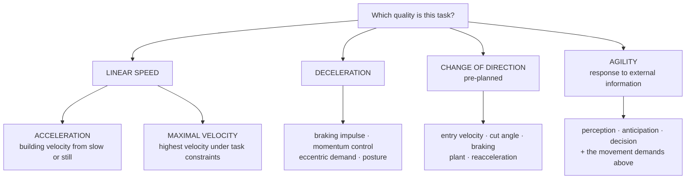

# G3 103 — Speed, Agility & Change of Direction

**Version:** 1.0
**Evidence Review Gate:** PASS WITH EVIDENCE-INTEGRITY CONDITIONS
**Status:** APPROVED FOR NOVAKORE PRODUCTION upon successful production QA
**Authority:** G3 Performance

## Production-Ready Course Specification (Authoritative Build Document)

**Course code:** G3-103
**Course title:** Speed, Agility & Change of Direction
**Division:** G3 Performance, the human performance division of G3 Sports & Fitness
**Document class:** Authoritative production specification — NovaKore build source
**Date:** August 2026
**Owner / approver:** JR Romero, CSCS — Director of Training, G3 Performance
**Production precedent:** G3 102 Course Specification v1.0 FINAL and G3 102 NovaKore Build v1.0 FINAL
**Supersedes:** All prior G3 103 outlines, drafts, and research notes

---

## 0. DOCUMENT CONTROL

### 0.1 Source of authority

| Input | Role | Authority |
|---|---|---|
| *G3 103 — ChatGPT → Claude Production Handoff v1.0* | Intellectual and curriculum direction | Doctrine, applied standards, architecture, competencies, cases, gating |
| *G3-103 Speed, Agility and Change of Direction Evidence Pack FINAL* | Research basis | Evidence only. Does not create doctrine. |
| *G3 102 Course Specification v1.0 FINAL* + *G3 102 NovaKore Build v1.0 FINAL* | Structural and production precedent | Format, schema, classification discipline, decision model |
| *G3 Performance — Doctrine & Competency Framework* (internal) | Classification language | Structural authority |
| *G3 Performance Brand Standards v1.0* | Voice and presentation | Presentation authority |

### 0.2 Review gate record

| Gate | Applies to | Status | Effect |
|---|---|---|---|
| Evidence Review Gate | *G3 103 Evidence Pack FINAL* | **PASS WITH EVIDENCE-INTEGRITY CONDITIONS** | Research phase closed. Ten conditions carried forward and discharged in §0.4. |
| Intellectual Development | *G3 103 Production Handoff v1.0* | **COMPLETE** | Doctrine, applied standards, competencies, architecture, cases, and gating supplied and not independently redefined here. |
| Production QA | This specification + build file | **PASSED** — see §20.6 | Status on completion: **APPROVED FOR NOVAKORE PRODUCTION**. |

No new research cycle was performed. No doctrine was independently redefined. No hard rule was created in an area where the handoff or the Evidence Pack preserves uncertainty.

### 0.3 What this document is and is not

This is the build specification for G3 103 inside NovaKore: purpose, outcomes, terminology, doctrine, module architecture, lesson specifications, coaching standards, competencies, assessments, practical sign-offs, cases, evidence classifications, reference mapping, and implementation structure.

It is not a speed-training textbook, not a summary of the Evidence Pack, and not a claim that G3 methodology is scientifically proven. Where G3 sets an operational rule beyond the evidence, that rule is labeled **G3 Applied Standard** and is defensible as organizational policy, not as science.

### 0.4 Evidence-integrity conditions carried forward

The Evidence Pack passed **with conditions**. Each is discharged as follows and remains binding on content developers.

| # | Condition | How this specification discharges it |
|---|---|---|
| 1 | Several 2025–2026 sources require final bibliographic confirmation before becoming anchor citations for external publication | §19.3 lists every such source with `verification: pending`. None is the sole support for any doctrine, applied standard, or assessment key. |
| 2 | Do not invent missing bibliographic details | No citation in this document was created, inferred, or completed beyond what the Evidence Pack states. One unmapped tag is flagged rather than resolved (§19.4). |
| 3 | Newer/unconfirmed sources must not independently support hard doctrine or assessment keys when stronger verified sources exist | Enforced in §11.4 item-writing standards and the §20.5 production checklist. Every doctrine carries at least one verified anchor. |
| 4 | Overspeed/assisted sprinting remains conditional | Taught as **C — Emerging/Conditional** in M5. No G3 recommendation to use or avoid it; the evidence position is stated and the decision is Coach Judgment (CJ-08). |
| 5 | Exact RST loading remains conditional | AS-103-04 governs intent, not percentage. **No universal sled load or percentage appears anywhere in this course.** CJ-06. |
| 6 | Deceleration diagnostics remain emerging | Deceleration deficit taught as **C — Emerging**, never as a gold-standard diagnostic (M7, M10). CJ-14. |
| 7 | Ecologically valid reactive-agility intervention evidence is smaller and heterogeneous | Stated in M9 and M10. Agility construct distinction is A-class; agility *intervention* evidence is presented at its actual, weaker strength. |
| 8 | Exact sprint dosage and weekly programming remain principle-driven and partly Coach Judgment | AS-103-08 preserves quality without prescribing ratios. CJ-01 to CJ-05. No microcycle formula is presented as validated. |
| 9 | Female-specific intervention evidence is limited across several domains | AS-103-12 requires population-transfer disclosure. §18.3 states the restraint position. CJ-15. |
| 10 | Injury-prevention language must remain conservative | Doctrine 103-12 governs all injury language. Case 7 assesses it directly. Claim-audit entries CA-16 and CA-17. |

**Internal production rule.** Unresolved bibliographic cleanup does not require a new research cycle and does not block internal G3/NovaKore production where the claim is also supported by verified evidence. Before external CEU recognition, accreditation submission, or public release, unresolved anchor citations must be verified or the dependent language revised. See §19.5.

### 0.5 Evidence integrity rule for this course

> **No lesson in G3 103 may state as established what the Evidence Pack classifies as conditional, emerging, inferential, or historical — and no descriptive finding may be taught as a causal coaching target.**

The second clause is specific to this course. G3 103 sits on a literature that is far richer descriptively than interventionally. The discipline that keeps the course honest is the refusal to convert a description of what fast athletes look like into an instruction for what a developing athlete should be made to do.

---

### 0.6 Foundations Authority Rule

*Added by the G3 Performance Foundations — 101–105 Curriculum Review Gate v1.0 (Correction 2). Governance text only — no doctrine, evidence class, module architecture, course outcome, practical sign-off, terminal defense, or decision model was changed.*

**The G3 Performance Foundations series is G3 101 → G3 102 → G3 103 → G3 104 → G3 105.** Within it, authority is fixed as follows and does not vary by course, document, or context.

| Course | Authoritative on |
|---|---|
| **G3 101** | The **G3 reasoning system**: evidence classes, certainty language, Evidence / G3 Applied Standard / Coach Judgment separation, population-transfer disclosure, testing and monitoring interpretation, claim-correction symmetry, scope of practice, and evidence restraint. |
| **G3 102** | The **G3 programming decision model**: DEMAND → PROFILE → GAP → PRIORITY → PRESCRIPTION → RESPONSE → ADJUST, including programming priority and change governance. |
| **G3 103** | **Speed, deceleration, COD, and agility** — where its standard is narrower than the upstream rule. |
| **G3 104** | **Strength development** — where its standard is narrower than the upstream rule. |
| **G3 105** | **Power development** — where its standard is narrower than the upstream rule. |

**Two rules bind every course in the series:**

1. **No downstream course may loosen an upstream evidence, scope, measurement, or programming-integrity standard.**
2. **Where domain courses overlap, the more specific domain governs only inside that domain; otherwise the upstream standard controls.**

**This course's position.** **G3 103 is a domain course.** It is authoritative within speed, deceleration, change of direction, and agility, and only where its standard is **narrower** than the upstream rule. It operates inside the G3 101 reasoning system and the G3 102 decision model and may not loosen either.

**Series attribution.** The three-layer discipline — Evidence / G3 Applied Standard / Coach Judgment — is attributed at series level to **G3 101**. Population-transfer governance is attributed at series level to **AS-101-16**, and may be restated locally: G3 103 restates it as **AS-103-12**, and G3 104 and G3 105 carry that restatement.

---

## 1. COURSE IDENTITY & PURPOSE

### 1.1 Course purpose

G3 103 teaches coaches to understand, distinguish, develop, assess, and coach the speed and multidirectional movement qualities that actually appear in athletic performance.

The course exists because the field collapses these qualities into one word. "Speed and agility" is used to describe a sprint, a cone drill, a shuffle, a ladder, a reactive game, and a braking task — activities with different demands, different adaptations, different tests, and different coaching. A coach who cannot tell them apart cannot select a method, cannot pick a test, and cannot explain a result.

### 1.2 The governing sequence

```
LINEAR SPEED  →  DECELERATION  →  CHANGE OF DIRECTION  →  AGILITY
```

These qualities interact. They are not interchangeable. Within linear speed, one further distinction governs everything downstream:

```
ACCELERATION  ≠  MAXIMAL VELOCITY
```

The sequence is a **conceptual organizer**, not a mandatory training progression and not a claim that a quality must be mastered before the next is trained. Its function is diagnostic: it tells a coach which quality they are looking at, which is the first question this course asks of every drill, test, and prescription.

### 1.3 The seven obligations

A coach completing G3 103 can do seven things with any speed, COD, or agility task placed in front of them:

1. **Distinguish the quality** — which of acceleration, maximal velocity, deceleration, planned COD, or reactive agility is this?
2. **Identify the demand** — what force-time, velocity, coordination, braking, or information demand does the task actually impose?
3. **Select the method** — what produces the intended adaptation for this athlete in this context?
4. **Coach the task** — observe, cue, progress, and regress without imposing a universal visual model.
5. **Measure the right construct** — choose a test that measures what is being claimed, and label it accurately.
6. **Interpret the response** — read results inside reliability, typical error, and construct limits.
7. **Defend the decision** — separate evidence, G3 Applied Standard, and Coach Judgment out loud.

These seven appear verbatim in the terminal defense (§14.5).

### 1.4 Position in the G3 education system

| | |
|---|---|
| **Prerequisite** | G3 102 (Needs Analysis & Performance Program Design), complete including T-01. Active G3 Performance coaching status. |
| **Audience** | G3 Performance coaches, G3 Youth Strength & Conditioning staff, G3 Volleyball Development staff, and scholastic/collegiate contract coaches operating under G3 programming standards. |
| **Delivery** | NovaKore self-paced modules with four observed practical sign-offs — PS-1, PS-2, PS-3, PS-4 — plus the final oral defense, T-01. |
| **Nominal duration** | 12 modules · 19.5 hours of directed study · plus practical evidence collected on the floor over a minimum 4-week window. |
| **Standing** | G3 internal CEU course. Recognition by outside certifying bodies is not claimed and is gated on §19.5. |

### 1.5 Foundations continuity

G3 103 inherits the intellectual rules established upstream in the G3 Performance Foundations curriculum, and content developers may not contradict them:

- training exists to create relevant adaptation, not merely fatigue;
- specificity is based on correspondence to target demands, not visual resemblance;
- progression is purposeful manipulation of demand relative to capacity;
- individual response matters;
- multiple qualities may be trained concurrently;
- evidence, G3 Applied Standard, and Coach Judgment must remain distinguishable;
- testing should inform decisions without pretending to reveal more than the measurement supports.

The G3 102 programming logic remains fully in force inside this course:

```
DEMAND → PROFILE → GAP → PRIORITY → PRESCRIPTION → RESPONSE → ADJUST
```

G3 103 does not replace, extend, or modify that model. It applies it to a specific domain (§5.3). Any apparent conflict between this specification and G3 102 is resolved in favour of G3 102.

### 1.6 Course outcomes

On completion, a G3 Performance coach can:

**CO-1** Define and distinguish acceleration, maximal velocity, deceleration, COD, and agility.
**CO-2** Identify the primary performance demand of a drill, test, or training task.
**CO-3** Explain major acceleration and maximal-velocity mechanical characteristics without converting correlations into universal prescriptions.
**CO-4** Design basic acceleration and maximal-velocity exposures.
**CO-5** Select resisted sprint methods according to intended adaptation without relying on a universal load rule.
**CO-6** Integrate strength and plyometric methods as supporting contributors rather than sprint substitutes.
**CO-7** Coach and progress deceleration demands.
**CO-8** Distinguish COD training from agility training.
**CO-9** Manipulate approach velocity, cut angle, braking demand, reacceleration demand, and information demand.
**CO-10** Design reactive agility tasks containing meaningful perception-action requirements.
**CO-11** Select tests that match the construct being evaluated.
**CO-12** Interpret sprint/COD/agility results within reliability and measurement limits.
**CO-13** Design developmentally appropriate youth speed and multidirectional work.
**CO-14** Organize speed/COD/agility work to protect the intended output quality.
**CO-15** Identify unsupported coaching claims.
**CO-16** Defend a speed-development prescription using evidence, G3 standards, and athlete context.

### 1.7 Voice and presentation standard

G3 Performance voice: **direct, systems-first, credentialed, unhyped**. Prohibited in course content: motivational filler, guaranteed outcomes, injury-prevention promises, and any implication that professional judgment is scientific certainty.

---

## 2. EVIDENCE CLASSIFICATION SYSTEM

### 2.1 Classes

G3 103 uses the six-class framework of its Evidence Pack. Classes A–E are identical to G3 102 and carry forward unchanged. **Class F is added for this course** and is used only in the Claim Audit register (§16) and in error-identification assessment items — it classifies claims that exceed the evidence, and no G3 content is ever *taught* at Class F.

| Class | Name | Definition | How it may be taught |
|---|---|---|---|
| **A** | Established Evidence | Repeated support from systematic reviews, meta-analyses, or converging primary evidence. | May be taught as established, bounded by population and task. |
| **B** | Supported Practice | Well supported but moderated by task, implementation, or population. | Taught as well-supported practice with the moderator stated. |
| **C** | Emerging / Conditional Evidence | Promising but incomplete, inconsistent, indirect, or narrow. | Taught as conditional. Never the sole basis for a required behavior. |
| **D** | Applied Coaching Inference | Practical inference that may be useful but is not directly established. | Taught explicitly as inference, labeled aloud. |
| **E** | Historical / Practitioner Framework | Influential framework important for interpretation, not proof. | Taught as framework and history. Never as proof. |
| **F** | Unsupported / Overstated Claim | Claim that exceeds what the evidence can currently support. | **Never taught as true.** Used only to name and correct the error. |

### 2.2 Standing labels

| Label | Meaning | Binding? |
|---|---|---|
| **G3 Doctrine** | A conceptual position G3 holds and teaches. | Yes |
| **G3 Applied Standard** | An operational rule G3 sets where evidence does not determine one answer. | Yes — organizational, not scientific |
| **Coach Judgment** | A decision G3 deliberately leaves to the qualified coach. | No fixed answer; reasoning must be documented |

### 2.3 The three-column discipline

Every module renders, visually and separately:

```
EVIDENCE          →  what the research supports, in which populations,
                     and how strongly
G3 APPLIED        →  what G3 does in its own environments and why,
STANDARD             given that evidence
COACH JUDGMENT    →  what remains the coach's call, with the reasoning
                     that must be documented
```

### 2.4 The description-to-prescription rule

Specific to G3 103 and enforced at production review:

> A statement of the form *"faster athletes display X"* may never be rendered as *"coach X"* without intervention evidence that coaching X improves performance in a comparable population. Where G3 nonetheless chooses to coach X, it does so as a labeled **G3 Applied Standard** or **Coach Judgment**, with the descriptive basis stated.

This rule exists because the sprint-mechanics literature is substantially descriptive, often drawn from adult track populations, and is routinely converted into universal cueing systems for developing team-sport athletes. That conversion is the single most common failure this course is built to prevent.

---

### 2.5 Series-level evidence taxonomy

*Added by the G3 Performance Foundations — 101–105 Curriculum Review Gate v1.0 (Correction 3). Recognition only — **no claim in this course has been reclassified.***

The G3 Performance Foundations series uses one taxonomy. **Every course recognizes all seven classes. No course is required to use all of them, and no claim is ever reclassified in order to populate a class.**

| Class | Name |
|---|---|
| **A** | Established Evidence |
| **B** | Supported Practice |
| **C** | Emerging / Conditional Evidence |
| **D** | Applied Coaching Inference |
| **E** | Historical / Practitioner Framework |
| **F** | Unsupported / Overstated Claim |
| **U** | Unresolved / Unknown |

**U is the machine-readable series class** for a question about which no defensible evidence-class assignment can be made. **"Unknown" remains the human-facing certainty label** for the same condition. The two are equivalent in force, and both mean: *G3 does not know, and no G3 material may proceed as though it does.*

**Classes used in this course:** **A, B, C, D, E, F**. U is recognized but not used. G3 103 carries its unresolved questions in the **Coach Judgment register (§8)** rather than assigning them a class. Nothing has been reclassified.

---

## 3. CONTROLLED TERMINOLOGY

Binding across G3 103, all downstream G3 courses, G3 testing outputs, and NovaKore data fields.

| Term | G3 definition | Not to be confused with |
|---|---|---|
| **Speed** | Umbrella performance concept describing rapid locomotor performance. | A specific trainable quality. G3 does not use "speed" as a substitute for a named sprint, COD, or agility quality. |
| **Acceleration** | Increase in running velocity from a stationary or slower state. Phase-specific. | Maximal velocity. A 10 m time. |
| **Maximal velocity** | The highest sprinting velocity achieved under the task constraints. | Anything a short acceleration test directly measures. |
| **Sprint phase** | A region of the sprint with characteristic posture, contact time, and force-time behavior. Boundaries vary by task, athlete, and distance. | A fixed distance that applies to every athlete. |
| **Deceleration** | Intentional reduction of velocity requiring braking impulse, momentum control, eccentric loading, and postural organization. A distinct performance demand. | The first half of a COD drill. "Stopping." |
| **Change of direction (COD)** | A **pre-planned** directional change in which the movement solution is known before execution. | Agility. |
| **Agility** | A rapid whole-body movement response to an external stimulus, including perceptual and decision-making demands. | COD. Footwork. Quickness. |
| **Reactive agility** | Operational term for agility tasks requiring response to a live or simulated external cue. | Any pre-planned drill performed quickly. |
| **Perception-action coupling** | The link between the information an athlete perceives and the movement they produce. What separates agility from COD. | Reaction time in isolation. |
| **COD deficit** | A task-dependent diagnostic lens contextualizing COD performance relative to linear speed. | A pure or universal measure of "true COD ability." |
| **Deceleration deficit** | An emerging analytical concept. | An established gold-standard diagnostic. |
| **Entry / approach velocity** | The velocity carried into a braking or directional-change task. A primary task constraint. | Drill speed generally. |
| **Cut angle** | The magnitude of directional change demanded by the task. Different angles have different determinants. | A cosmetic drill variable. |
| **Reacceleration** | Re-development of velocity after a directional change or braking action. A separate contributor to COD outcome. | Part of "the cut." |
| **Information demand** | The extent to which a task requires the athlete to perceive relevant information and select a response. | Drill busyness or visual complexity. |
| **Resisted sprint training (RST)** | Sprinting against added resistance to alter the force-velocity demand of the task. | A universal loading prescription. |
| **Assisted / overspeed sprinting** | Sprinting with external assistance to exceed unassisted velocity. Evidence conditional. | An established top-speed method. |
| **Quality preservation** | Organizing work so intended output and technical quality are maintained. | A fixed rest ratio. |
| **SAQ** | A historically influential category — "speed, agility, quickness." | A scientifically precise umbrella. G3 does not use SAQ to erase the distinctions above. |
| **Typical error** | The normal measurement noise in a test — how much a result moves when nothing has changed. | An athlete improving or declining. |
| **Construct validity** | Whether a test measures the quality it is claimed to measure. | Whether a test is reliable. |

**Terminology enforcement.** NovaKore glossary entries link from first use in every module. Assessment items use these terms exactly. Calling a pre-planned drill "agility" is a scored error, not a stylistic preference (AS-103-10, CA-10, CA-11).

---
## 4. G3 103 DOCTRINE

Twelve doctrines form the conceptual backbone of this course. Each is stated in production form, given its evidence class and anchor sources, and given its teaching boundary — the point past which the doctrine stops being supported and becomes organizational policy or coach judgment.

Doctrine IDs follow the G3 102 convention with a course prefix: **D103-1** through **D103-12**.

---

### Doctrine 103-1 — Speed Is Phase-Specific

**Statement.** Acceleration and maximal velocity are related but distinct sprint qualities. Coaches identify which speed demand is being trained or assessed rather than treating sprint performance as one undifferentiated quality.

**Evidence class:** **A — Established Evidence.** The sprint literature treats sprint performance as phase-specific rather than undifferentiated; acceleration and maximal velocity differ in posture, contact time, stride behavior, and force-time characteristics. [EP103-01, EP103-13, EP103-12 · cite:96, cite:101, cite:104]

**Teaching boundary.** The *distinction* is established. **Exact phase boundaries are not.** Where one phase ends and another begins varies by task, athlete level, and testing distance, and G3 publishes no universal distance cut-point. A coach who says "acceleration is 0–10 m for everyone" has converted a real distinction into false precision.

---

### Doctrine 103-2 — Exposure Is Irreplaceable

**Statement.** General strength, power, and plyometric training can support sprint development, but they do not fully replace sprint-specific exposure when the desired adaptation is sprint performance.

**Evidence class:** **B — Supported Practice.** Resistance and combined resistance-plyometric methods transfer to sprint outcomes, but transfer is partial, outcome-specific, and comparator-dependent rather than automatic; the literature supports these methods as contributors, not substitutes. [EP103-07, EP103-08, EP103-09, EP103-01 · cite:87, cite:89, cite:91, cite:96]

**Teaching boundary.** This is not a claim that the weight room is unimportant, and not a dose statement. It sets no minimum sprint volume — that remains Coach Judgment (CJ-01). Two of the transfer sources are pending bibliographic confirmation (§19.3); the doctrine also rests on verified anchors and does not depend on them alone.

---

### Doctrine 103-3 — Mechanics Inform; They Do Not Dictate

**Statement.** Biomechanics can describe characteristics associated with better sprint performance. A descriptive characteristic does not automatically become a causal coaching target. G3 does not impose one universal sprint-mechanics model on every athlete.

**Evidence class:** **B — Supported Practice** for the doctrine as a methodological position, resting on **A**-class descriptive mechanics and the documented scarcity of technique-intervention evidence relative to that descriptive base. Universalizing an elite track model is **F — Unsupported**. [EP103-01, EP103-11, EP103-12 · cite:96, cite:104, cite:105]

**Teaching boundary.** This does not mean technique coaching is useless or that observation is pointless. It means a visually salient characteristic — front-side mechanics, shin angle, arm action — carries stronger descriptive than interventional support, and much of that description comes from adult track populations. Coach it as an Applied Standard or Judgment with the basis stated (§2.4, AS-103-03), never as a proven lever.

---

### Doctrine 103-4 — Deceleration Is a Performance Quality

**Statement.** Deceleration is not merely the first half of a COD drill. Braking capacity, momentum control, approach velocity, posture, and eccentric demands justify treating deceleration as a distinct training and assessment consideration.

**Evidence class:** **A — Established Evidence** that deceleration is a distinct demand characterized by high braking impulse, eccentric loading, and momentum control, particularly in intermittent multidirectional sport. **C — Emerging** for deceleration diagnostics and for the physical qualities that best develop it, which remain more descriptive than intervention-rich. [EP103-14, EP103-15, EP103-16 · cite:98, cite:108, cite:100]

**Teaching boundary.** Distinctness is well supported. *Prescription* is not. G3 publishes no deceleration progression ladder as evidence-derived (AS-103-05 is an Applied Standard) and no deceleration-deficit threshold. Claims that a specific plyometric category uniquely develops braking are treated with caution — that link is plausible and partly supported, not direct.

---

### Doctrine 103-5 — COD Is Not Agility

**Statement.** Pre-planned COD and agility are different constructs. COD involves a known movement solution. Agility requires perception, decision, and response to external information.

**Evidence class:** **A — Established Evidence.** The distinction is consistent across the agility-determinants and COD-versus-agility literature, and reactive tests discriminate skill level beyond what planned COD tests capture. [EP103-04, EP103-19, EP103-21, EP103-22 · cite:85, cite:90, cite:107, cite:110]

**Teaching boundary.** Distinct does not mean unrelated — the two share physical determinants, and COD capability is part of what an agile athlete expresses. The doctrine forbids treating them as *the same*, not treating them as connected. Terminology across the applied literature remains somewhat inconsistent; G3's definitions (§3) govern inside G3.

---

### Doctrine 103-6 — Closed Drills Do Not Automatically Train Agility

**Statement.** Cone patterns, ladders, and pre-planned movement drills may train coordination, rhythm, movement skill, or COD. They are not labeled true agility development unless meaningful external information and response demands are present.

**Evidence class:** **B — Supported Practice.** Common "agility drills" train footwork rhythm or pre-planned execution more than perception-driven agility unless a reactive component is embedded; the ladder- and cone-drill claims are classified **F** in the Evidence Pack's own audit. [EP103-04, EP103-19, EP103-21 · cite:85, cite:90, cite:107]

**Teaching boundary.** Closed drills are not condemned. They may be excellent for coordination, movement organization, tissue exposure, or teaching a pattern — G3 simply requires that they be *named* for what they train. The error is the label, not the drill.

---

### Doctrine 103-7 — Transfer Is Demand-Based, Not Appearance-Based

**Statement.** A drill does not transfer because it looks athletic or resembles sport. Transfer claims are tied to relevant force-time, velocity, coordination, braking, movement, or perception-action demands.

**Evidence class:** **B — Supported Practice.** The evidence is more consistent with a constraint- and demand-based view of transfer than with visual resemblance; drills transfer more plausibly when they preserve the relevant force, timing, coordination, or information-processing demands. [EP103-23, EP103-01 · cite:75, cite:96]

**Teaching boundary.** Inherited directly from G3 102 Doctrine 5 and applied here to drills rather than exercises. This is not a rejection of specificity — it is a rejection of resemblance as evidence of it. EP103-23 is pending bibliographic confirmation; the doctrine also rests on EP103-01 and on the parallel G3 102 evidence base.

---

### Doctrine 103-8 — Speed Quality Requires Quality Exposure

**Statement.** High-speed and high-intensity multidirectional work is generally organized to preserve meaningful output and technical quality. Fatigue is not evidence that speed training became more sport-specific.

**Evidence class:** **B — Supported Practice.** The evidence is stronger for the claim that high-speed development depends on high-quality exposures than for the claim that fatigued speed work is desirable because sport is fatiguing. Fatigue does alter sprint, braking, and cutting mechanics. [EP103-01, EP103-14 · cite:96, cite:98]

**Teaching boundary.** No rest ratio, repetition count, or velocity-decrement threshold is established here (AS-103-08, CJ-03, CJ-07). Quality preservation is the principle; the numbers are judgment. Nor does the doctrine forbid training speed qualities under fatigue where the sport demand genuinely requires it — it forbids claiming that the fatigue *made it more specific*.

---

### Doctrine 103-9 — Load Serves the Intended Sprint Adaptation

**Statement.** Resisted sprinting is a supported training tool, especially for acceleration, but G3 does not adopt one universal sled load or percentage for every athlete and outcome.

**Evidence class:** **A — Established Evidence** that resisted sprint training can improve sprint performance in field-based athletes, particularly acceleration. **C — Emerging/Conditional** for optimal loading strategy: disagreement remains about whether heavier loads are consistently preferable, superiority over normal sprinting is less consistent outside early acceleration, and device and method differences likely explain part of the disagreement. [EP103-05, EP103-06, EP103-27 · cite:81, cite:84, cite:92]

**Teaching boundary.** **No percentage, no velocity-decrement number, and no load table appears anywhere in G3 103.** Both absolutist claims are rejected: "heavier is always better" and "sleds make you slow" are Class F (CA-06, CA-07). The load decision is AS-103-04 plus Coach Judgment (CJ-06). EP103-27 is a repository record pending final publication details and is never the sole support for anything taught.

---

### Doctrine 103-10 — Testing Measures Tasks, Not Labels

**Statement.** A sprint split, COD test, or reactive test measures performance under its specific constraints. Coaches do not infer maximal velocity, agility, or isolated physical qualities from a test that does not directly establish them.

**Evidence class:** **A — Established Evidence.** A short sprint split may reflect acceleration more than maximal velocity; a COD test reflects linear speed and braking as much as or more than "agility"; linear sprint, planned COD, and reactive tests are not interchangeable constructs. Reliability depends on distance, setup, population, and procedure. [EP103-02, EP103-18, EP103-19, EP103-20, EP103-21 · cite:97, cite:79, cite:90, cite:102, cite:107]

**Teaching boundary.** This is a labeling and inference rule, not a rejection of field testing. G3 tests, and tests often — it simply names what was measured (AS-103-10). No universal smallest-worthwhile-change threshold is created for any test in this course.

---

### Doctrine 103-11 — Youth Speed Development Is Readiness- and Development-Aware

**Statement.** Youth athletes can improve sprint, COD, and agility-related qualities. Programming considers maturation, coordination, training age, readiness, and exposure history rather than relying on rigid chronological-age windows.

**Evidence class:** **B — Supported Practice.** Trainability in youth is supported, especially for broad modalities such as plyometrics, repeated sprint work, and some agility training, though quality and specificity of evidence vary. Claims about rigid developmental "windows" are less secure than coaching culture suggests. [EP103-03, EP103-24, EP103-09 · cite:88, cite:76, cite:91]

**Teaching boundary.** Rejecting age-window mythology is not a claim that maturation is irrelevant — peak height velocity and developmental stage may matter; what is unsupported is narrow age-based rules without broader readiness consideration. Detailed sprint-mechanics prescriptions for youth remain extrapolated from adult or more-trained populations and are labeled as such (AS-103-12). Continuous with G3 102 Doctrine 9.

---

### Doctrine 103-12 — Injury Claims Require Causal Restraint

**Statement.** G3 distinguishes tissue demand, association, mechanistic plausibility, risk-factor evidence, and intervention evidence. Sprinting, deceleration, or COD training is not marketed as inherently dangerous or inherently injury-preventive without appropriate evidence.

**Evidence class:** **B — Supported Practice** as a methodological position. The literature supports substantial tissue demands in sprinting, braking, and cutting, and the relevance of maximal-velocity exposure to hamstring function and loading — but association and mechanistic plausibility are not intervention proof. Both "sprinting prevents hamstring injuries" and "maximal-velocity sprinting is inherently dangerous" are **F — Unsupported**. [EP103-14, EP103-16, EP103-11 · cite:98, cite:100, cite:105]

**Teaching boundary.** Restraint runs in both directions. Coaches may not promise protection, and may not withhold sprint exposure on a danger claim the evidence does not support. For youth, available evidence does not support treating well-designed speed development as inherently unsafe; safety interpretation is anchored in readiness, exposure management, and context. **G3 marketing, parent communication, and athlete communication are bound by this doctrine.**

---

### 4.13 Doctrine summary table (NovaKore tag source)

| ID | Doctrine | Evidence class | Primary modules | Standing |
|---|---|---|---|---|
| D103-1 | Speed is phase-specific | A | M1, M2, M3 | G3 Doctrine |
| D103-2 | Exposure is irreplaceable | B | M5, M6 | G3 Doctrine |
| D103-3 | Mechanics inform; they do not dictate | B (A descriptive / F universalized) | M4 | G3 Doctrine |
| D103-4 | Deceleration is a performance quality | A (C for diagnostics) | M7 | G3 Doctrine |
| D103-5 | COD is not agility | A | M8, M9 | G3 Doctrine |
| D103-6 | Closed drills do not automatically train agility | B | M9 | G3 Doctrine |
| D103-7 | Transfer is demand-based, not appearance-based | B | M6, M9 | G3 Doctrine |
| D103-8 | Speed quality requires quality exposure | B | M5, M11 | G3 Doctrine |
| D103-9 | Load serves the intended sprint adaptation | A (C for loading strategy) | M6 | G3 Doctrine |
| D103-10 | Testing measures tasks, not labels | A | M10 | G3 Doctrine |
| D103-11 | Youth speed development is readiness-aware | B | M11 | G3 Doctrine |
| D103-12 | Injury claims require causal restraint | B | M7, M12 | G3 Doctrine |

---

## 5. THE G3 103 QUALITY MODEL

### 5.1 The quality map

Every speed, COD, or agility task a G3 coach writes, watches, or tests is located on this map before anything else happens.



**Reading the map.** The four columns are distinct demands. Acceleration and maximal velocity are sub-qualities of linear speed and are not interchangeable. Agility contains movement demands *plus* an information demand — which is why an agility task always has a COD or locomotor component inside it, and why a COD task never becomes agility simply by being performed faster.

### 5.2 The task-identification questions

Applied to any drill or test, in order:

1. **What velocity is involved, and where does it come from?** Standing start, rolling entry, or maximal approach?
2. **Is velocity being built, held, or reduced?** Acceleration, maximal velocity, or deceleration.
3. **Is direction changing, and is the change known in advance?** COD if known; candidate agility if not.
4. **What information must the athlete perceive to solve the task?** None, artificial (a call, a light), or representative (an opponent, a ball, a live scenario).
5. **What is the intended adaptation, and does the task's demand match it?**

A coach who can answer these five for every task in their session has satisfied AS-103-01.

### 5.3 Applying the G3 102 decision model

G3 103 does not modify the G3 102 model. It supplies the domain content for each stage.

| Stage | The G3 102 question | What G3 103 supplies |
|---|---|---|
| **DEMAND** | What does the sport or role require? | Which speed qualities the sport actually demands — acceleration distances, whether true maximal velocity is reached, braking frequency and entry velocities, cut angles, and how much of the sport's directional change is pre-planned versus information-driven. |
| **PROFILE** | What does the athlete possess? | Construct-appropriate test selection (M10) and results interpreted inside reliability and typical error. |
| **GAP** | Which differences are real and relevant? | Distinguishing a real acceleration deficit from a maximal-velocity deficit from a braking deficit from an information-processing deficit — differences that a single "speed" label conceals. |
| **PRIORITY** | What earns the athlete's best effort? | Which speed quality is primary for this athlete this phase, and what that costs the others (G3 102 emphasis tiers apply unchanged). |
| **PRESCRIPTION** | What is the actual program? | Method selection (M5, M6), deceleration and COD task design (M7, M8), agility design with genuine information demand (M9), and quality-preserving session and week organization (M11). |
| **RESPONSE** | What is actually happening? | Retest against typical error, with construct labeling maintained — improvement on a 10 m split is not evidence of maximal-velocity development. |
| **ADJUST** | Change, hold, or progress — and why? | Progression by manipulating velocity, braking demand, angle, and information demand rather than by a fixed ladder (CJ-09 to CJ-11). |

### 5.4 Model integrity rules

1. **Name the quality before writing the task.** A prescription without a named primary quality is not a G3 prescription (AS-103-01).
2. **No stage produces a score.** As in G3 102, no tool, dashboard, or NovaKore feature may compute a training priority or generate an automated athlete recommendation from this course's content.
3. **The map classifies; it does not sequence.** LINEAR SPEED → DECELERATION → COD → AGILITY is a conceptual organizer. It is not a claim that an athlete must complete one before training the next.
4. **G3 102 governs conflicts.** Where this course and G3 102 appear to disagree, G3 102 is authoritative.

---

## 6. MODULE ARCHITECTURE

### 6.1 Overview

| # | Module | Quality focus | Core doctrine | Est. time | Sign-off |
|---|---|---|---|---|---|
| M1 | Language Before Programming | All | D103-1, D103-5 | 75 min | — |
| M2 | Understanding Acceleration | Acceleration | D103-1, D103-3 | 90 min | — |
| M3 | Understanding Maximal Velocity | Maximal velocity | D103-1, D103-3 | 90 min | — |
| M4 | Coaching Sprint Mechanics | Linear speed | D103-3 | 105 min | **PS-1** |
| M5 | Training Linear Speed | Acceleration + max velocity | D103-2, D103-8 | 105 min | — |
| M6 | Resisted Sprinting + Supporting Physical Qualities | Acceleration | D103-9, D103-2, D103-7 | 105 min | — |
| M7 | Deceleration as a Performance Quality | Deceleration | D103-4, D103-12 | 105 min | **PS-2** |
| M8 | Change of Direction | COD | D103-5, D103-10 | 105 min | — |
| M9 | Agility & Perception-Action Coupling | Agility | D103-5, D103-6, D103-7 | 105 min | **PS-3** |
| M10 | Testing Speed, COD & Agility | All | D103-10 | 90 min | — |
| M11 | Youth Development + Programming Integration | All | D103-11, D103-8 | 90 min | — |
| M12 | Integrated G3 Speed Decision-Making | All | D103-12 + all | 105 min | **PS-4**, **T-01** |

Total directed study: 1,170 minutes — 19.5 hours — plus practical evidence collected over a minimum four-week window. Broadly comparable to G3 102 (18.5 hours).

### 6.2 Standard module structure (NovaKore content pattern)

Every module is built from the same seventeen production elements, in this order:

1. Module ID
2. Title and framing statement
3. Purpose
4. Learning objectives
5. Doctrine IDs
6. Applied-standard IDs
7. Competency IDs
8. Evidence classifications
9. Lesson/section structure
10. Coaching applications
11. Common errors
12. Case/scenario
13. Knowledge assessment
14. Applied assessment
15. Practical sign-off linkage
16. Source/reference mapping
17. Prerequisite/gating logic

A module missing any element fails production review.

### 6.3 Gating

```
M1 → M2 → M3 → M4 → [PS-1 GATE] → M5 → M6 → M7 → [PS-2 GATE] →
M8 → M9 → [PS-3 GATE] → M10 → M11 → M12 → [PS-4] → [T-01] → COMPLETE
```

- **PS-1 gates M5.** Sprint observation and coaching must be observed before training-method application. This implements the handoff rule that PS-1 is required before advanced training-method application.
- **PS-2 gates M8.** Deceleration coaching is observed before directional complexity is added, consistent with AS-103-05.
- **PS-3 gates M10.** The COD/agility construct distinction must be demonstrable before testing selection is taught.
- **PS-4** follows M12 and requires the delivery window to be complete.
- **T-01 requires all four sign-offs** and all module assessments at standard. T-01 is required for course competency completion.
- Modules unlock sequentially; completed modules remain accessible.

---
## 7. G3 APPLIED STANDARDS

These are the operational rules G3 Performance applies in its own environments for speed, COD, and agility work. **A G3 Applied Standard is organizational policy, adopted because a defensible answer is required and the evidence does not determine one.** Coaches follow them inside G3 and describe them accurately outside G3 — as what G3 does, not as what the science says.

Applied-standard IDs follow the G3 102 convention with a course prefix: **AS-103-01** through **AS-103-12**.

---

### AS-103-01 — Name the Quality

Every speed/COD/agility prescription identifies the primary quality being targeted: **acceleration, maximal velocity, deceleration, planned COD, or reactive agility.**

*Evidence basis:* D — operational rule built on the A-class distinctions in D103-1 and D103-5. *Standing:* Applied Standard. *Enforced:* every `speed_task` object in NovaKore requires a `primary_quality` value (§20.4).

### AS-103-02 — Preserve Sprint Exposure

When sprint performance is a priority, the program includes actual sprint exposure appropriate to the targeted phase rather than relying solely on weight-room or plyometric proxies.

*Evidence basis:* B — from D103-2. *Standing:* Applied Standard. *Boundary:* sets no volume, distance, or frequency. That is CJ-01 and CJ-02.

### AS-103-03 — Technique With Restraint

Technique coaching is used to improve task execution. Athletes are **not** required to conform to a single visual model before meaningful sprint exposure is allowed.

*Evidence basis:* B — from D103-3; the claim that perfect technique must precede speed exposure is Class F (CA-14). *Standing:* Applied Standard. *Boundary:* this restrains the gate, not the coaching. Coaches still coach.

### AS-103-04 — Resisted Sprint Intent

Resisted sprint load and method are selected according to intended adaptation, athlete capacity, equipment, and output quality. **No universal loading percentage is G3 law.**

*Evidence basis:* A that RST works; C for loading strategy — from D103-9. *Standing:* Applied Standard. *Boundary:* CJ-06 owns the number. Any G3 material stating a percentage as a rule fails production review.

### AS-103-05 — Deceleration Before Directional Complexity

Where appropriate, athletes are taught and exposed to braking and momentum-control demands before approach velocity, cut severity, reactive complexity, or total multidirectional density are escalated.

*Evidence basis:* **D — Applied Coaching Inference.** *Standing:* Applied Standard. *Boundary — stated explicitly in the lesson:* **this is an Applied Standard, not a universal research-derived progression ladder.** The literature supports manipulating braking demand, velocity, and complexity as progression variables; it does not establish this order for every athlete. CJ-10.

### AS-103-06 — COD Task Specificity

COD is programmed and evaluated with awareness of approach velocity, cut angle, braking demand, reacceleration demand, and test/task structure.

*Evidence basis:* A — COD performance depends on multiple contributors and task structure; determinants differ by angle. *Standing:* Applied Standard. *Boundary:* no angle progression sequence is prescribed (CJ-09).

### AS-103-07 — Agility Requires Information

At least part of an agility-development progression requires athletes to perceive relevant information and select and execute a movement response.

*Evidence basis:* A for the construct distinction; B/C for the training claim, since agility-intervention evidence is smaller and heterogeneous. *Standing:* Applied Standard. *Boundary:* "at least part" is deliberate. G3 does not require every drill to be reactive, and does not claim a proven dose of reactive work.

### AS-103-08 — Quality Preservation

Rest and repetition structure are sufficient to preserve the intended performance quality. **Exact rest ratios are not universal G3 doctrine.**

*Evidence basis:* B — from D103-8. *Standing:* Applied Standard. *Boundary:* CJ-03. The operational test is output, not the clock — if times, velocities, or movement quality degrade below the session's intent, the exposure has stopped serving its purpose.

### AS-103-09 — Testing Standardization

G3 testing uses objective timing where practical, standardized setups, familiarization, consistent surfaces and conditions, and known measurement error before small changes are interpreted.

*Evidence basis:* A — electronic timing is preferable to hand timing; reliability depends on distance, setup, population, and procedure; learning effects, familiarization, surface, and environment all matter. *Standing:* Applied Standard. *Boundary:* **no universal smallest-worthwhile-change threshold is created** for any test in this course (§15.4).

### AS-103-10 — Construct-Appropriate Testing

A pre-planned COD test is not called an agility test. A short acceleration split is not called a maximal-velocity test. **G3 labels what was actually measured.**

*Evidence basis:* A — from D103-10. *Standing:* Applied Standard and binding language rule. *Enforced:* every `test_record` in NovaKore carries `construct_measured`, and mislabeling is a scored assessment error.

### AS-103-11 — Multi-Measure Interpretation

When profiling multidirectional performance, relevant measures are combined rather than using one test to diagnose all speed, COD, braking, and agility qualities.

*Evidence basis:* D — Applied Coaching Inference, consistent with the Evidence Pack's own inference candidates. *Standing:* Applied Standard. *Boundary:* no battery, weighting, or composite score is prescribed — and no composite athlete score may be computed (§20.4).

### AS-103-12 — Population Transfer Disclosure

When a prescription is substantially extrapolated from elite track, adult, soccer-heavy, or male-dominant evidence, the educational content says so.

*Evidence basis:* A — the population-transfer limitations are documented in the Evidence Pack itself. *Standing:* Applied Standard. *Enforced:* every module's evidence block carries a **Population transfer** line where extrapolation is occurring, and disclosure is scored in the terminal defense.
*Series attribution (Foundations Curriculum Review Gate v1.0):* **AS-103-12 is this course's local restatement of the series-level population-transfer standard, AS-101-16** (§0.6). The wording, evidence basis, standing, and enforcement above are unchanged; the attribution is recorded so that the series has one origin for the standard rather than two. G3 104 and G3 105 carry this restatement.

### 7.13 Inherited G3 102 standards

The following G3 102 Applied Standards remain in force inside G3 103 and are referenced, not duplicated: **AS-06** (test conditions recorded at time of testing), **AS-09** (emphasis tier for every trained quality), **AS-10** (written opportunity-cost statement), **AS-11** (no tool may compute a priority), **AS-12** (stated intended adaptation for every exercise), **AS-14** (session order reflects priority), **AS-26** (no automated readiness recommendation), **AS-27** (adjustment log), **AS-30** (youth entry by readiness, not age).

G3 103 creates **no new hard rules** beyond the twelve standards above.

---

## 8. COACH JUDGMENT REGISTER

These sixteen areas are conditional and **must not become universal hard rules** anywhere in G3 103. Examples and decision guides may be created, but they are labeled as G3 Applied Standards, worked examples, or Coach Judgment.

| ID | Area | Evidence position | What G3 supplies | What remains the coach's call |
|---|---|---|---|---|
| **CJ-01** | Exact sprint volume | No fixed prescription across populations and tasks | AS-103-02, AS-103-08 | Volume for this athlete, phase, and schedule |
| **CJ-02** | Exact sprint distance prescription | Phase boundaries vary by task, athlete, distance | The phase concept (D103-1) | Distances used to target a phase |
| **CJ-03** | Exact rest intervals | No universal rest ratio established | Quality preservation as the criterion (AS-103-08) | The interval |
| **CJ-04** | Exact weekly placement | No universal microcycle model supported | The principle of protecting high-quality exposures | Placement in this week |
| **CJ-05** | High/low microcycle organization | E/D — historically influential, limited direct comparative evidence | Taught as a practitioner framework (§17.3) | Whether to use it |
| **CJ-06** | Exact resisted-sprint load | C — loading strategy contested; no universal threshold | AS-103-04 (intent-based selection) | The load and method |
| **CJ-07** | Exact velocity-decrement threshold | Operationally useful; no one threshold supported | Quality preservation as the criterion | Whether and where to set one |
| **CJ-08** | Assisted / overspeed use | C — less secure than RST; not clearly superior to normal sprinting | The evidence position, stated plainly | Whether to use it at all |
| **CJ-09** | Exact COD angle progression | No universal ladder | AS-103-06 variables | The sequence for this athlete |
| **CJ-10** | Exact deceleration progression | No universal ladder | AS-103-05 as an Applied Standard, labeled | The sequence for this athlete |
| **CJ-11** | Exact reactive-agility progression | Intervention evidence smaller and heterogeneous | AS-103-07 (information must be present) | The progression |
| **CJ-12** | Exact technique thresholds before faster sprinting | F — delaying exposure to a universal technique standard is unsupported | AS-103-03 | Coaching emphasis and task constraints |
| **CJ-13** | Deterministic COD-deficit interpretation | Task-dependent; not a complete isolate | The lens and its limits (M8, M10) | How much weight to give it |
| **CJ-14** | Deterministic deceleration-deficit interpretation | C — emerging analytical concept | The concept and its limits (M7, M10) | How much weight to give it |
| **CJ-15** | Sex-specific programming rules | Evidence limited across several domains | AS-103-12 disclosure; restraint position (§18.3) | Individual modification on individual grounds |
| **CJ-16** | Injury-prevention guarantees from sprint, deceleration, or COD exposure | F in both directions | D103-12 restraint | Exposure decisions, communicated without guarantees |

**Teaching requirement.** Every one of these areas is named to the learner as Coach Judgment at the point it is taught. A learner must be able to identify, for any G3 103 practice they follow, whether it is evidence, standard, or judgment. This is assessed directly in T-01.

---
## 9. DETAILED MODULE SPECIFICATIONS

---

## MODULE 1 — Language Before Programming

**Module ID:** M1 · **Quality focus:** all · **Duration:** 75 min · **Gating:** entry module

**Framing statement:** Every bad speed program starts with a word. Call a cone drill "agility," a 10 m split "speed," and a braking task "the first half of the cut," and you have already lost the ability to choose a method, pick a test, or explain a result.

### 1 · Purpose

To install the controlled vocabulary the rest of the course depends on, and to make the learner capable of naming the quality a task actually trains before any programming decision is made.

### 2 · Learning objectives

- **M1.1** Define speed, acceleration, maximal velocity, deceleration, COD, agility, and reactive agility using the G3 definitions.
- **M1.2** Explain why acceleration and maximal velocity are treated as distinct qualities.
- **M1.3** Explain why COD and agility are distinct constructs.
- **M1.4** Apply the five task-identification questions to any drill or test.
- **M1.5** Describe COD deficit as a task-dependent lens rather than a pure measure.
- **M1.6** State why G3 does not use "SAQ" as a precise technical category.
- **M1.7** Identify where terminology in the wider literature remains unsettled.

### 3 · Doctrine IDs

D103-1 · D103-5 · D103-6 (introduced)

### 4 · Applied-standard IDs

AS-103-01 · AS-103-10 (introduced)

### 5 · Competency IDs

C103-01 (primary) · C103-02 (introduced)

### 6 · Evidence classification

| Statement | Class | Basis |
|---|---|---|
| Sprint performance is phase-specific; acceleration and maximal velocity are distinct | **A** | EP103-01, EP103-13 · cite:96, cite:101 |
| Exact phase boundaries vary by task, athlete level, and testing distance | **A** (a statement about the limits of the evidence) | EP103-01, EP103-13 |
| COD and agility are distinct constructs; agility includes perception and decision-making | **A** | EP103-04, EP103-19, EP103-21 |
| Deceleration is a distinct athletic demand | **A** | EP103-14, EP103-15 |
| COD deficit is a task-dependent lens, not a pure isolate | **C** | EP103-18, EP103-04 |
| Terminology across the applied literature is not fully consistent | **A** (documented in the source base) | EP103-04, EP103-03, EP103-19 |
| SAQ as a precise scientific category | **E / F** | EP103-25 · historically influential, conceptually imprecise |

**Population transfer:** none material in this module; the definitional evidence spans mixed populations.
**Coach Judgment:** none in this module. Definitions are not negotiable inside G3.

### 7 · Lesson structure

**L1.1 — Why the word matters.** One session, four "speed" activities, four different adaptations. The cost of the collapsed vocabulary is that the coach cannot say what any of it was for.

**L1.2 — Speed, acceleration, maximal velocity.** Speed as umbrella; acceleration as building velocity from a slower or stationary state; maximal velocity as the highest velocity achieved under the task's constraints. The phase distinction is established; the boundary is not. G3 publishes no universal distance cut-point, and coaches should be suspicious of anyone who does.

**L1.3 — Deceleration.** Braking impulse, momentum control, eccentric loading, postural organization. Named as its own demand here so that it is not silently absorbed into COD in M8.

**L1.4 — COD and agility.** COD: the movement solution is known before execution. Agility: a rapid whole-body response to an external stimulus, containing perceptual and decision demands. Reactive agility as the operational term for tasks with a live or simulated cue.

**L1.5 — The five task-identification questions.** Applied to eight tasks on video: a block start, a flying 20, a shuttle, a shuffle-and-react, a ladder sequence, a hard braking stop, a 45° cut, a small-sided game moment. The learner names the quality and the demand for each, and states which are pre-planned.

**L1.6 — COD deficit, honestly.** What it attempts, why it is attractive, and why it remains task-dependent and cannot be treated as an isolated measure of "true COD ability."

**L1.7 — SAQ and unsettled language.** SAQ is discussed as a historically influential category, not a precise one. Terminology in the wider literature — agility, reactive agility, COD speed, sport agility — is not fully consistent, and G3's definitions govern inside G3 rather than claiming the field has reached consensus.

### 8 · Coaching applications

The immediate application is the session plan. Every line of a G3 speed session names its quality before it names its drill. In a G3 Youth or Volleyball Development environment this typically reveals that a session labeled "speed and agility" contained one acceleration exposure, several COD patterns, and no agility at all — which is a legitimate session, provided it is named correctly and the coach knows what was and was not trained.

### 9 · Common errors

- Using "speed" as the label for every fast activity in a session.
- Calling a pre-planned cone pattern an agility drill.
- Treating a 10 m time as a measure of an athlete's top speed.
- Absorbing deceleration into "the cut" so it never receives its own attention.
- Publishing a fixed distance boundary between acceleration and maximal velocity as though it were universal.
- Using COD deficit as though it isolated a pure quality.
- Using SAQ as if it were a technical taxonomy.

### 10 · Case / scenario

**Scenario M1-A — The session audit.** The learner receives a real 45-minute "speed and agility" session plan containing eight activities. They classify each by primary quality, identify which are pre-planned and which contain genuine information demand, and rewrite the session's stated purpose in G3 language. *No activity is deleted in this task — the exercise is naming, not judging.*

### 11 · Knowledge assessment

- **K1.1** (MC) Which statement best describes the relationship between acceleration and maximal velocity?
- **K1.2** (Select all) Which features distinguish agility from pre-planned COD?
- **K1.3** (MC) A 10 m sprint split primarily reflects…
- **K1.4** (True/False + justification) "The acceleration phase ends at 10 m."
- **K1.5** (Drill classification) Classify six tasks by primary quality.
- **K1.6** (Short answer) State one reason COD deficit should not be treated as a pure measure of COD ability.

### 12 · Applied assessment

**A1 — Terminology audit.** The learner submits a real session plan from their own environment, annotated task by task with primary quality, pre-planned versus information-driven status, and intended adaptation, plus a corrected session title. **Standard:** every task classified; no task labeled agility without an information demand; no acceleration/maximal-velocity conflation; the corrected title is defensible.

### 13 · Practical sign-off linkage

None. Terminology accuracy carries into **PS-1** and is scored in **T-01**.

### 14 · Source / reference mapping

EP103-01 · EP103-13 · EP103-04 · EP103-19 · EP103-21 · EP103-14 · EP103-15 · EP103-18 · EP103-03 · EP103-25

### 15 · Prerequisite / gating logic

**Prerequisite:** G3 102 complete (including T-01); active G3 coaching status. **Unlocks:** M2. **Gate:** none.

---

## MODULE 2 — Understanding Acceleration

**Module ID:** M2 · **Quality focus:** acceleration · **Duration:** 90 min · **Gating:** requires M1

**Framing statement:** Acceleration is the phase most G3 athletes actually live in. It is also the phase where a real mechanical finding — the importance of orienting force effectively — gets flattened into a slogan.

### 1 · Purpose

To give coaches a working understanding of acceleration demands and mechanics that is accurate enough to inform observation and method selection, without converting descriptive findings into universal cueing prescriptions.

### 2 · Learning objectives

- **M2.1** Describe the primary demands of acceleration: force orientation, impulse generation, posture, projection, and step characteristics.
- **M2.2** Explain why net horizontal impulse and effective force orientation matter without claiming horizontal force is all that matters.
- **M2.3** Distinguish an associational mechanical finding from an intervention-supported coaching target.
- **M2.4** Identify the athlete physical qualities associated with acceleration performance.
- **M2.5** Recognize the population limits of the acceleration-mechanics literature.
- **M2.6** Identify acceleration demands within a sport or position.

### 3 · Doctrine IDs

D103-1 · D103-3

### 4 · Applied-standard IDs

AS-103-01 · AS-103-12

### 5 · Competency IDs

C103-02 (primary) · C103-03 · C103-15

### 6 · Evidence classification

| Statement | Class | Basis |
|---|---|---|
| Acceleration mechanics are distinct from maximal-velocity mechanics | **A** | EP103-01, EP103-13, EP103-12 · cite:96, cite:101, cite:104 |
| Net horizontal impulse and effective force orientation are important in acceleration | **A** | EP103-11, EP103-01 · cite:105, cite:96 |
| "Horizontal force is all that matters" | **F** | Acceleration is a whole-system task; the simplification exceeds the evidence |
| Targeted acceleration training logic | **B** | EP103-01, EP103-05 |
| A correlate of better acceleration is a trainable coaching target | **D** at best — often **F** when asserted causally | EP103-01, EP103-11 |
| Sprint-start and early-acceleration mechanical description | **A**, from track-sprint populations | EP103-12 · cite:104 |

**Population transfer (AS-103-12):** much of this evidence comes from adult and track populations; sprint-start biomechanics in particular is track-oriented. Team-sport athletes accelerate under different constraints — shorter run-ups, mixed surfaces, tactical demands, ball or opponent. Application to G3 populations is a mixture of evidence, supported practice, and inference, and is taught that way.

**Coach Judgment:** which acceleration distances to use (CJ-02); how much technical emphasis to apply (CJ-12).

### 7 · Lesson structure

**L2.1 — What the task demands.** Building velocity from slow or still: large propulsive impulse, effective force orientation, a body position that permits it, and the step characteristics that follow from it.

**L2.2 — Force orientation, stated accurately.** The evidence strongly supports the importance of net horizontal impulse and effective orientation of force in acceleration. It does not support "horizontal force is all that matters." The distinction is not pedantic: the slogan produces coaching that chases a single visible feature and ignores the rest of the task.

**L2.3 — Association versus intervention.** A characteristic may correlate with better acceleration in stronger or faster athletes without proving that deliberately coaching that visible feature improves acceleration in a developing team-sport athlete. This lesson delivers §2.4 — the description-to-prescription rule — as a working habit.

**L2.4 — Physical qualities associated with acceleration.** Strength and power qualities contribute; the relationship is real, partial, and outcome-specific rather than automatic. Full treatment in M6.

**L2.5 — Where the evidence comes from.** The sprint-start and early-acceleration literature is largely track-based. G3 states this out loud whenever it borrows from it.

**L2.6 — Acceleration in the sport.** Identifying real acceleration demands: distances actually covered, how often from a standing versus rolling start, and what precedes them. This feeds DEMAND in the G3 102 model.

### 8 · Coaching applications

For G3 field- and court-sport athletes, most competitive accelerations begin from a moving or reactive state over short distances. That does not make standing-start acceleration work useless — it makes it a training constraint choice the coach should be able to defend, and it means the demand analysis should record which entry conditions the sport actually presents.

### 9 · Common errors

- Coaching "horizontal force" as a cue rather than understanding it as a mechanical description.
- Importing a track sprint-start model wholesale into a court-sport warm-up.
- Treating a correlate as a cause and building a whole cueing system on it.
- Assuming every acceleration must start from a static position because that is how it is tested.
- Failing to disclose that the mechanics being taught come from adult track populations.

### 10 · Case / scenario

**Scenario M2-A — The correlate.** A coach reads that faster accelerators show a particular shin angle at first contact and builds a six-week block around cueing it. The learner identifies what the finding does and does not support, states what evidence would be needed to justify the block, and proposes a defensible alternative that still uses the observation. **Error-identification format.**

### 11 · Knowledge assessment

- **K2.1** (MC) Which best describes the role of horizontal force in acceleration?
- **K2.2** (Select all) Which are demands of the acceleration phase?
- **K2.3** (Interpretation) A study reports that faster athletes display characteristic X. Which conclusion is defensible?
- **K2.4** (Error identification) Identify the flaw: "The research proves you must coach X to accelerate better."
- **K2.5** (Short answer) State the population limitation of the sprint-start literature and how you would disclose it to a sport coach.

### 12 · Applied assessment

**A2 — Acceleration demand profile.** For one sport-position group the learner coaches, produce a written acceleration demand profile: typical distances, entry conditions, frequency, what precedes each acceleration, and the three demands that will shape training. Every element labeled measured, estimated, or assumed (inherited G3 102 AS-04). **Standard:** demands tied to the actual sport; no track model imported without disclosure; no correlate presented as a coaching target.

### 13 · Practical sign-off linkage

Feeds **PS-1** (observation of acceleration exposures).

### 14 · Source / reference mapping

EP103-01 · EP103-11 · EP103-12 · EP103-13 · EP103-05

### 15 · Prerequisite / gating logic

**Prerequisite:** M1 at standard. **Unlocks:** M3. **Gate:** none.

---

## MODULE 3 — Understanding Maximal Velocity

**Module ID:** M3 · **Quality focus:** maximal velocity · **Duration:** 90 min · **Gating:** requires M2

**Framing statement:** Most team-sport programs never expose athletes to their actual top speed, and then test a 10 m split and call it speed. This module is about the quality most often claimed and least often trained.

### 1 · Purpose

To establish maximal velocity as a distinct quality with its own demands and its own exposure requirement, and to make clear how rarely typical team-sport training or testing actually addresses it.

### 2 · Learning objectives

- **M3.1** Describe the demands of maximal-velocity sprinting: short ground contacts, high vertical force requirements, posture, and cyclic mechanics.
- **M3.2** Explain why maximal velocity is not reducible to a single variable.
- **M3.3** Explain why short sprint distances rarely develop or measure maximal velocity.
- **M3.4** State the population limits of the elite-sprinter evidence base.
- **M3.5** Identify what a meaningful maximal-velocity exposure requires.
- **M3.6** Determine whether a given sport and athlete need maximal-velocity development at all.

### 3 · Doctrine IDs

D103-1 · D103-3 · D103-2

### 4 · Applied-standard IDs

AS-103-01 · AS-103-02 · AS-103-12

### 5 · Competency IDs

C103-02 (primary) · C103-03 · C103-05 (introduced)

### 6 · Evidence classification

| Statement | Class | Basis |
|---|---|---|
| Maximal-velocity mechanics differ from acceleration in posture, contact time, stride behavior, and force-time demands | **A** | EP103-01, EP103-13 · cite:96, cite:101 |
| Very short ground contacts and high vertical force requirements characterize maximal velocity | **A** | EP103-01, EP103-13 |
| "Vertical force is all that matters at top speed" | **F** | Top speed is not reducible to one isolated variable |
| Specific high-speed exposure is needed to develop maximal velocity | **B** | EP103-01 · cite:96 |
| Many team-sport programs rarely use sprint distances sufficient to produce or measure maximal velocity | **A** (evidence-to-practice limitation, documented) | EP103-01, EP103-02 |
| Fine-grained maximal-velocity technical prescriptions | **D** | EP103-01 |
| Universalizing elite track models | **F** | EP103-01, EP103-12 |
| Direct intervention evidence for maximal-velocity development in youth and general team-sport settings | **Gap** | EP103-06, EP103-01 — named as a research gap |

**Population transfer (AS-103-12):** most maximal-velocity description comes from adult track populations. Developing team-sport athletes are not small elite sprinters, and the transfer of these descriptions is stated as extrapolation.

**Coach Judgment:** whether this athlete needs maximal-velocity work this phase; distances used (CJ-02); volume and rest (CJ-01, CJ-03).

### 7 · Lesson structure

**L3.1 — What top speed demands.** Short contacts, high force applied in very little time, cyclic organization, and postural conditions that differ meaningfully from early acceleration.

**L3.2 — Not one variable.** Vertical force matters at maximal velocity. It is not the whole story, and the mirror-image slogan to M2's error is corrected here.

**L3.3 — The exposure problem.** True maximal velocity requires distance and a rolling entry. A program of 10–20 m efforts is training acceleration, and calling it top-speed work does not make it so. Whether that matters depends on the sport's demands — which is a DEMAND question, not a fashion question.

**L3.4 — Where the evidence comes from, and where it stops.** Elite-sprinter observation informs interpretation; it is largely descriptive and largely adult track. Direct intervention evidence for maximal-velocity development in youth and general team-sport settings is a named gap in the Evidence Pack, and the course says so rather than filling it.

**L3.5 — What a meaningful exposure looks like.** Sufficient distance or a rolling entry to reach a genuine high-velocity state, adequate recovery to repeat it at quality, and a surface and environment that permit it. Numbers remain judgment (CJ-01 to CJ-03).

**L3.6 — Does this athlete need it?** Some sports and roles reach near-maximal velocities regularly; others rarely do. G3 asks the demand question before prescribing the quality, and accepts "not a priority this phase" as a legitimate answer.

### 8 · Coaching applications

In a scholastic setting with a 40-yard-wide field and 50-minute sessions, honest maximal-velocity exposure is a scheduling and space decision before it is a programming one. The competent coach either creates the conditions for a real exposure or stops calling the work top-speed development.

### 9 · Common errors

- Labeling short sprint work as maximal-velocity training.
- Testing a 10 m split and reporting it as an athlete's speed.
- Prescribing an elite track model to a developing team-sport athlete without disclosure.
- Reducing maximal velocity to "put more force into the ground" or any other single variable.
- Assuming every athlete in every sport requires maximal-velocity development.
- Filling the youth/team-sport intervention gap with confident practitioner assertion.

### 10 · Case / scenario

**Scenario M3-A — "We do speed twice a week."** A high-school program runs two weekly sessions of 6 × 20 m from a standing start and reports developing top speed. The learner states what quality is actually being trained, what would have to change to expose maximal velocity, and whether that change is warranted given the sport's demands. Developed in full as **Case 2** (§10.2).

### 11 · Knowledge assessment

- **K3.1** (MC) Which best characterizes maximal-velocity sprinting relative to acceleration?
- **K3.2** (True/False + justification) "Vertical force is what matters at top speed."
- **K3.3** (Interpretation) A team's fastest 10 m times belong to Athlete A; the highest flying-20 velocity belongs to Athlete B. What can and cannot be concluded?
- **K3.4** (MC) A program of 6 × 20 m standing starts primarily develops…
- **K3.5** (Short answer) Name the evidence gap in maximal-velocity development for youth and team-sport athletes, and state how it constrains your claims.

### 12 · Applied assessment

**A3 — Maximal-velocity decision.** For one athlete or group, the learner states whether maximal-velocity development is a priority this phase, with reasoning tied to sport demand and athlete profile; if yes, they specify the exposure conditions required and the constraints in their facility; if no, they state what is being prioritized instead and at what cost (inherited G3 102 AS-10). **Standard:** the decision is defensible either way; no conflation of acceleration work with maximal-velocity work; population transfer disclosed if elite models are referenced.

### 13 · Practical sign-off linkage

Feeds **PS-1** (observation of higher-speed sprint exposures).

### 14 · Source / reference mapping

EP103-01 · EP103-13 · EP103-02 · EP103-12 · EP103-06

### 15 · Prerequisite / gating logic

**Prerequisite:** M2 at standard. **Unlocks:** M4. **Gate:** none.

---
## MODULE 4 — Coaching Sprint Mechanics

**Module ID:** M4 · **Quality focus:** linear speed · **Duration:** 105 min · **Gating:** requires M3 · **Sign-off: PS-1**

**Framing statement:** You are allowed to coach sprinting. You are not allowed to hold an athlete's sprint exposure hostage to a picture in your head.

### 1 · Purpose

To build observation and coaching capability for sprinting that improves task execution while respecting the gap between descriptive biomechanics and intervention evidence, and while preserving meaningful sprint exposure.

### 2 · Learning objectives

- **M4.1** Observe sprinting and describe what is happening in task-relevant terms.
- **M4.2** Distinguish a technical error from individual variation.
- **M4.3** Select a small number of relevant coaching interventions rather than a full checklist.
- **M4.4** Use constraints and task design as coaching tools alongside verbal cueing.
- **M4.5** Explain why descriptive biomechanics cannot become a universal visual checklist.
- **M4.6** Preserve meaningful sprint exposure while coaching.
- **M4.7** State the evidence boundary of any technical intervention used.

### 3 · Doctrine IDs

D103-3 (primary) · D103-1 · D103-2

### 4 · Applied-standard IDs

AS-103-03 (primary) · AS-103-01 · AS-103-12

### 5 · Competency IDs

C103-03 (primary) · C103-02 · C103-15

### 6 · Evidence classification

| Statement | Class | Basis |
|---|---|---|
| The biomechanics literature provides useful descriptive models of sprinting across phases | **A** | EP103-01, EP103-12, EP103-11 |
| Direct evidence for sprint-technical coaching interventions is limited relative to the descriptive literature | **A** (a documented state of the evidence) | EP103-01, EP103-11 |
| Coaching sprinting and exposing athletes to sprinting at appropriate intensities is supported | **B** | EP103-01 · cite:96 |
| Precise universal technical cue rules for all populations | **D**, frequently asserted as **F** | EP103-01 |
| "Perfect technique must precede meaningful speed exposure" | **F** | CA-14 — evidence does not support delaying exposure to a universal threshold |
| "Every athlete needs the same sprint mechanics" | **F** | CA-13 — descriptive elite mechanics should not become one universal model |

**Population transfer (AS-103-12):** team-sport athletes sprint under different constraints than track sprinters — shorter run-ups, different surfaces, mixed tactical demands. Applying track sprint models to field and court sport is a mixture of evidence, supported practice, and coaching inference, and is labeled as such in every lesson that does it.

**Coach Judgment:** which cues to use with which athlete; how much technical emphasis before increasing intensity (CJ-12).

### 7 · Lesson structure

**L4.1 — Observation before intervention.** What to actually look at: what the task demanded, what the athlete produced, what changed across repetitions, and what changed under fatigue. Observation is a description, not yet a verdict.

**L4.2 — Error or variation?** Individual differences in limb length, strength, training history, and injury history produce legitimate variation. The operational question is not "does this match the model?" but "is this limiting the athlete's performance of this task, and do I have reason to believe changing it helps?"

**L4.3 — Few interventions, chosen well.** A coach who gives eight cues has given none. Selecting one or two relevant interventions per exposure, and holding them long enough to see whether they change anything.

**L4.4 — Constraints as coaching.** Task design, entry conditions, distances, surfaces, targets, and competition can change movement without a single verbal cue. Where the evidence for a specific verbal cue is thin, a constraint may be the more honest tool — and this remains an Applied Coaching Inference, not a proven superiority claim.

**L4.5 — Front-side, back-side, and the checklist problem.** Visually salient coaching concepts often have stronger descriptive than interventional support. G3 coaches may use them as observation language. They may not be converted into a pass/fail visual checklist that gates an athlete's sprint exposure.

**L4.6 — Exposure is protected.** AS-103-03 in practice: technique work is subordinate to the athlete actually sprinting. A session that spends 40 minutes on drills and 4 sprint efforts has made a choice, and the coach should be able to defend it in adaptation terms.

**L4.7 — Saying the boundary out loud.** Practising the sentence: *"This is what better sprinters tend to look like; this is what I'm asking you to try; this is why I think it helps you specifically; and I'll change it if it doesn't."*

### 8 · Coaching applications

Directly applicable in every G3 environment that runs a sprint warm-up. The standard is that an outside observer could watch a G3 coach for ten minutes and see: sprinting actually happening at intensity, a small number of interventions, and no athlete held back from running fast because their posture did not match a diagram.

### 9 · Common errors

- Running a technical checklist and gating exposure on it.
- Cueing every athlete toward one visual model.
- Giving too many cues to see whether any of them worked.
- Treating drills as the training rather than as preparation for sprinting.
- Claiming a cue "fixes" a mechanical characteristic without evidence that it improves performance.
- Coaching sprint mechanics with no disclosure that the model came from adult track athletes.

### 10 · Case / scenario

**Scenario M4-A — Two athletes, one model.** Two athletes accelerate at similar velocities with visibly different postures and step patterns. One matches the coach's model; one does not. The learner decides what to coach, for whom, and why — and states what would tell them they were wrong.

### 11 · Knowledge assessment

- **K4.1** (MC) The relationship between descriptive sprint biomechanics and technique coaching is best described as…
- **K4.2** (Select all) Which are legitimate reasons to intervene on an athlete's sprint technique?
- **K4.3** (Error identification) "He can't sprint at full speed until his mechanics are cleaned up." Identify the error and its cost.
- **K4.4** (MC) A constraint-based intervention is best understood as…
- **K4.5** (Short answer) State the evidence boundary you would disclose when coaching a front-side mechanics cue.

### 12 · Applied assessment

**A4 — Observation and intervention plan.** From video or live observation of two athletes, the learner submits: a task-relevant description of each, a judgment of error versus variation with reasoning, one or two selected interventions per athlete, the intended effect, and what would count as evidence the intervention did not work. **Standard:** no universal model applied; no exposure gated on technique; interventions limited and justified; evidence boundary stated.

### 13 · Practical sign-off linkage

**PS-1 — Sprint Observation & Coaching.** See §14.2. **PS-1 gates M5.**

### 14 · Source / reference mapping

EP103-01 · EP103-11 · EP103-12 · EP103-13

### 15 · Prerequisite / gating logic

**Prerequisite:** M3 at standard. **Unlocks:** PS-1, which gates M5. **Gate:** PS-1 must be recorded before M5 opens.

---

## MODULE 5 — Training Linear Speed

**Module ID:** M5 · **Quality focus:** acceleration + maximal velocity · **Duration:** 105 min · **Gating:** requires PS-1

**Framing statement:** The most reliable way to make an athlete faster is to let them run fast, often enough to adapt and fresh enough to mean it.

### 1 · Purpose

To build the coach's capability to design unresisted sprint exposures that target a named phase, and to organize them so the intended quality survives contact with the session.

### 2 · Learning objectives

- **M5.1** Design an acceleration exposure targeting a named phase.
- **M5.2** Design a maximal-velocity exposure, including entry conditions.
- **M5.3** Use flying sprints and rolling entries appropriately.
- **M5.4** State the evidence position on hill sprinting and other sprint-specific resistance methods.
- **M5.5** State the evidence position on assisted/overspeed sprinting without recommending for or against it as doctrine.
- **M5.6** Apply quality-preservation principles to volume, rest, and repetition structure.
- **M5.7** Explain why fatigue does not make speed work more sport-specific.

### 3 · Doctrine IDs

D103-2 · D103-8 (primary) · D103-1

### 4 · Applied-standard IDs

AS-103-02 · AS-103-08 (primary) · AS-103-01

### 5 · Competency IDs

C103-04 (primary) · C103-05 (primary) · C103-14

### 6 · Evidence classification

| Statement | Class | Basis |
|---|---|---|
| Unresisted sprinting is a foundational method because it directly exposes athletes to sprint force-time and coordination demands | **A** | EP103-01, EP103-06 · cite:96, cite:84 |
| Sprinting is an important stimulus when the intended adaptation is phase- or speed-specific | **B** | EP103-01 |
| Flying sprints and rolling entries are relevant when true top-speed development is desired | **B** | EP103-01, EP103-02 |
| Hill sprinting and similar sprint-specific resistance methods | **C / D** — thinner direct evidence base than sled-based RST in this pack | EP103-01 |
| Assisted / overspeed sprinting | **C — Emerging/Conditional**; less secure than RST and not clearly superior to normal sprinting | EP103-06, EP103-28 · cite:84, cite:74 |
| High-quality exposure supports high-speed development more than fatigued speed work does | **B** | EP103-01, EP103-14 |
| "Fatigue makes speed training more sport-specific" | **C/F** | CA-15 — fatigue changes mechanics; the specificity claim is unsupported |
| Exact sprint volume, distance, and rest prescriptions | **Not established** | CJ-01 to CJ-03 |

**Population transfer (AS-103-12):** sprint-training evidence skews adult and, in team sport, soccer-heavy.
**Coach Judgment:** volume (CJ-01), distances (CJ-02), rest (CJ-03), whether to use assisted methods at all (CJ-08), velocity-decrement thresholds if any (CJ-07).

### 7 · Lesson structure

**L5.1 — Sprinting is the method.** Before any tool is added, the athlete sprints. Unresisted sprinting exposes the force-time and coordination demands directly, which is why it anchors linear-speed development rather than competing with the additions.

**L5.2 — Building an acceleration exposure.** Entry condition, distance, intent, recovery, and what the coach is watching. Distances are chosen to target the phase named in AS-103-01, and the choice is defended by demand, not convention.

**L5.3 — Building a maximal-velocity exposure.** Rolling entries and flying efforts; the space and surface required; why a standing start over a short distance cannot substitute. This is where M3's exposure problem becomes a design problem.

**L5.4 — Hills and sprint-specific resistance.** Used in practice, thinner in direct evidence within this pack than sled-based RST. Treated as lower-certainty supported practice or coaching inference and labeled as such — not banned, not endorsed as equivalent.

**L5.5 — Assisted and overspeed work: the honest position.** Evidence is limited and does not establish superiority over normal sprinting. G3 does not adopt it as doctrine and does not prohibit it. A coach who uses it states that they are operating in a conditional area (CJ-08).

**L5.6 — Quality preservation in practice.** Output is the criterion: when times, velocities, or movement quality fall away from the session's intent, the exposure has stopped serving its purpose. G3 publishes no rest ratio; it requires that the coach know what they are protecting and be watching for its loss.

**L5.7 — The fatigue trap.** Fatigued sprint work is not automatically more sport-specific. It may be appropriate when the sport demand genuinely requires it — but that is a demand decision, not a virtue, and it must not be justified on specificity grounds the evidence does not support.

### 8 · Coaching applications

For a scholastic team with two 45-minute slots, linear-speed work usually means a small number of high-quality exposures early in the session, protected from preceding conditioning, with distances chosen for the phase being targeted. The G3 102 session-order standard (AS-14) governs placement: if speed is the priority, it goes first.

### 9 · Common errors

- Speed work placed after conditioning and still called speed work.
- Repetition counts that guarantee the last third of the session trains something other than the target.
- Using rest ratios copied from a source with no reference to the athletes in front of the coach.
- Presenting overspeed as an established top-speed method.
- Justifying tired sprint work as "sport-specific."
- Treating hill sprints as interchangeable with sled work on equivalent evidence.

### 10 · Case / scenario

**Scenario M5-A — Session repair.** A session runs: 12-minute conditioning circuit → 10 × 30 m sprints with 45 s rest → COD ladder. The learner identifies what quality each block actually trains, rewrites the session for a stated primary quality, and states what was given up. **Error-identification format.**

### 11 · Knowledge assessment

- **K5.1** (MC) The primary reason unresisted sprinting anchors speed development is…
- **K5.2** (Select all) Which conditions support a genuine maximal-velocity exposure?
- **K5.3** (MC) The G3 position on assisted/overspeed sprinting is best stated as…
- **K5.4** (Error identification) "They were gassed by the end — good speed session." Identify the error.
- **K5.5** (Short answer) State the criterion G3 uses in place of a fixed rest ratio.

### 12 · Applied assessment

**A5 — Linear speed exposures.** The learner submits two designed exposures — one acceleration, one maximal velocity — each stating primary quality, entry condition, distance, intent, recovery approach, quality-preservation criterion, and what would end the exposure early. **Standard:** phase-appropriate design; no universal rest ratio asserted; quality criterion is observable; conditional methods labeled if used.

### 13 · Practical sign-off linkage

Feeds **PS-4** (integrated session/microcycle).

### 14 · Source / reference mapping

EP103-01 · EP103-06 · EP103-28 · EP103-02 · EP103-14

### 15 · Prerequisite / gating logic

**Prerequisite:** **PS-1 recorded** (hard gate) and M4 at standard. **Unlocks:** M6.

---

## MODULE 6 — Resisted Sprinting + Supporting Physical Qualities

**Module ID:** M6 · **Quality focus:** acceleration · **Duration:** 105 min · **Gating:** requires M5

**Framing statement:** The sled works. The number on the sled is not doctrine. And nothing in the weight room is a substitute for running.

### 1 · Purpose

To make coaches capable of selecting resisted sprint methods by intended adaptation, and of integrating strength, power, and plyometric work as supporting contributors without treating them as sprint substitutes.

### 2 · Learning objectives

- **M6.1** State what resisted sprint training is supported to improve.
- **M6.2** Select RST load and method by intended adaptation, athlete capacity, equipment, and output quality.
- **M6.3** Explain why no universal loading percentage is adopted.
- **M6.4** Describe velocity decrement as a possible operational tool without treating any threshold as established.
- **M6.5** State what resistance and plyometric training transfer to, and how partially.
- **M6.6** Explain why supporting modalities do not replace sprint exposure.
- **M6.7** Apply demand-based transfer reasoning to method selection.

### 3 · Doctrine IDs

D103-9 (primary) · D103-2 · D103-7

### 4 · Applied-standard IDs

AS-103-04 (primary) · AS-103-02 · AS-103-01 · AS-103-12

### 5 · Competency IDs

C103-06 (primary) · C103-07 (primary) · C103-15

### 6 · Evidence classification

| Statement | Class | Basis |
|---|---|---|
| Resisted sprint training can improve sprint performance in field-based athletes, particularly acceleration | **A** | EP103-05, EP103-06 · cite:81, cite:84 |
| Optimal RST loading strategy; whether heavier is consistently preferable | **C — contested**; superiority over normal sprinting less consistent outside early acceleration; device and method differences matter | EP103-05, EP103-06, EP103-27 |
| "More resisted load is better" / "Sleds make athletes slow" | **F** (both) | CA-06, CA-07 |
| Velocity decrement as an operational quality-control tool | **D** | EP103-01 — support is for preserving task quality, not for a threshold |
| Resistance training transfers to sprint outcomes, partially and outcome-specifically | **B** | EP103-07, EP103-08 · cite:87, cite:89 |
| Plyometric training improves sprint and COD outcomes across several populations | **A** | EP103-07, EP103-09, EP103-10 · cite:87, cite:91, cite:95 |
| Plyometrics are universally superior to resistance or sprint training | **F** | Effects vary by distance and comparator |
| A specific plyometric category uniquely develops deceleration | **C** — plausible, partly supported, less direct | EP103-14 |
| Olympic-lift derivatives, loaded jumps, and similar methods as isolated causes of sprint improvement | **C/D** — usually folded into broader combined-modality reviews | EP103-08, EP103-26 |
| "Strength automatically makes athletes faster" | **F** | CA-03 |

**Population transfer (AS-103-12):** transfer literature is soccer-heavy and adult-skewed; several supporting sources are pending bibliographic confirmation (EP103-07, EP103-08, EP103-10, EP103-27) and none is the sole support for anything taught here.

**Coach Judgment:** the load (CJ-06), the method, the decrement threshold if one is used (CJ-07).

### 7 · Lesson structure

**L6.1 — What RST is supported to do.** Improve sprint performance, particularly acceleration, in field-based athletes. That claim is well supported. Nothing about a specific percentage follows from it.

**L6.2 — Why there is no G3 load rule.** Reviews disagree about optimal loading; superiority over normal sprinting is less consistent beyond early acceleration; devices and loading conventions differ enough to explain part of the disagreement. A G3 number would be an invention, and inventing one would violate the course's own integrity rule.

**L6.3 — Selecting by intent.** AS-103-04 in practice: what adaptation is intended, what the athlete can produce at quality, what equipment exists, and what output is preserved. The coach states the intent before touching the load.

**L6.4 — Velocity decrement, carefully.** Useful operationally as a way of holding output within an intended band. Not an established threshold. A coach who uses one is setting a working convention (CJ-07), and says so.

**L6.5 — Supporting qualities: what transfers.** Resistance and combined resistance-plyometric methods support sprint development in partial, outcome-specific ways. Plyometrics have one of the more consistent literatures for sprint and COD outcomes, with effects varying by distance and comparator. None of this makes strength a sprint substitute.

**L6.6 — The substitution error.** Improvements in strength, power, or jump performance do not automatically prove improvements in sprint coordination or maximal velocity. D103-2 in operational form: when the target is sprint performance, sprint exposure stays in the program.

**L6.7 — Demand-based method selection.** Choosing a method by the demand it imposes rather than by its resemblance to sprinting. This is D103-7 applied to the weight room and the sled.

### 8 · Coaching applications

In G3 small-group and team settings, the practical decision is usually: how much of a limited session goes to sprinting versus supporting work. The defensible answer names the priority quality, protects sprint exposure when sprint performance is the target, and uses supporting methods for what they are supported to do.

### 9 · Common errors

- Prescribing a sled percentage as though it were established.
- Concluding sleds are harmful because an athlete looks slow while towing one.
- Replacing sprinting with jumps and lifts and expecting sprint adaptation.
- Claiming a specific plyometric family develops braking without direct evidence.
- Treating a single meta-analysis, especially one pending verification, as settling a contested question.
- Failing to disclose that transfer evidence is largely soccer-based and adult.

### 10 · Case / scenario

**Scenario M6-A — The heavy sled question.** A coach asks what percentage of body mass to load for a 15-year-old developing athlete. The learner answers without inventing a number: states what RST is supported to do, what remains contested, how they would select and adjust, what they would watch, and what they would tell the athlete's parent. Developed in full as **Case 6** (§10.6).

### 11 · Knowledge assessment

- **K6.1** (MC) Resisted sprint training is best supported for…
- **K6.2** (Select all) Which factors govern RST load selection under AS-103-04?
- **K6.3** (Error identification) "Research shows X% body mass is optimal for sled sprinting." Identify the errors.
- **K6.4** (MC) The relationship between strength gains and sprint performance is best described as…
- **K6.5** (Short answer) State why plyometric evidence does not make plyometrics superior to sprinting.

### 12 · Applied assessment

**A6 — Method selection with justification.** For one athlete and a named priority quality, the learner selects an RST method and two supporting methods, stating for each: intended adaptation, why this method produces it, what output quality will be monitored, and what would change the selection. **Standard:** no universal load asserted; intent stated before load; supporting methods positioned as contributors; pending-verification sources not used as sole support.

### 13 · Practical sign-off linkage

Feeds **PS-4**.

### 14 · Source / reference mapping

EP103-05 · EP103-06 · EP103-27 · EP103-07 · EP103-08 · EP103-09 · EP103-10 · EP103-26 · EP103-01

### 15 · Prerequisite / gating logic

**Prerequisite:** M5 at standard. **Unlocks:** M7.

---
## MODULE 7 — Deceleration as a Performance Quality

**Module ID:** M7 · **Quality focus:** deceleration · **Duration:** 105 min · **Gating:** requires M6 · **Sign-off: PS-2**

**Framing statement:** Athletes get hurt and get beaten in the moments they are trying to stop. Deceleration is not the boring half of the cut — it is a demand with its own physics, its own coaching, and its own limits on what we can measure.

### 1 · Purpose

To establish deceleration as a trainable, coachable performance quality in its own right, and to build coaching capability for braking tasks without overclaiming either diagnostics or injury protection.

### 2 · Learning objectives

- **M7.1** Describe the demands of horizontal deceleration: braking impulse, eccentric loading, momentum control, postural organization.
- **M7.2** Explain why approach velocity is the primary task constraint in a braking task.
- **M7.3** Coach a braking task, including regression and progression.
- **M7.4** Identify the physical qualities associated with deceleration capability.
- **M7.5** State the limits of deceleration diagnostics, including deceleration deficit.
- **M7.6** Explain how fatigue affects braking mechanics without converting that into an injury guarantee.
- **M7.7** Apply causal restraint to deceleration injury claims.

### 3 · Doctrine IDs

D103-4 (primary) · D103-12 · D103-8

### 4 · Applied-standard IDs

AS-103-05 (primary) · AS-103-01 · AS-103-06

### 5 · Competency IDs

C103-08 (primary) · C103-15

### 6 · Evidence classification

| Statement | Class | Basis |
|---|---|---|
| Deceleration is a distinct domain requiring high braking impulse, eccentric loading, momentum control, and postural organization | **A** | EP103-14, EP103-15 · cite:98, cite:108 |
| Deceleration warrants consideration on its own in intermittent multidirectional sport | **A** | EP103-14 |
| Eccentric strength qualities are associated with COD and sprint performance | **B** — associative more than interventional | EP103-16 · cite:100 |
| The physical qualities and technical strategies that best develop deceleration | **C** — literature more descriptive than intervention-rich | EP103-14, EP103-16 |
| Deceleration deficit as a diagnostic | **C — Emerging.** Not a gold-standard metric | EP103-14 |
| AS-103-05 progression order (braking before directional complexity) | **D — Applied Coaching Inference / G3 Applied Standard** | Labeled as such in the lesson |
| Braking imposes large tissue demands with plausible links to loading | **B** | EP103-14 |
| A specific deceleration drill or metric reduces injury risk | **F** | Mechanistic plausibility is not intervention evidence — CJ-16, D103-12 |

**Population transfer (AS-103-12):** the deceleration literature is review-heavy with fewer direct interventions, and is drawn substantially from intermittent team-sport contexts.

**Coach Judgment:** the progression for this athlete (CJ-10); how much weight to give deceleration-deficit information (CJ-14).

### 7 · Lesson structure

**L7.1 — The physics of stopping.** Momentum entering the task, braking impulse required to remove it, eccentric demand distributed across the braking steps, and the postural organization that permits force to be applied. Higher entry velocity means more momentum to remove in the same or less space — which is why approach velocity, not drill complexity, is the primary constraint.

**L7.2 — Deceleration is not "the first half of the cut."** Treating it as a component of COD hides it. The athlete who cannot brake at a high entry velocity is not a COD problem to be solved with cone patterns; they are a braking problem.

**L7.3 — Coaching the braking task.** What to look for: control of the centre of mass, the number of steps used, whether the athlete arrives in a position to do something next, and whether quality holds across repetitions. Coaching aims at task execution and control — not at "stop faster," which is not a coaching point.

**L7.4 — Regression and progression.** The variables: entry velocity, distance available, direction and predictability of the stop, surface, what the athlete must do next, and total exposure. AS-103-05 states G3's default order — braking competence before escalating velocity, cut severity, reactive complexity, or density — and states plainly that this is a **G3 Applied Standard, not a research-derived universal ladder** (CJ-10).

**L7.5 — Physical qualities.** Eccentric strength qualities, braking strategy, and technical control are associated with deceleration capability; the evidence is more associative than interventional, and no single quality is established as the lever.

**L7.6 — Diagnostics and their limits.** Deceleration deficit and related field metrics are promising analytical concepts and are not established diagnostics. They may add context. They may not decide a program on their own (CJ-14, AS-103-11).

**L7.7 — Injury language.** Braking demands are large and plausibly relevant to tissue loading. That is not evidence that a drill prevents an injury. Coaches practise the accurate sentence and are scored on it: exposure and preparation are defensible; guarantees are not (D103-12, CA-16, CA-17).

### 8 · Coaching applications

In G3 Volleyball Development and court-sport groups, deceleration exposure is often the missing quality: athletes arrive with jump and COD exposure but little deliberate high-entry-velocity braking. In field-sport groups, the constraint is usually space — which is a design problem the coach must solve without simply reducing every stop to a low-velocity one.

### 9 · Common errors

- Treating deceleration as a warm-up drill rather than a trained quality.
- Escalating cut severity and reactive demand before braking is competent at that entry velocity.
- Coaching "stop faster" instead of coaching control and organization.
- Using deceleration deficit as though it were an established diagnostic.
- Telling athletes or parents that braking drills prevent knee injuries.
- Programming braking exposure with no attention to total volume of high-force stops.

### 10 · Case / scenario

**Scenario M7-A — The entry velocity problem.** An athlete brakes competently in a 5 m drill and loses control entirely when the approach is extended. The learner identifies the constraint, selects a regression, states the progression criterion, and explains why the original drill was not "working."

### 11 · Knowledge assessment

- **K7.1** (Select all) Which are demands of horizontal deceleration?
- **K7.2** (MC) The primary constraint governing braking difficulty is…
- **K7.3** (MC) Deceleration deficit is best described as…
- **K7.4** (Error identification) "This braking progression protects athletes from ACL injuries." Identify the error and rewrite the claim.
- **K7.5** (Short answer) State whether AS-103-05 is evidence or applied standard, and why that matters.

### 12 · Applied assessment

**A7 — Deceleration progression.** The learner submits a three-stage braking progression for a named athlete: entry velocity, task constraint, what the athlete must do next, coaching focus, progression criterion, regression, and the injury-language sentence they would use with a parent. **Standard:** approach velocity manipulated deliberately; progression criterion observable; AS-103-05 labeled as an applied standard; no injury-prevention claim.

### 13 · Practical sign-off linkage

**PS-2 — Deceleration Coaching.** See §14.3. **PS-2 gates M8.**

### 14 · Source / reference mapping

EP103-14 · EP103-15 · EP103-16 · EP103-01

### 15 · Prerequisite / gating logic

**Prerequisite:** M6 at standard. **Unlocks:** PS-2, which gates M8.

---

## MODULE 8 — Change of Direction

**Module ID:** M8 · **Quality focus:** COD · **Duration:** 105 min · **Gating:** requires PS-2

**Framing statement:** A COD time is a number produced by several abilities at once. Read it as one ability and you will train the wrong thing.

### 1 · Purpose

To build the coach's capability to analyze, design, and progress pre-planned directional-change tasks, and to interpret COD performance as the multi-determinant outcome it is.

### 2 · Learning objectives

- **M8.1** Name the contributors to COD performance: entry velocity, braking capacity, plant mechanics, body orientation, cut angle, reacceleration, and athlete physical qualities.
- **M8.2** Explain why a faster COD time does not identify a single underlying quality.
- **M8.3** Explain how cut angle changes the determinants of the task.
- **M8.4** Design COD tasks manipulating approach velocity, angle, braking demand, and reacceleration demand.
- **M8.5** Use COD deficit as a lens while stating its task dependence.
- **M8.6** Explain why the fastest linear sprinter does not automatically have the best COD.
- **M8.7** Progress and regress COD tasks without a universal angle ladder.

### 3 · Doctrine IDs

D103-5 · D103-10 · D103-4

### 4 · Applied-standard IDs

AS-103-06 (primary) · AS-103-01 · AS-103-10 · AS-103-11

### 5 · Competency IDs

C103-09 (primary) · C103-12 · C103-02

### 6 · Evidence classification

| Statement | Class | Basis |
|---|---|---|
| COD performance depends on entry velocity, braking, plant mechanics, orientation, angle, reacceleration, and physical qualities | **A** | EP103-18, EP103-17, EP103-14 · cite:79, cite:80, cite:98 |
| A faster COD test time cannot be interpreted as proof of one underlying quality | **A** | EP103-18, EP103-04 |
| Determinants of sharper cuts and wider directional changes are not identical | **A** | EP103-17, EP103-18 |
| COD is trainable and mechanically analyzable | **A** | EP103-18 |
| Common field tests do not fully isolate the relevant determinants | **A** | EP103-18, EP103-02 |
| COD deficit adds insight beyond raw time in some cases, but is task-dependent | **C** | EP103-18, EP103-04 |
| "The fastest athlete should always have the best COD" | **F** | CA-12 |
| Exact COD angle progression sequences | **Not established** — CJ-09 | EP103-03, EP103-18 |

**Population transfer (AS-103-12):** COD intervention literature is soccer-heavy; pro-agility-based evidence may not capture all COD task types; EP103-17 is pending bibliographic confirmation and is not sole support for any taught claim.

**Coach Judgment:** angle progression (CJ-09); weight given to COD deficit (CJ-13).

### 7 · Lesson structure

**L8.1 — What a COD time contains.** Linear speed into the task, braking to manage entry velocity, the plant and orientation that redirect momentum, and reacceleration out. A single number sums all of it, which is why it cannot diagnose any of it.

**L8.2 — Angle changes the task.** Sharper cuts and wider directional changes do not have identical determinants. Programming and testing should reflect the angles the sport actually demands rather than defaulting to whichever test is familiar.

**L8.3 — Entry velocity as the design variable.** Inherited from M7: the same cut at a higher approach velocity is a different task with a different braking demand. Manipulating entry velocity is the most direct way to change COD difficulty without changing the pattern.

**L8.4 — Reacceleration.** The exit is part of the quality, and is frequently ignored in both drill design and interpretation.

**L8.5 — COD deficit as a lens.** What it attempts, what it can add, and why it remains task-dependent and cannot be treated as an isolate of "true COD ability." Used as context alongside other measures (AS-103-11), never as a verdict (CJ-13).

**L8.6 — Why fast athletes are not automatically good cutters.** COD outcomes are influenced by braking, angle, technique, orientation, and reacceleration beyond linear speed. This is the mechanism behind Case 3.

**L8.7 — Progression without a ladder.** Variables to manipulate: entry velocity, angle, number of changes, space, surface, exit demand, and total exposure. G3 supplies the variables and worked examples; it does not publish a universal sequence (CJ-09).

### 8 · Coaching applications

For court sports, most competitive directional change happens at moderate entry velocity in small spaces with immediate exit demands — a profile that differs sharply from a 505-style test. G3 coaches design to the sport's angles and entry velocities and use tests for what tests are for (M10).

### 9 · Common errors

- Reading a COD time as a measure of "agility" or of a single quality.
- Programming one angle because one test uses it.
- Ignoring entry velocity while adding cones.
- Ignoring the exit — treating reacceleration as an afterthought.
- Using COD deficit deterministically.
- Assuming the team's fastest sprinter needs no COD development.

### 10 · Case / scenario

**Scenario M8-A — Fast, but not out of the cut.** An athlete with strong linear speed and a poor 505-style result. The learner analyzes which contributors could explain the gap, states what additional information would distinguish them, and designs the first block accordingly. Developed in full as **Case 3** (§10.3).

### 11 · Knowledge assessment

- **K8.1** (Select all) Which contribute to COD test performance?
- **K8.2** (MC) A faster COD time primarily tells you…
- **K8.3** (MC) Increasing entry velocity on the same cut primarily increases…
- **K8.4** (Error identification) "His COD deficit is high, so his problem is technique." Identify the error.
- **K8.5** (Short answer) State why cut angle matters when selecting a COD task for a sport.

### 12 · Applied assessment

**A8 — COD task design.** The learner designs two COD tasks for one sport-position group at different angles and entry velocities, stating for each: primary quality, braking demand, reacceleration demand, coaching focus, progression, and regression. **Standard:** angles justified by sport demand; entry velocity explicit; reacceleration addressed; no universal ladder asserted; tasks correctly labeled COD rather than agility.

### 13 · Practical sign-off linkage

Feeds **PS-3** (the planned-COD half of the design task).

### 14 · Source / reference mapping

EP103-18 · EP103-17 · EP103-14 · EP103-04 · EP103-02 · EP103-16

### 15 · Prerequisite / gating logic

**Prerequisite:** **PS-2 recorded** (hard gate) and M7 at standard. **Unlocks:** M9.

---

## MODULE 9 — Agility & Perception-Action Coupling

**Module ID:** M9 · **Quality focus:** agility · **Duration:** 105 min · **Gating:** requires M8 · **Sign-off: PS-3**

**Framing statement:** If the athlete knows what they are going to do before they do it, you are not training agility. You may be training something useful — but call it what it is.

### 1 · Purpose

To make the COD/agility distinction operational: to build tasks that contain genuine information demand, and to stop the labeling error that lets closed drills be sold as agility development.

### 2 · Learning objectives

- **M9.1** Explain perception-action coupling and why it defines agility.
- **M9.2** Distinguish artificial cues from representative information.
- **M9.3** Design reactive agility tasks with meaningful perception-action requirements.
- **M9.4** Manipulate information demand as a training variable.
- **M9.5** State what closed drills do and do not train.
- **M9.6** State the actual strength of the agility-intervention evidence base.
- **M9.7** Apply demand-based transfer reasoning to agility drill selection.

### 3 · Doctrine IDs

D103-5 · D103-6 (primary) · D103-7

### 4 · Applied-standard IDs

AS-103-07 (primary) · AS-103-01 · AS-103-10

### 5 · Competency IDs

C103-10 (primary) · C103-01 · C103-15

### 6 · Evidence classification

| Statement | Class | Basis |
|---|---|---|
| Agility is distinct from pre-planned COD because it depends on perception-action coupling | **A** | EP103-04, EP103-19, EP103-21 · cite:85, cite:90, cite:107 |
| Reactive agility tests can discriminate skill level beyond planned COD tests | **A** | EP103-21, EP103-22 · cite:107, cite:110 |
| Ladder and cone drills often train footwork rhythm or pre-planned execution rather than perception-driven agility | **B** | EP103-04, EP103-19 |
| "Ladder drills improve agility" / "Cone drills train agility" | **F** (both) | CA-09, CA-10 |
| Training that includes representative information and response demands plausibly benefits reactive agility | **B / C** | EP103-23, EP103-21 |
| The agility-training evidence base is smaller and less standardized than for linear sprinting or planned COD | **A** (a documented state of the evidence) | EP103-23, EP103-03 |
| Transfer claims strengthen with representative information and decision demands; weaken when drills are visually busy but informationally closed | **B** | EP103-23, EP103-21 |
| Exact reactive-agility progressions | **Not established** — CJ-11 | EP103-03, EP103-23 |

**Population transfer (AS-103-12):** reactive agility evidence is concentrated in soccer and adolescent soccer samples; EP103-23 is pending bibliographic confirmation and is not sole support for any taught claim. Agility-intervention heterogeneity is stated to learners rather than smoothed over.

**Coach Judgment:** the progression (CJ-11); how much of a session should be reactive.

### 7 · Lesson structure

**L9.1 — Perception-action coupling.** The athlete perceives information and produces a movement solution. Remove the perception and you have removed the quality — however fast the movement is.

**L9.2 — Artificial versus representative information.** A coach's call or a light is information, and it makes a task reactive. It is not the same as an opponent's hips, a ball's flight, or a developing play. Both have uses; the more representative the information, the stronger the transfer claim (D103-7).

**L9.3 — Information demand as a variable.** Number of options, time available, cue clarity, whether the cue is deceptive, and whether it appears before or during movement. This is the agility equivalent of load — the variable the coach actually manipulates.

**L9.4 — What closed drills train.** Coordination, rhythm, movement organization, pattern familiarity, tissue exposure, COD capability. All legitimate. None of them agility. Naming this correctly is AS-103-10 and is scored.

**L9.5 — Designing a reactive task.** Starting from the sport's actual information: what the athlete really reads, when, and under what time pressure. Then constraining the task so that reading it is required to solve it.

**L9.6 — The honest evidence position.** The construct distinction is strong. The training evidence is smaller, heterogeneous, and more sport-specific — so G3 requires information demand (AS-103-07) without claiming a validated dose or progression.

**L9.7 — Busy is not open.** A visually complex drill with a fully known solution is closed. Complexity and information demand are different things, and coaches routinely confuse them.

### 8 · Coaching applications

In G3 team environments, the highest-value application is usually converting existing closed patterns into reactive ones by changing who or what determines the movement — a partner, a ball, a live scenario — rather than adding new drills. The session gets no longer; the information demand appears.

### 9 · Common errors

- Calling ladder or cone work agility training.
- Adding a cue that arrives too late to be read, producing reaction without perception.
- Mistaking drill complexity for information demand.
- Running only artificial cues and claiming sport transfer.
- Claiming a validated reactive-agility dose or progression.
- Abandoning closed drills entirely — the correction is labeling, not prohibition.

### 10 · Case / scenario

**Scenario M9-A — The cone-drill athlete.** An athlete who is excellent in pre-planned patterns and consistently late in live play. The learner diagnoses the construct gap, designs the reactive progression, and states what would show it was working. Developed in full as **Case 4** (§10.4).

### 11 · Knowledge assessment

- **K9.1** (MC) What distinguishes agility from COD?
- **K9.2** (Drill classification) Classify six tasks as COD, agility, or coordination/footwork.
- **K9.3** (MC) Adding a coach's call to a known pattern produces…
- **K9.4** (Error identification) "This ladder circuit develops agility." Identify the error and give the correct label.
- **K9.5** (Short answer) State the actual strength of the agility-intervention evidence base and how it constrains your claims to a sport coach.

### 12 · Applied assessment

**A9 — COD and agility pair.** The learner designs one pre-planned COD task and one reactive agility task for the same athlete group, states the informational difference explicitly, names the movement and decision constraints in each, and labels both correctly. **Standard:** the reactive task's information is genuinely required to solve it; the difference is articulated in perception-action terms; neither task is mislabeled; no validated-dose claim.

### 13 · Practical sign-off linkage

**PS-3 — COD vs Agility Design.** See §14.4. **PS-3 gates M10.**

### 14 · Source / reference mapping

EP103-04 · EP103-19 · EP103-21 · EP103-22 · EP103-23 · EP103-03 · EP103-20

### 15 · Prerequisite / gating logic

**Prerequisite:** M8 at standard. **Unlocks:** PS-3, which gates M10.

---
## MODULE 10 — Testing Speed, COD & Agility

**Module ID:** M10 · **Quality focus:** all · **Duration:** 90 min · **Gating:** requires PS-3

**Framing statement:** The test measures what the test measures. Everything else you say about it is a claim you have to defend.

### 1 · Purpose

To make coaches capable of selecting tests that match the construct being evaluated, standardizing them well enough that results mean something, and interpreting change inside measurement limits.

### 2 · Learning objectives

- **M10.1** Select a test that matches the construct being evaluated.
- **M10.2** State what common tests actually measure under their constraints.
- **M10.3** Apply standardization requirements: timing method, setup, familiarization, surface, and conditions.
- **M10.4** Interpret results using reliability and typical error.
- **M10.5** Explain why no universal smallest-worthwhile-change threshold is published in this course.
- **M10.6** Combine measures rather than over-diagnosing from one test.
- **M10.7** Label test outputs accurately in reports and conversations.

### 3 · Doctrine IDs

D103-10 (primary) · D103-1 · D103-5 · D103-4

### 4 · Applied-standard IDs

AS-103-09 (primary) · AS-103-10 (primary) · AS-103-11 · AS-103-12

### 5 · Competency IDs

C103-11 (primary) · C103-12 (primary) · C103-01

### 6 · Evidence classification

| Statement | Class | Basis |
|---|---|---|
| Electronic timing is strongly preferable to hand timing for sprint assessment | **A** | EP103-02 · cite:97 |
| Linear sprint tests can show strong reliability, but values depend on distance, setup, population, and procedure | **A** | EP103-02 |
| A short sprint split may reflect acceleration more than maximal velocity | **A** | EP103-02, EP103-01 |
| A COD test may reflect linear speed and braking as much as or more than "agility" | **A** | EP103-18, EP103-19, EP103-02 |
| Linear sprint, planned COD, and reactive tests are not interchangeable constructs | **A** | EP103-02, EP103-20, EP103-21 |
| Reactive agility tests are informative but often carry more variable reliability and construct specificity | **B** | EP103-20, EP103-21 |
| Learning effects, familiarization, surface, and environment affect interpretation | **A** | EP103-02, EP103-20 |
| COD deficit as additional context | **C** | EP103-18, EP103-04 |
| Deceleration field diagnostics | **C — Emerging**; clean field diagnostics are a named gap | EP103-14 |
| Universal smallest-worthwhile-change thresholds across tests and populations | **Not supported** — none created (§15.4) | EP103-02 |

**Population transfer (AS-103-12):** the field-testing reliability literature used here is substantially soccer-based and adult; reliability figures do not transfer automatically to G3 scholastic populations, surfaces, or equipment.

**Coach Judgment:** which tests are practical enough for a given G3 environment despite construct limits; how much weight to give COD deficit (CJ-13) or deceleration deficit (CJ-14).

### 7 · Lesson structure

**L10.1 — Construct first.** Decide what quality is being evaluated, then select the test. Reversing that order is how a program ends up reporting "speed" from a 10 m gate.

**L10.2 — What common tests measure.** Short splits and acceleration; flying sprints and higher-velocity performance when set up appropriately; pre-planned COD tests and the mixture of linear speed, braking, technique, and reacceleration they contain; reactive tests and the construct relevance they add along with the variability they bring.

**L10.3 — Standardization.** Objective timing where practical, consistent setup and start procedure, familiarization, consistent surface and footwear, recorded conditions (inherited G3 102 AS-06), and consistent administration. Without these, a later difference cannot be distinguished from a difference in conditions.

**L10.4 — Reliability and typical error.** What noise looks like in a given test, and the discipline of refusing to act inside it. Carried directly from G3 102 M4 and applied to sprint and COD measures.

**L10.5 — Why G3 publishes no universal change threshold.** Thresholds depend on the exact test, setup, and population. Inventing one would create false precision, and the course prohibits it (§15.4). What G3 requires instead is that the coach know roughly how much their test moves when nothing has changed.

**L10.6 — Multiple measures.** AS-103-11: profile with a small set of construct-appropriate measures rather than diagnosing everything from one. No composite score is produced, and no automated recommendation is generated from any battery.

**L10.7 — Labeling in reports and conversations.** How results are written and spoken: what was measured, under what conditions, and what it does and does not tell us. This is the artifact that a sport coach or parent actually sees.

### 8 · Coaching applications

For a G3 scholastic testing day: a short split for acceleration, a flying effort where space permits for higher-velocity capability, a COD test at an angle the sport actually uses, and — where it can be run consistently — a reactive task. Reported with construct labels attached, and with the explicit statement that these are separate qualities rather than a single "speed score."

### 9 · Common errors

- Choosing the familiar test and then deciding what it proves.
- Reporting a 10 m time as an athlete's speed.
- Calling a pre-planned COD test an agility test.
- Comparing results across surfaces, footwear, or timing methods.
- Acting on a change smaller than the test's noise.
- Publishing or borrowing a change threshold as though it were universal.
- Building a composite "athleticism score" from the battery.

### 10 · Case / scenario

**Scenario M10-A — The testing report.** A learner receives a testing report labeling a 505 result "agility," a 10 m split "speed," and a 2% improvement "significant progress." They rewrite the report with accurate construct labels and defensible interpretation, and draft the two sentences they would say to the sport coach. **Error-identification format.**

### 11 · Knowledge assessment

- **K10.1** (Matching) Match five tests to the construct each primarily measures.
- **K10.2** (MC) Hand timing versus electronic timing for sprint assessment…
- **K10.3** (Interpretation) A retest improves by less than the test's typical error. The defensible statement is…
- **K10.4** (Error identification) Identify three labeling errors in a supplied testing report.
- **K10.5** (Short answer) State why G3 does not publish a universal meaningful-change threshold.

### 12 · Applied assessment

**A10 — Test selection and interpretation.** For one athlete group, the learner selects a construct-appropriate battery, states what each test measures and does not measure, specifies the standardization protocol, and interprets a supplied set of retest results against typical error. **Standard:** every test correctly labeled; standardization complete; no action taken inside the noise band; no composite score; no universal threshold asserted.

### 13 · Practical sign-off linkage

Feeds **PS-4** and **T-01** (testing choices are defended).

### 14 · Source / reference mapping

EP103-02 · EP103-20 · EP103-21 · EP103-18 · EP103-19 · EP103-14 · EP103-01 · EP103-04

### 15 · Prerequisite / gating logic

**Prerequisite:** **PS-3 recorded** (hard gate) and M9 at standard. **Unlocks:** M11.

---

## MODULE 11 — Youth Development + Programming Integration

**Module ID:** M11 · **Quality focus:** all · **Duration:** 90 min · **Gating:** requires M10

**Framing statement:** Youth athletes are not small elite sprinters, and the week is not a formula. Both statements are limits on what you are allowed to claim, not excuses for having no plan.

### 1 · Purpose

To build developmentally appropriate youth speed and multidirectional programming, and to integrate speed, COD, and agility work into a real week without pretending any microcycle model is validated.

### 2 · Learning objectives

- **M11.1** Apply readiness-based reasoning to youth speed development.
- **M11.2** Reject rigid age-window mythology while accounting for maturation.
- **M11.3** Select methods appropriate to training age, coordination, and exposure history.
- **M11.4** Place speed and high-braking work where high outputs can be expressed.
- **M11.5** Integrate speed work with practice, competition, and other training.
- **M11.6** Explain why exact weekly placement remains partly Coach Judgment.
- **M11.7** Disclose population transfer when applying adult or elite models to youth.

### 3 · Doctrine IDs

D103-11 (primary) · D103-8 · D103-2

### 4 · Applied-standard IDs

AS-103-12 (primary) · AS-103-08 · AS-103-02 · AS-103-01

### 5 · Competency IDs

C103-13 (primary) · C103-14 (primary)

### 6 · Evidence classification

| Statement | Class | Basis |
|---|---|---|
| Youth athletes can improve sprint, agility, and COD-related qualities | **A** | EP103-03, EP103-24, EP103-09 · cite:88, cite:76, cite:91 |
| Development is shaped by maturation, training age, coordination, and sport exposure rather than chronological age alone | **B** | EP103-03 |
| Rigid developmental "windows" for speed or agility | **F** as stated in coaching culture; maturation may matter, but narrow age rules are unsupported | EP103-03 |
| Plyometrics, repeated sprint work, and some agility training are trainable modalities in youth | **A / B** — quality and specificity of evidence vary | EP103-09, EP103-24, EP103-03 |
| Detailed sprint-mechanics prescriptions for youth | **D** — extrapolated from adult or more-trained populations | EP103-01, EP103-03 |
| Well-designed youth speed development is not inherently unsafe | **B** | EP103-03, EP103-09 |
| Speed work should be placed where high outputs can be expressed | **B** | EP103-01 |
| One universal microcycle organization model | **Not supported**; high/low style scheduling is **E/D** — historically influential, limited direct comparative evidence | EP103-01 |
| Exact weekly placement and concurrent-interaction rules | **Not established** — CJ-04, CJ-05 | EP103-01, EP103-03 |

**Population transfer (AS-103-12):** youth sprint-mechanics guidance is extrapolated; several youth sources are soccer-specific; EP103-24 is pending bibliographic confirmation and is not sole support for any taught claim.

**Coach Judgment:** weekly placement (CJ-04); whether to use high/low organization (CJ-05); volume and rest (CJ-01, CJ-03).

### 7 · Lesson structure

**L11.1 — What the youth evidence supports.** Trainability across sprint, COD, and agility-related qualities, with the strongest support for broad modalities. This is a green light for well-designed work, not a licence for adult programming at half the load.

**L11.2 — Readiness over age windows.** Maturation, coordination, training age, readiness, movement competency, exposure history, supervision, and task complexity. Continuous with G3 102 Doctrine 9 and AS-30. Rigid age-based rules are rejected; maturation is not.

**L11.3 — Complexity is the expensive variable.** In youth groups, coordination and instruction load usually constrain the session before physiology does — which argues for simpler tasks, clearer information demands, and more actual running.

**L11.4 — Do not delay sprinting.** Athletes are not held out of meaningful sprint exposure pending a technique standard (AS-103-03, CA-14). Youth athletes sprint; coaching happens alongside it.

**L11.5 — Placement in the week.** Speed and high-braking work is placed where high outputs can be expressed — which usually means early in a session and away from accumulated fatigue. The principle is supported; the exact schedule is not, and no G3 microcycle formula is published (CJ-04).

**L11.6 — High/low and other practitioner systems.** Taught as **Class E/D** — historically influential organizing logic with limited direct comparative evidence in this pack. Coaches may use it; they may not present it as validated.

**L11.7 — Integration with practice and competition.** Practice already contains sprinting, braking, and directional change, most of it uncounted. Weekly planning starts from what the athlete is already doing, which is the DEMAND stage of the G3 102 model applied to the calendar.

### 8 · Coaching applications

In G3 Youth S&C, the highest-value integration decision is usually subtractive: recognizing how much high-intensity multidirectional work practice already provides, and protecting one or two genuine quality exposures rather than adding volume to a schedule that is already full.

### 9 · Common errors

- Age-window claims about "the speed window."
- Delaying sprint exposure pending technique.
- Applying adult elite track mechanics to 13-year-olds without disclosure.
- Presenting high/low organization as validated doctrine.
- Adding speed sessions without counting the sprinting and braking already in practice.
- Sex-specific programming rules invented to fill an evidence gap (CJ-15, §18.3).

### 10 · Case / scenario

**Scenario M11-A — The full week.** A team with five practices, two matches on the weekend, and two available G3 slots. The learner places speed, braking, and reactive work, states what is protected and what is accepted as compromised, and identifies which of their choices are evidence, standard, and judgment. Developed in full as **Case 5** (§10.5).

### 11 · Knowledge assessment

- **K11.1** (MC) The G3 position on developmental "speed windows" is…
- **K11.2** (Select all) Which factors govern youth readiness for speed and multidirectional work?
- **K11.3** (MC) High/low weekly organization should be described as…
- **K11.4** (Error identification) "She's 12, so it's too early for sprint work." Identify the error.
- **K11.5** (Short answer) State one thing you would disclose when using an adult sprint model with a youth athlete.

### 12 · Applied assessment

**A11 — Weekly integration.** For one real group, the learner submits a week showing all existing practice and competition demands, the placement of speed/braking/reactive work, the protected exposures, the compromises accepted, and a labeled list of which decisions are evidence, applied standard, and judgment. **Standard:** existing demands counted; placement justified by output quality; no microcycle formula asserted as validated; youth entry criteria readiness-based; disclosures present.

### 13 · Practical sign-off linkage

Feeds **PS-4**.

### 14 · Source / reference mapping

EP103-03 · EP103-24 · EP103-09 · EP103-01 · EP103-14

### 15 · Prerequisite / gating logic

**Prerequisite:** M10 at standard. **Unlocks:** M12.

---

## MODULE 12 — Integrated G3 Speed Decision-Making

**Module ID:** M12 · **Quality focus:** all · **Duration:** 105 min · **Gating:** requires M11 · **Sign-off: PS-4, then T-01**

**Framing statement:** Everything in this course converges on one question a coach must answer out loud: why this, for this athlete, now — and what would change your mind?

### 1 · Purpose

To integrate the course into the G3 102 decision model, applied end to end to a speed/COD/agility case, and to prepare the learner to defend the resulting decisions under questioning.

### 2 · Learning objectives

- **M12.1** Run DEMAND → PROFILE → GAP → PRIORITY → PRESCRIPTION → RESPONSE → ADJUST on a speed/COD/agility case.
- **M12.2** Build a speed demand profile distinguishing the qualities a sport actually requires.
- **M12.3** Identify which speed quality is the priority and state its opportunity cost.
- **M12.4** Audit a coaching claim against the evidence classes.
- **M12.5** Apply causal restraint to injury claims in athlete, parent, and sport-coach communication.
- **M12.6** Separate evidence, G3 Applied Standard, and Coach Judgment on demand.
- **M12.7** Defend a full speed-development prescription under questioning.

### 3 · Doctrine IDs

All twelve · D103-12 and D103-7 emphasized

### 4 · Applied-standard IDs

All twelve · AS-103-01, AS-103-10, AS-103-12 emphasized · inherited G3 102 AS-09, AS-10, AS-14, AS-27

### 5 · Competency IDs

C103-16 (primary) · C103-14 · C103-15 · integrative across all

### 6 · Evidence classification

| Statement | Class | Basis |
|---|---|---|
| The G3 102 decision model as an integrated whole | **D — Applied Coaching Inference** | Carried forward unchanged from G3 102 §5.1 |
| Sprint, braking, and cutting impose substantial tissue demands; maximal-velocity exposure is relevant to hamstring function and loading | **B** | EP103-14, EP103-11, EP103-16 |
| "Sprinting prevents hamstring injuries" / "Maximal-velocity sprinting is inherently dangerous" | **F** (both) | CA-16, CA-17 |
| Association and mechanistic plausibility are not intervention proof | **A** (methodological) | EP103-14, EP103-01 |
| Exact dose-response for sprint, COD, and deceleration exposure in mixed-demand schedules | **Gap** | EP103-01 — named, not filled |

**Coach Judgment:** the priority itself; every item in §8 that the case touches.

### 7 · Lesson structure

**L12.1 — The speed demand profile.** Applying G3 102's DEMAND stage to this domain: which qualities the sport requires, at what distances and entry velocities, how much is pre-planned, and what the schedule already supplies.

**L12.2 — Profile and gap in speed terms.** Construct-appropriate testing (M10) into a gap statement that distinguishes an acceleration deficit from a maximal-velocity deficit from a braking deficit from an information-processing deficit.

**L12.3 — Priority and cost.** One primary quality, tiered secondary qualities, and the written opportunity-cost statement carried from G3 102 AS-10.

**L12.4 — Prescription.** Method selection, session order, weekly placement, and progression variables — assembled from M5 to M11.

**L12.5 — Response and adjustment.** Retesting against typical error with construct labels intact, and the four G3 102 adjustment actions: progress, hold, modify, re-enter.

**L12.6 — The claim audit.** Running the §16 register against a real program, a real conversation, or a real piece of marketing copy. Injury language is audited explicitly.

**L12.7 — The defense.** Rehearsing the seven obligations (§1.3) out loud under questioning, including the sentence that names what remains judgment.

### 8 · Coaching applications

This module produces the artifact a G3 coach actually carries: a one-page speed plan naming the priority quality, the methods, the tests, the progression variables, and the evidence boundaries — defensible to a sport coach in ninety seconds and to an assessor in twenty minutes.

### 9 · Common errors

- Running the model but never naming the primary quality.
- A prescription that contradicts its own stated priority in session order.
- Testing one construct and claiming another.
- Injury-prevention language slipping into parent or marketing communication.
- Presenting judgment calls as evidence when questioned.
- Being unable to name anything that would change the plan.

### 10 · Case / scenario

**Scenario M12-A — Full integration.** A complete athlete file: sport demands, test results with conditions, schedule, and history. The learner runs all seven stages, produces the one-page plan, and defends it. Any of Cases 1–7 may be substituted as the integration case at the assessor's discretion.

### 11 · Knowledge assessment

- **K12.1** (Ordering) Place the seven stages of the G3 decision model in sequence.
- **K12.2** (MC) Which statement about sprinting and hamstring injury is defensible?
- **K12.3** (Interpretation) Given a profile with three deficits, which is the defensible priority and why?
- **K12.4** (Error identification) Audit a supplied program description for unsupported claims.
- **K12.5** (Short answer) Name one thing in your own plan that is Coach Judgment and say why.

### 12 · Applied assessment

**A12 — Integrated speed plan.** The learner submits a complete plan for a real athlete or group: demand profile, construct-appropriate test selection and interpretation, gap statement, priority with opportunity cost, methods with intended adaptations, session and week placement, progression variables, monitoring plan, and an evidence-boundary statement naming what is evidence, standard, and judgment. **Standard:** every element present; primary quality named; no prohibited claim; no invented threshold or load; injury language conservative; the plan is deliverable in the coach's actual environment.

### 13 · Practical sign-off linkage

**PS-4 — Integrated Speed Session / Microcycle** (§14.5), then **T-01 — Speed, COD & Agility Programming Defense** (§14.6).

### 14 · Source / reference mapping

EP103-01 · EP103-14 · EP103-11 · EP103-16 · EP103-02 · EP103-18 · EP103-04 · EP103-05 · EP103-23

### 15 · Prerequisite / gating logic

**Prerequisite:** M11 at standard; four-week delivery window complete. **Unlocks:** PS-4, then T-01. **Completion:** T-01 required for course competency completion.

---
## 10. REQUIRED CASES

### 10.0 How G3 103 cases work

Every case forces a coaching decision. None can be passed by recall.

Delivered in NovaKore in four screens: **(1) Situation** — context and data released together; **(2) Decision** — the learner commits before any model answer appears; **(3) Defense** — written reasoning including what was set aside and what would change the decision; **(4) Discussion** — G3 model reasoning, the range of defensible answers, and the answers that fail.

**Universal case rubric** (5 dimensions, 0–3 each; 11/15 to pass, no dimension below 2):

| Dimension | What is scored |
|---|---|
| **Quality identification** | Is the primary quality named correctly, and is the task or test labeled for what it actually is? |
| **Demand fidelity** | Did the learner use the actual sport, role, level, and schedule rather than a generic version? |
| **Method reasoning** | Is the method selected for the adaptation it produces, with no invented load, dose, or threshold? |
| **Measurement discipline** | Are results handled inside construct limits and typical error? |
| **Evidence honesty** | Are evidence, G3 Applied Standard, and Coach Judgment correctly distinguished? Is injury language conservative? |

---

### 10.1 CASE 1 — Middle-School Field/Court Athlete

**Competencies:** C103-01, C103-04, C103-08, C103-13 · **Doctrine:** D103-11, D103-3, D103-2 · **Modules:** M1, M4, M7, M11

**Situation.** Eli, 12, plays soccer in autumn and basketball in winter. No structured training history. Attentive, follows instruction, uncoordinated at speed — he decelerates by taking many short choppy steps and arrives out of position. He joins a G3 Youth group of 16 with one coach, two 50-minute sessions weekly. A parent, who has watched online sprint-technique content, asks when Eli will start "proper sprint mechanics work" and whether he should be doing sled sprints.

**The decision.** What does Eli's speed and multidirectional work consist of this block, what is deliberately excluded, and what do you tell the parent?

**G3 model reasoning.** *Demand:* two field/court sports at a developmental level; short accelerations from varied entry conditions, frequent braking and repositioning in small spaces, almost no true maximal-velocity exposure. *Profile:* training age zero, high instructional responsiveness, poor braking organization at speed, coordination-limited rather than capacity-limited. *Gap:* real and relevant — braking control at moderate entry velocity, general coordination in acceleration; low relevance now — maximal-velocity development, resisted work, sophisticated reactive complexity. *Priority:* acceleration exposure and deceleration competence; complexity kept deliberately low because coordination and instruction load are the binding constraints (L11.3). *Prescription:* frequent short accelerations from varied starts, braking tasks at manageable entry velocity progressed by AS-103-05, simple reactive elements using representative information (a partner, a ball) rather than elaborate cue systems, and actual running as the majority of the time spent.

**Excluded, deliberately:** heavy technical drill sequences that reduce running time; a sled; maximal-velocity blocks; a testing battery beyond what changes a decision (inherited G3 102 Doctrine 1).

**The parent conversation.** Sprint work has already started — Eli sprints every session, and that is the sprint-mechanics work at this stage. G3 does not delay meaningful sprint exposure pending a technique standard (AS-103-03, CA-14). Sleds are a supported tool for acceleration, but there is no universal load rule, and at Eli's training age the higher-value intervention is more high-quality running and better braking, not added resistance (D103-9, CJ-06). No claim is made that any of this prevents injury (D103-12).

**Defensible variation.** A coach who introduces a light sled exposure as a coordination and posture constraint, states the intent, and monitors output quality passes. A coach who defers all technique input entirely also passes if they justify it by exposure and coordination priority. A coach who gates sprinting on a technique checklist fails.

**Failure modes.** Age-window claims · delaying sprinting for technique · adult track model applied without disclosure · a sled percentage quoted as a rule · complexity beyond the group's coordination and supervision · deceleration left untrained because it looks like nothing.

---

### 10.2 CASE 2 — High-School Athlete With Strong 10 m but Poorer High-Speed Capacity

**Competencies:** C103-01, C103-02, C103-05, C103-11 · **Doctrine:** D103-1, D103-2, D103-10 · **Modules:** M2, M3, M5, M10

**Situation.** Maya, 16, wide midfielder. Two years of structured training. Tested with electronic gates on the same surface across two occasions: 10 m among the best on the team; flying 10 m velocity (rolling entry over 20 m) in the bottom third; 30 m time unremarkable given her 10 m. Her sport coach describes her as "quick but she gets caught." The G3 program runs two slots per week alongside four practices and a weekend match; sprint work to date has been 6 × 20 m from standing starts, described in the program as "speed."

**The decision.** What quality is actually deficient, what has the program been training, and what changes?

**G3 model reasoning.** *Quality identification first:* the 10 m result reflects acceleration under the test's constraints; the flying result reflects higher-velocity capability. These are different qualities (D103-1), and the profile shows a genuine dissociation rather than a measurement artifact — same surface, same timing method, two occasions, difference well outside the noise band. *What the program trained:* 20 m standing starts develop acceleration. Labeling them "speed" concealed the fact that maximal-velocity capability was never exposed (M3, L3.3). *Demand check before prescribing:* does a wide midfielder reach near-maximal velocity in competition? If the demand analysis says yes — and for that role it typically does — the gap is relevant. If the sport genuinely does not, the honest answer is that the deficit exists and is not the priority. *Prescription if prioritized:* exposures with rolling entries over sufficient distance to reach a genuine high-velocity state, placed early in the session (G3 102 AS-14), with quality preservation as the criterion (AS-103-08) rather than a copied rest ratio. *Constraint:* if the facility cannot provide the distance, the coach either creates the conditions or stops claiming to develop the quality.

**The two conversations.** *To the sport coach on "she gets caught":* name the quality, the test that shows it, and what improvement would look like — over 30–40 m in a chase, not on a 10 m gate. *In the program document:* the "speed" block is renamed by quality, which is AS-103-01 applied retroactively.

**Defensible variation.** Prioritizing maximal-velocity exposure this block, or prioritizing it next block while protecting current acceleration qualities — both pass with an opportunity-cost statement. What fails is leaving the label "speed" on 20 m standing starts and claiming to address the deficit.

**Failure modes.** Calling every sprint exposure "speed" · treating the 10 m result as evidence of top-speed capability · adding volume rather than changing entry conditions and distance · attributing the flying-sprint difference to noise when the data rules it out · prescribing maximal-velocity work with no demand justification.

---

### 10.3 CASE 3 — Fast Linear Speed, Weak Planned COD

**Competencies:** C103-09, C103-12, C103-08 · **Doctrine:** D103-5, D103-10, D103-4 · **Modules:** M7, M8, M10

**Situation.** Tomás, 17, outside back. Among the fastest linear sprinters in the program at both 10 m and flying 10 m. His 505-style result on both sides is among the poorest in the squad, with a large left/right difference. His COD deficit — computed from his linear speed — is correspondingly large. He reports no pain. Video shows a high entry velocity into the turn, four short braking steps, an upright trunk at the plant, and a slow exit.

**The decision.** What is the probable limiting factor, what would distinguish the candidates, and what is the first block?

**G3 model reasoning.** *What the COD time contains:* linear speed in, braking, plant and orientation, reacceleration out (L8.1). A large COD deficit tells you the directional-change task is costing him more than his linear speed predicts. It does not tell you which component is responsible — that is the whole point of D103-10 and CJ-13. *Candidate explanations:* braking capacity at his entry velocity (M7); plant mechanics and orientation; reacceleration out of the turn; sensitivity to the specific cut angle of the test, whose determinants differ from wider or sharper changes (L8.2); or a side-specific issue given the asymmetry. *What would distinguish them:* a braking-focused observation at controlled entry velocities, the same task repeated at a different cut angle, and observation of the exit separately from the entry. Note what is not available: a clean field diagnostic for deceleration ability is a named evidence gap (M10), so this is coaching judgment informed by structured observation, not a diagnostic test result. *Most defensible reading of the supplied evidence:* the high entry velocity combined with four short braking steps and an upright plant points toward braking capability and organization at his approach velocities — which is exactly the failure mode D103-4 exists to make visible. *First block:* deceleration work progressed by entry velocity under AS-103-05, with COD tasks at the sport's angles and explicit reacceleration demand (AS-103-06). The asymmetry is monitored and noted; it is not converted into an injury claim (D103-12).

**Defensible variation.** A coach who prioritizes plant mechanics and orientation, with reasoning tied to the video and a stated review point, passes. A coach who prioritizes braking passes. A coach who concludes "he just needs more cone work" fails, as does one who declares the COD deficit itself to be the diagnosis.

**Failure modes.** Reading COD deficit deterministically (CJ-13) · ignoring entry velocity · ignoring the exit · treating the asymmetry as an injury prediction · assuming his linear speed means he needs no COD work · adding pattern volume without changing the constraint.

---

### 10.4 CASE 4 — Excellent on Cone Drills, Poor in Live Play

**Competencies:** C103-10, C103-01, C103-09 · **Doctrine:** D103-5, D103-6, D103-7 · **Modules:** M1, M8, M9

**Situation.** Priya, 16, plays a reactive defensive role. She posts the best times in the program on every pre-planned drill — cone patterns, ladder sequences, shuttle tests. Her sport coach reports that she is consistently a step late in live play, arrives after the ball, and commits early to the wrong side. Her physical testing is strong across the board. The G3 program has responded by adding more cone work and increasing its speed.

**The decision.** What is the actual gap, and what does the next block look like?

**G3 model reasoning.** *Construct identification:* everything she excels at is pre-planned. Every task in which she struggles requires perceiving information and selecting a response. This is the COD/agility distinction expressed as a coaching problem (D103-5), and it is the reason reactive tests discriminate skill level beyond what planned tests capture (M9 evidence block). *Why more cone work will not fix it:* the drills are informationally closed. Making a closed drill faster increases the demand on a quality she already possesses (D103-6). *What the block requires:* tasks in which reading the information is necessary to solve the task — beginning with artificial cues if needed for control, moving toward representative information (an opponent's movement, ball flight, a live scenario) because transfer claims strengthen with representativeness (D103-7, AS-103-07). *Manipulating information demand:* number of options, time available, cue timing, whether the cue can deceive (L9.3). *What G3 cannot claim:* a validated reactive dose or progression. The intervention evidence is smaller and heterogeneous, and the coach says so (CJ-11).

**What would show it was working.** Not a faster cone time. Behaviour in representative tasks — earlier initiation, fewer early commitments, arriving on time — plus, if a reactive test is used, one administered consistently enough to be interpretable, with its higher variability acknowledged (M10).

**Defensible variation.** Keeping some closed work for pattern and tissue exposure passes, provided it is correctly labeled. Removing it entirely also passes. Adding a reactive test to monitor passes if its limitations are stated.

**Failure modes.** Adding cone volume · adding drill complexity and calling it information demand · using cues that arrive too late to be read · claiming a validated reactive progression · labeling the closed work "agility" in the program document · concluding she has a physical deficit when the physical testing says otherwise.

---

### 10.5 CASE 5 — Team With Limited Weekly Training Time

**Competencies:** C103-14, C103-04, C103-08, C103-10 · **Doctrine:** D103-8, D103-2, D103-11 · **Modules:** M5, M9, M11

**Situation.** A scholastic squad of 30, in-season. Five practices weekly, one match, two 40-minute G3 slots — one of which is lost roughly every other week. Practice already contains substantial sprinting, braking, and directional change, none of it counted. The sport coach wants "speed, agility, and conditioning" in every G3 session. Two coaches on the floor.

**The decision.** What goes in the two slots, what is protected, what is accepted as compromised, and what do you tell the sport coach cannot be achieved?

**G3 model reasoning.** *Start subtractively:* the week's actual multidirectional load is mostly in practice. Adding volume to a full schedule degrades the quality of everything (D103-8). *Priority:* one primary quality for the block, chosen from the demand analysis and the squad's gap; everything else maintained or exposed, using the G3 102 emphasis tiers (AS-09) and opportunity-cost statement (AS-10). *Protection:* the primary quality goes in the slot most likely to survive and early within it (AS-14). *Quality preservation:* output is the criterion; when it degrades, the exposure has stopped serving its purpose (AS-103-08). No rest formula is imported (CJ-03). *Placement:* the principle — place high-output work where high outputs can be expressed — is supported; the exact schedule is judgment, and no microcycle model is presented as validated (CJ-04, CJ-05). *Reactive work:* satisfied efficiently by converting existing patterns to information-driven versions rather than adding new content (M9 coaching application).

**The honest statement to the sport coach.** All three cannot be developed simultaneously in 80 minutes a week during a season. What is achievable: one quality developed, others maintained, and the work protected from becoming conditioning by accident. Saying this at the start of the block rather than the end of it is the competency being assessed.

**Defensible variation.** Any primary quality that follows from a stated demand analysis passes. What fails is a session that trains everything, a week that assumes both slots always occur, or a plan justified by a microcycle model presented as established.

**Failure modes.** Ignoring practice load · promising all three outcomes · a "speed" block placed after conditioning · a copied rest ratio · a validated-microcycle claim · reactive work dropped entirely because time is short, with no statement that it was dropped.

---

### 10.6 CASE 6 — Youth Athlete and the Heavy Sled Question

**Competencies:** C103-06, C103-13, C103-15 · **Doctrine:** D103-9, D103-11, D103-2 · **Modules:** M6, M11

**Situation.** A parent — who coaches another sport and reads widely — asks the G3 coach directly: "What percentage of body weight should my 15-year-old be pulling on the sled? I've seen 30% and I've seen 80%, and one article said heavy sleds are the fastest way to improve acceleration." The athlete has one year of structured training, sound movement competency, and no injury history. G3 has one sled and a 30 m indoor lane.

**The decision.** What do you say, what do you program, and how do you decide the load?

**G3 model reasoning.** *What is supported:* resisted sprint training can improve sprint performance in field-based athletes, particularly acceleration (Class A). *What is contested:* optimal loading strategy — whether heavier is consistently preferable, whether superiority over normal sprinting holds beyond early acceleration, and how much of the disagreement is explained by different devices and loading conventions (Class C). *What G3 will not do:* invent a percentage. Both "heavier is always better" (CA-06) and "sleds make athletes slow" (CA-07) are Class F. *How the load is actually selected:* AS-103-04 — intended adaptation first, then athlete capacity, equipment, and output quality; monitored by whether the athlete's output and movement hold up across the exposure; adjusted from what is observed (CJ-06). One of the load-magnitude sources is a repository record pending final publication details, and it is not used as sole support for anything said here (§19.3). *What is programmed:* sprint exposure remains the anchor (AS-103-02, D103-2); the sled is a tool used with stated intent, not the centerpiece for a 15-year-old with one year of training.

**The sentence to the parent.** "Sleds work, particularly for acceleration. There isn't an established universal percentage, and anyone quoting one as settled is going beyond the evidence. Here's how I pick the load for him, here's what I watch, and here's what would make me change it."

**Defensible variation.** Using lighter or heavier loading with stated intent and monitored output both pass. Choosing not to use the sled this block, in favour of unresisted exposure, also passes. Quoting any percentage as an evidence-derived rule fails automatically.

**Failure modes.** Inventing a number to satisfy the parent · deferring entirely to whichever article the parent read · claiming sleds are harmful · treating a single pending-verification meta-analysis as settling the loading question · dropping sprint exposure in favour of the tool · adding an injury-prevention claim to justify the choice.

---

### 10.7 CASE 7 — Hamstring / Maximal-Velocity Claim Audit

**Competencies:** C103-15, C103-05, C103-16 · **Doctrine:** D103-12, D103-3 · **Modules:** M3, M12

**Situation.** A G3 coach drafts copy for a scholastic program information sheet: *"Our speed program includes maximal-velocity sprinting, which prevents hamstring injuries by exposing athletes to the speeds they'll encounter in competition."* A second coach objects that maximal-velocity sprinting is dangerous for high-school athletes and should be removed entirely. The Director of Training is asked to settle it. A parent has separately asked whether sprinting is safe after her son's hamstring strain last season.

**The decision.** Audit both claims, write the replacement copy, and script the parent conversation.

**G3 model reasoning.** *Claim 1 — "prevents hamstring injuries."* Class **F** (CA-17). The literature supports substantial tissue demands in sprinting, the relevance of maximal-velocity exposure to hamstring function and loading, and the relevance of eccentric hamstring capacity. It does not support a prevention guarantee — association and mechanistic plausibility are not intervention proof (D103-12). *Claim 2 — "inherently dangerous."* Class **F** (CA-16). Risk exists; blanket danger claims exceed the evidence, and for youth the available evidence does not support treating well-designed speed development as inherently unsafe. *The symmetry is the lesson:* both coaches made the same error in opposite directions. G3's position is neither promise nor prohibition. *Replacement copy:* describes what the program does and why, in exposure and preparation terms, with no causal prevention claim — and is subject to the Director of Training approval that governs all G3 external copy. *The parent conversation:* acknowledge the history, describe how exposure is built and monitored, state plainly that no program can promise a hamstring will not strain, and recommend appropriate medical input where a prior injury is involved — a clearance question, not a programming one (G3 102 AS-32).

**Defensible variation.** Copy that mentions preparation and exposure, or that says nothing about injury at all, both pass. Copy retaining any prevention implication fails regardless of hedging language.

**Failure modes.** Softening a prevention claim rather than removing it ("helps prevent," "can reduce the risk of") · removing maximal-velocity sprinting to satisfy the danger claim · treating the mechanistic rationale as intervention evidence · answering the parent with reassurance rather than accuracy · publishing external copy without Director of Training approval.

---

### 10.8 Case-to-competency coverage

- **Case 1 — Middle-school:** C103-01, C103-04, C103-08, C103-13
- **Case 2 — Strong 10 m, poor high-speed:** C103-01, C103-02, C103-05, C103-11
- **Case 3 — Fast linear, weak COD:** C103-08, C103-09, C103-12
- **Case 4 — Cone drills vs live play:** C103-01, C103-09, C103-10
- **Case 5 — Limited weekly time:** C103-04, C103-08, C103-10, C103-14
- **Case 6 — Youth heavy sled:** C103-06, C103-13, C103-15
- **Case 7 — Hamstring claim audit:** C103-05, C103-15, C103-16

Competencies C103-03 and C103-07 are not carried by a case; they are exercised through applied assessments A4 and A6 and through PS-1 and PS-4 respectively. Every other competency appears in at least one case above, and every competency without exception is covered by an applied assessment plus a practical sign-off. C103-16 is carried by Case 7 and T-01.

---
## 11. ASSESSMENT SYSTEM

### 11.1 The six assessment levels

| Level | What it tests | Format | Weight |
|---|---|---|---|
| **Knowledge** | Definitions, evidence boundaries, terminology, testing concepts | Multiple choice, select-all, true/false with justification, matching, ordering | 12% |
| **Interpretation** | What a test or drill actually measures; association versus causal intervention evidence | Data-interpretation items, drill-classification tasks, test-selection cases | 18% |
| **Decision** | Choosing a training method or progression from athlete context and intended quality | Scenario items requiring a committed decision before feedback | 18% |
| **Application** | Building acceleration, maximal-velocity, deceleration, COD, and agility tasks | Applied assessments A1–A12 | 26% |
| **Coaching** | Cueing, observation, progression/regression, safety, task organization | Practical sign-offs PS-1 to PS-4 | 14% |
| **Defense** | Why the prescription fits the demand, and why alternatives were not prioritized | Written defenses and T-01 | 12% |

**Design rule.** Applied coaching competencies are never certified by multiple-choice questions alone. Knowledge items are capped at 12% of the grade, and no learner may pass with a failing score in Application, Coaching, or Defense regardless of total.

### 11.2 Required assessment types

All eight are present in the build: multiple choice · scenario-based questions · claim-audit / error-identification items · test-selection cases · drill-classification tasks · programming assignments · four practical sign-offs · final defense.

### 11.3 Assessment blueprint

| Module | Knowledge | Interpretation | Decision | Drill classification | Claim audit / error ID | Applied | Case |
|---|---|---|---|---|---|---|---|
| M1 | 6 | 2 | 1 | 2 | 1 | A1 | M1-A |
| M2 | 5 | 2 | 1 | 1 | 2 | A2 | M2-A |
| M3 | 5 | 3 | 2 | 1 | 1 | A3 | Case 2 |
| M4 | 5 | 2 | 2 | — | 2 | A4 | M4-A |
| M5 | 5 | 2 | 3 | 1 | 2 | A5 | M5-A |
| M6 | 5 | 2 | 3 | — | 2 | A6 | Case 6 |
| M7 | 5 | 2 | 2 | 1 | 2 | A7 | M7-A |
| M8 | 5 | 3 | 2 | 1 | 1 | A8 | Case 3 |
| M9 | 5 | 2 | 2 | 3 | 2 | A9 | Case 4 |
| M10 | 5 | 4 | 2 | 1 | 2 | A10 | M10-A |
| M11 | 5 | 2 | 2 | — | 2 | A11 | Case 5 |
| M12 | 5 | 3 | 3 | — | 3 | A12 | Case 7 / M12-A |
| **Total** | **61** | **29** | **25** | **11** | **22** | **12** | **12** |

### 11.4 Item-writing standards for content developers

1. **No item may be answerable from a single memorized sentence** outside the Knowledge band, which is capped at 12%.
2. **Every scenario item commits the learner before feedback.**
3. **Distractors are real coaching errors**, drawn from the §16 Claim Audit register and the module error lists.
4. **No item may have a key that depends on a claim classified C, D, or E.** Conditional and inferential material may be tested for *recognition of its conditionality*, never for a specific numeric or prescriptive answer.
5. **No item key may depend on an unresolved or verification-pending source as sole support** (§19.3, §19.4).
6. **No item key may require a Class F claim to be treated as true.** Class F material appears only as the error to be identified.
7. **No item may require a number G3 has not established** — no sled percentage, rest ratio, velocity-decrement threshold, phase boundary distance, angle progression, or change threshold as a keyed answer.
8. **Where more than one answer is defensible, the item is a decision item scored on reasoning**, not multiple choice with a hidden preference.
9. **Every item carries metadata:** module, competency, doctrine, applied standard, evidence class, level, and key source.

### 11.5 Pass standards

| Component | Standard |
|---|---|
| Knowledge items | 80% per module, unlimited attempts with item rotation |
| Interpretation and Decision items | 80% per module; a second failure routes the learner to a mentor conversation before further attempts |
| Applied assessments A1–A12 | Each rated **At Standard** or better; one revision permitted per assessment |
| Cases 1–7 | 11/15 on the universal rubric, no dimension below 2 |
| Practical sign-offs PS-1 to PS-4 | All four recorded by an approved assessor |
| Terminal defense T-01 | Pass required; no compensation from other components |

---

## 12. SCORING RUBRICS

### 12.1 Applied competency rubric (A1–A12)

Four dimensions, 0–3: completeness against stated criteria · reasoning quality · deliverability in the coach's actual environment · evidence honesty.

| Score | Descriptor |
|---|---|
| **3 — Exceeds** | Complete, defensible, explicitly evidence-honest. Distinguishes evidence, standard, and judgment without prompting. Would be delivered as written. |
| **2 — At standard** | Complete and defensible. Minor gaps that do not affect the decision. **Pass level.** |
| **1 — Developing** | Incomplete, or defensible in outcome but not in reasoning. Requires revision. |
| **0 — Not at standard** | Contains a Class F claim asserted as true, an invented number, a mislabeled construct, or a task whose stated quality contradicts its design. |

**Automatic 0 conditions:**

- Any Class F claim from §16 presented as true.
- A universal sled load, rest ratio, velocity-decrement threshold, phase-boundary distance, angle progression, or change threshold asserted as established.
- A pre-planned task labeled agility, or an acceleration measure labeled maximal velocity.
- Any injury-prevention guarantee, or any claim that sprinting, deceleration, or COD training is inherently dangerous.
- A descriptive mechanical finding presented as a proven causal coaching target.
- A composite athlete score or automated training recommendation.

### 12.2 Coaching rubric (PS-1 to PS-4)

| Dimension | 3 | 2 | 1 | 0 |
|---|---|---|---|---|
| **Quality naming** | Names the quality and demand unprompted throughout | Names them when asked | Vague or inconsistent | Mislabels the construct |
| **Observation** | Task-relevant, specific, without a universal model | Adequate observation | Generic or checklist-driven | Imposes one visual model |
| **Intervention** | Few, relevant, held long enough to evaluate | Reasonable but numerous | Scattered cueing | Gates exposure on technique |
| **Progression control** | Manipulates the right variable for the athlete | Progresses reasonably | Adds complexity indiscriminately | Escalates unsafely or arbitrarily |
| **Evidence honesty** | States boundaries unprompted; no overclaim | States them when asked | Blurs categories | Overclaims causality or injury protection |

Pass: 11/15, no dimension below 2, and **never 0 on Evidence honesty**.

### 12.3 Defense rubric (written and T-01)

| Dimension | 3 | 2 | 1 | 0 |
|---|---|---|---|---|
| **Quality and demand fluency** | Moves through the seven obligations naturally | Covers them when asked | Skips or conflates | Cannot identify the quality trained |
| **Method reasoning** | Method tied to adaptation and athlete context | Reasonable justification | Convention-based | Invented rule or copied number |
| **Measurement discipline** | Construct and error handled correctly unprompted | Correct when asked | Loose labeling | Claims a construct the test does not measure |
| **Evidence honesty** | Labels evidence, standard, and judgment accurately throughout | Labels correctly when asked | Blurs the categories | Presents judgment or Class F as established |
| **Falsifiability** | Names specific evidence that would change the plan | Names general triggers | Vague | Cannot name anything |

Pass: 11/15, no dimension below 2, and **never 0 on Evidence honesty**.

---

## 13. COMPETENCY FRAMEWORK

### 13.1 The competency ladder

G3 103 competencies are written across the G3 ladder: **KNOW → UNDERSTAND → APPLY → COACH → EVALUATE → DEFEND.** A competency is certified at the highest level its assessment evidence actually supports — and applied coaching competencies are never certified below the COACH level by written work alone.

### 13.2 The sixteen competencies

| ID | Competency | Ladder level | Observable standard |
|---|---|---|---|
| **C103-01** | Terminology discrimination | KNOW → APPLY | Classifies any drill or test by primary quality using the G3 definitions; never labels a pre-planned task agility. |
| **C103-02** | Sprint-phase analysis | UNDERSTAND → APPLY | Identifies whether a task or test targets acceleration or maximal velocity, and states why, without asserting a universal phase boundary. |
| **C103-03** | Mechanics interpretation | UNDERSTAND → EVALUATE | Distinguishes a descriptive mechanical finding from an intervention-supported coaching target, and discloses population transfer. |
| **C103-04** | Acceleration prescription | APPLY → COACH | Designs and delivers an acceleration exposure with named phase, entry condition, intent, and quality criterion. |
| **C103-05** | Max-velocity prescription | APPLY → COACH | Designs a genuine maximal-velocity exposure or states defensibly why it is not a priority. |
| **C103-06** | Resisted sprint decision-making | APPLY → DEFEND | Selects RST method and load by intent, capacity, equipment, and output quality, asserting no universal percentage. |
| **C103-07** | Supporting strength/plyometric integration | UNDERSTAND → APPLY | Positions supporting modalities as contributors with stated intended adaptations, never as sprint substitutes. |
| **C103-08** | Deceleration coaching | APPLY → COACH | Coaches a braking task, manipulates approach velocity, and progresses or regresses with an observable criterion. |
| **C103-09** | COD task design | APPLY → COACH | Designs COD tasks manipulating entry velocity, angle, braking, and reacceleration, justified by sport demand. |
| **C103-10** | Reactive agility design | APPLY → COACH | Designs a task in which perceiving relevant information is required to solve it, and says how it differs from the COD version. |
| **C103-11** | Testing selection | APPLY → EVALUATE | Selects tests matching the construct evaluated and labels outputs accurately. |
| **C103-12** | Measurement interpretation | EVALUATE | Interprets results within reliability and typical error; declines to act inside the noise band; asserts no universal threshold. |
| **C103-13** | Youth/developmental modification | APPLY → COACH | Applies readiness-based reasoning, rejects age-window claims, and discloses extrapolation. |
| **C103-14** | Session/week integration | APPLY → DEFEND | Places speed, braking, and reactive work to protect output quality within a real schedule; asserts no validated microcycle model. |
| **C103-15** | Evidence-boundary recognition | EVALUATE → DEFEND | Identifies unsupported coaching claims and states, for any G3 practice, whether it is evidence, applied standard, or judgment. |
| **C103-16** | Programming defense | DEFEND | Defends a full speed-development prescription under questioning across the seven obligations. |

### 13.3 Competency map

**Competency → Module → Assessment → Practical Evidence → Sign-Off**

| Competency | Module(s) | Knowledge / Interpretation | Applied | Case | Practical evidence required | Sign-off |
|---|---|---|---|---|---|---|
| **C103-01** | M1, M9, M10 | K1.1–K1.6, K9.2 | A1 | 1, 2, 4 | Annotated session plan classified by quality | PS-3 |
| **C103-02** | M2, M3, M8 | K2.1–K2.5, K3.1–K3.5 | A2, A3 | 2 | Written acceleration demand profile | PS-1 |
| **C103-03** | M2, M3, M4 | K4.1–K4.5 | A4 | — | Observation and intervention plan with boundary statement | PS-1 |
| **C103-04** | M5 | K5.1–K5.5 | A5 | 1, 5 | Delivered acceleration exposure, observed | PS-1, PS-4 |
| **C103-05** | M3, M5 | K3.4, K5.2 | A3, A5 | 2, 7 | Maximal-velocity exposure design or defended non-priority | PS-4 |
| **C103-06** | M6 | K6.1–K6.5 | A6 | 6 | Method selection with intent and monitoring criteria | PS-4 |
| **C103-07** | M6 | K6.4, K6.5 | A6 | — | Supporting-method justification with intended adaptations | PS-4 |
| **C103-08** | M7, M8 | K7.1–K7.5 | A7 | 1, 3, 5 | Coached braking task, observed; three-stage progression | **PS-2** |
| **C103-09** | M8 | K8.1–K8.5 | A8 | 3, 4 | Two COD task designs at different angles and entry velocities | PS-3 |
| **C103-10** | M9 | K9.1–K9.5 | A9 | 4, 5 | Reactive task designed and coached, observed | **PS-3** |
| **C103-11** | M10 | K10.1–K10.5 | A10 | 2 | Construct-appropriate battery with standardization protocol | PS-4 |
| **C103-12** | M10, M8 | K10.3, K8.4 | A10 | 3 | Written interpretation of real retest results against error | PS-4 |
| **C103-13** | M11 | K11.1–K11.5 | A11 | 1, 6 | Youth session design and delivery, observed | **PS-3**, PS-4 |
| **C103-14** | M5, M11, M12 | K11.3, K12.1 | A11, A12 | 5 | Weekly plan with protected exposures and stated compromises | **PS-4** |
| **C103-15** | M4, M6, M9, M12 | K12.4 | A12 | 6, 7 | Completed claim audit of a real program or communication | PS-4, T-01 |
| **C103-16** | M12 | K12.5 | A12 | 7 | Full integrated plan defended under questioning | **T-01** |

Every competency maps to at least one assessment and to practical evidence. No competency at APPLY level or above is certified by written assessment alone.

---
## 14. PRACTICAL SIGN-OFFS

### 14.1 Sign-off principles

1. **Sign-offs are observations of real coaching**, not simulations, except where athlete safety requires otherwise.
2. **Assessors are approved by the Director of Training** and hold G3 103 and current G3 coaching status.
3. **Instruments record what was observed** — each behavior marked observed / not observed / not applicable.
4. **A not-observed element is re-observed**, not argued. No partial credit on a practical.
5. **Sign-offs expire** after 24 months without active G3 coaching.
6. **Evidence artifacts accompany every sign-off** and are stored against the coach's record in NovaKore.

### 14.2 PS-1 — Sprint Observation & Coaching

*Completed at M4. **Gates M5.***

**Artifacts required:** terminology audit (A1) · acceleration demand profile (A2) · maximal-velocity decision (A3) · observation and intervention plan (A4).

**Observed behaviors — the learner:**

- Distinguishes acceleration from higher-speed sprinting in what they set up and what they say.
- Observes without forcing a universal visual model.
- Selects a limited number of relevant coaching interventions and holds them long enough to evaluate.
- Preserves meaningful sprint exposure — athletes actually sprint, at intensity, in the session observed.
- Explains the evidence boundary of any technical intervention used.
- Names the quality being trained without prompting (AS-103-01).

**Assessor question set (minimum three asked):** Which phase is this exposure targeting, and how do you know? · Why that cue for that athlete? · What would tell you the cue isn't helping? · Where did that model come from, and does it apply to this athlete?

### 14.3 PS-2 — Deceleration Coaching

*Completed at M7. **Gates M8.***

**Artifacts required:** deceleration progression (A7) · linear speed exposures (A5) · method selection (A6).

**Observed behaviors — the learner:**

- Identifies the braking demand of the task, in momentum and entry-velocity terms.
- Manipulates approach velocity and task complexity deliberately rather than adding pattern.
- Selects an appropriate regression or progression for a specific athlete and states the criterion.
- Coaches control and organization rather than reducing deceleration to "stop faster."
- Avoids injury-prevention overclaims in everything said to athletes during the session.
- Names AS-103-05 as an applied standard when asked, not as research-derived law.

**Assessor question set:** What makes this task hard for this athlete? · What are you changing to progress it, and why that variable? · What would you say to a parent who asks whether this prevents knee injuries? · Is the order you're using evidence or G3 standard?

### 14.4 PS-3 — COD vs Agility Design

*Completed at M9. **Gates M10.***

**Artifacts required:** COD task design (A8) · COD and agility pair (A9).

**Observed behaviors — the learner:**

- Designs and delivers a pre-planned COD task with deliberate entry velocity, angle, and exit demand.
- Designs and delivers a reactive agility task in which perceiving the information is required to solve it.
- Identifies the informational difference between the two, out loud, in perception-action terms.
- Manipulates movement and decision constraints separately and knowingly.
- Labels each construct correctly to athletes and in the session document.
- Coaches both appropriately, without treating the reactive task as merely a faster version of the closed one.

**Assessor question set:** Which of these is agility, and what makes it so? · What information is the athlete actually reading? · What happens to this task if I remove the cue? · Is this drill complex or is it open — and what is the difference?

### 14.5 PS-4 — Integrated Speed Session / Microcycle

*Completed at M12. Requires the four-week delivery window complete.*

**Artifacts required:** weekly integration (A11) · integrated speed plan (A12) · test selection and interpretation (A10) · the plan as actually delivered over the window.

**Observed behaviors — the learner:**

- Identifies primary and secondary qualities for the session and week, unprompted.
- Organizes exposures to protect the intended output quality, and adjusts when quality degrades.
- Integrates supporting strength and plyometric work with stated intended adaptations.
- Justifies weekly placement in terms of where high outputs can be expressed.
- Identifies what in the plan remains Coach Judgment.
- Delivers the session as planned, or adapts it and can say what was traded.

**Assessor question set:** What is the primary quality this week, and what is it costing? · What told you the quality had degraded? · Which of these placement decisions is evidence and which is your call? · What did practice already give these athletes this week?

### 14.6 T-01 — Speed, COD & Agility Programming Defense

*Terminal. Requires PS-1 to PS-4 recorded and all module assessments at standard. Required for course competency completion.*

**Format.** 20–30 minutes with an approved assessor, using the coach's own athlete or group and their own artifacts. The assessor works the seven obligations (§1.3) in order and probes at least four.

**The learner must defend:** demand analysis · terminology · priority · method selection · dosage logic · testing · progression · evidence classification · G3 Applied Standards applied · and the uncertainty that remains.

**Mandatory probes:**

1. "Name the primary quality in this plan, and show me where it appears in the session order."
2. "This test — what does it actually measure, and what did you claim from it?"
3. "Why this method rather than the alternative, and what adaptation are you buying?"
4. "Which part of what you just told me is evidence, which is G3 standard, and which is your judgment?"
5. "What would make you change this plan? Be specific."
6. "Say what you would tell this athlete's parent about injury risk."

A coach who cannot answer probe 4, or who makes an injury-prevention claim on probe 6, does not pass regardless of plan quality.

**Scored on** the §12.3 defense rubric.

### 14.7 Sign-off record fields (NovaKore)

`coach_id` · `sign_off_id` · `assessor_id` · `date` · `environment` (youth / scholastic / collegiate / small group / individual) · `athlete_or_group_ref` · `behaviors_observed[]` · `artifacts[]` · `questions_asked[]` · `outcome` (recorded / re-observation required) · `expiry_date` · `notes`

---

## 15. TESTING GOVERNANCE

### 15.1 The governing rule

> **WHAT THE TEST MEASURES ≠ WHAT THE COACH WANTS TO CALL IT**

### 15.2 What common tests actually measure

| Test | What it primarily reflects, under its constraints | What it does **not** establish |
|---|---|---|
| Short sprint split (e.g. 5–10 m) | Acceleration qualities | Maximal velocity |
| Longer sprint with splits | Acceleration plus later-phase capability, depending on distance | A single "speed" quality |
| Flying sprint (rolling entry) | Higher-speed / maximal-velocity performance when appropriately set up | Acceleration capability |
| Pre-planned COD test (505-style, pro-agility) | A mixture of linear speed, braking, technique, orientation, and reacceleration | Agility; any single isolated quality |
| COD deficit | Context for COD performance relative to linear speed | "True COD ability" as an isolate — task-dependent |
| Reactive agility test | Construct relevance for perception-action demands | Precision — these tests often carry more variable reliability |
| Deceleration field metrics | Emerging descriptive information | An established diagnostic |

### 15.3 Standardization requirements (AS-103-09)

Objective timing where practical · consistent setup and start procedure · familiarization before interpretation · consistent surface, footwear, and environment · recorded conditions at time of testing (inherited G3 102 AS-06) · consistent administration · known measurement error before small changes are interpreted.

A retest without recorded original conditions is reported as a new baseline, not as a change.

### 15.4 The threshold prohibition

**G3 103 creates no universal smallest-worthwhile-change threshold for any test.** Thresholds depend on the exact test, setup, and population, and the evidence does not support universal values. What G3 requires is that the coach know approximately how much their own test moves when nothing has changed, and refuse to act inside that band.

Where a G3 environment establishes a local working figure for its own test and population, it is documented locally as a **G3 Applied Standard with a review date**, and is never presented as evidence-derived.

### 15.5 Reporting standard

Every G3 test output carries: the test, the construct it measures, the conditions, and the interpretation limits. Reports do not aggregate qualities into a composite score, and no automated recommendation is generated from any battery (AS-103-11, inherited G3 102 AS-11 and AS-26).

---

## 16. CLAIM AUDIT REGISTER

Nineteen claims G3 103 actively rejects or corrects. Each is classified per the Evidence Pack's own audit and paired with what G3 teaches instead. **Each correction avoids replacing the claim with an equally absolute opposite.**

| ID | Claim | Class | What G3 teaches instead |
|---|---|---|---|
| **CA-01** | Speed cannot be trained | F | Sprint and sprint-related qualities are trainable; adaptations vary by quality and population. [cite:81, cite:87, cite:96] |
| **CA-02** | Athletes either have speed or they do not | F | Athlete qualities differ, and sprint performance responds to multiple training methods. [cite:81, cite:89, cite:96] |
| **CA-03** | Strength automatically makes athletes faster | F | Strength transfers partially and outcome-specifically; it does not replace sprint exposure. D103-2. [cite:87, cite:89] |
| **CA-04** | Horizontal force is all that matters in acceleration | F | Horizontal impulse and force orientation matter within a whole-system task. D103-3. [cite:96, cite:105] |
| **CA-05** | Vertical force is all that matters at maximal velocity | F | Vertical force is important; top speed is not reducible to one variable. [cite:96, cite:101] |
| **CA-06** | Heavier resisted sprint loads are always better | F | Load magnitude matters; no universal monotonic rule is established. AS-103-04. [cite:81, cite:92] |
| **CA-07** | Sleds make athletes slow | F | RST can improve acceleration; the blanket negative claim is unsupported. [cite:81, cite:84] |
| **CA-08** | Overspeed is necessary for top-speed development | F | Evidence is limited and does not establish superiority over normal sprinting. CJ-08. [cite:84] |
| **CA-09** | Ladder drills inherently improve agility | F | Ladders may train footwork rhythm and coordination — useful, and not agility. D103-6. [cite:85, cite:90] |
| **CA-10** | Cone drills are automatically agility training | F | Pre-planned cone work trains COD unless reactive information is added. AS-103-07. [cite:85, cite:107] |
| **CA-11** | COD and agility are the same | F | Distinct constructs; agility requires perception and decision. D103-5. [cite:85, cite:90] |
| **CA-12** | The fastest linear sprinter should automatically have the best COD | F | COD is influenced by braking, angle, technique, orientation, and reacceleration beyond linear speed. [cite:79, cite:80] |
| **CA-13** | Every athlete needs the same sprint mechanics | F | Descriptive elite mechanics do not become one universal model. D103-3. [cite:96, cite:104] |
| **CA-14** | Perfect technique must precede meaningful speed exposure | F | Exposure is not gated on a universal technique threshold; coaching happens alongside it. AS-103-03. [cite:96] |
| **CA-15** | Fatigued sprint work is automatically more sport-specific | C/F | Fatigue changes mechanics; the specificity claim is unsupported. Quality preservation is better supported. D103-8. [cite:96, cite:98] |
| **CA-16** | Maximal-velocity sprinting is inherently dangerous | F | Risk exists and is managed through exposure and preparation; blanket danger claims exceed the evidence. D103-12. [cite:98, cite:105] |
| **CA-17** | Sprinting inherently prevents hamstring injuries | F | Exposure and eccentric capacity are relevant; prevention guarantees exceed intervention evidence. D103-12. [cite:98, cite:105] |
| **CA-18** | Constant drill variation is required | D/F | Variation may aid engagement and adaptability; a universal need for novelty is unsupported. [cite:75, cite:96] |
| **CA-19** | Sport-looking drills transfer better | F | Transfer depends on relevant demands, not appearance. D103-7. [cite:75, cite:96] |

**Enforcement.** Any G3 103 content object containing a Class F claim asserted as true fails production review. Any assessment key depending on one is void. A coach who asserts one in a defense scores 0 on Evidence honesty, which is non-compensable.

**The symmetry rule.** Every correction above is a correction, not an inversion. "Sleds make athletes slow" is false; "sleds are essential" is equally unsupported. "Sprinting prevents hamstring injuries" is false; "sprinting is dangerous" is equally false. Content developers who correct a Class F claim by asserting its opposite have reproduced the error.

---

## 17. PROGRESSION & QUALITY GOVERNANCE

### 17.1 Progression variables

G3 103 progresses and regresses speed, COD, and agility tasks by manipulating: **velocity** (entry and target) · **braking demand** · **cut angle** · **reacceleration demand** · **information demand** · **complexity** · **volume** · **density** · **specificity of the information present**.

The evidence supports these as the variables that matter. It does not establish a universal sequence, so G3 supplies the variables and worked examples rather than a ladder (CJ-09 to CJ-11).

### 17.2 Quality preservation

The criterion is output, not the clock. Rest and repetition structure are sufficient when the intended quality is still being expressed; when times, velocities, or movement quality fall away from the session's intent, the exposure has stopped serving its purpose (AS-103-08). Exact ratios remain Coach Judgment (CJ-03, CJ-07).

### 17.3 Practitioner frameworks (Class E)

| Framework | Class | How it is taught |
|---|---|---|
| Sprint phase segmentation | **E/B** | Widely used and broadly supported; exact boundaries vary. Taught as a working organizer, not a fixed distance map. |
| Force-orientation / force-vector framing | **E/B/F** | Useful heuristic with partial support; frequently overstated in simplified coaching language. Taught with the overstatement named. |
| COD deficit as a diagnostic lens | **E/C** | Potentially useful, task-dependent, not a complete isolate. |
| Deceleration deficit | **E/C** | Emerging analytical concept, not an established metric. |
| High/low speed organization | **E/D** | Historically influential; limited direct comparative evidence in this pack. May be used; may not be presented as validated. |
| SAQ as a broad category | **E/F** | Historically influential, conceptually imprecise relative to current distinctions. Discussed historically; not used as a technical taxonomy. |

None of these frameworks may be presented as scientifically validated systems.

---

## 18. POPULATION GOVERNANCE

### 18.1 Youth

G3 103 rejects rigid age-window mythology. Youth speed development considers **maturation, coordination, training age, readiness, movement competency, exposure history, supervision, and task complexity**.

Binding rules: sprinting is not delayed pending "perfect technique" (AS-103-03, CA-14) · adult elite track mechanics are not assumed to transfer directly and are disclosed when borrowed (AS-103-12) · entry to loaded or high-intensity progressions is governed by readiness rather than chronological age (inherited G3 102 AS-30) · well-designed youth speed development is not treated as inherently unsafe, and no protective guarantee is offered either (D103-12).

### 18.2 Population transfer

Much of the evidence underpinning this course comes from adult track populations, soccer-heavy intervention literature, and male-dominant samples. Where a prescription is substantially extrapolated from those sources, the content says so (AS-103-12). The disclosure is not a disclaimer at the end of a module — it appears at the point of the claim.

### 18.3 Female athletes

Sex-specific evidence exists but is less abundant than mixed-sample or male-dominant evidence across several domains relevant to this course, including sprint mechanics, resisted sprint loading, and training interventions.

**G3 applies foundational speed, COD, and agility principles across sexes and does not publish sex-specific programming rules where direct intervention evidence is insufficient to support them.** Individual modification for any athlete proceeds through the normal profile, gap, and priority process on individual grounds. Where an athlete raises symptom, cycle, or medical considerations, the coach documents, adjusts on individual grounds, and refers appropriately — the coach does not apply a population rule G3 has not established.

This is deliberate restraint, not neglect. The standard is under review and will be revised when targeted evidence supports more specific guidance (CJ-15). Continuous with G3 102 AS-31.

---
## 19. EVIDENCE CLASSIFICATION & REFERENCE MAPPING

### 19.1 Verified source library

Sources carry G3 reference IDs (**EP103-nn**) matching their position in the Evidence Pack's Verified Source Library, with the Evidence Pack's citation tags preserved for traceability.

| ID | Source | Type | Tag | Domain | Documented limitation | Verification |
|---|---|---|---|---|---|---|
| EP103-01 | Haugen T, Tønnessen E, Seiler S. *The Training and Development of Elite Sprint Performance.* IJSPP, 2019. | Narrative review | cite:96 | Sprint performance, training, programming | Much evidence from elite/track populations | Verified |
| EP103-02 | Altmann S et al. *Validity and reliability of speed tests used in soccer: a systematic review.* PLoS One, 2019. | Systematic review | cite:97 | Sprint/COD/agility testing | Soccer-focused population | Verified |
| EP103-03 | *Development and trainability of agility in youth: a systematic scoping review.* 2022. | Scoping review | cite:88 | Youth agility development and testing | Heterogeneous definitions and designs | Verified |
| EP103-04 | Hojka V et al. *A systematic review of the main factors that determine agility in sport.* J Hum Kinet, 2016. | Systematic review | cite:85 | Agility definitions and determinants | Mixed sports and testing paradigms | Verified |
| EP103-05 | Ward C et al. *Does Resisted Sprint Training Improve the Sprint Performance of Field-Based Athletes?* Sports Med, 2024. | SR / meta-analysis | cite:81 | Resisted sprint training | Field-based athletes; mixed methods and devices | Verified |
| EP103-06 | Myrvang S et al. *The Longitudinal Effects of Resisted and Assisted Sprint Training on Sprint Performance and Kinematics.* 2024. | SR / meta-analysis | cite:84 | Resisted and assisted sprint methods | Mixed intervention designs | Verified |
| EP103-07 | *Effect of plyometric training compared to resistance training on sprint and jump performance in athletes.* 2025. | SR / meta-analysis | cite:87 | Plyometrics vs resistance training | Full final bibliographic confirmation recommended | **Pending** |
| EP103-08 | *Effects of combined resistance and plyometric training modalities on vertical jump and sprint.* 2026. | SR / network meta-analysis | cite:89 | Combined modalities | Newer source | **Pending** |
| EP103-09 | *Effects of plyometric training on jump, sprint, and COD performance in adolescent soccer players.* 2025. | SR / meta-analysis | cite:91 | Adolescent plyometric effects | Soccer-specific population; 2025 | **Pending** |
| EP103-10 | Ramirez-Campillo R et al. *Effects of Plyometric Jump Training on Repeated Sprint Ability in Athletes.* 2021. | SR / meta-analysis (repository record) | cite:95 | Plyometrics and repeated sprint ability | DOI/journal verification recommended | **Pending** |
| EP103-11 | Morin JB et al. *Sprint Acceleration Mechanics: The Major Role of Hamstrings in Horizontal Force Production.* Front Physiol, 2015. | Primary research | cite:105 | Acceleration mechanics | Influential but often oversimplified in coaching translation | Verified |
| EP103-12 | Bezodis NE et al. *The Biomechanics of the Track and Field Sprint Start: A Narrative Review.* Sports Med, 2019. | Narrative review | cite:104 | Sprint start and early acceleration | Track sprint emphasis | Verified |
| EP103-13 | Nicholson B et al. *The Training of Medium- to Long-Distance Sprint Performance: A Systematic Review.* 2021. | Systematic review | cite:101 | Sprint-phase performance and training | Longer sprint-distance orientation than many team sports | Verified |
| EP103-14 | Harper DJ et al. *Biomechanical and Neuromuscular Performance Requirements of Horizontal Deceleration.* Sports Med, 2022. | Review | cite:98 | Deceleration | Review-heavy base with fewer direct interventions | Verified |
| EP103-15 | Publisher record for the horizontal deceleration review (Springer). | Source verification support | cite:108 | Deceleration | Verification support only | Verified |
| EP103-16 | Smajla D et al. *Associations between lower limb eccentric muscle capability and COD and sprint performance.* 2022. | Systematic review | cite:100 | Eccentric strength, sprint, COD | Associative more than interventional | Verified |
| EP103-17 | Singh U et al. *Biomechanical Determinants of Change of Direction Performance: A Systematic Review.* 2025. | Systematic review | cite:80 | COD determinants | Newer source | **Pending** |
| EP103-18 | Forster JWD et al. *Training to Improve Pro-Agility Performance: A Systematic Review.* 2023. | Systematic review | cite:79 | Pro-agility / COD training | Pro-agility specificity may not capture all COD tasks | Verified |
| EP103-19 | *Are change of direction speed and agility different abilities from time and entropy-based perspective?* 2023. | Primary research | cite:90 | COD versus agility distinction | Specific test paradigm | Verified |
| EP103-20 | Pojskic H et al. *Reliability, Validity and Usefulness of a New Response Time Test Battery for Agility-Based Sports.* 2019. | Primary research | cite:102 | Reactive testing | Sport/test specificity | Verified |
| EP103-21 | *The Importance of Reactive Agility Tests in Differentiating Adolescent Soccer Players.* 2020. | Primary research | cite:107 | Reactive agility discrimination | Adolescent soccer population | Verified |
| EP103-22 | *Importance of Reactive Agility and COD Speed in Differentiating Performance Levels in Youth Soccer Players.* 2018. | Primary research | cite:110 | Youth reactive agility and CODS | Soccer-specific sample | Verified |
| EP103-23 | *Optimizing Agility Training in Team Sport Players — The Role of Specificity and Transfer.* 2026. | Review | cite:75 | Agility training and transfer | Newer source | **Pending** |
| EP103-24 | *The effect of repeated-sprint training on performance in youth athletes: a meta-analysis.* 2026. | Meta-analysis | cite:76 | Youth repeated sprint ability | Newer source | **Pending** |
| EP103-25 | *Effects of speed, agility, and quickness training on athletic performance in soccer players.* 2025. | Primary / review | cite:94 | SAQ outcomes | Soccer-specific; conceptually broad category | **Pending** |
| EP103-26 | Thapa RK et al. *Effects of Complex Training on Sprint, Jump, and COD Ability among Soccer Players: A Meta-Analysis.* 2021. | Meta-analysis | cite:83 | Combined training effects | Soccer concentration | Verified |
| EP103-27 | *Effects of Resisted Sprint Training on Sprint Performance and Mechanics, focusing on load magnitude.* 2025/2026 repository record. | SR / meta-analysis (repository) | cite:92 | RST load magnitude | Repository-hosted; final publication details to be confirmed | **Pending** |
| EP103-28 | Matusiński A et al. *Acute effects of resisted and assisted locomotor activation on sprint performance.* 2022. | Primary research | cite:74 | Acute resisted/assisted activation | Acute response data, not long-term adaptation | Verified |

### 19.2 Module-to-reference map

| Module | Primary references |
|---|---|
| M1 | EP103-01, EP103-13, EP103-04, EP103-19, EP103-21, EP103-14, EP103-15, EP103-18, EP103-03, EP103-25 |
| M2 | EP103-01, EP103-11, EP103-12, EP103-13, EP103-05 |
| M3 | EP103-01, EP103-13, EP103-02, EP103-12, EP103-06 |
| M4 | EP103-01, EP103-11, EP103-12, EP103-13 |
| M5 | EP103-01, EP103-06, EP103-28, EP103-02, EP103-14 |
| M6 | EP103-05, EP103-06, EP103-27, EP103-07, EP103-08, EP103-09, EP103-10, EP103-26, EP103-01 |
| M7 | EP103-14, EP103-15, EP103-16, EP103-01 |
| M8 | EP103-18, EP103-17, EP103-14, EP103-04, EP103-02, EP103-16 |
| M9 | EP103-04, EP103-19, EP103-21, EP103-22, EP103-23, EP103-03, EP103-20 |
| M10 | EP103-02, EP103-20, EP103-21, EP103-18, EP103-19, EP103-14, EP103-01, EP103-04 |
| M11 | EP103-03, EP103-24, EP103-09, EP103-01, EP103-14 |
| M12 | EP103-01, EP103-14, EP103-11, EP103-16, EP103-02, EP103-18, EP103-04, EP103-05, EP103-23 |

### 19.3 Verification-pending sources

Carried forward from Evidence-Integrity Condition 1.

**Selection criterion, stated so this list is auditable.** A source is marked verification-pending if it meets either test in the Evidence Pack's own verification audit: **(a)** it is dated 2025–2026 — the pack's stated sweep of newer reviews and meta-analyses not yet deeply indexed across multiple databases; or **(b)** it is a repository-hosted record whose DOI or final journal details the pack says should be confirmed. Every source meeting either test is listed below regardless of how useful it is, and no source is excluded on the grounds that its finding is well replicated elsewhere.

These sources are useful and are used — but they are **verification-pending**, and the following restrictions are binding.

| ID | Tag | Why pending | Restriction |
|---|---|---|---|
| EP103-07 | cite:87 | Newer meta-analysis; final bibliographic confirmation recommended | Not sole support for any doctrine, applied standard, or assessment key. Transfer claims in M6 also rest on EP103-08, EP103-09 and EP103-01. |
| EP103-08 | cite:89 | 2026 network meta-analysis; downstream verification prudent | As above. Never used to rank one modality as superior. |
| EP103-09 | cite:91 | 2025 review; within the pack's newer-source sweep | Not sole support. Youth and adolescent plyometric claims in M6 and M11 also rest on EP103-03 (verified). |
| EP103-10 | cite:95 | Repository-hosted; DOI and journal details to be confirmed | Supporting citation only for plyometric/RSA claims. |
| EP103-17 | cite:80 | 2025 review; newer source needing confirmation | COD determinant claims in M8 also rest on EP103-18 and EP103-14. |
| EP103-23 | cite:75 | 2026 review; newer source | Agility transfer claims in M9 also rest on EP103-04, EP103-19, EP103-21. |
| EP103-24 | cite:76 | 2026 meta-analysis; confirmation required | Youth trainability claims in M11 also rest on EP103-03 and EP103-09. |
| EP103-25 | cite:94 | 2025; conceptually broad SAQ category | Used only to document SAQ as a historical category (Class E/F). Never used to support a training claim. |
| EP103-27 | cite:92 | Repository-hosted; final publication details to be confirmed | Never sole support. **No load figure from this source is reproduced anywhere in the course.** |

**Rule.** Every doctrine, applied standard, and assessment key in G3 103 has at least one **verified** anchor. No content object is supported by verification-pending sources alone. Content developers may not elevate a pending source to anchor status without Director of Training approval and confirmation of the bibliographic record.

### 19.4 Unmapped citation tag

The Evidence Pack uses one citation tag that is not itemized in its own Verified Source Library: **cite:103**.

| Tag | Used in the Evidence Pack for | Handling in G3 103 |
|---|---|---|
| cite:103 | Supporting statements about plyometric links to braking/deceleration qualities and about injury-related caution | **Carried at reduced confidence and never used alone.** The dependent claims in M6 and M7 rest on EP103-14 and EP103-16, both verified. No assessment key depends on it. Resolve to an itemized source, or rewrite the dependent language onto mapped support, before external publication. |

**Missing sources are not invented or inferred.** An unmapped tag is resolved by locating the actual source or by rewriting the sentence — never by assigning a plausible-looking citation.

### 19.5 External-use gate

| Use | Status |
|---|---|
| Internal G3 delivery and NovaKore production | **Permitted.** Unresolved bibliographic cleanup does not block internal production where the claim is also supported by verified evidence. |
| External publication, third-party CEU recognition, accreditation submission, public release | **Gated.** Every verification-pending source (§19.3) must be confirmed, and cite:103 (§19.4) must be resolved or its dependent language rewritten, before any of these. |

Until that work is complete, G3 103 is an internal course. This mirrors the G3 102 standard.

### 19.6 Research gaps taught to learners

Named in-course rather than concealed: direct intervention evidence for maximal-velocity development in youth and general team-sport settings · assisted/overspeed sprint training in applied developmental populations · direct comparisons among resisted sprint loading models across devices and populations · ecologically valid, sport-representative reactive agility interventions · clean field diagnostics for deceleration ability · exact dose-response for sprint, COD, and deceleration exposure in mixed-demand schedules · robust sex-specific intervention evidence across major G3 103 domains.

Coaches should know where their own system is inferring. Each gap is named in the module where it bites.

---
## 20. NOVAKORE IMPLEMENTATION STRUCTURE

Built on the G3 102 production precedent. Component types, tagging, and record models are inherited rather than reinvented.

### 20.1 Content object model

Every module renders as seventeen content objects of fixed type, in the order given in §6.2.

| # | Object type | Key contents | Required |
|---|---|---|---|
| 1 | `module_id` | Stable ID (M1–M12) | Yes |
| 2 | `module_header` | Title, framing statement, quality focus, duration | Yes |
| 3 | `purpose` | One-paragraph statement | Yes |
| 4 | `objectives` | Objective IDs and text | Yes |
| 5 | `doctrine_refs` | D103-n IDs | Yes |
| 6 | `applied_standard_refs` | AS-103-nn IDs (+ inherited G3 102 AS IDs) | Yes |
| 7 | `competency_refs` | C103-nn IDs | Yes |
| 8 | `evidence_block` | Claim / class / basis rows, population-transfer line, three-column split | Yes |
| 9 | `lesson` | Ordered lessons with body and glossary links | Yes |
| 10 | `coaching_application` | Environment-tagged application text | Yes |
| 11 | `error_list` | Common errors, each linked to a CA ID where applicable | Yes |
| 12 | `scenario` | Four-screen case (situation / decision / defense / discussion) | Yes |
| 13 | `knowledge_assessment` | Items with metadata | Yes |
| 14 | `applied_assessment` | Criteria, submission type, rubric ref | Yes |
| 15 | `sign_off_link` | PS reference or explicit "feeds PS-n" | Yes |
| 16 | `references` | EP103 IDs with tags and verification status | Yes |
| 17 | `gating` | Prerequisite, unlocks, gate | Yes |

### 20.2 Reusable NovaKore components

Inherited from the G3 102 pattern and extended for this course:

| Component | Purpose | New in G3 103 |
|---|---|---|
| **Doctrine callout** | Renders a D103-n statement with class and boundary | Inherited |
| **Applied Standard callout** | Renders an AS-103-nn with evidence basis and standing | Inherited |
| **Evidence Classification block** | Claim/class/basis table plus three-column split | Extended with a **Population transfer** line (AS-103-12) |
| **Coach Judgment boundary** | Renders a CJ-nn with evidence position and what remains the coach's call | Inherited |
| **Common Claim Audit** | Renders a CA-nn with class and the G3 correction | **New** |
| **Case Decision** | Four-screen commit-before-feedback case | Inherited |
| **Practical Sign-Off** | Assessor instrument with behaviors, artifacts, question set | Inherited |
| **Final Defense** | T-01 instrument with mandatory probes and rubric | Inherited |
| **Quality Identifier** | Renders the five task-identification questions against a task object | **New** |

### 20.3 Global data entities

| Entity | Fields |
|---|---|
| `doctrine` | id, title, statement, evidence_class, anchor_refs, teaching_boundary, modules[] |
| `applied_standard` | id, text, evidence_basis, standing, boundary, enforcement |
| `coach_judgment` | id, area, evidence_position, g3_supplies, coach_call |
| `claim_audit` | id, claim, class, taught_instead, doctrine_ref, citation_tags[] |
| `competency` | id, title, ladder_level, observable_standard, modules[], assessments[], cases[], sign_off |
| `glossary_term` | term, definition, not_to_be_confused_with, modules[] |
| `reference` | id, citation, type, citation_tag, domain, limitation, verification_status |
| `assessment_item` | id, module, level, competency, doctrine, applied_standard, evidence_class, stem, options, key, key_source |
| `case` | id, title, competencies[], doctrine[], modules[], situation, decision_prompt, model_reasoning, defensible_variation, failure_modes, rubric |
| `sign_off_record` | per §14.7 |
| `speed_task` | id, primary_quality, entry_condition, distance_or_space, braking_demand, cut_angle, reacceleration_demand, information_demand, intended_adaptation, progression, regression, quality_criterion |
| `test_record` | test, construct_measured, value, date, conditions{timing_method, surface, footwear, setup, familiarization, administrator}, typical_error_ref |

### 20.4 Data-layer constraints

1. A `speed_task` cannot be published without `primary_quality` and `intended_adaptation`. *(AS-103-01, inherited AS-12)*
2. A `speed_task` with `information_demand: none` cannot be tagged `agility`. *(D103-6, AS-103-07)*
3. A `test_record` cannot be published without `construct_measured` and recorded conditions. *(AS-103-09, AS-103-10, inherited AS-06)*
4. A `test_record` whose `construct_measured` conflicts with its test type is rejected at save — a short acceleration split cannot be saved as maximal velocity, and a pre-planned COD test cannot be saved as agility. *(AS-103-10)*
5. **No entity may expose a computed athlete score, composite speed index, automated training-priority recommendation, or automated progression instruction.** *(Handoff §18; inherited G3 102 AS-11, AS-26)*
6. No field may store a G3-published universal sled load, rest ratio, velocity-decrement threshold, phase-boundary distance, angle progression, or smallest-worthwhile-change threshold as a course constant. Local working figures are stored as environment-scoped Applied Standards with a review date and an explicit `evidence_basis: local_convention`. *(§15.4, CJ-06, CJ-07)*
7. Free text containing an injury-prevention guarantee pattern is flagged for review before publication. *(D103-12)*

### 20.5 Production review checklist

Before any G3 103 module is published in NovaKore:

- [ ] All seventeen content objects present and in order
- [ ] Every claim carries an evidence class
- [ ] Population-transfer line present wherever extrapolation occurs
- [ ] Three-column discipline rendered visually, not as prose
- [ ] No Class F claim (§16) asserted as true in any form
- [ ] No assessment key depends on a Class C, D, or E claim
- [ ] No assessment key depends on a verification-pending or unmapped source as sole support
- [ ] No universal load, dose, rest, threshold, or angle progression published as established
- [ ] No injury-prevention guarantee and no inherent-danger claim
- [ ] No descriptive mechanical finding rendered as a proven causal coaching target (§2.4)
- [ ] COD and agility never treated as synonyms; acceleration and maximal velocity never treated as identical
- [ ] Deceleration presented as a distinct performance domain
- [ ] All glossary terms linked on first use
- [ ] Every scenario commits the learner before feedback
- [ ] All references resolve to EP103 IDs with verification status attached
- [ ] Voice conforms to G3 Performance Brand Standards v1.0
- [ ] Doctrine, applied standard, and coach judgment distinguishable by a learner without prompting

### 20.6 Production QA record

The handoff §21 audit was run mechanically against this specification and the NovaKore build file. Result: **PASSED — 79 checks, 0 unresolved issues.** Full check list and outcome are recorded in the delivery note accompanying this file and reproduced in the build file under `production_qa`.

### 20.7 Versioning

- Course version is stamped on every certification record; a coach certified on v1.0 remains certified on v1.0.
- Doctrine changes require a minor version increment and a delta notice to all certified coaches.
- Resolution of a verification-pending source or of cite:103 requires a content review of every object tagged with it, and updates §19.3 or §19.4 accordingly.
- Claim Audit register changes are treated as major changes and require re-acknowledgment by all certified coaches.

---

## 21. DELIVERY & INSTRUCTOR GUIDANCE

### 21.1 What must be taught live

1. **Observation.** Sprint, braking, and cutting observation cannot be learned from video alone; PS-1 to PS-3 exist because of this.
2. **The defense.** Coaches learn to separate evidence, standard, and judgment by being asked, repeatedly, which one they are using.
3. **The parent and sport-coach conversations.** Scripted in the course, rehearsed live — especially the injury-language conversation, which is where G3's exposure to overclaim is highest.

### 21.2 Facilitator standards

Facilitators hold G3 103, hold current G3 coaching status, and are approved by the Director of Training. Facilitators may not introduce material contradicting the doctrine, applied standards, claim audit, or coach judgment registers. Where a facilitator disagrees with an Applied Standard, the route is a documented proposal to the Director of Training (§22.2) — not variation in delivery.

### 21.3 Common facilitation failures

- Teaching a personal sprint-mechanics model as G3 doctrine.
- Resolving a case for the group before learners commit.
- Answering "what load should I use?" with a number to seem authoritative.
- Letting "it depends" stand as a complete answer — it is the beginning of one.
- Correcting a Class F claim by asserting its opposite (§16 symmetry rule).
- Softening the evidence classifications to make the course feel more authoritative.

### 21.4 Cohort delivery option

G3 103 may be run as a cohort over eight weeks: modules paced in blocks, the practical window running throughout, live sessions at PS-1, PS-2, PS-3, and T-01, and case discussions in group format after individual commitment. Cohort delivery changes no standard.

---

## 22. GOVERNANCE

### 22.1 Approval

| Item | Approver |
|---|---|
| This specification and any version change | Director of Training |
| Doctrine additions or amendments | Director of Training |
| Applied standard additions or amendments | Director of Training |
| Assessment keys and rubrics | Director of Training |
| Assessor approval | Director of Training |
| Elevating a verification-pending source to anchor status | Director of Training, with confirmed bibliographic record |
| Any local working figure (load, rest, threshold) adopted in a G3 environment | Director of Training, documented with review date |
| External copy referencing speed, deceleration, or injury | Director of Training (Brand Standards governance) |
| Any tool that automates a training recommendation | Director of Training, with documented evidence basis |

### 22.2 Change proposals

Any G3 coach may propose a change to doctrine or applied standard, stating the standard in question, the proposed change, the evidence or operational experience supporting it, and the affected modules. Proposals are reviewed at quarterly development meetings. Standards changed without evidence are recorded as policy changes with reasons, not presented as evidence updates.

### 22.3 Evidence review cycle

The Evidence Pack underpinning G3 103 is reviewed every 24 months, or sooner if a Class A or B claim is contradicted by new evidence, a Class C claim strengthens sufficiently to change practice, or a verification-pending source or cite:103 is resolved. Review outcomes are recorded as an evidence delta appended to this specification.

### 22.4 Document history

| Version | Date | Change | Approver |
|---|---|---|---|
| 1.0 | August 2026 | Initial production specification. Built from the G3 103 Production Handoff v1.0 and the G3 103 Evidence Pack FINAL (PASS WITH EVIDENCE-INTEGRITY CONDITIONS), on the G3 102 v1.0 FINAL production precedent. Production QA passed (§20.6). Status: **APPROVED FOR NOVAKORE PRODUCTION**. | JR Romero, CSCS — Director of Training |

---

### 22.5 Foundations harmonization record

**G3 Performance Foundations — 101–105 Curriculum Review Gate v1.0** returned **CONDITIONAL PASS — CURRICULUM SOUND; SERIES-LEVEL PRODUCTION CORRECTIONS REQUIRED**, with research reopen **NO**, doctrine reopen **NO**, and course redesign **NO**.

The Foundations Harmonization Pass applied to this document was **mechanical**. What changed:

- a **Foundations Authority Rule** subsection (§0.6), stating the series hierarchy in the form fixed at series level;
- a **series-level evidence taxonomy** subsection (§2.5), recognizing A–F + U without reclassifying anything — G3 103 continues to use A–F only;
- an attribution note recording that **AS-103-12 is this course's local restatement** of the series-level population-transfer standard, **AS-101-16**.

**What did not change:** doctrine · evidence classes · module architecture · course outcomes · practical sign-offs · terminal defense · assessment architecture · rubrics · the G3 programming decision model · reference mapping · any numerical position. **No claim was reclassified, and no numerical prescription was added.**

This document is part of the approved Foundations package defined by `G3-Performance-Foundations-Manifest-v1.0-FINAL.json` and described in `G3-Performance-Foundations-Curriculum-v1.0-FINAL.md`. **The manifest is ingested into NovaKore first.**

---

## APPENDIX A — THE SEVEN OBLIGATIONS (COACH-FACING CARD)

> 1. **Distinguish the quality** — acceleration, maximal velocity, deceleration, planned COD, or reactive agility?
> 2. **Identify the demand** — what force-time, velocity, coordination, braking, or information demand does this task impose?
> 3. **Select the method** — what produces the intended adaptation for this athlete, in this context?
> 4. **Coach the task** — observe, cue, progress, regress. No universal visual model.
> 5. **Measure the right construct** — and label what was actually measured.
> 6. **Interpret the response** — inside reliability, typical error, and construct limits.
> 7. **Defend the decision** — evidence, G3 Applied Standard, and Coach Judgment, named separately.

## APPENDIX B — THE FIVE TASK-IDENTIFICATION QUESTIONS

1. What velocity is involved, and where does it come from?
2. Is velocity being built, held, or reduced?
3. Is direction changing, and is the change known in advance?
4. What information must the athlete perceive to solve the task?
5. What is the intended adaptation, and does the task's demand match it?

## APPENDIX C — QUALITY QUICK REFERENCE

| Quality | Defining feature | Primary variables | Typical test | Common mislabel |
|---|---|---|---|---|
| **Acceleration** | Building velocity from slow or still | Distance, entry condition, intent | Short split | Called "speed" |
| **Maximal velocity** | Highest velocity under task constraints | Distance, rolling entry, recovery | Flying sprint | Claimed from a 10 m split |
| **Deceleration** | Removing momentum under control | Entry velocity, space, exit demand | Emerging field metrics only | Absorbed into "the cut" |
| **Planned COD** | Known movement solution | Entry velocity, angle, braking, reacceleration | 505-style, pro-agility | Called "agility" |
| **Reactive agility** | Response to external information | Information demand, options, time available, cue timing | Reactive test (higher variability) | Claimed from cone drills |

## APPENDIX D — EVIDENCE / STANDARD / JUDGMENT CARD

| | Means | Sounds like |
|---|---|---|
| **Evidence** | Research supports this, within stated populations and limits | "The evidence supports…" |
| **G3 Applied Standard** | G3 requires this because a defensible answer is needed and the evidence does not determine one | "G3 does it this way because…" |
| **Coach Judgment** | This is your call, and your reasoning is the deliverable | "I decided this because…" |

*If a coach cannot say which of the three they are using, they are not yet at standard.*

---

*G3 Performance is the human performance division of G3 Sports & Fitness. This specification is an internal production document. Its evidence classifications reflect the state of the G3 103 Evidence Pack at August 2026 and are subject to the review cycle in §22.3. The Standard Is the Product.*
