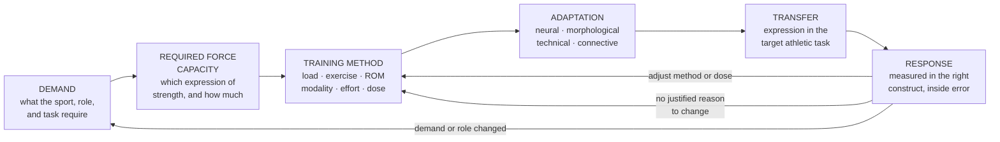

# G3 104 — Strength Development

**Version:** 1.0
**Evidence Review Gate:** PASS WITH EVIDENCE-INTEGRITY CONDITIONS
**Status:** APPROVED FOR NOVAKORE PRODUCTION upon successful production QA
**Authority:** G3 Performance

## Production-Ready Course Specification (Authoritative Build Document)

**Course code:** G3-104
**Course title:** Strength Development
**Division:** G3 Performance, the human performance division of G3 Sports & Fitness
**Document class:** Authoritative production specification — NovaKore build source
**Date:** August 2026
**Owner / approver:** JR Romero, CSCS — Director of Training, G3 Performance
**Production precedent:** G3 102 and G3 103 Course Specifications and NovaKore Build files, v1.0 FINAL
**Supersedes:** All prior G3 104 outlines, drafts, and research notes

---

## 0. DOCUMENT CONTROL

### 0.1 Source of authority

| Input | Role | Authority |
|---|---|---|
| *G3 104 — ChatGPT → Claude Production Handoff v1.0* | Intellectual and curriculum direction | Doctrine, applied standards, architecture, competencies, cases, gating |
| *G3-104 Strength Development Evidence Pack FINAL* | Research basis | Evidence only. Does not create doctrine. |
| *G3 102* and *G3 103* v1.0 FINAL specifications and build files | Structural and production precedent | Format, schema, classification discipline, decision model |
| *G3 Performance — Doctrine & Competency Framework* (internal) | Classification language | Structural authority |
| *G3 Performance Brand Standards v1.0* | Voice and presentation | Presentation authority |

### 0.2 Review gate record

| Gate | Applies to | Status | Effect |
|---|---|---|---|
| Evidence Review Gate | *G3 104 Evidence Pack FINAL* | **PASS WITH EVIDENCE-INTEGRITY CONDITIONS** | Research phase closed. Ten conditions carried forward and discharged in §0.4. |
| Intellectual Development | *G3 104 Production Handoff v1.0* | **COMPLETE** | Doctrine, applied standards, competencies, architecture, cases, and gating supplied and not independently redefined here. |
| Production QA | This specification + build file | **PASSED** — see §21.6 | Status on completion: **APPROVED FOR NOVAKORE PRODUCTION**. |

No new research cycle was performed. No doctrine was independently redefined. **No conditional evidence, coaching convention, historical system, or popular strength standard was converted into a hard G3 rule.**

### 0.3 What this document is and is not

This is the build specification for G3 104 inside NovaKore. It is not a catalog of lifts, not a strength-sport program, not a summary of the Evidence Pack, and not a claim that G3 methodology is scientifically proven. Where G3 sets an operational rule beyond the evidence, that rule is labeled **G3 Applied Standard** — organizational policy, not science.

### 0.4 Evidence-integrity conditions carried forward

| # | Condition | How this specification discharges it |
|---|---|---|
| 1 | Much prescription research uses healthy adults, often men | Population-transfer disclosure (inherited G3 103 AS-103-12) appears in every module evidence block where adult or male-dominant evidence is being extended to G3 athletes. §18.3. |
| 2 | Athlete-specific dose-response evidence is weaker than general RT evidence | M5 teaches dose as management, not prescription. No weekly set target, frequency, or rest figure is published (CJ-01 to CJ-03). |
| 3 | Minimum-effective-dose evidence often comes from powerlifting | M9 states the population origin whenever minimum-dose or maintenance reasoning is used, and refuses to generalize it to team sport as a rule (CJ-16). |
| 4 | Exact in-season microdosing prescriptions remain unresolved | M10 teaches microdosing as **C — Emerging**, explicitly not a universal in-season rule (CJ-17). Case 4 assesses this. |
| 5 | Exact universal asymmetry thresholds are unsupported | AS-104-12; **no percentage threshold appears anywhere in this course** (CJ-18). Case 8 assesses it. |
| 6 | Exact deadlift safety comparisons remain insufficiently resolved | §19.4 states the unresolved status; CA-14 corrects the "inherently dangerous" claim without asserting its opposite. |
| 7 | Open-versus-closed kinetic-chain superiority remains insufficiently resolved | M6 names it as an open question and prohibits a G3 hierarchy claim in either direction. |
| 8 | Female-athlete evidence is underrepresented in multiple domains | §18.2 restraint standard; population-transfer disclosure (inherited AS-103-12); menstrual-cycle evidence explicitly not converted into phase-based programming rules (CJ-19). |
| 9 | VBT/autoregulation evidence supports usefulness, not universal superiority | D104-10, M8, Case 7. Classified **C — Emerging**. No threshold, zone, or velocity-loss figure is published (CJ-06, CJ-07). |
| 10 | Historical/practitioner frameworks must remain separate from empirical doctrine | §17.4 renders them **Class E**, taught as influential frameworks, never as validated systems. |

**Internal production rule.** Unresolved bibliographic and mapping issues (§20.3) do not block internal G3/NovaKore production where the claim is also supported by a verified source record. Before external CEU recognition, accreditation submission, or public release, those issues must be resolved or the dependent language revised. See §20.5.

### 0.5 Evidence integrity rules for this course

> **1. No lesson may state as established what the Evidence Pack classifies as conditional, emerging, unresolved, or overstated.**
>
> **2. No association may be taught as transfer, and no mechanism may be taught as an outcome.**
>
> **3. No number becomes doctrine.** Where a figure is useful operationally, it is an example or a locally documented G3 Applied Standard with a review date — never a published G3 rule.

Rule 3 is the one this course exists to protect. Strength coaching is the domain most saturated with confident numbers — bodyweight ratios, set counts, rest intervals, RIR targets, velocity-loss thresholds, asymmetry cutoffs. Almost none of them survive contact with the evidence as universal rules.

---

### 0.6 Foundations Authority Rule

*Added by the G3 Performance Foundations — 101–105 Curriculum Review Gate v1.0 (Correction 2). Governance text only — no doctrine, evidence class, module architecture, course outcome, practical sign-off, terminal defense, or decision model was changed.*

**The G3 Performance Foundations series is G3 101 → G3 102 → G3 103 → G3 104 → G3 105.** Within it, authority is fixed as follows and does not vary by course, document, or context.

| Course | Authoritative on |
|---|---|
| **G3 101** | The **G3 reasoning system**: evidence classes, certainty language, Evidence / G3 Applied Standard / Coach Judgment separation, population-transfer disclosure, testing and monitoring interpretation, claim-correction symmetry, scope of practice, and evidence restraint. |
| **G3 102** | The **G3 programming decision model**: DEMAND → PROFILE → GAP → PRIORITY → PRESCRIPTION → RESPONSE → ADJUST, including programming priority and change governance. |
| **G3 103** | **Speed, deceleration, COD, and agility** — where its standard is narrower than the upstream rule. |
| **G3 104** | **Strength development** — where its standard is narrower than the upstream rule. |
| **G3 105** | **Power development** — where its standard is narrower than the upstream rule. |

**Two rules bind every course in the series:**

1. **No downstream course may loosen an upstream evidence, scope, measurement, or programming-integrity standard.**
2. **Where domain courses overlap, the more specific domain governs only inside that domain; otherwise the upstream standard controls.**

**This course's position.** **G3 104 is a domain course.** It is authoritative within strength development, and only where its standard is **narrower** than the upstream rule. It operates inside the G3 101 reasoning system and the G3 102 decision model and may not loosen either.

**Series attribution.** The three-layer discipline — Evidence / G3 Applied Standard / Coach Judgment — is attributed at series level to **G3 101**. Population-transfer governance is attributed at series level to **AS-101-16**, and may be restated locally: G3 103 restates it as **AS-103-12**, and G3 104 and G3 105 carry that restatement.

---

## 1. COURSE IDENTITY & PURPOSE

### 1.1 Course purpose

G3 104 teaches coaches to understand strength as a **task-specific physical quality**, develop it through defensible resistance-training decisions, measure it appropriately, and integrate it into athletic preparation — without confusing gym performance with sport performance.

The course establishes that strength is foundational for many athletic tasks while rejecting the idea that **stronger is automatically better** without context.

### 1.2 The five governing distinctions

```
STRENGTH  ≠  POWER  ≠  RATE OF FORCE DEVELOPMENT
GYM STRENGTH  ≠  SPORT PERFORMANCE
ASSOCIATION  ≠  TRANSFER
METHOD  ≠  DOCTRINE
TOOL  ≠  OUTCOME
```

Every module returns to at least one of these. A coach who collapses any of them cannot pass T-01.

### 1.3 The governing sequence

```
DEMAND → REQUIRED FORCE CAPACITY → TRAINING METHOD → ADAPTATION → TRANSFER → RESPONSE
```

This is the reasoning path for any strength decision in the G3 system. It sits **inside** the G3 102 decision model rather than replacing it (§5.3).

### 1.4 The eight obligations

A coach completing G3 104 can do eight things with any strength decision placed in front of them:

1. **Define the demand** — what the sport, role, and task actually require.
2. **Identify the strength requirement** — which expression of strength, measured how.
3. **Select the method** — loading, exercise, ROM, and modality chosen for the adaptation, not the ideology.
4. **Coach the task** — set up, instruct, observe, regress, progress, and adjust load.
5. **Manage the dose** — volume, frequency, rest, and effort as interacting variables.
6. **Measure the response** — with tests that measure what is being claimed.
7. **Adjust the plan** — for stated reasons.
8. **Defend the decision** — evidence, G3 Applied Standard, and Coach Judgment named separately.

These eight appear verbatim in the terminal defense (§14.6).

### 1.5 Position in the G3 education system

| | |
|---|---|
| **Prerequisite** | G3 102 and G3 103 complete, including both terminal defenses. Active G3 Performance coaching status. |
| **Audience** | G3 Performance coaches, G3 Youth Strength & Conditioning staff, G3 Volleyball Development staff, and scholastic/collegiate contract coaches operating under G3 programming standards. |
| **Delivery** | NovaKore self-paced modules with four observed practical sign-offs — PS-1, PS-2, PS-3, PS-4 — plus the final oral defense, T-01. |
| **Nominal duration** | 12 modules · 20.75 hours of directed study (1,245 minutes; see §6.1) · plus practical evidence collected on the floor over a minimum 4-week window. |
| **Standing** | G3 internal CEU course. Recognition by outside certifying bodies is not claimed and is gated on §20.5. |

### 1.6 Foundations continuity

**From G3 101.** Adaptation, overload, specificity, variation, individualization, recovery, and transfer are conditional decision frameworks, not laws. Specificity is deeper than visual resemblance. Fatigue is not the goal. Athlete development requires context.

**From G3 102.** Programming follows `DEMAND → PROFILE → GAP → PRIORITY → PRESCRIPTION → RESPONSE → ADJUST`. Evidence, G3 Applied Standards, and Coach Judgment remain distinguishable at all times.

**From G3 103.** Physical qualities must be named precisely. Descriptive relationships do not automatically create prescriptions. Supporting strength work does not automatically transfer to speed, COD, or agility. Testing measures the task actually performed.

G3 104 therefore teaches strength as a **physical capacity that must be developed and then expressed through relevant athletic tasks**. Where this specification and G3 102 appear to disagree, G3 102 is authoritative.

### 1.7 Course outcomes

On completion, a G3 Performance coach can:

**CO-1** Define strength and distinguish it from force, impulse, power, and RFD.
**CO-2** Identify the strength demand relevant to an athlete or task.
**CO-3** Explain major neural, morphological, technical, and connective-tissue contributors to strength.
**CO-4** Select loading strategies appropriate to maximal-strength goals.
**CO-5** Explain why adaptation zones overlap.
**CO-6** Prescribe volume, frequency, rest, and effort without relying on universal rules.
**CO-7** Decide when failure is or is not appropriate.
**CO-8** Select exercises using objective constraints rather than ideology.
**CO-9** Justify bilateral/unilateral and free-weight/machine choices.
**CO-10** Use ROM intentionally.
**CO-11** Explain appropriate roles for eccentric and isometric methods.
**CO-12** Distinguish concentric intent from deliberately slow movement.
**CO-13** Use or interpret RPE, RIR, VBT, and autoregulation appropriately.
**CO-14** Organize progression and periodization without claiming one universal model.
**CO-15** Integrate strength with sprint, plyometric, conditioning, practice, and competition demands.
**CO-16** Design developmentally appropriate youth strength training.
**CO-17** Select and interpret strength tests.
**CO-18** Reject unsupported universal strength ratios and asymmetry thresholds.
**CO-19** Distinguish injury-risk evidence from injury-prevention guarantees.
**CO-20** Defend a strength prescription using evidence, G3 standards, and athlete context.

### 1.8 Voice and presentation standard

G3 Performance voice: **direct, systems-first, credentialed, unhyped**. Prohibited: motivational filler, guaranteed outcomes, injury-prevention promises, mandatory-lift ideology, and any implication that professional judgment is scientific certainty.

---

## 2. EVIDENCE CLASSIFICATION SYSTEM

### 2.1 Classes

G3 104 uses the six-class framework established in G3 102 and extended in G3 103. The Evidence Pack organizes its findings as *established · supported but conditional · emerging · unresolved · overstated*; those map onto the G3 classes as shown.

| Class | Name | Evidence Pack equivalent | How it may be taught |
|---|---|---|---|
| **A** | Established Evidence | "Established findings" | May be taught as established, bounded by population and task. |
| **B** | Supported Practice | "Supported but conditional findings" | Taught as well-supported practice with the moderator stated. |
| **C** | Emerging / Conditional Evidence | "Emerging findings" | Taught as conditional. Never the sole basis for a required behavior. |
| **D** | Applied Coaching Inference | "Applied coaching inference candidates" | Taught explicitly as inference, labeled aloud. |
| **E** | Historical / Practitioner Framework | "Historical / practitioner frameworks" | Taught as framework and history. Never as proof. |
| **F** | Unsupported / Overstated Claim | "Overstated coaching claims" | **Never taught as true.** Used only to name and correct the error. |

An additional marker, **U — Unresolved**, is used where the Evidence Pack states a question is not resolved by its verified source set (deadlift safety comparisons, open-versus-closed kinetic chain, universal asymmetry thresholds, exact in-season microdosing). **U topics are taught as open questions and may never anchor a required behavior or an assessment key.**

### 2.2 Standing labels

| Label | Meaning | Binding? |
|---|---|---|
| **G3 Doctrine** | A conceptual position G3 holds and teaches. | Yes |
| **G3 Applied Standard** | An operational rule G3 sets where evidence does not determine one answer. | Yes — organizational, not scientific |
| **Coach Judgment** | A decision G3 deliberately leaves to the qualified coach. | No fixed answer; reasoning must be documented |

### 2.3 The three-column discipline

Every module renders, visually and separately: **EVIDENCE** (what the research supports, in which populations, how strongly) · **G3 APPLIED STANDARD** (what G3 does and why, given that evidence) · **COACH JUDGMENT** (what remains the coach's call, with the reasoning that must be documented).

### 2.4 The mechanism-association-transfer rule

Specific to G3 104 and enforced at production review:

> A **mechanism** explains how an adaptation could occur. An **association** shows two things vary together. **Transfer** is a demonstrated change in the target task caused by the training. These are three different claims with three different evidence requirements, and a lesson may never present one as another.

This rule is why "stronger athletes sprint faster" cannot be taught as "make this athlete stronger and they will sprint faster."

---

### 2.5 Series-level evidence taxonomy

*Added by the G3 Performance Foundations — 101–105 Curriculum Review Gate v1.0 (Correction 3). Recognition only — **no claim in this course has been reclassified.***

The G3 Performance Foundations series uses one taxonomy. **Every course recognizes all seven classes. No course is required to use all of them, and no claim is ever reclassified in order to populate a class.**

| Class | Name |
|---|---|
| **A** | Established Evidence |
| **B** | Supported Practice |
| **C** | Emerging / Conditional Evidence |
| **D** | Applied Coaching Inference |
| **E** | Historical / Practitioner Framework |
| **F** | Unsupported / Overstated Claim |
| **U** | Unresolved / Unknown |

**U is the machine-readable series class** for a question about which no defensible evidence-class assignment can be made. **"Unknown" remains the human-facing certainty label** for the same condition. The two are equivalent in force, and both mean: *G3 does not know, and no G3 material may proceed as though it does.*

**Classes used in this course:** **A, B, C, D, E, F**, and **U**. G3 104 introduced U to the series, at §2.1. Its usage is unchanged.

---

## 3. CONTROLLED TERMINOLOGY

Binding across G3 104, downstream G3 courses, G3 testing outputs, and NovaKore data fields. Every term requires the **task and measurement context** to be specified when precision matters — that requirement is itself the first doctrine.

| Term | G3 definition | Not to be confused with |
|---|---|---|
| **Strength** | Capacity to produce force or torque under specified task constraints. | One barbell lift result. A global athletic attribute. |
| **Maximal strength** | Highest force/torque or maximal external load performance under a defined task. | Strength in general. |
| **Absolute strength** | Strength expressed without normalization to body mass. | Relative strength. |
| **Relative strength** | Strength expressed relative to body mass or another defined scaling method. | A universal athlete standard. No single ratio is treated as one. |
| **Dynamic strength** | Strength expressed during movement through a specified exercise or task. | Isometric strength. |
| **Isometric strength** | Force production without appreciable joint movement under the test or training constraints. | Dynamic strength — related but distinct. |
| **Eccentric strength** | Force capacity while the muscle-tendon unit is lengthening under load. | Concentric strength. |
| **Concentric strength** | Force capacity while shortening against resistance. | Eccentric strength. |
| **Strength endurance** | Ability to sustain or repeat force-producing efforts under defined conditions. | Maximal strength. Conditioning. |
| **Force** | Mechanical interaction capable of changing motion. | Strength — not synonymous. |
| **Impulse** | Force integrated over time. | Peak force — not interchangeable. |
| **Power** | Rate of doing mechanical work; force-velocity interaction under defined conditions. | Strength — not synonymous. |
| **Rate of force development (RFD)** | Rate at which force rises over time under specified measurement conditions. | Maximal strength. Power. |
| **Hypertrophy** | Increase in muscle size. May support force capacity. | Proof of athletic transfer. |
| **Training to failure** | Continuing a set until another complete repetition cannot be performed under the defined technique and task criteria. | Hard effort. A requirement. |
| **RIR** | Estimated repetitions remaining before failure. | A precise measurement. |
| **RPE** | Subjective effort rating under a specified scale. | A universal scale — the scale and context must be stated. |
| **VBT** | Use of movement velocity data to inform monitoring and/or prescription. | A superior programming system. Measurement capability is not programming superiority. |
| **Load-velocity profile** | The exercise-, athlete-, and device-specific relationship between load and movement velocity. | A transferable constant. |
| **Adaptation zone** | A loading range that tends to favor certain adaptations. | A discrete biological compartment. |
| **Minimum effective dose** | The smallest training dose that maintains or advances a quality in a defined context. | A universal number. Most of this evidence comes from powerlifting. |
| **Microdosing** | Distributing training into smaller, more frequent exposures. | An established in-season rule. |
| **Interlimb asymmetry** | A measured difference between limbs on a defined task, with its own measurement error. | A diagnosis. A threshold. |
| **Injury-risk reduction** | A contribution to lowering probability across a population. | Injury prevention — G3 does not use prevention language for individual guarantees. |

**Terminology enforcement.** NovaKore glossary entries link from first use. Assessment items use these terms exactly. Collapsing strength, power, and RFD is a scored error, as is reporting a lift result as "strength" without the task (AS-104-01, AS-104-10).

---
## 4. G3 104 DOCTRINE

Fifteen doctrines form the conceptual backbone of this course. Each is stated in production form, given its evidence class and anchor records, and given its teaching boundary. Doctrine IDs follow the Foundations convention: **D104-1** through **D104-15**.

---

### Doctrine 104-1 — Strength Is Task-Specific

**Statement.** Strength must be interpreted relative to the task used to express or measure it. A barbell result is evidence of performance in that lift, not a complete measure of athletic strength.

**Evidence class:** **A — Established Evidence.** Strength is best defined as the capacity to produce force or torque in a specified task rather than as a synonym for one barbell result; the named expressions of strength are scientifically useful only when the task and metric are specified. A true 1RM measures maximal dynamic performance in a specific lift, not global athletic strength. [EP104-14, EP104-13, EP104-43, EP104-44]

**Teaching boundary.** This does not devalue the barbell. A back-squat 1RM is a real, useful, and often highly relevant measure — of the back squat. The doctrine governs what may be *concluded* from it, not whether it is worth testing.

---

### Doctrine 104-2 — Strength Is Foundational, Not Sufficient

**Statement.** Strength supports many athletic outcomes, but increases in gym strength do not guarantee proportional improvements in sprinting, jumping, COD, or sport performance. Transfer depends on the athlete, task, training status, body mass, technical exposure, and surrounding program.

**Evidence class:** **B — Supported Practice.** Increases in lower-body strength are associated with, and in review-level evidence transfer positively to, sprint performance — but the size and meaning of the relationship depend on athlete, task, and testing form, and correlations do not prove that a given exercise or loading method causes transfer. [EP104-21, EP104-03, EP104-31, EP104-12]

**Teaching boundary.** The doctrine cuts in both directions. "Get strong and everything follows" is unsupported; so is "strength doesn't transfer." The defensible position is that strength is a genuine contributor whose expression must be trained and tested in the target task. Continuous with G3 103 D103-2 and D103-7.

---

### Doctrine 104-3 — Adaptation Zones Overlap

**Statement.** Rep ranges and loading zones influence adaptation but are not discrete biological compartments. G3 rejects rigid rules such as "1–5 strength, 6–12 hypertrophy, 12+ endurance."

**Evidence class:** **A — Established Evidence** that the traditional repetition continuum is too rigid; adaptation zones overlap rather than falling into discrete boxes, and hypertrophy occurs across a broad loading spectrum when effort is sufficient. [EP104-06, EP104-25, EP104-13]

**Teaching boundary.** Overlapping is not identical. Loading still matters — see D104-4. The rejection is of the boxes, not of the influence of load.

---

### Doctrine 104-4 — Heavy Loading Is a Tool for Maximal Strength

**Statement.** Higher loads are generally effective for maximizing dynamic 1RM strength, but lower and moderate loads can still produce strength adaptation. G3 does not define strength training exclusively by heavy loading.

**Evidence class:** **A — Established Evidence** that higher loads generally produce larger gains in dynamic 1RM strength than lower-load training; **B — Supported Practice** that lower and moderate loads still produce meaningful strength gains, especially in novices or when sets are carried to high effort, while being generally less effective for maximizing 1RM. [EP104-06, EP104-25, EP104-13]

**Teaching boundary.** "Only heavy loads build strength" is **F** (CA-01). So is the mirror claim that load does not matter for maximal strength. **No percentage, rep number, or loading table is published as a G3 rule** — the standard is AS-104-02, matching load to adaptation, and the number is Coach Judgment.

---

### Doctrine 104-5 — Failure Is Optional

**Statement.** Momentary muscular failure is not required for strength development. Failure may be used selectively when its benefits justify fatigue, technical, and recovery costs.

**Evidence class:** **A — Established Evidence.** Training to momentary muscular failure is not required for strength development or hypertrophy gains. [EP104-19, EP104-08, EP104-07]

**Teaching boundary.** Optional means optional. "Failure is necessary" is **F** (CA-05) and "failure should never be used" is equally **F** (CA-06). The decision is a cost-benefit judgment about exercise complexity, athlete experience, fatigue, recovery, and session purpose (AS-104-04). **No RIR target is published as a G3 rule** (CJ-04).

---

### Doctrine 104-6 — Exercise Selection Is Constraint-Based

**Statement.** G3 does not prescribe universal "best lifts." Exercise selection reflects objective, athlete competence, anthropometry, loadability, stability, technical demand, fatigue cost, equipment, and transfer needs.

**Evidence class:** **B — Supported Practice.** Exercise selection should be governed by objective, specificity, competence, loadability, stability demands, technical learnability, anthropometry, fatigue cost, and equipment rather than ideology; the evidence base does not support universal "best exercises" for all athletes. [EP104-14, EP104-54, EP104-26, EP104-29]

**Teaching boundary.** This is not a claim that all exercises are equivalent for a given objective. It is a rejection of mandatory-lift ideology — including the claim that Olympic lifts are required for athletes (CA-17). **No mandatory lift list exists in G3 104.**

---

### Doctrine 104-7 — Specificity Governs Modality

**Statement.** Free weights and machines, bilateral and unilateral exercises, dynamic and isometric methods, and full or partial ROM can all be useful. Their value depends on the adaptation and task, not ideological hierarchy.

**Evidence class:** **A — Established Evidence** that bilateral and unilateral resistance training both improve strength and athletic outcomes, with differences largely explained by specificity rather than universal superiority; **A** that free weights and machines are both effective, with outcome differences tending to reflect the testing modality rather than inherent superiority. [EP104-24, EP104-27, EP104-40, EP104-26, EP104-29, EP104-30]

**Teaching boundary.** Four claims are **F** and are corrected without inversion: free weights always superior (CA-07), machines not functional (CA-08), unilateral inherently more athletic (CA-09), bilateral less athletic (CA-10). Unstable-surface training is also **F** as an inherent-functionality claim (CA-11). Open-versus-closed kinetic-chain superiority is **U — Unresolved** and G3 takes no position in either direction.

---

### Doctrine 104-8 — Full ROM Is a Broad Default, Not a Law

**Statement.** Full ROM is a strong general default for broad strength development, while partial ROM can be used intentionally for joint-angle specificity, overload, progression, exposure, or contextual demands.

**Evidence class:** **B — Supported Practice.** Review-level evidence found full ROM training more effective than partial ROM for maximizing muscle strength and lower-limb hypertrophy **on average**, which should not be overgeneralized into a rule that partial ROM is always inferior. [EP104-36, EP104-38]

**Teaching boundary.** "On average" is the operative phrase and is taught explicitly. Partial ROM requires a stated rationale — a generic "sport-specific" claim does not qualify (AS-104-06). No universal full-ROM-only programming rule is created (CJ-14).

---

### Doctrine 104-9 — Strength Programming Is Dose Management

**Statement.** Volume, frequency, intensity, rest, effort, and exercise selection interact. No single variable is treated as an independent universal prescription.

**Evidence class:** **B — Supported Practice.** Higher volume appears more clearly linked to hypertrophy than to maximal strength, and physique-oriented weekly set rules do not import directly into athlete strength doctrine; frequency often acts as an organizational variable for distributing volume and technical practice, with limited or inconsistent independent effect when total volume is equated; longer rest intervals generally preserve force output, repetition performance, and technical quality during demanding strength work. [EP104-37, EP104-09, EP104-10, EP104-11, EP104-05, EP104-14]

**Teaching boundary.** **No weekly set target, frequency prescription, or rest duration is published as a G3 rule** (CJ-01 to CJ-03). The rest finding is directional — longer rest generally preserves output — not a numeric prescription (AS-104-07).

---

### Doctrine 104-10 — Autoregulation Is a Decision Tool

**Statement.** RPE, RIR, APRE, VBT, and percentage-based methods are tools for prescription and adjustment. No one system is G3 doctrine or universally superior.

**Evidence class:** **C — Emerging / Conditional.** Autoregulation methods may provide useful dose adjustment in some settings, but no method is established as universally superior to well-designed percentage-based programming; velocity-based training can improve strength, sprint, jump, and COD outcomes, but comparative evidence does not establish reliable programming superiority over percentage-based training. Load-velocity relationships are exercise-, athlete-, and device-specific. [EP104-15, EP104-16, EP104-17, EP104-23]

**Teaching boundary.** "VBT is inherently superior" is **F** (CA-27). So is dismissing it. **No velocity-loss threshold, VBT zone, RIR target, or RPE cut-point is published as a G3 rule** (CJ-04 to CJ-07). Measurement capability is not programming superiority.

---

### Doctrine 104-11 — Periodization Organizes Adaptation

**Statement.** Periodization is the purposeful organization of training variables over time. No single named periodization model is universally superior across athletes and contexts.

**Evidence class:** **B — Supported Practice** that periodized resistance training improves 1RM more than non-periodized training on average; **A** that current evidence does not establish one universally superior model, with linear-versus-undulating comparisons showing no universal winner. [EP104-20, EP104-22, EP104-45]

**Teaching boundary.** Two findings sit side by side and are taught together: organizing training appears to beat not organizing it, and no particular organization wins. Named models are taught as **Class E** frameworks (§17.4).

---

### Doctrine 104-12 — Concurrent Interference Is Conditional

**Statement.** Strength development can coexist with sprinting, conditioning, plyometrics, and sport practice. Interference depends on modality, dose, sequence, recovery, and athlete context rather than being inevitable.

**Evidence class:** **B — Supported Practice.** Concurrent training can improve multiple physical qualities; interference depends on endurance modality, duration, frequency, sequence, and total load rather than operating as an inevitable rule. [EP104-28, EP104-12]

**Teaching boundary.** Continuous with G3 102 Doctrine 7 and G3 103 D103-8. The concurrent-training evidence base here is older and adult-weighted; no numeric spacing or sequencing threshold is created.

---

### Doctrine 104-13 — Youth Can Train Strength

**Statement.** Properly supervised and progressively loaded resistance training is appropriate for youth. Readiness, technique, training age, maturation, supervision, and context matter more than outdated prohibitions based solely on chronological age.

**Evidence class:** **A — Established Evidence.** Properly supervised youth resistance training is safe and effective; current evidence does not support claims that it stunts growth or is inherently unsafe when instruction, progression, and environment are appropriate, nor that youth should never lift heavy. [EP104-01, EP104-02, EP104-04]

**Teaching boundary.** The claim is conditioned on **supervision, technical coaching, and appropriate progression** — stated every time it is made (AS-104-13). And the correction does not invert: "youth should not lift heavy" is **F** (CA-15), but so is treating a 12-year-old novice like a trained adult. **"Technique first" must not become indefinite underloading** (§18.1).

---

### Doctrine 104-14 — Standards Must Earn Their Authority

**Statement.** Universal bodyweight ratios, "strong enough" thresholds, mandatory exercise prerequisites, and fixed asymmetry cutoffs are not treated as G3 scientific standards without adequate population- and outcome-specific evidence.

**Evidence class:** **A — Established Evidence** that universal bodyweight-multiple standards and fixed lift ratios are not strongly supported as universal predictors of athletic performance or injury risk across relevant athlete populations, and that no single asymmetry threshold is justified as an automatic problem. Asymmetry threshold support is additionally **U — Unresolved**. [EP104-21, EP104-14, EP104-49]

**Teaching boundary.** Relative-strength metrics remain useful for contextualizing an athlete. What they may not do is gate a training method (AS-104-11). **"Every athlete needs a 2× bodyweight squat" (CA-25) and "asymmetry above 10% is automatically a problem" (CA-26) are Class F, and no replacement number is published.**

---

### Doctrine 104-15 — Safety Claims Require Evidence

**Statement.** No exercise is automatically safe or dangerous independent of loading, technique, athlete capacity, exposure, and context. G3 avoids simplistic claims about deep squats, knees-over-toes, deadlifts, or individual exercises "preventing" injury.

**Evidence class:** **B — Supported Practice** that resistance training is a valuable component of sports-injury-risk-reduction strategies, which may not be overstated into a claim that a specific lift prevents a specific injury; **A** that review-level evidence does not support treating deep squats as inherently harmful to healthy knees when technique and loading are appropriate, and does not support knees-over-toes prohibition; **U — Unresolved** for exact deadlift safety comparisons. [EP104-18, EP104-48, EP104-47, EP104-35, EP104-44]

**Teaching boundary.** Restraint runs both directions. Coaches may not promise protection, and may not prohibit a movement on a danger claim the evidence does not support. G3 uses **injury-risk reduction** language, not prevention guarantees (§19). This doctrine binds marketing, parent, and athlete communication.

---

### 4.16 Doctrine summary table (NovaKore tag source)

| ID | Doctrine | Evidence class | Primary modules | Standing |
|---|---|---|---|---|
| D104-1 | Strength is task-specific | A | M1, M12 | G3 Doctrine |
| D104-2 | Strength is foundational, not sufficient | B | M3 | G3 Doctrine |
| D104-3 | Adaptation zones overlap | A | M4 | G3 Doctrine |
| D104-4 | Heavy loading is a tool for maximal strength | A / B | M4 | G3 Doctrine |
| D104-5 | Failure is optional | A | M5 | G3 Doctrine |
| D104-6 | Exercise selection is constraint-based | B | M6 | G3 Doctrine |
| D104-7 | Specificity governs modality | A | M6, M7 | G3 Doctrine |
| D104-8 | Full ROM is a broad default, not a law | B | M7 | G3 Doctrine |
| D104-9 | Strength programming is dose management | B | M5 | G3 Doctrine |
| D104-10 | Autoregulation is a decision tool | C | M8 | G3 Doctrine |
| D104-11 | Periodization organizes adaptation | B / A | M9 | G3 Doctrine |
| D104-12 | Concurrent interference is conditional | B | M10 | G3 Doctrine |
| D104-13 | Youth can train strength | A | M11 | G3 Doctrine |
| D104-14 | Standards must earn their authority | A / U | M12 | G3 Doctrine |
| D104-15 | Safety claims require evidence | B / A / U | M11, M12 | G3 Doctrine |

---

## 5. THE G3 104 STRENGTH MODEL

### 5.1 The sequence



### 5.2 Stage definitions

| Stage | Question | What it produces | Common failure |
|---|---|---|---|
| **Demand** | What does the sport, position, and role actually require, and in which tasks is force expressed? | A strength demand statement naming the tasks that matter | Assuming every athlete needs the same lifts and the same numbers |
| **Required force capacity** | Which expression of strength — maximal, relative, eccentric, isometric, endurance — and measured in which task? | A named strength requirement with a measurement plan | "He needs to get stronger," with no task and no metric |
| **Training method** | What load, exercise, ROM, modality, effort, and dose produce the adaptation? | A prescription with a stated intended adaptation | Method chosen by ideology, convention, or equipment habit |
| **Adaptation** | What change is actually being pursued — neural, morphological, technical, connective? | An expectation of what should change and roughly over what horizon | Treating every strength gain as one undifferentiated thing |
| **Transfer** | How will this capacity be expressed in the athletic task, and what makes that likely? | A stated transfer pathway and the exposure that supports it | Assuming gym improvement is sport improvement |
| **Response** | What actually changed, in what construct, inside what measurement error? | A test result correctly labeled and interpreted | Claiming global strength from one lift; acting inside noise |

### 5.3 Relationship to the G3 102 decision model

G3 104 does not replace, extend, or modify the G3 102 model. The strength sequence is what happens **inside** its PRESCRIPTION and RESPONSE stages when the priority quality is strength.

| G3 102 stage | What G3 104 supplies |
|---|---|
| **DEMAND** | The strength demand statement: which tasks express force, at what magnitudes and speeds, how often. |
| **PROFILE** | Construct-appropriate strength testing (M12), interpreted inside reliability. |
| **GAP** | Distinguishing a maximal-strength deficit from a relative-strength issue from a technical-exposure issue from an expression/transfer issue. |
| **PRIORITY** | Whether strength is the primary development quality this phase — and D104-2 means the answer is sometimes no, even for an athlete who could be stronger. |
| **PRESCRIPTION** | The full strength sequence above: method, dose, ROM, modality, progression, integration. |
| **RESPONSE** | Test selection and interpretation under D104-1 and AS-104-10. |
| **ADJUST** | Progression and periodization decisions with stated reasons (M9). |

### 5.4 Model integrity rules

1. **Define the task before the number.** No strength prescription or test result is recorded in G3 without the task it refers to (AS-104-01, AS-104-10).
2. **The sequence classifies reasoning; it does not compute an answer.** No stage produces a score, threshold, or automated recommendation.
3. **Transfer is a claim, not a stage that happens automatically.** A coach who cannot state the transfer pathway has not completed the sequence.
4. **G3 102 governs conflicts.**

---
## 6. MODULE ARCHITECTURE

### 6.1 Overview

| # | Module | Focus | Core doctrine | Est. time | Sign-off |
|---|---|---|---|---|---|
| M1 | What Strength Actually Is | Definitions and task specificity | D104-1 | 90 min | — |
| M2 | How Strength Adapts | Mechanisms | D104-1, D104-9 | 90 min | — |
| M3 | Strength and Athletic Transfer | Transfer vs correlation | D104-2 | 105 min | — |
| M4 | Loading for Strength | Load and rep ranges | D104-3, D104-4 | 105 min | **PS-1** |
| M5 | Volume, Frequency, Rest & Failure | Dose management | D104-9, D104-5 | 105 min | — |
| M6 | Exercise Selection Without Dogma | Selection constraints | D104-6, D104-7 | 105 min | — |
| M7 | ROM, Eccentric, Isometric & Tempo Methods | Method specificity | D104-8, D104-7 | 105 min | **PS-2** |
| M8 | Autoregulation & Velocity-Based Training | Prescription tools | D104-10 | 105 min | — |
| M9 | Progression, Periodization & Maintenance | Organization over time | D104-11 | 105 min | — |
| M10 | Concurrent & In-Season Strength | Integration | D104-12 | 105 min | — |
| M11 | Youth Strength Development | Population and safety | D104-13, D104-15 | 105 min | **PS-3** |
| M12 | Testing, Standards & Integrated Decision-Making | Measurement and integration | D104-1, D104-14, D104-15 | 120 min | **PS-4**, **T-01** |

Total directed study: 1,245 minutes — 20.75 hours — plus practical evidence collected over a minimum four-week window. Consistent with the Foundations series (G3 102: 18.5 h; G3 103: 19.5 h).

### 6.2 Standard module structure (NovaKore content pattern)

Seventeen production elements per module, in this order: **(1)** module ID · **(2)** title and framing statement · **(3)** purpose · **(4)** learning objectives · **(5)** doctrine IDs · **(6)** applied-standard IDs · **(7)** competency IDs · **(8)** evidence classifications · **(9)** lesson/section structure · **(10)** coaching applications · **(11)** common errors / claim audit · **(12)** case/scenario · **(13)** knowledge assessment · **(14)** applied assessment · **(15)** practical sign-off linkage · **(16)** source mapping · **(17)** prerequisite/gating logic.

A module missing any element fails production review.

### 6.3 Gating

```
M1 → M2 → M3 → M4 → [PS-1 GATE] → M5 → M6 → M7 → [PS-2 GATE] →
M8 → M9 → M10 → M11 → [PS-3 GATE] → M12 → [PS-4] → [T-01] → COMPLETE
```

- **PS-1 gates M5.** Prescription fundamentals must be observed before advanced applied-method work, per the handoff's gating rule.
- **PS-2 gates M8.** Exercise selection and coaching must be observed before autoregulation and VBT are taught as prescription tools.
- **PS-3 gates M12.** Youth and contextual coaching must be observed before testing, standards, and integration.
- **PS-4** follows M12 and requires the four-week delivery window complete.
- **T-01 requires all four sign-offs** and all module assessments at standard. T-01 is required for course competency completion.
- Modules unlock sequentially; completed modules remain accessible.

---

## 7. G3 APPLIED STANDARDS

Operational rules G3 Performance applies in its own environments. **A G3 Applied Standard is organizational policy, adopted because a defensible answer is required and the evidence does not determine one.** Coaches follow them inside G3 and describe them accurately outside G3 — as what G3 does, not as what the science says. IDs: **AS-104-01** through **AS-104-14**.

---

### AS-104-01 — Define the Strength Task

Every assessment or prescription identifies what form of strength is being trained or measured.

*Evidence basis:* A (D104-1). *Standing:* Applied Standard. *Enforcement:* every `strength_task` and `test_record` object in NovaKore requires a `strength_expression` and `task` value (§21.4).

### AS-104-02 — Match Load to Adaptation

Loading is selected for the desired adaptation and athlete. Heavy loading is prioritized when maximal dynamic strength is the main target, without making it the only valid loading strategy.

*Evidence basis:* A/B (D104-4). *Standing:* Applied Standard. *Boundary:* no percentage, rep number, or loading table is published. CJ-09.

### AS-104-03 — Preserve Technical Quality

Load progression is subordinate to acceptable execution, task intent, and athlete readiness.

*Evidence basis:* D — Applied Coaching Inference, consistent with the rest-and-quality evidence in D104-9. *Standing:* Applied Standard. *Boundary:* this does not license indefinite underloading — see §18.1 and AS-104-13.

### AS-104-04 — Use Failure Deliberately

Failure is not a default requirement. Its use accounts for exercise complexity, athlete experience, fatigue cost, recovery, and session purpose.

*Evidence basis:* A (D104-5). *Standing:* Applied Standard. *Boundary:* no RIR target or proximity rule is published. CJ-04.

### AS-104-05 — Exercise Categories Before Exercise Dogma

Coaches select movement and exercise **categories** and constraints before declaring individual exercises mandatory.

*Evidence basis:* B (D104-6). *Standing:* Applied Standard. *Enforcement:* G3 program documents name the category and the constraint met; naming a specific lift as mandatory fails production review.

### AS-104-06 — Use ROM Intentionally

Full ROM is the broad default where appropriate. Partial ROM requires an explicit rationale rather than a generic "sport-specific" claim.

*Evidence basis:* B (D104-8). *Standing:* Applied Standard. *Boundary:* no universal full-ROM-only rule is created. CJ-14.

### AS-104-07 — Rest to Preserve the Intended Output

For demanding strength work, rest generally supports force output and technical quality. **Exact rest intervals remain contextual.**

*Evidence basis:* B (D104-9). *Standing:* Applied Standard. *Boundary:* the criterion is output, not the clock. CJ-03.

### AS-104-08 — Frequency Organizes the Dose

Frequency is used to distribute volume, technical exposures, fatigue, and recovery. It is not prescribed as an isolated magic variable.

*Evidence basis:* B (D104-9). *Standing:* Applied Standard. *Boundary:* no frequency prescription is published. CJ-02.

### AS-104-09 — Autoregulate With Known Limits

If RPE, RIR, VBT, or APRE are used, coaches must understand measurement error, athlete skill, exercise specificity, and the decision being informed.

*Evidence basis:* C (D104-10). *Standing:* Applied Standard. *Boundary:* no threshold, zone, or velocity-loss figure is published. CJ-05 to CJ-07.

### AS-104-10 — Test the Construct

1RM, submaximal RM, isometric tests, dynamometry, and velocity estimates measure different expressions of strength. **G3 labels results according to what was actually measured.**

*Evidence basis:* A (D104-1). *Standing:* Applied Standard and binding language rule. *Enforcement:* `test_record` requires `construct_measured`; mislabeling is a scored assessment error.

### AS-104-11 — Avoid Universal Ratio Thresholds

Relative-strength metrics may contextualize athlete performance, but universal bodyweight ratios cannot automatically gate advanced training methods.

*Evidence basis:* A (D104-14). *Standing:* Applied Standard and binding prohibition. *Boundary:* CJ-10, CJ-11, CJ-20.

### AS-104-12 — Interpret Asymmetry Cautiously

Asymmetry values require reliable measurement, task context, repeated observation, and athlete-specific interpretation. **A single fixed percentage does not automatically mandate correction.**

*Evidence basis:* A/U (D104-14). *Standing:* Applied Standard. *Boundary:* CJ-18. No threshold is published, and none may be adopted locally without Director of Training approval and a stated measurement-error basis.

### AS-104-13 — Youth Training Requires Qualified Supervision

Youth resistance training is technically coached, progressively dosed, developmentally appropriate, and supervised.

*Evidence basis:* A (D104-13). *Standing:* Applied Standard. *Enforcement:* supervision ratio is documented for every G3 youth strength group; the safety claim is stated with its conditions attached.

### AS-104-14 — In-Season Strength Is Constraint-Driven

In-season strength decisions protect meaningful exposure while adapting volume and frequency to sport load, competition density, recovery, and priority.

*Evidence basis:* B/C — the principle is supported; exact in-season and microdosing prescriptions are **U — Unresolved**. *Standing:* Applied Standard. *Boundary:* CJ-16, CJ-17. No maintenance dose or microdose model is published.

### 7.15 Inherited standards

In force inside G3 104 and referenced, not duplicated: **G3 102** AS-06 (test conditions recorded), AS-09 (emphasis tier), AS-10 (opportunity-cost statement), AS-11 (no tool computes a priority), AS-12 (stated intended adaptation), AS-14 (session order reflects priority), AS-27 (adjustment log), AS-30 (youth entry by readiness), AS-31 (no sex-specific rules without direct evidence); **G3 103** AS-103-12 (population-transfer disclosure).

**G3 104 creates no hard rules beyond the fourteen standards above.**

---

## 8. COACH JUDGMENT REGISTER

Twenty-one areas that must not become universal hard rules. Examples and decision guides may be created; they are labeled as examples, G3 Applied Standards, or Coach Judgment.

| ID | Area | Evidence position | What G3 supplies | What remains the coach's call |
|---|---|---|---|---|
| **CJ-01** | Exact weekly sets | Volume links more clearly to hypertrophy than maximal strength; physique set rules do not import to athletes | AS-104-09 dose-management framing | Weekly volume for this athlete and phase |
| **CJ-02** | Exact frequency | Frequency distributes volume; independent effect limited when volume equated | AS-104-08 | Frequency |
| **CJ-03** | Exact rest duration | Longer rest generally preserves output; no universal interval | AS-104-07, output as criterion | The interval |
| **CJ-04** | Exact RIR | Failure not required; no target established | AS-104-04 | Proximity to failure |
| **CJ-05** | Exact RPE | Scale- and context-dependent | AS-104-09 | The rating used and how it is weighted |
| **CJ-06** | Exact velocity-loss threshold | No threshold established | AS-104-09 | Whether and where to set one locally |
| **CJ-07** | Exact VBT zones across exercises/athletes | Load-velocity relationships are exercise-, athlete-, device-specific | AS-104-09 | Zones, if used, established locally per exercise and athlete |
| **CJ-08** | Exact exercise rotation frequency | Constant variation unsupported | AS-104-05 | When an exercise has done its work |
| **CJ-09** | Exact progression rate | Not established | AS-104-02, AS-104-03 | Rate of progression |
| **CJ-10** | Mandatory squat/deadlift/bench numbers | Universal standards unsupported | AS-104-11 | Whether a local target is useful for this athlete |
| **CJ-11** | Mandatory bodyweight ratios | Unsupported as universal predictors | AS-104-11 | How to contextualize relative strength |
| **CJ-12** | Universal bilateral/unilateral allocation | Both effective; specificity explains differences | AS-104-05, D104-7 | The allocation |
| **CJ-13** | Universal free-weight/machine allocation | Both effective; outcome differences reflect testing modality | AS-104-05, D104-7 | The allocation |
| **CJ-14** | Universal full-ROM-only programming | Full ROM better on average; not always | AS-104-06 | When partial ROM is justified |
| **CJ-15** | Universal eccentric/isometric dose | Contraction-specific benefits; no foundational superiority | AS-104-05, D104-7 | The dose and placement |
| **CJ-16** | Universal in-season maintenance dose | Maintenance possible at reduced dose; exact doses unjustified; minimum-dose evidence largely powerlifting | AS-104-14 | The in-season dose |
| **CJ-17** | Universal microdosing model | **U — Unresolved** for team sport | AS-104-14 | Whether to distribute the dose this way |
| **CJ-18** | Universal asymmetry cutoff | **U — Unresolved**; no threshold justified | AS-104-12 | How to interpret a measured difference |
| **CJ-19** | Universal female-specific programming modifications | Foundational principles do not require a separate system; evidence underrepresented | §18.2 restraint standard | Individual modification on individual grounds |
| **CJ-20** | Universal prerequisites for plyometrics/power/speed | Strength thresholds as prerequisites unsupported | AS-104-11 | Readiness judgment for this athlete and task |
| **CJ-21** | Exercise-specific injury-prevention guarantees | **F** — RT contributes to risk reduction; no lift prevents an injury | D104-15, §19 | Exposure and progression decisions, communicated without guarantees |

**Teaching requirement.** Each area is named to the learner as Coach Judgment at the point it is taught, and T-01 probes the distinction directly.

---

## 9. DETAILED MODULE SPECIFICATIONS

---

## MODULE 1 — What Strength Actually Is

**Module ID:** M1 · **Focus:** definitions and task specificity · **Duration:** 90 min · **Gating:** entry module

**Framing statement:** "He's strong" is not a coaching statement. Strong at what, measured how, expressed where — that is where the work starts.

### 1 · Purpose

To install the vocabulary and the task-specific conception of strength that the rest of the course depends on, and to end the habit of treating one lift result as a global athletic attribute.

### 2 · Learning objectives

- **M1.1** Define strength as capacity to produce force or torque under specified task constraints.
- **M1.2** Distinguish maximal, absolute, relative, dynamic, isometric, eccentric, concentric strength, and strength endurance.
- **M1.3** Distinguish force, impulse, power, and RFD from each other and from strength.
- **M1.4** Explain why a 1RM measures performance in that lift rather than global strength.
- **M1.5** State the task and metric whenever a strength claim is made.
- **M1.6** Identify which expression of strength a given athletic task actually demands.

### 3 · Doctrine IDs

D104-1 (primary) · D104-14 (introduced)

### 4 · Applied-standard IDs

AS-104-01 (primary) · AS-104-10 (introduced)

### 5 · Competency IDs

C104-01 (primary) · C104-14 (introduced)

### 6 · Evidence classification

| Statement | Class | Basis |
|---|---|---|
| Strength is best defined as capacity to produce force or torque in a specified task | **A** | EP104-14, EP104-43 |
| The named expressions of strength are scientifically useful when task and metric are specified | **A** | EP104-14, EP104-44 |
| Force, power, impulse, and RFD are not interchangeable | **A** | EP104-14 |
| A true 1RM measures maximal dynamic performance in a specific lift, not global athletic strength | **A** | EP104-14 |
| Dynamic and isometric strength are related but distinct | **A** | EP104-44 |
| Universal bodyweight-multiple standards as athlete definitions | **F** | EP104-21, EP104-14 |

**Population transfer:** definitional evidence spans adult populations; the definitions themselves are not population-limited.
**Coach Judgment:** none. Definitions are not negotiable inside G3.

### 7 · Lesson structure

**L1.1 — The question behind the number.** A 140 kg squat is a fact about a squat. What a coach wants to know is what the athlete can do in the tasks that decide their sport. Those are different questions, and the whole course lives in the gap between them.

**L1.2 — The expressions of strength.** Maximal, absolute, relative, dynamic, isometric, eccentric, concentric, endurance — each defined with the task-and-metric requirement attached. Relative strength is introduced here with its warning label: useful for context, never a universal standard (D104-14).

**L1.3 — Force, impulse, power, RFD.** Four terms routinely used interchangeably in coaching language and not interchangeable in fact. Impulse is force over time; power is a rate; RFD is how quickly force rises. Collapsing them produces prescriptions that target nothing in particular.

**L1.4 — Why the lift is not the athlete.** A 1RM is maximal dynamic performance in one lift under one set of constraints, influenced by technique, leverage, familiarity, and specificity. It is worth measuring. It is not a global attribute.

**L1.5 — Naming the task, every time.** The operational habit: *strength in what task, measured how, expressed where.* Coaches practise rewriting real programming and testing statements into this form.

**L1.6 — Which strength does this task demand?** Working from athletic tasks backward to the strength expression involved — the first stage of the §5 sequence.

### 8 · Coaching applications

Applied immediately to G3 testing language and program headers. A G3 program that says "strength block" is incomplete; one that says "maximal dynamic lower-body strength, expressed in the trap-bar deadlift, for an athlete whose sport demand is repeated jump and braking capability" can be evaluated by someone else.

### 9 · Common errors / claim audit

- Reporting a lift number as "strength" with no task attached.
- Using power, strength, and RFD as synonyms in a session plan.
- Treating relative strength as an athlete standard (**CA-25**).
- Assuming an isometric test result describes dynamic capability.
- Assuming "stronger is always better" without the demand question (**CA-24**).

### 10 · Case / scenario

**Scenario M1-A — Rewrite the claim.** The learner receives eight real coaching statements ("she's strong for her size," "we're doing a power block," "his squat is weak") and rewrites each into G3 form with task, metric, and expression named — or flags it as unanswerable without more information.

### 11 · Knowledge assessment

- **K1.1** (MC) Which definition of strength does G3 use?
- **K1.2** (Matching) Match six expressions of strength to their defining constraint.
- **K1.3** (Select all) Which statements about force, impulse, power, and RFD are correct?
- **K1.4** (True/False + justification) "A 1RM back squat measures an athlete's lower-body strength."
- **K1.5** (Short answer) State what must accompany any strength claim in G3 documentation.

### 12 · Applied assessment

**A1 — Strength language audit.** The learner submits a real program or testing document from their own environment, annotated so that every strength claim names its task, metric, and expression, with unanswerable claims flagged. **Standard:** every claim rewritten or flagged; no lift result presented as global strength; no collapsing of strength, power, and RFD.

### 13 · Practical sign-off linkage

None. Terminology accuracy carries into **PS-1** and is scored in **T-01**.

### 14 · Source mapping

EP104-14 · EP104-13 · EP104-43 · EP104-44 · EP104-21

### 15 · Prerequisite / gating logic

**Prerequisite:** G3 102 and G3 103 complete including both terminal defenses; active G3 coaching status. **Unlocks:** M2. **Gate:** none.

---
## MODULE 2 — How Strength Adapts

**Module ID:** M2 · **Focus:** mechanisms · **Duration:** 90 min · **Gating:** requires M1

**Framing statement:** Knowing why strength improves is what stops a coach from believing that one variable caused it.

### 1 · Purpose

To give coaches an accurate, multifactorial account of strength adaptation, so that method selection is grounded in what actually changes rather than in a single favoured mechanism.

### 2 · Learning objectives

- **M2.1** Describe neural contributions to strength adaptation, including motor-unit behaviour.
- **M2.2** Describe morphological contributions, including hypertrophy and architecture.
- **M2.3** Describe technical, coordinative, and skill contributions.
- **M2.4** Describe tendon and connective-tissue adaptation.
- **M2.5** Explain how training history and leverage shape adaptation.
- **M2.6** Explain why strength adaptation is multifactorial and cannot be attributed to one mechanism.
- **M2.7** Distinguish a mechanism from an outcome.

### 3 · Doctrine IDs

D104-1 · D104-9 (introduced)

### 4 · Applied-standard IDs

AS-104-01 · AS-104-03

### 5 · Competency IDs

C104-02 (primary) · C104-16

### 6 · Evidence classification

| Statement | Class | Basis |
|---|---|---|
| Strength development is multifactorial — neural adaptation, motor-unit behaviour, coordination, hypertrophy, architecture, tendon and connective tissue, leverage, technique, training history | **A** | EP104-32, EP104-33, EP104-34, EP104-39 |
| Neural adaptations contribute substantially to early strength gain | **B** | EP104-32, EP104-33 |
| Increases in muscle force after four weeks were mediated by motor-unit recruitment and rate-coding adaptations | **A** for the finding; **B** for extending it to general training | EP104-32 — a specific isometric model |
| Sites and mechanisms of neural adaptation remain partly uncertain | **A** (documented state of the evidence) | EP104-34, EP104-39 |
| Hypertrophy may support force capacity | **B** | EP104-25, EP104-37 |
| Hypertrophy is proof of athletic transfer | **F** | Mechanism ≠ outcome (§2.4) |
| Resistance training induces improvements in range of motion | **B** | EP104-38 |

**Population transfer (inherited AS-103-12):** mechanistic work is largely adult, often laboratory-task based, and sometimes isometric models. Extension to developing team-sport athletes performing dynamic multi-joint lifts is an interpretive step and is labeled.

**Coach Judgment:** how much mechanistic explanation to give athletes; none of this module's content is prescriptive.

### 7 · Lesson structure

**L2.1 — Multifactorial, stated plainly.** Neural, morphological, technical, coordinative, connective-tissue, leverage, and history factors all contribute. No single factor owns strength adaptation, and a program built on one mechanism will miss the others.

**L2.2 — Neural adaptation.** Motor-unit recruitment and rate coding, with the honest caveat that the sites and mechanisms remain partly uncertain and that much of the evidence comes from specific laboratory models.

**L2.3 — Morphology and architecture.** Hypertrophy as a contributor to force capacity. The two errors to avoid: treating size as proof of athletic capability (CA-03, CA-04 territory) and treating hypertrophy as irrelevant to athletes.

**L2.4 — Technique and coordination.** Much early "strength" improvement is skill in the tested task — which is exactly why D104-1 matters and why a test improvement is not automatically a capacity improvement.

**L2.5 — Tendon and connective tissue.** Adaptation on a different timeline than force output, and a reason progression is managed rather than maximized.

**L2.6 — Training history and leverage.** Why the same program produces different responses, and why a novice's rapid gains do not generalize into a rule for trained athletes.

**L2.7 — Mechanism is not outcome.** The §2.4 rule installed as a habit: explaining *how* something could work is not evidence that it *did*.

### 8 · Coaching applications

The practical use is diagnostic humility. When an athlete's squat improves 15% in six weeks, the competent coach can name the plausible contributors — including technique and familiarity — rather than declaring a capacity change and adjusting the whole program around it.

### 9 · Common errors / claim audit

- Attributing all early gains to hypertrophy, or all of them to "neural."
- Treating a mechanism as evidence that a method works (**§2.4**).
- Assuming a test improvement is necessarily a capacity improvement.
- Treating hypertrophy as inherently harmful to athletes (**CA-04**) or as inherently required.
- Explaining mechanisms to athletes in place of coaching the task.

### 10 · Case / scenario

**Scenario M2-A — The 15% jump.** A 15-year-old's trap-bar deadlift improves markedly in six weeks. The learner lists the plausible contributors, states which are capacity changes and which are not, and says what they would and would not conclude for programming.

### 11 · Knowledge assessment

- **K2.1** (Select all) Which contribute to strength adaptation?
- **K2.2** (MC) Early strength gains in a novel lift are best interpreted as…
- **K2.3** (Interpretation) A mechanistic study shows X mediates force increase. What does this establish for coaching?
- **K2.4** (Error identification) "Hypertrophy makes athletes slow, so we avoid it." Identify the errors.
- **K2.5** (Short answer) State the difference between a mechanism and an outcome, with an example from this module.

### 12 · Applied assessment

**A2 — Adaptation account.** For one athlete's recent strength change, the learner writes a short account naming the plausible contributors, what is capacity and what is skill or familiarity, and what would distinguish them. **Standard:** multifactorial; no single-mechanism attribution; mechanism/outcome distinction explicit; population transfer disclosed where laboratory evidence is invoked.

### 13 · Practical sign-off linkage

Feeds **PS-1**.

### 14 · Source mapping

EP104-32 · EP104-33 · EP104-34 · EP104-39 · EP104-25 · EP104-37 · EP104-38

### 15 · Prerequisite / gating logic

**Prerequisite:** M1 at standard. **Unlocks:** M3. **Gate:** none.

---

## MODULE 3 — Strength and Athletic Transfer

**Module ID:** M3 · **Focus:** transfer versus correlation · **Duration:** 105 min · **Gating:** requires M2

**Framing statement:** Stronger athletes tend to sprint faster. That sentence is true, and it is not a training plan.

### 1 · Purpose

To establish strength as foundational but not sufficient, and to give coaches the reasoning that separates a correlation from a transfer claim before a program is built on it.

### 2 · Learning objectives

- **M3.1** State what the strength-to-sprint and strength-to-jump evidence supports.
- **M3.2** Distinguish association from transfer, and both from mechanism.
- **M3.3** Explain why transfer is conditional on athlete, task, training status, body mass, and technical exposure.
- **M3.4** Identify when strength is and is not the limiting factor for an athletic task.
- **M3.5** Explain the role of body mass and relative strength in transfer reasoning.
- **M3.6** State the transfer pathway for any strength method a coach selects.
- **M3.7** Reject "stronger is always better" without inverting it.

### 3 · Doctrine IDs

D104-2 (primary) · D104-1 · D104-14

### 4 · Applied-standard IDs

AS-104-01 · AS-104-11

### 5 · Competency IDs

C104-03 (primary) · C104-15 · C104-16

### 6 · Evidence classification

| Statement | Class | Basis |
|---|---|---|
| Strength is positively associated with sprint, acceleration, jumping, and related tasks | **B — Supported Practice** | EP104-21, EP104-03, EP104-31 — the Evidence Pack files strength as foundational and its sprint association under supported-but-conditional findings |
| Increases in lower-body strength transfer positively to sprint performance at review level | **B** — transfer conditional, not universal | EP104-21 |
| The size and meaning of the relationship depend on athlete, task, and testing form | **A** | EP104-21, EP104-03 |
| Correlations do not prove that any one exercise or loading method causes transfer | **A** | EP104-03, EP104-21 |
| Resistance training improves sport-specific performance in elite athletes | **B** — elite samples not generalizable to all | EP104-31 |
| Combined/complex methods relate to sprint, jump, and COD outcomes | **B** — does not isolate pure strength | EP104-12 |
| Direction-specific training and transfer | **B** | EP104-03 |
| "Stronger is always better" | **F** | CA-24 |
| Universal strength thresholds as prerequisites for speed, power, or plyometrics | **F / U** | EP104-21, EP104-14 — unsupported across relevant populations |

**Population transfer (inherited AS-103-12):** transfer evidence draws on athletes and adults, with elite samples in several records; extension to developing scholastic athletes is an interpretive step.

**Coach Judgment:** whether strength is the priority for this athlete this phase (CJ-20 governs any readiness reasoning).

### 7 · Lesson structure

**L3.1 — What the evidence actually says.** Strength is positively associated with sprint and jump performance, and review-level evidence supports positive transfer from lower-body strength increases to sprinting — with the size and meaning conditional on athlete, task, and test.

**L3.2 — Three different claims.** Mechanism, association, transfer (§2.4). Coaches practise sorting real statements into the three bins, because most coaching arguments fail at exactly this step.

**L3.3 — What makes transfer more or less likely.** Training status — a novice has more room; body mass — added mass can offset added force in tasks the athlete must move themselves; technical exposure — capacity must be expressed in the task; and the surrounding program, which decides whether the athlete ever practises expressing it.

**L3.4 — When strength is not the limiting factor.** The G3 102 gap logic applied: an athlete can be genuinely improvable in the weight room while their actual limiter is technical, tactical, exposure-related, or a different physical quality entirely. This is the mechanism behind Case 3.

**L3.5 — Relative strength and body mass, carefully.** Useful for contextualizing; not a standard, not a gate (AS-104-11, D104-14).

**L3.6 — Stating the transfer pathway.** For any strength method selected, the coach states how the capacity is expected to be expressed in the target task and what exposure supports that expression. A method with no stated pathway is not defensible.

**L3.7 — Neither slogan.** "Stronger is always better" is unsupported. So is "strength doesn't transfer." Coaches practise the accurate middle statement out loud.

### 8 · Coaching applications

The most valuable G3 application is refusing an easy answer. When a sport coach asks for "more strength" because performance stalled, the competent response runs the gap analysis first — and is sometimes "strength is not what is limiting this athlete, and here is what is."

### 9 · Common errors / claim audit

- Converting a correlation into a training prescription (**§2.4**).
- Assuming gym improvement is sport improvement (**§1.2**).
- Adding strength work by default whenever performance stalls.
- Ignoring body-mass consequences in tasks the athlete must move themselves.
- Using a bodyweight ratio as a gate for speed or plyometric work (**CA-25**, CJ-20).
- Claiming an elite-athlete finding applies unchanged to a scholastic athlete.

### 10 · Case / scenario

**Scenario M3-A — The plateau.** A strong athlete whose sprint and jump performance has not moved in two years of steady strength gains. The learner states what the evidence does and does not license, and what they would investigate first. Developed in full as **Case 3** (§10.3).

### 11 · Knowledge assessment

- **K3.1** (MC) The relationship between lower-body strength and sprint performance is best described as…
- **K3.2** (Interpretation) A study reports r = 0.6 between squat 1RM and sprint time. What follows for programming?
- **K3.3** (Select all) Which factors condition transfer?
- **K3.4** (Error identification) "He needs a 2× bodyweight squat before we start plyometrics." Identify the errors.
- **K3.5** (Short answer) State the transfer pathway for a method you currently use.

### 12 · Applied assessment

**A3 — Transfer statement.** For one athlete and one strength method, the learner writes the demand, the strength requirement, the intended adaptation, the transfer pathway, the exposure supporting expression, and what would show the transfer did not occur. **Standard:** association and transfer distinguished; no threshold used as a gate; body mass considered where relevant; pathway stated in task terms.

### 13 · Practical sign-off linkage

Feeds **PS-1** and **PS-4**.

### 14 · Source mapping

EP104-21 · EP104-03 · EP104-31 · EP104-12 · EP104-14

### 15 · Prerequisite / gating logic

**Prerequisite:** M2 at standard. **Unlocks:** M4. **Gate:** none.

---

## MODULE 4 — Loading for Strength

**Module ID:** M4 · **Focus:** load and repetition ranges · **Duration:** 105 min · **Gating:** requires M3 · **Sign-off: PS-1**

**Framing statement:** Load matters, and the boxes we drew around it do not.

### 1 · Purpose

To make coaches capable of selecting loading strategies for a named adaptation, and to remove the rigid repetition-continuum thinking that survives in coaching culture long after the evidence stopped supporting it.

### 2 · Learning objectives

- **M4.1** State what higher loads are supported to do.
- **M4.2** State what lower and moderate loads can and cannot do.
- **M4.3** Explain why adaptation zones overlap.
- **M4.4** Explain the role of effort when loads are lower.
- **M4.5** Describe the load-hypertrophy relationship across the loading spectrum.
- **M4.6** Select a loading strategy for a named athlete and adaptation without a universal rule.
- **M4.7** Explain 1RM adaptation specificity — why training the lift improves the lift.

### 3 · Doctrine IDs

D104-3 · D104-4 (primary) · D104-1

### 4 · Applied-standard IDs

AS-104-02 (primary) · AS-104-01 · AS-104-03

### 5 · Competency IDs

C104-04 (primary) · C104-01

### 6 · Evidence classification

| Statement | Class | Basis |
|---|---|---|
| Higher loads generally produce larger gains in dynamic 1RM strength than lower-load training | **A** | EP104-06, EP104-25 |
| Hypertrophy can occur across a broad loading spectrum when effort is sufficient | **A** | EP104-06, EP104-25, EP104-37 |
| Lower and moderate loads can produce meaningful strength gains, especially in novices or at high effort | **B** | EP104-06, EP104-25 |
| The 1–5 / 6–12 / 12+ repetition continuum is too rigid for the evidence | **A** | EP104-06, EP104-25 |
| Adaptation zones overlap rather than falling into discrete boxes | **A** | EP104-06, EP104-25 |
| Resistance training reliably improves strength versus no resistance training in healthy adults | **A** | EP104-13, EP104-14 |
| "Only heavy loads build strength" | **F** | CA-01 |
| "1–5 reps are exclusively for strength" | **F** | CA-02 |
| Exact percentage or repetition prescriptions | **Not established** | CJ-09 |

**Population transfer (inherited AS-103-12):** loading evidence is dominated by healthy adults, often men, and often non-athletes. Extension to developing team-sport athletes is stated.

**Coach Judgment:** the load and repetition scheme for this athlete (CJ-09); how much heavy work a given phase carries.

### 7 · Lesson structure

**L4.1 — The strongest loading finding, stated precisely.** Higher loads generally produce larger gains in **dynamic 1RM strength**. Every word of that sentence is doing work — "generally," "dynamic," "1RM." It is not "only heavy loads build strength."

**L4.2 — What lower and moderate loads do.** They can produce meaningful strength gains, especially in less-trained athletes and when effort is high, while being generally less effective for maximizing 1RM. This is what makes them a legitimate option — not a compromise — when heavy loading is impractical or unsuitable.

**L4.3 — Why the boxes fail.** The traditional repetition continuum is too rigid; hypertrophy occurs across a broad loading spectrum when effort is sufficient, and adaptation zones overlap. Coaches are taught the overlap explicitly so that they stop programming as though a rep number selects an adaptation.

**L4.4 — Effort as the moderator at lower loads.** When load comes down, effort becomes the variable that determines whether the stimulus is meaningful. This connects directly to M5's failure-proximity content, and it is not a licence to train everything to failure.

**L4.5 — Hypertrophy in an athletic program.** A legitimate target when it serves force capacity or robustness, judged on its contribution rather than treated as automatically good or automatically harmful (CA-03, CA-04).

**L4.6 — Selecting for the athlete.** AS-104-02 in practice: name the adaptation, then choose loading appropriate to it and to the athlete's competence, history, schedule, and equipment. **G3 publishes no table.**

**L4.7 — Specificity of 1RM adaptation.** Training a lift improves that lift — partly through capacity and partly through skill in the task. Useful, and a permanent caution against reading a lift improvement as a global gain (D104-1).

### 8 · Coaching applications

For a G3 scholastic group with mixed training age, this module usually produces a program with a heavier primary exposure for those competent to load it, moderate loading at high effort for those who are not yet, and no belief that the second group is doing something inferior. Both groups are training strength; the coach can say what each is buying.

### 9 · Common errors / claim audit

- Programming rep ranges as though they select adaptations (**CA-02**).
- Believing only heavy work counts (**CA-01**).
- Avoiding all hypertrophy work on the assumption it makes athletes slow (**CA-04**).
- Assuming athletes should never hypertrophy (**CA-03**).
- Loading beyond the athlete's technical execution (**AS-104-03**).
- Copying a percentage scheme from a source with different athletes and calling it evidence-based.

### 10 · Case / scenario

**Scenario M4-A — Two athletes, one objective.** Both need improved lower-body maximal strength; one has three years of competent barbell training, the other four weeks. The learner selects and defends a loading approach for each, states the expected adaptation, and names what is evidence and what is judgment. **Decision format.**

### 11 · Knowledge assessment

- **K4.1** (MC) Higher loads are best supported for…
- **K4.2** (True/False + justification) "Sets of 8–12 build size, not strength."
- **K4.3** (Select all) Which statements about lower-load training are supported?
- **K4.4** (Error identification) A program prescribes "5×5 because that's the strength range." Identify the error.
- **K4.5** (Short answer) State why a 1RM improvement is not proof of a global strength increase.

### 12 · Applied assessment

**A4 — Loading prescription.** For a named athlete and objective, the learner submits a loading strategy with intended adaptation, rationale, technical-quality criterion, progression logic, and an explicit statement of what is evidence, applied standard, and judgment. **Standard:** load matched to adaptation; no universal rule asserted; no rep-range doctrine; technical quality subordinating progression is explicit.

### 13 · Practical sign-off linkage

**PS-1 — Strength Prescription Fundamentals.** See §14.2. **PS-1 gates M5.**

### 14 · Source mapping

EP104-06 · EP104-25 · EP104-37 · EP104-13 · EP104-14

### 15 · Prerequisite / gating logic

**Prerequisite:** M3 at standard. **Unlocks:** PS-1, which gates M5. **Gate:** PS-1 must be recorded before M5 opens.

---
## MODULE 5 — Volume, Frequency, Rest & Failure

**Module ID:** M5 · **Focus:** dose management · **Duration:** 105 min · **Gating:** requires PS-1

**Framing statement:** Dose is not a number you look up. It is four interacting variables you manage, and the most common error is importing someone else's numbers into your athlete's week.

### 1 · Purpose

To make coaches capable of organizing volume, frequency, rest, and effort as an interacting dose, and to end both the "more is always better" and the "train to failure" defaults.

### 2 · Learning objectives

- **M5.1** Explain the volume relationship to strength versus hypertrophy.
- **M5.2** Explain why physique-oriented weekly set rules do not import into athlete strength doctrine.
- **M5.3** Describe frequency as a distribution variable.
- **M5.4** Apply rest to preserve intended output.
- **M5.5** Decide when failure is and is not appropriate.
- **M5.6** Use RIR and RPE with their limitations stated.
- **M5.7** Manage the four dose variables as interacting rather than independent.

### 3 · Doctrine IDs

D104-9 (primary) · D104-5 (primary) · D104-3

### 4 · Applied-standard IDs

AS-104-04 · AS-104-07 · AS-104-08 · AS-104-09 · AS-104-03

### 5 · Competency IDs

C104-05 (primary) · C104-06 (primary) · C104-10

### 6 · Evidence classification

| Statement | Class | Basis |
|---|---|---|
| Higher volume is more clearly linked to hypertrophy than to maximal strength | **B** | EP104-37, EP104-25 |
| Physique-oriented weekly set rules do not import directly into athlete strength doctrine | **B** | EP104-37, EP104-14 |
| Frequency often acts as an organizational variable distributing volume and technical practice | **B** | EP104-09, EP104-10, EP104-11 |
| Independent effect of frequency on strength is limited or inconsistent when volume is equated | **B** | EP104-09, EP104-10 |
| Longer rest intervals generally preserve force output, repetition performance, and technical quality in demanding strength work | **B** | EP104-05, EP104-14 |
| Training to failure is not required for strength or hypertrophy gains | **A** | EP104-19, EP104-08, EP104-07 |
| RIR as an estimated effort measure carries its own error | **B** | EP104-07 |
| "Training to failure is necessary" / "failure should never be used" | **F** (both) | CA-05, CA-06 |
| "More volume always means more strength" | **F** | CA-23 |
| "Soreness proves effectiveness" | **F** | CA-22 |
| Exact weekly sets, frequency, rest duration, RIR | **Not established** | CJ-01 to CJ-05 |

**Population transfer (inherited AS-103-12):** volume, frequency, and failure evidence is adult-dominated, frequently untrained or recreationally trained, and hypertrophy-weighted in several records. Athlete-specific dose-response evidence is weaker than general RT evidence — Evidence-Integrity Condition 2.

**Coach Judgment:** all four dose variables (CJ-01 to CJ-05).

### 7 · Lesson structure

**L5.1 — Volume, honestly.** The volume evidence is clearer for hypertrophy than for maximal strength, and much of it comes from physique-training contexts. Importing a weekly set target from that literature into an athlete's program is the most common dose error in the field.

**L5.2 — Frequency as distribution.** Frequency organizes volume, technical exposure, fatigue, and recovery. When total volume is equated, its independent effect on strength is limited or inconsistent — which makes it a scheduling tool, not a lever with its own magic.

**L5.3 — Rest for output.** Longer rest generally preserves force output, repetition performance, and technical quality in demanding work. G3 states the direction and refuses the number: the criterion is whether the intended output is still being produced (AS-104-07).

**L5.4 — Failure, decided rather than defaulted.** Failure is not required for strength or hypertrophy gains. It may be used deliberately when its benefit justifies the fatigue, technical, and recovery costs — a judgment shaped by exercise complexity, athlete experience, and session purpose (AS-104-04).

**L5.5 — RIR and RPE with their limits.** Estimated effort is a real tool with real error, and the error is larger in inexperienced athletes and in complex lifts. Coaches use them; coaches do not treat them as measurement.

**L5.6 — The four variables interact.** Changing rest changes achievable volume; changing frequency changes per-session volume; changing effort changes recovery cost. Prescribing one in isolation is how programs become internally contradictory.

**L5.7 — Athlete context versus physique-training context.** The recurring reminder: an athlete's strength dose competes with sprinting, practice, competition, and school. The best dose is the one that produces the adaptation and can still be delivered next week.

### 8 · Coaching applications

In a G3 in-season week, dose management usually means fewer, better-rested, technically clean exposures, with failure used sparingly or not at all on complex lifts. The coach can say why each variable is set where it is — and none of the reasons is "that's the standard."

### 9 · Common errors / claim audit

- Importing physique weekly-set targets into athlete programming (**CA-23**).
- Treating frequency as an independent driver of strength.
- Cutting rest to "make it harder" and losing the intended output.
- Defaulting every set to failure (**CA-05**) or forbidding it entirely (**CA-06**).
- Treating soreness as evidence the session worked (**CA-22**).
- Using RIR with athletes who have never been calibrated to it.

### 10 · Case / scenario

**Scenario M5-A — Every set to failure.** A coach argues that if the athlete is not going to failure, they are not training hard enough. The learner responds with the evidence position, the cost reasoning, and the cases where failure is defensible. Developed in full as **Case 6** (§10.6).

### 11 · Knowledge assessment

- **K5.1** (MC) The volume evidence is best summarized as…
- **K5.2** (MC) Frequency is best understood as…
- **K5.3** (Select all) Which factors inform a decision to use failure?
- **K5.4** (Error identification) "Three sets of everything, 60 seconds rest, all to failure." Identify the errors.
- **K5.5** (Short answer) State G3's criterion for rest in demanding strength work.

### 12 · Applied assessment

**A5 — Dose plan.** For one athlete over a two-week block, the learner submits volume, frequency, rest approach, and effort targets with the interactions stated, the criterion for each, and what would trigger a change. **Standard:** no universal figures asserted as rules; interactions explicit; failure use justified where present; population-transfer note where adult evidence is applied.

### 13 · Practical sign-off linkage

Feeds **PS-2** and **PS-4**.

### 14 · Source mapping

EP104-37 · EP104-09 · EP104-10 · EP104-11 · EP104-05 · EP104-19 · EP104-08 · EP104-07 · EP104-14

### 15 · Prerequisite / gating logic

**Prerequisite:** **PS-1 recorded** (hard gate) and M4 at standard. **Unlocks:** M6.

---

## MODULE 6 — Exercise Selection Without Dogma

**Module ID:** M6 · **Focus:** selection constraints · **Duration:** 105 min · **Gating:** requires M5

**Framing statement:** There is no mandatory lift. There are objectives, constraints, and athletes — and the coach who understands all three does not need a list.

### 1 · Purpose

To replace exercise ideology with constraint-based selection, and to settle the free-weight/machine and bilateral/unilateral arguments with what the evidence actually shows.

### 2 · Learning objectives

- **M6.1** Select exercises from objective, competence, loadability, stability, technical demand, fatigue cost, anthropometry, equipment, and transfer needs.
- **M6.2** Use movement categories rather than mandatory lifts.
- **M6.3** State what the bilateral/unilateral evidence supports.
- **M6.4** State what the free-weight/machine evidence supports.
- **M6.5** Explain why testing modality shapes apparent modality superiority.
- **M6.6** Evaluate "functional training" claims, including instability work.
- **M6.7** State the unresolved status of open- versus closed-kinetic-chain superiority.

### 3 · Doctrine IDs

D104-6 (primary) · D104-7 (primary) · D104-1

### 4 · Applied-standard IDs

AS-104-05 (primary) · AS-104-01 · AS-104-03

### 5 · Competency IDs

C104-07 (primary) · C104-08 · C104-16

### 6 · Evidence classification

| Statement | Class | Basis |
|---|---|---|
| Bilateral and unilateral resistance training both improve strength and athletic outcomes; differences largely explained by specificity | **A** | EP104-24, EP104-27, EP104-40 |
| Free weights and machines are both effective for strength and hypertrophy; outcome differences tend to reflect the testing modality | **A** | EP104-26, EP104-29, EP104-30 |
| Exercise selection should be governed by objective, specificity, competence, loadability, stability, learnability, anthropometry, fatigue cost, and equipment | **B** | EP104-14, EP104-54, EP104-53 |
| No universal "best exercises" for all athletes | **A** | EP104-26, EP104-29 |
| Instability training as inherently more functional for athletic strength | **F** | EP104-35, EP104-50 |
| Instability work at low load in adolescent athletes | **C** — primary-study level, not superiority evidence | EP104-50 |
| Free-weight squats in sport | **E/B** — narrative-review level | EP104-54 |
| Open- versus closed-kinetic-chain superiority | **U — Unresolved** | Evidence Pack §33 |
| "Olympic lifts are required for athletes" | **F** | CA-17 |

**Population transfer (inherited AS-103-12):** modality comparisons are adult-dominated with limited athlete-specific data; the squat-in-sport record is narrative.

**Coach Judgment:** the allocation between modalities and laterality (CJ-12, CJ-13); which specific exercise serves the category for this athlete.

### 7 · Lesson structure

**L6.1 — Start with the objective, then the constraints.** Nine selection constraints, applied in order, with the athlete in front of you rather than the program on the page.

**L6.2 — Categories before lifts.** AS-104-05: G3 programs name the movement category and the constraint being met. The specific exercise is the instance, not the requirement — which is what makes a program deliverable across a mixed group and a coach change.

**L6.3 — Bilateral and unilateral.** Both improve strength and athletic outcomes; differences are largely specificity. Two Class F claims fall here: unilateral as inherently more athletic (CA-09) and bilateral as less athletic (CA-10).

**L6.4 — Free weights and machines.** Both effective; observed differences tend to track the testing modality — you get better at what you test in. This is the same principle as D104-1, arriving from a different direction, and it retires both CA-07 and CA-08.

**L6.5 — The "functional" argument.** Instability work is not inherently more functional for athletic strength development; the supporting record in youth athletes is low-load primary-study evidence, not a superiority finding. The correction does not become "instability work is useless."

**L6.6 — What remains unresolved.** Open- versus closed-kinetic-chain superiority for athlete strength development is **U — Unresolved** in this evidence set. G3 takes no position, teaches the question, and forbids a hierarchy claim in either direction.

**L6.7 — Anthropometry, equipment, and the real room.** Selection in a facility with what it actually has, for a body that is the shape it actually is. This is the reasoning Case 5 requires.

### 8 · Coaching applications

The highest-value G3 application is the substitution conversation. When an athlete cannot perform the template's exercise well, the competent coach substitutes within the category, preserves the intended adaptation, and can explain why the substitute is not a downgrade — a direct inheritance of G3 102 AS-23.

### 9 · Common errors / claim audit

- Declaring a lift mandatory (**CA-17**).
- Free-weight superiority claims (**CA-07**) or machine dismissal (**CA-08**).
- Unilateral or bilateral superiority claims (**CA-09**, **CA-10**).
- Adding instability to make work "functional" (**CA-11**).
- Selecting by tradition or by what the coach personally trains.
- Ignoring anthropometry and then coaching technique against it.

### 10 · Case / scenario

**Scenario M6-A — No barbell back squat.** An athlete who cannot comfortably or safely achieve a competent barbell back squat position. The learner selects alternatives from constraints, states the intended adaptation preserved, and answers the "but it's not functional" objection. Developed in full as **Case 5** (§10.5).

### 11 · Knowledge assessment

- **K6.1** (Select all) Which constraints govern exercise selection in G3?
- **K6.2** (MC) The bilateral versus unilateral evidence is best summarized as…
- **K6.3** (MC) Apparent free-weight superiority in a study often reflects…
- **K6.4** (Error identification) "We use only free weights because machines aren't functional." Identify the errors.
- **K6.5** (Short answer) State G3's position on open- versus closed-kinetic-chain superiority and why.

### 12 · Applied assessment

**A6 — Selection under constraint.** Given three athletes with different constraints and one objective, the learner selects exercises for each, names the category and constraint satisfied, states the intended adaptation, and justifies without modality ideology. **Standard:** category named before exercise; no superiority claims; anthropometry and equipment addressed; at least one substitution justified as adaptation-preserving.

### 13 · Practical sign-off linkage

**PS-2** (completed at M7). Observed elements from M6: the coach teaches a selected exercise and substitutes appropriately for an athlete who needs it.

### 14 · Source mapping

EP104-24 · EP104-27 · EP104-40 · EP104-26 · EP104-29 · EP104-30 · EP104-35 · EP104-50 · EP104-53 · EP104-54 · EP104-14

### 15 · Prerequisite / gating logic

**Prerequisite:** M5 at standard. **Unlocks:** M7. **Gate:** none.

---

## MODULE 7 — ROM, Eccentric, Isometric & Tempo Methods

**Module ID:** M7 · **Focus:** method specificity · **Duration:** 105 min · **Gating:** requires M6 · **Sign-off: PS-2**

**Framing statement:** Every method in this module works for something. None of them works for everything, and the coach's job is knowing which is which.

### 1 · Purpose

To teach ROM, eccentric, isometric, and tempo methods as contraction- and context-specific tools, with their evidence stated at actual strength and their misuses named.

### 2 · Learning objectives

- **M7.1** Apply full ROM as a broad default and justify partial ROM when used.
- **M7.2** Explain joint-angle specificity.
- **M7.3** State what eccentric-only training is supported to produce.
- **M7.4** State what isometric training is supported to produce, and what governs it.
- **M7.5** Distinguish concentric intent from deliberately slow movement.
- **M7.6** Explain why tempo is not a determinant of strength development.
- **M7.7** Select methods for contraction-mode specificity rather than fashion.

### 3 · Doctrine IDs

D104-8 (primary) · D104-7 · D104-1

### 4 · Applied-standard IDs

AS-104-06 (primary) · AS-104-01 · AS-104-03 · AS-104-05

### 5 · Competency IDs

C104-08 (primary) · C104-09 (primary)

### 6 · Evidence classification

| Statement | Class | Basis |
|---|---|---|
| Full ROM training is more effective than partial ROM for maximizing muscle strength and lower-limb hypertrophy **on average** | **B** | EP104-36 |
| Partial ROM can be defensible for joint-angle specificity, overload, progression, or context | **B** | EP104-36, EP104-38 |
| "Partial ROM is always inferior" | **F** | Overgeneralization of EP104-36 |
| Eccentric-only training can produce greater eccentric strength gains than concentric-only training | **C — Emerging**, carried at reduced confidence | Evidence Pack §16. **No itemized record in the verified source library corresponds to this claim** (§20.3b) — it is never the sole support for a required behavior and never anchors an assessment key. |
| Eccentric methods are universally superior foundational methods | **F** | Contraction-mode specificity, not superiority |
| Isometric training can increase maximal force, strongly influenced by joint angle, intensity, and muscle length | **C — Emerging** | EP104-42, EP104-43 — the Evidence Pack files eccentric and isometric contraction-specific benefits under emerging findings |
| Isometric training as a universal replacement for dynamic strength training | **F** | EP104-42, EP104-44 |
| Isometric and dynamic strength changes are related but distinct domains | **B** | EP104-44 |
| Deliberately slow tempo as inherently better for maximal strength | **F** | EP104-14 |
| Maximal concentric intent is more practically relevant than artificially slow tempo | **B** | EP104-14, EP104-53 |
| "Time under tension determines strength development" | **F** | CA-19 |
| Exact eccentric or isometric dose | **Not established** | CJ-15 |

**Population transfer (inherited AS-103-12):** ROM, eccentric, and isometric evidence is adult-dominated and often non-athlete; isometric findings are joint-angle specific by nature.

**Coach Judgment:** when partial ROM is justified (CJ-14); eccentric and isometric dose and placement (CJ-15).

### 7 · Lesson structure

**L7.1 — Full ROM as default, stated with its qualifier.** More effective on average for strength and lower-limb hypertrophy. "On average" is taught explicitly, because it is the difference between a default and a law.

**L7.2 — Using partial ROM on purpose.** Joint-angle specificity, overload at a position, progression toward full range, exposure, or a contextual constraint. AS-104-06 requires the rationale to be stated — "sport-specific" alone does not qualify.

**L7.3 — Eccentric methods.** Eccentric-only training can produce greater eccentric strength gains than concentric-only, which supports contraction-mode specificity rather than universal eccentric superiority. Fatigue and soreness costs are part of the decision.

**L7.4 — Isometric methods.** Can increase maximal force, strongly influenced by joint angle, intensity, and muscle length. A useful specific tool — for a position, a constraint, or an athlete who cannot currently load dynamically — not a replacement for dynamic strength training.

**L7.5 — Isometric and dynamic are related, not the same.** Which is why an isometric test result does not describe dynamic capability (D104-1, AS-104-10).

**L7.6 — Intent versus tempo.** Maximal concentric intent appears more practically relevant than artificially slow movement. Deliberately slow tempo is not inherently better for maximal-strength development, and "time under tension" does not determine strength development (CA-18, CA-19).

**L7.7 — Choosing the method for the mode.** The synthesis: pick the contraction mode and range that match the adaptation you named, and be able to say what you gave up.

### 8 · Coaching applications

In G3 environments the most common legitimate uses are: partial-range work to load a position an athlete can control while full range is being developed; isometrics for an athlete with a restriction that limits dynamic loading; and eccentric emphasis used sparingly, with its recovery cost accounted for in the week.

### 9 · Common errors / claim audit

- Treating partial ROM as automatically inferior, or as automatically "sport-specific."
- Adopting eccentric emphasis as a default (**CA-18**).
- Using isometrics as a substitute for dynamic strength training.
- Prescribing slow tempo to increase "time under tension" (**CA-19**).
- Coaching slowness when the intent should be maximal.
- Reading an isometric test as a dynamic capability.

### 10 · Case / scenario

**Scenario M7-A — The restricted athlete.** An athlete with a temporary restriction limiting full-range loading. The learner builds a method plan using ROM, isometric, and eccentric options, states the adaptation intended by each, and states what is being deferred rather than replaced.

### 11 · Knowledge assessment

- **K7.1** (MC) The ROM evidence is best summarized as…
- **K7.2** (Select all) Which are defensible rationales for partial ROM?
- **K7.3** (MC) Eccentric-only training primarily supports…
- **K7.4** (Error identification) "We use 4-second eccentrics because time under tension builds strength." Identify the errors.
- **K7.5** (Short answer) Distinguish concentric intent from slow tempo, and say why it matters.

### 12 · Applied assessment

**A7 — Method selection.** For one athlete, the learner selects a ROM approach and one eccentric or isometric application, stating the intended adaptation, the rationale, the cost, and the criterion for returning to the default. **Standard:** partial ROM justified specifically if used; contraction-mode specificity stated rather than superiority; no universal dose asserted; tempo distinguished from intent.

### 13 · Practical sign-off linkage

**PS-2 — Exercise Selection & Coaching.** See §14.3. **PS-2 gates M8.**

### 14 · Source mapping

EP104-36 · EP104-38 · EP104-42 · EP104-43 · EP104-44 · EP104-14 · EP104-53

### 15 · Prerequisite / gating logic

**Prerequisite:** M6 at standard. **Unlocks:** PS-2, which gates M8.

---
## MODULE 8 — Autoregulation & Velocity-Based Training

**Module ID:** M8 · **Focus:** prescription tools · **Duration:** 105 min · **Gating:** requires PS-2

**Framing statement:** Measuring something precisely is not the same as knowing what to do about it.

### 1 · Purpose

To teach percentage-based prescription, RPE, RIR, APRE, and VBT as tools with defined uses and defined limits, and to stop the conversion of measurement capability into claimed programming superiority.

### 2 · Learning objectives

- **M8.1** Describe percentage-based prescription and its assumptions.
- **M8.2** Apply RPE and RIR with their measurement limitations stated.
- **M8.3** Describe APRE as one structured autoregulation approach.
- **M8.4** Explain load-velocity relationships and their exercise, athlete, and device specificity.
- **M8.5** State what the VBT comparative evidence does and does not establish.
- **M8.6** Decide when an autoregulation method informs a real decision.
- **M8.7** Evaluate device and measurement limitations before acting on a number.

### 3 · Doctrine IDs

D104-10 (primary) · D104-9 · D104-1

### 4 · Applied-standard IDs

AS-104-09 (primary) · AS-104-02 · AS-104-04 · AS-104-10

### 5 · Competency IDs

C104-10 (primary) · C104-05 · C104-16

### 6 · Evidence classification

| Statement | Class | Basis |
|---|---|---|
| RPE-, RIR-, APRE-, and velocity-based methods can help account for daily performance variation | **C — Emerging** | EP104-17, EP104-23 |
| No autoregulation method is established as universally superior to well-designed percentage-based prescription | **A** (a statement about the evidence) | EP104-17, EP104-23 |
| VBT can improve strength, sprint, jump, and COD outcomes | **C — Emerging** | EP104-15, EP104-16 — the Evidence Pack files this finding under emerging findings, and D104-10 carries the same class |
| Comparative evidence does not establish reliable programming superiority of VBT over percentage-based training | **A** (statement about the evidence); low certainty in some outcomes | EP104-15, EP104-16 |
| Load-velocity relationships are exercise-, athlete-, and device-specific and sensitive to technique and device validity | **B** | EP104-15, EP104-16, EP104-17 |
| Autoregulation and velocity-loss methods are heterogeneous across studies | **B** | EP104-17 |
| "VBT is inherently superior" | **F** | CA-27 |
| Exact velocity-loss thresholds, VBT zones, RIR or RPE cut-points | **Not established** | CJ-04 to CJ-07 |

**Population transfer (inherited AS-103-12):** autoregulation and VBT studies frequently use trained adults and laboratory tasks rather than scholastic team environments — Evidence-Integrity Condition 9 and the pack's population note.

**Coach Judgment:** whether to use any of these methods; any local threshold, which must be established per exercise and athlete and documented (CJ-06, CJ-07).

### 7 · Lesson structure

**L8.1 — Percentage prescription and its assumptions.** It assumes a current maximum, stability of that maximum, and comparable conditions. Those assumptions are usually approximations — which is the actual argument for autoregulation, and it is an argument for *adjustment*, not for superiority.

**L8.2 — RPE and RIR.** How they are taught and calibrated, and the error they carry — larger in inexperienced athletes and complex lifts. The scale must be specified; "RPE 8" means nothing without the scale and context.

**L8.3 — APRE and structured autoregulation.** One organized way to let performance adjust the dose. Taught as an option with a rationale, not as a system G3 endorses.

**L8.4 — Load-velocity relationships.** Descriptive and useful, and exercise-, athlete-, and device-specific. A profile built on one bar in one exercise does not transfer to another lift, another athlete, or another device.

**L8.5 — What the comparison actually shows.** VBT can improve outcomes; comparative evidence does not establish reliable superiority over well-designed percentage-based training, with low certainty in several outcomes. Both the enthusiast and the dismisser are overclaiming.

**L8.6 — Does the number change a decision?** The G3 102 discipline applied here: a metric earns its place when it can change exercise selection, load, volume, progression, or the decision to stop. Velocity data collected and not acted on is cost without benefit.

**L8.7 — Devices and measurement.** Validity varies by device and setup. Before acting on a number, the coach knows what produced it and roughly how much it moves when nothing has changed.

### 8 · Coaching applications

Most G3 environments have no velocity devices, and the module is written so that a coach without one loses nothing conceptually. Where a device exists, the defensible G3 use is monitoring output within a session and informing load adjustment — with any threshold documented locally, per exercise, with a review date.

### 9 · Common errors / claim audit

- Presenting VBT as inherently superior (**CA-27**).
- Importing a velocity-loss threshold from a study into a different exercise or athlete.
- Using RIR with uncalibrated athletes and treating the output as data.
- Quoting an RPE without its scale.
- Collecting velocity data that never changes a decision.
- Dismissing autoregulation because it is fashionable to dismiss it.

### 10 · Case / scenario

**Scenario M8-A — The VBT program.** A program built around velocity targets and thresholds, with the coach claiming superiority over percentage-based work. The learner separates the useful measurement from the unsupported claim and rewrites the program's rationale. Developed in full as **Case 7** (§10.7).

### 11 · Knowledge assessment

- **K8.1** (MC) The autoregulation evidence is best summarized as…
- **K8.2** (MC) A load-velocity profile is valid for…
- **K8.3** (Select all) Which limitations apply to RIR-based prescription?
- **K8.4** (Error identification) "We stop the set at 20% velocity loss because that's optimal." Identify the errors.
- **K8.5** (Short answer) State the test a metric must pass before it earns a place in a G3 program.

### 12 · Applied assessment

**A8 — Autoregulation protocol.** For one G3 group, the learner writes the prescription approach — percentage, RPE/RIR, velocity, or a combination — stating what each input informs, its limitations, what decision it may change, and what it may not do. **Standard:** no superiority claim; no imported threshold; scale and context specified; every input tied to a decision it can change.

### 13 · Practical sign-off linkage

Feeds **PS-4**.

### 14 · Source mapping

EP104-15 · EP104-16 · EP104-17 · EP104-23 · EP104-14

### 15 · Prerequisite / gating logic

**Prerequisite:** **PS-2 recorded** (hard gate) and M7 at standard. **Unlocks:** M9.

---

## MODULE 9 — Progression, Periodization & Maintenance

**Module ID:** M9 · **Focus:** organization over time · **Duration:** 105 min · **Gating:** requires M8

**Framing statement:** Organizing training beats not organizing it. Which organization wins is a question the evidence has not answered, and coaches should stop pretending otherwise.

### 1 · Purpose

To teach progression and periodization as purposeful organization with a real but bounded evidence base, and to teach maintenance as a defended reduction rather than a published dose.

### 2 · Learning objectives

- **M9.1** Apply progressive overload as purposeful manipulation of demand relative to capacity.
- **M9.2** State what the periodization evidence supports.
- **M9.3** Describe linear, undulating, block, and historical models as frameworks.
- **M9.4** Explain why no named model is established as universally superior.
- **M9.5** Prescribe maintenance as a defended reduction with a verification plan.
- **M9.6** State the population origin of minimum-effective-dose evidence.
- **M9.7** Justify a change to a program with a stated reason.

### 3 · Doctrine IDs

D104-11 (primary) · D104-9 · D104-1

### 4 · Applied-standard IDs

AS-104-02 · AS-104-03 · AS-104-08 · AS-104-14

### 5 · Competency IDs

C104-11 (primary) · C104-05 · C104-12

### 6 · Evidence classification

| Statement | Class | Basis |
|---|---|---|
| Periodized resistance training improves 1RM more than non-periodized training on average | **B** | EP104-20 |
| No single periodization model is established as universally superior | **A** (statement about the evidence) | EP104-22, EP104-45 |
| Linear versus undulating comparisons do not reveal a universal winner | **A** | EP104-22 |
| Strength can often be maintained with reduced frequency and volume when meaningful load exposure is preserved | **B** | EP104-41, EP104-14 |
| Exact universal maintenance doses | **Not justified** | EP104-14, EP104-41 |
| Minimum-effective-dose evidence derives substantially from powerlifting | **A** (documented population limitation) | EP104-41 |
| Named periodization models and progressive-overload traditions | **E — Historical / Practitioner Framework** | EP104-45, Evidence Pack §29 |
| "Exercises must rotate constantly" / "muscle confusion is required" | **F** | CA-20, CA-21 |
| Exact progression rate or rotation frequency | **Not established** | CJ-08, CJ-09 |

**Population transfer (inherited AS-103-12):** periodization meta-analytic evidence is mostly non-athlete adults; minimum-dose evidence is powerlifting-derived — Evidence-Integrity Condition 3.

**Coach Judgment:** the model, the progression rate, the maintenance dose (CJ-08, CJ-09, CJ-16).

### 7 · Lesson structure

**L9.1 — Progressive overload, defined properly.** Purposeful manipulation of demand relative to capacity — inherited from G3 101 — rather than "add weight every week."

**L9.2 — The two findings that sit together.** Periodized training improves 1RM more than non-periodized on average; no named model is established as superior. Coaches are taught to hold both, because dropping either produces a bad argument.

**L9.3 — The models as frameworks.** Linear, undulating, block, conjugate, DeLorme-derived progressions, and modern minimum-dose systems — taught as **Class E** influential frameworks whose historical importance is not empirical validation (§17.4).

**L9.4 — Choosing an organization and defending it.** The coach selects a structure for stated reasons — schedule, competition calendar, athlete training age, facility, staffing — and labels the choice as judgment.

**L9.5 — Maintenance as a defended reduction.** Strength can often be maintained at reduced frequency and volume when meaningful load exposure is preserved. **No dose is published.** The G3 form, inherited from G3 102 M9, is a stated reduction with a stated rationale and a scheduled verification test.

**L9.6 — Where the minimum-dose evidence comes from.** Powerlifting contexts. Useful, and stated every time it is used with a team-sport athlete (Condition 3).

**L9.7 — Change for reasons.** Inherited G3 102 Doctrine 12, applied to strength: exercises do not rotate on a schedule, and "muscle confusion" is not a mechanism (CA-20, CA-21). Change is justified by adaptation, stagnation, mastery, pain, schedule, phase objective, or fit.

### 8 · Coaching applications

The recurring G3 application is defending stability. A program that looks similar across two months, with load and quality advancing inside it, is usually a better program than one that changes every four weeks — and the coach must be able to say so to an athlete who has read otherwise.

### 9 · Common errors / claim audit

- Claiming a named model is superior.
- Rotating exercises on a calendar (**CA-21**) or invoking muscle confusion (**CA-20**).
- Publishing a maintenance dose as a rule.
- Applying powerlifting minimum-dose figures to a scholastic athlete without disclosure.
- Progressing load past technical execution (**AS-104-03**).
- Treating periodization as paperwork rather than as organization with a purpose.

### 10 · Case / scenario

**Scenario M9-A — "It's been four weeks."** An athlete asks for a new program after four weeks of steady progress and improving execution. The learner decides — progress, hold, or modify — and writes the reason, in the G3 102 adjustment-log form.

### 11 · Knowledge assessment

- **K9.1** (MC) The periodization evidence is best summarized as…
- **K9.2** (Select all) Which are legitimate triggers for changing a strength program?
- **K9.3** (MC) Minimum-effective-dose evidence derives substantially from…
- **K9.4** (Error identification) "Block periodization is the most effective model for athletes." Identify the error.
- **K9.5** (Short answer) State the G3 form of a maintenance prescription.

### 12 · Applied assessment

**A9 — Phase and progression plan.** For one athlete, the learner submits an 8–10 week plan with objective, progression logic, organization rationale labeled as judgment, maintenance prescriptions with verification where applicable, and defined review points. **Standard:** no model asserted as superior; no maintenance dose published as a rule; population origin disclosed where minimum-dose reasoning is used; change triggers stated.

### 13 · Practical sign-off linkage

Feeds **PS-4**.

### 14 · Source mapping

EP104-20 · EP104-22 · EP104-45 · EP104-41 · EP104-14

### 15 · Prerequisite / gating logic

**Prerequisite:** M8 at standard. **Unlocks:** M10. **Gate:** none.

---

## MODULE 10 — Concurrent & In-Season Strength

**Module ID:** M10 · **Focus:** integration · **Duration:** 105 min · **Gating:** requires M9

**Framing statement:** In-season strength work is not a smaller version of off-season strength work. It is a different decision with different constraints and a different definition of success.

### 1 · Purpose

To integrate strength development with sprinting, plyometrics, conditioning, practice, and competition, and to teach in-season decision-making without inventing a microdose prescription the evidence does not support.

### 2 · Learning objectives

- **M10.1** State what the concurrent-training evidence supports.
- **M10.2** Explain what modifies interference.
- **M10.3** Sequence and space strength work relative to other qualities.
- **M10.4** Protect meaningful strength exposure under in-season constraints.
- **M10.5** State the unresolved status of exact in-season and microdosing prescriptions.
- **M10.6** Define success for an in-season strength block.
- **M10.7** Integrate with the G3 103 speed and multidirectional demands already in the week.

### 3 · Doctrine IDs

D104-12 (primary) · D104-9 · D104-2

### 4 · Applied-standard IDs

AS-104-14 (primary) · AS-104-08 · AS-104-07 · AS-104-02

### 5 · Competency IDs

C104-12 (primary) · C104-05 · C104-11

### 6 · Evidence classification

| Statement | Class | Basis |
|---|---|---|
| Concurrent training can improve multiple physical qualities | **B** | EP104-28, EP104-12 |
| Interference depends on endurance modality, duration, frequency, sequence, and total load rather than being inevitable | **B** | EP104-28 |
| Strength can often be maintained at reduced dose when meaningful load exposure is preserved | **B** | EP104-41, EP104-14 |
| Direct evidence defining exact in-season prescriptions for scholastic and collegiate team-sport athletes | **U — Unresolved** | EP104-41, EP104-52 |
| Microdosing is promising but not established as a universal in-season rule | **C — Emerging** | EP104-51, EP104-52 |
| Low- versus high-frequency distribution during congested schedules | **C** — newer, context-specific primary evidence | EP104-52 |
| Microdosing evidence includes plyometric rather than resistance-training protocols | **C**, with the modality difference stated | EP104-51 |
| Exact in-season maintenance dose or microdose model | **Not established** | CJ-16, CJ-17 |

**Population transfer (inherited AS-103-12):** the concurrent-training meta-analytic record is older and adult-weighted; microdosing records are single primary studies in specific populations, one of which is plyometric rather than resistance training.

**Coach Judgment:** the in-season dose and its distribution (CJ-16, CJ-17); sequencing within the week.

### 7 · Lesson structure

**L10.1 — Concurrent development is normal.** Multiple qualities can improve together. Interference is conditional on modality, duration, frequency, sequence, and total load — continuous with G3 102 Doctrine 7 and G3 103 D103-8.

**L10.2 — What actually competes.** In a real scholastic week the competition is rarely strength versus conditioning in the abstract; it is total load, recovery, and the athlete's available attention. Practice already contains sprinting, braking, and directional change (G3 103 M11) — counted before anything is added.

**L10.3 — Sequencing and spacing.** The levers, applied without inventing thresholds. G3 spacing conventions, where an environment adopts them, are documented locally with review dates.

**L10.4 — Protecting exposure in-season.** AS-104-14: adapt volume and frequency to sport load, competition density, recovery, and priority, while protecting a meaningful load exposure. What "meaningful" means for a given athlete is judgment, informed by the maintenance reasoning in M9.

**L10.5 — Microdosing, stated at its actual strength.** Promising, not established as a universal in-season rule, with the supporting records being single primary studies — one of them plyometric rather than resistance training. A coach may use distributed dosing; a coach may not present it as an evidence-based prescription.

**L10.6 — Defining success in-season.** Usually preservation of capability, availability, and quality of exposure rather than 1RM improvement. Saying this to a sport coach at the start of the season is the competency.

**L10.7 — One athlete, one week.** Assembling strength, speed, plyometric, conditioning, practice, and competition demands into a week that can actually be delivered.

### 8 · Coaching applications

For a G3 in-season squad with two short slots, the defensible plan usually protects one meaningful strength exposure per slot, keeps technical quality high, uses failure sparingly if at all, and accepts that development is limited — stated in advance rather than discovered in March.

### 9 · Common errors / claim audit

- Publishing an in-season microdose as a rule (**CJ-17**).
- Treating interference as inevitable and abandoning strength work in-season.
- Treating interference as a myth and ignoring total load.
- Failing to count what practice already supplies.
- Promising in-season strength gains to a sport coach.
- Using plyometric microdosing evidence to justify a resistance-training prescription without stating the modality difference.

### 10 · Case / scenario

**Scenario M10-A — Two slots, twelve weeks.** An in-season team-sport athlete with limited time and recovery. The learner builds the block, defines success, and states what cannot be achieved. Developed in full as **Case 4** (§10.4).

### 11 · Knowledge assessment

- **K10.1** (MC) Concurrent interference is best described as…
- **K10.2** (Select all) Which factors modify interference?
- **K10.3** (MC) The evidence status of in-season microdosing for team-sport athletes is…
- **K10.4** (Error identification) "Research shows two 20-minute microdoses per week maintain strength in-season." Identify the errors.
- **K10.5** (Short answer) Define success for an in-season strength block and say why.

### 12 · Applied assessment

**A10 — In-season block.** For one real in-season athlete or group, the learner submits a block with existing demands counted, the strength exposure protected, dose adaptation stated, success defined, and the Coach Judgment elements labeled. **Standard:** existing load counted; no microdose or maintenance dose asserted as evidence; success defined in preservation terms where appropriate; deliverable in the actual schedule.

### 13 · Practical sign-off linkage

Feeds **PS-4**.

### 14 · Source mapping

EP104-28 · EP104-12 · EP104-41 · EP104-51 · EP104-52 · EP104-14

### 15 · Prerequisite / gating logic

**Prerequisite:** M9 at standard. **Unlocks:** M11. **Gate:** none.

---
## MODULE 11 — Youth Strength Development

**Module ID:** M11 · **Focus:** population and safety · **Duration:** 105 min · **Gating:** requires M10 · **Sign-off: PS-3**

**Framing statement:** The evidence on youth strength training is strong, old, and consistently ignored in both directions — by coaches who think it is dangerous and by coaches who think it means loading a 12-year-old like a college athlete.

### 1 · Purpose

To build developmentally appropriate youth strength coaching on the actual evidence, to retire growth-stunting mythology without inverting it, and to establish the female-athlete and safety boundaries this course carries.

### 2 · Learning objectives

- **M11.1** State what the youth resistance-training evidence supports and on what conditions.
- **M11.2** Reject growth-stunting mythology accurately.
- **M11.3** Apply readiness reasoning — technique, maturity, training age, supervision, context — rather than chronological age.
- **M11.4** Progress loading when competence and readiness support it.
- **M11.5** Avoid converting "technique first" into indefinite underloading.
- **M11.6** State the female-athlete evidence position and what it does and does not license.
- **M11.7** Apply conservative causal language to youth safety claims.
- **M11.8** Explain considerations around maximal-strength testing in youth.

### 3 · Doctrine IDs

D104-13 (primary) · D104-15 · D104-1

### 4 · Applied-standard IDs

AS-104-13 (primary) · AS-104-03 · AS-104-02 · AS-104-05

### 5 · Competency IDs

C104-13 (primary) · C104-16 · C104-07

### 6 · Evidence classification

| Statement | Class | Basis |
|---|---|---|
| Properly supervised youth resistance training is safe and effective when instruction, progression, and environment are appropriate | **A** | EP104-01, EP104-02, EP104-04 |
| Current evidence does not support claims that youth resistance training stunts growth | **A** | EP104-01, EP104-04 |
| Youth should never lift heavy | **F** | CA-15 |
| Resistance training stunts growth | **F** | CA-16 |
| Chronological age alone does not determine readiness | **A** | EP104-01, EP104-02 |
| Youth require a fundamentally different strength physiology doctrine | **F** | Evidence Pack §22; principles are shared, application differs |
| Foundational strength principles do not require a separate female system | **A** | EP104-14, EP104-46 |
| Female-athlete evidence is underrepresented in several prescription domains | **A** (documented limitation) | EP104-46 |
| Menstrual-cycle evidence converted into deterministic phase-based programming | **F / U** | EP104-46 — variable methods; not a basis for phase rules |
| Instability resistance training in adolescent athletes | **C** — low-load primary study, not superiority evidence | EP104-50 |
| Exact maximal-strength testing prescriptions in youth | **Coach Judgment** | Evidence Pack §16 governance |

**Population transfer (inherited AS-103-12):** youth guidance derives substantially from position statements and consensus documents rather than trials alone; several are foundational but older. Much of the wider prescription evidence in this course is adult and male-dominated and is disclosed when applied to youth or to female athletes.

**Coach Judgment:** loading and progression for the individual youth athlete; whether and how to test maximal strength; individual modification for any athlete (CJ-19).

### 7 · Lesson structure

**L11.1 — What the evidence supports, with its conditions.** Supervised, technically coached, appropriately progressed youth resistance training is safe and effective. The three conditions are part of the claim and are stated every time it is made (AS-104-13).

**L11.2 — Growth-stunting mythology, retired accurately.** Current evidence does not support the claim. The correct response to a parent is the evidence position plus the conditions — not reassurance, and not a counter-slogan.

**L11.3 — Readiness over age.** Technique, maturity, training age, supervision, and context. Inherited from G3 102 AS-30 and G3 103 D103-11; the same reasoning, applied to loading.

**L11.4 — Progressive loading is appropriate when competence supports it.** "Youth should not lift heavy" is Class F. Loading advances when execution, readiness, and supervision support it, and the standard for execution is the same standard used with any athlete (AS-104-03).

**L11.5 — Technique first is not technique forever.** The specific failure this course names: a youth program that never progresses load because the coach is waiting for perfect execution. That is underloading with a professional-sounding justification, and it is a coaching error.

**L11.6 — Female athletes.** Foundational principles do not require a separate system. Female athletes may differ in absolute and relative performance and in individual context. Menstrual-cycle evidence is not converted into deterministic phase-based programming rules. Underrepresentation in research is disclosed. Individual response may justify individual adjustment — on individual grounds (§18.2).

**L11.7 — Safety language with youth audiences.** Conservative causal language, exactly as in D104-15 and §19: exposure and preparation are defensible; guarantees are not; and no exercise is inherently dangerous independent of loading, technique, capacity, and context.

**L11.8 — Testing maximal strength in youth.** Possible and sometimes appropriate; governed by competence, supervision, purpose, and whether the result changes a decision. G3 publishes no age rule and no prohibition — it requires the decision test.

### 8 · Coaching applications

In G3 Youth S&C the module usually produces a program with fewer exercises, clear categories, competent execution as the progression criterion, real load once earned, and a coach who can answer the growth question accurately in two sentences.

### 9 · Common errors / claim audit

- Repeating growth-stunting mythology (**CA-16**).
- Refusing to load youth athletes at all (**CA-15**).
- Waiting for perfect technique indefinitely (**§18.1**).
- Treating youth as physiologically requiring a different doctrine rather than a different application.
- Building phase-based programming from menstrual-cycle evidence (**CJ-19**).
- Adding instability work to youth sessions on a functionality claim (**CA-11**).
- Promising parents that strength training prevents injury (**CJ-21**).

### 10 · Case / scenario

**Scenario M11-A — The new 12-year-old.** A middle-school athlete new to resistance training, with an anxious parent. The learner builds the program, states the progression criterion, and scripts the parent conversation. Developed in full as **Case 1** (§10.1).

### 11 · Knowledge assessment

- **K11.1** (True/False + justification) "Resistance training stunts growth in children."
- **K11.2** (Select all) Which conditions accompany the youth safety and efficacy claim?
- **K11.3** (MC) Readiness for progressive loading in youth is best determined by…
- **K11.4** (Error identification) "She's not ready for load until her technique is perfect." Identify the error.
- **K11.5** (Short answer) State G3's position on female-specific strength programming and what it does not license.

### 12 · Applied assessment

**A11 — Youth strength session and progression.** For one youth athlete or group, the learner submits a session with exercise categories, loading approach, progression criterion, supervision ratio, safety boundaries, and the parent-facing statements they would use. **Standard:** conditions stated with the safety claim; progression criterion observable and actually reachable; no growth mythology; no injury guarantee; supervision documented.

### 13 · Practical sign-off linkage

**PS-3 — Youth / Contextual Strength Coaching.** See §14.4. **PS-3 gates M12.**

### 14 · Source mapping

EP104-01 · EP104-02 · EP104-04 · EP104-46 · EP104-50 · EP104-18 · EP104-14

### 15 · Prerequisite / gating logic

**Prerequisite:** M10 at standard. **Unlocks:** PS-3, which gates M12.

---

## MODULE 12 — Testing, Standards & Integrated G3 Decision-Making

**Module ID:** M12 · **Focus:** measurement and integration · **Duration:** 120 min · **Gating:** requires PS-3 · **Sign-off: PS-4, then T-01**

**Framing statement:** The last thing this course does is take away the numbers coaches most want to keep — the ratio, the threshold, the standard — and replace them with the reasoning that should have been there instead.

### 1 · Purpose

To make coaches capable of selecting and interpreting strength tests, of refusing unsupported standards and thresholds, of applying conservative safety language, and of running the full G3 decision model on a strength case.

### 2 · Learning objectives

- **M12.1** Select a strength test that matches the construct being evaluated.
- **M12.2** Interpret 1RM, submaximal RM, estimated 1RM, isometric, dynamometry, and velocity-based results within their limits.
- **M12.3** Apply familiarization, technique, reliability, and repeatability requirements.
- **M12.4** Use body-mass normalization appropriately.
- **M12.5** Reject universal strength ratios and asymmetry thresholds without inventing replacements.
- **M12.6** Interpret asymmetry with measurement, task context, and repetition.
- **M12.7** Distinguish injury-risk reduction from injury prevention.
- **M12.8** Run `DEMAND → PROFILE → GAP → PRIORITY → PRESCRIPTION → RESPONSE → ADJUST` on a strength case and defend it.

### 3 · Doctrine IDs

D104-1 · D104-14 (primary) · D104-15 (primary) · all others integrated

### 4 · Applied-standard IDs

AS-104-10 (primary) · AS-104-11 (primary) · AS-104-12 (primary) · AS-104-01 · all others integrated · inherited G3 102 AS-06, AS-09, AS-10, AS-27

### 5 · Competency IDs

C104-14 (primary) · C104-15 (primary) · C104-16 · C104-17 (primary)

### 6 · Evidence classification

| Statement | Class | Basis |
|---|---|---|
| True 1RM testing measures maximal dynamic performance in a specific lift, not global athletic strength | **A** | EP104-14 |
| Dynamic and isometric strength are related but distinct | **A** | EP104-44 |
| Isometric results are strongly influenced by joint angle and muscle length | **C — Emerging** | EP104-42, EP104-43 |
| Velocity-based estimation is device-, exercise-, and profile-dependent | **B** | EP104-15, EP104-16, EP104-17 |
| Universal bodyweight-multiple standards and fixed lift ratios are not strongly supported as universal predictors of performance or injury risk | **A** | EP104-21, EP104-14 |
| No single asymmetry threshold is justified as an automatic problem | **A** — as a statement that threshold support is lacking | EP104-49 |
| Asymmetry threshold support is inconsistent and reporting varies | **U — Unresolved** | EP104-49 |
| Resistance training is a valuable component of injury-risk-reduction strategies | **B** | EP104-18 |
| A specific lift prevents a specific injury | **F** | EP104-18 overstated; CJ-21 |
| Deep squats are inherently harmful to healthy knees | **F** | EP104-48, EP104-47 |
| "Knees should never pass the toes" | **F** | EP104-47, EP104-48 |
| Exact deadlift safety comparisons | **U — Unresolved** | Evidence Pack §33 |

**Population transfer (inherited AS-103-12):** the asymmetry record covers athletes and active populations with inconsistent threshold support; squat-safety records are review- and commentary-level in mixed populations.

**Coach Judgment:** which tests are worth running in a given G3 environment; how to interpret a measured asymmetry (CJ-18); whether a local relative-strength target is useful (CJ-10, CJ-11).

### 7 · Lesson structure

**L12.1 — Construct first.** Decide what expression of strength is being evaluated, then select the test. A 1RM, a 3RM, an estimated 1RM, an isometric test, a dynamometer reading, and a velocity estimate answer different questions.

**L12.2 — Estimated 1RM as an estimate.** Model- and error-bounded. Useful; not a measurement of the thing it estimates, and not comparable across equations or exercises.

**L12.3 — Standardization and reliability.** Familiarization, technique, consistent conditions recorded at the time of testing (inherited G3 102 AS-06), repeatability, and knowing roughly how much a test moves when nothing has changed. Carried from G3 102 M4 and G3 103 M10.

**L12.4 — Body-mass normalization.** When it helps — comparing athletes who must move themselves — and when it distorts. Relative strength contextualizes; it does not define readiness.

**L12.5 — Standards that have not earned authority.** Universal bodyweight multiples and fixed ratios are not supported as universal predictors of performance or injury risk. G3 does not replace them with different numbers (AS-104-11, CA-25).

**L12.6 — Asymmetry, carefully.** No single threshold is justified as an automatic problem, and threshold support in the literature is inconsistent — a **U** topic. Interpretation requires reliable measurement, task context, repeated observation, and athlete history (AS-104-12, CA-26). This is Case 8.

**L12.7 — Safety and injury language.** Resistance training contributes to injury-risk reduction; no lift prevents an injury; deep squats are not inherently harmful to healthy knees with appropriate technique and loading; knees-over-toes prohibition is unsupported; deadlift safety comparisons are unresolved. Coaches practise the accurate sentence (§19). This is Case 9.

**L12.8 — The integrated case.** The full G3 102 model run on a strength decision, producing the one-page plan the coach carries and defends.

### 8 · Coaching applications

The artifact this module produces is a G3 strength plan and testing report that another coach can read: what was measured, in what task, under what conditions, what it does and does not establish, what is being trained and why, and what would change it.

### 9 · Common errors / claim audit

- Reporting a lift result as global strength (**D104-1**).
- Comparing estimated 1RMs across equations or exercises.
- Using a bodyweight ratio to gate a method (**CA-25**, CJ-20).
- Acting on an asymmetry percentage (**CA-26**, CJ-18).
- Promising injury prevention (**CJ-21**) or prohibiting a movement on an unsupported danger claim.
- Running the decision model without naming the strength expression.
- Building a composite "strength score" from a battery.

### 10 · Case / scenario

**Scenario M12-A — Full integration.** A complete athlete file: sport demands, test results with conditions, schedule, training history, and a testing report containing at least one unsupported claim. The learner runs all seven G3 102 stages, rewrites the report, and defends the plan. Cases 2, 8, or 9 may be substituted at the assessor's discretion.

### 11 · Knowledge assessment

- **K12.1** (Matching) Match five strength tests to the construct each measures.
- **K12.2** (Interpretation) An estimated 1RM rises 5% while the athlete's tested 3RM is unchanged. What is defensible?
- **K12.3** (Error identification) "12% asymmetry — we need a corrective block." Identify the errors.
- **K12.4** (MC) Which statement about resistance training and injury is defensible?
- **K12.5** (Ordering) Place the seven stages of the G3 decision model in sequence.

### 12 · Applied assessment

**A12 — Integrated strength plan.** For a real athlete or group: demand statement, strength requirement, construct-appropriate test selection and interpretation, gap statement, priority with opportunity cost, method and dose with intended adaptations, integration with other qualities, progression and review points, and an evidence-boundary statement naming what is evidence, applied standard, and judgment. **Standard:** every element present; no prohibited claim; no invented number or threshold; injury language conservative; deliverable in the coach's environment.

### 13 · Practical sign-off linkage

**PS-4 — Integrated Strength Program / Microcycle** (§14.5), then **T-01 — Strength Development Programming Defense** (§14.6).

### 14 · Source mapping

EP104-14 · EP104-44 · EP104-42 · EP104-43 · EP104-15 · EP104-16 · EP104-17 · EP104-21 · EP104-49 · EP104-18 · EP104-47 · EP104-48

### 15 · Prerequisite / gating logic

**Prerequisite:** **PS-3 recorded** (hard gate) and M11 at standard; four-week delivery window complete. **Unlocks:** PS-4, then T-01. **Completion:** T-01 required for course competency completion.

---
## 10. REQUIRED CASES

### 10.0 How G3 104 cases work

Every case forces a coaching decision. None can be passed by recall.

Delivered in NovaKore in four screens: **(1) Situation** — context and data released together; **(2) Decision** — the learner commits before any model answer appears; **(3) Defense** — written reasoning including what was set aside and what would change the decision; **(4) Discussion** — G3 model reasoning, the range of defensible answers, and the answers that fail.

**Universal case rubric** (5 dimensions, 0–3 each; 11/15 to pass, no dimension below 2):

| Dimension | What is scored |
|---|---|
| **Task definition** | Is the strength expression, task, and metric named — or is "strength" used as a global attribute? |
| **Demand fidelity** | Did the learner use the actual sport, role, level, and schedule? |
| **Method reasoning** | Is the method chosen for the adaptation, with no invented number, ratio, threshold, or mandatory lift? |
| **Measurement discipline** | Are results handled inside construct limits and measurement error? |
| **Evidence honesty** | Are evidence, G3 Applied Standard, and Coach Judgment distinguished? Is injury and safety language conservative? |

---

### 10.1 CASE 1 — Middle-School Athlete New to Resistance Training

**Competencies:** C104-07, C104-13, C104-16 · **Doctrine:** D104-13, D104-15, D104-6 · **Modules:** M6, M11

**Situation.** Noah, 12, seventh grade, joins a G3 Youth group of 16 with one coach, two 50-minute sessions weekly. No resistance-training history. Attentive, coordinated for his age, no injury history. He can perform a bodyweight squat to acceptable depth and has never hinged under instruction. His mother asks at intake whether lifting will stunt his growth, and mentions a coach at his school who said children should not lift weights until they finish growing.

**The decision.** What does Noah's program consist of, how does loading progress, and what do you tell his mother?

**G3 model reasoning.** *Demand:* general athletic preparation; the strength requirement is broad force capacity expressed through competent fundamental patterns. *Required force capacity:* not a number — competence across categories with load introduced as execution allows. *Method:* movement categories (AS-104-05), not a mandatory lift list; low complexity because instruction load is the binding constraint in a 16-athlete group with one coach; loading appropriate to competence and progressed on execution (AS-104-02, AS-104-03). *Dose:* modest volume, generous rest for output, **no failure work** — the fatigue and technical costs are not justified for a novice youth athlete (AS-104-04). *Supervision:* documented ratio; the safety claim depends on it (AS-104-13).

**The critical decision — when does load progress?** When execution, readiness, and supervision support it. **Not when technique is perfect.** The failure mode this case is built to catch is a coach who accepts the readiness argument and then never loads the athlete at all (§18.1). The learner must state an observable progression criterion and a realistic timeframe.

**The parent conversation.** Properly supervised, technically coached, progressively loaded resistance training is safe and effective for young athletes, and current evidence does not support the claim that it stunts growth. The conditions — supervision, coaching, progression — are stated as part of the claim, because they are the claim. No injury-prevention promise is made (D104-15, CJ-21).

**Defensible variation.** A coach who begins with bodyweight and implement-based loading and introduces external load over several weeks passes if the criterion and timeframe are stated. A coach who introduces light external load in week one, coached, also passes.

**Failure modes.** Repeating growth mythology · refusing to load at all · waiting for perfect technique indefinitely · a mandatory-lift program for a 12-year-old novice · failure work in a youth novice session · an injury-prevention promise to the parent · a supervision ratio that makes the safety claim untrue.

---

### 10.2 CASE 2 — High-School Athlete With Low Relative Strength

**Competencies:** C104-03, C104-04, C104-15 · **Doctrine:** D104-14, D104-2, D104-4 · **Modules:** M3, M4, M12

**Situation.** Jordan, 16, team-sport athlete, two years of inconsistent training. Trap-bar deadlift and squat results are among the lowest in the program both absolutely and when expressed relative to body mass. Movement competence is acceptable. Availability is good. The previous coach's report states: *"Jordan needs a 2× bodyweight squat before we can progress him to power work."*

**The decision.** Is low relative strength the priority, what is the target, and what do you do with the previous coach's threshold?

**G3 model reasoning.** *First, the threshold.* Universal bodyweight multiples are not supported as universal predictors of performance or injury risk, and a ratio may not gate a training method (D104-14, AS-104-11, CA-25, CJ-20). The previous coach's statement is removed, and **it is not replaced with a different number.**

*Then the actual question.* Low relative strength is a real finding. Whether it is the priority depends on the G3 102 gap analysis: does the sport demand express force in ways this deficit plausibly limits, is the deficit large relative to the requirement rather than to a table, can it be changed at acceptable cost, and what competes with it this phase. The answer is frequently yes for an athlete with two years of inconsistent training — but the reasoning has to be run, not assumed.

*Prescription if prioritized.* Loading matched to adaptation, with heavy exposure prioritized for maximal dynamic strength where competence supports it and moderate loading at high effort where it does not (D104-4, AS-104-02). Categories before lifts. Technical quality subordinating progression. **No target ratio is set**; the target is progression in the named task with expression checked in the athletic tasks that matter (D104-2).

**What to tell the athlete and the sport coach.** The plan targets improvement in defined tasks over a defined period, and progression to power work is governed by competence, exposure, and coaching judgment rather than by a bodyweight multiple.

**Defensible variation.** Prioritizing strength this block, or prioritizing it after a technical and exposure block, both pass with reasoning. Setting *any* numeric gate for power work fails.

**Failure modes.** Adopting the 2× threshold · replacing it with a different ratio · treating a norm table as the requirement · gating plyometric or power work on a strength number (**CJ-20**) · prescribing heavy loading beyond competent execution · assuming low relative strength is automatically the top priority without the gap analysis.

---

### 10.3 CASE 3 — Strong Athlete Whose Sprint and Jump Performance Has Plateaued

**Competencies:** C104-03, C104-11, C104-17 · **Doctrine:** D104-2, D104-1, D104-11 · **Modules:** M3, M9

**Situation.** Maya, 17, three years of consistent, well-coached strength training. Squat and trap-bar deadlift results have improved steadily and are among the strongest in the program relative to body mass. Sprint and countermovement jump results have not changed measurably in two years, tested consistently on the same equipment. Body mass has increased 6 kg over that period. Sport practice is dense; sprint exposure outside practice is minimal; there has been no dedicated speed or plyometric block in eighteen months.

**The decision.** Is more strength the answer, and what is the plan?

**G3 model reasoning.** *The distinction the case exists to force:* strength **acquisition** has clearly occurred. Strength **transfer** has not appeared in the tested tasks. These are different problems with different solutions, and adding load to the squat addresses only the first.

*What the evidence licenses.* Strength is positively associated with sprint and jump performance and transfers positively at review level — conditionally. Conditions that plausibly explain this athlete: training status (she is no longer a novice, where transfer is most available), body mass (6 kg added in tasks she must move herself), technical exposure (almost no sprint or jump exposure to express capacity in), and the surrounding program (no expression work programmed). **Correlations do not license "more squat."**

*Defensible answer A — reprioritize expression.* Strength moves to a maintained or secondary tier at reduced dose with a verification plan (M9), and the primary development quality becomes speed and plyometric exposure using the G3 103 architecture. The opportunity cost is stated.

*Defensible answer B — keep strength primary with an expression component added.* Defensible if the demand analysis shows a genuine remaining force requirement, provided expression exposure is programmed and body-mass consequences are monitored.

*Indefensible.* Adding volume or load to the strength program and expecting transfer; concluding that strength does not transfer; attributing the plateau to a single cause without checking exposure.

**What would show it was working.** Change in the athletic tasks, tested consistently — not in the lifts.

**Failure modes.** Treating strength acquisition as the goal · ignoring body mass · ignoring the absence of expression exposure · declaring the transfer evidence wrong · adding a new lift as the intervention · concluding "she's strong enough" and setting a threshold to justify it.

---

### 10.4 CASE 4 — In-Season Team-Sport Athlete

**Competencies:** C104-05, C104-12, C104-17 · **Doctrine:** D104-12, D104-9, D104-2 · **Modules:** M5, M10

**Situation.** A scholastic squad, mid-season, twelve weeks remaining. Five practices and one or two matches weekly. Two 40-minute G3 slots, one of which is lost roughly every other week to travel or schedule. Athletes arrive with variable readiness. The sport coach has asked whether strength training should stop until the season ends, and one assistant has proposed "microdosing — ten minutes daily, the research supports it."

**The decision.** What is the in-season strength plan, how is it dosed, and what do you say to both coaches?

**G3 model reasoning.** *Count what exists.* Practice already contains substantial force expression, sprinting, braking, and directional change (G3 103 M11). The strength dose is added to a full schedule, not to an empty one.

*The dose decision.* Concurrent development is possible and interference is conditional (D104-12). Strength can often be maintained at reduced frequency and volume when meaningful load exposure is preserved (M9) — a principle, not a dose. AS-104-14: adapt volume and frequency to sport load, competition density, recovery, and priority, while protecting a meaningful exposure. Rest generous enough to preserve output; failure use minimal or absent given the recovery context.

*The microdosing claim.* Promising, **not established as a universal in-season rule** — and the supporting records are single primary studies, one of them plyometric rather than resistance training. A coach may choose distributed dosing; a coach may not say "the research supports it" as though a prescription exists (CJ-17, CA-27 reasoning applied to a different tool).

*Defining success.* Preservation of capability, availability, and exposure quality — stated to the sport coach at the start of the block, not at the end.

**The two conversations.** *To the sport coach on stopping:* what is lost, what is protected, and what the reduced plan is. *To the assistant on microdosing:* the accurate evidence position, and the invitation to try distributed dosing as a documented local decision rather than as a cited rule.

**Defensible variation.** Any dose the coach can deliver and defend, including a distributed one, passes with reasoning. Publishing it as an evidence-based prescription fails.

**Failure modes.** Stopping strength work entirely · maintaining off-season volume in-season · quoting a microdose prescription as research-backed · promising in-season strength gains · failure work on complex lifts in a congested week · ignoring the slot that is regularly lost.

---

### 10.5 CASE 5 — Athlete Who Cannot Comfortably Use a Conventional Barbell Back Squat

**Competencies:** C104-07, C104-08, C104-16 · **Doctrine:** D104-6, D104-7, D104-8 · **Modules:** M6, M7

**Situation.** Elena, 18, collegiate athlete. Long femurs relative to torso, limited comfortable shoulder position for a back-squat bar placement, and a history of discomfort — not pathology — in loaded back squatting. She trains hard and wants to get stronger. A visiting coach tells her that if she is not back squatting, she is "not really training legs," and that machines and unilateral work are "not functional."

**The decision.** What does her lower-body strength program look like, and how do you answer the visiting coach?

**G3 model reasoning.** *Selection from constraints, not from a list.* Objective is lower-body maximal dynamic strength. Constraints: anthropometry, comfortable loadable positions, technical learnability, loadability, fatigue cost, equipment. The category is the requirement (AS-104-05); the specific exercise is the instance. Trap-bar deadlift, front squat, safety-bar squat, belt squat, leg press, split squat or rear-foot-elevated variants, and machine-based options are all candidates — evaluated on constraints, not ideology.

*What the evidence supports.* Free weights and machines are both effective, with outcome differences tending to reflect the testing modality. Bilateral and unilateral training both improve strength and athletic outcomes, with differences largely specificity. **Neither category is inherently superior** (D104-7, CA-07 to CA-10).

*ROM.* Full ROM as the broad default within whatever position she can actually control; partial ranges used deliberately with a stated rationale if they serve a purpose (AS-104-06, D104-8).

*Testing.* Whatever becomes her primary loaded pattern is what gets tested, labeled by task (AS-104-10). Her strength is not "unmeasurable" because it is not a back squat.

**The answer to the visiting coach.** Delivered without heat: the evidence does not support inherent superiority of free weights over machines or of either laterality, observed differences often track the test used, and the selection here is driven by what this athlete can load well and progress in. The instability claim gets the same treatment (CA-11).

**Defensible variation.** Any constraint-justified selection passes. Continuing to pursue a back squat as a long-term technical goal, while training the objective through other means now, also passes.

**Failure modes.** Treating the back squat as mandatory (**CA-17** reasoning) · describing the alternatives as inferior or "corrective" · dismissing machines (**CA-08**) · claiming unilateral work is more athletic (**CA-09**) · leaving her untested because her pattern is not the standard one · coaching technique against her anthropometry.

---

### 10.6 CASE 6 — Coach Wants Every Set to Failure

**Competencies:** C104-06, C104-05, C104-16 · **Doctrine:** D104-5, D104-9, D104-3 · **Modules:** M4, M5

**Situation.** A newly hired G3 coach programs every working set to momentary failure across all exercises, including trap-bar deadlifts and squats, for a mixed scholastic group. His argument: athletes who stop short are leaving adaptation on the table, and "the research on effort is clear." Athletes report heavy soreness; two have had technical breakdowns on the last sets of heavy lifts; attendance in the following sessions has dipped.

**The decision.** What is the correction, and what do you say to the coach?

**G3 model reasoning.** *The evidence position.* Training to momentary failure is **not required** for strength or hypertrophy gains. That is Class A, and it settles the "necessary" claim (CA-05). It does **not** establish that failure should never be used — the opposite absolute is equally unsupported (CA-06).

*The cost reasoning.* AS-104-04: the decision accounts for exercise complexity, athlete experience, fatigue cost, recovery, and session purpose. On complex, heavily loaded, technically demanding lifts with developing athletes, the costs are high and the marginal benefit is not established. On simpler, lower-risk, isolation-type work with experienced athletes, the calculus differs.

*What the reported symptoms mean.* Soreness is not evidence of effectiveness (CA-22). Technical breakdown on final sets is an execution failure that AS-104-03 addresses directly. Attendance dipping is a delivery problem — and a program that is not attended is not a program (inherited G3 102 M12).

*The correction.* Effort remains high; failure becomes a deliberate, selective tool. **No RIR target is published as a G3 rule** (CJ-04) — the coach sets and documents his own approach, per exercise and athlete, and can say why.

**What to say to the coach.** He is right that effort matters, especially at lower loads (M4). He is wrong that failure is required. The correction is specific, not a reversal, and it is delivered with the evidence position rather than by authority.

**Failure modes.** Banning failure outright (**CA-06**) · leaving the program unchanged because "effort matters" · publishing an RIR rule as the fix · treating soreness as validation (**CA-22**) · ignoring the technical breakdown · addressing the coach by seniority rather than by evidence.

---

### 10.7 CASE 7 — VBT-Heavy Program

**Competencies:** C104-10, C104-14, C104-16 · **Doctrine:** D104-10, D104-1, D104-9 · **Modules:** M8, M12

**Situation.** A G3 environment has acquired velocity devices. The coach has rebuilt the program around them: every main lift prescribed by velocity target, sets terminated at a fixed velocity-loss percentage taken from a published study, load-velocity profiles built once in the back squat and applied across all lower-body lifts, and a program description that states VBT is "objectively superior to percentage-based training."

**The decision.** What in this program is defensible, what is not, and what is the rewrite?

**G3 model reasoning.** *Defensible.* Using velocity to monitor output within a session; using it to inform load adjustment on a given day; using it to catch a session where the athlete is clearly not producing the intended output. These are real uses that pass the decision test (M8, L8.6).

*Not defensible.* **(a)** The superiority claim — comparative evidence does not establish reliable programming superiority over well-designed percentage-based training, with low certainty in several outcomes (CA-27). **(b)** The imported velocity-loss threshold — no threshold is established, and importing one from a study population into this one is exactly the error CJ-06 exists to prevent. **(c)** The transferred profile — load-velocity relationships are exercise-, athlete-, and device-specific; a back-squat profile does not describe her front squat, his hinge, or another athlete (CJ-07).

*The rewrite.* Velocity retained as monitoring and as an input to load adjustment; any threshold established locally, per exercise and athlete, documented as a G3 Applied Standard with a review date and a measurement-error basis; the program description rewritten to state what the tool does rather than what it beats; percentage-based prescription retained where it works.

**The conversation.** The tool is worth having. The claim is not, and the claim is what would have to be defended to a certifying body or to a coach who reads the same literature.

**Failure modes.** Keeping the superiority claim in any hedged form · retaining the imported threshold · applying one profile across exercises or athletes · discarding the devices entirely in reaction · collecting velocity data that changes no decision · treating device output as error-free measurement.

---

### 10.8 CASE 8 — 12% Interlimb Asymmetry

**Competencies:** C104-14, C104-15, C104-16 · **Doctrine:** D104-14, D104-1, D104-15 · **Modules:** M11, M12

**Situation.** A single-leg countermovement jump screening session returns a 12% interlimb difference for one athlete, tested once, on a portable system, at the end of a training week. The athlete reports no pain, has no injury history on either side, is performing normally in practice and competition, and posts unremarkable bilateral test results. A staff member has flagged the athlete for a "corrective block" on the basis of a widely circulated 10% threshold.

**The decision.** Does this finding change the program?

**G3 model reasoning.** *What the evidence says.* No single asymmetry threshold is justified as an automatic problem, and threshold calculation and reporting vary substantially across the literature — a **U — Unresolved** topic. The 10% figure has circulation, not authority (D104-14, AS-104-12, CA-26).

*What is wrong with the finding as evidence.* One occasion; a system with its own measurement error; end-of-week timing; a task with known variability; no repeat; no context from other tasks; no symptom; no history. **The measured difference may be larger than the measurement's own noise, and nothing in the data supplied establishes that.**

*The defensible response.* Do not act on it as a diagnosis. Re-measure under standardized conditions, on a different day, ideally across more than one task (AS-104-12, AS-104-09 reasoning). Record conditions (inherited G3 102 AS-06). Interpret alongside pain, history, performance, and the demands of the athlete's role. **G3 does not publish a replacement threshold** (CJ-18).

*What would justify intervention.* A difference that persists across occasions and tasks, sits outside the measurement's typical error, and is accompanied by symptoms, history, or a performance decrement that the athlete's role makes relevant — and even then, the intervention is a programming decision, not an automatic corrective block.

**What to say to the staff member.** The number is real and the threshold is not. Here is what would make this a finding, and here is what we will do to establish it.

**Failure modes.** Acting on a single measurement · adopting the 10% threshold · adopting a different threshold instead · declaring an injury risk (**CJ-21**) · dismissing the finding entirely without re-measurement · running a corrective block that displaces the athlete's actual training priority.

---

### 10.9 CASE 9 — "Knees Over Toes / Deep Squat Is Dangerous"

**Competencies:** C104-16, C104-07, C104-17 · **Doctrine:** D104-15, D104-6, D104-8 · **Modules:** M6, M7, M12

**Situation.** A parent, citing something she has read, asks the G3 coach to stop her daughter from squatting below parallel and to ensure the athlete's knees never travel past her toes. Separately, a sport coach at the same school tells athletes that deadlifts are dangerous for teenagers and should be replaced. The athlete in question squats competently to depth under moderate load with no discomfort. Another athlete in the same group genuinely cannot control depth under load yet.

**The decision.** What do you say, and what changes in the program?

**G3 model reasoning.** *The evidence position, stated in both directions.* Review-level evidence does not support treating deep squats as inherently harmful to healthy knees when technique and loading are appropriate, and knees-over-toes prohibition is not supported. Exact deadlift safety comparisons remain **U — Unresolved** — which means the deadlift is neither established as dangerous nor cleared by evidence that does not exist. No exercise is automatically safe or dangerous independent of loading, technique, capacity, exposure, and context (D104-15).

*What does not change.* The competent athlete continues squatting to a depth she controls under appropriate load. Removing it would be a change made on an unsupported danger claim, which D104-15 prohibits as firmly as it prohibits guarantees.

*What does change — for the other athlete.* The athlete who cannot yet control depth under load trains a range she can control, with a stated plan to extend it (AS-104-06). That is an individual competence decision, not a rule about squats.

*The language.* Injury-**risk reduction**, not prevention. No claim that any lift prevents an injury; no claim that any lift is inherently dangerous; no promise to either adult that the program guarantees anything (§19, CJ-21).

**The two conversations.** *To the parent:* accurate, brief, without dismissing the concern — what the evidence supports, what the program actually does, and how the athlete's individual capability governs her range. *To the sport coach:* the same content, plus the honest statement that the exact deadlift comparison question is unresolved rather than settled in either direction.

**Defensible variation.** Adjusting an individual athlete's range or exercise selection for competence, discomfort, or medical guidance passes — that is D104-6 working. Adjusting the group's programming to satisfy the claim fails.

**Failure modes.** Complying with the prohibition to avoid conflict · asserting that deep squats are safe for everyone · claiming the deadlift question is settled in either direction · promising injury prevention · treating an individual competence limit as a rule about the exercise · answering the parent with a citation rather than a decision.

---

### 10.10 Case-to-competency coverage

- **Case 1 — Middle-school novice:** C104-07, C104-13, C104-16
- **Case 2 — Low relative strength:** C104-03, C104-04, C104-15
- **Case 3 — Plateaued strong athlete:** C104-03, C104-11, C104-17
- **Case 4 — In-season athlete:** C104-05, C104-12, C104-17
- **Case 5 — No barbell back squat:** C104-07, C104-08, C104-16
- **Case 6 — Every set to failure:** C104-05, C104-06, C104-16
- **Case 7 — VBT-heavy program:** C104-10, C104-14, C104-16
- **Case 8 — 12% asymmetry:** C104-14, C104-15, C104-16
- **Case 9 — Deep squat / knees over toes:** C104-07, C104-16, C104-17

C104-01, C104-02, and C104-09 are not carried by a case; they are exercised through applied assessments A1, A2, and A7 and through PS-1 and PS-2. Every competency is covered by an applied assessment plus a practical sign-off, and C104-17 is carried by Cases 3, 4, and 9 and by T-01.

---
## 11. ASSESSMENT SYSTEM

### 11.1 The seven assessment levels

| Level | What it tests | Format | Weight |
|---|---|---|---|
| **Knowledge** | Terminology, mechanisms, evidence status, testing concepts | Multiple choice, select-all, true/false with justification, matching, ordering | 12% |
| **Interpretation** | What a study, test, or method actually establishes; mechanism vs association vs intervention evidence | Data- and study-interpretation items, testing-interpretation cases | 16% |
| **Decision** | Choosing loading, exercise, ROM, effort, rest, progression, or autoregulation strategy from athlete context | Scenario items requiring a committed decision before feedback | 16% |
| **Application** | Constructing strength sessions and progressions | Applied assessments A1–A12 | 22% |
| **Coaching** | Setup, instruction, observation, technical decisions, regression/progression, load adjustment | Practical sign-offs PS-1 to PS-4 | 14% |
| **Evaluation** | Interpreting testing, relative strength, asymmetry, readiness, and training response without false precision | Testing-interpretation items and A12 | 10% |
| **Defense** | Why the prescription fits the demand and why alternatives were not prioritized | Written defenses and T-01 | 10% |

**Design rule.** Applied competencies are never certified by multiple choice alone. Knowledge is capped at 12%, and no learner may pass with a failing score in Application, Coaching, Evaluation, or Defense regardless of total.

### 11.2 Required assessment types

All nine are present in the build: multiple choice · scenario items · common-claim audits · program-error identification · exercise-selection cases · testing interpretation · programming assignments · PS-1 through PS-4 · T-01.

### 11.3 Assessment blueprint

| Module | Knowledge | Interpretation | Decision | Claim audit / error ID | Testing interpretation | Applied | Case |
|---|---|---|---|---|---|---|---|
| M1 | 5 | 2 | 1 | 2 | 1 | A1 | M1-A |
| M2 | 5 | 3 | 1 | 2 | — | A2 | M2-A |
| M3 | 5 | 3 | 2 | 2 | 1 | A3 | Case 3 |
| M4 | 5 | 2 | 3 | 3 | — | A4 | M4-A |
| M5 | 5 | 2 | 3 | 3 | — | A5 | Case 6 |
| M6 | 5 | 2 | 3 | 4 | — | A6 | Case 5 |
| M7 | 5 | 2 | 2 | 3 | 1 | A7 | M7-A |
| M8 | 5 | 3 | 2 | 2 | 2 | A8 | Case 7 |
| M9 | 5 | 2 | 2 | 3 | — | A9 | M9-A |
| M10 | 5 | 2 | 3 | 2 | — | A10 | Case 4 |
| M11 | 5 | 2 | 2 | 4 | 1 | A11 | Case 1 |
| M12 | 5 | 3 | 2 | 4 | 4 | A12 | Cases 2, 8, 9 |
| **Total** | **60** | **28** | **26** | **34** | **10** | **12** | **12 slots** |

The Case column counts **case/scenario slots per module — twelve in total**, drawn from the nine required cases (§10) plus the module-specific scenarios M1-A, M2-A, M4-A, M7-A and M9-A. M12 draws on three of the required cases at the assessor's discretion, which is why slots exceed the module count only in that row.

### 11.4 Item-writing standards for content developers

1. **No item may be answerable from a single memorized sentence** outside the Knowledge band, which is capped at 12%.
2. **Every scenario item commits the learner before feedback.**
3. **Distractors are real coaching errors**, drawn from the §16 Claim Audit register and the module error lists.
4. **No assessment key may require a conditional, emerging, historical, or unresolved claim to be treated as established science** — no key may depend on a Class C, D, E, or U claim.
5. **No item key may require a Class F claim to be treated as true.** Class F material appears only as the error to be identified.
6. **No item key may depend on a claim whose only support is an Evidence Pack statement without a corresponding verified source record** (§20.3b).
7. **No item key may require a number G3 has not established** — no bodyweight ratio, asymmetry threshold, weekly set target, rest interval, RIR target, velocity-loss threshold, VBT zone, maintenance dose, microdose, or mandatory lift as a keyed answer.
8. **Where more than one answer is defensible, the item is a decision item scored on reasoning**, not multiple choice with a hidden preference.
9. **Every item carries metadata:** module, competency, doctrine, applied standard, evidence class, level, and key source.

### 11.5 Pass standards

| Component | Standard |
|---|---|
| Knowledge items | 80% per module, unlimited attempts with item rotation |
| Interpretation, Decision, and Evaluation items | 80% per module; a second failure routes the learner to a mentor conversation before further attempts |
| Applied assessments A1–A12 | Each rated **At Standard** or better; one revision permitted per assessment |
| Cases 1–9 | 11/15 on the universal rubric, no dimension below 2 |
| Practical sign-offs PS-1 to PS-4 | All four recorded by an approved assessor |
| Terminal defense T-01 | Pass required; no compensation from other components |

---

## 12. SCORING RUBRICS

### 12.1 Applied competency rubric (A1–A12)

Four dimensions, 0–3: completeness against stated criteria · reasoning quality · deliverability in the coach's actual environment · evidence honesty.

| Score | Descriptor |
|---|---|
| **3 — Exceeds** | Complete, defensible, explicitly evidence-honest. Distinguishes evidence, standard, and judgment without prompting. Would be delivered as written. |
| **2 — At standard** | Complete and defensible. Minor gaps that do not affect the decision. **Pass level.** |
| **1 — Developing** | Incomplete, or defensible in outcome but not in reasoning. Requires revision. |
| **0 — Not at standard** | Contains a Class F claim asserted as true, an invented number or threshold, a mandatory-lift requirement, a modality superiority claim, or a strength claim with no task attached. |

**Automatic 0 conditions:**

- Any Class F claim from §16 presented as true.
- A universal bodyweight ratio, asymmetry threshold, weekly set target, rest interval, RIR target, velocity-loss threshold, VBT zone, maintenance dose, or microdose asserted as established.
- A mandatory lift, or a modality/laterality superiority claim.
- A strength claim, prescription, or test result recorded without its task.
- Any injury-prevention guarantee, or any claim that an exercise is inherently dangerous independent of context.
- A rigid repetition-zone prescription presented as doctrine.
- A composite strength score, automated prescription, readiness threshold, or asymmetry alert.

### 12.2 Coaching rubric (PS-1 to PS-4)

| Dimension | 3 | 2 | 1 | 0 |
|---|---|---|---|---|
| **Task definition** | Names the strength expression, task, and intended adaptation unprompted | Names them when asked | Vague or inconsistent | Uses "strength" as a global attribute |
| **Instruction** | Clear setup and execution coaching, adjusted to the athlete | Adequate instruction | Generic cueing | Coaches against the athlete's constraints |
| **Observation** | Sees and acts on execution changes within the set | Observes and acts between sets | Observes without acting | Misses execution failure under load |
| **Regression/progression** | Changes the right variable for the right reason | Reasonable adjustment | Adjusts arbitrarily | Progresses past execution, or never progresses |
| **Evidence honesty** | States boundaries unprompted; no overclaim | States them when asked | Blurs categories | Asserts a Class F claim or an injury guarantee |

Pass: 11/15, no dimension below 2, and **never 0 on Evidence honesty**.

### 12.3 Defense rubric (written and T-01)

| Dimension | 3 | 2 | 1 | 0 |
|---|---|---|---|---|
| **Demand and task fluency** | Moves through the eight obligations naturally | Covers them when asked | Skips or conflates | Cannot state the strength requirement |
| **Method reasoning** | Method tied to adaptation and constraints | Reasonable justification | Convention-based | Invented rule, copied number, or mandatory lift |
| **Dose reasoning** | Volume, frequency, rest, and effort justified as interacting | Justified individually | Vague | Imported numbers presented as evidence |
| **Measurement discipline** | Construct, conditions, and error handled correctly unprompted | Correct when asked | Loose labeling | Claims global strength from one task |
| **Evidence honesty** | Labels evidence, standard, and judgment accurately throughout | Labels correctly when asked | Blurs the categories | Presents judgment, Class C/D/E/U, or Class F as established |

Pass: 11/15, no dimension below 2, and **never 0 on Evidence honesty**.

---

## 13. COMPETENCY FRAMEWORK

### 13.1 The competency ladder

Competencies are written across **KNOW → UNDERSTAND → APPLY → COACH → EVALUATE → DEFEND**. A competency is certified at the highest level its assessment evidence actually supports, and applied competencies are never certified below the COACH level by written work alone.

### 13.2 The seventeen competencies

| ID | Competency | Ladder level | Observable standard |
|---|---|---|---|
| **C104-01** | Strength terminology | KNOW → APPLY | Names the strength expression, task, and metric in every claim; never collapses strength, power, and RFD. |
| **C104-02** | Adaptation mechanisms | UNDERSTAND | Gives a multifactorial account of a strength change and distinguishes mechanism from outcome. |
| **C104-03** | Strength-to-performance transfer | UNDERSTAND → DEFEND | States what strength-performance evidence licenses; distinguishes association from transfer; states a transfer pathway. |
| **C104-04** | Loading selection | APPLY → COACH | Selects loading for a named adaptation and athlete, without a rep-range rule or a universal percentage. |
| **C104-05** | Volume/frequency/rest management | APPLY → DEFEND | Sets four dose variables as interacting, with criteria and no imported figures. |
| **C104-06** | Proximity-to-failure decisions | APPLY → COACH | Decides failure use from complexity, experience, fatigue, recovery, and purpose; asserts no RIR rule. |
| **C104-07** | Exercise selection | APPLY → COACH | Selects from constraints and categories; substitutes preserving intended adaptation; asserts no mandatory lift. |
| **C104-08** | ROM/method selection | APPLY → COACH | Applies full ROM as default and justifies partial ROM specifically when used. |
| **C104-09** | Eccentric/isometric application | UNDERSTAND → APPLY | Uses contraction-mode methods for stated specificity, with cost accounted and no superiority claim. |
| **C104-10** | Autoregulation/VBT interpretation | APPLY → EVALUATE | Uses RPE/RIR/velocity within stated limits; imports no threshold; ties each input to a decision it can change. |
| **C104-11** | Progression/periodization | APPLY → DEFEND | Organizes training over time with a stated rationale; claims no universal model; defends stability as well as change. |
| **C104-12** | Concurrent/in-season integration | APPLY → DEFEND | Counts existing load, protects meaningful exposure, defines in-season success, asserts no microdose rule. |
| **C104-13** | Youth strength coaching | APPLY → COACH | Applies readiness reasoning, progresses load when competence supports it, states the safety claim with its conditions. |
| **C104-14** | Strength testing | APPLY → EVALUATE | Selects construct-appropriate tests, records conditions, labels results by task, interprets inside error. |
| **C104-15** | Standards/asymmetry interpretation | EVALUATE → DEFEND | Refuses universal ratios and thresholds without substituting new ones; interprets asymmetry with measurement and context. |
| **C104-16** | Safety/evidence boundaries | EVALUATE → DEFEND | Distinguishes injury-risk reduction from prevention; identifies unsupported claims; corrects without inverting. |
| **C104-17** | Programming defense | DEFEND | Defends a full strength prescription under questioning across the eight obligations. |

### 13.3 Competency map

**Competency → Module → Assessment → Practical Evidence → Sign-Off**

| Competency | Module(s) | Knowledge / Interpretation | Applied | Case | Practical evidence required | Sign-off |
|---|---|---|---|---|---|---|
| **C104-01** | M1, M12 | K1.1–K1.5 | A1 | — | Annotated program/testing document with every strength claim task-defined | PS-1 |
| **C104-02** | M2 | K2.1–K2.5 | A2 | — | Written adaptation account for a real athlete's strength change | PS-1 |
| **C104-03** | M3 | K3.1–K3.5 | A3 | 2, 3 | Written transfer statement with pathway and falsifier | PS-1, PS-4 |
| **C104-04** | M4 | K4.1–K4.5 | A4 | 2 | Loading prescription delivered and observed | **PS-1** |
| **C104-05** | M5, M10 | K5.1–K5.5 | A5, A10 | 4, 6 | Two-week dose plan with interactions stated | PS-2, PS-4 |
| **C104-06** | M5 | K5.3, K5.4 | A5 | 6 | Observed failure-use decision with reasoning on the floor | **PS-2** |
| **C104-07** | M6, M11 | K6.1–K6.5 | A6 | 1, 5, 9 | Exercise selected, taught, and substituted under constraint; observed | **PS-2** |
| **C104-08** | M6, M7 | K7.1–K7.5 | A7 | 5 | ROM and method selection with rationale; observed coaching | **PS-2** |
| **C104-09** | M7 | K7.3, K7.4 | A7 | — | Eccentric or isometric application with stated adaptation and cost | PS-2 |
| **C104-10** | M8 | K8.1–K8.5 | A8 | 7 | Written autoregulation protocol with limits and decisions named | PS-4 |
| **C104-11** | M9, M3 | K9.1–K9.5 | A9 | 3 | Phase plan with progression logic and review points | PS-4 |
| **C104-12** | M10 | K10.1–K10.5 | A10 | 4 | In-season block with existing load counted and success defined | **PS-4** |
| **C104-13** | M11 | K11.1–K11.5 | A11 | 1 | Youth session designed, delivered, and observed; supervision documented | **PS-3** |
| **C104-14** | M12, M8 | K12.1, K12.2 | A12 | 7, 8 | Construct-appropriate test selection, conditions recorded, results interpreted | PS-4 |
| **C104-15** | M12, M3 | K12.3 | A12 | 2, 8 | Written interpretation refusing an unsupported standard or threshold | PS-4, T-01 |
| **C104-16** | M2, M6, M11, M12 | K12.4 | A12 | 1, 5, 6, 7, 8, 9 | Completed claim audit of a real program, report, or communication | PS-3, T-01 |
| **C104-17** | M12 | K12.5 | A12 | 3, 4, 9 | Full integrated plan defended under questioning | **T-01** |

Every competency maps to at least one assessment and to practical evidence. No competency at APPLY level or above is certified by written assessment alone.

---
## 14. PRACTICAL SIGN-OFFS

### 14.1 Sign-off principles

1. **Sign-offs are observations of real coaching**, not simulations, except where athlete safety requires otherwise.
2. **Assessors are approved by the Director of Training** and hold G3 104 and current G3 coaching status.
3. **Instruments record what was observed** — each behavior marked observed / not observed / not applicable.
4. **A not-observed element is re-observed**, not argued.
5. **Sign-offs expire** after 24 months without active G3 coaching.
6. **Evidence artifacts accompany every sign-off** and are stored against the coach's record in NovaKore.

### 14.2 PS-1 — Strength Prescription Fundamentals

*Completed at M4. **Gates M5.***

**Artifacts required:** strength language audit (A1) · adaptation account (A2) · transfer statement (A3) · loading prescription (A4).

**Observed behaviors — the learner:**

- Identifies the objective and the strength expression being trained, unprompted.
- Chooses exercise, load, repetition structure, and rest for that objective and athlete.
- Explains the expected adaptation before the set, not after it.
- Preserves technical quality — progression is visibly subordinate to execution (AS-104-03).
- Distinguishes evidence from judgment when asked about any choice.
- Uses no universal rule, ratio, or imported number to justify a prescription.

**Assessor question set (minimum three asked):** What expression of strength is this set training, and in what task? · Why that load for this athlete? · What would make you stop the set or reduce the load? · Which part of that answer is evidence and which is your call?

### 14.3 PS-2 — Exercise Selection & Coaching

*Completed at M7. **Gates M8.***

**Artifacts required:** dose plan (A5) · selection under constraint (A6) · method selection (A7).

**Observed behaviors — the learner:**

- Selects exercises from athlete and task constraints, naming the category and the constraint satisfied.
- Coaches setup and execution to a standard that makes the intended adaptation achievable.
- Regresses or progresses appropriately for a specific athlete, changing the right variable.
- Justifies ROM and modality choices in adaptation terms.
- Avoids mandatory-lift ideology and modality superiority language throughout.
- Makes a failure-use decision, or explains why failure is not used here.

**Assessor question set:** Why this exercise rather than the obvious one? · What is the category, and what would substitute for it? · Why that range of motion? · Is this athlete near failure, and does that matter here?

### 14.4 PS-3 — Youth / Contextual Strength Coaching

*Completed at M11. **Gates M12.***

**Artifacts required:** youth strength session and progression (A11) · in-season block (A10) · selection under constraint (A6).

**Observed behaviors — the learner:**

- Accounts for training age, readiness, and maturation in what is set up and what is coached.
- Provides genuine technical instruction and maintains the documented supervision ratio.
- Selects loading and progression appropriate to competence — and **actually progresses load when competence supports it**.
- Rejects unsupported youth restrictions accurately when raised, without inverting them.
- States safety boundaries in conservative causal language.
- Adapts the session to the context in front of them without abandoning its objective.

**Assessor question set:** What tells you this athlete is ready for more load? · What would you say to a parent who asks about growth? · What ratio are you running here, and is that enough for what you are coaching? · What is the safety boundary on this exercise for this athlete?

### 14.5 PS-4 — Integrated Strength Program / Microcycle

*Completed at M12. Requires the four-week delivery window complete.*

**Artifacts required:** autoregulation protocol (A8) · phase and progression plan (A9) · in-season block (A10) · integrated strength plan (A12) · the plan as actually delivered over the window.

**Observed behaviors — the learner:**

- Analyzes sport and training demands, and can state what the week already contains.
- Identifies the strength priority and what it costs the other qualities.
- Integrates sprint, power, conditioning, practice, and competition demands rather than stacking them.
- Manages fatigue visibly — adjusts when output or execution degrades.
- Defines the response measures and the adjustment logic in advance.
- Identifies which elements of the plan are Coach Judgment.

**Assessor question set:** What is the strength priority this block, and what is it costing? · What told you to change the dose? · What does success look like for this block? · Which of these decisions would another qualified coach reasonably make differently?

### 14.6 T-01 — Strength Development Programming Defense

*Terminal. Requires PS-1 to PS-4 recorded and all module assessments at standard. Required for course competency completion.*

**Format.** 20–30 minutes with an approved assessor, using the coach's own athlete or group and their own artifacts. The assessor works the eight obligations (§1.4) in order and probes at least four.

**The learner must defend:** terminology · demand analysis · priority · method and exercise selection · loading · volume, frequency, and rest · effort and failure · progression and periodization · integration · testing · evidence classification · and the uncertainty that remains.

**Mandatory probes:**

1. "What expression of strength does this plan develop, in what task, and how will you know it changed?"
2. "Why this exercise and this load — and what would you use if the equipment weren't here?"
3. "Justify your volume, frequency, and rest. Which of those numbers is evidence?"
4. "Which part of what you just told me is evidence, which is G3 standard, and which is your judgment?"
5. "What would make you change this plan? Be specific."
6. "Tell me what you would say to this athlete's parent about injury risk."

A coach who cannot answer probe 4, who makes an injury-prevention guarantee on probe 6, or who cites a universal ratio, threshold, or mandatory lift as justification anywhere, does not pass regardless of plan quality.

**Scored on** the §12.3 defense rubric.

### 14.7 Sign-off record fields (NovaKore)

`coach_id` · `sign_off_id` · `assessor_id` · `date` · `environment` (youth / scholastic / collegiate / small group / individual) · `athlete_or_group_ref` · `behaviors_observed[]` · `artifacts[]` · `questions_asked[]` · `outcome` (recorded / re-observation required) · `expiry_date` · `notes`

---

## 15. TESTING GOVERNANCE

### 15.1 The governing rule

> **WHAT THE TEST MEASURES ≠ GLOBAL ATHLETIC STRENGTH**

### 15.2 What common strength tests measure

| Test | What it measures under its constraints | What it does **not** establish |
|---|---|---|
| True 1RM | Maximal dynamic performance in that specific lift | Global athletic strength; capability in another lift |
| 3RM / 5RM / submaximal RM | Task-specific performance at that repetition demand | 1RM; global strength |
| Estimated 1RM | A model-derived estimate with equation and error limitations | A measured maximum; comparability across equations or exercises |
| Isometric test | Force production at the tested joint angle and muscle length | Dynamic strength — related but distinct |
| Dynamometry | Joint- and task-specific force capacity | Whole-athlete or multi-joint capability |
| Velocity-based estimation | A device-, exercise-, and profile-dependent estimate | A transferable profile across lifts or athletes |
| Relative strength (normalized) | Performance contextualized to body mass | Athlete readiness; a standard; a gate |

### 15.3 Standardization requirements

Familiarization before interpretation · consistent technique standard · consistent equipment, setup, and conditions recorded at time of testing (inherited G3 102 AS-06) · consistent administration · repeatability considered before interpreting change · body-mass normalization applied only where it answers the question being asked.

A retest without recorded original conditions is reported as a new baseline, not as a change.

### 15.4 The threshold prohibition

**G3 104 creates no universal "strong enough" threshold, bodyweight ratio, or asymmetry cutoff**, because the exact population- and outcome-specific evidence that would justify one does not exist in this evidence base (D104-14, AS-104-11, AS-104-12).

Where a G3 environment finds a local working figure useful, it is documented locally as a **G3 Applied Standard** with the population it applies to, the measurement basis including error, a review date, and Director of Training approval. It is never presented as evidence-derived, and it never gates a training method.

### 15.5 Reporting standard

Every G3 strength test output carries: the test, the task, the construct measured, the conditions, and the interpretation limits. Reports do not aggregate expressions of strength into a composite score, do not generate automated prescriptions or readiness thresholds, and do not raise asymmetry alerts (§21.4).

---

## 16. CLAIM AUDIT REGISTER

Twenty-eight claims G3 104 explicitly audits and corrects. **Every correction is a correction, not an inversion** — the symmetry rule established in G3 103 applies unchanged.

| ID | Claim | Class | What G3 teaches instead |
|---|---|---|---|
| **CA-01** | Only heavy loads build strength | F | Higher loads generally maximize dynamic 1RM; lower and moderate loads still build strength, especially at high effort. D104-4. |
| **CA-02** | 1–5 reps are exclusively for strength | F | Adaptation zones overlap; the repetition continuum is too rigid. D104-3. |
| **CA-03** | Athletes should never hypertrophy | F | Hypertrophy may support force capacity; its value is judged on contribution, not ideology. |
| **CA-04** | Hypertrophy automatically makes athletes slow | F | Mass has consequences in tasks the athlete must move; that is a programming consideration, not an automatic penalty. |
| **CA-05** | Training to failure is necessary | F | Failure is not required for strength or hypertrophy gains. D104-5. |
| **CA-06** | Training to failure should never be used | F | Failure is a deliberate tool with real costs; selective use is defensible. AS-104-04. |
| **CA-07** | Free weights are always superior | F | Both modalities are effective; differences tend to reflect the testing modality. D104-7. |
| **CA-08** | Machines are not functional | F | Machines are a valid tool judged on the adaptation they produce. D104-7. |
| **CA-09** | Unilateral training is inherently more athletic | F | Both improve strength and athletic outcomes; specificity explains the differences. D104-7. |
| **CA-10** | Bilateral training is less athletic | F | As above, in the opposite direction. |
| **CA-11** | Unstable surfaces are inherently more functional | F | Instability work is not inherently more functional for athletic strength development. |
| **CA-12** | Deep squats are inherently bad for knees | F | Review-level evidence does not support inherent harm to healthy knees with appropriate technique and loading. D104-15. |
| **CA-13** | Knees should never pass the toes | F | The prohibition is not supported by the current evidence set. D104-15. |
| **CA-14** | Deadlifts are inherently dangerous | F | Exact safety comparisons are **U — Unresolved**; no exercise is dangerous independent of loading, technique, capacity, and context. |
| **CA-15** | Youth should not lift heavy | F | Progressive loading is appropriate when competence, readiness, and supervision support it. D104-13. |
| **CA-16** | Resistance training stunts growth | F | Current evidence does not support the claim; supervised, progressed training is safe and effective. D104-13. |
| **CA-17** | Olympic lifts are required for athletes | F | No lift is mandatory; selection is constraint-based. D104-6, AS-104-05. |
| **CA-18** | Slow eccentrics are always superior | F | Contraction-mode specificity, not universal superiority; costs must be accounted. D104-7. |
| **CA-19** | Time under tension determines strength development | F | Deliberately slow tempo is not inherently better for maximal strength; concentric intent is more practically relevant. |
| **CA-20** | Muscle confusion is required | F | Variation serves adaptation; novelty is not a mechanism. D104-11. |
| **CA-21** | Exercises must rotate constantly | F | Constant variation is unsupported and obstructs evaluation of adaptation. |
| **CA-22** | Soreness proves effectiveness | F | Soreness is not an outcome measure. |
| **CA-23** | More volume always means more strength | F | Volume links more clearly to hypertrophy than to maximal strength; physique set rules do not import. D104-9. |
| **CA-24** | Stronger is always better | F | Strength is foundational, not sufficient; transfer is conditional. D104-2. |
| **CA-25** | Every athlete needs a 2× bodyweight squat | F | Universal ratios are unsupported as predictors and may not gate methods. D104-14, AS-104-11. |
| **CA-26** | Asymmetry above 10% is automatically a problem | F | No single threshold is justified; interpretation requires measurement, context, and repetition. AS-104-12. |
| **CA-27** | VBT is inherently superior | F | VBT can improve outcomes; comparative evidence does not establish programming superiority. D104-10. |
| **CA-28** | Women require fundamentally different strength principles | F | Foundational principles do not require a separate system; individual differences and evidence underrepresentation are both disclosed. §18.2. |

**Enforcement.** Any content object containing a Class F claim asserted as true fails production review. Any assessment key depending on one is void. A coach who asserts one in a defense scores 0 on Evidence honesty, which is non-compensable.

---

## 17. PROGRESSION, DOSE & FRAMEWORK GOVERNANCE

### 17.1 Dose variables

G3 104 manages: **load** · **volume** · **frequency** · **rest** · **effort/proximity to failure** · **exercise selection** · **ROM and contraction mode** · **progression rate**. These interact. None is prescribed as an independent universal figure (D104-9, CJ-01 to CJ-09).

### 17.2 Progression governance

Progression is purposeful manipulation of demand relative to capacity, subordinate to acceptable execution (AS-104-03). It is not a schedule, and its absence is as much a coaching error as its excess — the youth underloading failure in §18.1 is the clearest example.

### 17.3 Change governance

Inherited from G3 102 Doctrine 12: change is justified by adaptation, stagnation, technical mastery, pain, athlete response, schedule, phase objectives, progression needs, changing demands, or poor fit — not by elapsed time, boredom, or novelty (CA-20, CA-21).

### 17.4 Historical and practitioner frameworks (Class E)

| Framework | Class | How it is taught |
|---|---|---|
| Progressive overload traditions and DeLorme-derived progressions | **E/B** | Foundational organizing logic; the general principle is supported, the specific historical schemes are not validated prescriptions. |
| Matveyev-style planning and classical periodization | **E** | Historically influential planning structure. Not a validated universal model. |
| Linear and undulating models | **E/B** | Both are used and studied; comparisons do not establish a winner. |
| Block periodization | **E** | Influential organizing concept; not established as superior. |
| Conjugate systems | **E** | Influential practitioner methodology; not validated as a universal model. |
| Minimum-effective-dose systems | **E/C** | Useful concept; the evidence base is largely powerlifting-derived and does not license a team-sport prescription. |
| Modern VBT systems | **E/C** | Influential and measurable; comparative superiority is unsupported. |

**Historical importance is not empirical validation.** No framework in this table may be presented as a validated system, and none may be used as the sole justification for a prescription.

---

## 18. POPULATION GOVERNANCE

### 18.1 Youth

Established: supervised youth resistance training is supported; growth-stunting claims are not supported by current evidence; chronological age alone does not determine readiness; technique, maturity, training age, supervision, and context matter; progressive loading is appropriate when competence and readiness support it; youth do not require an entirely different physiology-based strength doctrine; exact maximal-strength testing prescriptions require contextual judgment.

> **Binding: "technique first" must not become indefinite underloading.**

A G3 youth program that never progresses load is failing the athlete, and the failure is scored in PS-3. Every G3 youth strength program states an observable progression criterion and is reviewed against it.

### 18.2 Female athletes

Foundational strength-training principles do not require a separate female system. Female athletes may differ in absolute and relative performance and in individual context. **Menstrual-cycle evidence is not converted into deterministic phase-based programming rules** — the underlying evidence uses variable methods and does not support that conversion (CJ-19). Individual response may justify individual adjustment, made on individual grounds through the normal profile, gap, and priority process. Underrepresentation of female athletes in several prescription domains is disclosed at the point of the claim.

Continuous with G3 102 AS-31 and G3 103 §18.3. Under review; revised when targeted evidence supports more specific guidance.

### 18.3 Population transfer

Much of the prescription evidence underpinning this course comes from healthy adults, often men, and often non-athletes; minimum-effective-dose evidence is largely powerlifting-derived; autoregulation and VBT studies frequently use trained adults and laboratory tasks. Where a prescription is substantially extrapolated from those sources, the content says so at the point of the claim (inherited G3 103 AS-103-12) — not as an end-of-module disclaimer.

---

## 19. SAFETY & INJURY GOVERNANCE

### 19.1 The language standard

G3 uses **injury-risk reduction**, not injury prevention, wherever a causal guarantee would otherwise be implied. Resistance training can contribute to broader injury-risk-reduction strategies. That is the claim the evidence supports, and it is a population-level contribution rather than an individual guarantee.

### 19.2 What may not be claimed

- That any single lift prevents any injury (**CJ-21**).
- That strength alone eliminates injury risk.
- That deep squats are inherently harmful to healthy knees (**CA-12**).
- That knees must never pass the toes (**CA-13**).
- That unstable training is inherently more functional (**CA-11**).
- That deadlifts are inherently dangerous (**CA-14**) — or that the safety question is settled in their favour.
- That any exercise is safe or dangerous independent of athlete, dose, technique, progression, and context (**D104-15**).

### 19.3 What may be said

That the program builds exposure and capacity progressively; that resistance training contributes to injury-risk reduction as part of a broader strategy; that a specific athlete's range, load, or exercise selection is set by their current capability; and that medical questions are referred to medical professionals — clearance is a precondition, not a programming decision (inherited G3 102 AS-32).

### 19.4 Unresolved safety questions

**Exact deadlift safety comparisons** and **open- versus closed-kinetic-chain superiority** are **U — Unresolved** in this evidence base. G3 teaches them as open questions, takes no position in either direction, and permits no assessment key to depend on them.

### 19.5 Governance

All external G3 copy referencing strength training and injury requires Director of Training approval under the Brand Standards. Parent- and athlete-facing safety statements are scripted in M11 and M12 and rehearsed in PS-3 and T-01.

---
## 20. EVIDENCE CLASSIFICATION & REFERENCE MAPPING

### 20.1 Verified source register

Fifty-four verified records carried forward from the Evidence Pack's source library. G3 reference IDs are **EP104-nn**, mapping one-to-one to the pack's **S**-numbers (EP104-01 = S1, and so on). Bibliographic details are reproduced exactly as verified in the pack; **nothing has been added, completed, or inferred.**

| ID | Source | Type | Population | Identifier | Domain | Documented limitation |
|---|---|---|---|---|---|---|
| EP104-01 | Faigenbaum AD et al. (2009) Youth Resistance Training: Updated Position Statement Paper From the National Strength and Conditioning Association. J Strength Cond Res / NSCA | Position statement | Children and adolescents | PMID 19620931 | Youth RT safety and efficacy | Foundational but older |
| EP104-02 | Lloyd RS et al. (2014) Position Statement on Youth Resistance Training: The 2014 International Consensus. Br J Sports Med | Consensus statement | Youth | PMID 24055781 | Youth RT consensus | Broad guidance |
| EP104-03 | Huang J et al. (2024) Effects of Direction Specific Exercise Training on Athletic Performance | Systematic review/meta-analysis | Athletes | PMID 39301062 | Direction specificity and transfer | Sport contexts vary |
| EP104-04 | Faigenbaum AD et al. (2010) Resistance Training Among Young Athletes: Safety, Efficacy and Injury Prevention Effects. Br J Sports Med | Narrative review | Young athletes | PMID 19945973 | Youth safety and efficacy | Narrative review |
| EP104-05 | de Salles BF et al. (2009) Rest Interval Between Sets in Strength Training. Sports Med | Narrative review | Adults | PMID 19691365 | Rest intervals | Older narrative review |
| EP104-06 | Schoenfeld BJ et al. (2017) Strength and Hypertrophy Adaptations Between Low- vs. High-Load Resistance Training: A Systematic Review and Meta-Analysis. J Strength Cond Res | Systematic review/meta-analysis | Adults | PMID 28834797 | Loading for strength and hypertrophy | Mostly non-athlete samples |
| EP104-07 | Robinson ZP et al. (2024) Exploring the Dose-Response Relationship Between Estimated Repetitions in Reserve and Muscular Adaptations | Meta-regression | Adults | PMID 38970765 | RIR / failure proximity | Estimated effort measure |
| EP104-08 | Refalo MC et al. (2023) Influence of Resistance Training Proximity-to-Failure on Muscle Hypertrophy | Systematic review/meta-analysis | Adults | PMID 36334240 | Failure proximity and hypertrophy | Hypertrophy-focused |
| EP104-09 | Grgic J et al. (2018) Effect of Resistance Training Frequency on Gains in Muscular Strength. Sports Med | Systematic review/meta-analysis | Adults | PMID 29470825 | Frequency and strength | Mixed volume control |
| EP104-10 | Ralston GW et al. (2018) Weekly Training Frequency Effects on Strength Gain. Sports Med Open | Meta-analysis | Adults | PMID 30076500 | Volume-equated frequency | Adult samples |
| EP104-11 | Schoenfeld BJ et al. (2016) Effects of Resistance Training Frequency on Measures of Muscle Hypertrophy. Sports Med | Systematic review/meta-analysis | Adults | PMID 27102172 | Frequency and hypertrophy | Limited athlete data |
| EP104-12 | Thapa RK et al. (2021) Effects of Complex Training on Sprint, Jump, and Change of Direction Ability of Athletes. Sports Med | Meta-analysis | Athletes | PMID 33551937 | Strength-power transfer context | Does not isolate pure strength |
| EP104-13 | Currier BS et al. (2026) Resistance Training Prescription for Muscle Function, Hypertrophy, and Physical Performance in Healthy Adults: An Overview of Reviews. Med Sci Sports Exerc / ACSM | Position stand / overview of reviews | Healthy adults | PMID 41843416 | Broad RT prescription | Adult focused |
| EP104-14 | Currier BS et al. (2026) American College of Sports Medicine Position Stand: Resistance Training Prescription for Muscle Function, Hypertrophy, and Physical Performance in Healthy Adults: An Overview of Reviews. ACSM / MSSE | Position stand | Healthy adults | PMID 41843416 | Broad RT outcomes | Same record used as ACSM anchor |
| EP104-15 | Orange ST et al. (2022) Comparison of the Effects of Velocity-Based versus Traditional Resistance Training Methods on Muscle Strength, Power, and Sprint Speed. Sports Med | Systematic review/meta-analysis | Athletes and adults | PMID 35380511 | VBT versus traditional | Low certainty in some outcomes |
| EP104-16 | Liao KF et al. (2021) Effects of Velocity Based Training versus Traditional 1RM Percentage-Based Training. Sports Med Open | Systematic review/meta-analysis | Athletes and adults | PMID 34793506 | VBT vs percentage-based | Device heterogeneity |
| EP104-17 | Hickmott LM et al. (2022) The Effect of Load and Volume Autoregulation on Muscular Adaptations. Sports Med | Systematic review | Adults | PMID 35038063 | Autoregulation and velocity loss | Heterogeneous methods |
| EP104-18 | Lauersen JB et al. (2018) Strength Training as Superior, Dose-Dependent and Safe Prevention of Acute and Overuse Sports Injuries. Br J Sports Med | Systematic review/meta-analysis | Athletic populations | PMID 30131332 | Injury-risk reduction | Broad injury outcomes |
| EP104-19 | Grgic J et al. (2022) Effects of Resistance Training Performed to Repetition Failure or Non-Failure on Muscular Strength and Hypertrophy | Systematic review/meta-analysis | Adults | PMID 33497853 | Failure vs non-failure | Protocol heterogeneity |
| EP104-20 | Williams TD et al. (2017) Comparison of Periodized and Non-Periodized Resistance Training on Maximal Strength. Sports Med | Meta-analysis | Adults | PMID 28497285 | Periodized vs non-periodized | Mostly non-athlete adults |
| EP104-21 | Seitz LB, Haff GG (2014) Increases in Lower-Body Strength Transfer Positively to Sprint Performance. Sports Med | Systematic review/meta-analysis | Athletes and adults | PMID 25059334 | Strength-sprint transfer | Transfer not universal |
| EP104-22 | Harries SK et al. (2015) Systematic Review and Meta-analysis of Linear and Undulating Periodized Resistance Training Programs on Muscular Strength | Systematic review/meta-analysis | Adults | PMID 25268290 | Linear vs undulating periodization | Broad populations |
| EP104-23 | Zhang X et al. (2021) Auto-Regulation Method vs. Fixed-Loading Method in Maximum Strength Training | Systematic review/meta-analysis | Adults | https://pmc.ncbi.nlm.nih.gov/articles/PMC7994759/ | Autoregulation vs fixed loading | Method heterogeneity |
| EP104-24 | Liao KF et al. (2022) Effects of Unilateral vs. Bilateral Resistance Training Interventions on Measures of Strength, Jump, Linear and Change of Direction Speed. Biology of Sport | Systematic review/meta-analysis | Athletes and adults | PMID 35959319 | Unilateral vs bilateral | Heterogeneous protocols |
| EP104-25 | Lopez P et al. (2021) Resistance Training Load Effects on Muscle Hypertrophy and Strength Gain | Network meta-analysis | Adults | PMID 33433148 | Loading for strength/hypertrophy | Adults dominate |
| EP104-26 | Haugen ME et al. (2023) Effect of Free-Weight vs. Machine-Based Strength Training on Maximal Strength, Muscle Hypertrophy, and Jump Performance. Sports Med | Systematic review/meta-analysis | Adults | PMID 37582807 | Free weights vs machines | Adult samples |
| EP104-27 | Moran J et al. (2021) Effects of Bilateral and Unilateral Resistance Training on Horizontal Movement Performance. Sports Med | Systematic review/meta-analysis | Athletes | PMID 33104995 | Bilateral/unilateral transfer | Outcome specific |
| EP104-28 | Wilson JM et al. (2012) Concurrent Training: A Meta-analysis Examining Interference of Aerobic and Resistance Exercises. J Strength Cond Res | Meta-analysis | Adults | PMID 22002517 | Concurrent interference | Older evidence base |
| EP104-29 | Heidel KA et al. (2022) Machines and Free Weight Exercises: A Systematic Review of Changes in Strength, Hypertrophy, and Power. Sports Med | Systematic review | Adults | PMID 34609100 | Free weights vs machines | Athlete-specific data limited |
| EP104-30 | Hernández-Belmonte A et al. (2023) Free-Weight and Machine-Based Training Are Equally Effective on Strength and Hypertrophy | Primary study | Adults | PMID 37535335 | Modality comparison | Single study context |
| EP104-31 | Makaruk H et al. (2024) The Effects of Resistance Training on Sport-Specific Performance in Elite Athletes | Systematic review/meta-analysis | Elite athletes | https://pmc.ncbi.nlm.nih.gov/articles/PMC11057612/ | Elite athlete transfer | Elite samples not generalizable to all |
| EP104-32 | Del Vecchio A et al. (2019) The Increase in Muscle Force After 4 Weeks of Strength Training Is Mediated by Adaptations in Motor Unit Recruitment and Rate Coding. J Physiol | Primary study | Adults | PMID 30727028 | Neural adaptation | Specific isometric model |
| EP104-33 | Siddique U et al. (2020) Determining the Sites of Neural Adaptations to Resistance Training. Sports Med | Systematic review/meta-analysis | Adults | PMID 31993949 | Neural adaptation sites | Measurement heterogeneity |
| EP104-34 | Škarabot J et al. (2021) The Knowns and Unknowns of Neural Adaptations to Resistance Training. Eur J Appl Physiol | Narrative review | Adults | https://pmc.ncbi.nlm.nih.gov/articles/PMC7892509/ | Neural adaptation synthesis | Narrative review |
| EP104-35 | Behm DG, Colado JC (2012) The Effectiveness of Resistance Training Using Unstable Surfaces and Devices for Rehabilitation. Int J Sports Phys Ther | Clinical commentary | Mixed | https://pmc.ncbi.nlm.nih.gov/articles/PMC3325639/ | Instability training | Commentary, not direct superiority trial |
| EP104-36 | Pallarés JG et al. (2021) Effects of Range of Motion on Resistance Training Adaptations. Sports Med | Systematic review/meta-analysis | Adults | PMID 34170576 | Full vs partial ROM | Context dependent |
| EP104-37 | Baz-Valle E et al. (2022) A Systematic Review of the Effects of Different Resistance Training Volumes on Muscle Hypertrophy | Systematic review/meta-analysis | Young trained men | PMID 35291645 | Volume and hypertrophy | Hypertrophy focused |
| EP104-38 | Alizadeh S et al. (2023) Resistance Training Induces Improvements in Range of Motion. Sports Med | Systematic review/meta-analysis | Adults | https://pmc.ncbi.nlm.nih.gov/articles/PMC9935664/ | RT and ROM | Mostly non-athlete samples |
| EP104-39 | Elgueta-Cancino E et al. (2022) The Effect of Resistance Training on Motor Unit Firing Properties. Front Physiol | Systematic review | Adults | https://pmc.ncbi.nlm.nih.gov/articles/PMC8918924/ | Motor-unit firing properties | Mechanism uncertainty |
| EP104-40 | Kassiano W et al. (2025) Comparison of Muscle Growth and Dynamic Strength Between Unilateral and Bilateral Resistance Training | Systematic review/meta-analysis | Adults | PMID 39794667 | Bilateral vs unilateral | Newer record |
| EP104-41 | Androulakis-Korakakis P et al. (2021) The Minimum Effective Training Dose Required for 1RM Strength in Powerlifters. Sports Med | Review | Powerlifters | https://pmc.ncbi.nlm.nih.gov/articles/PMC8435792/ | Minimum effective dose / maintenance | Strength-sport specific |
| EP104-42 | Lum D, Barbosa TM (2019) Brief Review: Effects of Isometric Strength Training on Strength and Dynamic Performance | Brief review | Adults | PMID 30943568 | Isometric training | Brief review |
| EP104-43 | Oranchuk DJ et al. (2019) Isometric Training and Long-Term Adaptations: Effects of Muscle Length, Intensity, and Intent. Sports Med | Review | Adults | PMID 30580468 | Isometric training variables | Review |
| EP104-44 | James LP et al. (2023) The Relationship Between Isometric and Dynamic Strength Changes Following Resistance Training. Sports Med | Systematic review | Adults | PMID 37741636 | Isometric vs dynamic strength | Domain separation |
| EP104-45 | Lorenz D et al. (2015) Current Concepts in Periodization of Strength and Conditioning for the Sports Physical Therapist. Int J Sports Phys Ther | Narrative review | Mixed | https://pmc.ncbi.nlm.nih.gov/articles/PMC4637911/ | Periodization framework | Narrative review |
| EP104-46 | Niering M et al. (2024) The Influence of Menstrual Cycle Phases on Maximal Strength Performance | Systematic review/meta-analysis | Female participants | PMID 38251305 | Female-athlete evidence | Variable methods |
| EP104-47 | Straub RK, Powers CM (2024) A Biomechanical Review of the Squat Exercise. Int J Sports Phys Ther | Biomechanical review | Mixed | PMID 38576836 | Squat biomechanics | Commentary-level evidence |
| EP104-48 | Rojas-Jaramillo A et al. (2024) Impact of the Deep Squat on Articular Knee Joint Structures, Friend or Foe? | Review | Mixed healthy populations | https://pmc.ncbi.nlm.nih.gov/articles/PMC11618833/ | Deep squat safety | Mixed study types |
| EP104-49 | Parkinson AO et al. (2021) The Calculation, Thresholds and Reporting of Inter-Limb Strength Asymmetry. J Sports Sci Med | Systematic review | Athletes and active populations | https://pmc.ncbi.nlm.nih.gov/articles/PMC8488821/ | Asymmetry thresholds | Threshold support inconsistent |
| EP104-50 | Hammami R et al. (2023) Exploring of Two Different Equated Instability Resistance Training Programs in Adolescent Athletes | Primary study | Adolescent athletes | https://pmc.ncbi.nlm.nih.gov/articles/PMC10037902/ | Instability RT in youth athletes | Low load; not superiority evidence |
| EP104-51 | Liu GY et al. (2024) Microdosing Plyometric Training Enhances Jumping Performance and Acceleration in Soccer Players | Primary study | Soccer players | PMID 38841635 | Microdosing / in-season distribution concept | Plyometric rather than RT |
| EP104-52 | Maroto-Izquierdo S et al. (2026) Effects of Low Versus High Training Frequency on Muscle Architecture, Strength and Power During Congested Schedules | Primary study | Competitive participants | PMID 42086214 | Microdosing / congested schedule | Newer and context specific |
| EP104-53 | Stone MH et al. (2022) Training Specificity for Athletes: Emphasis on Strength-Power Training. Narrative review | Review | Athletes | https://pmc.ncbi.nlm.nih.gov/articles/PMC9680266/ | Specificity framework | Narrative review |
| EP104-54 | Stone MH et al. (2024) The Use of Free Weight Squats in Sports: A Narrative Review. J Strength Cond Res | Narrative review | Athletes | PMID 39072660 | Squat use in sports | Narrative review |
**Note on EP104-13 and EP104-14.** Both records point to the same 2026 ACSM overview of reviews (PMID 41843416). The pack retains them as separate entries with the second marked as the ACSM anchor; G3 104 preserves both IDs for traceability and treats them as **one source**, not two independent supports. No claim in this course is counted as doubly supported by them.

### 20.2 Module-to-reference map

| Module | Primary references |
|---|---|
| M1 | EP104-14 · EP104-13 · EP104-43 · EP104-44 · EP104-21 |
| M2 | EP104-32 · EP104-33 · EP104-34 · EP104-39 · EP104-25 · EP104-37 · EP104-38 |
| M3 | EP104-21 · EP104-03 · EP104-31 · EP104-12 · EP104-14 |
| M4 | EP104-06 · EP104-25 · EP104-37 · EP104-13 · EP104-14 |
| M5 | EP104-37 · EP104-09 · EP104-10 · EP104-11 · EP104-05 · EP104-19 · EP104-08 · EP104-07 · EP104-14 |
| M6 | EP104-24 · EP104-27 · EP104-40 · EP104-26 · EP104-29 · EP104-30 · EP104-35 · EP104-50 · EP104-53 · EP104-54 · EP104-14 |
| M7 | EP104-36 · EP104-38 · EP104-42 · EP104-43 · EP104-44 · EP104-14 · EP104-53 |
| M8 | EP104-15 · EP104-16 · EP104-17 · EP104-23 · EP104-14 |
| M9 | EP104-20 · EP104-22 · EP104-45 · EP104-41 · EP104-14 |
| M10 | EP104-28 · EP104-12 · EP104-41 · EP104-51 · EP104-52 · EP104-14 |
| M11 | EP104-01 · EP104-02 · EP104-04 · EP104-46 · EP104-50 · EP104-18 · EP104-14 |
| M12 | EP104-14 · EP104-44 · EP104-42 · EP104-43 · EP104-15 · EP104-16 · EP104-17 · EP104-21 · EP104-49 · EP104-18 · EP104-47 · EP104-48 |

Records not carried into a module map — EP104-46 (female-athlete evidence, mapped to M11 and §18.2) aside — remain in the register as part of the verified basis and may be used by content developers within the classifications stated in this document.

### 20.3 Citation-integrity findings

Two findings are carried forward. Both are handled by disclosure and restriction, **not** by inventing bibliographic details, which Evidence-Integrity Condition and handoff §19 prohibit.

**(a) The Evidence Pack's inline citation tags do not resolve to its own source register.**

The pack's prose uses inline tags of the form `cite:NN` — **81 distinct values, ranging as high as cite:163** — against a source register of **54 records (S1–S54)**. No mapping table between the two systems is provided, and while a handful of tags coincide with S-numbers of matching domain (for example the youth, ACSM, injury-risk, and failure records), most do not. **The inline tag system is therefore treated as non-authoritative in G3 104.**

Consequences, binding on content developers:

1. Every claim in this specification is anchored to **EP104-nn source records**, matched by the domain and population those records actually cover. No claim is anchored to an inline tag.
2. No assessment key may depend on an inline tag.
3. Before external publication, third-party CEU recognition, accreditation submission, or public release, either the pack's tag-to-source mapping must be supplied, or the affected sentences must be confirmed as resting on their EP104 anchors alone.
4. **No G3 material may reproduce the inline tags as if they were citations.**

**(b) Some Evidence Pack statements have no corresponding itemized record.**

Where a pack statement's supporting record is not itemized in the 54-record register, the claim is carried at **reduced confidence, never as sole support for a required behavior, and never as an assessment key**. The instance identified during production is the eccentric-only contraction-mode claim in M7 (§7 evidence table); its dependent teaching rests on contraction-mode specificity reasoning and the isometric and ROM records that are itemized, and no G3 behavior depends on it alone.

Content developers who encounter further instances during build must flag them to the Director of Training and apply the same restriction. **They must not locate a plausible substitute citation and attach it.**

### 20.4 Verification notes carried from the Evidence Pack

The pack states that several targeted issues remain only partially resolved by its verified source set: exact deadlift safety comparisons · open-versus-closed kinetic-chain superiority for athletic strength development · universal asymmetry thresholds · exact in-season microdosing dose rules for team-sport athletes. All four are marked **U — Unresolved** in this course (§2.1), appear in the Coach Judgment register, and are excluded from every assessment key.

Additional population limitations recorded against specific records — older foundational youth statements, adult and non-athlete samples in the loading, volume, frequency, modality, and ROM literature, powerlifting-derived minimum-dose evidence, elite-only transfer samples, narrative-review status for several practitioner-facing records, and single-study status for the microdosing records — are carried into the module evidence blocks rather than summarized away.

### 20.5 External-use gate

| Use | Status |
|---|---|
| Internal G3 delivery and NovaKore production | **Permitted.** The unresolved mapping issue in §20.3 does not block internal production, because every taught claim is anchored to a verified EP104 record. |
| External publication, third-party CEU recognition, accreditation submission, public release | **Gated** on resolution of §20.3(a) and §20.3(b). |

Until that work is complete, G3 104 is an internal course. This mirrors the G3 102 and G3 103 standard.

### 20.6 Research gaps taught to learners

Named in-course rather than concealed: athlete-specific dose-response for volume, frequency, failure proximity, and maintenance across middle-school, high-school, collegiate, and in-season populations · direct sport-transfer effects of specific exercise choices and ROM strategies · reliable asymmetry thresholds linked to performance or injury risk across sports · exact in-season microdosing models in team sport · exact deadlift safety comparisons · open- versus closed-kinetic-chain superiority · female-athlete evidence across multiple prescription domains.

Each gap is named in the module where it bites, and each appears in the Coach Judgment register rather than being filled with practitioner certainty.

---
## 21. NOVAKORE IMPLEMENTATION STRUCTURE

Built on the G3 102 and G3 103 production precedent. Component types, tagging, and record models are inherited rather than reinvented.

### 21.1 Content object model

Seventeen content objects per module, in the §6.2 order.

| # | Object type | Key contents | Required |
|---|---|---|---|
| 1 | `module_id` | Stable ID (M1–M12) | Yes |
| 2 | `module_header` | Title, framing statement, focus, duration | Yes |
| 3 | `purpose` | One-paragraph statement | Yes |
| 4 | `objectives` | Objective IDs and text | Yes |
| 5 | `doctrine_refs` | D104-n IDs | Yes |
| 6 | `applied_standard_refs` | AS-104-nn IDs (+ inherited IDs) | Yes |
| 7 | `competency_refs` | C104-nn IDs | Yes |
| 8 | `evidence_block` | Claim / class / basis rows, population-transfer line, three-column split | Yes |
| 9 | `lesson` | Ordered lessons with body and glossary links | Yes |
| 10 | `coaching_application` | Environment-tagged application text | Yes |
| 11 | `error_list` | Common errors, each linked to a CA ID where applicable | Yes |
| 12 | `scenario` | Four-screen case (situation / decision / defense / discussion) | Yes |
| 13 | `knowledge_assessment` | Items with metadata | Yes |
| 14 | `applied_assessment` | Criteria, submission type, rubric ref | Yes |
| 15 | `sign_off_link` | PS reference or explicit "feeds PS-n" | Yes |
| 16 | `references` | EP104 IDs with population and limitation attached | Yes |
| 17 | `gating` | Prerequisite, unlocks, gate | Yes |

### 21.2 Reusable NovaKore components

| Component | Purpose | Status |
|---|---|---|
| **Doctrine callout** | Renders a D104-n with class and boundary | Inherited |
| **Applied Standard callout** | Renders an AS-104-nn with basis and standing | Inherited |
| **Evidence Classification block** | Claim/class/basis table with population-transfer line and three-column split | Inherited from G3 103 |
| **Coach Judgment boundary** | Renders a CJ-nn | Inherited |
| **Common Claim Audit** | Renders a CA-nn with class and correction | Inherited from G3 103 |
| **Case Decision** | Four-screen commit-before-feedback case | Inherited |
| **Practical Sign-Off** | Assessor instrument | Inherited |
| **Terminal Defense** | T-01 instrument with mandatory probes | Inherited |
| **Task Definer** | Renders the strength-task requirement (expression · task · metric) against a prescription or test object | **New** |
| **Unresolved Marker** | Renders a **U** topic as an open question with its restriction | **New** |

### 21.3 Global data entities

| Entity | Fields |
|---|---|
| `doctrine` | id, title, statement, evidence_class, anchor_refs, teaching_boundary, modules[] |
| `applied_standard` | id, title, text, evidence_basis, standing, boundary_or_enforcement |
| `coach_judgment` | id, area, evidence_position, g3_supplies, coach_call |
| `claim_audit` | id, claim, class, taught_instead, doctrine_ref |
| `competency` | id, title, ladder_level, observable_standard, modules[], assessments[], cases[], sign_off |
| `glossary_term` | term, definition, not_to_be_confused_with, modules[] |
| `reference` | id, citation, type, population, identifier, domain, limitation |
| `assessment_item` | id, module, level, competency, doctrine, applied_standard, evidence_class, stem, options, key, key_source |
| `case` | id, title, competencies[], doctrine[], modules[], situation, decision_prompt, model_reasoning, defensible_variation, failure_modes, rubric |
| `sign_off_record` | per §14.7 |
| `strength_task` | id, strength_expression, task, intended_adaptation, load_basis, volume, frequency, rest_basis, effort_basis, rom_basis, modality, progression, regression, technical_criterion |
| `test_record` | test, task, construct_measured, value, date, conditions{equipment, setup, familiarization, technique_standard, administrator}, normalization, error_note |

### 21.4 Data-layer constraints

1. A `strength_task` cannot be published without `strength_expression`, `task`, and `intended_adaptation`. *(AS-104-01, inherited AS-12)*
2. A `test_record` cannot be published without `task`, `construct_measured`, and recorded conditions. *(AS-104-10, inherited AS-06)*
3. A `test_record` whose `construct_measured` conflicts with its test type is rejected at save — an isometric result cannot be saved as dynamic strength, and an estimated 1RM cannot be saved as a measured 1RM. *(AS-104-10)*
4. **No entity may expose an automated strength prescription, a readiness threshold, an asymmetry alert, a composite strength score, or an automated training-priority recommendation.** *(Handoff §20; inherited G3 102 AS-11, AS-26)*
5. No field may store a G3-published universal bodyweight ratio, asymmetry threshold, weekly set target, rest interval, RIR target, velocity-loss threshold, VBT zone, maintenance dose, or microdose as a course constant. Local working figures are stored as environment-scoped Applied Standards with population, measurement basis, review date, and Director of Training approval, carrying `evidence_basis: local_convention`. *(§15.4, CJ-01 to CJ-18)*
6. A `strength_task` may not be flagged `mandatory` at course level. *(AS-104-05)*
7. Free text containing an injury-prevention guarantee pattern is flagged for review before publication. *(D104-15, §19)*
8. Content objects tagged with a **U** topic cannot be attached to an assessment key. *(§2.1, §11.4)*

### 21.5 Production review checklist

- [ ] All seventeen content objects present and in order
- [ ] Every claim carries an evidence class
- [ ] Population-transfer line present wherever extrapolation occurs
- [ ] Three-column discipline rendered visually
- [ ] No Class F claim asserted as true
- [ ] No assessment key depends on a Class C, D, E, or U claim
- [ ] No assessment key depends on an inline citation tag or an unitemized statement (§20.3)
- [ ] No universal ratio, threshold, set target, rest interval, RIR, velocity-loss figure, VBT zone, maintenance dose, or microdose published as established
- [ ] No mandatory lift; no modality or laterality superiority claim
- [ ] No rigid repetition-zone doctrine
- [ ] No failure requirement and no failure prohibition
- [ ] No injury-prevention guarantee and no inherent-danger claim
- [ ] Strength, power, and RFD not collapsed; gym strength not equated with sport performance
- [ ] Every strength claim, prescription, and test result carries its task
- [ ] All glossary terms linked on first use
- [ ] Every scenario commits the learner before feedback
- [ ] All references resolve to EP104 IDs with population and limitation attached
- [ ] Voice conforms to G3 Performance Brand Standards v1.0
- [ ] Doctrine, applied standard, and coach judgment distinguishable without prompting

### 21.6 Production QA record

The handoff §23 audit was run mechanically against this specification and the NovaKore build file.

The handoff's 28 verification points and the §21.5 production checklist were expanded into **92 machine-verifiable assertions** — because several handoff points require more than one check to verify (for example, "doctrine IDs resolve" is checked separately in the specification, in the build file, and across every module's doctrine references). The assertions fall into eight groups: module architecture and the 17-element structure (6) · sign-offs and terminal defense (4) · ID namespace resolution across both files (14) · competency-to-evidence mapping (5) · gating agreement between MD and JSON (7) · reference and citation integrity (11) · evidence-integrity and answer-key restrictions (12) · intellectual-boundary and MD/JSON agreement checks (33).

Result: **PASSED — 92 checks, 0 unresolved issues.** The full assertion list, with each check's label and outcome, is reproduced in the build file under `production_qa.checks_run`.

### 21.7 Versioning

- Course version is stamped on every certification record.
- Doctrine changes require a minor version increment and a delta notice to all certified coaches.
- Resolution of the §20.3 citation-mapping issue requires a content review of every object whose evidence block references an affected claim, and updates §20.3 accordingly.
- Claim Audit register changes are major and require re-acknowledgment by all certified coaches.
- Any locally adopted working figure (ratio, threshold, dose) is reviewed on its stated review date or removed.

---

## 22. DELIVERY & INSTRUCTOR GUIDANCE

### 22.1 What must be taught live

1. **Coaching the lift.** Setup, instruction, observation, and load adjustment cannot be learned from video; PS-1 to PS-3 exist for this.
2. **The defense.** Separating evidence, standard, and judgment is learned by being asked repeatedly which one is in use.
3. **The three conversations.** The parent asking about growth or safety, the sport coach asking whether strength training should stop in-season, and the colleague quoting a threshold. All three are scripted in the course and rehearsed live.

### 22.2 Facilitator standards

Facilitators hold G3 104, hold current G3 coaching status, and are approved by the Director of Training. Facilitators may not introduce material contradicting the doctrine, applied standards, claim audit, or Coach Judgment registers. Disagreement with an Applied Standard is routed as a documented proposal to the Director of Training (§23.2), not expressed as variation in delivery.

### 22.3 Common facilitation failures

- Teaching a personal training system as G3 doctrine.
- Answering "how many sets?" with a number to appear authoritative.
- Correcting a Class F claim by asserting its opposite (§16 symmetry rule).
- Letting "it depends" stand as a complete answer — it is the beginning of one.
- Presenting a favourite periodization model or autoregulation method as settled.
- Softening the evidence classifications to make the course feel more authoritative.
- Treating the youth module as a set of restrictions rather than as a licence to coach properly.

### 22.4 Cohort delivery option

G3 104 may be run as a cohort over eight to ten weeks: modules paced in blocks, the practical window running throughout, live sessions at PS-1, PS-2, PS-3, and T-01, and case discussions in group format after individual commitment. Cohort delivery changes no standard.

---

## 23. GOVERNANCE

### 23.1 Approval

| Item | Approver |
|---|---|
| This specification and any version change | Director of Training |
| Doctrine additions or amendments | Director of Training |
| Applied standard additions or amendments | Director of Training |
| Assessment keys and rubrics | Director of Training |
| Assessor approval | Director of Training |
| Any locally adopted ratio, threshold, dose, or velocity figure | Director of Training, with population, measurement basis, and review date documented |
| External copy referencing strength training, injury, or youth training | Director of Training (Brand Standards governance) |
| Any tool that automates a prescription, readiness threshold, or asymmetry alert | Director of Training, with documented evidence basis |

### 23.2 Change proposals

Any G3 coach may propose a change to doctrine or applied standard, stating the standard, the proposed change, the evidence or operational experience supporting it, and the affected modules. Proposals are reviewed at quarterly development meetings. Standards changed without evidence are recorded as policy changes with reasons, not presented as evidence updates.

### 23.3 Evidence review cycle

Reviewed every 24 months, or sooner if a Class A or B claim is contradicted by new evidence, a Class C claim strengthens sufficiently to change practice, a **U** topic is resolved, or the §20.3 citation-mapping issue is closed. Review outcomes are recorded as an evidence delta appended to this specification.

### 23.4 Document history

| Version | Date | Change | Approver |
|---|---|---|---|
| 1.0 | August 2026 | Initial production specification. Built from the G3 104 Production Handoff v1.0 and the G3 104 Strength Development Evidence Pack FINAL (PASS WITH EVIDENCE-INTEGRITY CONDITIONS), on the G3 102 and G3 103 v1.0 FINAL production precedent. Production QA passed (§21.6). Status: **APPROVED FOR NOVAKORE PRODUCTION**. | JR Romero, CSCS — Director of Training |

---

### 23.5 Foundations harmonization record

**G3 Performance Foundations — 101–105 Curriculum Review Gate v1.0** returned **CONDITIONAL PASS — CURRICULUM SOUND; SERIES-LEVEL PRODUCTION CORRECTIONS REQUIRED**, with research reopen **NO**, doctrine reopen **NO**, and course redesign **NO**.

The Foundations Harmonization Pass applied to this document was **mechanical**. What changed:

- a **Foundations Authority Rule** subsection (§0.6), stating the series hierarchy in the form fixed at series level;
- a **series-level evidence taxonomy** subsection (§2.5), recognizing A–F + U — the class set this course already used, now stated in the series form.

**What did not change:** doctrine · evidence classes · module architecture · course outcomes · practical sign-offs · terminal defense · assessment architecture · rubrics · the G3 programming decision model · reference mapping · any numerical position. **No claim was reclassified, and no numerical prescription was added.**

This document is part of the approved Foundations package defined by `G3-Performance-Foundations-Manifest-v1.0-FINAL.json` and described in `G3-Performance-Foundations-Curriculum-v1.0-FINAL.md`. **The manifest is ingested into NovaKore first.**

---

## APPENDIX A — THE EIGHT OBLIGATIONS (COACH-FACING CARD)

> 1. **Define the demand** — what the sport, role, and task require.
> 2. **Identify the strength requirement** — which expression, measured how.
> 3. **Select the method** — for the adaptation, not the ideology.
> 4. **Coach the task** — set up, instruct, observe, regress, progress, adjust.
> 5. **Manage the dose** — volume, frequency, rest, and effort, interacting.
> 6. **Measure the response** — in the construct you are claiming.
> 7. **Adjust the plan** — for a stated reason.
> 8. **Defend the decision** — evidence, G3 standard, and judgment, named separately.

## APPENDIX B — THE FIVE GOVERNING DISTINCTIONS

| | |
|---|---|
| **STRENGTH ≠ POWER ≠ RFD** | Three qualities, three definitions, three measurements. |
| **GYM STRENGTH ≠ SPORT PERFORMANCE** | The lift is the lift. Transfer is a separate claim. |
| **ASSOCIATION ≠ TRANSFER** | Varying together is not causing. |
| **METHOD ≠ DOCTRINE** | A tool that works is not a rule that must be followed. |
| **TOOL ≠ OUTCOME** | Owning a device, or a barbell, is not owning an adaptation. |

## APPENDIX C — STRENGTH EXPRESSION QUICK REFERENCE

| Expression | Defined by | Typical measure | Common mislabel |
|---|---|---|---|
| **Maximal (dynamic)** | Highest load in a defined lift | 1RM, or submaximal RM | Called "strength" without the lift |
| **Absolute** | Force without body-mass normalization | Load lifted | Compared across body masses without normalization |
| **Relative** | Normalized to body mass | Ratio, with the task named | Treated as a standard or a gate |
| **Isometric** | Force at a joint angle, no appreciable movement | Isometric test, dynamometry | Read as dynamic capability |
| **Eccentric** | Force while lengthening under load | Task-specific | Assumed to transfer to concentric performance |
| **Concentric** | Force while shortening | Task-specific | Confused with power |
| **Strength endurance** | Sustained or repeated force efforts | Repetition or time-based, defined conditions | Confused with conditioning or with maximal strength |

## APPENDIX D — EVIDENCE / STANDARD / JUDGMENT CARD

| | Means | Sounds like |
|---|---|---|
| **Evidence** | Research supports this, within stated populations and limits | "The evidence supports…" |
| **G3 Applied Standard** | G3 requires this because a defensible answer is needed and the evidence does not determine one | "G3 does it this way because…" |
| **Coach Judgment** | This is your call, and your reasoning is the deliverable | "I decided this because…" |
| **Unresolved (U)** | The question is open in this evidence base | "That isn't settled, and here's what I'd do meanwhile…" |

*If a coach cannot say which of the four they are using, they are not yet at standard.*

---

*G3 Performance is the human performance division of G3 Sports & Fitness. This specification is an internal production document. Its evidence classifications reflect the state of the G3 104 Evidence Pack at August 2026 and are subject to the review cycle in §23.3. The Standard Is the Product.*
