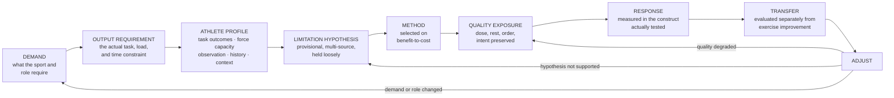

# G3 105 — Power Development

**Version:** 1.0
**Evidence Review Gate:** PASS WITH DECLARED EVIDENCE LIMITS
**Status:** APPROVED FOR NOVAKORE PRODUCTION upon successful production QA
**Authority:** G3 Performance

## Production-Ready Course Specification (Authoritative Build Document)

**Course code:** G3-105
**Course title:** Power Development
**Division:** G3 Performance, the human performance division of G3 Sports & Fitness
**Document class:** Authoritative production specification — NovaKore build source
**Date:** August 2026
**Owner / approver:** JR Romero, CSCS — Director of Training, G3 Performance
**Production precedent:** G3 102, G3 103, and G3 104 Course Specifications and NovaKore Build files, v1.0 FINAL
**Supersedes:** All prior G3 105 outlines, drafts, and research notes

---

## 0. DOCUMENT CONTROL

### 0.1 Source of authority

| Input | Role | Authority |
|---|---|---|
| *G3 105 — ChatGPT → Claude Production Handoff v1.0* | Intellectual and curriculum direction | Doctrine, applied standards, architecture, competencies, cases, gating |
| *G3-105 Power Development Evidence Pack FINAL* | Research basis | Evidence only. Explicitly creates no doctrine, standards, competencies, architecture, assessments, sign-offs, or NovaKore specification. |
| *G3 102, 103, 104* v1.0 FINAL specifications and build files | Structural and production precedent | Format, schema, classification discipline, decision model |
| *G3 Performance — Doctrine & Competency Framework* (internal) | Classification language | Structural authority |
| *G3 Performance Brand Standards v1.0* | Voice and presentation | Presentation authority |

### 0.2 Review gate record

| Gate | Applies to | Status | Effect |
|---|---|---|---|
| Evidence Review Gate | *G3 105 Evidence Pack FINAL* | **PASS WITH DECLARED EVIDENCE LIMITS** | Research phase closed. Thirteen conditions carried forward and discharged in §0.4. |
| Intellectual Development | *G3 105 Production Handoff v1.0* | **COMPLETE** | Doctrine, applied standards, competencies, architecture, cases, and gating supplied and not independently redefined here. |
| Production QA | This specification + build file | **PASSED** — see §21.6 | Status on completion: **APPROVED FOR NOVAKORE PRODUCTION**. |

No new research cycle was performed. No doctrine was redefined. **No conditional finding, practitioner system, acute effect, theoretical model, or technology output was promoted into a hard rule.**

### 0.3 What this document is and is not

This is the build specification for G3 105 inside NovaKore. It is not a catalog of explosive exercises, a technology-metric manual, a branded power system, or a summary of the Evidence Pack. Where G3 sets an operational rule beyond the evidence, that rule is labeled **G3 Applied Standard** — organizational policy, not science.

### 0.4 Evidence-integrity conditions carried forward

| # | Condition | How this specification discharges it |
|---|---|---|
| 1 | Adult-male dominance in many ballistic, VBT, PAPE, bench-throw, and RFD studies | Population-transfer disclosure (inherited G3 103 AS-103-12) in every module evidence block where that evidence is extended. §18.3. |
| 2 | Youth evidence does not validate adult prescriptions for middle-school athletes | M11 and Case 1 state this explicitly; no adult loading, volume, or testing rule is transferred to youth by default. |
| 3 | Female evidence is less extensive in several domains | §18.2 restraint standard; disclosure at the point of the claim; cycle evidence not converted into prescriptions (CJ-21). |
| 4 | F-V individualization is emerging, not diagnostically certain | D105-09, AS-105-08, M4, Case 4. Classified **C — Emerging**. No profile label is treated as a diagnosis. |
| 5 | Optimal loads are exercise-, athlete-, and metric-dependent | D105-05, M4, M5, Case 3. **No load percentage appears anywhere in this course** (CJ-01, CJ-02). |
| 6 | Universal contact counts are unsupported | AS-105-05 progresses demand rather than counts. **No contact prescription or classification is published** (CJ-08). |
| 7 | Universal velocity-loss thresholds are unsupported | M9, AS-105-04. **No velocity-loss figure is published** (CJ-10). |
| 8 | Exact in-season maintenance and minimum-dose models remain unresolved | M11, AS-105-15. Marked **U — Unresolved**; no maintenance dose or microdose model published (CJ-15, CJ-16). |
| 9 | Many derived force-plate metrics are less reliable and actionable than basic outcomes | D105-11, M12, AS-105-11. Basic outcomes prioritized over dashboard breadth. |
| 10 | Universal asymmetry and readiness thresholds are unsupported | AS-105-12, AS-105-13, Cases 7 and 9. **No threshold is published, and none is substituted** (CJ-17, CJ-18, CJ-19). |
| 11 | Medicine-ball loading and broad-transfer evidence is limited | M7 states the limit; no loading prescription and no generic "core power" language. |
| 12 | Acute PAPE does not establish chronic superiority | D105-13, AS-105-07, M9, Case 10. Acute and chronic evidence separated structurally. |
| 13 | Historical and practitioner systems remain separate from empirical doctrine | §17.4 renders them **Class E**; none may be the sole justification for a prescription. |

**Internal production rule.** The declared evidence limits and the citation finding in §20.3 do not block internal G3/NovaKore production, because every taught claim is anchored to an itemized verified record. External CEU recognition, accreditation submission, and public release are gated (§20.5).

### 0.5 Evidence integrity rules for this course

> **1. No lesson may state as established what the Evidence Pack classifies as emerging, conditional, historical, unknown, or overstated.**
>
> **2. Acute is not chronic.** An acute measurement, potentiation response, or single-session effect may never be presented as evidence of long-term programming superiority.
>
> **3. A test output is not a diagnosis, and a model is not a measurement.** No metric, profile, or dashboard output may be rendered as a cause.
>
> **4. No number becomes doctrine.**

Rules 2 and 3 exist because power development is the G3 domain most exposed to two specific failures: converting an acute effect into a training system, and converting a modeled parameter into an athlete label.

---

### 0.6 Foundations Authority Rule

*Added by the G3 Performance Foundations — 101–105 Curriculum Review Gate v1.0 (Correction 2). Governance text only — no doctrine, evidence class, module architecture, course outcome, practical sign-off, terminal defense, or decision model was changed.*

**The G3 Performance Foundations series is G3 101 → G3 102 → G3 103 → G3 104 → G3 105.** Within it, authority is fixed as follows and does not vary by course, document, or context.

| Course | Authoritative on |
|---|---|
| **G3 101** | The **G3 reasoning system**: evidence classes, certainty language, Evidence / G3 Applied Standard / Coach Judgment separation, population-transfer disclosure, testing and monitoring interpretation, claim-correction symmetry, scope of practice, and evidence restraint. |
| **G3 102** | The **G3 programming decision model**: DEMAND → PROFILE → GAP → PRIORITY → PRESCRIPTION → RESPONSE → ADJUST, including programming priority and change governance. |
| **G3 103** | **Speed, deceleration, COD, and agility** — where its standard is narrower than the upstream rule. |
| **G3 104** | **Strength development** — where its standard is narrower than the upstream rule. |
| **G3 105** | **Power development** — where its standard is narrower than the upstream rule. |

**Two rules bind every course in the series:**

1. **No downstream course may loosen an upstream evidence, scope, measurement, or programming-integrity standard.**
2. **Where domain courses overlap, the more specific domain governs only inside that domain; otherwise the upstream standard controls.**

**This course's position.** **G3 105 is a domain course and the series integration point.** It is authoritative within power development, and only where its standard is **narrower** than the upstream rule. Integrating the reasoning, programming, speed, and strength domains does not make it authoritative over any of them: it operates inside the G3 101 reasoning system and the G3 102 decision model and may not loosen either.

**Series attribution.** The three-layer discipline — Evidence / G3 Applied Standard / Coach Judgment — is attributed at series level to **G3 101**. Population-transfer governance is attributed at series level to **AS-101-16**, and may be restated locally: G3 103 restates it as **AS-103-12**, and G3 104 and G3 105 carry that restatement.

---

## 1. COURSE IDENTITY & PURPOSE

### 1.1 Course purpose

G3 105 teaches coaches to understand power as a **task-specific mechanical and athletic quality**, distinguish it from related constructs, select and coach appropriate power-development methods, preserve output quality, measure relevant outcomes, and integrate power work into athletic preparation — **without confusing a test metric or a training method with sport performance.**

### 1.2 The eight governing distinctions

```
POWER ≠ STRENGTH ≠ RFD ≠ IMPULSE
MOVING FAST ≠ TRYING TO MOVE FAST
ACUTE PEAK POWER ≠ OPTIMAL CHRONIC TRAINING LOAD
PAPE ≠ CHRONIC ADAPTATION
TEST OUTPUT ≠ DIAGNOSIS
PROFILE ≠ PRESCRIPTION
EXERCISE IMPROVEMENT ≠ SPORT TRANSFER
TECHNOLOGY ≠ DECISION QUALITY
```

Every module returns to at least one. A coach who collapses any of them cannot pass T-01.

### 1.3 The governing sequence

```
DEMAND → OUTPUT REQUIREMENT → ATHLETE PROFILE → LIMITATION HYPOTHESIS →
METHOD → QUALITY EXPOSURE → RESPONSE → TRANSFER → ADJUST
```

This is the reasoning path for any power decision in the G3 system. It sits **inside** the G3 102 decision model rather than replacing it (§5.3).

### 1.4 The ten obligations

A coach completing G3 105 can do ten things with any power decision placed in front of them:

1. **Define the task** — the actual movement, load, and constraints in which output is expressed.
2. **Identify the output demand** — what the sport and role actually require, mechanically.
3. **Build a provisional limitation hypothesis** — from multiple sources, held loosely.
4. **Select the method** — from the families available, on benefit-to-cost, not ideology.
5. **Coach the exposure** — setup, intent, projection, landing, regression, progression.
6. **Preserve quality** — manage reps, sets, rest, and selection so output matches intent.
7. **Measure the response** — in the construct actually tested, against baseline and error.
8. **Evaluate transfer** — separately from exercise improvement.
9. **Adjust** — for a stated reason.
10. **Defend the decision** — evidence, G3 Applied Standard, and Coach Judgment named separately.

These ten appear verbatim in the terminal defense (§14.6).

### 1.5 Position in the G3 education system

| | |
|---|---|
| **Prerequisite** | G3 102, G3 103, and G3 104 complete, including all three terminal defenses. Active G3 Performance coaching status. |
| **Audience** | G3 Performance coaches, G3 Youth Strength & Conditioning staff, G3 Volleyball Development staff, and scholastic/collegiate contract coaches operating under G3 programming standards. |
| **Delivery** | NovaKore self-paced modules with four observed practical sign-offs — PS-1, PS-2, PS-3, PS-4 — plus the final oral defense, T-01. |
| **Nominal duration** | 12 modules · 21.25 hours of directed study (1,275 minutes; see §6.1) · plus practical evidence collected on the floor over a minimum 4-week window. |
| **Standing** | G3 internal CEU course. Recognition by outside certifying bodies is not claimed and is gated on §20.5. |

### 1.6 Foundations continuity

**From G3 101.** Adaptation, overload, specificity, variation, individualization, recovery, and transfer are conditional frameworks. Specificity is deeper than visual resemblance. Fatigue is not the goal.

**From G3 102.** Programming follows `DEMAND → PROFILE → GAP → PRIORITY → PRESCRIPTION → RESPONSE → ADJUST`. Evidence, G3 Applied Standards, and Coach Judgment remain distinguishable.

**From G3 103.** Physical qualities must be named precisely. Descriptive relationships do not automatically create prescriptions. Testing measures the task actually performed. Transfer is task-specific.

**From G3 104.** Strength is foundational but not sufficient. Exercise selection is constraint-based. Standards must earn authority. Youth can train strength. Autoregulation and technology are tools, not doctrine.

Where this specification and G3 102 appear to disagree, G3 102 is authoritative.

### 1.7 Course outcomes

On completion, a G3 Performance coach can:

**CO-1** Distinguish power, strength, force, velocity, acceleration, impulse, and RFD.
**CO-2** Identify task-specific power and output demand.
**CO-3** Explain mechanical foundations without reducing performance to one metric.
**CO-4** Explain strength–power relationships and their limits.
**CO-5** Form provisional limitation hypotheses from multiple sources.
**CO-6** Interpret F-V and load-power data without diagnostic overreach.
**CO-7** Select among ballistic, plyometric, weightlifting-derivative, sprint, medicine-ball, and resistance methods.
**CO-8** Coach and progress plyometric and landing tasks.
**CO-9** Interpret RSI and RSI-modified appropriately.
**CO-10** Use explosive intent appropriately.
**CO-11** Distinguish RFD, impulse, peak force, and power.
**CO-12** Select upper- and lower-body power methods.
**CO-13** Evaluate complex/contrast, PAPE, cluster, and VBT methods.
**CO-14** Preserve output quality through dosing.
**CO-15** Organize rest, exercise order, weekly exposure, and periodization contextually.
**CO-16** Integrate power with strength, sprint/COD, practice, competition, and recovery.
**CO-17** Design youth power training.
**CO-18** Select and interpret power tests.
**CO-19** Use force-plate and technology outputs conservatively.
**CO-20** Reject unsupported readiness and asymmetry thresholds.
**CO-21** Distinguish safety evidence from injury-prevention claims.
**CO-22** Defend a power prescription using evidence, G3 standards, and Coach Judgment.

### 1.8 Voice and presentation standard

G3 Performance voice: **direct, systems-first, credentialed, unhyped**. Prohibited: motivational filler, "explosiveness" as a diagnosis, guaranteed outcomes, injury-prevention promises, branded-system language, and any implication that professional judgment or a device output is scientific certainty.

---

## 2. EVIDENCE CLASSIFICATION SYSTEM

### 2.1 Classes

G3 105 uses the six-class framework of its Evidence Pack, identical to the Foundations series.

| Class | Name | Definition | How it may be taught |
|---|---|---|---|
| **A** | Established Evidence | Repeatedly supported by high-quality evidence, with relevant boundaries. | May be taught as established, bounded by population and task. |
| **B** | Supported Practice | Reasonably supported, but implementation or population matters. | Taught as supported practice with the moderator stated. |
| **C** | Emerging / Conditional Evidence | Promising but insufficiently stable for strong general claims. | Taught as conditional. Never the sole basis for a required behavior. |
| **D** | Applied Coaching Inference | Plausible practice inference, not directly established. | Taught explicitly as inference, labeled aloud. |
| **E** | Historical / Practitioner Framework | Influential framework, distinct from empirical validation. | Taught as framework and history. Never as proof. |
| **F** | Unsupported / Overstated Claim | Not supported as a universal claim, or contradicted by stronger evidence. | **Never taught as true.** Used only to name and correct the error. |

### 2.2 Certainty language

Carried directly from the Evidence Pack and used alongside the class where it adds precision:

| Term | Meaning |
|---|---|
| **Known** | Direct, repeatable evidence within an identified population and task. |
| **Probable** | Convergent but conditional evidence. |
| **Possible** | Plausible or preliminary evidence. |
| **Unknown** | Insufficient evidence. **May never anchor a required behavior or an assessment key.** |
| **Organizational choice** | A G3 decision not dictated by research — rendered as a G3 Applied Standard, never as evidence. |

The Evidence Pack's own boundary markers — such as an **F/B boundary**, where a blanket claim is unsupported but a conditional practice is defensible — are carried forward in that form rather than resolved into one class. Several claim-audit entries in §16 sit on exactly that boundary, and flattening them would misrepresent the evidence in one direction or the other.

### 2.3 The three-column discipline

Every module renders, visually and separately: **EVIDENCE** (what the research supports, in which populations, how strongly) · **G3 APPLIED STANDARD** (what G3 does and why, given that evidence) · **COACH JUDGMENT** (what remains the coach's call, with the reasoning that must be documented).

### 2.4 The acute–chronic and model–measurement rules

Specific to G3 105 and enforced at production review:

> **Acute–chronic rule.** An acute response — a potentiation effect, a peak-power load, a single-session force-plate change — describes what happened once. It may never be presented as evidence of superior long-term programming. Acute and chronic evidence are cited separately and labeled separately.
>
> **Model–measurement rule.** A modeled parameter — F0, V0, Pmax, slope, imbalance, "optimal profile," an estimated power value — is a description produced by assumptions, not a measurement of a muscular property. It may generate a hypothesis. It may not produce a diagnosis or an athlete label.

---

### 2.5 Series-level evidence taxonomy

*Added by the G3 Performance Foundations — 101–105 Curriculum Review Gate v1.0 (Correction 3). Recognition only — **no claim in this course has been reclassified.***

The G3 Performance Foundations series uses one taxonomy. **Every course recognizes all seven classes. No course is required to use all of them, and no claim is ever reclassified in order to populate a class.**

| Class | Name |
|---|---|
| **A** | Established Evidence |
| **B** | Supported Practice |
| **C** | Emerging / Conditional Evidence |
| **D** | Applied Coaching Inference |
| **E** | Historical / Practitioner Framework |
| **F** | Unsupported / Overstated Claim |
| **U** | Unresolved / Unknown |

**U is the machine-readable series class** for a question about which no defensible evidence-class assignment can be made. **"Unknown" remains the human-facing certainty label** for the same condition. The two are equivalent in force, and both mean: *G3 does not know, and no G3 material may proceed as though it does.*

**Classes used in this course:** **A, B, C, D, E, F**, and **U**. G3 105 carries U alongside the Known / Probable / Possible / Unknown / Organizational-choice certainty language of §2.2. Its usage is unchanged.

---

## 3. CONTROLLED TERMINOLOGY

Binding across G3 105, downstream G3 courses, G3 testing outputs, and NovaKore data fields.

| Term | G3 definition | Not to be confused with |
|---|---|---|
| **Mechanical power** | Rate of mechanical work; in aligned external movement contexts may be represented as force × velocity. Task-, method-, and calculation-specific. | Jump height. RFD. "Explosiveness." A stable trait. |
| **Peak power** | Highest instantaneous power within a defined measurement interval and model. | An equipment-independent athlete attribute. |
| **Mean power** | Average power over a specified interval; the interval and calculation must be identified. | Peak power. A figure reportable without its protocol. |
| **Force** | Mechanical interaction capable of changing motion relative to mass. | Strength. Power. |
| **Velocity** | Rate of displacement. | Acceleration. Power. Intent. |
| **Acceleration** | Rate of change in velocity. | Speed. Power. |
| **Impulse** | Force integrated over time; determines change in momentum. | Peak force. RFD. |
| **RFD** | Change in force over time; measurement-window and methodology sensitive. | Power. A routine field diagnostic. |
| **Work** | Force applied through displacement. | Effort. Volume. |
| **Relative power** | Power normalized to an explicitly defined scaling method. | A universally superior expression. Absolute power. |
| **Ballistic exercise** | Exercise permitting continued acceleration and/or projection rather than deliberate end-range deceleration. | Any light-load lift. |
| **Plyometric training** | A family of rapid stretch-shortening-cycle tasks with differing eccentric, landing, contact-time, coordination, and tissue demands. | One intensity, one exercise, or one contact category. |
| **Stretch-shortening cycle (SSC)** | Eccentric, transition, and concentric sequence in rapid tasks. | "Stored elastic energy" as a complete explanation. |
| **Reactive strength** | A task-specific quality commonly operationalized with RSI-type ratios. | A complete biological measure of reactivity, stiffness, or injury risk. |
| **RSI / RSI-modified** | Task-specific performance ratios under a defined protocol and calculation. | A readiness score. A tendon diagnosis. |
| **PAPE** | Acute performance enhancement following a conditioning activity, reflecting potentiation–fatigue balance. | PAP. Chronic adaptation. Evidence of complex-training superiority. |
| **Force–velocity profile** | A modeled description of force and velocity output across selected tasks and loads. | A measurement of muscular capacity. A diagnosis. A prescription. |
| **Optimal profile** | A theoretical target derived within a model and protocol. | An athlete-specific training target established by evidence. |
| **Complex / contrast training** | Pairing heavy or resisted actions with explosive actions. | A proven superior chronic method. |
| **Cluster set** | Intra-set rest used to preserve repetition quality. | An inherently superior set structure. |
| **VBT** | Use of movement velocity data to inform monitoring and/or prescription; exercise-, load-, and device-specific. | A requirement. A superior system. |
| **Explosiveness** | **Not used as a precise scientific diagnosis in G3.** Replace it with the actual quality and task. | Any of the above. |

**Terminology enforcement.** NovaKore glossary entries link from first use. Assessment items use these terms exactly. Using "explosiveness" as a diagnosis, reporting a power value without its task and calculation, or collapsing power, RFD, and impulse are scored errors (AS-105-01, AS-105-10).

---
## 4. G3 105 DOCTRINE

Fifteen doctrines form the conceptual backbone. Each is stated in production form with its evidence class, anchor records, and teaching boundary. IDs: **D105-01** through **D105-15**.

---

### D105-01 — Power Is Task-Specific

**Statement.** Interpret power within the movement, load, body mass, force-time constraints, and measurement method used to express it.

**Evidence class:** **A — Established / Known.** Mechanical power may be expressed as work over time and, in aligned conditions, as force × velocity — but neither relationship establishes that a high power measurement represents a stable trait independent of task, body mass, equipment, calculation method, and movement strategy. [EP105-01, EP105-02, EP105-08]

**Teaching boundary.** This does not make power measurement useless. It makes an unlabeled power number meaningless. Every power value in G3 carries its task, load, and calculation method.

---

### D105-02 — Related Qualities Are Not Interchangeable

**Statement.** Strength, force, impulse, velocity, power, and RFD interact but are distinct.

**Evidence class:** **A — Established / Known** for the mechanical distinctions; **A for definition, B/C for routine field interpretation** in the case of RFD. [EP105-01, EP105-02, EP105-03]

**Teaching boundary.** Distinct does not mean unrelated — these qualities interact continuously in every athletic task. The doctrine forbids substitution, not integration. "Explosiveness" is **Class F as a precise diagnostic term** and is replaced by the actual quality and task.

---

### D105-03 — Power Development Is Method-Neutral

**Statement.** Plyometrics, ballistic resistance exercise, sprinting, resistance training, medicine-ball work, and weightlifting derivatives can all contribute. No method is universally required.

**Evidence class:** **B — Supported Practice** that multiple method families are effective for power-related outcomes when selected for the athlete, task, and context; **F** for any claim that a named method is universally superior or universally required. The Evidence Pack rates the comparative method evidence **B**, never A, and G3 does not raise it. Plyometric-versus-resistance comparisons show no consistent difference for jump outcomes, with mixed sprint findings; weightlifting and plyometric training may yield similar improvements in several outcomes. [EP105-02, EP105-04, EP105-14, EP105-15]

**Teaching boundary.** Method-neutral is not method-indifferent. Methods differ in learning cost, equipment demand, fatigue cost, and coachability — which is exactly what AS-105-03 asks the coach to weigh. **No G3 material may require any exercise or method.**

---

### D105-04 — Strength Supports Power but Does Not Gate It

**Statement.** Strength matters, especially in weaker and less-trained athletes, but G3 does not require a universal strength phase or squat ratio before appropriate power training.

**Evidence class:** **A — Known** that strength is a contributor to power; **B — Probable** that weaker athletes often benefit materially from strength development; **F** for the claim that athletes must get strong before any power training, and **F** for a universal squat-ratio prerequisite — a youth resistance-training review specifically states that the frequently proposed 1.5×-bodyweight squat prerequisite for lower-body plyometrics is not supported. [EP105-02, EP105-10, EP105-11]

**Teaching boundary.** Rejecting the gate is not rejecting strength. Competence, exposure, readiness, supervision, and task demand still govern what an athlete does (AS-105-06) — those are coaching judgments, not a ratio.

---

### D105-05 — Acute Output Does Not Dictate Chronic Prescription

**Statement.** The load producing the highest acute measured power is not automatically the best long-term training load.

**Evidence class:** **A — Established** as a distinction. Maximal measured power often occurs at an intermediate load, but the exact load varies by exercise, athlete, measurement method, external versus system power, body mass, and peak versus mean outcome; training outcomes depend on stimulus, specificity, volume, technical quality, fatigue, athlete status, and concurrent training. The universal "30% 1RM" rule is **F**. [EP105-02, EP105-08]

**Teaching boundary.** **No load percentage is published anywhere in this course** (CJ-01, CJ-02). Acute peak-power testing may describe an exercise response for an athlete; it does not set the chronic training load.

---

### D105-06 — Output Quality Governs Power Training

**Statement.** Preserve movement intent, technical execution, and output quality appropriate to the objective. Fatigue that materially changes the task changes the stimulus.

**Evidence class:** **B — Supported Practice.** Power work generally requires more recovery than hypertrophy-oriented training when the priority is preserving velocity, jump height, technical execution, or output; exact rest requirements vary by task, load, athlete, and objective. [EP105-02]

**Teaching boundary.** **No rest interval, repetition count, or velocity-loss cutoff is published** (CJ-10, CJ-11). "Fatigue makes power work more sport-specific" is an **F/B boundary** claim: training under fatigue may develop fatigue tolerance, but it does not make maximal-power work more specific.

---

### D105-07 — Transfer Must Be Demonstrated, Not Assumed

**Statement.** Improvement in a jump, lift, throw, profile, or laboratory metric does not automatically establish sport transfer.

**Evidence class:** **A — Established.** Power-related test outcomes are commonly associated with sprinting, jumping, and COD, but association does not identify the causal quality to train; isolated improvements in a training exercise cannot be assumed to transfer to sport performance. [EP105-02, EP105-07, EP105-14, EP105-15]

**Teaching boundary.** Continuous with G3 103 D103-7 and G3 104 D104-2. This is not a claim that transfer is rare — it is a requirement that the transfer pathway be stated and, where possible, observed.

---

### D105-08 — Directional Similarity Is Not Sufficient Specificity

**Statement.** Horizontal, vertical, unilateral, bilateral, or visually sport-like exercises do not guarantee direction- or sport-specific transfer.

**Evidence class:** **B — Supported Practice** for considering direction and task demands; **F** for automatic vector-matching claims and for the blanket claim that unilateral work is inherently more sport-specific. [EP105-02, EP105-07, EP105-13]

**Teaching boundary.** Direction may matter. What is unsupported is the inference from visual direction to guaranteed transfer. Selecting unilateral or bilateral work by task, competence, tolerance, and desired loading is **Class D** — legitimate coaching inference, labeled as such (CJ-12).

---

### D105-09 — Profiling Generates Hypotheses

**Statement.** Force–velocity profiles may describe performance and support hypotheses; profile labels are not definitive diagnoses.

**Evidence class:** **B** for describing performance across selected loads with transparent protocol; **C/D** for generating training hypotheses; **F** for definitively diagnosing "force deficiency" or "velocity deficiency," for using an "optimal profile" as an exact target for all athletes, and for replacing sprint/jump testing, technical observation, and sport context. Reliability is method-dependent — reported slope reliability across methods has been poor, and validity differs by method. Recent meta-analytic evidence on profile-based individualized training is **C — Emerging**. [EP105-05, EP105-06, EP105-07, EP105-16, EP105-25]

**Teaching boundary.** The model–measurement rule (§2.4) governs this doctrine. A profile is a description produced by assumptions. **No F-V threshold, deficit classification, or optimal-profile target is published** (CJ-03, CJ-04).

---

### D105-10 — Technology Must Serve a Decision

**Statement.** Force plates, VBT, jump apps, and profiling systems are useful only when sufficiently reliable, interpretable, and actionable.

**Evidence class:** **B — Supported Practice.** VBT usefulness depends on device validity, exercise specificity, loading, familiarity, and whether the measure changes a coaching decision; force plates improve data availability, not necessarily decision quality; app and device validation is not automatically transferable across software, protocols, or users. "VBT is required" is **F**. [EP105-08, EP105-17, EP105-24]

**Teaching boundary.** **Low-tech environments must remain capable of G3-quality coaching.** The course is written so that a coach with a tape measure and a stopwatch loses no conceptual ground.

---

### D105-11 — Simple Reliable Metrics Outrank Metric Volume

**Statement.** Prioritize standardized, reliable, decision-relevant measures over dashboard complexity.

**Evidence class:** **B — Supported Practice.** CMJ metric reviews report stronger reliability for several basic outcome metrics and less consistent reliability for selected RFD, eccentric, stiffness, and derived variables. More metrics can create more noise. [EP105-08, EP105-09]

**Teaching boundary.** This is not an argument against force plates. It is an argument for a small, pre-specified, reliable metric set chosen before the data is collected.

---

### D105-12 — Reactive Metrics Are Task Measures

**Statement.** RSI, RSI-modified, jump height, contact time, and force-plate variables do not independently define readiness, stiffness, injury risk, or explosiveness.

**Evidence class:** **A** that RSI is a standardized task-specific ratio; **F** for the claim that RSI alone completely measures reactive ability; **F/C** for the claim that low RSI directly identifies a tendon-stiffness deficit; **B/C** for RSI and RSI-modified contributing to a broader standardized monitoring battery. [EP105-08, EP105-24]

**Teaching boundary.** These metrics are worth collecting when standardized and decision-relevant. They are not worth a label.

---

### D105-13 — Acute Potentiation Is Not Chronic Superiority

**Statement.** PAPE may be useful conditionally; it does not establish long-term superiority of complex or contrast methods.

**Evidence class:** **B/C** for acute conditional PAPE effects, which are small and variable and context-dependent; **C/B** for chronic complex and contrast training, where superiority over simpler programming is not consistently established; **F** for "PAPE proves complex training is superior." PAP and PAPE are not interchangeable terms. [EP105-17, EP105-18]

**Teaching boundary.** Where the Evidence Pack reports an acute response window from a specific analyzed study set, that figure describes those studies. It is **not** a G3 prescription and is never published as one (CJ-05).

---

### D105-14 — Youth Can Train Power

**Statement.** Properly supervised and progressively exposed youth can sprint, jump, land, throw, perform plyometrics, and use appropriate ballistic and resistance methods without arbitrary age or strength-ratio gates.

**Evidence class:** **A/B — Established/Supported.** Youth resistance and plyometric training can improve strength, jump, sprint, and other fitness outcomes when appropriately supervised and progressed; evidence does not support age-based prohibitions or arbitrary strength thresholds as universal gates. "Youth must wait until age 16," "youth need a universal strength threshold before jumping," and "youth should not do plyometrics" are all **F**. [EP105-10, EP105-11, EP105-12, EP105-13]

**Teaching boundary.** The claim is conditioned on **supervision, technical coaching, and progression** — stated every time (AS-105-14). And youth evidence does **not** validate adult loading, volume, or testing prescriptions for middle-school athletes (Condition 2).

---

### D105-15 — Power Programming Is Integrated Load Management

**Statement.** Coordinate power exposure with sprinting, jumping, strength, practice, competition, and recovery. No universal contact count, frequency, microcycle, or maintenance dose governs all athletes.

**Evidence class:** **B — Supported Practice** for integrating power exposure with total high-intensity load; **D** for exact microcycle templates; **U — Unknown** for exact in-season maintenance and minimum-effective doses; **F** for universal contact classifications. [EP105-02, EP105-19, EP105-21]

**Teaching boundary.** Continuous with G3 103 D103-8 and G3 104 D104-12. The athlete's jumps in practice count. **No frequency, contact count, or maintenance dose is published** (CJ-08, CJ-13, CJ-15).

---

### 4.16 Doctrine summary table (NovaKore tag source)

| ID | Doctrine | Evidence class | Primary module(s) | Standing |
|---|---|---|---|---|
| D105-01 | Power is task-specific | A | M1 | G3 Doctrine |
| D105-02 | Related qualities are not interchangeable | A (B/C field RFD) | M1, M8 | G3 Doctrine |
| D105-03 | Power development is method-neutral | B / F | M5, M7 | G3 Doctrine |
| D105-04 | Strength supports power but does not gate it | A / B / F | M3 | G3 Doctrine |
| D105-05 | Acute output does not dictate chronic prescription | A | M4 | G3 Doctrine |
| D105-06 | Output quality governs power training | B | M10 | G3 Doctrine |
| D105-07 | Transfer must be demonstrated, not assumed | A | M2 | G3 Doctrine |
| D105-08 | Directional similarity is not sufficient specificity | B / F | M2 | G3 Doctrine |
| D105-09 | Profiling generates hypotheses | B / C / F | M4 | G3 Doctrine |
| D105-10 | Technology must serve a decision | B | M9 | G3 Doctrine |
| D105-11 | Simple reliable metrics outrank metric volume | B | M8, M12 | G3 Doctrine |
| D105-12 | Reactive metrics are task measures | A / F | M6, M12 | G3 Doctrine |
| D105-13 | Acute potentiation is not chronic superiority | B/C / F | M9 | G3 Doctrine |
| D105-14 | Youth can train power | A/B | M11 | G3 Doctrine |
| D105-15 | Power programming is integrated load management | B / D / U | M10, M11 | G3 Doctrine |

---

## 5. THE G3 105 POWER MODEL

### 5.1 The sequence



### 5.2 Stage definitions

| Stage | Question | What it produces | Common failure |
|---|---|---|---|
| **Demand** | What does the sport and role require? | A demand statement naming the tasks where output matters | Prescribing "power" with no task |
| **Output requirement** | What is the actual movement, load, and time constraint? | A named output requirement | Treating every fast action as one quality |
| **Athlete profile** | What does the athlete currently express, and under what conditions? | Task outcomes, force capacity, observation, history, context | One test result standing in for a profile |
| **Limitation hypothesis** | What is most plausibly limiting this output, and how confident am I? | A **provisional** hypothesis with its confidence stated | A label — "he's velocity deficient" — treated as an identity |
| **Method** | What produces the needed adaptation at acceptable cost? | A method selection with intended adaptation and stated alternatives | Method chosen by ideology, equipment habit, or system loyalty |
| **Quality exposure** | Is the athlete actually producing the intended output? | Dose, rest, order, and stop criteria | Volume that guarantees the last third trains something else |
| **Response** | What changed, in what construct, against what baseline and error? | A labeled result with its protocol | Reading a model output as a measurement |
| **Transfer** | Did the sport task change, and what makes that attributable? | A transfer statement, or an honest "not yet established" | Exercise improvement reported as sport improvement |
| **Adjust** | Change, hold, or progress — and why? | A logged decision with a stated reason | Change on novelty; no record of reasoning |

### 5.3 Relationship to the G3 102 decision model

G3 105 does not replace, extend, or modify the G3 102 model.

| G3 102 stage | What G3 105 supplies |
|---|---|
| **DEMAND** | The output requirement: the task, load, direction, and time constraint in which power is expressed. |
| **PROFILE** | Construct-appropriate power testing (M12), interpreted inside reliability and baseline. |
| **GAP** | The limitation hypothesis — force capacity, velocity expression, coordination, reactive exposure, sprint skill, or something else — held provisionally (D105-09, AS-105-02). |
| **PRIORITY** | Whether power expression is the primary target this phase, and what it costs. |
| **PRESCRIPTION** | Method selection, quality exposure, dose, rest, order, and weekly integration (M5–M11). |
| **RESPONSE** | Test selection and interpretation under D105-01, D105-11, AS-105-09, AS-105-10, AS-105-12. |
| **ADJUST** | Progression and method change with stated reasons, including abandoning a hypothesis that the response did not support. |

### 5.4 Model integrity rules

1. **Name the task before the method.** No power prescription is recorded without the output requirement it serves (AS-105-01).
2. **The hypothesis is provisional by construction.** A limitation label that cannot be revised is not a hypothesis; NovaKore stores it with a confidence level and a review point (§21.4).
3. **No stage produces a score.** No tool, dashboard, or NovaKore feature may generate an F-V diagnosis, optimal-load prescription, readiness decision, asymmetry alert, contact prescription, exercise requirement, or strength-ratio gate.
4. **Transfer is a separate stage for a reason.** A coach who reports exercise improvement as transfer has skipped it.
5. **G3 102 governs conflicts.**

---
## 6. MODULE ARCHITECTURE

### 6.1 Overview

| # | Module | Focus | Core doctrine | Est. time | Sign-off |
|---|---|---|---|---|---|
| M1 | What Power Actually Is | Terminology | D105-01, D105-02 | 90 min | — |
| M2 | Mechanical Foundations & Athletic Transfer | Mechanics and transfer | D105-01, D105-07, D105-08 | 105 min | — |
| M3 | Strength–Power Relationship & Athlete Limitation Hypotheses | Strength contribution and hypothesis formation | D105-04 | 105 min | — |
| M4 | Force–Velocity & Load–Power Models | Profiling and load-power | D105-05, D105-09 | 105 min | **PS-1** |
| M5 | Ballistic Training & Explosive Intent | Ballistic methods and intent | D105-03, D105-05, D105-06 | 105 min | — |
| M6 | Plyometrics, Reactive Strength & Landing | SSC, RSI, landing | D105-03, D105-12, D105-08 | 120 min | — |
| M7 | Weightlifting Derivatives, Medicine Balls & Upper-Body Power | Method families | D105-03 | 105 min | **PS-2** |
| M8 | RFD, Impulse & Force-Time Interpretation | Force-time constructs | D105-02, D105-11 | 105 min | — |
| M9 | Complex/Contrast, PAPE, Cluster Sets & VBT | Acute vs chronic; technology | D105-13, D105-10 | 105 min | — |
| M10 | Dosage, Rest, Exercise Order & Weekly Integration | Quality and integration | D105-06, D105-15 | 105 min | — |
| M11 | Periodization, Maintenance, Youth & Female Athletes | Organization and populations | D105-14, D105-15 | 105 min | **PS-3** |
| M12 | Testing, Force Plates, Readiness & Integrated G3 Decision-Making | Measurement and integration | D105-11, D105-12, D105-01 | 120 min | **PS-4**, **T-01** |

Total directed study: 1,275 minutes — 21.25 hours — plus practical evidence collected over a minimum four-week window. Consistent with the Foundations series (G3 102: 18.5 h · G3 103: 19.5 h · G3 104: 20.75 h).

### 6.2 Standard module structure (NovaKore content pattern)

Seventeen production elements per module, in this order: **(1)** module ID · **(2)** title and framing statement · **(3)** purpose · **(4)** learning objectives · **(5)** doctrine IDs · **(6)** applied-standard IDs · **(7)** competency IDs · **(8)** evidence classifications · **(9)** lesson structure · **(10)** coaching applications · **(11)** common errors / claim audit · **(12)** case/scenario · **(13)** knowledge assessment · **(14)** applied assessment · **(15)** practical sign-off linkage · **(16)** source mapping · **(17)** prerequisite/gating logic.

### 6.3 Gating

```
M1 → M2 → M3 → M4 → [PS-1 GATE] → M5 → M6 → M7 → [PS-2 GATE] →
M8 → M9 → M10 → M11 → [PS-3 GATE] → M12 → [PS-4] → [T-01] → COMPLETE
```

- **PS-1 gates M5.** Evaluation and method selection must be observed before advanced method interpretation, per the handoff gating rule.
- **PS-2 gates M8.** Power-exercise coaching must be observed before force-time and technology interpretation is taught.
- **PS-3 gates M12.** Contextual session design must be observed before testing, readiness, and integration.
- **PS-4** follows M12 and requires the four-week delivery window complete.
- **T-01 requires all four sign-offs** and all module assessments at standard. T-01 is required for course competency completion.

---

## 7. G3 APPLIED STANDARDS

Operational rules G3 applies in its own environments. **A G3 Applied Standard is organizational policy, adopted because a defensible answer is required and the evidence does not determine one.** IDs: **AS-105-01** through **AS-105-15**.

---

### AS-105-01 — Name the Output
Identify the actual task and output requirement before prescribing "power."
*Evidence basis:* A (D105-01). *Enforcement:* every `power_task` object requires `output_requirement` and `task` (§21.4).

### AS-105-02 — Build Limitation Hypotheses From Multiple Sources
Use task performance, strength/force capacity, technical observation, training history, and context before labeling an athlete.
*Evidence basis:* B — the Evidence Pack's own supported-practice position. *Boundary:* the output is a **provisional hypothesis**, not an identity (D105-09, CJ-04).

### AS-105-03 — Use the Simplest Effective Method
Where multiple methods can meet the objective, prefer the best benefit-to-cost option for athlete, coach, facility, and calendar.
*Evidence basis:* D — applied inference from method-neutrality (D105-03). *Boundary:* "simplest" means lowest total cost to deliver well, not lowest effort.

### AS-105-04 — Preserve Intended Quality
Manage reps, sets, rest, and exercise selection so output and technique remain consistent with the intended adaptation.
*Evidence basis:* B (D105-06). *Boundary:* **no rest interval, repetition count, or velocity-loss cutoff is published** (CJ-10, CJ-11).

### AS-105-05 — Progress Plyometric Demand, Not Just Contacts
Progress landing demand, velocity, amplitude, direction, unilateral demand, external load, complexity, and exposure.
*Evidence basis:* B for progressive individualized dosage; **F** for universal contact classifications as evidence-based prescriptions. *Boundary:* CJ-08.

### AS-105-06 — No Universal Strength Gate
Use competence, exposure, readiness, supervision, and task demands instead of arbitrary bodyweight ratios.
*Evidence basis:* F for the universal ratio (D105-04). *Standing:* binding prohibition. *Boundary:* CJ-05, CJ-06.

### AS-105-07 — Separate Acute and Chronic Evidence
Do not use PAPE, acute peak-power loads, or acute force-plate responses as proof of superior long-term programming.
*Evidence basis:* A as a methodological rule (D105-05, D105-13). *Enforcement:* acute and chronic claims are cited and labeled separately in every module evidence block.

### AS-105-08 — Treat F-V Labels as Provisional
Force- and velocity-deficit labels require corroboration.
*Evidence basis:* C/F (D105-09). *Enforcement:* NovaKore stores a limitation hypothesis with confidence and review point; no label may be stored as a fixed athlete attribute.

### AS-105-09 — Standardize Testing
Define protocol, equipment, warm-up, instructions, calculation method, and baseline.
*Evidence basis:* A/B — reliability depends on task standardization, device, familiarization, and calculation. *Inherited:* G3 102 AS-06 (conditions recorded at time of testing).

### AS-105-10 — Measure the Construct Actually Tested
Label CMJ, broad jump, RSI, loaded jump, medicine-ball throw, or bar-velocity results according to the task performed.
*Evidence basis:* A (D105-01, D105-12). *Standing:* binding language rule. *Enforcement:* `test_record` requires `construct_measured`.

### AS-105-11 — Use Technology Only When Actionable
Technology must answer a defined question.
*Evidence basis:* B (D105-10, D105-11). *Boundary:* the question is defined **before** the data is collected; a metric that changes no decision is not collected.

### AS-105-12 — Interpret Change Against Error and Baseline
Readiness and performance changes require repeated baselines, reliability and error context, and other athlete information.
*Evidence basis:* B/C for multi-source monitoring; **F** for single-metric automated readiness decisions. *Boundary:* CJ-18, CJ-19.

### AS-105-13 — No Universal Asymmetry Threshold
A fixed 10% or 15% value does not automatically trigger intervention.
*Evidence basis:* F for universal cutoff interpretation (D105-12). *Standing:* binding prohibition. **G3 publishes no threshold and substitutes none** (CJ-20).

### AS-105-14 — Youth Progress by Competence and Exposure
Supervise, progressively dose, technically coach, and scale to maturity and training age without unsupported prohibitions.
*Evidence basis:* A/B (D105-14). *Enforcement:* supervision ratio documented for every G3 youth power group; the safety claim is stated with its conditions.

### AS-105-15 — Integrate the Weekly High-Output Load
Account for total sprint, jump, COD, strength, practice, and competition exposure.
*Evidence basis:* B (D105-15). *Boundary:* no frequency, contact count, microcycle model, or maintenance dose is published (CJ-08, CJ-13, CJ-14, CJ-15, CJ-16).

### 7.16 Inherited standards

In force and referenced, not duplicated: **G3 102** AS-06, AS-09, AS-10, AS-11, AS-12, AS-14, AS-27, AS-30, AS-31, AS-32; **G3 103** AS-103-12 (population-transfer disclosure), AS-103-01 (name the quality); **G3 104** AS-104-01 (define the strength task), AS-104-05 (categories before dogma), AS-104-10 (test the construct), AS-104-12 (interpret asymmetry cautiously).

**G3 105 creates no hard rules beyond the fifteen standards above.**

---

## 8. COACH JUDGMENT REGISTER

Twenty-two areas that must not become universal hard rules. Examples may be used only when labeled as examples, Applied Standards, or Coach Judgment.

| ID | Area | Evidence position | What G3 supplies | What remains the coach's call |
|---|---|---|---|---|
| **CJ-01** | Exact optimal power load | Intermediate loads often maximize acute power; exact load varies by exercise, athlete, metric, protocol | AS-105-01, D105-05 | The load for this athlete and exercise |
| **CJ-02** | 30% 1RM | **F** as a universal rule | The load-power concept | Whether a descriptive load test is worth running |
| **CJ-03** | Optimal F-V profile | Theoretical and protocol-sensitive; **F/C** as a universal target | The model and its limits | Whether profiling adds anything here |
| **CJ-04** | Force/velocity-deficit thresholds | **F** as diagnosis | AS-105-08 provisional labeling | How much weight to give a profile |
| **CJ-05** | Strength prerequisites | **F** as universal gates | AS-105-06 | Readiness judgment for this athlete and task |
| **CJ-06** | Squat ratios | **F**; explicitly unsupported for plyometric entry | AS-105-06 | How to judge competence and exposure |
| **CJ-07** | Olympic lifts and catches | **F** as requirements; **F/B boundary** on danger claims | D105-03, AS-105-03 | Whether the learning cost is worth it here |
| **CJ-08** | Plyometric contact classifications | **F** as evidence-based prescriptions | AS-105-05 (progress demand) | The dose |
| **CJ-09** | Depth jumps | **F** as universally best | The task and its demands | Whether and when to use them |
| **CJ-10** | Velocity-loss thresholds | No universal cutoff verified | AS-105-04 (quality as criterion) | Whether to set one locally |
| **CJ-11** | Rest | Exact requirements vary by task, load, athlete, objective | AS-105-04 | The interval |
| **CJ-12** | Weekly frequency | No universal frequency established | AS-105-15 | The frequency |
| **CJ-13** | Exercise order | **B/D** — prioritize high-quality output before substantial fatigue; specifics contextual | The principle | The order in this session |
| **CJ-14** | High/low organization | **D** for exact templates | Integration principle | Whether to organize this way |
| **CJ-15** | In-season maintenance | **U — Unknown** for exact dose | AS-105-15 | The in-season dose |
| **CJ-16** | Microdosing | **U — Unknown** for team sport | AS-105-15 | Whether to distribute the dose |
| **CJ-17** | RSI | Task-specific ratio; **F** as complete reactive measure | D105-12 | How much weight to give it |
| **CJ-18** | Readiness | **F** for single-metric automated decisions | AS-105-12 multi-source interpretation | The readiness call |
| **CJ-19** | CMJ metric sets | Basic outcomes more reliable than several derived metrics | D105-11 | Which small set to standardize on |
| **CJ-20** | Asymmetry | **F** for universal cutoffs | AS-105-13 | How to interpret a measured difference |
| **CJ-21** | Female-specific programming | Foundational principles do not differ by sex; evidence uneven; cycle claims not convertible into rules | §18.2 restraint standard | Individual modification on individual grounds |
| **CJ-22** | Landing cues claimed to prevent injury | **C/F** for single-cue injury-prevention claims | D105-15 boundary, §19 | Exposure, progression, and coaching decisions, communicated without guarantees |

**Teaching requirement.** Each area is named as Coach Judgment at the point it is taught, and T-01 probes the distinction directly.

---

## 9. DETAILED MODULE SPECIFICATIONS

---

## MODULE 1 — What Power Actually Is

**Module ID:** M1 · **Focus:** terminology · **Duration:** 90 min · **Gating:** entry module

**Framing statement:** "He needs to be more explosive" is not a coaching statement. It names no task, no quality, and no decision — and this course begins by taking it away.

### 1 · Purpose
To install the mechanical vocabulary the course depends on, and to end the use of "explosiveness" as a diagnostic category.

### 2 · Learning objectives
- **M1.1** Define mechanical power as rate of work, and state when force × velocity applies.
- **M1.2** Distinguish force, strength, work, power, impulse, RFD, velocity, and acceleration.
- **M1.3** Distinguish peak and mean power, and state why interval and calculation must be specified.
- **M1.4** Explain why relative power is not universally more meaningful than absolute power.
- **M1.5** Explain why "explosiveness" is not a stable scientific construct.
- **M1.6** Replace an "explosiveness" statement with the actual quality and task.

### 3 · Doctrine IDs
D105-01 (primary) · D105-02 (primary)

### 4 · Applied-standard IDs
AS-105-01 (primary) · AS-105-10 (introduced)

### 5 · Competency IDs
C105-01 (primary) · C105-16 (introduced)

### 6 · Evidence classification

| Statement | Class / certainty | Basis |
|---|---|---|
| Force, strength, work, mechanical power, impulse, velocity, and acceleration are distinct constructs | **A / Known** | EP105-01, EP105-02 |
| Mechanical power is rate of work; force × velocity applies when vectors are aligned | **A / Known** | EP105-01, EP105-02 |
| Peak power is the highest instantaneous power in a defined interval and model | **B / Probable** | EP105-02, EP105-08 |
| Mean power requires its interval and calculation to be specified | **B / Probable** | EP105-02 |
| RFD is distinct from power | **A for definition; B/C for routine field interpretation** | EP105-03 |
| Relative power is context dependent, not universally superior | **B / Context dependent** | EP105-02 |
| "Explosiveness" as a precise diagnostic term | **F** | EP105-02, EP105-03 |

**Population transfer (inherited AS-103-12):** definitional evidence is mechanical and not population-limited; the field-interpretation caveat on RFD carries adult laboratory origins.
**Coach Judgment:** none. Definitions are not negotiable inside G3.

### 7 · Lesson structure
**L1.1 — The word that means nothing.** Four coaches use "explosive" for four different qualities in one session. The cost is that none of them can select a method or a test.
**L1.2 — Power, properly defined.** Rate of work; force × velocity in aligned conditions; and why the definition already contains the task-specificity of D105-01.
**L1.3 — The neighbours.** Force, strength, work, impulse, velocity, acceleration — each defined against power and against each other.
**L1.4 — Peak, mean, and the protocol.** Why a power number without its interval, model, and device is not a result.
**L1.5 — Relative and absolute.** When normalizing helps, when it distorts, and why neither is universally superior.
**L1.6 — RFD, introduced honestly.** Conceptually important, measurement-sensitive, and not a synonym for power. Full treatment in M8.
**L1.7 — Rewriting the claim.** Coaches convert real statements — "she needs more explosiveness," "he's a power athlete" — into task-and-quality language, or flag them as unanswerable.

### 8 · Coaching applications
Applied immediately to G3 session plans and testing language. A block labeled "power" is incomplete; "vertical projection output in a loaded jump for an athlete whose demand is repeated jump performance" can be evaluated by someone else.

### 9 · Common errors / claim audit
Using "explosiveness" as a diagnosis (**D105-02**; Class F as a precise term) · reporting a power value with no task or calculation · using power and RFD interchangeably · assuming relative power is always the better expression · treating a peak-power figure as an athlete attribute.

### 10 · Case / scenario
**Scenario M1-A — Rewrite the claim.** Eight real coaching statements rewritten into G3 form with task, quality, and measurement named — or flagged as unanswerable without more information.

### 11 · Knowledge assessment
- **K1.1** (MC) Which definition of mechanical power does G3 use?
- **K1.2** (Matching) Match seven constructs to their defining relationship.
- **K1.3** (MC) A peak-power value reported without its protocol is best described as…
- **K1.4** (True/False + justification) "Relative power is the more meaningful measure for athletes."
- **K1.5** (Short answer) Rewrite "he needs to be more explosive" in G3 terms.

### 12 · Applied assessment
**A1 — Power language audit.** A real program or testing document annotated so every power claim names task, quality, and measurement, with unanswerable claims flagged. **Standard:** every claim rewritten or flagged; no "explosiveness" as a diagnosis; no collapsing of power, RFD, and impulse.

### 13 · Practical sign-off linkage
None. Terminology accuracy carries into **PS-1** and is scored in **T-01**.

### 14 · Source mapping
EP105-01 · EP105-02 · EP105-03 · EP105-08

### 15 · Prerequisite / gating logic
**Prerequisite:** G3 102, 103, and 104 complete including all terminal defenses; active G3 coaching status. **Unlocks:** M2. **Gate:** none.

---

## MODULE 2 — Mechanical Foundations & Athletic Transfer

**Module ID:** M2 · **Focus:** mechanics and transfer · **Duration:** 105 min · **Gating:** requires M1

**Framing statement:** Jump height can improve for at least five different reasons. Until you know which one, you do not know what you trained.

### 1 · Purpose
To ground power reasoning in impulse, force-time, and body mass, and to install the association-versus-transfer discipline before any method is discussed.

### 2 · Learning objectives
- **M2.1** Explain work/time and force × velocity as descriptions, not prescriptions.
- **M2.2** Explain impulse–momentum and why net impulse relative to body mass governs takeoff velocity.
- **M2.3** Name the multiple pathways by which a jump outcome can change.
- **M2.4** Explain force-time constraints — why time available changes which quality matters.
- **M2.5** Distinguish association from transfer.
- **M2.6** Explain why directional similarity does not guarantee transfer.
- **M2.7** State a transfer pathway for any method proposed.

### 3 · Doctrine IDs
D105-01 · D105-07 (primary) · D105-08 (primary)

### 4 · Applied-standard IDs
AS-105-01 · AS-105-02 (introduced)

### 5 · Competency IDs
C105-01 · C105-03 (primary) · C105-10 (introduced)

### 6 · Evidence classification

| Statement | Class / certainty | Basis |
|---|---|---|
| Force and velocity jointly determine external mechanical power | **A** | EP105-01 |
| Impulse is the force-time integral; net vertical impulse relative to body mass determines takeoff velocity | **A** | EP105-01, EP105-08 |
| Jump height can change through force magnitude, force-application time, timing/coordination, movement strategy, or body mass | **A** | EP105-01, EP105-08 |
| Impulse is often more task-informative than peak force alone when time is constrained | **A/B** — mechanical principle; task application is reasonable extrapolation | EP105-02 |
| Power-related test outcomes are associated with sprinting, jumping, and COD | **A** | EP105-02, EP105-07 |
| Association does not identify the causal quality to train | **A** | EP105-02, EP105-07 |
| Resistance training can improve sport-specific performance in elite athletes | **B** — spans different sports and interventions | Evidence Pack §5; supporting record not itemized (§20.3b) |
| Directional similarity guarantees transfer | **F** | EP105-02, EP105-07 |
| Vertical jump alone predicts or develops maximal velocity | **F** | EP105-02 |

**Population transfer (inherited AS-103-12):** transfer evidence spans athlete populations with substantial heterogeneity; elite-sample findings are not generalized to developing athletes.
**Coach Judgment:** which pathway to pursue for a given athlete — that is M3's hypothesis work.

### 7 · Lesson structure
**L2.1 — Work, time, force, velocity.** The mechanics, stated so they describe rather than prescribe.
**L2.2 — Impulse and momentum.** The force-time integral, and why it is the honest way to think about jumping and acceleration.
**L2.3 — Five ways a jump improves.** Force magnitude · force-application time · timing and coordination · movement strategy · body mass. This lesson is the mechanical basis for the entire limitation-hypothesis method in M3.
**L2.4 — Time available changes the question.** When time is constrained, peak force achieved too late does not help — which is why impulse and RFD enter the conversation, and why neither is universally primary.
**L2.5 — Association is not transfer.** Test outcomes correlate with sport tasks. That identifies neither the limiting quality nor the method.
**L2.6 — Direction, carefully.** Horizontal and vertical tasks can both contribute to sprint-related outcomes; visual direction alone establishes nothing (D105-08).
**L2.7 — Stating the transfer pathway.** For any method: what adaptation, expressed in which task, supported by what exposure, and what would show it did not occur.

### 8 · Coaching applications
The practical use is diagnostic restraint. When an athlete's jump improves, the competent coach can name which pathways plausibly moved and which were not addressed — before deciding what the improvement means.

### 9 · Common errors / claim audit
Treating jump height as a power diagnosis · reading a correlation as a prescription · vector-matching claims (**CA-14**) · assuming vertical work develops maximal velocity · ignoring body mass in tasks the athlete must move · reporting exercise improvement as sport transfer (**§1.2**).

### 10 · Case / scenario
**Scenario M2-A — The improved jump.** An athlete's CMJ rises 3 cm across a block that included strength work, plyometrics, and a body-mass change. The learner lists the plausible pathways, states what can and cannot be concluded, and says what would distinguish them.

### 11 · Knowledge assessment
- **K2.1** (Select all) Which pathways can change jump height?
- **K2.2** (MC) Net vertical impulse relative to body mass primarily determines…
- **K2.3** (Interpretation) A study reports r = 0.65 between CMJ and sprint time. What follows for programming?
- **K2.4** (Error identification) "We do horizontal jumps because acceleration is horizontal." Identify the error.
- **K2.5** (Short answer) State a transfer pathway for a method you currently use.

### 12 · Applied assessment
**A2 — Transfer statement.** For one athlete and one method: demand, output requirement, intended adaptation, transfer pathway, supporting exposure, and the falsifier. **Standard:** association and transfer distinguished; no vector-matching claim; body mass considered where relevant; falsifier stated in task terms.

### 13 · Practical sign-off linkage
Feeds **PS-1**.

### 14 · Source mapping
EP105-01 · EP105-02 · EP105-07 · EP105-08 · EP105-14 · EP105-15

### 15 · Prerequisite / gating logic
**Prerequisite:** M1 at standard. **Unlocks:** M3. **Gate:** none.

---

## MODULE 3 — Strength–Power Relationship & Athlete Limitation Hypotheses

**Module ID:** M3 · **Focus:** strength contribution and hypothesis formation · **Duration:** 105 min · **Gating:** requires M2

**Framing statement:** "Force-limited" is a hypothesis, not a diagnosis, and not an identity. The skill is holding it loosely enough to be wrong.

### 1 · Purpose
To establish what strength contributes to power and where that contribution ends, and to teach the multi-source, provisional limitation hypothesis that drives every method decision in this course.

### 2 · Learning objectives
- **M3.1** State what maximal strength contributes to power output.
- **M3.2** Explain why the contribution is generally larger in weaker or less-trained athletes.
- **M3.3** Explain diminishing returns and task-specific limits.
- **M3.4** Reject the universal strength-before-power sequence and the universal squat ratio.
- **M3.5** Build a limitation hypothesis from multiple sources.
- **M3.6** State the confidence level and review point for any hypothesis.
- **M3.7** Revise or abandon a hypothesis the response does not support.

### 3 · Doctrine IDs
D105-04 (primary) · D105-02 · D105-07

### 4 · Applied-standard IDs
AS-105-02 (primary) · AS-105-06 (primary) · AS-105-01

### 5 · Competency IDs
C105-02 (primary) · C105-04 (primary) · C105-18

### 6 · Evidence classification

| Statement | Class / certainty | Basis |
|---|---|---|
| Strength is a contributor to power | **A / Known** — contribution differs with task and athlete status | EP105-02 |
| Weaker or less-trained athletes often benefit materially from strength development | **B / Probable** — "weak" must be task- and population-contextualized | EP105-02 |
| Concurrent development of strength and power-oriented tasks is supported in many populations | **B** | EP105-02, EP105-11 |
| Athletes must get strong before any power training | **F** | EP105-11, EP105-10 |
| A universal squat ratio is required before plyometrics | **F** — no validated universal threshold; the 1.5× prerequisite is explicitly unsupported | EP105-10 |
| More strength always produces more sport power | **F** — diminishing returns and task-specific limits exist | EP105-02 |
| Strength and power require separate phases | **F** — concurrent and mixed approaches are defensible | EP105-02, EP105-11 |
| A single metric identifies the limiting quality | **F** | EP105-02, EP105-08 |

**Population transfer (inherited AS-103-12):** the strength–power evidence is adult-weighted; the squat-ratio rejection derives from a youth-focused review and is stated with that origin.
**Coach Judgment:** the hypothesis itself, its confidence, and its review point (CJ-05, CJ-06).

### 7 · Lesson structure
**L3.1 — What strength buys.** Larger force capacity can increase force available across velocities. Real, and neither complete nor independent of coordination and velocity expression.
**L3.2 — Who benefits most.** The contribution is generally more consequential in weaker or less-trained athletes — which makes "weak" a contextual judgment, not a number.
**L3.3 — Where it stops.** Diminishing returns; task-specific limits; and why "more strength always means more power" is Class F.
**L3.4 — No gate.** The universal strength phase and the squat-ratio prerequisite are unsupported, the latter explicitly. What replaces them: competence, exposure, readiness, supervision, and task demand (AS-105-06).
**L3.5 — Building the hypothesis.** Five sources: task performance, force capacity, technical observation, training history, and context. A hypothesis built on one of them is a label.
**L3.6 — Confidence and review.** Every hypothesis carries how confident the coach is and when it will be revisited. This is what makes it provisional rather than an identity (AS-105-08).
**L3.7 — Being wrong well.** What a non-response means, and how to abandon a hypothesis without abandoning the athlete's block.

### 8 · Coaching applications
Applied at every G3 intake and every phase review. The artifact is a two-sentence hypothesis with its sources, confidence, and review point — short enough that coaches actually write it.

### 9 · Common errors / claim audit
Strength-before-power absolutes (**CA-01**) · squat-ratio prerequisites (**CA-02**) · separate-phase requirements (**CA-16**) · labels treated as identities · single-source hypotheses · never revisiting a hypothesis that the response contradicted.

### 10 · Case / scenario
**Scenario M3-A — Strong and slow.** A strong high-school athlete with poor acceleration. The learner builds the hypothesis from all five sources and states what would refute it. Developed in full as **Case 2** (§10.2).

### 11 · Knowledge assessment
- **K3.1** (MC) The strength–power relationship is best described as…
- **K3.2** (Select all) Which sources contribute to a G3 limitation hypothesis?
- **K3.3** (Error identification) "He needs a 1.5× squat before we start plyos." Identify the errors.
- **K3.4** (MC) A limitation hypothesis differs from a diagnosis because…
- **K3.5** (Short answer) State what would make you abandon your current hypothesis for one athlete.

### 12 · Applied assessment
**A3 — Limitation hypothesis.** For one athlete: the output requirement, the five sources, the provisional hypothesis, the confidence level, the review point, and the falsifier. **Standard:** multi-source; provisional language throughout; no gate or ratio; falsifier stated.

### 13 · Practical sign-off linkage
**PS-1** (completed at M4). Observed elements from M3: the coach states a hypothesis and its confidence out loud, from real athlete information.

### 14 · Source mapping
EP105-02 · EP105-10 · EP105-11 · EP105-08

### 15 · Prerequisite / gating logic
**Prerequisite:** M2 at standard. **Unlocks:** M4. **Gate:** none.

---
## MODULE 4 — Force–Velocity & Load–Power Models

**Module ID:** M4 · **Focus:** profiling and load-power · **Duration:** 105 min · **Gating:** requires M3 · **Sign-off: PS-1**

**Framing statement:** A profile is a description produced by assumptions. It can start a conversation. It cannot end one.

### 1 · Purpose
To teach F-V profiling and load-power relationships accurately — what they describe, what they cannot diagnose, and why the load that maximizes acute power is not automatically the training load.

### 2 · Learning objectives
- **M4.1** Describe F0, V0, Pmax, slope, imbalance, and "optimal profile" as modeled outputs.
- **M4.2** State the reliability and validity limits of vertical-jump profiling methods.
- **M4.3** Explain why external load-velocity relationships are not the intrinsic muscle force-velocity relationship.
- **M4.4** Describe the load-power curve and why the peak load varies.
- **M4.5** Distinguish acute peak-power load from optimal chronic training load.
- **M4.6** Use a profile to generate a hypothesis without diagnostic overreach.
- **M4.7** State when profiling should be optional, advanced, or excluded.

### 3 · Doctrine IDs
D105-09 (primary) · D105-05 (primary) · D105-01

### 4 · Applied-standard IDs
AS-105-08 (primary) · AS-105-02 · AS-105-09 · AS-105-11

### 5 · Competency IDs
C105-05 (primary) · C105-04 · C105-12

### 6 · Evidence classification

| Statement | Class / certainty | Basis |
|---|---|---|
| F-V models combine measured variables with modeled theoretical outputs and are not direct measurements of muscular capacity | **A** | EP105-05, EP105-07 |
| Vertical-jump profiles can show high linearity while slope reliability across methods is poor | **B** — reported coefficients of variation of 14–30% in the cited reliability work | EP105-05 |
| Validity is method-dependent; one common method showed poor-to-fair validity while a two-point method with distal loads performed better | **B** | EP105-06 |
| Describing performance across selected loads with transparent protocol | **B** | EP105-05 |
| Generating training hypotheses from a profile | **C/D** — when corroborated by performance and observation | EP105-07, EP105-25 |
| Definitively diagnosing "force deficiency" or "velocity deficiency" | **F** | EP105-05, EP105-06, EP105-07 |
| Using "optimal profile" as an exact target for all athletes | **F/C** | EP105-07, EP105-16 |
| Replacing sprint/jump testing, technical observation, and sport context with profiling | **F** | EP105-07 |
| Profile-based individualized training improving vertical-profile outcomes and jump height | **C — Emerging**; sprint effects non-significant in one review | EP105-16, EP105-25 |
| Maximal measured power often occurs at an intermediate load | **A** | EP105-02 |
| The exact peak-power load varies by exercise, athlete, method, external vs system power, body mass, and peak vs mean outcome | **A** | EP105-02 |
| A universal "30% 1RM" rule | **F** | EP105-02 |
| The acute peak-power load is the best chronic training load | **F** | EP105-02 |

**Population transfer (inherited AS-103-12):** profiling reliability and validity work is largely adult and vertical-jump-specific; the emerging individualization evidence is new, with varying profile methods, and requires downstream risk-of-bias review before organizational adoption.
**Coach Judgment:** whether to profile at all; how much weight a profile carries (CJ-03, CJ-04); the training load (CJ-01, CJ-02).

### 7 · Lesson structure
**L4.1 — What the model does.** Measured points, fitted relationship, derived parameters. Every step is an assumption doing work.
**L4.2 — Reliability, stated in numbers.** High linearity does not mean reliable slope; reported cross-method variation for slope is large enough that two methods can label the same athlete differently. That fact — not the label — is what coaches need.
**L4.3 — Validity is method-dependent.** Method selection materially changes interpretation, which means a profile without its method is uninterpretable.
**L4.4 — External load-velocity is not muscle F-V.** The two are routinely conflated; the conflation is what makes "deficit" language sound biological.
**L4.5 — The load-power curve.** Intermediate loads often maximize acute power, and the exact load moves with exercise, athlete, metric, and protocol. **G3 publishes no percentage.**
**L4.6 — Acute versus chronic.** §2.4's acute–chronic rule applied to loading: what produced the highest power once does not determine the training load for twelve weeks.
**L4.7 — When to profile.** An organizational question, answered by AS-105-11: does it change a decision here, at acceptable cost, with a method you can standardize?

### 8 · Coaching applications
In most G3 environments profiling is optional. Where it is used, the defensible form is: one standardized method, transparent protocol, results described rather than labeled, and any hypothesis corroborated against actual performance and observation before it changes a program.

### 9 · Common errors / claim audit
Reading a profile as a diagnosis (**D105-09**, **AS-105-08**) · prescribing 30% 1RM (**CA-04**) · using an acute peak-power load as the chronic load (**CA-05**) · comparing profiles across methods or devices · treating "optimal profile" as a target · letting a profile replace observation.

### 10 · Case / scenario
**Scenario M4-A — "Velocity deficient."** An athlete labeled from a single profile. The learner examines reliability, assumptions, and corroboration, and states what the label may and may not license. Developed in full as **Case 4** (§10.4).

### 11 · Knowledge assessment
- **K4.1** (MC) F0 and V0 are best described as…
- **K4.2** (Interpretation) Two methods produce different slope values for the same athlete. What follows?
- **K4.3** (MC) The load producing highest acute power is best used for…
- **K4.4** (Error identification) "The profile shows a force deficit, so we're doing a strength block." Identify the errors.
- **K4.5** (Short answer) State the conditions under which G3 would use profiling at all.

### 12 · Applied assessment
**A4 — Profile interpretation.** Given a supplied profile with protocol details, the learner writes what it describes, what it cannot establish, one hypothesis it could support, the corroboration required, and the decision it would and would not change. **Standard:** no diagnosis; method limits stated; no load percentage; corroboration specified.

### 13 · Practical sign-off linkage
**PS-1 — Power Evaluation & Method Selection.** See §14.2. **PS-1 gates M5.**

### 14 · Source mapping
EP105-05 · EP105-06 · EP105-07 · EP105-16 · EP105-25 · EP105-02 · EP105-H4

### 15 · Prerequisite / gating logic
**Prerequisite:** M3 at standard. **Unlocks:** PS-1, which gates M5. **Gate:** PS-1 must be recorded before M5 opens.

---

## MODULE 5 — Ballistic Training & Explosive Intent

**Module ID:** M5 · **Focus:** ballistic methods and intent · **Duration:** 105 min · **Gating:** requires PS-1

**Framing statement:** Trying to move fast and moving fast are related, and they are not the same thing. Both matter, and the difference is coachable.

### 1 · Purpose
To teach ballistic methods as a viable family with defined boundaries, and to establish intent as a real training variable without overclaiming what intent alone achieves.

### 2 · Learning objectives
- **M5.1** Define ballistic exercise by continued acceleration or projection.
- **M5.2** Select among loaded jumps, jump squats, bench throws, and ballistic push-ups by athlete and constraint.
- **M5.3** Explain why ballistic intent is not the same as light load.
- **M5.4** Apply maximal concentric intent appropriately across loads.
- **M5.5** State what intent alone does and does not establish.
- **M5.6** Select loading without a universal percentage.
- **M5.7** Preserve output quality within a ballistic set.

### 3 · Doctrine IDs
D105-03 (primary) · D105-05 · D105-06

### 4 · Applied-standard IDs
AS-105-03 (primary) · AS-105-04 · AS-105-01

### 5 · Competency IDs
C105-06 (primary) · C105-13 · C105-12

### 6 · Evidence classification

| Statement | Class / certainty | Basis |
|---|---|---|
| Ballistic, plyometric, and weightlifting methods are all viable power-training categories | **A** | EP105-02, EP105-04 |
| Jump squat / loaded jump as a method | **B** — reasonable for trained adolescents and adults; youth use requires competence and supervision | EP105-02 |
| Bench throw as a method | **B** — most evidence from trained adult males; requires equipment and spotting | EP105-02 |
| Explosive push-up as a method | **B/C** — limited direct comparative evidence | EP105-02 |
| No single peak-power load is universally superior | **A** | EP105-02 |
| Ballistic intent is not identical to using a light load | **B** | EP105-02 |
| Maximal intended concentric acceleration is a relevant training principle | **B / Probable** | EP105-02 |
| Intent alone guarantees identical adaptation across loads | **F** | EP105-02 |
| "Explosive intent matters only with light loads" | **F** | EP105-02 |
| "Power training must use light loads" | **F** | EP105-02 |

**Population transfer (inherited AS-103-12):** bench-throw and much ballistic evidence comes from resistance-trained adult males; youth application requires competence, supervision, and progression rather than scaled adult loading (Condition 2).
**Coach Judgment:** the load (CJ-01, CJ-02); which ballistic variants suit this athlete and facility.

### 7 · Lesson structure
**L5.1 — What makes a movement ballistic.** Continued acceleration through the movement or implement release, rather than deliberate end-range deceleration.
**L5.2 — The family.** Jumps, loaded jumps, jump squats, bench throws, ballistic push-ups, medicine-ball throws — with their equipment, spotting, and tolerance demands stated.
**L5.3 — Intent versus load.** A light non-ballistic lift may still require deceleration; a ballistic movement may permit fuller acceleration. Load and ballistic character are different variables.
**L5.4 — Intent across loads.** Maximal intended concentric acceleration is relevant even where external velocity is constrained by a heavy load — and it does not make heavy and light training equivalent.
**L5.5 — Selecting the load.** By intended adaptation, athlete competence, and preserved output. **No percentage.** Where a coach uses a descriptive load test, it describes that athlete in that exercise on that day.
**L5.6 — Quality within the set.** What output decline looks like, and the stop criteria the coach sets in advance (AS-105-04).
**L5.7 — Benefit-to-cost.** AS-105-03 applied: when a simpler ballistic option delivers the needed stimulus at lower equipment, learning, and supervision cost, it is the better selection.

### 8 · Coaching applications
For a G3 group with limited equipment, unloaded and lightly loaded jump variants plus medicine-ball throws cover most ballistic needs with low technical and equipment overhead — a defensible selection under AS-105-03, not a compromise.

### 9 · Common errors / claim audit
Light-load-only power training (**CA-03**) · a universal 30% 1RM (**CA-04**) · intent claimed to matter only with light loads (**CA-17**) · using the acute peak-power load as the training load (**CA-05**) · sets long enough that the last reps train something else · loaded jumps prescribed to athletes without the competence to land them.

### 10 · Case / scenario
**Scenario M5-A — 30% for everything.** A coach prescribing 30% 1RM across all power exercises. The learner separates the useful idea from the unsupported rule and rewrites the prescription logic. Developed in full as **Case 3** (§10.3).

### 11 · Knowledge assessment
- **K5.1** (MC) Ballistic exercise is defined by…
- **K5.2** (True/False + justification) "Explosive intent only matters when the load is light."
- **K5.3** (Select all) Which factors govern ballistic load selection in G3?
- **K5.4** (Error identification) "Research says 30% 1RM is optimal for power." Identify the errors.
- **K5.5** (Short answer) State your stop criterion for a ballistic set and why.

### 12 · Applied assessment
**A5 — Ballistic prescription.** For one athlete: method, load basis, intent instruction, set structure, stop criteria, and the alternatives considered under AS-105-03. **Standard:** no percentage asserted as a rule; intent and load distinguished; stop criteria observable; alternatives stated.

### 13 · Practical sign-off linkage
Feeds **PS-2**.

### 14 · Source mapping
EP105-02 · EP105-04 · EP105-22

### 15 · Prerequisite / gating logic
**Prerequisite:** **PS-1 recorded** (hard gate) and M4 at standard. **Unlocks:** M6.

---

## MODULE 6 — Plyometrics, Reactive Strength & Landing

**Module ID:** M6 · **Focus:** SSC, RSI, landing · **Duration:** 120 min · **Gating:** requires M5

**Framing statement:** "Plyometrics" names a family whose members differ more than they resemble each other. Progress the demand, not the count.

### 1 · Purpose
To teach plyometric training as a family of distinct demands, RSI as a task ratio rather than a diagnosis, and landing as a coached, progressed exposure with conservative safety language.

### 2 · Learning objectives
- **M6.1** Describe the SSC without reducing it to stored elastic energy.
- **M6.2** Distinguish plyometric tasks by landing, eccentric, contact-time, coordination, and tissue demand.
- **M6.3** State what plyometric training is supported to improve.
- **M6.4** Interpret RSI and RSI-modified as task-specific ratios.
- **M6.5** Coach and progress landing and braking demand.
- **M6.6** Progress plyometric demand rather than contact count.
- **M6.7** Apply conservative causal language to landing and injury claims.

### 3 · Doctrine IDs
D105-03 · D105-12 (primary) · D105-08 · D105-15 · D105-06

### 4 · Applied-standard IDs
AS-105-05 (primary) · AS-105-04 · AS-105-10 · AS-105-14

### 5 · Competency IDs
C105-07 (primary) · C105-08 (primary) · C105-18

### 6 · Evidence classification

| Statement | Class / certainty | Basis |
|---|---|---|
| Plyometric training is a family of rapid SSC tasks with substantially different demands under one label | **A** | EP105-02, EP105-13 |
| Plyometric training improves jump and, in many populations, sprint and COD performance | **A/B** — heterogeneity is substantial | EP105-14, EP105-20, EP105-21 |
| Effects cannot be attributed exclusively to one mechanism such as tendon stiffness or RFD | **A** | EP105-14, EP105-20, EP105-21 |
| Plyometric versus resistance training shows no consistent difference for jump outcomes; one review found plyometrics superior at 5 m and 20 m sprint with no difference in several other outcomes | **B** | EP105-15 |
| "Stored elastic energy" as a complete explanation of SSC performance | **F** — neural activation, active muscle force, joint mechanics, pre-activation, and coordination also matter | EP105-02, EP105-03 |
| The ~250 ms fast/slow SSC boundary as a validated biological threshold | **F** — a practical convention | EP105-02 |
| RSI is a standardized task-specific ratio | **A** | EP105-08 |
| RSI alone completely measures reactive ability | **F** | EP105-08, EP105-24 |
| Low RSI directly identifies a tendon-stiffness deficit | **F/C** | EP105-08 |
| RSI/RSI-modified contributing to a broader standardized monitoring battery | **B/C** | EP105-08, EP105-24 |
| Progressive, supervised landing exposure | **B** | EP105-10 |
| Single-cue injury-prevention claims for landing | **C/F** | EP105-10 |
| Universal contact-count classifications as evidence-based prescriptions | **F** | EP105-19, EP105-21 |
| Twice-weekly training over ~8–10 weeks associated with more stable improvements in adolescent team-sport samples | **B** — sample-specific, not a universal prescription | EP105-21 |
| "Depth jumps are the best plyometric" / "more contacts = more power" / "every jump must be maximal" | **F** | EP105-02, EP105-19, EP105-21 |

**Population transfer (inherited AS-103-12):** much plyometric meta-analytic evidence is youth and team-sport specific with high heterogeneity; the dose finding above concerns adolescent team-sport samples and is not generalized.
**Coach Judgment:** the dose (CJ-08); whether and when depth jumps are used (CJ-09); progression rate.

### 7 · Lesson structure
**L6.1 — The SSC, honestly.** Eccentric, transition, concentric. Elastic behavior matters and does not explain performance alone. The ~250 ms convention is a convention.
**L6.2 — The family, sorted by demand.** Countermovement jumps, hops, bounds, drop and depth jumps, unilateral and bilateral, horizontal and vertical — sorted by landing force, eccentric demand, contact time, coordination, and tissue loading rather than by name.
**L6.3 — What plyometrics are supported to improve.** Jump outcomes robustly; sprint and COD in many populations; with heterogeneity stated and mechanism claims withheld.
**L6.4 — RSI and RSI-modified.** What the ratios are, what standardization they require, and what they cannot tell you (D105-12).
**L6.5 — Landing as the trained quality.** Braking and eccentric absorption; height, surface, direction, support, fatigue, and technique as the variables. Progressive supervised exposure is supported; single-cue prevention claims are not.
**L6.6 — Progress demand, not contacts.** AS-105-05: landing demand, velocity, amplitude, direction, unilateral demand, external load, complexity, exposure. **No contact classification is published.**
**L6.7 — Safety language.** The accurate sentence, rehearsed: exposure and progression are defensible; guarantees are not (§19, CJ-22).

### 8 · Coaching applications
In G3 Volleyball Development the binding issue is usually that practice already supplies enormous jump and landing volume. The competent plan counts it first (AS-105-15) and often reduces gym contacts while raising their quality — which is Case 5.

### 9 · Common errors / claim audit
Counting contacts instead of progressing demand (**CA-11**) · treating depth jumps as universally best (**CA-10**) · every jump maximal (**CA-12**) · RSI read as reactive ability (**CA-20**) · low RSI read as a tendon diagnosis · plyometrics called inherently high risk (**CA-08**) · a landing cue promised to prevent ACL injury (**CJ-22**).

### 10 · Case / scenario
**Scenario M6-A — Below the team norm.** An athlete whose RSI sits below the squad average. The learner states what that does and does not indicate and what they would do next. Developed in full as **Case 8** (§10.8).

### 11 · Knowledge assessment
- **K6.1** (Select all) Which demands differentiate plyometric tasks?
- **K6.2** (MC) RSI is best described as…
- **K6.3** (MC) The ~250 ms SSC boundary should be treated as…
- **K6.4** (Error identification) "This landing cue prevents ACL injuries." Identify the error and rewrite the claim.
- **K6.5** (Short answer) Name four ways to progress plyometric demand other than adding contacts.

### 12 · Applied assessment
**A6 — Plyometric progression.** A three-stage progression for a named athlete: task, landing demand, velocity and amplitude, direction, support, exposure, progression criterion, regression, and the parent- or athlete-facing safety sentence. **Standard:** demand progressed rather than counted; criterion observable; no contact prescription; no injury guarantee.

### 13 · Practical sign-off linkage
**PS-2** (completed at M7). Observed elements from M6: the coach teaches and progresses a landing or plyometric task.

### 14 · Source mapping
EP105-02 · EP105-03 · EP105-08 · EP105-10 · EP105-13 · EP105-14 · EP105-15 · EP105-19 · EP105-20 · EP105-21 · EP105-24

### 15 · Prerequisite / gating logic
**Prerequisite:** M5 at standard. **Unlocks:** M7. **Gate:** none.

---

## MODULE 7 — Weightlifting Derivatives, Medicine Balls & Upper-Body Power

**Module ID:** M7 · **Focus:** method families · **Duration:** 105 min · **Gating:** requires M6 · **Sign-off: PS-2**

**Framing statement:** The clean is a good tool with a large tuition fee. Whether an athlete should pay it is a coaching decision, not an identity.

### 1 · Purpose
To evaluate weightlifting derivatives, medicine-ball work, and upper-body ballistics on benefit-to-cost, and to settle the "required versus dangerous" argument in both directions.

### 2 · Learning objectives
- **M7.1** State what weightlifting training is supported to improve.
- **M7.2** Weigh learning cost, equipment, mobility demand, opportunity cost, and coach competence.
- **M7.3** Describe no-catch derivatives and their evidence status.
- **M7.4** State why catching is not established as necessary.
- **M7.5** Select medicine-ball tasks by movement, implement, and intended output.
- **M7.6** Select upper-body power methods with their evidence limits stated.
- **M7.7** Answer both the "required" and the "too dangerous" claims accurately.

### 3 · Doctrine IDs
D105-03 (primary) · D105-07 · D105-01

### 4 · Applied-standard IDs
AS-105-03 (primary) · AS-105-01 · AS-105-10 · AS-105-14

### 5 · Competency IDs
C105-09 (primary) · C105-06 · C105-18

### 6 · Evidence classification

| Statement | Class / certainty | Basis |
|---|---|---|
| Weightlifting training is effective for strength, CMJ, squat jump, sprint, and COD-related outcomes | **B** | EP105-04 |
| Weightlifting and plyometric training may yield similar improvements in speed, power, and strength outcomes | **B** — indicates utility, not unique necessity | EP105-04 |
| No method family is established as universally superior for every athlete and power outcome | **A** | EP105-02, EP105-04, EP105-15 |
| Weightlifting movements carry high technical content; value depends on benefit exceeding learning cost, equipment, mobility demands, opportunity cost, and coach competence | **B/D** | EP105-04 |
| No-catch derivatives may retain meaningful force-velocity exposure while reducing receiving-position constraints | **C** — direct comparative evidence limited | Evidence Pack §13; supporting record not itemized (§20.3b) |
| "Every athlete must clean or snatch to develop power" | **F** | EP105-04 |
| "Catching is necessary for power development" | **F/C** | Evidence Pack §13 |
| "Olympic lifts are inherently too dangerous for athletes" | **F/B boundary** — risk depends on supervision, progression, and context | EP105-10 |
| Medicine-ball throws as a ballistic, projection-based option | **B/C** | EP105-22 |
| A 12-week medicine-ball intervention in young female handball athletes produced greater throw-test gains than control | **B** — task-, sport-, and sex-specific | EP105-22 |
| Universal medicine-ball load prescriptions and broad sport-transfer claims | **C / limited** | EP105-22 |
| Upper-body ballistic methods (bench throws, ballistic push-ups, upper-body plyometrics) | **B/C** — direct research more limited and exercise-specific | EP105-02, EP105-22 |

**Population transfer (inherited AS-103-12):** bench-throw evidence is largely resistance-trained men; the medicine-ball intervention evidence is young female handball athletes and sport/test specific. Neither generalizes automatically.
**Coach Judgment:** whether to teach weightlifting derivatives here (CJ-07); which variant; medicine-ball loading.

### 7 · Lesson structure
**L7.1 — What weightlifting delivers.** Effective across strength, jump, sprint, and COD-related outcomes — and comparable to plyometric training in several of them. Useful, not necessary.
**L7.2 — The tuition fee.** Technical content, coaching competence, equipment, mobility and receiving demands, and the opportunity cost of the time spent learning. AS-105-03 in its most consequential application.
**L7.3 — No-catch derivatives.** Pulls, high pulls, jump shrugs — plausibly retaining force-velocity exposure with fewer constraints, on **limited** direct comparative evidence. Claims of identical adaptation stay conditional.
**L7.4 — Medicine balls.** A genuine ballistic option for upper-body, rotational, and whole-body sequencing. Specify movement, implement, task, and intended output — **not** "core power."
**L7.5 — Upper-body power.** Bench throws, ballistic push-ups, upper-body plyometrics; thinner and more exercise-specific evidence than lower-body jump research, stated as such.
**L7.6 — Both absolutes, answered.** "Required" is Class F. "Too dangerous" sits on an F/B boundary where supervision, progression, and context decide. Coaches practise both answers.
**L7.7 — Choosing for this athlete.** A worked benefit-to-cost comparison, which is Case 6.

### 8 · Coaching applications
In a G3 scholastic environment with one coach and thirty athletes, the honest weightlifting answer is usually a derivative selected for coachability at that ratio — or a loaded-jump or medicine-ball alternative that reaches the intended stimulus without the tuition. Either is defensible; the reasoning is what is assessed.

### 9 · Common errors / claim audit
Olympic lifts declared required or inherently dangerous (**CA-06**) · catching declared necessary (**CA-07**) · medicine-ball work described as generic "core power" · upper-body evidence generalized beyond its exercise · a method chosen because the coach enjoys teaching it · learning cost ignored in a 30-athlete room.

### 10 · Case / scenario
**Scenario M7-A — Cleans or loaded jumps.** A benefit-to-cost comparison for a specific athlete, facility, and coach. Developed in full as **Case 6** (§10.6).

### 11 · Knowledge assessment
- **K7.1** (MC) The weightlifting evidence is best summarized as…
- **K7.2** (Select all) Which costs enter a weightlifting-derivative decision?
- **K7.3** (MC) The evidence status of no-catch derivatives is…
- **K7.4** (Error identification) "Athletes have to clean to be powerful." / "Cleans are too dangerous for high schoolers." Identify both errors.
- **K7.5** (Short answer) Rewrite "medicine-ball core power work" in G3 terms.

### 12 · Applied assessment
**A7 — Method comparison.** For one athlete and objective, compare two method families across intended adaptation, learning cost, equipment, supervision, opportunity cost, and expected benefit; select and defend one; state what would change the selection. **Standard:** no method declared required or forbidden; costs quantified in coaching terms; evidence limits stated.

### 13 · Practical sign-off linkage
**PS-2 — Power Exercise Coaching.** See §14.3. **PS-2 gates M8.**

### 14 · Source mapping
EP105-02 · EP105-04 · EP105-10 · EP105-22 · EP105-15

### 15 · Prerequisite / gating logic
**Prerequisite:** M6 at standard. **Unlocks:** PS-2, which gates M8.

---
## MODULE 8 — RFD, Impulse & Force-Time Interpretation

**Module ID:** M8 · **Focus:** force-time constructs · **Duration:** 105 min · **Gating:** requires PS-2

**Framing statement:** Force-time data is the most seductive information in the field. It looks like an explanation and it is a description.

### 1 · Purpose
To make coaches capable of interpreting force-time constructs accurately, and to establish the measurement-window and reliability limits that prevent RFD and derived metrics from becoming field diagnoses.

### 2 · Learning objectives
- **M8.1** Define RFD and state its measurement-window sensitivity.
- **M8.2** Distinguish early and late RFD determinants.
- **M8.3** Distinguish impulse, peak force, and RFD, and state when each is task-relevant.
- **M8.4** Explain why strength improvement and RFD change are not the same.
- **M8.5** State the reliability limits of derived force-time metrics.
- **M8.6** Explain why no single force-time variable is universally primary.
- **M8.7** State what field inference from force-time data can and cannot support.

### 3 · Doctrine IDs
D105-02 (primary) · D105-11 (primary) · D105-01

### 4 · Applied-standard IDs
AS-105-10 · AS-105-09 · AS-105-11 · AS-105-12

### 5 · Competency IDs
C105-10 (primary) · C105-16 · C105-01

### 6 · Evidence classification

| Statement | Class / certainty | Basis |
|---|---|---|
| Early RFD is strongly influenced by rapid voluntary activation and motor-unit discharge rate | **A** | EP105-03 |
| Both explosive and heavy-resistance training can improve RFD in various populations | **B** | EP105-03 |
| Valid and reliable RFD measurement is difficult | **A** | EP105-03 |
| Early and late RFD windows have different determinants; later windows are more influenced by maximal force capacity | **A** | EP105-03 |
| Strength improvement does not necessarily produce RFD improvement | **B** — a specific intervention and sample | EP105-23 |
| Impulse is the force-time integral and is directly relevant when momentum must change within a constrained time | **A** | EP105-01, EP105-02 |
| Peak force may be insufficient when achieved too late for the task | **A** | EP105-02 |
| Any one force-time variable is universally primary | **F** | EP105-02, EP105-03 |
| Several derived force-plate metrics show weaker or protocol-sensitive reliability than basic outcomes | **B** | EP105-08, EP105-09 |
| Routine individual RFD diagnosis in field settings | **C** | EP105-03, EP105-09 |

**Population transfer (inherited AS-103-12):** RFD methodology evidence is laboratory-oriented and adult; field applicability is explicitly limited by the source itself.
**Coach Judgment:** whether force-time measurement is worth running in a given environment (CJ-19).

### 7 · Lesson structure
**L8.1 — RFD defined and bounded.** The force-time slope, and the fact that the number depends heavily on the window and method chosen.
**L8.2 — Early and late.** Early windows are activation- and method-sensitive; later windows reflect maximal force capacity as time becomes available. Two different questions with one name.
**L8.3 — Impulse as the task question.** When momentum must change in limited time, impulse is usually the more task-informative construct — magnitude, direction, and available time together.
**L8.4 — Peak force, late.** Force achieved after the task is over is not useful force. This is why peak values alone mislead in time-constrained tasks.
**L8.5 — Strength up, RFD flat.** A documented outcome, and a permanent caution against assuming one adaptation implies the other.
**L8.6 — Reliability of the derived.** Basic outcomes are generally more reliable than several derived eccentric, stiffness, and RFD variables — which is the mechanical basis for D105-11.
**L8.7 — What a coach may infer.** Description, comparison against the athlete's own standardized baseline, and hypothesis generation. Not cause.

### 8 · Coaching applications
For G3 environments with force plates, this module produces the pre-specified metric set: a small number of reliable outcomes chosen before testing, with everything else left uncollected or explicitly exploratory.

### 9 · Common errors / claim audit
Using RFD and power interchangeably · comparing RFD values across windows or methods · assuming a strength gain produced an RFD gain · reporting derived metrics with the same confidence as basic outcomes · force plates treated as explanations (**CA-19**) · building a program around a single force-time variable.

### 10 · Case / scenario
**Scenario M8-A — The dashboard.** A force-plate report listing twenty-two metrics for one athlete. The learner selects the small set that could change a decision, states what each is for, and says what they would stop collecting.

### 11 · Knowledge assessment
- **K8.1** (MC) Early RFD is most influenced by…
- **K8.2** (Select all) Which statements about impulse are correct?
- **K8.3** (Interpretation) Maximal force improved; RFD did not. What follows?
- **K8.4** (Error identification) "The plate shows low RFD, so he needs plyometrics." Identify the errors.
- **K8.5** (Short answer) State why the measurement window matters when comparing RFD values.

### 12 · Applied assessment
**A8 — Force-time interpretation.** Given a supplied force-time report with protocol, the learner writes what each retained metric describes, what it cannot establish, which metrics they would drop and why, and one hypothesis the data could support. **Standard:** no causal claim; window and reliability limits stated; metric set reduced with reasoning; hypothesis provisional.

### 13 · Practical sign-off linkage
Feeds **PS-3** — the force-time interpretation (A8) is required evidence at PS-3 — and carries into **PS-4**.

### 14 · Source mapping
EP105-01 · EP105-02 · EP105-03 · EP105-08 · EP105-09 · EP105-23

### 15 · Prerequisite / gating logic
**Prerequisite:** **PS-2 recorded** (hard gate) and M7 at standard. **Unlocks:** M9.

---

## MODULE 9 — Complex/Contrast, PAPE, Cluster Sets & VBT

**Module ID:** M9 · **Focus:** acute versus chronic; technology · **Duration:** 105 min · **Gating:** requires M8

**Framing statement:** Four popular methods sit in this module. All four have real uses. None of them has the evidence its marketing implies.

### 1 · Purpose
To evaluate complex/contrast training, PAPE, cluster sets, and VBT accurately — separating acute from chronic evidence and measurement capability from programming superiority.

### 2 · Learning objectives
- **M9.1** Distinguish PAP from PAPE.
- **M9.2** State what acute PAPE evidence supports and what it does not.
- **M9.3** State the chronic evidence status of complex and contrast training.
- **M9.4** Describe cluster sets and their conditional use.
- **M9.5** State what VBT provides and what it requires to be useful.
- **M9.6** Explain why no velocity-loss threshold is published.
- **M9.7** Apply the acute–chronic rule to any method claim.

### 3 · Doctrine IDs
D105-13 (primary) · D105-10 (primary) · D105-06

### 4 · Applied-standard IDs
AS-105-07 (primary) · AS-105-11 · AS-105-04 · AS-105-09

### 5 · Competency IDs
C105-11 (primary) · C105-12 (primary) · C105-13

### 6 · Evidence classification

| Statement | Class / certainty | Basis |
|---|---|---|
| PAP and PAPE are distinct terms and should not be used interchangeably | **A** | EP105-17 |
| Acute PAPE effects occur in some contexts and are small and variable | **B/C** | EP105-17 |
| A 2025 meta-analysis of VBT conditioning activities reported enhancement with a response window in the analyzed studies and substantial context dependence | **B/C** — acute outcomes only; the window describes those studies | EP105-17 |
| Complex and contrast training can be useful chronically | **C/B** — superiority over simpler programming not consistently established | EP105-17, EP105-18 |
| "PAPE proves complex training is superior long term" | **F** | EP105-17, EP105-18 |
| Cluster sets can preserve repetition quality; a 2024 complex-training study reported more favorable changes in certain outcomes with cluster incorporation | **C/B** — method- and population-dependent | EP105-18 |
| "Cluster sets are inherently superior for power" | **F/C** | EP105-18 |
| VBT can provide feedback and monitor load-velocity, effort, and within-session velocity loss | **B** | EP105-17, EP105-24 |
| VBT usefulness depends on device validity, exercise specificity, loading, familiarity, and whether the measure changes a decision | **B** | EP105-17, EP105-24 |
| "VBT is required for power development" | **F** | EP105-17 |
| A universal velocity-loss cutoff | **Not verified** for all exercises and athletes | EP105-17 |

**Population transfer (inherited AS-103-12):** PAPE, VBT, and cluster evidence is dominated by resistance-trained adults, frequently male, in laboratory or controlled settings.
**Coach Judgment:** whether to use any of these methods; any local velocity-loss convention (CJ-10); rest within contrast pairs (CJ-11).

### 7 · Lesson structure
**L9.1 — PAP and PAPE are different words.** Physiological potentiation versus a subsequent performance improvement reflecting potentiation-fatigue balance. Using them interchangeably is where the overclaim starts.
**L9.2 — What acute evidence shows.** Small, variable, context-dependent enhancement under selected protocols. Where the pack reports a response window from its analyzed studies, that window describes those studies — it is **not** a G3 prescription (CJ-05 reasoning).
**L9.3 — The chronic question.** Complex and contrast methods can be useful; consistent superiority over simpler programming is not established and depends on status, pairing design, recovery, and total training quality.
**L9.4 — Cluster sets.** A quality-preservation tool with conditional supporting evidence. Useful when preserving velocity or power is the operational goal; not inherently superior.
**L9.5 — VBT, honestly.** Real feedback and real monitoring value, dependent on device, exercise, loading, familiarity, and whether it changes a decision. Not required, not superior, not dismissible.
**L9.6 — Why no threshold.** No universal velocity-loss cutoff is verified across exercises and athletes. A coach may set a local convention; it is documented as a convention with a review date.
**L9.7 — The rule, applied.** Coaches practise sorting method claims into acute and chronic bins, which is the reasoning T-01 probes.

### 8 · Coaching applications
The most common defensible G3 use is contrast pairing in a session where the objective is quality, with the coach able to say the pairing is an organizational choice with conditional support — not a potentiation system.

### 9 · Common errors / claim audit
PAPE cited as proof of chronic superiority (**CA-23**) · cluster sets declared inherently superior (**CA-24**) · VBT declared required (**CA-18**) · an imported velocity-loss threshold · a study's response window quoted as a prescription · dismissing all four methods because they are over-marketed.

### 10 · Case / scenario
**Scenario M9-A — The complex block.** A coach proposing a full block built on PAPE reasoning. The learner separates acute from chronic and rewrites the rationale. Developed in full as **Case 10** (§10.10).

### 11 · Knowledge assessment
- **K9.1** (MC) PAPE differs from PAP in that…
- **K9.2** (MC) The chronic evidence for complex training is best summarized as…
- **K9.3** (Select all) Which conditions govern VBT usefulness?
- **K9.4** (Error identification) "We use 20% velocity loss because the research supports it." Identify the errors.
- **K9.5** (Short answer) State the acute–chronic rule in your own words with one example.

### 12 · Applied assessment
**A9 — Method claim audit.** Given four method claims drawn from real coaching material, the learner classifies each as acute or chronic, assigns an evidence class, states what it licenses, and rewrites any overclaim. **Standard:** acute and chronic separated; no threshold imported; no superiority claim retained; corrections not inverted.

### 13 · Practical sign-off linkage
Feeds **PS-3** — the method claim audit (A9) is required evidence at PS-3 — and carries into **PS-4**.

### 14 · Source mapping
EP105-17 · EP105-18 · EP105-24 · EP105-02

### 15 · Prerequisite / gating logic
**Prerequisite:** M8 at standard. **Unlocks:** M10. **Gate:** none.

---

## MODULE 10 — Dosage, Rest, Exercise Order & Weekly Integration

**Module ID:** M10 · **Focus:** quality and integration · **Duration:** 105 min · **Gating:** requires M9

**Framing statement:** The athlete's jumps in practice count. Every honest power dose starts by subtracting.

### 1 · Purpose
To teach dose, rest, and order as quality-preservation decisions, and to integrate power exposure with the total high-output load the athlete already carries.

### 2 · Learning objectives
- **M10.1** Set dose by preserved quality rather than by volume.
- **M10.2** Apply rest to preserve intended output.
- **M10.3** Sequence power work relative to other qualities.
- **M10.4** Explain the basis and limits of "power first" sequencing.
- **M10.5** Count existing sprint, jump, COD, strength, practice, and competition exposure.
- **M10.6** State why no universal weekly frequency or microcycle model is published.
- **M10.7** Define stop and modify criteria in advance.

### 3 · Doctrine IDs
D105-06 (primary) · D105-15 (primary) · D105-03

### 4 · Applied-standard IDs
AS-105-04 (primary) · AS-105-15 (primary) · AS-105-05 · AS-105-03

### 5 · Competency IDs
C105-13 (primary) · C105-14 (primary) · C105-07

### 6 · Evidence classification

| Statement | Class / certainty | Basis |
|---|---|---|
| No exact power-training dose is established across methods | **B for quality-oriented dosing; D for exact field prescriptions** | EP105-02 |
| Power work generally requires more recovery than hypertrophy-oriented training when preserving output is the priority | **B** | EP105-02 |
| Exact rest requirements vary by task, load, athlete, and objective | **B** | EP105-02 |
| Velocity or power drop-off can indicate changing session quality where valid measurement exists | **B** | EP105-17 |
| A universal velocity-loss cutoff | **Not verified** | EP105-17 |
| Prioritizing high-quality power and speed tasks before substantial fatigue when maximal output is the objective | **B/D** — specific sequencing remains contextual | EP105-02, EP105-17 |
| No universal weekly frequency, high/low organization, or microcycle model is established | **D for exact templates; B for integrating with total high-intensity load** | EP105-02, EP105-19, EP105-21 |
| Plyometric interventions commonly used 1–3 sessions weekly over 4–16 weeks with no clear dose-response evidence for exact optimal variables | **B** — describes the intervention literature, not a prescription | EP105-19 |
| "More contacts always produces more power" | **F** | EP105-19, EP105-21 |
| "Fatigue makes power work more sport-specific" | **F/B boundary** — may train fatigue tolerance, not maximal power | EP105-02 |

**Population transfer (inherited AS-103-12):** dose literature is heterogeneous across ages, sports, and training status; the descriptive intervention ranges above are not prescriptions for any G3 athlete.
**Coach Judgment:** dose, rest, frequency, order, and organization (CJ-08, CJ-10 through CJ-14).

### 7 · Lesson structure
**L10.1 — Dose by quality.** The criterion is whether the athlete is still producing the intended output. Volume is an input, not a goal.
**L10.2 — Rest for output.** More recovery than hypertrophy work when output is the priority; exact intervals contextual. **No number published.**
**L10.3 — Order.** "Power first" is supported principally as a practical way to protect speed, technique, and high-intensity output from preceding fatigue — a **B/D** position, not a universal law, and contrast work shows preceding strength work is sometimes deliberate.
**L10.4 — Counting what exists.** Sprint, jump, COD, strength, practice, and competition exposure — counted before anything is added (AS-105-15). In jump-heavy sports this usually reduces gym volume.
**L10.5 — Weekly organization.** No universal frequency, high/low model, or microcycle template. The interaction with practice, competition, training age, total workload, and recovery determines the practical dose.
**L10.6 — Stop and modify criteria.** Written in advance: what output decline, technical change, or landing quality change ends the exposure.
**L10.7 — The subtraction habit.** Building a week by removing redundant high-output exposure before adding anything.

### 8 · Coaching applications
For a G3 in-season team, this module usually produces fewer, better exposures placed where output can be expressed, with practice jump volume counted and gym contacts reduced accordingly — which is exactly Case 5.

### 9 · Common errors / claim audit
Adding power volume to a full week · counting contacts as the dose (**CA-11**) · cutting rest to increase difficulty · importing a velocity-loss threshold · treating "power first" as an inviolable rule · justifying fatigued power work as sport-specific (**CA-26**) · no stop criteria written in advance.

### 10 · Case / scenario
**Scenario M10-A — The jump-heavy week.** A volleyball athlete with high practice jump volume and a gym plyometric program written independently of it. Developed in full as **Case 5** (§10.5).

### 11 · Knowledge assessment
- **K10.1** (MC) The G3 criterion for power-training dose is…
- **K10.2** (MC) "Power first" sequencing is best described as…
- **K10.3** (Select all) Which exposures must be counted under AS-105-15?
- **K10.4** (Error identification) "Three sessions a week, 120 contacts each, that's the standard." Identify the errors.
- **K10.5** (Short answer) State your stop criterion for a plyometric exposure and how you would observe it.

### 12 · Applied assessment
**A10 — Weekly integration.** For one real group: all existing high-output exposure counted, the power exposure placed and dosed, rest and order justified, stop criteria stated, and the Coach Judgment elements labeled. **Standard:** existing load counted; no universal dose, frequency, or contact figure; criteria observable; week deliverable as written.

### 13 · Practical sign-off linkage
Feeds **PS-3** and **PS-4**.

### 14 · Source mapping
EP105-02 · EP105-17 · EP105-19 · EP105-21

### 15 · Prerequisite / gating logic
**Prerequisite:** M9 at standard. **Unlocks:** M11. **Gate:** none.

---

## MODULE 11 — Periodization, Maintenance, Youth & Female Athletes

**Module ID:** M11 · **Focus:** organization and populations · **Duration:** 105 min · **Gating:** requires M10 · **Sign-off: PS-3**

**Framing statement:** Two questions this module refuses to answer with a number: how much power work maintains power in-season, and what a female athlete needs that a male athlete does not.

### 1 · Purpose
To organize power development over time without adopting a validated-sounding model, and to establish the youth and female-athlete positions this course carries.

### 2 · Learning objectives
- **M11.1** Describe concurrent and mixed-method routes to strength and power adaptation.
- **M11.2** Reject mandatory strength-then-power sequencing.
- **M11.3** Describe named periodization systems as influential frameworks.
- **M11.4** Prescribe in-season maintenance as a defended reduction with a verification plan.
- **M11.5** State the unresolved status of exact maintenance and minimum-effective doses.
- **M11.6** Apply youth progression by competence and exposure.
- **M11.7** State the female-athlete evidence position and what it does and does not license.

### 3 · Doctrine IDs
D105-14 (primary) · D105-15 (primary) · D105-04

### 4 · Applied-standard IDs
AS-105-14 (primary) · AS-105-15 · AS-105-06 · AS-105-03

### 5 · Competency IDs
C105-15 (primary) · C105-14 · C105-18

### 6 · Evidence classification

| Statement | Class / certainty | Basis |
|---|---|---|
| Multiple routes to strength and power adaptation are supported, including concurrent and mixed-method approaches | **B** | EP105-02, EP105-11 |
| Mandatory strength-then-power sequencing | **F** | EP105-02, EP105-11 |
| Phase potentiation, blocks, French contrast, triphasic and similar systems | **E** — influential applied frameworks, not universally validated templates | EP105-02, EP105-H1 to EP105-H4 |
| Maintaining important neuromuscular exposures in-season with reduced volume and retained intensity/quality | **B/D** | EP105-02 |
| Exact universal in-season maintenance and minimum-effective doses | **U — Unknown** | EP105-02 |
| Youth resistance and plyometric training can improve strength, jump, sprint, and other fitness outcomes when supervised and progressed | **A/B** | EP105-10, EP105-11, EP105-12, EP105-13 |
| Age-based prohibitions and arbitrary strength thresholds as universal gates | **F** | EP105-10, EP105-11, EP105-13 |
| Low injury rates in properly prescribed youth resistance training and weightlifting under supervision | **B** | EP105-10 |
| Progression considering training age, coordination, maturity, exposure, and supervision | **B/D** | EP105-11, EP105-12 |
| Youth evidence validating adult loading, volume, or testing prescriptions for middle-school athletes | **Not established** — Condition 2 | EP105-10, EP105-11 |
| Female athletes improve strength, jump, sprint, and COD outcomes through resistance and plyometric training | **B** | EP105-20, EP105-22 |
| Fundamentally different power-training principles for female athletes | **Not supported** | EP105-20, EP105-22 |
| Broad cycle-based power prescriptions | **C / Unknown** | Evidence Pack §35 |

**Population transfer (inherited AS-103-12):** many power-method studies are male-dominant; medicine-ball evidence includes young female handball samples but is sport-specific; youth evidence supports supervised progressive training without establishing adult prescriptions.
**Coach Judgment:** the organization (CJ-14); the in-season dose (CJ-15, CJ-16); individual modification for any athlete (CJ-21).

### 7 · Lesson structure
**L11.1 — Multiple routes.** Concurrent and mixed approaches are supported; no sequence is mandated. This closes the loop opened by D105-04.
**L11.2 — Systems as frameworks.** Phase potentiation, blocks, French contrast, triphasic, and similar systems taught as **Class E** — influential, organizing, not validated templates (§17.4).
**L11.3 — In-season maintenance.** Retain quality exposure at reduced volume where recovery permits. **The exact dose is Unknown**, and G3 publishes none — the form is a defended reduction with a verification plan, inherited from G3 104 M9.
**L11.4 — Youth: what is supported.** Supervised, progressed resistance and plyometric training improves outcomes; low injury rates in properly prescribed settings; no age gate; no strength-ratio gate.
**L11.5 — Youth: what is not licensed.** Adult loading, volume, and testing prescriptions do not transfer to middle-school athletes because a youth study showed a method is safe. Both halves are stated together.
**L11.6 — Female athletes.** Same foundational principles; individual sport demands, maturation, history, and recovery matter; cycle evidence is not converted into deterministic prescriptions; underrepresentation is disclosed at the point of the claim (§18.2).
**L11.7 — Writing the block.** Assembling M10's integration and this module's constraints into a real training period for a real athlete.

### 8 · Coaching applications
In G3 Youth S&C the module usually produces simpler exposures with real progression criteria and documented supervision; in-season it usually produces a smaller, protected, quality-first exposure with an explicit statement that maintenance — not development — is the objective.

### 9 · Common errors / claim audit
Strength-then-power sequencing (**CA-16**) · a named system presented as validated · publishing an in-season maintenance dose · age gates or strength gates for youth (**CA-09**, **CA-02**) · transferring adult prescriptions to middle-school athletes on the strength of a youth safety finding · building phase-based programming from cycle evidence (**CJ-21**).

### 10 · Case / scenario
**Scenario M11-A — The new twelve-year-old.** A middle-school athlete new to power training, with a parent asking when "real" training starts. Developed in full as **Case 1** (§10.1).

### 11 · Knowledge assessment
- **K11.1** (MC) The evidence on strength-then-power sequencing is…
- **K11.2** (Select all) Which factors govern youth power progression?
- **K11.3** (MC) The evidence status of exact in-season power maintenance dose is…
- **K11.4** (Error identification) "She's 12 — power training starts at 16." Identify the error.
- **K11.5** (Short answer) State G3's female-athlete position and what it does not license.

### 12 · Applied assessment
**A11 — Contextual block.** A 6–10 week block for a named athlete: organization with its rationale labeled as judgment, maintenance handled as a defended reduction where relevant, youth or female considerations addressed with disclosure, and review points defined. **Standard:** no model asserted as validated; no maintenance dose published; no gates; disclosures present.

### 13 · Practical sign-off linkage
**PS-3 — Contextual Power Session Design.** See §14.4. **PS-3 gates M12.**

### 14 · Source mapping
EP105-02 · EP105-10 · EP105-11 · EP105-12 · EP105-13 · EP105-20 · EP105-22 · EP105-H1 · EP105-H2 · EP105-H3 · EP105-H4

### 15 · Prerequisite / gating logic
**Prerequisite:** M10 at standard. **Unlocks:** PS-3, which gates M12.

---

## MODULE 12 — Testing, Force Plates, Readiness & Integrated G3 Decision-Making

**Module ID:** M12 · **Focus:** measurement and integration · **Duration:** 120 min · **Gating:** requires PS-3 · **Sign-off: PS-4, then T-01**

**Framing statement:** The dashboard will offer you a diagnosis. The last thing this course does is teach you to decline it.

### 1 · Purpose
To select and interpret power tests, govern technology use, refuse readiness and asymmetry thresholds, and run the full G3 decision model on a power case.

### 2 · Learning objectives
- **M12.1** Select a test matching the construct being evaluated.
- **M12.2** State what CMJ, squat jump, drop jump/RSI, broad jump, loaded jump, medicine-ball throw, and VBT velocity each measure.
- **M12.3** Apply standardization: protocol, equipment, warm-up, instructions, calculation, baseline.
- **M12.4** State the reliability limits of derived force-plate metrics.
- **M12.5** Treat power equations as estimates.
- **M12.6** Interpret change against baseline, typical error, and context.
- **M12.7** Refuse universal readiness and asymmetry thresholds without substituting new ones.
- **M12.8** Run the G3 decision model on a power case and defend it.

### 3 · Doctrine IDs
D105-11 (primary) · D105-12 (primary) · D105-01 · D105-10 · all others integrated

### 4 · Applied-standard IDs
AS-105-09 · AS-105-10 · AS-105-11 · AS-105-12 · AS-105-13 · all others integrated · inherited G3 102 AS-06, AS-09, AS-10, AS-27

### 5 · Competency IDs
C105-16 (primary) · C105-17 (primary) · C105-19 (primary) · C105-18

### 6 · Evidence classification

| Statement | Class / certainty | Basis |
|---|---|---|
| CMJ height is a standardized vertical-jump outcome, not a complete power, RFD, or readiness diagnosis | **A** | EP105-08 |
| Drop jump / RSI is a task-specific flight-to-contact ratio, not complete reactive ability, stiffness, or injury risk | **A** | EP105-08 |
| Broad jump is a horizontal jump outcome, not a sprint-acceleration mechanism diagnosis | **A** | EP105-02 |
| Loaded-jump results do not create universal F-V diagnoses | **A** | EP105-05, EP105-07 |
| Medicine-ball throws are task-specific projection outcomes | **B** | EP105-22 |
| VBT velocity is exercise-, load-, and device-specific | **B** | EP105-17 |
| Force plates can measure force-time data and derive outcomes; reliability is metric-specific, with basic outcomes generally more reliable than several derived variables | **B** | EP105-08, EP105-09 |
| Peak-power equations are estimates that may not match device-derived values or retain validity across body sizes, protocols, and populations | **A/B for standardized jump height as an outcome; C/F for unqualified estimated-power claims** | EP105-08, EP105-24 |
| Smartphone-based CMJ tools can show acceptable validity for selected metrics in specific implementations; validation is not automatically transferable | **B** | EP105-24 |
| CMJ and related measures are useful within-person monitoring tools with standardized protocol, baseline, typical error, and decision context | **B/C** | EP105-08, EP105-09 |
| Automated readiness determination from CMJ height, RSI-modified, or any single force-plate metric | **F** | EP105-08, EP105-09 |
| No universal 10% or 15% asymmetry cutoff is established as automatically performance-limiting, injury-predictive, or corrective | **F for universal cutoff interpretation; B/C for monitoring repeated task-specific asymmetry when reliable** | EP105-08 |

**Population transfer (inherited AS-103-12):** CMJ metric and reliability work is device- and protocol-dependent, largely adult; app validation is implementation-specific.
**Coach Judgment:** which tests are feasible and decision-relevant in a given facility (CJ-19); how to interpret a measured asymmetry (CJ-20) or a readiness signal (CJ-18).

### 7 · Lesson structure
**L12.1 — Construct first.** Decide the construct, then the test. Reversing that order is how a jump becomes a readiness score.
**L12.2 — What each test measures.** The seven-row table in §15.2, taught as the operating reference.
**L12.3 — Standardization.** Protocol, equipment, warm-up, instructions, calculation method, and baseline — recorded at time of testing (AS-105-09, inherited G3 102 AS-06).
**L12.4 — Reliability of the derived.** Basic outcomes over dashboard breadth (D105-11), with the pre-specified metric set from M8.
**L12.5 — Estimates are estimates.** Power equations, flight-time methods, contact mats, cameras, and plates each carry assumptions; cross-system comparison is not interpretation.
**L12.6 — Interpreting change.** Baseline, typical error, context, and other athlete information — never one number (AS-105-12). This is Case 7.
**L12.7 — Refusing the thresholds.** No readiness threshold and no asymmetry cutoff, and **no replacement number** (AS-105-13). This is Case 9.
**L12.8 — The integrated case.** The full G3 102 model run on a power decision, producing the one-page plan the coach defends.

### 8 · Coaching applications
The artifact is a G3 power testing report another coach can read: what was measured, in what task, under what protocol, against what baseline, what it does and does not establish, and what decision it changed.

### 9 · Common errors / claim audit
CMJ height read as readiness (**CA-22**) · RSI read as reactive ability (**CA-20**) · force plates read as explanations (**CA-19**) · asymmetry read as a problem (**CA-21**) · estimated power compared across systems · a metric set chosen after the data arrived · running the decision model without naming the output requirement.

### 10 · Case / scenario
**Scenario M12-A — Full integration.** A complete athlete file including a testing report with at least one unsupported inference. The learner runs the model, rewrites the report, and defends the plan. Cases 7, 8, or 9 may be substituted at the assessor's discretion.

### 11 · Knowledge assessment
- **K12.1** (Matching) Match seven tests to what each measures directly.
- **K12.2** (Interpretation) CMJ height falls 4% before practice. What is defensible?
- **K12.3** (Error identification) "12% asymmetry — we need a corrective block." Identify the errors.
- **K12.4** (MC) Estimated peak power from an equation should be treated as…
- **K12.5** (Ordering) Place the nine stages of the G3 105 power sequence in order.

### 12 · Applied assessment
**A12 — Integrated power plan.** For a real athlete or group: demand and output requirement, profile, provisional limitation hypothesis with confidence and review point, method selection with alternatives, quality exposure with stop criteria, weekly integration, test selection and interpretation protocol, transfer evaluation plan, and an evidence-boundary statement naming what is evidence, applied standard, and judgment. **Standard:** every element present; no threshold, load percentage, contact count, or diagnosis; technology use justified by a defined question; injury language conservative.

### 13 · Practical sign-off linkage
**PS-4 — Integrated Power Microcycle** (§14.5), then **T-01 — Power Development Programming Defense** (§14.6).

### 14 · Source mapping
EP105-08 · EP105-09 · EP105-24 · EP105-05 · EP105-07 · EP105-17 · EP105-22 · EP105-02

### 15 · Prerequisite / gating logic
**Prerequisite:** **PS-3 recorded** (hard gate) and M11 at standard; four-week delivery window complete. **Unlocks:** PS-4, then T-01. **Completion:** T-01 required for course competency completion.

---
## 10. REQUIRED CASES

### 10.0 How G3 105 cases work

Every case forces a coaching decision. None can be passed by recall. Delivered in four screens: **Situation** · **Decision** (committed before feedback) · **Defense** (written reasoning including what was set aside and what would change the decision) · **Discussion** (model reasoning, defensible range, failing answers).

**Universal case rubric** (5 dimensions, 0–3 each; 11/15 to pass, no dimension below 2):

| Dimension | What is scored |
|---|---|
| **Task and output definition** | Is the task, load, and output requirement named — or is "power" used as a global attribute? |
| **Hypothesis discipline** | Is the limitation hypothesis multi-source, provisional, and falsifiable — or a label? |
| **Method reasoning** | Is the method chosen on benefit-to-cost, with no invented number, threshold, or requirement? |
| **Measurement discipline** | Are outputs handled inside construct, protocol, baseline, and error — with model outputs never read as measurements? |
| **Evidence honesty** | Are evidence, G3 Applied Standard, and Coach Judgment distinguished? Are acute and chronic separated? Is safety language conservative? |

---

### 10.1 CASE 1 — Middle-School Athlete New to Power Training

**Competencies:** C105-07, C105-15, C105-18 · **Doctrine:** D105-14, D105-04, D105-03 · **Modules:** M6, M11

**Situation.** Ana, 12, joins a G3 Youth group of 18 with one coach, two 50-minute sessions weekly. No structured training history. Coordinated for her age, attentive, no injury history. She lands noisily and asymmetrically from a two-foot jump and has never been coached to land. Her father asks when she can start "real explosive training," and mentions a coach who told him power work should wait until 16 and until she can squat 1.5× bodyweight.

**The decision.** What does Ana's power exposure consist of, how does it progress, and what do you tell her father?

**G3 model reasoning.** *Demand and output requirement:* general athletic development; the output requirements are landing competence, basic projection, and coordinated fast movement. *Profile:* training age zero, coordination adequate, landing uncoached, high instructional responsiveness. *Limitation hypothesis:* coordination and exposure — not force capacity — held provisionally, with a review point (AS-105-02). *Method:* the simplest effective options (AS-105-03) — jumping and landing tasks, sprinting, medicine-ball throws, bodyweight and lightly loaded ballistic work — progressed by demand rather than count (AS-105-05). Complexity kept low because instruction load is the binding constraint at 18:1. *Quality exposure:* short exposures, generous rest, stop criteria on landing quality. *Supervision:* documented ratio; the safety claim depends on it (AS-105-14).

**Both gates refused.** The age gate is Class F — youth can train power with supervision and progression. The squat-ratio gate is Class F and explicitly unsupported as a plyometric prerequisite. **Neither is replaced with a different number** (AS-105-06).

**And the limit stated.** Youth evidence supports supervised progressive training. It does **not** license adult loading, volume, or testing prescriptions for a 12-year-old (Condition 2). Ana is not a small collegiate athlete.

**The parent conversation.** Power training has already started — she is jumping, landing, sprinting, and throwing, coached and progressed. There is no age at which it begins, and no squat number that unlocks it. Progression follows competence, exposure, and supervision. No injury-prevention promise is made (CJ-22).

**Defensible variation.** A coach who introduces light external load once landing is competent passes with a stated criterion. A coach who stays unloaded for the block and says why also passes.

**Failure modes.** Accepting either gate · substituting a different threshold · "explosiveness" language with a 12-year-old · adult contact counts or loading applied to youth · complexity beyond the supervision ratio · promising injury prevention · leaving landing uncoached because it looks like nothing.

---

### 10.2 CASE 2 — Strong High-School Athlete With Poor Acceleration

**Competencies:** C105-02, C105-03, C105-04 · **Doctrine:** D105-04, D105-07, D105-02 · **Modules:** M2, M3

**Situation.** Marcus, 17, three years of well-coached strength training. Trap-bar deadlift and squat among the strongest in the program absolutely and relative to body mass. CMJ above team average. First-step and 10 m acceleration among the poorest in the squad, consistently, across two testing occasions on the same surface with the same timing method. Video shows a tall first step, late shin angle, and a hesitant initiation under reactive conditions. Sport practice is dense; there has been no dedicated sprint-technical exposure.

**The decision.** What is the limitation hypothesis, and what does the block contain?

**G3 model reasoning.** *The trap this case sets:* the athlete is strong and slow, and the reflexive answers are "more power work" or "he's velocity deficient." Both skip the hypothesis. *Building it from five sources (AS-105-02):* task performance says acceleration is genuinely poor and vertical output is fine — which already argues against a global force-capacity limitation. Force capacity is high. Technical observation shows a positional and initiation pattern. Training history shows no sprint-technical exposure. Context shows dense practice and no reactive sprint work. *The hypothesis:* sprint skill and force application in the acceleration task, with coordination and initiation as contributors — **provisional**, moderate confidence, review after four weeks of exposure. *What it is not:* it is not a diagnosis, and it is not derived from a jump test (D105-07, D105-12).

*Method.* Sprint exposure and acceleration-task coaching first — the G3 103 architecture — supported by horizontal-emphasis and ballistic work chosen for the task, **without** claiming that horizontal exercises guarantee horizontal transfer (D105-08, CA-14). Strength is maintained; it is not the lever here (D105-04).

*What would refute the hypothesis.* Competent sprint exposure over a defined period with no change in acceleration, alongside unchanged technical pattern — which would send the coach back to Stage 4 rather than deeper into the same block.

**Defensible variation.** A coach who prioritizes reactive and initiation work, or one who prioritizes sprint-technical exposure, both pass with the hypothesis and falsifier stated. Adding a strength block fails absent a force-capacity argument the data does not support.

**Failure modes.** "He needs more power" as the plan · a jump metric used to diagnose acceleration · an F-V label applied without a profile, or with one · vector-matching justification · ignoring the absence of sprint exposure · a hypothesis with no falsifier.

---

### 10.3 CASE 3 — Coach Prescribing 30% 1RM for Every Power Exercise

**Competencies:** C105-05, C105-06, C105-13 · **Doctrine:** D105-05, D105-03, D105-01 · **Modules:** M4, M5

**Situation.** A G3 coach has standardized every power exercise at 30% 1RM — jump squats, bench throws, and pulls — citing "the optimal power load." Athletes range from a 14-year-old novice to a fourth-year collegiate athlete. The coach also cites an in-house testing day where several athletes produced their highest measured power near that load in the jump squat.

**The decision.** What is right about this, what is wrong, and what replaces it?

**G3 model reasoning.** *What is right.* The coach is thinking about load and power together, and has actually measured something on their own athletes. That is better practice than guessing.

*What is wrong — three separate errors.* **(a)** The universal rule: "30% 1RM is universally optimal" is Class F; load-power curves are exercise-, athlete-, metric-, and protocol-specific. **(b)** The cross-exercise transfer: a jump-squat finding does not describe the bench throw or the pull; peak-power load varies by exercise. **(c)** The acute-to-chronic leap: the load producing the highest **acute measured** power is not automatically the best **chronic training** load (D105-05, §2.4). The testing day describes an acute response in one exercise on one day.

*What replaces it.* Load selected per exercise and athlete for the intended adaptation, with output quality preserved (AS-105-01, AS-105-04). Where the coach wants to keep testing, it is described as a descriptive load-power test for that athlete and exercise — informative, not prescriptive. **No G3 percentage is issued as a replacement** (CJ-01, CJ-02).

*The 14-year-old.* Separately: a percentage-of-1RM prescription assumes a tested 1RM, which raises its own questions for a novice youth athlete (M11, Condition 2).

**Defensible variation.** Retaining a loading range as a **starting point for a specific exercise and athlete**, labeled as a working convention, passes. Retaining any figure as "the optimal power load" fails.

**Failure modes.** Replacing 30% with another number · keeping the rule for one exercise "because it was measured" · dismissing the coach's testing entirely · treating the acute result as chronic evidence · applying a 1RM-percentage scheme to a novice youth athlete without comment.

---

### 10.4 CASE 4 — Athlete Labeled "Velocity Deficient" From One F-V Profile

**Competencies:** C105-05, C105-04, C105-18 · **Doctrine:** D105-09, D105-01, D105-07 · **Modules:** M4, M12

**Situation.** Sofia, 19, collegiate athlete. A single vertical-jump force-velocity profile, collected once on a portable system by a visiting practitioner using a method the G3 staff cannot fully reconstruct, returns a label: "velocity deficient, prioritize velocity-oriented training." Her sprint and jump performance are unremarkable but not poor. No sprint testing, no technical observation, and no training history were included. The sport coach has seen the label and is asking about a velocity block.

**The decision.** What does this profile license?

**G3 model reasoning.** *What a profile is.* A model fitted to measured points, producing derived parameters. It is not a measurement of muscular capacity (§2.4 model–measurement rule, D105-09).

*What is wrong with this instance specifically.* One occasion; a method that cannot be reconstructed, when validity is known to be method-dependent; slope reliability across methods is poor enough that a different method could produce a different label; no corroboration from performance, observation, or history; and a label delivered as a prescription.

*What the label licenses.* A **hypothesis**, at low confidence, requiring corroboration (AS-105-08). Nothing more. Specifically it does not license a velocity block, a diagnosis, or an entry in Sofia's record as an athlete attribute.

*What corroboration would look like.* Repeat under a standardized, reconstructible method; sprint and jump testing; technical observation; training history; and whether the pattern is consistent with what she actually does in her sport. If several sources converge, the hypothesis strengthens — and remains a hypothesis with a review point.

*The honest answer to the sport coach.* The profile describes an output pattern under one protocol. It is not a diagnosis, and G3 will not build a block on it alone. Here is what we will do to find out whether it means anything.

**Defensible variation.** Discarding the profile and evaluating from scratch passes. Retaining it as one input, corroborated, passes. Building the velocity block fails.

**Failure modes.** Accepting the label · rejecting profiling entirely in reaction · comparing this profile to one collected by another method · recording "velocity deficient" as an athlete attribute · using "optimal profile" as the target (**CJ-03**) · letting the sport coach's expectation set the program.

---

### 10.5 CASE 5 — Volleyball Athlete With High Jump Volume

**Competencies:** C105-13, C105-14, C105-07 · **Doctrine:** D105-15, D105-06, D105-03 · **Modules:** M6, M10

**Situation.** A G3 Volleyball Development athlete, 16, mid-season. Five practices weekly with high jump volume, a Saturday tournament format with up to five matches, and two G3 slots. The current gym program includes a plyometric block written at the start of the season and unchanged since — three sessions weekly with a fixed contact count. The athlete reports persistent lower-leg soreness and her landing quality visibly degrades late in practice.

**The decision.** What changes?

**G3 model reasoning.** *Count first (AS-105-15).* Practice and competition already supply very large jump and landing volume — almost certainly more than the gym program does. The gym plyometric block was written without counting it, which is the actual error.

*What the soreness and landing degradation indicate.* Not that plyometrics are dangerous (CA-08 is Class F), and not that soreness proves effectiveness (CA-25 is Class F). They indicate that total high-output exposure has exceeded what this athlete is absorbing — a load-management finding, read alongside the schedule rather than from the symptom alone.

*The change.* Reduce or remove redundant gym contacts; retain quality exposure aimed at what practice does *not* supply — typically deliberate landing and braking quality, unilateral control, and horizontal or directional tasks that volleyball practice underloads. Progress demand rather than count (AS-105-05). Stop criteria written on landing quality, not on a rep number (AS-105-04).

*What is not claimed.* That the change prevents injury (CJ-22). That there is a correct contact number (CJ-08). That the block failed because plyometrics are risky.

**The conversation with the sport coach.** What the athlete is already getting, what the gym is adding, what is redundant, and what the gym will now provide that practice does not.

**Defensible variation.** Any reduction justified by the counted exposure passes, including removing gym plyometrics entirely for a period while retaining landing quality work. Keeping the fixed contact count fails.

**Failure modes.** Adding volume to a full week · retaining a fixed contact prescription · reading soreness as effectiveness · declaring plyometrics unsafe · ignoring the landing-quality observation · promising the change prevents injury.

---

### 10.6 CASE 6 — Olympic Lifts vs Loaded Jumps

**Competencies:** C105-09, C105-06, C105-19 · **Doctrine:** D105-03, D105-07 · **Modules:** M7

**Situation.** A G3 scholastic program, one coach, 28 athletes, two 45-minute slots, limited platforms and bumper plates, mixed training ages from novice to third-year. The head coach — who is competent in weightlifting and enjoys teaching it — proposes teaching the power clean to the whole squad as the primary power method. A staff member argues Olympic lifts are too dangerous for high schoolers and should be replaced with loaded jumps.

**The decision.** Which method, and how do you answer both arguments?

**G3 model reasoning.** *Both arguments are wrong in the same way.* "Required" is Class F — weightlifting is one viable family among several, and weightlifting and plyometric training may yield similar improvements in several outcomes. "Too dangerous" sits on an **F/B boundary** — risk depends on supervision, progression, and context, and properly prescribed weightlifting in supervised settings shows low injury rates. Neither absolute survives.

*The actual decision is benefit-to-cost (AS-105-03).* Learning cost across 28 mixed-ability athletes; equipment constraints; coaching attention available at 28:1 in 45 minutes; mobility and receiving demands; opportunity cost of the weeks spent teaching the catch; and the coach's genuine competence, which is a real asset on the benefit side.

*A defensible answer.* Teach a **derivative selected for coachability at that ratio** — pulls or jump shrugs, where no-catch options plausibly retain meaningful force-velocity exposure with fewer receiving constraints, on **limited direct comparative evidence** — while using loaded jumps and medicine-ball work for the rest of the squad, and teaching the full lift only to a subgroup where the tuition is worth paying.

*Equally defensible.* Loaded jumps and medicine-ball throws for the whole squad, with weightlifting reserved for an advanced group or dropped, provided the reasoning is benefit-to-cost rather than fear.

*What fails.* Teaching the clean to 28 athletes because the coach likes teaching it. Banning it because a staff member thinks it is dangerous. Claiming no-catch derivatives produce identical adaptation.

**Failure modes.** Method chosen by coach preference or by fear · either absolute retained · learning cost ignored · no-catch equivalence overclaimed · the constraint of 28:1 in 45 minutes left out of the reasoning entirely.

---

### 10.7 CASE 7 — CMJ Drops 4% Before Practice

**Competencies:** C105-16, C105-17, C105-12 · **Doctrine:** D105-12, D105-11, D105-10 · **Modules:** M12

**Situation.** A morning CMJ screen returns a 4% drop from the athlete's recorded value for one athlete, taken on a contact mat, one trial, after a shortened warm-up because the group was late. The athlete reports normal sleep and no pain, moved well in the warm-up, and has a competition in four days. The platform's dashboard flags the athlete amber and suggests a reduced session. The sport coach has seen the flag.

**The decision.** Is this athlete ready to train?

**G3 model reasoning.** *What a 4% CMJ change is.* A jump outcome under one protocol, on one trial, with a shortened warm-up. CMJ height is a standardized outcome — not a power diagnosis and not a readiness determination (D105-12, CA-22).

*What is missing before it could mean anything (AS-105-12).* A repeated baseline rather than a single recorded value; the typical error of this measure on this system for this athlete; protocol consistency, which is already known to be violated by the warm-up; more than one trial; and other athlete information — sleep, soreness, load, context — which here points to normal.

*Is 4% outside the noise?* On the information supplied, **that cannot be established** — which is the answer, not an evasion.

*The defensible decision.* Train as planned, coach the athlete, and watch. Standardize the screen so future readings are interpretable. The dashboard flag is an input from a system that does not know the warm-up was shortened; automated readiness determination from a single metric is Class F (CJ-18).

*What would change it.* Convergence — a repeated drop under a standardized protocol, plus another signal such as pain, altered movement, or a load spike. That is a logged decision, not a dashboard action.

**The answer to the sport coach.** "The number moved; the protocol changed and we have one trial. Everything else looks normal. We're training her and standardizing the screen — if more than one thing moves, I'll tell you."

**Defensible variation.** Modest in-session adjustment based on observation passes. Reducing the session on the flag alone fails, as does ignoring the athlete entirely.

**Failure modes.** Automatic "not ready" · deferring to the dashboard · treating one trial as a baseline · comparing across protocols · substituting a different percentage threshold · dismissing monitoring altogether.

---

### 10.8 CASE 8 — RSI Below Team Norm

**Competencies:** C105-08, C105-16, C105-18 · **Doctrine:** D105-12, D105-01 · **Modules:** M6, M12

**Situation.** A drop-jump screen returns an RSI below the team average for one athlete. A staff member proposes a "tendon stiffness block" on the basis that low RSI indicates a reactive or stiffness deficit. The athlete performs well in sport, has no symptoms, and — on video — visibly uses a deeper, longer contact strategy than her teammates, from a drop height she has never trained.

**The decision.** What does the RSI value indicate?

**G3 model reasoning.** *What RSI is.* A task-specific ratio of flight time to contact time under a defined protocol — Class A as a standardized ratio. *What it is not.* A complete measure of reactive ability (Class F), and not a direct identifier of a tendon-stiffness deficit (Class F/C).

*What plausibly explains this value.* Movement strategy — she is using a longer contact and deeper amplitude, which lowers the ratio by definition. Familiarity — she has never trained from this drop height, and the task is partly a skill. Protocol and standardization. And, possibly, a genuine reactive-quality difference. **Four explanations, one number.**

*Comparing to a team norm.* A between-athlete comparison on a task with a strategy component, at a drop height not all athletes have trained, is weak evidence about any individual — which is a construct problem, not a data problem.

*The defensible response.* Do not run a corrective block on this. Standardize and repeat; observe the strategy; note her actual sport performance and symptoms; and if reactive exposure is a genuine programming priority for her role, program it because the demand justifies it — not because a ratio sits below the mean.

**Defensible variation.** Adding progressive reactive exposure because her sport demands it passes. Coaching contact strategy and re-measuring passes. A stiffness block justified by the RSI value fails.

**Failure modes.** Diagnosing tendon stiffness (**CA-20**) · treating the team mean as a standard · ignoring the strategy visible on video · running a corrective block that displaces the athlete's actual priority · abandoning RSI as useless in reaction.

---

### 10.9 CASE 9 — 12% Interlimb Asymmetry

**Competencies:** C105-17, C105-16, C105-18 · **Doctrine:** D105-12, D105-11 · **Modules:** M12

**Situation.** A single-leg jump screen returns a 12% interlimb difference, tested once, on a portable system, at the end of a training week. No pain, no injury history on either side, normal practice and competition performance, unremarkable bilateral results. A staff member cites a 10% threshold and proposes a corrective block.

**The decision.** Does this change the program?

**G3 model reasoning.** *The threshold has circulation, not authority.* No universal 10% or 15% cutoff is established as automatically performance-limiting, injury-predictive, or corrective (D105-12, AS-105-13, CA-21).

*What is wrong with the finding as evidence.* One occasion; a system with its own error; end-of-week timing; a task with known variability and direction-dependence; no repeat; no other task; no symptom; no history. **Whether the difference exceeds the measurement's own noise is not established by the data supplied.**

*The defensible response.* Re-measure under standardized conditions, on a different day, ideally across more than one task, and interpret alongside pain, history, performance, and role demands (AS-105-12, AS-105-13). **G3 publishes no replacement threshold** (CJ-20).

*What would justify intervention.* A difference persisting across occasions and tasks, outside typical error, with symptoms, history, or a role-relevant performance decrement — and even then the intervention is a programming decision, not an automatic corrective block, and carries no injury claim (CJ-22).

**The answer to the staff member.** The number is real; the threshold is not. Here is what would make it a finding.

**Defensible variation.** Monitoring repeated task-specific asymmetry where the measure is reliable passes. Acting on this single value fails, as does adopting any threshold.

**Failure modes.** Acting on one measurement · adopting the 10% threshold · substituting another number · declaring an injury risk · dismissing asymmetry monitoring entirely · displacing the athlete's actual training priority with a corrective block.

---

### 10.10 CASE 10 — Complex Training and PAPE

**Competencies:** C105-11, C105-13, C105-19 · **Doctrine:** D105-13, D105-06 · **Modules:** M9

**Situation.** A coach proposes rebuilding the squad's power block around complex training, arguing that PAPE research demonstrates superiority over separate strength and power work. The proposal cites an acute meta-analysis reporting performance enhancement after conditioning activities, and specifies a fixed rest window taken from that analysis. The squad is scholastic, mixed training age, two slots weekly.

**The decision.** What is defensible in this proposal, and what is the rewrite?

**G3 model reasoning.** *What is defensible.* Pairing heavy and explosive work is a legitimate organizational choice with conditional chronic support. Attention to rest between pairs is sensible. The coach is thinking about session structure rather than exercise lists.

*What is not.* **(a)** The superiority claim — acute PAPE evidence does not establish chronic superiority of complex training, which is Class F (§2.4 acute–chronic rule, D105-13). **(b)** The fixed window — a response window reported in an analysis describes those studies and those protocols; individual response timing and magnitude are context-specific, and G3 publishes no prescription from it (CJ-05 reasoning). **(c)** The population leap — PAPE evidence is dominated by trained adults, frequently male, in controlled settings; a mixed-training-age scholastic squad is not that population.

*The rewrite.* Complex pairing retained as an organizational choice where it serves quality within a session, labeled as a G3 Applied Standard–level decision with conditional support. Rest within pairs set by observed output, not by an imported number (AS-105-04). The rationale rewritten to describe what the structure does — protect quality, use time efficiently — rather than what it beats.

**Defensible variation.** Using complex pairing passes. Not using it passes. Retaining the superiority claim in any hedged form fails.

**Failure modes.** Acute evidence cited as chronic proof (**CA-23**) · an imported rest window presented as a prescription · population transfer ignored · cluster sets or contrast pairing declared inherently superior (**CA-24**) · abandoning the structure entirely in reaction to the overclaim.

---

### 10.11 Case-to-competency coverage

- **Case 1 — Middle-school novice:** C105-07, C105-15, C105-18
- **Case 2 — Strong, poor acceleration:** C105-02, C105-03, C105-04
- **Case 3 — 30% 1RM:** C105-05, C105-06, C105-13
- **Case 4 — "Velocity deficient":** C105-04, C105-05, C105-18
- **Case 5 — Volleyball jump volume:** C105-07, C105-13, C105-14
- **Case 6 — Olympic lifts vs loaded jumps:** C105-06, C105-09, C105-19
- **Case 7 — CMJ drops 4%:** C105-12, C105-16, C105-17
- **Case 8 — RSI below norm:** C105-08, C105-16, C105-18
- **Case 9 — 12% asymmetry:** C105-16, C105-17, C105-18
- **Case 10 — Complex training / PAPE:** C105-11, C105-13, C105-19

C105-01 and C105-10 are not carried by a case; they are exercised through applied assessments A1, A2, and A8 and through PS-1 and PS-4. Every competency is covered by an applied assessment plus a practical sign-off, and C105-19 is carried by Cases 6 and 10 and by T-01.

---
## 11. ASSESSMENT SYSTEM

### 11.1 The seven assessment levels

| Level | What it tests | Format | Weight |
|---|---|---|---|
| **Knowledge** | Terminology, mechanics, evidence status, testing concepts | Multiple choice, select-all, true/false with justification, matching, ordering | 12% |
| **Interpretation** | What a study, metric, model, or test actually establishes | Metric-interpretation items, force-plate and testing interpretation, study reading | 16% |
| **Decision** | Choosing method, load, dose, order, or technology from athlete context | Scenario items requiring a committed decision before feedback | 16% |
| **Application** | Constructing power exposures, progressions, and microcycles | Applied assessments A1–A12 | 22% |
| **Coaching** | Setup, intent, projection, landing, regression/progression, stop criteria | Practical sign-offs PS-1 to PS-4 | 14% |
| **Evaluation** | Interpreting testing, readiness, asymmetry, and transfer without false precision | Testing-interpretation items and A12 | 10% |
| **Defense** | Why the prescription fits the demand and why alternatives were not prioritized | Written defenses and T-01 | 10% |

**Design rule.** Applied and coaching competencies are never certified by multiple choice alone. Knowledge is capped at 12%, and no learner may pass with a failing score in Application, Coaching, Evaluation, or Defense regardless of total.

### 11.2 Required assessment types

All ten are present: multiple choice · scenarios · common-claim audits · metric interpretation · program-error identification · exercise-selection cases · force-plate/testing interpretation · programming assignments · PS-1 through PS-4 · T-01.

### 11.3 Assessment blueprint

| Module | Knowledge | Interpretation | Decision | Claim audit / error ID | Metric & testing interpretation | Applied | Case/scenario slot |
|---|---|---|---|---|---|---|---|
| M1 | 5 | 2 | 1 | 3 | 1 | A1 | M1-A |
| M2 | 5 | 3 | 2 | 3 | 1 | A2 | M2-A |
| M3 | 5 | 2 | 2 | 4 | — | A3 | Case 2 |
| M4 | 5 | 4 | 2 | 3 | 3 | A4 | Case 4 |
| M5 | 5 | 2 | 3 | 4 | 1 | A5 | Case 3 |
| M6 | 5 | 3 | 3 | 5 | 2 | A6 | Case 8 |
| M7 | 5 | 2 | 3 | 4 | — | A7 | Case 6 |
| M8 | 5 | 3 | 2 | 3 | 3 | A8 | M8-A |
| M9 | 5 | 3 | 2 | 4 | 2 | A9 | Case 10 |
| M10 | 5 | 2 | 3 | 3 | 1 | A10 | Case 5 |
| M11 | 5 | 2 | 2 | 4 | — | A11 | Case 1 |
| M12 | 5 | 4 | 2 | 4 | 5 | A12 | Cases 7, 9 |
| **Total** | **60** | **32** | **27** | **44** | **19** | **12** | **13 slots** |

The final column counts **case/scenario slots per module — thirteen in total**: one slot in each of M1–M11 and two in M12. They are drawn from the ten required cases (§10) plus the module-specific scenarios M1-A, M2-A, and M8-A. Every one of the ten required cases is used, and M12 draws on two of them.

### 11.4 Item-writing standards for content developers

1. **No item may be answerable from a single memorized sentence** outside the Knowledge band, which is capped at 12%.
2. **Every scenario item commits the learner before feedback.**
3. **Distractors are real coaching errors**, drawn from the §16 Claim Audit register and the module error lists.
4. **No assessment key may require conditional, emerging, historical, or unknown evidence to be treated as established science** — no key may depend on a Class C, D, or E claim, or on an **Unknown** certainty rating.
5. **No item key may require a Class F claim to be treated as true.** Class F material appears only as the error to be identified.
6. **No item key may depend on a claim whose only support is an Evidence Pack statement without an itemized source record** (§20.3b).
7. **No item key may require a number G3 has not established** — no load percentage, contact count, velocity-loss figure, F-V threshold, RSI or readiness threshold, asymmetry cutoff, rest interval, frequency, or maintenance dose as a keyed answer.
8. **No item key may treat an acute result as chronic evidence, or a model output as a measurement** (§2.4).
9. **Where more than one answer is defensible, the item is a decision item scored on reasoning**, not multiple choice with a hidden preference.
10. **Every item carries metadata:** module, competency, doctrine, applied standard, evidence class, certainty, level, and key source.

### 11.5 Pass standards

| Component | Standard |
|---|---|
| Knowledge items | 80% per module, unlimited attempts with item rotation |
| Interpretation, Decision, and Evaluation items | 80% per module; a second failure routes the learner to a mentor conversation |
| Applied assessments A1–A12 | Each rated **At Standard** or better; one revision permitted per assessment |
| Cases 1–10 | 11/15 on the universal rubric, no dimension below 2 |
| Practical sign-offs PS-1 to PS-4 | All four recorded by an approved assessor |
| Terminal defense T-01 | Pass required; no compensation from other components |

---

## 12. SCORING RUBRICS

### 12.1 Applied competency rubric (A1–A12)

Four dimensions, 0–3: completeness · reasoning quality · deliverability in the coach's actual environment · evidence honesty.

| Score | Descriptor |
|---|---|
| **3 — Exceeds** | Complete, defensible, explicitly evidence-honest. Separates evidence, standard, and judgment — and acute from chronic — without prompting. Would be delivered as written. |
| **2 — At standard** | Complete and defensible. Minor gaps that do not affect the decision. **Pass level.** |
| **1 — Developing** | Incomplete, or defensible in outcome but not in reasoning. Requires revision. |
| **0 — Not at standard** | Contains a Class F claim asserted as true, an invented number or threshold, a diagnosis derived from a model or metric, or a power claim with no task attached. |

**Automatic 0 conditions:**

- Any Class F claim from §16 presented as true.
- A load percentage, contact count or classification, velocity-loss threshold, F-V or deficit threshold, RSI or readiness threshold, asymmetry cutoff, rest interval, frequency, or maintenance dose asserted as established.
- A method or exercise declared required, or a strength-ratio or age gate applied.
- A model output (F-V parameter, estimated power, derived force-plate metric) presented as a measurement or a diagnosis.
- An acute result presented as evidence of chronic superiority.
- A power claim, prescription, or test result recorded without its task and protocol.
- Any injury-prevention guarantee, or any claim that a method is inherently dangerous independent of context.
- An automated F-V diagnosis, optimal-load prescription, readiness decision, asymmetry alert, contact prescription, or exercise requirement.

### 12.2 Coaching rubric (PS-1 to PS-4)

| Dimension | 3 | 2 | 1 | 0 |
|---|---|---|---|---|
| **Task and output definition** | Names the task, output requirement, and intended adaptation unprompted | Names them when asked | Vague or inconsistent | Uses "power" or "explosive" as a global attribute |
| **Instruction and intent** | Coaches setup, intent, and projection precisely for the task | Adequate instruction | Generic cueing | Coaches against the task's demand |
| **Observation** | Sees and acts on output or landing-quality change within the set | Acts between sets | Observes without acting | Misses quality collapse |
| **Regression/progression** | Changes the right variable for the right reason | Reasonable adjustment | Adjusts arbitrarily | Progresses past quality, or never progresses |
| **Evidence honesty** | States boundaries unprompted; separates acute from chronic; no overclaim | States them when asked | Blurs categories | Asserts a Class F claim, a threshold, or an injury guarantee |

Pass: 11/15, no dimension below 2, and **never 0 on Evidence honesty**.

### 12.3 Defense rubric (written and T-01)

| Dimension | 3 | 2 | 1 | 0 |
|---|---|---|---|---|
| **Demand and task fluency** | Moves through the ten obligations naturally | Covers them when asked | Skips or conflates | Cannot state the output requirement |
| **Hypothesis discipline** | Multi-source, provisional, falsifiable, with confidence stated | Provisional when asked | Label-like | Treats a label or metric as a diagnosis |
| **Method reasoning** | Method tied to adaptation and benefit-to-cost, alternatives stated | Reasonable justification | Convention-based | Invented rule, imported number, or required method |
| **Measurement discipline** | Construct, protocol, baseline, and error handled correctly unprompted | Correct when asked | Loose labeling | Reads a model output as a measurement |
| **Evidence honesty** | Labels evidence, standard, and judgment accurately; separates acute from chronic | Labels correctly when asked | Blurs the categories | Presents Class C/D/E/F or Unknown as established |

Pass: 11/15, no dimension below 2, and **never 0 on Evidence honesty**.

---

## 13. COMPETENCY FRAMEWORK

### 13.1 The competency ladder

**KNOW → UNDERSTAND → APPLY → COACH → EVALUATE → DEFEND.** A competency is certified at the highest level its assessment evidence supports; applied and coaching competencies are never certified below the COACH level by written work alone.

### 13.2 The nineteen competencies

| ID | Competency | Ladder level | Observable standard |
|---|---|---|---|
| **C105-01** | Power terminology / mechanics | KNOW → APPLY | Names task, quality, and measurement in every claim; never uses "explosiveness" as a diagnosis; never collapses power, RFD, and impulse. |
| **C105-02** | Strength–power relationship | UNDERSTAND → DEFEND | States what strength contributes and where it stops; rejects gates without rejecting strength. |
| **C105-03** | Transfer / task specificity | UNDERSTAND → DEFEND | Distinguishes association from transfer; states a transfer pathway and its falsifier. |
| **C105-04** | Limitation hypothesis formation | APPLY → DEFEND | Builds a multi-source, provisional hypothesis with confidence and review point; revises it on evidence. |
| **C105-05** | F-V / load-power interpretation | EVALUATE | Describes a profile without diagnosing; states method limits; imports no threshold or percentage. |
| **C105-06** | Ballistic method selection | APPLY → COACH | Selects ballistic methods and loading by adaptation, competence, and preserved output. |
| **C105-07** | Plyometric / landing coaching | APPLY → COACH | Coaches and progresses landing and SSC tasks by demand rather than count, with stop criteria. |
| **C105-08** | Reactive-strength interpretation | EVALUATE | Interprets RSI and RSI-modified as task ratios; refuses stiffness and readiness inferences. |
| **C105-09** | Weightlifting derivative selection | APPLY → DEFEND | Weighs benefit-to-cost including learning cost and coach competence; declares no method required or forbidden. |
| **C105-10** | RFD / impulse / force-time interpretation | UNDERSTAND → EVALUATE | Distinguishes the constructs; states window and reliability limits; infers no cause. |
| **C105-11** | Complex / PAPE / cluster evaluation | EVALUATE → DEFEND | Separates acute from chronic; refuses superiority claims; uses methods as organizational choices. |
| **C105-12** | VBT / technology use | APPLY → EVALUATE | Defines the question before collecting; states device and exercise specificity; imports no threshold. |
| **C105-13** | Power dosage / quality management | APPLY → COACH | Doses by preserved output with stop criteria written in advance. |
| **C105-14** | Weekly integration / periodization | APPLY → DEFEND | Counts existing high-output exposure; organizes without asserting a validated model. |
| **C105-15** | Youth power coaching | APPLY → COACH | Progresses by competence and exposure; refuses age and ratio gates; does not transfer adult prescriptions. |
| **C105-16** | Power testing / force-plate interpretation | APPLY → EVALUATE | Selects construct-appropriate tests, standardizes protocol, reduces the metric set, interprets against baseline and error. |
| **C105-17** | Readiness / asymmetry governance | EVALUATE → DEFEND | Refuses single-metric readiness and universal asymmetry thresholds without substituting new ones. |
| **C105-18** | Safety / evidence boundaries | EVALUATE → DEFEND | Distinguishes plausible mechanism, risk correlate, and demonstrated intervention; corrects without inverting. |
| **C105-19** | Programming defense | DEFEND | Defends a full power prescription under questioning across the ten obligations. |

### 13.3 Competency map

**Competency → Module → Assessment → Practical Evidence → Sign-Off**

| Competency | Module(s) | Knowledge / Interpretation | Applied | Case | Practical evidence required | Sign-off |
|---|---|---|---|---|---|---|
| **C105-01** | M1, M2, M8 | K1.1–K1.5 | A1 | — | Annotated program/testing document with every power claim task-defined | PS-1 |
| **C105-02** | M3 | K3.1–K3.5 | A3 | 2 | Written strength–power reasoning within a limitation hypothesis | PS-1 |
| **C105-03** | M2 | K2.1–K2.5 | A2 | 2 | Written transfer statement with pathway and falsifier | PS-1, PS-4 |
| **C105-04** | M3, M4 | K3.2, K4.2 | A3, A4 | 2, 4 | Provisional hypothesis with sources, confidence, review point — stated aloud | **PS-1** |
| **C105-05** | M4 | K4.1–K4.5 | A4 | 3, 4 | Written profile interpretation with method limits and required corroboration | PS-1 |
| **C105-06** | M5, M7 | K5.1–K5.5 | A5 | 3, 6 | Ballistic prescription delivered and observed | **PS-2** |
| **C105-07** | M6, M10 | K6.1–K6.5 | A6 | 1, 5 | Landing/plyometric task coached and progressed; observed | **PS-2**, PS-3 |
| **C105-08** | M6, M12 | K6.2, K12.1 | A6 | 8 | Written RSI interpretation refusing a stiffness inference | PS-4 |
| **C105-09** | M7 | K7.1–K7.5 | A7 | 6 | Method comparison with learning cost and alternatives stated | PS-2, PS-4 |
| **C105-10** | M8 | K8.1–K8.5 | A8 | — | Force-time interpretation with reduced metric set and window limits | PS-4 |
| **C105-11** | M9 | K9.1–K9.5 | A9 | 10 | Method claim audit separating acute from chronic | PS-4, T-01 |
| **C105-12** | M9, M12 | K9.3, K12.4 | A8, A9 | 7 | Written technology protocol with the question defined before collection | PS-4 |
| **C105-13** | M5, M10 | K10.1–K10.5 | A10 | 3, 5, 10 | Dose and stop criteria applied and observed in a real session | **PS-3** |
| **C105-14** | M10, M11 | K11.1–K11.3 | A10, A11 | 5 | Weekly plan with existing exposure counted and organization labeled as judgment | **PS-4** |
| **C105-15** | M11 | K11.2, K11.4 | A11 | 1 | Youth session designed, delivered, observed; supervision documented | **PS-3** |
| **C105-16** | M12, M8 | K12.1–K12.5 | A12 | 7, 8, 9 | Construct-appropriate test selection with protocol and interpretation | PS-4 |
| **C105-17** | M12 | K12.2, K12.3 | A12 | 7, 9 | Written refusal of a threshold with the corroboration required stated | PS-4, T-01 |
| **C105-18** | M6, M7, M11, M12 | K6.4 | A12 | 1, 4, 8, 9 | Completed claim audit of a real program, report, or communication | PS-3, T-01 |
| **C105-19** | M12 | K12.5 | A12 | 6, 10 | Full integrated plan defended under questioning | **T-01** |

Every competency maps to at least one assessment and to practical evidence. No competency at APPLY level or above is certified by written assessment alone.

---

## 14. PRACTICAL SIGN-OFFS

### 14.1 Sign-off principles

1. **Sign-offs are observations of real coaching**, not simulations, except where athlete safety requires otherwise.
2. **Assessors are approved by the Director of Training** and hold G3 105 and current G3 coaching status.
3. **Instruments record what was observed** — each behavior marked observed / not observed / not applicable.
4. **A not-observed element is re-observed**, not argued.
5. **Sign-offs expire** after 24 months without active G3 coaching.
6. **Evidence artifacts accompany every sign-off** and are stored against the coach's record in NovaKore.

### 14.2 PS-1 — Power Evaluation & Method Selection

*Completed at M4. **Gates M5.***

**Artifacts required:** power language audit (A1) · transfer statement (A2) · limitation hypothesis (A3) · profile interpretation (A4).

**Observed behaviors — the learner:**

- Defines the demand and the output requirement before discussing methods.
- Uses multiple sources — task performance, force capacity, observation, history, context — to build the hypothesis.
- States the hypothesis as **provisional**, with confidence and a review point.
- Selects a method and states the alternatives considered and why they were not chosen.
- Separates evidence from inference when asked about any element.
- Uses no threshold, ratio, percentage, or label as justification.

**Assessor question set (minimum three asked):** What is the output requirement here? · What are your sources for that hypothesis, and how confident are you? · What would make you abandon it? · What else could you have used instead of this method, and why not?

### 14.3 PS-2 — Power Exercise Coaching

*Completed at M7. **Gates M8.***

**Artifacts required:** ballistic prescription (A5) · plyometric progression (A6) · method comparison (A7).

**Observed behaviors — the learner:**

- Selects a task appropriate to the athlete, facility, and objective.
- Coaches setup and intent precisely for the task's demand.
- Coaches landing or projection as a trained element, not an afterthought.
- Preserves output quality across the exposure and acts when it degrades.
- Regresses or progresses appropriately, changing the right variable.
- States the stop and modify criteria before the set, and applies them.

**Assessor question set:** What is this exposure training, in what task? · What are you watching for, and what ends it? · Why this progression variable rather than another? · What would you use if this equipment weren't here?

### 14.4 PS-3 — Contextual Power Session Design

*Completed at M11. **Gates M12.***

**Artifacts required:** force-time interpretation (A8) · method claim audit (A9) · weekly integration (A10) · contextual block (A11) · plyometric progression (A6).

*PS-3 covers M8–M11, per the course gating architecture (§6.3). A8 and A9 are the written evidence from M8 and M9; A6, A10, and A11 are the delivery evidence. All five are carried forward into PS-4, where they are read against the integrated plan rather than against a single session.*

**Observed behaviors — the learner:**

- Accounts for age, training age, maturation, and competence in what is set up and coached.
- Integrates the athlete's existing sport exposure and recovery into the session as delivered.
- Chooses method, dose, and rest for the context rather than for the template.
- Manages fatigue visibly — adjusts when output or landing quality changes.
- Justifies the progression in terms an athlete and a sport coach could follow.
- Identifies which elements of the session are Coach Judgment.
- Interprets their own force-time or method-claim evidence (A8, A9) inside its construct, protocol, and error — and states what it does **not** establish.

**Assessor question set:** What did this athlete already do this week? · What told you to change the dose? · Why that progression now? · What did your force-time or method evidence actually establish, and what did it not? · Which of these choices would another qualified coach reasonably make differently?

### 14.5 PS-4 — Integrated Power Microcycle

*Completed at M12. Requires the four-week delivery window complete.*

**Artifacts required:** force-time interpretation (A8) · method claim audit (A9) · weekly integration (A10) · integrated power plan (A12) · the plan as actually delivered over the window.

**Observed behaviors — the learner:**

- Analyzes sport demands and states what the week already contains.
- Integrates strength, sprint/COD, power, and recovery rather than stacking them.
- Avoids redundant high-intensity exposure, and can point to what was removed.
- Defines the monitoring — what will be measured, under what protocol, against what baseline.
- Defines the adjustment logic in advance.
- Identifies which elements are Coach Judgment.

**Assessor question set:** What is the high-output load this week, counting everything? · What did you take out? · What will you measure, and what decision would it change? · What is your adjustment trigger?

### 14.6 T-01 — Power Development Programming Defense

*Terminal. Requires PS-1 to PS-4 recorded and all module assessments at standard. Required for course competency completion.*

**Format.** 20–30 minutes with an approved assessor, using the coach's own athlete or group and their own artifacts. The assessor works the ten obligations (§1.4) in order and probes at least four.

**The learner must defend:** terminology · demand · hypothesis · method · loading, dose, and rest · quality criteria · progression · weekly integration · testing · technology · evidence classification · transfer assumptions · and the uncertainty that remains.

**Mandatory probes:**

1. "What output requirement does this plan address, in what task, and how will you know it changed?"
2. "State your limitation hypothesis, your confidence in it, and what would refute it."
3. "Why this method rather than the alternatives — and what would you do without this equipment?"
4. "Which part of what you just told me is evidence, which is G3 standard, and which is your judgment?"
5. "Which of your evidence is acute and which is chronic?"
6. "What would make you change this plan? Be specific."
7. "Tell me what you would say to this athlete's parent about injury risk."

A coach who cannot answer probe 4 or probe 5, who makes an injury-prevention guarantee on probe 7, or who cites a threshold, percentage, contact count, or required method as justification anywhere, does not pass regardless of plan quality.

**Scored on** the §12.3 defense rubric.

### 14.7 Sign-off record fields (NovaKore)

`coach_id` · `sign_off_id` · `assessor_id` · `date` · `environment` (youth / scholastic / collegiate / small group / individual) · `athlete_or_group_ref` · `behaviors_observed[]` · `artifacts[]` · `questions_asked[]` · `outcome` (recorded / re-observation required) · `expiry_date` · `notes`

---

## 15. TESTING & TECHNOLOGY GOVERNANCE

### 15.1 The governing rule

> **WHAT THE TEST MEASURES ≠ WHAT THE COACH WISHED IT MEASURED.**

This is the single most-violated boundary in power work, because power testing produces numbers that *sound* like traits. "His power is down." "Her reactive ability is poor." "The plate says he's not ready." Each of those sentences replaces a measured construct with a wished-for one.

G3 105 requires the coach to state, in the same breath as any test result, **what was measured, under what protocol, against what baseline** (AS-105-09, AS-105-10, AS-105-12). A result stated without those three things is not a finding; it is an impression with a decimal point.

### 15.2 What each test measures — the operating reference

Taught in M12 L12.2 and used as the standing reference for every test decision in the course.

| Test | What it measures directly | What it does **not** independently measure | Class |
|---|---|---|---|
| **CMJ height** | A standardized vertical-jump outcome; a takeoff-velocity proxy | A complete power, RFD, or readiness diagnosis | **A** for the outcome; **F** for the diagnosis |
| **Squat jump** | A concentric-style jump outcome under a specified protocol | Isolated concentric muscular power free of protocol caveats | **A/B** |
| **Drop jump / RSI** | A task-specific flight-time-to-contact-time performance ratio | Complete reactive ability, stiffness, or injury risk | **A** for the ratio; **F** for the inferences |
| **Broad jump** | A horizontal jump outcome | A sprint-acceleration mechanism or total lower-body power | **A** for the outcome; **F** for the diagnosis |
| **Loaded jump** | Performance across a defined external load | A universal force-velocity diagnosis | **B**; **C** for profile inference |
| **Medicine-ball throw** | A task-specific projection performance | Whole-body sport power or a throwing-skill diagnosis | **B** |
| **VBT velocity** | Movement velocity in a defined exercise, load, and device context | Sport power or readiness status without context | **B**; **F** for context-free use |

*Source anchors:* [EP105-08, EP105-02, EP105-22, EP105-17]. *Doctrine:* D105-01, D105-11, D105-12.

**Teaching note.** The right-hand column is the examinable column. A learner who can recite what a test measures but not what it does not measure has learned the marketing, not the measurement.

### 15.3 Protocol discipline

Before a number is allowed into a decision, five conditions apply (AS-105-09):

1. **Familiarization.** An unfamiliarized athlete's first result is a learning curve, not a baseline.
2. **Repeated baseline.** One measurement is not a baseline. A baseline is a set of measurements taken under stable conditions.
3. **Typical error.** The coach must know, at least approximately, how much the number moves when nothing has changed. Change smaller than that is noise (AS-105-12).
4. **Protocol consistency.** Same device, same instruction, same warm-up, same time of day, same footwear, same arm-swing rule. A protocol change invalidates the comparison, not the athlete.
5. **Stated construct.** The test is named alongside the claim, always.

**G3 Applied Standard, not evidence.** The specific five-condition list is an organizational choice about what makes a number usable in G3. The underlying reliability and protocol-dependence findings are **A/B**; the checklist is **AS-105-09**.

### 15.4 Force plates and derived metrics

A force plate measures force over time under specified conditions. Everything else — jump height, impulse, phase durations, RFD windows, stiffness estimates, peak power — is **derived**, and derived metrics do not share the reliability of the raw signal. Review-level evidence reports stronger reliability for several basic outcome metrics and less consistent reliability for selected RFD, eccentric-impulse, stiffness, and other derived variables. [EP105-08, EP105-09] **Class B for the reliability picture; C for routine field interpretation of the weaker metrics.**

Three consequences, taught as doctrine (D105-10, D105-11):

- **Force plates provide data, not explanations.** A force-time curve shows *what happened*, not *why*. Attributing a change to a mechanism — "the eccentric phase collapsed because she's fatigued" — is a hypothesis, and must be spoken as one.
- **More metrics can create more noise.** Adding weakly reliable variables to a report adds apparent information and subtracts decision quality. G3 reduces the metric set deliberately.
- **Technology answers a pre-defined question.** The question is written before the data are collected, not selected from the dashboard afterwards (AS-105-11). A coach who cannot state the question in advance is browsing.

**Estimation.** Flight-time, impulse-momentum, contact-mat, camera, and force-plate systems derive jump outcomes under different assumptions, and peak-power equations are estimates that may not match device-derived values across body sizes, protocols, and populations. [EP105-08, EP105-24] Smartphone and camera-based tools can show acceptable validity and reliability for selected metrics in specific implementations; that validation does not transfer automatically across apps, protocols, or users. [EP105-24] **A/B for standardized jump height as an outcome; C/F for unqualified estimated-power claims.**

### 15.5 The low-tech requirement

**A G3 coach with a tape measure, a stopwatch, a clipboard, and a wall must remain capable of G3-quality coaching.**

This is a G3 Applied Standard (AS-105-11) and a deliberate curricular position. Every method decision, quality standard, dose judgment, and progression rule in this course is executable without instrumentation. Technology is taught as an amplifier of an existing decision process, never as a prerequisite for one. A course that made force plates necessary would be a course that made most of G3's athletes uncoachable.

Practically: every module that teaches a technology-assisted decision also teaches its low-tech equivalent, and PS-1 through PS-4 may all be completed in a facility with no measurement technology at all.

### 15.6 Prohibited automatic determinations

**No single metric may automatically determine readiness, injury risk, or training priority.** This is absolute in G3 105 and is enforced in the NovaKore data model (§21.4).

Specifically prohibited, in content, in assessment keys, and in any NovaKore feature:

| Prohibited | Why | Reference |
|---|---|---|
| A readiness decision generated from CMJ height, RSI-modified, or any single force-plate metric | Evidence does not support automated readiness determination from one metric; multi-source context is required | D105-11, AS-105-11, CA-22 |
| A universal asymmetry threshold (10%, 15%, or any figure) triggering an alert or a corrective | No universal cutoff is established as performance-limiting, injury-predictive, or corrective | AS-105-13, CA-21 |
| A force-velocity deficit label generated and issued as a diagnosis | F-V individualization is emerging and method-dependent, not diagnostically certain | D105-09, AS-105-08 |
| An "optimal load" prescription computed from an acute load-power test | Acute peak-power load does not determine the best chronic training load | D105-05, CA-05 |
| A velocity-loss threshold enforced as a stop rule | Exact cutoffs across exercise families are unsupported | AS-105-04, D105-10 |
| A prescribed contact count generated from athlete data | Universal contact classifications are unsupported | AS-105-05, CA-11 |
| A required-exercise output ("this athlete needs hang cleans") | No method is required in G3 | D105-03, AS-105-03, CA-06 |
| A strength-ratio gate blocking a method | Universal ratios are unsupported as prerequisites | D105-04, AS-105-06, CA-02 |

**What is permitted.** Displaying a result with its protocol, its baseline, and its typical error. Flagging *that* a value has moved beyond typical error — as a prompt for a coach to look, never as a decision. Recording a coach's own interpretation, attributed to the coach.

### 15.7 Communicating a test result

The G3 sentence form, rehearsed in M12 and examined in T-01:

> "On [test], under [protocol], compared to [baseline], the result [moved / did not move] beyond what I'd expect from measurement variation. That tells me [what it measures]. It does not tell me [what it does not measure]. What I'm going to do about it is [decision], and that part is my judgment."

---

## 16. CLAIM AUDIT REGISTER

Twenty-six claims G3 105 explicitly audits and corrects.

**The symmetry rule, inherited from G3 103 and restated here:** *every correction is a correction, not an inversion.* Rejecting "Olympic lifts are required" does not make them worthless. Rejecting "youth should not do plyometrics" does not make every youth plyometric program appropriate. Rejecting a threshold does not license ignoring the measurement. **Do not replace one absolute with its opposite** — this is examinable, and a learner who inverts an absolute has not corrected it.

Several entries sit on an **F/B or F/C boundary**, carried forward from the Evidence Pack in that form (§2). A boundary entry means: *the blanket claim is unsupported, and a conditional practice underneath it is defensible.* Flattening a boundary entry to a clean F misrepresents the evidence as surely as asserting the original claim.

| ID | Audited claim | Class | What G3 teaches instead |
|---|---|---|---|
| **CA-01** | Build strength before training any power | **F** | Concurrent and progressive development is feasible. Strength contributes, especially in weaker athletes; it does not gate power exposure. D105-04, AS-105-06. [EP105-11, EP105-10] |
| **CA-02** | A 1.5× or 2× bodyweight squat is required before plyometrics | **F** | No universal validated threshold exists; a youth resistance-training review states the proposed prerequisite is unsupported. Progress by competence, exposure, and supervision. D105-04, AS-105-06, AS-105-14. [EP105-10] |
| **CA-03** | Power training must use light loads | **F** | Effective power methods span loading conditions. Load is chosen for the adaptation intended, not for a category. D105-03, D105-06. [EP105-02] |
| **CA-04** | 30% of 1RM is the universally optimal power load | **F** | Load–power relationships are exercise-, athlete-, and metric-specific. No percentage is prescribed as universal. D105-05, CJ-01, CJ-02. [EP105-02] |
| **CA-05** | The load that maximizes acute peak power is the best chronic training load | **F** | An acute peak-power test describes an exercise response. It does not determine the training load that produces the best adaptation. **This is the single most common technically-literate error in power programming.** D105-05, AS-105-07. [EP105-02] |
| **CA-06** | Olympic lifts are required for athletes — *or* are inherently too dangerous for them | **F** (required) / **F/B boundary** (dangerous) | Weightlifting derivatives are one viable, effective method family. They are not mandatory, and they are not dangerous independent of supervision, progression, competence, and context. **Both absolutes fail; they fail in opposite directions.** D105-03, AS-105-03. [EP105-04, EP105-10] |
| **CA-07** | Catching is necessary for power development | **F/C** | No-catch derivatives may retain meaningful force-velocity exposure while reducing receiving-position constraints; direct comparative evidence is limited. Catch or no-catch is a benefit-to-cost decision, and the comparison is **C**. D105-03, CJ-07. |
| **CA-08** | Plyometrics are inherently high risk | **F/B boundary** | Risk depends on programming, progression, surface, fatigue, competence, and supervision. Poorly managed exposure can be risky; supervised progression is supported. The blanket claim is unsupported in either direction. D105-03, §19. [EP105-10] |
| **CA-09** | Youth should not perform plyometrics | **F** | Supervised, progressive jumping, landing, and plyometric work is supported in youth populations. Age is not the gate; competence, exposure, maturation, and supervision are. D105-14, AS-105-14. [EP105-13, EP105-10] |
| **CA-10** | Depth jumps are the best plyometric | **F** | Task- and athlete-dependent; no universal superiority. Depth jumps are a high-demand exercise with real prerequisites, not a default. D105-03, AS-105-05. [EP105-02] |
| **CA-11** | More contacts produce more power | **F** | Plyometric dose-response evidence is heterogeneous and does not support universal contact classifications. Progress the **demand** — height, intensity, complexity, direction, and quality — not the count. AS-105-05, CJ-08. [EP105-19, EP105-21] |
| **CA-12** | Every jump should be maximal | **F** | Purpose, fatigue state, learning demand, and landing requirement differ across tasks. Some plyometric work is deliberately submaximal. D105-06, AS-105-04. [EP105-02] |
| **CA-13** | Jump training automatically improves sprinting | **F/B boundary** | Jump training often improves sprint outcomes, but transfer is conditional on task, athlete, and program context — and improvement in the exercise is not itself transfer. D105-07, AS-105-01. [EP105-14, EP105-15] |
| **CA-14** | Directional similarity guarantees transfer — horizontal jumps to acceleration, vertical jumps to maximum velocity | **F** | Directional similarity is not sufficient specificity. Force-time characteristics, coordination, and task constraints all differ. Vector-matching is a hypothesis, not a mechanism. D105-08. [EP105-02, EP105-06] |
| **CA-15** | Unilateral work is inherently more sport-specific | **F** | No inherent superiority is established. Unilateral and bilateral work each have a place; the choice reflects the task, the athlete, and what is being developed. D105-08, D105-03. [EP105-02] |
| **CA-16** | Strength and power must be trained in separate phases | **F** | Concurrent and mixed approaches are defensible. Phase separation is an organizational choice, not a physiological requirement. D105-04, §17.4. [EP105-02, EP105-11] |
| **CA-17** | Explosive intent matters only with light loads | **F** | Intent to move the load rapidly is relevant across the loading spectrum, including heavy loads. Intent is coached, not assumed. D105-06, AS-105-04. [EP105-02] |
| **CA-18** | VBT is required for power training | **F** | Velocity-based training is an optional measurement and prescription tool that is device-, exercise-, and load-specific. It is not required, and a G3 coach without it is not disadvantaged in decision quality. D105-10, AS-105-11, §15.5. [EP105-17] |
| **CA-19** | Force plates reveal exactly why a jump was poor | **F** | Force plates measure force over time. They show what happened, not why. Many derived metrics are model-based and reliability-limited. D105-10, D105-11, §15.4. [EP105-08, EP105-09] |
| **CA-20** | RSI completely measures reactive ability | **F** | RSI is a task-specific ratio of flight time to contact time under one protocol. It is not a measure of reactive ability in general, of tendon stiffness, or of injury risk. D105-12. [EP105-08] |
| **CA-21** | Interlimb asymmetry above 10% is automatically a problem | **F** | Asymmetry is task-, direction-, and reliability-dependent. No universal 10% or 15% cutoff is established as automatically performance-limiting, injury-predictive, or corrective. Repeated, task-specific, reliable monitoring is **B/C**; the universal cutoff is **F**. AS-105-13. [EP105-08] |
| **CA-22** | CMJ height alone measures readiness | **F** | CMJ height is a standardized jump outcome. Readiness inference requires multi-source context — protocol, baseline, typical error, athlete-reported state, training load, and sport context. Multi-source monitoring is **B/C**; the single-metric decision is **F**. D105-11, AS-105-11. [EP105-08] |
| **CA-23** | PAPE proves complex training is superior | **F** | Acute post-activation performance enhancement can occur in selected athletes and protocols. An acute response does not establish chronic programming superiority. D105-13, AS-105-07. [EP105-17] |
| **CA-24** | Cluster sets are inherently better for power | **F/C** | Cluster configurations are potentially useful under a quality-preservation rationale, and that rationale is coherent. Inherent superiority is not established. The method is an **organizational choice**, not an upgrade. D105-13, D105-06. [EP105-18] |
| **CA-25** | Soreness proves plyometric effectiveness | **F** | Soreness is not an adaptation marker and not an outcome measure. It is information about exposure and tolerance. §19. |
| **CA-26** | Fatigue makes power work more sport-specific | **F/B boundary** | Training under fatigue may develop fatigue tolerance — a legitimate objective, deliberately programmed. It does not develop maximal power output, and calling it sport-specific conceals the substitution. D105-06, AS-105-04. |

### 16.1 Enforcement

- Any content object asserting a Class F claim as true **fails production review**.
- Any assessment key depending on one is **void**.
- A coach who asserts one in a practical sign-off or in T-01 scores **0 on Evidence honesty**, which is non-compensable (§12).
- A coach who **inverts** an audited claim — "Olympic lifts are useless," "never measure asymmetry," "youth shouldn't be progressed" — has failed the same competency (C105-18) from the other side, and is scored accordingly.

### 16.2 The correction sentence

Learners are taught one form and are examined on it:

> "That claim is **[unsupported / conditional]**. What the evidence supports is **[the narrower statement]**. What I do instead is **[the decision]**, and that part is **[G3 Applied Standard / my judgment]**."

---

## 17. DOSE, ORDER & FRAMEWORK GOVERNANCE

### 17.1 The dose variables

G3 105 manages nine interacting variables. **None is published as an independent universal figure.**

| Variable | What G3 supplies | Evidence position |
|---|---|---|
| **Load** | The load–power concept and its exercise-, athlete-, and metric-specificity | **B**; **F** for universal percentages (CA-04, CJ-01, CJ-02) |
| **Volume / contacts** | Progress demand, not count (AS-105-05) | **B/D**; **F** for universal contact classifications (CA-11, CJ-08) |
| **Intensity of demand** | Height, complexity, direction, surface, unilateral demand, external load | **B** |
| **Intent** | Coached explicitly, across the loading spectrum (AS-105-04) | **B** (CA-17) |
| **Rest** | Quality preservation as the criterion, not a published interval | **B**; interval is Coach Judgment (CJ-11) |
| **Frequency** | Integration of total weekly high-output exposure (AS-105-15) | No universal frequency established (CJ-12) |
| **Exercise order** | Prioritize high-quality output before substantial fatigue accumulates | **B/D**; specifics contextual (CJ-13) |
| **Progression rate** | Governed by preserved output quality and competence | **D** |
| **Stop criteria** | Written in advance, in observable terms (AS-105-04) | **AS** — an organizational choice |

**The interaction rule.** These variables are not independent. Adding rest changes the volume that is tolerable; changing order changes the intensity that is achievable; increasing demand changes the count that is appropriate. Any G3 material that prescribes one figure in isolation misrepresents the system it belongs to.

### 17.2 Quality as the governing dose criterion

The G3 105 dose logic is stated once, and everything else follows from it:

> **Dose the exposure that preserves the intended output. Stop when it stops.**

This is **AS-105-04** — a G3 Applied Standard, not a research finding. What the evidence supports is that quality of output degrades with accumulated fatigue and that maximal-output work and fatigue-tolerance work are different objectives (CA-26). What G3 *does about it* — requiring written, observable stop criteria before the session — is an organizational decision, and is taught as one.

**Observable stop criteria** are required to be written in coachable terms: takeoff or landing quality changes, contact time lengthens visibly, bar or implement speed drops noticeably, athlete's movement strategy changes, technical cue stops working. A stop criterion that requires instrumentation is not a G3 stop criterion (§15.5).

### 17.3 Exercise order

The principle is **B/D**: high-quality output work is generally placed before substantial fatigue has accumulated. The specifics — before or after strength work, before or after sprint work, first or second in a session that also contains skill practice — are **Coach Judgment (CJ-13)**, determined by the session's priority, the athlete's schedule, and what the week already contains.

**"Power first" is a useful default, not a rule.** A coach who cannot articulate why the order was chosen has adopted a template (§17.5).

### 17.4 Historical and practitioner frameworks — Class E

Influential organizing systems are taught as **Class E — Historical / Practitioner Framework**. Class E means: *historically important, conceptually useful, and not a validated prescription.* None may be the sole justification for a prescription in a G3 program, and none may be presented in G3 materials as evidence-based programming.

| Framework | Historical role | How G3 teaches it | Class |
|---|---|---|---|
| **Strength-speed / speed-strength continuum** | Organizes load–velocity thinking | A useful descriptive vocabulary for where a task sits on the loading spectrum; not a complete prescription model | **E/B** |
| **Hill force–velocity tradition** | Foundational mechanical and physiological framework | The mechanical basis of why force and velocity trade off; landmark theory, not direct prescription | **E** (foundational) [EP105-H1] |
| **Verkhoshansky shock method / depth-jump tradition** | Shaped plyometric practice and terminology | An exercise-specific, high-demand method with real prerequisites; historically influential, not universally required (CA-10) | **E** [EP105-H2] |
| **Dynamic effort method** | Submaximal load moved with maximal intent | A coherent applied framework whose core idea — intent — G3 retains; athlete-specific superiority evidence is limited | **E** [EP105-H3] |
| **Olympic weightlifting traditions** | Influential force-velocity methodology | One effective method family among several; never mandatory (CA-06) | **E/B** [EP105-04] |
| **Complex / French contrast systems** | Heavy–light pairing frameworks | Organizationally coherent; acute evidence is conditional and chronic superiority is unestablished (CA-23) | **E/C** [EP105-17, EP105-18] |
| **Phase potentiation / block sequencing** | Programming organization | A plausible organizing model, taught as organization rather than as physiology; not mandated by evidence (CA-16) | **E/D** |
| **F-V profiling systems (Samozino / Morin)** | Individualization framework | A useful descriptive performance model whose diagnostic claims remain conditional (D105-09, AS-105-08) | **E/C** [EP105-H4, EP105-05, EP105-07] |
| **VBT zones** | Load and velocity monitoring | A device- and exercise-specific monitoring framework; useful, never necessary (CA-18) | **E/B** [EP105-17] |

**The Class E sentence**, required whenever one of these is named in G3 material or in a defense:

> "This is a framework I'm using to organize the work. It is influential and it is coherent. It is not the reason the program will work."

### 17.5 Template governance

A template is not inherently poor programming — it is a starting structure that has to survive contact with the athlete. It becomes a failure when the coach cannot say **what in it was chosen for this athlete** and **what would change it**.

Every G3 105 template, worksheet, and example carries a visible label: **EXAMPLE — not a prescription.** Examples may be used in NovaKore only when labeled as examples, Applied Standards, or Coach Judgment (§8).

### 17.6 Change governance

Inherited unchanged from **G3 102 Doctrine 12.** A power program is changed for: adaptation achieved · stagnation · technical mastery reached or lost · pain or symptom change · athlete response · schedule or competition change · phase objective change · progression need · changed sport demand · demonstrated poor fit.

It is **not** changed for: elapsed time alone · boredom · novelty · a new method being discussed · a single test result (AS-105-12) · a threshold crossed on a dashboard (§15.6).

---

## 18. POPULATION GOVERNANCE

### 18.1 Youth athletes

**The position.** Youth athletes may perform appropriately progressed resistance, jumping, landing, plyometric, sprint, throwing, and ballistic work. Supervised, progressive training is supported, with low injury rates in supervised settings. [EP105-10, EP105-11, EP105-13] **Class A/B.**

**What is rejected — and why each rejection is not an inversion:**

| Rejected | Class | Not to be replaced with |
|---|---|---|
| Arbitrary age cutoffs for plyometrics or resistance work (CA-09) | **F** | "Any youth athlete can do any plyometric" |
| Universal squat-ratio prerequisites (CA-02) | **F** | "Strength doesn't matter for youth" |
| The claim that resistance training stunts growth | **F** | Indifference to loading and supervision |
| Transferring adult prescriptions to middle-school athletes on the strength of a youth safety finding | **F** | Refusing to train youth seriously |

**What governs instead — six factors, applied together (AS-105-14):** competence · exposure history · training age · maturation · supervision · task demand. None of the six is a number, and none is sufficient alone.

**The underloading failure.** Inherited from G3 104 and reasserted here: refusing to progress a competent, well-supervised youth athlete is a coaching error of the same class as overloading one. A youth program that never gets harder is not a cautious program; it is an ineffective one.

**The transfer restraint.** *Youth evidence does not validate adult prescriptions, and adult evidence does not validate youth prescriptions.* A finding in a study of collegiate males is not a middle-school prescription, and a safety finding in supervised youth training is not a licence to import an adult dose. Both directions are enforced in module evidence blocks.

### 18.2 Female athletes

**The position.** Foundational power-development principles do not require a separate female system. Force, velocity, impulse, RFD, the strength–power relationship, method neutrality, quality governance, and measurement discipline apply as stated. **Class B** — the Evidence Pack's rating for this claim, carried unchanged. Broad cycle-based power prescriptions are **C / Unknown**.

**What still matters, individually:** sport demands, maturation stage, training and injury history, recovery context, and schedule — the same individual factors G3 102 requires for every athlete, applied without a sex-based template layered on top.

**Two disclosures that must appear at the point of the claim:**

1. **Underrepresentation.** Female athletes are underrepresented in several relevant domains, including much of the ballistic, VBT, PAPE, bench-throw, and RFD literature. Where a module claim rests on that evidence, the population-transfer disclosure (inherited **AS-103-12**) is stated in the evidence block.
2. **Cycle evidence is not a prescription.** Menstrual-cycle research is not converted into deterministic phase-based programming rules. What G3 supplies is individual monitoring and communication; what remains is **Coach Judgment (CJ-21)**. Building a training phase structure from cycle evidence is a specific, named failure mode in M11.

**The restraint standard, stated for assessment:** a coach who says "women need a different power system" and a coach who says "sex is irrelevant to how I coach this athlete" have both failed C105-18. The accurate position is that the *principles* do not differ, the *individual* always does, and the *evidence base* is uneven — and the third of those is disclosed rather than concealed.

### 18.3 Population transfer — the general rule

Any claim extended beyond the population it was established in carries a disclosure. This is inherited from **G3 103 AS-103-12** and is enforced in every module evidence block in this course.

The three transfers most frequently made without disclosure in power work:

- **Adult-male trained → youth.** Much of the ballistic, VBT, PAPE, and RFD evidence base. Disclosed wherever a method claim rests on it.
- **Trained → untrained, and untrained → trained.** Effect sizes and limiting factors differ; a large effect in an untrained sample does not forecast a trained athlete's response.
- **Laboratory task → sport task.** The transfer stage of the G3 105 model exists because this one is made silently more often than the other two (D105-07).

---

## 19. SAFETY & INJURY GOVERNANCE

### 19.1 The conservative-language standard

G3 105 requires conservative injury language throughout. This is a **G3 Applied Standard**, adopted because the alternative — coaches making claims the evidence cannot support to athletes, parents, and sport coaches — damages both the athlete and the profession.

**Three categories that must never be collapsed** (examinable, C105-18):

| Category | What it licenses | Example in power work |
|---|---|---|
| **Plausible mechanism** | A hypothesis, and cautious practice | Landing mechanics relate to knee loading |
| **Observational risk correlate** | Monitoring, and a reason to look closer | A movement pattern associated with injury in a cohort |
| **Demonstrated intervention effect** | A claim about what training does | A program shown in trials to reduce a specific injury rate |

A coach who states a plausible mechanism in the language of a demonstrated intervention has made an unsupported guarantee — regardless of how well-intentioned it was.

### 19.2 The safety claim audit

| Safety claim | Class | G3 position |
|---|---|---|
| Properly progressed plyometrics are inherently high risk | **F/B boundary** | Poorly managed exposure can be risky; supervised progression is supported. Neither absolute holds. (CA-08) [EP105-10] |
| Youth should not perform plyometrics | **F** | Supervised, progressive work is supported. (CA-09) [EP105-10, EP105-13] |
| Olympic lifts are inherently too dangerous | **F/B boundary** | Supervision, progression, competence, and context determine risk. (CA-06) [EP105-10] |
| A landing-technique cue prevents ACL injury | **F/C** | Landing coaching is defensible practice. A single cue may not be promised to prevent an injury. (CJ-22) |
| Fatigue alters landing and execution quality and should be managed | **B** | Supported, and operationalized through stop criteria (§17.2). [EP105-10] |
| Soreness proves the session worked | **F** | Soreness is exposure information, not an adaptation marker. (CA-25) |
| Asymmetry above a threshold indicates injury risk | **F** | No universal cutoff is established as injury-predictive. (CA-21, AS-105-13) [EP105-08] |

### 19.3 What determines risk

Technique · progression · supervision · dose · fatigue state · environment and surface · athlete-specific contraindications. **No exercise is safe or dangerous independent of these.** This sentence is the operative one for every method conversation in the course, and it applies equally to depth jumps, cleans, medicine-ball throws, and bodyweight hopping.

### 19.4 The parent and sport-coach conversation

Rehearsed in M6 L6.7 and examined in T-01 probe 7. The defensible form:

> "What we're doing is progressive, supervised, and matched to what she can currently do well. Training like this is well tolerated when it's coached and progressed properly. I'm not going to tell you it prevents injuries — nobody can honestly promise that. What I can tell you is what we're building, how we progress it, and what makes me back off."

**An injury-prevention guarantee in T-01 is an automatic fail**, regardless of plan quality (§14.6).

### 19.5 Contraindication and escalation

G3 105 does not teach medical assessment or diagnosis. When pain, symptom change, or a suspected injury is present, the coach's obligations are: **stop the exposure, document what was observed, communicate, and refer to appropriate medical personnel.** Modifying training around an undiagnosed symptom is outside the scope of this course and outside G3 coaching scope.

---

## 20. EVIDENCE CLASSIFICATION & REFERENCE MAPPING

### 20.1 The reference register

Every source record carried into G3 105 production, with its G3 reference ID, its Evidence Pack source ID, and its declared limitation. **No bibliographic detail has been added, completed, corrected, or inferred beyond what the Evidence Pack verified.** Where a record is identified in the pack by a partial citation, it is reproduced in that form.

#### Essential records

| G3 ID | Pack ID | Source | Type | Identifier | Primary domains | Declared limitation |
|---|---|---|---|---|---|---|
| **EP105-01** | S01 | Cormie P, McGuigan MR, Newton RU. 2011. *Developing maximal neuromuscular power: Part 1 — biological basis of maximal power production.* Sports Medicine 41(1):17–38. | Narrative review | PMID 21142282 | Definitions, mechanics, strength–power | Narrative review, not systematic |
| **EP105-02** | S02 | Cormie P, McGuigan MR, Newton RU. 2011. *Developing maximal neuromuscular power: Part 2 — training considerations for improving maximal power production.* Sports Medicine 41(2):125–146. | Narrative review | PMID 21244105 | Training methods, loading, intent | Broad review; population and method heterogeneity |
| **EP105-03** | S03 | Maffiuletti NA et al. 2016. *Rate of force development: physiological and methodological considerations.* European Journal of Applied Physiology 116:1091–1116. | Narrative / methodological review | PMID 26941023 | RFD | Field applicability remains limited |
| **EP105-04** | S04 | Morris SJ et al. 2022. *Comparison of weightlifting, traditional resistance training and plyometrics on strength, power and speed.* Sports Medicine. | Systematic review / meta-analysis | DOI 10.1007/s40279-021-01627-2 | Weightlifting vs alternatives | Relatively few direct comparisons |
| **EP105-05** | S05 | Lindberg K et al. 2021. *Force-velocity profiling in athletes: reliability and agreement across methods.* | Primary reliability study | PMC7850492 | F-V profiling | Vertical-jump methods; not all profiles |
| **EP105-06** | S06 | Šarabon N et al. 2020. *Force-velocity profile during vertical jump cannot be assessed using the force platform and body weight squat jump.* | Primary validity study | PMC7645790 | F-V profiling | Method-specific findings |
| **EP105-07** | S07 | Bobbert MF. 2023. *The force-velocity profile for jumping: what it is and what it is not.* | Biomechanical critique / review | PMC10241446 | F-V interpretation | Theoretical emphasis |
| **EP105-08** | S08 | McMahon JJ et al. 2023. *Assessment of countermovement jump: what should we report?* | Measurement review | PMC9865236 | CMJ and force-plate metrics | Protocol and device dependence |
| **EP105-09** | S09 | Merrigan JJ et al. 2021. *Identifying reliable and relatable force-time metrics in athletes.* | Primary reliability study | PMC7824153 / institutional record | CMJ, IMTP reliability | Intrasession; sample and context limits |
| **EP105-10** | S10 | Faigenbaum AD et al. 2009. *Resistance training among young athletes: safety, efficacy and injury prevention effects.* | Narrative / position-oriented review | PMC3483033 | Youth safety, thresholds | Older review; retained as foundational |

#### Supporting records

| G3 ID | Pack ID | Source | Type | Identifier | Primary domains | Declared limitation |
|---|---|---|---|---|---|---|
| **EP105-11** | S11 | Lesinski M et al. 2016. *Effects of resistance training in youth athletes on muscular fitness.* | Systematic review / meta-analysis | PMC4861005 | Youth resistance and power | Diverse protocols and populations |
| **EP105-12** | S12 | Moran J et al. 2018. *Strength-training dose-response for lower-limb power in young athletes.* | Meta-analysis | DOI / Frontiers record | Youth dose-response | Inference limited by heterogeneity |
| **EP105-13** | S13 | *Maximizing plyometric training for adolescents: meta-analysis.* 2023. | Meta-analysis | PMC10692103 | Adolescent plyometrics | Dose findings heterogeneous |
| **EP105-14** | S14 | Zhang et al. 2025. *Plyometric training effects on muscle strength and power.* | Meta-analysis | DOI 10.1186/s13102-025-01059-9 | Plyometric outcomes | Broad populations; **downstream review required** |
| **EP105-15** | S15 | *Plyometric vs resistance training for explosive power and speed.* 2025. | Systematic review / meta-analysis | PMID 39320024; DOI 10.23736/S0022-4707.24.15819-7 | PT vs RT | High heterogeneity; few studies; **downstream review required** |
| **EP105-16** | S16 | Li G et al. 2026. *F-V-profile-based individualized vs non-individualized strength training.* | Systematic review / meta-analysis | Publisher record | F-V intervention | New literature; profile methods vary; **downstream review required** |
| **EP105-17** | S17 | Fan Z et al. 2025. *VBT conditioning activities and PAPE: systematic review / meta-analysis.* | Systematic review / meta-analysis | PMID 40398842 | PAPE, VBT | **Acute outcomes only**; downstream review required |
| **EP105-18** | S18 | Rong B et al. 2024. *Cluster versus traditional sets in complex training.* | Primary intervention study | PMC11622053 | Cluster sets | Does not establish universal superiority |
| **EP105-19** | S19 | Gil et al. 2023. *Plyometric training and technical skill performance.* | Systematic review / meta-analysis | PLOS ONE record | PT dose, technical skill | Dose-response not clear |
| **EP105-20** | S20 | *Youth basketball plyometric-training meta-analysis.* 2024. | Meta-analysis | Frontiers record | Youth team-sport PT | Sport-specific population |
| **EP105-21** | S21 | *Adolescent team-sport plyometric-training meta-analysis.* 2026. | Meta-analysis | Frontiers record | Youth team-sport PT dose | Recent; heterogeneity; **downstream review required** |
| **EP105-22** | S22 | *Medicine-ball training in young female handball athletes.* 2011. | Primary intervention study | PMID 22027860 | Medicine-ball work | Sport-, sex-, and test-specific |
| **EP105-23** | S23 | Del Vecchio A et al. 2022. *Lack of increased RFD after strength training.* | Primary intervention study | PMID 34792405 | Strength vs RFD | Specific intervention and sample |
| **EP105-24** | S24 | *Validity/reliability of My Jump Lab strategy metrics.* 2022. | Primary validity / reliability study | PMC9465756 | Camera and app-based testing | App- and protocol-specific |
| **EP105-25** | C01 | Solberg et al. 2025. *F-V profile-based training to improve vertical jump.* | Review / meta-analysis | Pack record | F-V intervention | Emerging; profile methods and biases vary; **downstream review required** |

#### Landmark and framework records (Class E)

| G3 ID | Pack ID | Framework | Why retained | Evidence status |
|---|---|---|---|---|
| **EP105-H1** | H01 | Hill force–velocity tradition | Foundational mechanical and physiological framework | Landmark theory, not direct prescription |
| **EP105-H2** | H02 | Verkhoshansky shock-method tradition | Historical influence on depth jumps and plyometric terminology | Practitioner / historical framework; method-specific evidence required |
| **EP105-H3** | H03 | Dynamic effort tradition | Influential high-intent submaximal loading concept | Practitioner framework; not universal doctrine |
| **EP105-H4** | H04 | Samozino / Morin F-V profiling systems | Influential performance-model framework | Useful descriptive model; diagnostic claims remain conditional |

**Two pack records are not separately numbered.** Pack records **C02** (Li et al. 2026 F-V individualized training) and **C03** (2025–2026 plyometric meta-analyses) are the pack's "current/emerging" restatements of records already carried as **EP105-16** and **EP105-14 / EP105-21** respectively. They are not duplicated in the register, and their emerging status is carried on the underlying records above.

**Downstream review flag.** Six records — EP105-14, EP105-15, EP105-16, EP105-17, EP105-21, EP105-25 — are 2025–2026 publications that the Evidence Pack verified bibliographically but flagged for downstream risk-of-bias review before organizational adoption (Pack §47). **No G3 doctrine in this course rests on any of these six alone.** Each supports a **B** or **C** classification in company with an established record, which is the reason no doctrine was created from them.

### 20.2 Module source map

| Module | Records used |
|---|---|
| **M1** | EP105-01 · EP105-02 · EP105-03 · EP105-08 |
| **M2** | EP105-01 · EP105-02 · EP105-07 · EP105-08 · EP105-14 · EP105-15 |
| **M3** | EP105-02 · EP105-08 · EP105-10 · EP105-11 |
| **M4** | EP105-02 · EP105-05 · EP105-06 · EP105-07 · EP105-16 · EP105-25 · EP105-H4 |
| **M5** | EP105-02 · EP105-04 · EP105-22 |
| **M6** | EP105-02 · EP105-03 · EP105-08 · EP105-10 · EP105-13 · EP105-14 · EP105-15 · EP105-19 · EP105-20 · EP105-21 · EP105-24 |
| **M7** | EP105-02 · EP105-04 · EP105-10 · EP105-15 · EP105-22 |
| **M8** | EP105-01 · EP105-02 · EP105-03 · EP105-08 · EP105-09 · EP105-23 |
| **M9** | EP105-02 · EP105-17 · EP105-18 · EP105-24 |
| **M10** | EP105-02 · EP105-17 · EP105-19 · EP105-21 |
| **M11** | EP105-02 · EP105-10 · EP105-11 · EP105-12 · EP105-13 · EP105-20 · EP105-22 · EP105-H1 · EP105-H2 · EP105-H3 · EP105-H4 |
| **M12** | EP105-02 · EP105-05 · EP105-07 · EP105-08 · EP105-09 · EP105-17 · EP105-22 · EP105-24 |

All twenty-nine records are used. No record appears in the register that is not used in a module, a doctrine, or a governance section.

### 20.3 Citation-integrity finding

The Evidence Pack's own Citation-Integrity Audit returns **PASS with declared limits**: every citation identifier in the narrative resolves to a search-verified source record listed **or traceable** in the Verified Source Library, and no invented source was used.

Production verification of that statement produced the following, which is recorded here rather than resolved, because resolving it would require research this production stage is prohibited from performing:

| Measure | Count |
|---|---|
| Distinct `cite:` identifiers used across the Evidence Pack narrative | **39** |
| Itemized source rows in the Verified Source Library (§48) | **31** |
| Identifiers itemized against a specific library row | **25** |
| Identifiers **not** itemized against a specific library row | **14** |

**The fourteen non-itemized identifiers**, with the domain each supports:

| Tag | Supports | Where it matters in G3 105 |
|---|---|---|
| `cite:21` | Method-family breadth; Olympic lifts as one viable option, not required | D105-03, CA-06, M7 |
| `cite:22` | Complex/contrast chronic evidence not consistently establishing superiority | D105-13, CA-23, M9 |
| `cite:24` | Fatigue, quality degradation, velocity-loss cutoffs unverified | D105-06, CA-26, M10 |
| `cite:32` | Bench throw as trained-adult-male evidence, equipment-dependent | M7 upper-body evidence block, §18.3 |
| `cite:33` | Load–power curve specificity; no universal optimal percentage | D105-05, CA-04, M4 |
| `cite:35` | RFD definition versus field interpretation; "explosiveness" as **F** | D105-02, M1, M8 |
| `cite:38` | Strength contribution greater in weaker/less-trained athletes | D105-04, M3 |
| `cite:39` | No method universally superior for every athlete and outcome | D105-03, CA-06, M7 |
| `cite:42` | No-catch derivatives; learning cost and receiving-position constraints | CA-07, M7 |
| `cite:68` | Elite-athlete resistance-training review; aggregate sport-performance improvement | M2 transfer block |
| `cite:77` | Multi-source readiness monitoring versus single-metric determination | D105-11, CA-22, M12 |
| `cite:90` | Youth training safety in supervised settings | D105-14, §19, M11 |
| `cite:99` | Olympic-lift risk as context-, supervision-, and progression-dependent | CA-06, §19, M7 |
| `cite:100` | Distinguishing mechanism, risk correlate, and demonstrated intervention | §19.1, C105-18, M6 |

**What this does and does not mean.** It does **not** mean any claim in this course is unsourced: every one of the fourteen domains above is *also* supported by an itemized record — most of them by EP105-02, EP105-08, or EP105-10 — and the taught claims are anchored to those itemized records in the module evidence blocks. It means that fourteen identifiers cannot be resolved to a specific bibliographic row **from the Evidence Pack alone**, and that this must be closed before external submission (§20.5).

**Production rules applied:**

1. **No bibliographic detail was invented, completed, or inferred** for any of the fourteen.
2. **No claim in G3 105 rests solely on a non-itemized identifier.** Every module evidence row cites an itemized record.
3. Where a pack statement had **no** itemized supporting record at all, the claim is carried with an explicit marker (§20.3b) rather than silently upgraded.

### 20.3b Claims carried with a marker

Two statements are taught in G3 105 whose specific supporting record is not itemized in the Verified Source Library. Both are carried at a **reduced class**, both are labeled in the module evidence block, and **neither is doctrine, an Applied Standard, or an assessment key.**

| Claim | Module | Class as taught | Marker |
|---|---|---|---|
| Resistance training can improve sport-specific performance in elite athletes (aggregate finding spanning different sports and interventions) | M2 | **B** — supported, breadth-limited | `cite:68`; supporting record not itemized |
| No-catch derivatives may retain meaningful force-velocity exposure while reducing receiving-position constraints | M7 | **C** — emerging; direct comparative evidence limited | `cite:42`; supporting record not itemized |

**Assessment consequence.** Per §11 item-writing standard 6, **no assessment item key may depend on either claim.** Both may appear in teaching material and in discussion; neither may be the correct answer to a scored question.

### 20.4 Evidence gaps carried into the course

The Evidence Pack's declared gaps are taught as gaps, in the modules where a coach would otherwise assume an answer exists. A coach who says "we don't know that yet" about any of the following is **correct**, not underprepared.

| Gap | Taught in | Consequence for practice |
|---|---|---|
| Athlete-level validation that F-V deficit classification produces superior decisions across youth, team-sport, female, and collegiate populations | M4 | Profiling generates hypotheses, not diagnoses (D105-09) |
| Direct comparisons of loaded jumps, no-catch derivatives, catching derivatives, medicine-ball methods, and sprint/plyometric interventions on sport-transfer outcomes | M5, M7 | Method choice is benefit-to-cost, not evidence-ranked (AS-105-03) |
| High-quality medicine-ball dose and load research beyond task-specific throw outcomes | M7 | Medicine-ball dosing is Coach Judgment |
| Practical minimum-effective and maintenance doses in dense in-season team-sport settings | M10, M11 | **U — Unknown**; no G3 in-season dose is published (CJ-15, CJ-16) |
| Reliable, actionable force-plate metric subsets improving decisions beyond jump height, time, impulse, and task outcomes | M8, M12 | Reduce the metric set (D105-11) |
| Prospective research connecting asymmetry metrics to intervention decisions without arbitrary thresholds | M12 | No threshold is published (AS-105-13) |
| Female-specific and maturation-sensitive power-method studies with robust reporting | M11 | Disclosure at the point of the claim (§18.2) |
| Direct evidence for exact velocity-loss cutoffs across exercise families | M9, M10 | Quality is the criterion, not a cutoff (AS-105-04) |

### 20.5 External-use gate

**Internal G3 and NovaKore production proceeds.** Every taught claim is anchored to an itemized verified record; the declared evidence limits (§0) and the citation finding (§20.3) are disclosed in the document that carries them; and no doctrine rests on a non-itemized identifier or on a single downstream-review record.

**The following uses are gated** and require the actions below to be completed and recorded first:

| Use | Gate |
|---|---|
| Submission to an external certifying or accrediting body | Gates 1–4 |
| Public release or sale outside G3 | Gates 1–4 |
| Any claim of external CEU recognition | Gates 1–4 |
| Co-branded or partner delivery | Gates 1, 2, 4 |

1. **Resolve the fourteen non-itemized identifiers** (§20.3) to full bibliographic records, or remove the corresponding pack statements from the supporting rationale.
2. **Complete full bibliographic records** for the eight register entries currently identified by a partial or institutional record: EP105-09, EP105-12, EP105-13, EP105-16, EP105-19, EP105-20, EP105-21, EP105-25.
3. **Complete downstream risk-of-bias review** of the six 2025–2026 records (§20.1) and record the outcome against each.
4. **Re-run the production QA harness** (§21.6) after 1–3 and record the result.

**Authority.** The Director of Training releases this gate. Until it is released, G3 105 is an internal G3 CEU course and is described as one — in NovaKore, in marketing, and to coaches.

---

## 21. NOVAKORE IMPLEMENTATION STRUCTURE

### 21.1 Object model

G3 105 is implemented as eleven object types. The JSON build file (`G3-105-NovaKore-Build-v1.0-FINAL.json`) is the machine-readable authority; this specification is the human-readable authority. **Where they disagree, this specification governs and the build file is corrected.**

| Object | ID pattern | Count | Parent |
|---|---|---|---|
| Course | `G3-105` | 1 | Foundations series |
| Doctrine | `D105-nn` | 15 | Course |
| Applied Standard | `AS-105-nn` | 15 | Course |
| Coach Judgment boundary | `CJ-nn` | 22 | Course |
| Claim audit entry | `CA-nn` | 26 | Course |
| Module | `M1`–`M12` | 12 | Course |
| Lesson | `Ln.n` | per module | Module |
| Case | `CASE-105-nn` | 10 | Course |
| Competency | `C105-nn` | 19 | Course |
| Assessment | `Kn.n` / `An` | per module | Module |
| Practical sign-off | `PS-1`–`PS-4`, `T-01` | 5 | Course |
| Source record | `EP105-nn`, `EP105-Hn` | 29 | Course |

### 21.2 Module content model

Each module object carries the seventeen elements defined in §6.2, in that order. Every element is required; a module object missing any element fails production validation and does not publish.

Rendering components reused from G3 102–104, unchanged: **Doctrine callout** · **Applied Standard block** · **Evidence Classification badge** · **Coach Judgment boundary** · **Common Claim Audit** · **Case Decision screen** · **Practical Sign-Off record** · **Terminal Defense record**.

### 21.3 The three-column discipline

Inherited from G3 102 and enforced visually in every module, case, and assessment rationale:

| Label | Meaning | Visual treatment |
|---|---|---|
| **G3 Doctrine** | What G3 holds to be true, with its evidence class | Doctrine callout, class badge, source IDs |
| **G3 Applied Standard** | What G3 *does*, because a defensible answer is required and the evidence does not determine one | Applied Standard block, visually distinct from doctrine |
| **Coach Judgment** | What the qualified coach decides | Coach Judgment boundary, visually distinct from both |

**No NovaKore component may render an Applied Standard in the doctrine style, or a Coach Judgment boundary in either.** A learner must be able to tell, from the page alone, which of the three they are reading. This is examinable (T-01 probe 4) and therefore must be visually unambiguous.

### 21.4 Data constraints

These are enforced at the schema level, not by editorial convention.

**Required fields**

| Object | Constraint |
|---|---|
| `power_task` | `output_requirement` and `task` are **required**. A power prescription cannot be saved without them (AS-105-01). |
| `limitation_hypothesis` | `confidence` (high / moderate / low) and `review_point` are **required**; `sources[]` must contain **at least two** distinct source types (AS-105-02). |
| `method_selection` | `intended_adaptation` and `alternatives_considered[]` are **required** (AS-105-03). |
| `dose_prescription` | `stop_criteria[]` is **required** and must be non-empty (AS-105-04). |
| `test_result` | `test`, `protocol`, `baseline_ref`, and `interpretation_by` (a coach ID) are **required** (AS-105-09, AS-105-12). |
| `transfer_statement` | `pathway` and `falsifier` are **required** (D105-07). |
| `claim` | `class` (A–F, U) and `label` (doctrine / applied_standard / coach_judgment) are **required**. |

**Prohibited outputs** — no NovaKore feature, report, dashboard, template, or automation may generate:

1. A force-velocity diagnosis or deficit label issued as a finding.
2. An optimal-load prescription computed from any test.
3. A readiness decision derived from any metric or combination of metrics.
4. An asymmetry alert triggered by a threshold.
5. A prescribed plyometric contact count.
6. A required-exercise or required-method output.
7. A strength-ratio gate blocking access to a method or module.
8. A velocity-loss stop rule applied automatically.
9. An injury-risk score or injury-prevention claim.
10. A percentile, grade, or ranking of an athlete's "power" as a global attribute.

**What the platform may do instead:** store, display with protocol and baseline, flag movement beyond typical error *as a prompt for a coach to look*, and record a coach's own interpretation attributed to that coach. **Every interpretive statement in NovaKore carries a human author.**

**Field-level guards**

| Guard | Behavior |
|---|---|
| Free-text search for a Class F claim string in authored content | Flags for editorial review before publish |
| `class` field set to A or B on a claim mapped to a **C**, **E**, or **U** row in this specification | Blocks publish |
| `sources[]` containing only records flagged for downstream review (§20.1) on a doctrine object | Blocks publish |
| Any numeric threshold entered in a `stop_criteria`, `readiness`, or `asymmetry` field | Blocks publish with the §15.6 message |

### 21.5 Production checklist

A module publishes only when every line is true.

- [ ] All seventeen content elements present, in order (§6.2).
- [ ] Every doctrine, Applied Standard, competency, case, assessment, sign-off, and source ID referenced resolves to a defined object.
- [ ] Every evidence row carries a class, and no class exceeds the class assigned in §16, §17.4, §19.2, or the pack record it derives from.
- [ ] Every Coach Judgment area touched by the module is labeled at the point of use.
- [ ] Every population-transferred claim carries the §18.3 disclosure.
- [ ] Every claim-audit reference resolves to a §16 entry, and no audited claim is asserted as true or inverted.
- [ ] No prohibited output (§21.4) is produced, implied, or made possible by a template.
- [ ] Every assessment item key is independent of the §20.3b marked claims.
- [ ] Practical sign-off linkage present and consistent with §14 and the §6.3 gating map.
- [ ] Source mapping present and consistent with §20.2.
- [ ] Three-column discipline rendered correctly (§21.3).
- [ ] Estimated time matches §6.1.


### 21.6 Production QA record

Two independent verifications were run against this specification and the build file together: a machine-verifiable harness (`audit.py`) implementing the handoff §22 list plus the internal consistency requirements of §§6, 11–14, 16–21; and an **independent audit by a separate reviewer** with access to the Evidence Pack and the handoff, instructed to find defects rather than confirm the work.

**Final harness state: 187 checks, all passed.** The count is derived, not asserted:

| Group | What it verifies | Checks |
|---|---|---|
| **A. Architecture & structure** | Twelve modules, contiguous IDs, all seventeen content elements present, duration arithmetic in three places, four sign-offs plus T-01, gating map, case count, per-module assessment and objective minimums | **18** |
| **B. Identifier resolution** | Every doctrine, applied-standard, coach-judgment, claim-audit, competency, module, case, and source ID resolves — checked from the JSON objects **and** from every occurrence in this document | **22** |
| **C. Competency → assessment → evidence** | Every competency maps to a module, an applied assessment, practical evidence, and a sign-off; every competency is taught; applied assessments are A1–A12 | **8** |
| **D. MD / JSON mechanical agreement** | Object counts, durations, blueprint totals, assessment weights summing to 100%, probe and obligation counts, source map agreement | **25** |
| **E. Evidence integrity** | Citation-finding arithmetic, the two §20.3b marked claims, downstream-review isolation, per-row class and source presence, population-transfer disclosure in every module, Class E handling | **19** |
| **F. Prohibited absolutes** | The handoff §22 prohibition list, scanned across the document's taught prose — no strength prerequisite, 30% 1RM rule, optimal load, Olympic-lift or catch requirement, contact prescription, F-V threshold, velocity-loss threshold, RSI or readiness threshold, asymmetry threshold, in-season microdose, injury guarantee, required method, deterministic female system, youth prohibition, force-plate diagnosis, automated prescription, collapsed constructs, or acute-as-chronic claim; plus symmetry-rule enforcement | **24** |
| **G. Governance & platform prohibitions** | The ten prohibited NovaKore outputs, required fields, field guards, three-column discipline, change control, anti-drift record, low-tech requirement | **20** |
| **H. Population & safety governance** | Youth permissiveness with conditions, underloading failure, two-way transfer restraint, female restraint standard, cycle-evidence limit, three safety categories, risk determinants, escalation path | **13** |
| **I. Assessment & rubric integrity** | Knowledge cap, weighting floor for applied bands, automatic-zero conditions, rubric dimensions, non-compensable evidence honesty, sign-off completeness, T-01 requirements | **15** |
| **J. Independent-audit regression** | Sign-off band coverage against the handoff gating architecture, artifact provenance, derived case-slot arithmetic, doctrine-summary agreement with the module primary tags, nine evidence-tier ceilings taken directly from the Evidence Pack's own classifications, comparative-method doctrine rating, claim-audit doctrine attribution | **23** |
| **Total** | | **187** |

**On the prose scan (Group F).** The harness excludes quoted spans before matching. G3 quotes false claims verbatim in order to audit them — §16 is built out of them — so a prohibited pattern *inside quotation marks* is the document doing its job. Six early failures in that group were traced to this behavior and to Class F evidence rows; they were harness defects, and the exclusion rule was written explicitly rather than by suppressing individual lines.

**Defects found and corrected.**

*By the harness (three, all mechanical):* the §1.5 nominal duration disagreed with the §6.1 module arithmetic (21 h / 1,260 min → 21.25 h / 1,275 min); the §22.1 prerequisite disagreed with the M1 element-15 prerequisite (corrected to G3 102, 103, and 104 complete); the M6 source mapping omitted EP105-03, which the module's own evidence block cites.

*By the independent audit (five, including two the harness had no check for):*

| # | Defect | Correction |
|---|---|---|
| 1 | **Evidence-tier drift.** §18.2 rated the female-athlete principles claim **A/B**; the Evidence Pack rates it **B**. | Lowered to **B**, with **C / Unknown** stated for cycle-based prescriptions, matching the pack. |
| 2 | **Evidence-tier drift.** D105-03 was rated **A — Established**; every comparative-method rating in the pack is **B**. | Lowered to **B** for method plurality, **F** for universal-superiority claims. |
| 3 | **Gating architecture.** M8 and M9 declared linkage to PS-4 only, while the handoff assigns M8–M11 to **PS-3** — so PS-3 gated M12 without evaluating M8 or M9 content. | M8 and M9 now feed PS-3; A8 and A9 are required PS-3 artifacts and carry into PS-4, with an added observed behavior and assessor question. |
| 4 | **Arithmetic.** §11.3 declared "twelve" case/scenario slots; the table's own rows total thirteen. | Corrected to thirteen, with the derivation stated. |
| 5 | **Cross-reference.** CA-16 (separate phases) cited D105-14 (youth); the governing doctrine is D105-04. CA-08 cited D105-14 for a plyometric-risk claim audited in M6. | CA-16 → D105-04; CA-08 → D105-03 and §19; D105-06 added to M6's doctrine list, which teaches its content. |

**No doctrinal contradiction was found, and no BLOCKER is returned.** The two tier-drift defects are the failure mode G3 104 identified and §23.5 records as anti-drift item 2 — which is why Group J now tests nine evidence-tier ceilings against the pack's own stated classifications, so that the same drift cannot recur silently.

**Honest limits of the harness.** It cannot verify that a doctrine attribution is *semantically* correct, that a case's reasoning is sound, or that an evidence class is right where the Evidence Pack states no explicit classification. Those remain review judgments. The harness is a floor, not a ceiling, and the independent audit is a required part of production QA rather than an optional one.

**Re-run condition.** The harness is re-run in full after any change at minor-release level or above (§23.2), and after the external-use gate actions (§20.5).

---

## 22. DELIVERY & INSTRUCTOR GUIDANCE

### 22.1 Delivery model

| Element | Specification |
|---|---|
| **Directed study** | 1,275 minutes (21.25 hours) across twelve modules (§6.1) |
| **Practical window** | Minimum four weeks of real coaching, running alongside M8–M12 |
| **Cohort or self-paced** | Both supported; the practical window and sign-offs are identical in each |
| **Assessor requirement** | Practical sign-offs and T-01 require an approved G3 assessor |
| **Prerequisites** | G3 102, G3 103, and G3 104 complete, including all three terminal defenses; active G3 Performance coaching status (§1.5, M1 element 15) |
| **Recertification** | Per G3 Foundations policy; sign-off records carry an expiry date (§14.7) |

### 22.2 The four sign-offs are delivery, not paperwork

Stated plainly because the failure mode is predictable: **PS-1 through PS-4 are the course.** The modules exist to make the sign-offs passable. An instructor who treats them as an administrative step at the end has inverted the design, and the resulting coach will hold a certificate without the competency it names.

Three consequences for delivery:

- **The practical window opens early.** Coaches begin collecting artifacts during M5–M7, not after M12.
- **Sign-offs are observed, not submitted.** A written artifact supports an observation; it does not replace one.
- **Re-observation is normal.** "Re-observation required" is a routine outcome, not a failure event, and instructors are trained to record it without ceremony.

### 22.3 What instructors must be able to do

An instructor delivering G3 105 must themselves be able to:

1. State any evidence class in the course and defend why it is not one class higher.
2. Distinguish doctrine, Applied Standard, and Coach Judgment on any page, without notes.
3. Answer "what would change your mind about that?" for any prescription they demonstrate.
4. Separate acute from chronic evidence in every method discussion (D105-13).
5. Refuse to supply a number a learner is asking for, and explain why the refusal is the teaching (§22.4).
6. Coach the low-tech version of every technology-assisted decision (§15.5).

### 22.4 The number request

The most common learner moment in this course, and the one instructors most often get wrong:

> *"Just tell me how many contacts."*

**The wrong answers.** Supplying a number as if the evidence produced it. Or refusing with "it depends," which teaches nothing and reads as evasion.

**The G3 answer.** Name what governs it, give a worked example labeled as an example, and hand back the decision:

> "There's no validated number, and any figure I give you would be mine, not the evidence's. What governs it is the demand of the task, what the athlete has been exposed to, what else is in the week, and whether output quality holds. In the session I showed you I used about twenty contacts, because that group had done almost none and I wanted quality on every one — that's my judgment, and here's what would make me change it."

Instructors are assessed on this exchange during instructor certification.

### 22.5 Predictable teaching difficulties

| Difficulty | Where it appears | How it is taught through |
|---|---|---|
| Learners want a diagnosis from the F-V profile | M4 | Run the profile, produce the description, then require the corroborating evidence before any hypothesis is spoken (D105-09) |
| "Acute vs chronic" feels like hair-splitting | M9 | The PAPE and cluster material is built as a single sustained example of the distinction; CA-05 makes it concrete in loading |
| Contact counts feel safer than demand progression | M6, M10 | Progression is rehearsed as a demand ladder before dose is discussed at all (AS-105-05) |
| Coaches with force plates over-read them; coaches without them feel disadvantaged | M8, M12 | §15.4 and §15.5 are taught together, never separately |
| The safety language feels legally defensive | M6, §19 | Rehearsed as the parent conversation (§19.4), where the honest version is also the more persuasive one |
| Correcting an absolute becomes inverting it | throughout | §16.1 scores the inversion as the same failure; instructors watch for it in every case discussion |

### 22.6 Instructor prohibitions

An instructor may not: supply a threshold, percentage, contact count, or velocity-loss cutoff as a G3 figure · present a Class E framework as validated programming · teach a method as required · promise injury prevention · demonstrate a technology-dependent decision without its low-tech equivalent · pass a sign-off on artifacts alone · certify an applied or coaching competency from written work.

---

## 23. GOVERNANCE

### 23.1 Authority and scope

G3 105 is authored and owned by **G3 Performance**, the human performance division of G3 Sports & Fitness, under the **Director of Training**. It is an internal G3 CEU course. External recognition is not claimed and is gated by §20.5.

**Position in the Foundations series.** G3 102 is authoritative on the decision model and on any conflict between courses. G3 103 governs speed, agility, and change of direction. G3 104 governs strength development. G3 105 governs power development and inherits, unchanged: the G3 102 decision model and change governance (§17.6), the G3 103 population-transfer standard (AS-103-12, §18.3), and the G3 104 evidence-tier discipline and Unresolved (**U**) class (§2).

### 23.2 Change control

| Change | Requires | Version effect |
|---|---|---|
| Typographic or formatting correction | Production editor | No version change; logged |
| Clarification that does not alter meaning | Director of Training | Point release (v1.0.x) |
| New or amended Applied Standard, Coach Judgment boundary, or claim-audit entry | Director of Training | Minor release (v1.1) |
| New or amended doctrine, evidence class change, module architecture change, assessment or sign-off change | Director of Training **and** a documented evidence basis | Major release (v2.0) |
| Any change originating from new research | A completed evidence review returning a gate status | Major release (v2.0) |

**No change may be made to a doctrine, class, or Applied Standard by production, editorial, or platform work.** A production process that finds a doctrinal contradiction returns a BLOCKER; it does not resolve it.

### 23.3 Review triggers

G3 105 is reviewed when any of the following occurs, and on a standing 24-month cycle regardless:

- A gap in §20.4 is materially closed by new evidence — particularly in-season maintenance dose, F-V individualization outcomes, asymmetry-to-decision research, or actionable force-plate metric subsets.
- The downstream risk-of-bias review of the six 2025–2026 records (§20.5, gate 3) changes a classification.
- A claim-audit entry becomes supported, or a supported claim becomes contested.
- A change to G3 102, 103, or 104 alters something G3 105 inherits.
- The external-use gate (§20.5) is released.

### 23.4 Evidence-class change protocol

An evidence class in this course may be **raised** only when a new review-level record supports it and the change is recorded against a specific source ID. It may be **lowered** at any time on the Director of Training's authority, without new research, because lowering a class is always the conservative direction.

**The asymmetry is deliberate.** In G3, moving a claim toward certainty requires evidence; moving it toward uncertainty requires only judgment.

### 23.5 Anti-drift statement

Five failure modes are recorded here because they are the ways this course will decay if it decays:

1. **Threshold reintroduction.** A number appears in a template, then in a coach's language, then in a dashboard. Every threshold in G3 105 was removed deliberately; any that returns must arrive through §23.2.
2. **Evidence-tier creep.** A **C** claim taught repeatedly begins to be written as **B**. The class in this specification is the ceiling; module content may never exceed it.
3. **Inversion.** Corrections harden into new absolutes. §16.1 exists for this.
4. **Technology capture.** Instrumentation becomes assumed, and the low-tech path quietly stops being maintained. §15.5 is a maintenance obligation, not a statement of principle.
5. **Sign-off erosion.** Observation is replaced by submission. §22.2 exists for this.

### 23.6 Document status

This document, together with `G3-105-NovaKore-Build-v1.0-FINAL.json`, constitutes the complete production authority for G3 105 — Power Development. Status on completion of production QA: **APPROVED FOR NOVAKORE PRODUCTION**, internal use, external release gated by §20.5.

---

### 23.7 Foundations harmonization record

**G3 Performance Foundations — 101–105 Curriculum Review Gate v1.0** returned **CONDITIONAL PASS — CURRICULUM SOUND; SERIES-LEVEL PRODUCTION CORRECTIONS REQUIRED**, with research reopen **NO**, doctrine reopen **NO**, and course redesign **NO**.

The Foundations Harmonization Pass applied to this document was **mechanical**. What changed:

- a **Foundations Authority Rule** subsection (§0.6), stating the series hierarchy in the form fixed at series level;
- a **series-level evidence taxonomy** subsection (§2.5), recognizing A–F + U — the class set this course already used, now stated in the series form.

**What did not change:** doctrine · evidence classes · module architecture · course outcomes · practical sign-offs · terminal defense · assessment architecture · rubrics · the G3 programming decision model · reference mapping · any numerical position. **No claim was reclassified, and no numerical prescription was added.**

This document is part of the approved Foundations package defined by `G3-Performance-Foundations-Manifest-v1.0-FINAL.json` and described in `G3-Performance-Foundations-Curriculum-v1.0-FINAL.md`. **The manifest is ingested into NovaKore first.**

---

## APPENDIX A — THE TEN OBLIGATIONS (COACH-FACING CARD)

Every G3 power prescription must satisfy all ten. This card is issued to every learner and is the structure of the T-01 defense (§14.6).

1. **Name the task and the output requirement.** Not "power" — the movement, the load, the direction, the time constraint.
2. **State the athlete profile from more than one source.** Task outcomes, force capacity, observation, history, context.
3. **State the limitation hypothesis, its confidence, and what would refute it.**
4. **Select the method on benefit-to-cost**, and name the alternatives you set aside.
5. **Coach the intent**, whatever the load.
6. **Write the stop criteria before the session**, in terms you can see.
7. **Count the whole week's high-output load**, including sport.
8. **Measure the construct you actually tested**, against a baseline, inside measurement error.
9. **Evaluate transfer separately from exercise improvement**, and say when it is not yet established.
10. **Label every statement**: evidence, G3 Applied Standard, or your judgment.

---

## APPENDIX B — THE EIGHT GOVERNING DISTINCTIONS

The distinctions of §1.2, in the form a G3 105 graduate must hold under questioning. Collapsing any one of them is the mechanism behind most of §16.

| Distinction | Collapsed version | Why it matters |
|---|---|---|
| **POWER ≠ STRENGTH ≠ RFD ≠ IMPULSE** | "Explosiveness" | Every prescription downstream depends on which quality is limiting (D105-02) |
| **MOVING FAST ≠ TRYING TO MOVE FAST** | "Light loads are the fast ones" | Intent is coached across the loading spectrum, not inferred from load (D105-06, CA-17) |
| **ACUTE PEAK POWER ≠ OPTIMAL CHRONIC TRAINING LOAD** | "Test it, then train at that load" | The most common technically-literate error in power programming (D105-05, CA-05) |
| **PAPE ≠ CHRONIC ADAPTATION** | "It potentiates, so it's a better program" | Governs complex, contrast, and cluster claims (D105-13, CA-23, CA-24) |
| **TEST OUTPUT ≠ DIAGNOSIS** | "The plate says he's not ready" | Governs all of §15 (D105-11, CA-19, CA-22) |
| **PROFILE ≠ PRESCRIPTION** | "She's velocity-deficient, so…" | A profile generates a hypothesis, never an instruction (D105-09, AS-105-08) |
| **EXERCISE IMPROVEMENT ≠ SPORT TRANSFER** | "His jump went up, so he's faster" | The reason transfer is its own stage of the model (D105-07, D105-08, CA-13, CA-14) |
| **TECHNOLOGY ≠ DECISION QUALITY** | "We have force plates, so we know" | More metrics can mean more noise; the low-tech coach is not disadvantaged (D105-10, §15.5) |

**The ninth, which sits above all of them:** *evidence ≠ G3 Applied Standard ≠ Coach Judgment* (§21.3, Appendix D).

---

## APPENDIX C — POWER QUALITY QUICK REFERENCE

| Quality | What it is | How it is expressed | What it is not |
|---|---|---|---|
| **Force** | A push or pull; net external force changes motion relative to mass | Newtons, in a named task | A synonym for strength or power |
| **Strength** | Capacity to exert force; the operational definition depends on the test | A tested maximum in a named exercise | Identical to power or to sport skill |
| **Work** | Force applied through displacement | Joules | Often simply omitted when power is defined |
| **Mechanical power** | Rate of work; force × velocity when vectors are aligned | Watts, in a named task with a named calculation | Jump height, RFD, or "explosiveness" |
| **Impulse** | Force integrated over time; changes momentum | Newton-seconds; central to takeoff velocity | Peak force, or RFD |
| **RFD** | Change in force over time; the force–time slope | A slope over a **named window** | A synonym for power; a routine field diagnosis |
| **Velocity** | Rate of displacement | m/s, in a named exercise and load | Acceleration, or intent |
| **Acceleration** | Change in velocity over time | m/s², in a named task | A synonym for speed or power |
| **Reactive strength (RSI)** | Flight time relative to contact time in a defined task | A **ratio**, under one protocol | Reactive ability in general, stiffness, or readiness |

*All classifications **A — Established / Known** for the mechanical distinctions; **A for definition, B/C for routine field interpretation** for RFD.* [EP105-01, EP105-02, EP105-03]

---

## APPENDIX D — EVIDENCE / STANDARD / JUDGMENT CARD

Issued to every learner. The card a coach should be able to apply to any sentence they say out loud.

| If the sentence is… | It is… | Say it like this |
|---|---|---|
| Supported by review-level or consistent primary evidence | **G3 Doctrine (Class A/B)** | "The evidence supports…" |
| Emerging, conditional, or method-dependent | **Class C** | "There's early evidence that… It isn't settled." |
| An applied inference from principle | **Class D** | "This follows from the principle, though it hasn't been tested directly." |
| A historical or practitioner framework | **Class E** | "This is a framework I use to organize the work. It's not why it works." |
| Unsupported or overstated | **Class F** | "That's a claim you'll hear, and it isn't supported. What is supported is…" |
| Genuinely unresolved by current evidence | **Class U** | "We don't know that yet." |
| A G3 rule adopted because a defensible answer was required | **G3 Applied Standard** | "This is what G3 does. It's a policy, not a finding." |
| Your call, made on this athlete, in this context | **Coach Judgment** | "That's my judgment, and here's what would change it." |

**The one sentence that fails in every case:** *"The research says."* — without naming the class, the record, or the boundary.

---

**END OF SPECIFICATION**

*G3 105 — Power Development · Course Specification v1.0 FINAL · G3 Performance · The Standard is the Product.*
