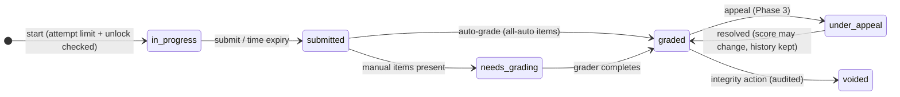

# Assessment and Competency Model

NovaKore assessments go beyond quizzes: auto-graded items, human-graded
evidence, rubric evaluation, sign-offs, and (later) AI-assisted grading —
all producing evidence that can feed competencies and credentials.

## 1. Assessment structure

- `assessments` — draft container: title, purpose, settings (attempt limit,
  passing rule, time limit, randomization, feedback policy).
- `assessment_items` — draft items, **typed + schema-versioned exactly like
  content blocks** (same registry discipline, same migration strategy).
- `assessment_versions` — immutable publish snapshot (settings + frozen item
  array). Attempts pin a version; item edits never mutate past attempts.

Placement: referenced by lesson `quiz` blocks (inline) or path nodes (gate
exams). One authoring model, two placements.

### Item types by phase

| Phase         | Types                                                                                                                                                                                           | Grading                   |
| ------------- | ----------------------------------------------------------------------------------------------------------------------------------------------------------------------------------------------- | ------------------------- |
| 1D            | `multiple_choice`, `multiple_select`, `true_false`                                                                                                                                              | Automatic                 |
| 2             | `matching`, `ordering`, `short_answer` (exact/pattern match + manual fallback), `essay`, `file_submission`                                                                                      | Auto + manual queue       |
| 3             | `video_submission`, `practical_demonstration` (observed checklist), rubric-graded anything, `scenario_performance` (from scenario blocks), AI-assisted evaluation (draft score → human confirm) | Manual/rubric/AI-assisted |
| 4 / on demand | `oral_live_evaluation` (scheduled + observed)                                                                                                                                                   | Manual                    |

## 2. Attempts and grading

- **Attempts/retakes**: per-version settings — max attempts, cooldown
  between attempts, which score counts (best | latest | first).
- **Passing rules**: Phase 1D = score threshold. Phase 2+: per-section
  thresholds, required-item correctness. Passing emits
  `assessment.attempt.passed` — the rules engine's input; the assessment
  engine itself never unlocks content or issues credentials.
- **Time limits**: server-authoritative timestamps; client timer is
  advisory; grace window configurable.
- **Question pools & randomization (Phase 2)**: version-frozen pools; the
  attempt stores the exact item selection + order presented (reproducibility
  and dispute resolution).
- **Feedback policy**: per version — none | pass/fail only | per-item after
  grading | full review. Grader feedback lives on `assessment_responses`.
- **Manual grading (Phase 2)**: grading queue per academy scope; blind
  grading toggle; every score change is audit-logged (who, when, from → to).
- **Rubrics (Phase 3)**: versioned rubric definitions (criteria × levels ×
  points); rubric scores stored per criterion on the response — the same
  rubric machinery serves essays, practicals, and scenario performance.
- **Appeals (Phase 3)**: appeal window per version; appeal creates a review
  task; resolution preserves the original score in history.
- **AI-assisted evaluation (Phase 3)**: AI produces a _draft_ rubric score +
  rationale; a human grader confirms or overrides; the record marks AI
  involvement. AI never finalizes grades (mirrors the AI architecture's
  draft-only principle).

## 3. Integrity (proportionate, not surveillance)

Attempt telemetry (focus loss counts, timing anomalies) recorded as signals
for instructor review — no invasive proctoring in-platform; high-stakes
tenants integrate external proctoring in Phase 4 if validated (risk R-11).

## 4. Competency model (Phase 3)

- `competencies` — tenant-defined: code, title, description, optional
  leveled scale (e.g. novice → expert).
- `competency_relationships` — parent/child (decomposition) + `related`
  edges; a DAG, cycle-checked.
- `competency_requirements` — evidence definitions: pass assessment X (≥
  level), complete course Y, instructor attestation, external credential
  (Phase 4). Multiple requirements compose with and/or (reuses the rules
  condition-tree shape — one grammar, everywhere).
- `learner_competency_records` — attainment with **evidence refs** (attempt
  ids, version-pinned completions, attestor identity), `attained_at`,
  `expires_at`, revocation state.

**Expiration & recertification**: requirements may set validity duration;
expiring records emit events (`competency.expiring`) that rules turn into
remediation assignments; recertification re-satisfies requirements and
writes a new attainment period (history preserved).

## 5. Certificates and credentials

- `certificate_templates` (Phase 1D minimal): layout + org branding tokens +
  field slots (name, credential title, dates, verification code).
- `certificates`: issuance definition — template + criteria source. Phase
  1D: course/path completion. Phase 3: competency attainment.
- `issued_credentials`: immutable snapshot (recipient, data at issuance,
  unique verification code), revocable with reason. Public verification
  endpoint (code → validity + minimal metadata) in Phase 4's external API;
  the uniqueness + snapshot design lands in 1D so nothing needs re-issuing
  later.

## 6. Boundaries

- Assessment engine **emits evidence**; rules engine **decides
  consequences**; credential system **records issuance**. No component
  reaches into another's tables.
- Learner responses are learner PII: visibility requires `assessment.grade`
  (see permission matrix); analytics uses item-level aggregates, not raw
  responses.
