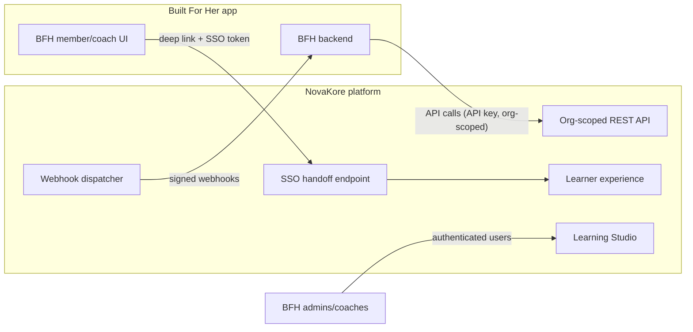

# Built For Her Integration

Built For Her Academy (BFH) is NovaKore's first tenant and proving ground.
This document defines the **future integration contract** and the boundaries
that keep BFH from contaminating the reusable core. **No BFH repository is
modified in this phase, and no production integration exists.**

## 1. Responsibility split (normative)

| NovaKore owns                                              | Built For Her owns                                                            |
| ---------------------------------------------------------- | ----------------------------------------------------------------------------- |
| Learning engine (enrollment, unlock, progress, completion) | Training systems, programs, workouts                                          |
| Content authoring + versioned content                      | Exercise prescriptions and standards                                          |
| Rules, assessments, grading                                | Nutrition planning                                                            |
| Certificates and credentials                               | Readiness scoring                                                             |
| AI education tools (authoring copilot, tutor)              | Coaching relationships and comms                                              |
| Learning analytics                                         | Member subscriptions and billing                                              |
| Tenant config: BFH branding, terminology                   | BFH methodology and source documents (as tenant _content_, not platform code) |

Litmus test: if a capability requires knowing what a workout, exercise,
macro, or readiness score _is_, it belongs on the BFH side. NovaKore sees
only opaque, typed integration primitives.

## 2. Integration architecture

Three channels, all generic platform capabilities:

1. **Org-scoped REST API** (NovaKore Phase 1D minimal): API keys issued per
   `integration_connections` row, scoped to the BFH org, permission-bounded
   (an API key holds a permission subset, same catalog as users).
2. **Webhooks** (Phase 1D): BFH registers `webhook_endpoints`; NovaKore
   delivers signed events (HMAC, timestamped, retried with backoff,
   dead-lettered) from the analytics/domain stream the endpoint subscribes
   to.
3. **SSO handoff + deep links** (Phase 1D): BFH backend requests a
   short-lived signed handoff token for a linked user → member lands
   authenticated at a deep link (`/a/{academy}/paths/{path}` etc.).
   Identity linkage lives in `external_identities`
   (provider = the BFH connection, external_user_id = BFH user id).
   Embedded (iframe/component) delivery is Phase 4; deep-link-first keeps
   Phase 1 honest.

## 3. Capability mapping (every BFH need → generic primitive)

| BFH need                                         | Generic NovaKore primitive                                                                                                                       | Phase                        |
| ------------------------------------------------ | ------------------------------------------------------------------------------------------------------------------------------------------------ | ---------------------------- |
| Shared/linked identity                           | `external_identities` + SSO handoff                                                                                                              | 1D                           |
| BFH access levels gate content                   | **Access-level claims** on the connection (opaque strings, e.g. `tier:gold`) usable in enrollment eligibility + rules (`access_level` condition) | 1D claims; rules use Phase 3 |
| Embedded academy experience                      | Deep links (1D) → embed components (4)                                                                                                           | 1D/4                         |
| Training-phase lesson assignment                 | API enrollment creation (`source: integration`) or Phase 3 rule on external event `training.phase.changed`                                       | 1D API / 3 rules             |
| Workout-linked lessons                           | Deep links from BFH UI to lessons; BFH stores the mapping (workout → lesson URL) on its side                                                     | 1D                           |
| Exercise/standards-linked education              | Same: BFH-side mapping to NovaKore deep links; content itself authored in BFH's academy                                                          | 1D                           |
| Readiness-driven recommendations                 | BFH sends external events (`integration.event.received`, typed payload); Phase 3 rules assign/recommend                                          | 3                            |
| Completion synchronization                       | Webhooks: `learning.course.completed`, `enrollment.learner.completed`                                                                            | 1D                           |
| Certificate synchronization                      | Webhook `credential.certificate.issued` + API fetch of credential record                                                                         | 1D                           |
| Progress summaries for coach UI                  | API: per-learner progress summary endpoint (aggregate, permission-bounded)                                                                       | 1D                           |
| Coach visibility inside NovaKore                 | Coaches are org members with instructor role (academy-scoped); "coach" is terminology overlay                                                    | 1A/1C                        |
| Admin authoring                                  | BFH admins are members with author/admin roles in Learning Studio                                                                                | 1B                           |
| BFH branding                                     | `organization_branding` tokens                                                                                                                   | 1A                           |
| BFH terminology (Coach, Member, Phase, Journey…) | `terminology_overrides`                                                                                                                          | 1A                           |
| BFH methodology & source docs                    | `source_documents` in BFH org's knowledge base (tenant content)                                                                                  | 2                            |

**Nothing in this table required a BFH-specific platform feature.** That is
the contract's central claim, and any future BFH request that breaks it goes
through the generalization test in
[product-domain.md](product-domain.md) §6 before any code is written.

## 4. Contract specifics (to be frozen in Phase 1D)

- **API surface (initial)**: link/unlink identity; create SSO handoff;
  create/withdraw enrollment; read learner progress summary; read issued
  credentials; set access-level claims for a linked user.
- **Inbound events (initial)**: a single generic
  `POST /integrations/{connection}/events` with typed payloads
  (`type`, `external_user_id`, `data`, `idempotency_key`) — stored as
  `integration.event.received`, available to rules in Phase 3.
- **Auth**: API keys (hashed at rest, rotatable, scoped); webhook HMAC
  secrets per endpoint; handoff tokens: short-TTL, single-use, audience-
  bound. Exact token mechanics validated against Supabase Auth capabilities
  at Phase 1D (pre-implementation gate).
- **Versioning**: API is `/v1`, additive-only within v1; webhook payloads
  carry the event envelope `v`.

## 5. Development approach (no production contamination)

- Phase 1D creates a **BFH development tenant** with representative content,
  terminology, and branding — seeded by NovaKore fixtures, not by connecting
  to BFH systems.
- Integration is exercised with a **stub consumer** (test harness simulating
  the BFH backend: receives webhooks, calls the API) living in this repo's
  test fixtures.
- Real BFH-side work (calling these APIs from the BFH app) happens later,
  in the BFH repositories, under that project's own change control — never
  from this repo.

## 6. Anti-contamination rules (enforceable in review)

1. No `bfh`/`builtforher` identifiers in platform code, schema, or event
   types (fixtures/seeds excepted).
2. No platform table gains a column that only BFH would populate; such needs
   become connection-scoped claims or external events.
3. NovaKore never imports from, reads, or writes BFH repositories or
   databases. The only coupling is the versioned public contract above.
4. BFH feature requests enter through the generalization test and, if
   passed, ship as tenant-generic capabilities documented here.
