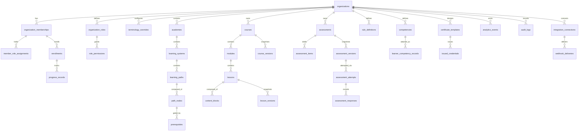
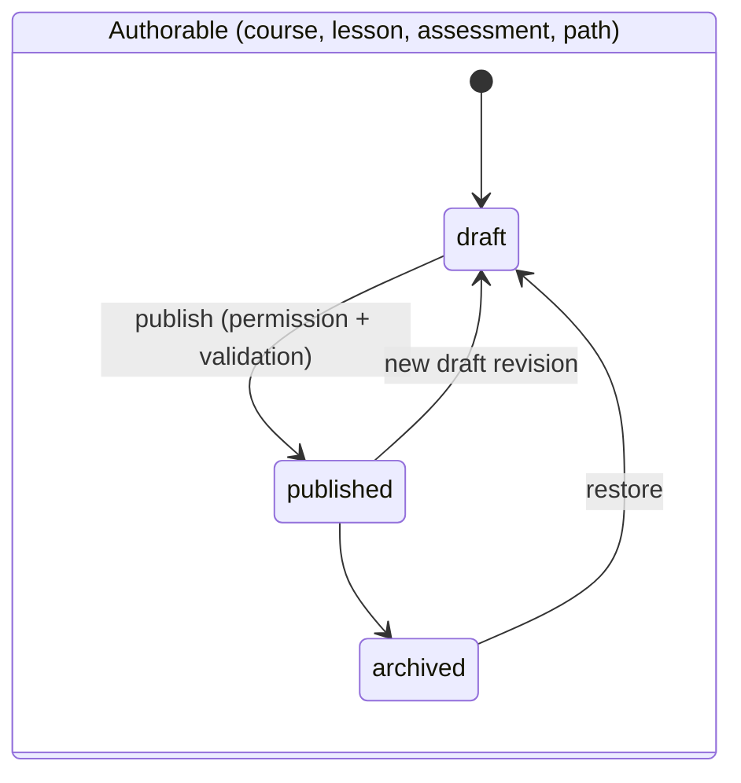
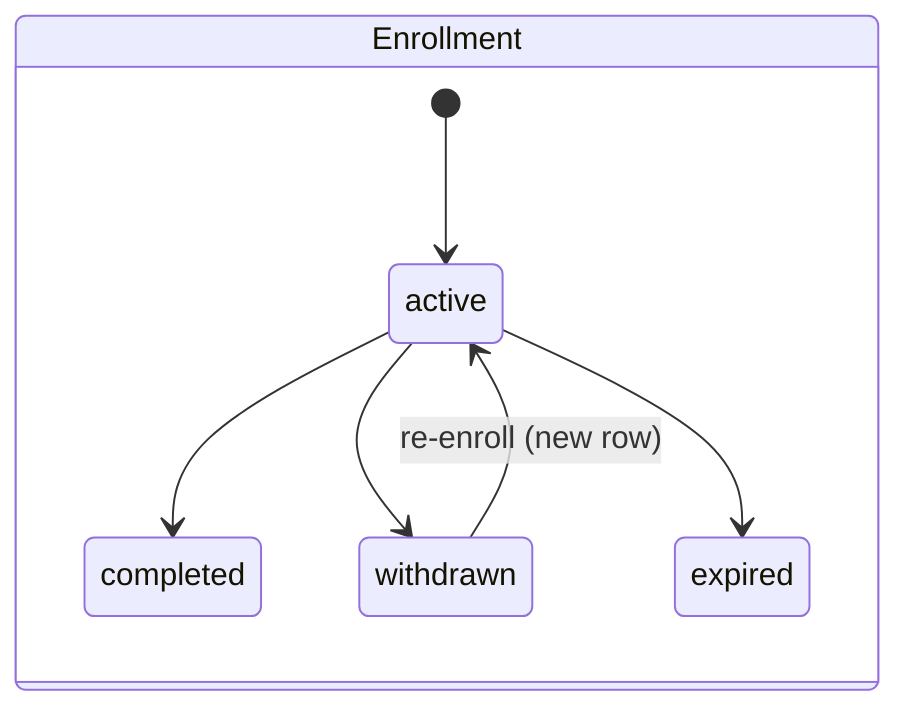

# Entity Model

Canonical entity map for NovaKore. Every entity below was evaluated; several
proposed entities are **explicitly eliminated** as premature abstractions
(§5). Phase assignments align with
[phased-implementation-plan.md](phased-implementation-plan.md).

Conventions (apply to every table unless stated):

- Primary key `id` — UUIDv7 (time-ordered, index-friendly).
- Every tenant-scoped row carries `organization_id` (denormalized where
  derivable) — the RLS anchor. See ADR-006.
- `created_at` / `updated_at` timestamps; `archived_at` for soft-archive.
  Hard deletes are privileged, audited operations.
- "Draft + immutable snapshot" versioning per ADR-007: mutable draft rows,
  publishing writes frozen `*_versions` rows that learners consume.

> **Phase 1A naming reconciliation (owner-approved, 2026-07-28).** The
> implemented table names follow the owner's Phase 1A instruction where it
> differs from this draft: `platform_admins` → `platform_administrators`,
> `role_permissions` → `organization_role_permissions`,
> `member_role_assignments` → `organization_member_roles`,
> `terminology_overrides` → `organization_terminology`. Semantics unchanged.

## 1. Overview diagram

## 2. Entity catalog

Legend — **Scope**: P = platform-global, O = organization, A = academy-scoped
within org. **Ver**: versioning requirement. **Phase**: first implementation
phase.

### 2.1 Identity, tenancy, authorization

| Entity                     | Responsibility                                                                                                                                       | Scope | Lifecycle                                  | Ver                     | Phase |
| -------------------------- | ---------------------------------------------------------------------------------------------------------------------------------------------------- | ----- | ------------------------------------------ | ----------------------- | ----- |
| `organizations`            | The tenant. Root of all isolation.                                                                                                                   | P     | active → suspended → archived              | none                    | 1A    |
| `organization_memberships` | A user's belonging to one org (user_id, org_id, status). A user may belong to many orgs.                                                             | O     | invited → active → suspended → removed     | none                    | 1A    |
| `organization_roles`       | Named permission bundles. System-seeded (owner, org_admin, academy_admin, author, instructor, reviewer, manager, learner, observer) + tenant-custom. | O     | active → archived                          | none                    | 1A    |
| `permissions`              | Platform-defined permission catalog (`content.publish`, …). Tenants cannot invent permissions, only bundle them.                                     | P     | additive-only                              | code-versioned          | 1A    |
| `role_permissions`         | Role → permission grants.                                                                                                                            | O     | n/a (join)                                 | none                    | 1A    |
| `member_role_assignments`  | Membership → role, with optional `academy_id` scope (NULL = org-wide).                                                                               | O/A   | active → revoked                           | none                    | 1A    |
| `platform_admins`          | NovaKore staff operators. Deliberately **not** an organization membership.                                                                           | P     | active → revoked                           | none                    | 1A    |
| `organization_settings`    | Typed key/value config (locale defaults, feature toggles within plan).                                                                               | O     | n/a                                        | schema-versioned values | 1A    |
| `organization_branding`    | Theme tokens: logo refs, accent palette, typography choice, light/dark variants.                                                                     | O     | draft → published (single row, last-write) | none (audited)          | 1A    |
| `terminology_overrides`    | (term_key, singular, plural, short) display overrides per org. Resolution: org → platform default.                                                   | O     | n/a                                        | none (audited)          | 1A    |

### 2.2 Learning structure

| Entity             | Responsibility                                                                                                                 | Scope                       | Lifecycle                    | Ver                                  | Phase |
| ------------------ | ------------------------------------------------------------------------------------------------------------------------------ | --------------------------- | ---------------------------- | ------------------------------------ | ----- |
| `academies`        | Top-level container: audience/brand unit inside an org.                                                                        | O                           | draft → active → archived    | none                                 | 1A    |
| `learning_systems` | Groups paths around a methodology/audience.                                                                                    | A                           | draft → active → archived    | none                                 | 1C    |
| `learning_paths`   | A graph of nodes with prerequisite edges; the unit learners enroll in (besides single courses).                                | A                           | draft → active → archived    | live graph (Phase 2 full versioning) | 1C    |
| `path_nodes`       | Typed node in a path: `course` (1C), later `assessment`, `milestone`, `branch`. Holds position/layout metadata for the canvas. | A                           | follows path                 | with path                            | 1C    |
| `prerequisites`    | Simple completion edges between path nodes (`node_id`, `requires_node_id`). The Phase 1 subset of the rules engine.            | A                           | follows path                 | with path                            | 1C    |
| `courses`          | Draft container of modules/lessons + metadata.                                                                                 | O (assignable to academies) | draft → published → archived | `course_versions`                    | 1B    |
| `course_versions`  | Immutable snapshot: metadata + ordered module/lesson structure pinned to `lesson_version` ids.                                 | O                           | immutable                    | is the version                       | 1B    |
| `modules`          | Ordered structural grouping of lessons inside a course draft.                                                                  | O                           | follows course               | frozen inside `course_versions`      | 1B    |
| `lessons`          | Draft container of ordered content blocks.                                                                                     | O                           | draft → published → archived | `lesson_versions`                    | 1B    |
| `lesson_versions`  | Immutable snapshot: lesson metadata + frozen, schema-validated block array. What learners render.                              | O                           | immutable                    | is the version                       | 1B    |
| `content_blocks`   | Mutable draft blocks within a lesson (type, schema_version, data JSONB, position).                                             | O                           | follows lesson               | frozen inside `lesson_versions`      | 1B    |

### 2.3 Enrollment and progress

| Entity             | Responsibility                                                                                                                                                                                                                                   | Scope | Lifecycle                                | Ver                      | Phase |
| ------------------ | ------------------------------------------------------------------------------------------------------------------------------------------------------------------------------------------------------------------------------------------------ | ----- | ---------------------------------------- | ------------------------ | ----- |
| `enrollments`      | Membership ↔ target (`learning_path` or `course`, typed target). Course targets pin the published version at creation (ADR-017). Source: self, assigned (rule/integration sources arrive with their phases). RPC-only writes.                    | O     | active → completed → withdrawn → expired | pins `course_version_id` | 1C    |
| `progress_records` | Evidence per (enrollment, subject), subject ∈ {course, lesson}; absent row = not started. Lesson rows pin `lesson_version_id` + `course_version_id`; course rows pin `course_version_id`. `exempted` records audited overrides. RPC-only writes. | O     | in_progress → completed / exempted       | pins version ids         | 1C    |
| `cohorts`          | Named learner groups (intake waves, departments) usable in rules and assignment.                                                                                                                                                                 | O/A   | active → archived                        | none                     | 2     |

### 2.4 Rules

| Entity             | Responsibility                                                                          | Scope | Lifecycle                            | Ver                                        | Phase                  |
| ------------------ | --------------------------------------------------------------------------------------- | ----- | ------------------------------------ | ------------------------------------------ | ---------------------- |
| `rule_definitions` | Versioned condition tree + outcomes attached to a scope (path, course, org).            | O     | draft → active → disabled → archived | integer `version`, prior versions retained | 3 (schema reserved 1C) |
| `rule_evaluations` | Append-only evaluation log: trigger, inputs, decision, outcomes fired, idempotency key. | O     | immutable                            | n/a                                        | 3                      |

### 2.5 Assessment and competency

| Entity                       | Responsibility                                                                                                                        | Scope | Lifecycle                                                                   | Ver                         | Phase |
| ---------------------------- | ------------------------------------------------------------------------------------------------------------------------------------- | ----- | --------------------------------------------------------------------------- | --------------------------- | ----- |
| `assessments`                | Draft container: title, type, bounded settings (passing %, time limit, retake policy) + items.                                        | O     | draft → published → archived                                                | `assessment_versions`       | 1D ✅ |
| `assessment_items`           | Mutable draft questions (6 typed, registry-validated item types).                                                                     | O     | follows assessment                                                          | frozen inside versions      | 1D ✅ |
| `assessment_versions`        | Immutable snapshot: settings + frozen item array. Attempts pin to this. Learner reads only via the answer-stripped RPC.               | O     | immutable                                                                   | is the version              | 1D ✅ |
| `assessment_assignments`     | Pins an exact published version to a lesson; required flag + completion effect + availability window (ADR-019). RPC-only writes.      | O     | active → archived                                                           | pins version                | 1D ✅ |
| `assessment_attempts`        | One learner attempt: exact version pin, threshold/time snapshots, server-graded scores. RPC-only writes.                              | O     | started → submitted → pending_review → passed/failed (or abandoned/expired) | pins version                | 1D ✅ |
| `assessment_responses`       | Per (attempt, item) response + objective grade + reviewer points/feedback; never stores answer keys. Locked after submission.         | O     | follows attempt                                                             | n/a                         | 1D ✅ |
| `assessment_reviews`         | One review record per attempt: claim, decision, overall feedback (per-item feedback lives on responses — no separate feedback table). | O     | pending_review → in_review → completed                                      | n/a                         | 1D ✅ |
| `competencies`               | Tenant-defined competency (code, title, description, levels).                                                                         | O     | draft → active → archived                                                   | Phase 3 versioning decision | 3     |
| `competency_relationships`   | Parent/child + related edges forming the competency graph.                                                                            | O     | follows competencies                                                        | with graph                  | 3     |
| `competency_requirements`    | What counts as evidence: assessment pass, course completion, instructor attestation.                                                  | O     | follows competencies                                                        | versioned with source       | 3     |
| `learner_competency_records` | Attainment: evidence refs, attained_at, expires_at, revoked.                                                                          | O     | attained → expiring → expired → revoked                                     | pins evidence versions      | 3     |

### 2.6 Credentials

| Entity                  | Responsibility                                                                                                                                                                                          | Scope | Lifecycle                         | Ver                | Phase |
| ----------------------- | ------------------------------------------------------------------------------------------------------------------------------------------------------------------------------------------------------- | ----- | --------------------------------- | ------------------ | ----- |
| `certificate_templates` | Constrained plain-text template schema rendered through org theme tokens (no design canvas).                                                                                                            | O     | draft → active → archived         | `schema_version`   | 1D ✅ |
| `certificates`          | Issuance rule: template + ONE explicit source (course / path / assessment assignment; no polymorphic column). One active rule per source.                                                               | O     | active → archived                 | with template      | 1D ✅ |
| `issued_credentials`    | Immutable evidence: recipient + template snapshots, evidence pins (enrollment/version/attempt), unique public verification code (`NVK-…`), revocation state. Field-protection trigger; RPC-only writes. | O     | active → expired (lazy) / revoked | immutable snapshot | 1D ✅ |

### 2.7 Collaboration and review

| Entity        | Responsibility                                                                 | Scope | Lifecycle                                  | Ver                     | Phase                               |
| ------------- | ------------------------------------------------------------------------------ | ----- | ------------------------------------------ | ----------------------- | ----------------------------------- |
| `comments`    | Threaded comments on draft content for review workflow.                        | O     | open → resolved                            | none                    | 2                                   |
| `approvals`   | Requested sign-offs (publish review, manager approval outcomes).               | O     | requested → approved/rejected → expired    | none                    | 2 (publish review), 3 (rule-driven) |
| `submissions` | Learner file/text submissions for assignment-type blocks and assessment items. | O     | submitted → under_review → graded/returned | pins block/item version | 2                                   |

### 2.8 AI

| Entity                  | Responsibility                                                                                                         | Scope | Lifecycle                       | Ver                        | Phase |
| ----------------------- | ---------------------------------------------------------------------------------------------------------------------- | ----- | ------------------------------- | -------------------------- | ----- |
| `ai_generation_records` | Every authoring generation: template+version, model, params, input refs, output artifact, token/cost, reviewer action. | O     | generated → accepted/discarded  | prompt templates versioned | 2     |
| `ai_conversations`      | Learner tutor / roleplay sessions bound to context (lesson, path).                                                     | O     | active → closed                 | none                       | 3     |
| `ai_messages`           | Messages within a conversation incl. citations and safety flags.                                                       | O     | immutable                       | n/a                        | 3     |
| `source_documents`      | Tenant knowledge base: uploaded docs, extraction status, chunk/embedding refs.                                         | O     | uploaded → processed → archived | content-hash versioned     | 2     |

### 2.9 Media (Phase 1B — D-07 resolved)

| Entity         | Responsibility                                                                                                                                                                                                                                                | Scope                                     | Lifecycle                                       | Ver                | Phase |
| -------------- | ------------------------------------------------------------------------------------------------------------------------------------------------------------------------------------------------------------------------------------------------------------- | ----------------------------------------- | ----------------------------------------------- | ------------------ | ----- |
| `media_assets` | Metadata of record for stored binaries (branding now, content images 1C): kind, bucket/path, MIME, size, dimensions, alt text, checksum, ownership. Active-per-slot enforced by partial unique index; replacement retains history via `replaced_by_asset_id`. | O (nullable org only for platform assets) | pending → active → replaced / archived / failed | history-preserving | 1B    |

### 2.9b Telemetry and integration

| Entity                    | Responsibility                                                                                                                                                                          | Scope | Lifecycle                                               | Ver                     | Phase                           |
| ------------------------- | --------------------------------------------------------------------------------------------------------------------------------------------------------------------------------------- | ----- | ------------------------------------------------------- | ----------------------- | ------------------------------- |
| `analytics_events`        | Append-only learning telemetry (see [analytics-and-events.md](analytics-and-events.md)).                                                                                                | O     | immutable                                               | envelope `v` field      | 1C (foundation), taxonomy grows |
| `outbox_events`           | Transactional outbox for async fan-out; written only by `app.emit_event` in the caller's transaction; zero tenant access ([transactional-outbox.md](transactional-outbox.md), ADR-018). | P     | pending → processed / dead_letter                       | payload envelope `v`    | 1C (worker deferred)            |
| `audit_logs`              | Append-only security/admin audit: authz changes, publishes, impersonation, exports. Separate from analytics.                                                                            | O + P | immutable                                               | envelope `v` field      | 1A                              |
| `integration_connections` | A tenant's configured external connection: type, credentials ref, scopes, status.                                                                                                       | O     | pending → active → revoked                              | config schema-versioned | 1D                              |
| `webhook_endpoints`       | Tenant-registered delivery targets + secret + subscribed event types. `integrations.manage`.                                                                                            | O     | active → paused → revoked                               | none                    | 1D schema / 2 as-built ✅       |
| `webhook_deliveries`      | Per (endpoint, outbox event) delivery: status, attempt_count, backoff, redacted response excerpt. Claimed by the worker with SKIP LOCKED (ADR-025). RPC/worker-only writes.             | O     | pending → delivering → delivered / failed → dead_letter | n/a                     | 2 ✅                            |
| `external_identities`     | Link between a NovaKore user and an external system identity (provider, external_id) enabling SSO handoff.                                                                              | O     | linked → revoked                                        | none                    | 1D (deferred)                   |

### 2.10 Studio (Phase 2)

| Entity                        | Responsibility                                                                                                                                                                                      | Scope     | Lifecycle                                       | Ver                           | Phase                  |
| ----------------------------- | --------------------------------------------------------------------------------------------------------------------------------------------------------------------------------------------------- | --------- | ----------------------------------------------- | ----------------------------- | ---------------------- |
| `reusable_blocks`             | Org content library: reusable validated blocks, optional academy scope, tags, link-or-copy into lessons (ADR-021). `content_blocks.source_reusable_block_id` links copies.                          | O (opt A) | active → archived                               | monotonic `version` (trigger) | 2 ✅                   |
| `source_documents`            | Governed AI source material: text/markdown inline or file in the private bucket; hash, review state, provenance; PDF auto-extraction deferred (ADR — source-document-model).                        | O         | pending → ready → archived                      | content-hash                  | 2 ✅                   |
| `ai_budgets`                  | Per-org monthly AI cap in integer cents, CHECK-capped at the platform ceiling (5000 = $50). `ai.budget.manage` (ADR-024).                                                                           | O         | mutable                                         | n/a                           | 2 ✅                   |
| `ai_generations`              | Governed generation ledger: provider, model profile, operation, objective, sources, tokens, reserved/actual cents, output, status (reserve→complete/fail→accept/reject). RPC-only writes (ADR-023). | O         | reserved → completed/failed → accepted/rejected | n/a                           | 2 ✅                   |
| `review_requests`             | Draft review workflow: one open per subject; requester ≠ decider enforced (ADR — studio-review). RPC-only writes.                                                                                   | O         | open → approved / changes_requested → closed    | n/a                           | 2 ✅                   |
| `review_comments`             | Threaded comments on a review request.                                                                                                                                                              | O         | open → resolved                                 | n/a                           | 2 ✅                   |
| `path_layouts`                | Visual canvas coordinates, separate from semantic path order (presentation only, ADR-020). `paths.manage`.                                                                                          | O         | mutable                                         | schema `v`                    | 2 ✅                   |
| `assessment_submission_files` | Metadata for learner file submissions in the private `assessment-submissions` bucket, anchored to org/attempt/response/uploader. RPC-registered.                                                    | O         | pending → active → archived                     | n/a                           | 2 (upload UI deferred) |

## 3. Key relationship decisions

1. **Courses belong to organizations, not academies.** A course is reusable
   across academies within the org; academies reference courses through
   learning paths (and a direct academy↔course listing table if catalog
   browsing needs it in Phase 2). Prevents duplicating content per academy.
2. **Assessments are standalone**, referenced by (a) lesson blocks of type
   `quiz`/`knowledge_check` for inline use and (b) path nodes for gate exams.
   One authoring model, two placements.
3. **Enrollment targets are typed** (`target_type` ∈ {learning_path, course}
   with a CHECK constraint), not a polymorphic free-for-all.
4. **Progress is current-state; analytics events are history.** No event
   sourcing of progress in Phase 1 — `analytics_events` carries the history,
   `progress_records` carries the queryable now.
5. **Structure versions pin content versions.** `course_versions` reference
   specific `lesson_version` ids; an enrollment's completion evidence records
   exactly what the learner saw.

## 4. Lifecycle state machines (normative)

## 5. Eliminated premature abstractions

| Proposed entity                       | Verdict                                  | Reason                                                                                                                                                                                                                                      |
| ------------------------------------- | ---------------------------------------- | ------------------------------------------------------------------------------------------------------------------------------------------------------------------------------------------------------------------------------------------- |
| `module_versions`                     | **Eliminated**                           | Modules are pure structure; structure is frozen inside `course_versions`. A separate version table doubles write paths for zero query value.                                                                                                |
| `content_block_versions` (as a table) | **Deferred to Phase 2, different shape** | Draft blocks are rows; published blocks are frozen _inside_ `lesson_versions`. A standalone block-version table returns only when the **reusable block library** ships (Phase 2), where shared blocks need independent identity/versioning. |
| `completion_records`                  | **Eliminated**                           | Completion = `progress_records.status = completed` (+ pinned version + timestamp) plus an immutable `learning.lesson.completed` analytics event. A third table would hold duplicate truth.                                                  |
| `learning_relationships` (generic)    | **Eliminated**                           | A generic "anything relates to anything" table is an unqueryable dumping ground. Concrete relations exist instead: `prerequisites`, `path_nodes`, `competency_relationships`.                                                               |
| `assignments` (as entity)             | **Merged**                               | "Assigned learning" = an `enrollments` row with `source = assigned`. Assignment-type content blocks use `submissions`. No third concept needed.                                                                                             |
| `annotations`                         | **Deferred (Phase 3+)**                  | Learner highlights/notes are valuable but zero-dependency; nothing else builds on them. Revisit with saved resources.                                                                                                                       |
| `organization_settings` as free JSON  | **Constrained**                          | Exists, but every key is registered in a typed, schema-versioned catalog — no unvalidated dumping ground (mirrors ADR-008).                                                                                                                 |
| Per-academy terminology               | **Deferred**                             | Org-level overrides only in Phase 1A; academy overrides added later only if a real tenant needs two vocabularies in one org (open decision R-13).                                                                                           |
| `rule_definitions` in Phase 1         | **Deferred to Phase 3**                  | Phase 1C ships only the `prerequisites` table (completion edges). The rules engine schema is designed now (see [rules-engine.md](rules-engine.md)) so prerequisites migrate cleanly into it, but the evaluator is not built early.          |

## 6. Open items

- ~~Media/file storage entity (`media_assets`) is implied by image/video/pdf~~ **Resolved in Phase 1B** (ADR-015, §2.9); originally noted as implied by image/video/pdf
  blocks and branding logos; its design lands with Supabase Storage decision
  (pre-Supabase decision list, [risks-and-open-decisions.md](risks-and-open-decisions.md)).
- Cross-org content sharing/marketplace is explicitly out of scope (Phase 4+,
  only if validated).
