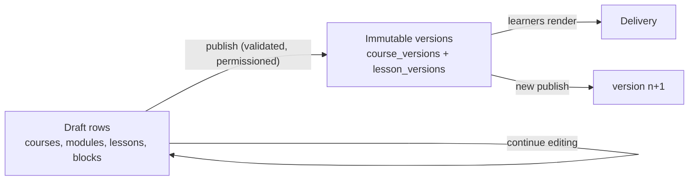

# Learning Content Model

## 1. Authoring model

Lessons are **continuous document canvases** composed of ordered, typed
content blocks — not stacks of modal dialogs. Authors write in one flow;
blocks are inserted, reordered, and edited inline. (UI mechanics in
[ui-architecture.md](ui-architecture.md); this document defines the data
model that makes that UI possible.)

```
Course (draft) ─ Modules (ordered) ─ Lessons (ordered) ─ Content blocks (ordered)
      │                                    │
      └── publish ⇒ course_version         └── publish ⇒ lesson_version
          (structure, pins lesson_versions)     (frozen validated block array)
```

## 2. Block schema strategy (ADR-008)

Every block is a **discriminated union member** with a **versioned schema**:

```ts
{
  id: string;            // stable block identity across edits
  type: BlockType;       // discriminant, e.g. "rich_text"
  schemaVersion: number; // schema version *for that type*
  data: <validated per (type, schemaVersion)>;
  meta?: { note?: string } // author-only annotations, never rendered
}
```

Rules:

- **No unvalidated JSON.** Every `(type, schemaVersion)` pair has a Zod
  schema in the platform **schema registry** (`@novakore/domain`). Writes
  that fail validation are rejected at the API layer; publishes re-validate
  every block. The database CHECKs `type` against the known list; deep
  validation lives in the registry (single source of truth, testable).
- **Schema evolution is additive per version.** Changing a block type's shape
  means adding `schemaVersion: n+1` with a **pure migration function**
  `migrate(n → n+1)` registered alongside it. Draft blocks are migrated
  lazily on edit (author sees current schema); published `lesson_versions`
  are **never rewritten** — renderers keep read support for all published
  schema versions of a type (renderer-side adapters), which is cheap because
  versions are additive and rare.
- **Unknown types degrade safely.** The learner renderer renders a neutral
  "content unavailable" block and emits a telemetry event rather than
  crashing — protects old clients during rollout.

## 3. Block type catalog

Phased deliberately — each type costs schema + editor + renderer + tests.

| Phase                                | Types                                                                                                                                                                    |
| ------------------------------------ | ------------------------------------------------------------------------------------------------------------------------------------------------------------------------ |
| **1B (core seven)**                  | `rich_text`, `heading`, `image`, `video` (URL/embed), `callout`, `divider`, `knowledge_check` (inline single-question)                                                   |
| **1D**                               | `quiz` (references an assessment), `file_download`, `pdf`                                                                                                                |
| **2 (engagement + authoring depth)** | `audio`, `quote`, `accordion`, `tabs`, `timeline`, `comparison`, `flashcards`, `checklist`, `reflection`, `survey`, `assignment` + `file_submission`, `embed`, `diagram` |
| **3 (adaptive + AI + workflow)**     | `scenario`, `branching_scenario`, `decision_tree`, `ai_conversation`, `ai_roleplay`, `instructor_feedback`, `manager_approval`, `action_step`                            |
| **4 / on demand**                    | `live_session`, `external_tool` (LTI-ish — only with a real integration driver)                                                                                          |

`knowledge_check` is a lightweight inline item (self-check, ungraded);
`quiz` delegates to the assessment engine (graded, attempt-tracked). Keeping
these distinct prevents the assessment engine from bloating into the content
path or vice versa.

## 4. Ordering, nesting, reuse

- **Ordering**: blocks hold fractional-index `position` keys (string-ordered,
  e.g. Figma-style) so inserts/moves never rewrite sibling rows and
  concurrent author edits merge cleanly.
- **Nesting**: exactly **one level** of structural nesting via container
  blocks (`accordion`, `tabs`, `comparison`) whose children are block arrays
  of _non-container_ types. Arbitrary recursion is rejected by schema — it
  wrecks editors, renderers, and analytics granularity for negligible
  authoring value.
- **Reusable blocks / shared content (Phase 2)**: a **block library** —
  `library_blocks` with their own versions; lessons embed a _reference_ with
  pin-or-float choice. Published lesson versions always freeze a resolved
  copy (learners never depend on library mutation). Until Phase 2, reuse =
  duplication.
- **Duplication**: courses, modules, lessons, and blocks are duplicable
  (deep-copy with fresh ids, media refs shared). This is Phase 1B's honest
  answer to reuse.

## 5. Draft / publish workflow (ADR-007)



- Publishing a **lesson** freezes its validated block array into a
  `lesson_version` (monotonic `version_number`).
- Publishing a **course** freezes structure + pins each lesson's chosen
  `lesson_version` into a `course_version`. Publishing a course implicitly
  publishes dirty lessons (one action, atomic transaction).
- **Delivery policy (Phase 1)**: enrollments _float to the latest published
  course_version_; `progress_records` pin the exact `lesson_version`
  completed (evidence). Per-enrollment version pinning (compliance mode) is
  a Phase 3 option recorded in risks (R-04) — the schema already supports it
  because versions are immutable.
- **Revisions**: prior versions are retained and diffable (structure diff +
  block-level diff), enabling "what changed since v3" and version-performance
  analytics (Phase 3).
- **Scheduled publication (Phase 2)**: `publish_at` on the draft; a scheduled
  job performs the same validated publish path — no second code path.
- **Archiving**: hides from catalogs/new enrollment; active enrollments
  finish on their pinned/last version. Un-archive restores.

## 6. Localization readiness (not implementation)

- All author-facing strings live in block `data`, never in code.
- `lessons`/`courses` carry `locale` (default org locale) now.
- Translation model (per-locale lesson variants vs. per-block translation
  overlays) is deliberately deferred — recorded as open decision R-14. The
  block model is compatible with both; choosing now would be speculation.
- UI chrome strings use the terminology overlay + standard i18n catalogs.

## 7. Accessibility requirements (normative for every block)

- Every block schema **must** include the fields accessibility needs:
  `image.alt` (required, may be explicitly marked decorative), `video`
  caption/transcript refs, `audio` transcript ref, heading levels validated
  to preserve document outline (no skipped levels).
- Renderers: semantic HTML, keyboard operability, visible focus, WCAG 2.2 AA
  contrast in both themes, motion behind `prefers-reduced-motion`.
- The publish validation surfaces accessibility errors (missing alt) as
  blocking, warnings (missing transcript) as visible debt.

## 8. Rendering and theming

- Learner delivery renders from `lesson_versions` via Server Components by
  default; interactive blocks (knowledge checks, scenarios, AI blocks)
  hydrate as client islands.
- **Tenant theme application**: block renderers consume design tokens (CSS
  custom properties) resolved from `organization_branding` — accent palette,
  typography choice, radius/surface tokens — over the platform's light/dark
  base themes. Blocks never hardcode brand values; tenants restyle without
  re-authoring.
- Responsive by construction: single-column canvas, container-query-based
  block layouts for wide blocks (comparison, timeline).

## 9. Media strategy (pre-Supabase decision)

Image/video/audio/pdf blocks and branding assets require object storage
(planned: Supabase Storage buckets, org-prefixed paths, signed URLs, RLS on
bucket policies). Upload pipeline, size/type limits, and a `media_assets`
table (ownership, usage refs, alt-text defaults) are specified when Supabase
is introduced — listed in the pre-Supabase decision gate. Video at scale
remains embed/external-URL first (no transcoding pipeline in Phase 1–2).
