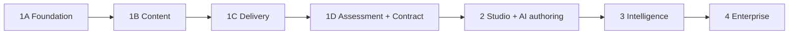

# Phased Implementation Plan

Controlled phases with explicit gates. **No phase begins until the previous
phase's exit criteria pass and the owner approves.** Every phase ends with
`npm run verify` green, migrations reversible, and documentation current.

Common security gates (every phase): all new tables have RLS + isolation
tests; all mutations server-authorized (`can()`); no service-role usage
outside named internal operations; audit events for authz-relevant actions;
no secrets client-side.

## Phase 1A — Database and domain foundation

|                   |                                                                                                                                                                                                                                                                                                                                                                                                                                                                                                                    |
| ----------------- | ------------------------------------------------------------------------------------------------------------------------------------------------------------------------------------------------------------------------------------------------------------------------------------------------------------------------------------------------------------------------------------------------------------------------------------------------------------------------------------------------------------------ |
| **Scope**         | Supabase (dev project) + migration tooling; `organizations`, `organization_memberships`, `platform_admins`, `permissions`, `organization_roles`, `role_permissions`, `member_role_assignments`, `organization_settings`, `organization_branding`, `terminology_overrides`, `academies`, `audit_logs`. Auth (Supabase Auth) wired for dev. Minimal admin UI: org creation (platform), member invite, role assignment, terminology editor, branding basics, academy CRUD. Token-based theming skeleton (light+dark). |
| **Dependencies**  | Pre-Supabase decisions resolved (see risks doc); owner approval of this plan.                                                                                                                                                                                                                                                                                                                                                                                                                                      |
| **DB changes**    | Initial migration set; RLS policies + helper functions (`app.member_org_ids()`, `app.has_permission()`); seed: permission catalog, system roles, platform terminology defaults.                                                                                                                                                                                                                                                                                                                                    |
| **UI surfaces**   | Auth flow (dev), org dashboard shell, org settings (terminology, roles, branding minimal), academy list.                                                                                                                                                                                                                                                                                                                                                                                                           |
| **Tests**         | RLS isolation suite (cross-org read/write attempts fail, per table); `can()` unit matrix vs permission table; terminology resolution; migration up/down.                                                                                                                                                                                                                                                                                                                                                           |
| **Exit criteria** | Two seeded orgs demonstrably isolated (automated proof); role assignment changes take effect without re-login; verify green; security gates pass.                                                                                                                                                                                                                                                                                                                                                                  |
| **Deferred**      | All content entities; enrollment; any AI; any BFH contract work; email delivery (invites can be link-based in dev).                                                                                                                                                                                                                                                                                                                                                                                                |

## Phase 1B — Content authoring core

|                   |                                                                                                                                                                                                                                                                                           |
| ----------------- | ----------------------------------------------------------------------------------------------------------------------------------------------------------------------------------------------------------------------------------------------------------------------------------------- |
| **Scope**         | `courses`, `modules`, `lessons`, `content_blocks`, `course_versions`, `lesson_versions`; schema registry live (`@novakore/domain` grows to real use); core seven block types (editor + renderer); draft→publish workflow; duplication; media upload minimal (image) per storage decision. |
| **Dependencies**  | 1A complete.                                                                                                                                                                                                                                                                              |
| **DB changes**    | Content tables + versions; publish transaction (function or server-side tx); `media_assets` minimal.                                                                                                                                                                                      |
| **UI surfaces**   | Learning Studio (course list, course builder, lesson editor as continuous canvas w/ core blocks), publish bar + validation surface, lesson preview (both themes).                                                                                                                         |
| **Tests**         | Block schema validation (accept/reject fixtures per type); publish snapshot immutability; version pinning; migration function pattern (one synthetic v1→v2 migration proven); renderer accessibility smoke (headings/alt enforcement).                                                    |
| **Exit criteria** | Author can build and publish a multi-module course with all seven block types; published version renders identically after further draft edits; verify green.                                                                                                                             |
| **Deferred**      | Paths/enrollment; assessments beyond inline `knowledge_check`; block library; scheduled publish; AI.                                                                                                                                                                                      |

## Phase 1C — Learning delivery

|                   |                                                                                                                                                                                                                                                                                                           |
| ----------------- | --------------------------------------------------------------------------------------------------------------------------------------------------------------------------------------------------------------------------------------------------------------------------------------------------------- |
| **Scope**         | `learning_systems`, `learning_paths`, `path_nodes` (course nodes), `prerequisites` (+ cycle check), `enrollments`, `progress_records`; unlock computation; learner surfaces; analytics foundation (`analytics_events` table, envelope, Phase 1 event set, transactional outbox for authoritative events). |
| **Dependencies**  | 1B complete.                                                                                                                                                                                                                                                                                              |
| **DB changes**    | Above tables; events table with partitioning; outbox.                                                                                                                                                                                                                                                     |
| **UI surfaces**   | Learner home, path map (simple), course experience, lesson player with progress, own-progress page; admin: path editing (list + simple canvas), enrollment management, basic analytics (enrollment/completion per course version).                                                                        |
| **Tests**         | Unlock logic matrix (prereq permutations); progress transitions; enrollment lifecycle; event emission on completion (outbox verified); learner cannot read locked/draft content (authorization tests, not UI hiding).                                                                                     |
| **Exit criteria** | A learner completes a two-course path with prerequisites end-to-end; events queryable; drop-off between lessons visible in basic analytics; verify green.                                                                                                                                                 |
| **Deferred**      | Rules engine proper; cohorts; notifications; assessments as gates.                                                                                                                                                                                                                                        |

## Phase 1D — Assessment, credentials, integration contract

|                   |                                                                                                                                                                                                                                                                                                                                                                                                                                                                                                                                                                                     |
| ----------------- | ----------------------------------------------------------------------------------------------------------------------------------------------------------------------------------------------------------------------------------------------------------------------------------------------------------------------------------------------------------------------------------------------------------------------------------------------------------------------------------------------------------------------------------------------------------------------------------- |
| **Scope**         | Assessments (3 auto-graded item types, versions, attempts, passing rules), `quiz` + `file_download` + `pdf` blocks; minimal certificates (`certificate_templates`, `certificates`, `issued_credentials` with verification codes); integration primitives: `integration_connections`, API keys, `/v1` API (identity link, SSO handoff, enrollment, progress summary, credentials), `webhook_endpoints` + `webhook_deliveries` (signed, retried), `external_identities`, access-level claims; **BFH development tenant** seeded with representative fixtures + stub consumer harness. |
| **Dependencies**  | 1C complete.                                                                                                                                                                                                                                                                                                                                                                                                                                                                                                                                                                        |
| **DB changes**    | Assessment tables; credential tables; integration tables (hashed keys, HMAC secrets).                                                                                                                                                                                                                                                                                                                                                                                                                                                                                               |
| **UI surfaces**   | Assessment builder; attempt player + results; credentials page; org integrations settings (connections, webhooks, keys).                                                                                                                                                                                                                                                                                                                                                                                                                                                            |
| **Tests**         | Grading correctness per item type; attempt limits/timing (server-authoritative); credential uniqueness + snapshot immutability; API auth/scope tests; webhook signature + retry + dead-letter; SSO handoff token single-use/expiry; **full BFH-simulation integration test** via stub consumer.                                                                                                                                                                                                                                                                                     |
| **Exit criteria** | BFH dev tenant: learner passes a gated assessment, receives certificate, stub consumer observes completion + credential webhooks and reads progress via API; verify green. **Phase 1 review with owner.**                                                                                                                                                                                                                                                                                                                                                                           |
| **Deferred**      | Manual grading; question pools; embedded delivery; production BFH connection (separate go-live decision owned by the owner, outside this plan).                                                                                                                                                                                                                                                                                                                                                                                                                                     |

## Phase 2 — Studio experience and AI authoring

**Scope**: full Learning Studio UX (command palette, contextual panels,
polished canvas), visual path builder, engagement block set (audio, quote,
accordion, tabs, timeline, comparison, flashcards, checklist, reflection,
survey, assignment + `submissions`, embed, diagram), block library
(reusable blocks + `content_block_versions` in library form), scheduled
publish, review workflow (`comments`, publish `approvals`), notifications
(in-app), manual grading queue + short_answer/essay/matching/ordering/file
items, `cohorts`, AI authoring copilot (provider abstraction, templates,
generation records, budgets, evals), `source_documents` pipeline.
**Security gates add**: AI cost caps enforced + tested; generation records
complete; draft-only AI verified by test.
**Exit**: author builds a course end-to-end with AI assistance where every
AI artifact required explicit human acceptance; grading queue operates;
verify green.
**Deferred**: learner AI; competencies; advanced rules.

## Phase 3 — Intelligence

**Scope**: rules engine (evaluator, `rule_definitions`, `rule_evaluations`,
Phase 3 condition/outcome sets, prerequisite migration, dry-run + explain
UI), competency model (all four tables + map UI + expiry/recert), learner AI
tutor + roleplay (grounded retrieval, citations, escalation), AI-assisted
grading (draft-only), adaptive review, analytics depth (aggregates, funnels,
version comparison, item difficulty, drop-off maps, small-cohort
suppression), scenario/branching blocks, `instructor_feedback` +
`manager_approval` blocks, appeals.
**Security gates add**: retrieval isolation tests (cross-org embedding
queries impossible); tutor cannot mutate state (capability test);
rule-loop guards tested.
**Exit**: adaptive path driven by rules + competency evidence works for the
BFH dev tenant; tutor answers lesson-grounded questions with citations and
refuses ungrounded methodology claims (eval suite proves it); verify green.

## Phase 4 — Enterprise and ecosystem

**Scope (each item gated on validated demand)**: external API expansion +
credential public verification endpoint; embedded delivery components;
white-label domains; data export/warehouse streaming; enterprise SSO
(SAML/OIDC); residency/BAA-class options; external proctoring integration;
HRIS connectors; marketplace/commerce **only if validated** (default: no).
**Exit**: per-item; each ships behind its own ADR.

## Sequence dependencies

## Standing rules

- Anything not listed in a phase's scope is deferred by default.
- Scope additions mid-phase require owner approval + this document updated.
- Production BFH connection, paid AI providers, and production Supabase each
  require a separate explicit owner go decision regardless of phase status.
