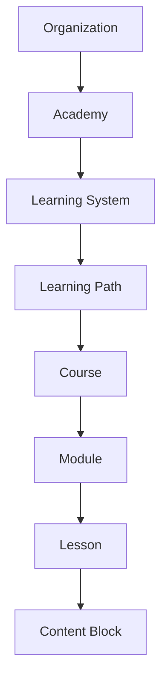

# Product Domain

## 1. What NovaKore is

NovaKore is an **AI-native, modular learning operating system**. Organizations
use it to design, operate, adapt, and measure their own learning systems using
their own terminology, methodology, roles, standards, competencies, and
progression requirements.

It is _not_ a conventional LMS. A conventional LMS ships one opinionated course
structure and asks every organization to bend to it. NovaKore ships a stable
**canonical entity model** plus an organization-owned **configuration layer**
(terminology, branding, roles, rules, competency frameworks), so each tenant
models its learning system instead of renting someone else's.

### Canonical hierarchy

Canonical names are **permanent identifiers** in code, database, APIs, and
events. Display terminology is a per-organization overlay (see
[tenancy-and-authorization.md](tenancy-and-authorization.md) §6 and ADR-003).
"Learning Path" may render as _Journey_, "Course" as _Program_, "Instructor" as
_Coach_ — the entities beneath never change.

## 2. Ownership map

### NovaKore (platform) owns

- The canonical entity model and its migrations
- The learning engine: enrollment, unlock/progress/completion mechanics
- The content-block type system and versioning machinery
- The rules engine (evaluation, audit, idempotency)
- The assessment engine and grading workflows
- Competency and credential primitives
- The AI provider abstraction, prompt-template registry, and safety rails
- The analytics event pipeline and audit log
- Tenancy, authorization, and isolation guarantees
- Platform-level operations: platform admin tooling, tenant provisioning

### Tenant organizations own

- Their content: every course, lesson, block, assessment, document, media asset
- Their configuration: terminology, branding, roles beyond system defaults,
  rules, competency frameworks, certificate designs
- Their people: memberships, role assignments, cohorts
- Their learner data (NovaKore is processor; the tenant is controller)
- Their methodology and standards — NovaKore never encodes tenant methodology
  in platform code

### Organization configuration (data, never code)

Terminology overrides, branding tokens, role definitions, rule definitions,
competency frameworks, certificate templates, integration connections,
AI model preferences within platform-allowed bounds.

### Reusable platform infrastructure

Auth/session handling, RLS policy machinery, storage buckets, event envelope,
webhook delivery, schema validation registry, versioning/publish machinery,
design-system primitives (themeable via tenant tokens).

### Tenant-specific content

Everything authored inside an organization. It is portable in principle
(export) and invisible to every other tenant without exception.

## 3. What stays outside NovaKore

NovaKore deliberately does **not** own:

| Concern                                                       | Where it lives                                      |
| ------------------------------------------------------------- | --------------------------------------------------- |
| Training/workout programming, exercise prescription           | Tenant systems (e.g. Built For Her app)             |
| Nutrition planning, readiness scoring, coaching relationships | Tenant systems                                      |
| Subscriptions, billing, commerce                              | Tenant systems (Phase 4 revisit, only if validated) |
| HRIS / payroll / employee records                             | External systems (Phase 4 integration at most)      |
| Video hosting/transcoding at scale                            | External media providers via embed/URL              |
| SCORM/xAPI runtime                                            | Explicitly excluded until a paying need exists      |
| Native mobile apps                                            | Excluded this phase; responsive web only            |
| General-purpose CMS/website building                          | Out of scope permanently                            |

The boundary rule: **NovaKore teaches, measures, and credentials. It does not
run the tenant's business.** Anything a tenant's operational system knows
(readiness, subscription tier, milestones) enters NovaKore only as an
_external event_ or _access claim_ through the integration contract — never as
a first-class platform concept.

## 4. How NovaKore differs from a standard LMS

| Dimension     | Standard LMS             | NovaKore                                                                 |
| ------------- | ------------------------ | ------------------------------------------------------------------------ |
| Structure     | Fixed course→lesson tree | Canonical hierarchy + tenant-modeled paths, systems, rules               |
| Terminology   | Vendor's words           | Tenant's words over stable canonical entities                            |
| Progression   | Linear "mark complete"   | Rules engine: prerequisites, conditions, branching, approvals            |
| Competency    | Afterthought reports     | First-class competency graph with evidence and expiry                    |
| Content       | Page + quiz              | Versioned, schema-validated modular blocks incl. scenarios, AI blocks    |
| AI            | Bolted-on chatbot        | Structural: authoring copilot + grounded learner tutor, both governed    |
| Multi-tenancy | Per-install branding     | True isolated organizations with roles, rules, terminology per tenant    |
| Analytics     | Completion percentages   | Event-sourced learning telemetry answering "where and why learners stop" |

## 5. Modular learning systems

A tenant's "learning system" is a composition, not a template:

- **Learning Systems** group paths around a methodology or audience
  (e.g. "Coach Certification Track", "New-Hire Compliance").
- **Learning Paths** are graphs of nodes (courses, assessments, milestones)
  with prerequisite edges and unlock rules — not forced linear sequences.
- **Rules** attach conditions (completion, score, competency, date, cohort,
  approval, external event) to outcomes (unlock, assign, certify, notify).
- **Competencies** let organizations define what mastery means and require
  evidence, independent of any one course.
- **Blocks** let a lesson mix rich text, scenario practice, AI conversation,
  knowledge checks, and manager approval in one canvas.

The same primitives serve a fitness certification body, a hospital's
compliance program, and a university continuing-education unit without
platform code changes.

## 6. Built For Her as first tenant — without contamination

Built For Her Academy (BFH) is the first tenant and proving ground. The
protections that keep the core reusable:

1. **BFH is a row, not a branch.** BFH exists as one `organizations` row plus
   tenant configuration/content. Zero `if (tenant === 'bfh')` code paths.
2. **Generic primitives only.** Every capability BFH needs must be expressed
   as a platform primitive any tenant could use: external events (not
   "workout completed"), access-level claims (not "BFH membership tier"),
   deep links (not BFH-shaped URLs).
3. **Integration contract, not imports.** BFH's app talks to NovaKore through
   the public API/webhook/SSO contract in
   [built-for-her-integration.md](built-for-her-integration.md). NovaKore
   never imports BFH code, schemas, or Supabase projects; the BFH repositories
   are never modified from this repo.
4. **Terminology proves the overlay.** BFH's coach/member/phase language is
   implemented purely through `terminology_overrides` — the first live test of
   ADR-003.
5. **The generalization test.** Before any feature is built "for BFH", it must
   be described in this spec for the generic tenant list (certification
   providers, employers, universities, healthcare educators). If it can't be,
   it belongs in BFH's own systems.

## 7. Domain vocabulary (canonical terms)

`organization`, `academy`, `learning_system`, `learning_path`, `path_node`,
`course`, `module`, `lesson`, `content_block`, `assessment`, `competency`,
`certificate`, `credential`, `enrollment`, `cohort`, `instructor`, `learner`,
`author`, `reviewer`, `manager`, `observer`, `rule`, `progress`.

These identifiers are frozen. Renames happen only in the terminology overlay.
